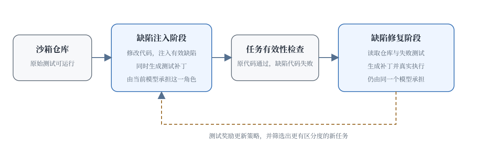

# 20.3 Self-Play SWE-RL

假设我们只有一个能够安装依赖并运行测试的开源仓库，没有人工 issue，也没有正确补丁。模型先修改代码，故意让某个新测试失败；随后它只根据测试补丁和当前仓库寻找修复。修好以后，这一轮“注入与修复”就变成了新的训练经验。

这就是 [Self-play SWE-RL（SSR）论文](https://arxiv.org/abs/2512.18552)研究的问题：怎样让一个软件 Agent 在真实仓库中自己制造难度逐渐增加的练习，而不依赖人工标注的 issue 和测试。论文使用**同一个模型**交替注入与修复缺陷，缺陷由测试补丁形式化描述。



## 自出题与自修复

Self-play 的基本思想是让当前策略同时产生挑战和应对挑战的经验。SSR 把它放进可执行软件仓库，流程可以先化简为两个角色；这里的 Player A 与 Player B 是便于讲解的角色名称，论文实现仍可共享同一个模型：

```text
┌──────────────────────────────────────────────────────────┐
│ Player A (Bug Generator):                                │
│   - 在仓库中找一个地方注入 bug                           │
│   - 生成对应的测试（验证 bug 存在）                       │
│   - 生成对应的 issue 描述                                │
├──────────────────────────────────────────────────────────┤
│ Player B (Bug Fixer):                                    │
│   - 看到 issue 描述                                      │
│   - 尝试修复                                              │
│   - 跑测试验证                                           │
├──────────────────────────────────────────────────────────┤
│ RL Update:                                               │
│   - Player A 学会"生成更难的 bug"（Player B 修不好）     │
│   - Player B 学会"修更复杂的 bug"                        │
│   - 形成对抗性提升                                       │
└──────────────────────────────────────────────────────────┘
```

### 离线合成的局限

[20.1 节 SWE-smith](./swe-bench-and-rlvr) 是**离线合成数据**，一次性生成 50K 数据，然后训练。

SSR 在训练过程中持续产生新缺陷。难度能否随能力提高取决于筛选与奖励是否有效，不能仅凭“在线生成”自动保证质量提升。

两者可以按四个维度对比。数据生成上，SWE-smith 一次性完成，SSR 在训练中持续产生；数据难度上，SWE-smith 固定，SSR 随模型能力调整；数据质量上，SWE-smith 与生成器能力无关，SSR 随模型能力提升；适用阶段上，SWE-smith 适合训练初期，SSR 覆盖训练全过程。

### 从一次循环到数据飞轮

理想情况下，修复能力提高会迫使注入阶段提出更难的有效缺陷，新经验再反过来训练修复能力。这种反馈循环通常称为数据飞轮。

```text
强模型 → 生成难 bug + 优秀修复 → 高质量训练数据 → 模型更强 → ...
```

飞轮也可能停转：模型可能反复生成同一种简单缺陷，或者用语法错误制造“难题”。因此后文还要检查缺陷有效性、两种角色的难度平衡和真实 issue 上的迁移。

## 可执行算法

论文由 Meta FAIR 等机构的研究者提出。下面的代码保留原稿的双角色写法，用来解释输入、输出与验证顺序；它是教学化简，不是论文仓库源码。

### 缺陷注入角色

缺陷注入角色读取可运行仓库，输出“注入缺陷后的代码 + 测试补丁”。测试补丁是形式化任务说明：它在原代码上应通过，在注入缺陷后应失败。自然语言 issue 可以作为教学扩展生成，但不是 SSR 训练所必需的输入。

```python
def generate_bug(generator_model, repo, file_path):
    # 1. 选择一个文件
    original_code = repo.read(file_path)

    # 2. 让 generator 注入 bug
    prompt = f"""
    Here is the code in {file_path}:
    {original_code}

    Please:
    1. Choose a function to modify
    2. Inject a subtle bug (logic error, not syntax error)
    3. Generate a test that would fail with the bug
    4. Optionally summarize the failed behavior without revealing the fix
    """

    response = generator_model.generate(prompt)
    bug_code, test_patch, summary = parse_response(response)

    # 3. 验证 bug 是否有效（测试在 bug 代码上失败，在原代码上通过）
    if not validate_bug(original_code, bug_code, test_patch):
        return None  # 无效 bug，丢弃

    return {
        "original_code": original_code,
        "bug_code": bug_code,
        "test_patch": test_patch,
        "summary": summary,
    }
```

### 缺陷修复角色

缺陷修复角色看到注入后的仓库与测试补丁，输出修复 patch。评测阶段才需要验证这种能力能否迁移到自然语言 issue。

```python
def fix_bug(fixer_model, task):
    # 1. 给 fixer 看失败测试与注入后的代码（不给看原代码）
    prompt = f"""
    Failing test patch: {task['test_patch']}

    Current code: {task['bug_code']}

    Please fix the bug.
    """

    # 2. Fixer 用 agentic 方式修复
    trajectory = []
    while not done:
        action = fixer_model.act(prompt)
        trajectory.append(action)

        if action.type == "edit":
            apply_edit(action)
        elif action.type == "test":
            result = run_tests()
            if result.all_passed:
                done = True

    # 3. 计算 reward
    reward = 1.0 if tests_passed else 0.0

    return trajectory, reward
```

### 交替更新的教学伪代码

```python
def ssr_training(generator_model, fixer_model, repo):
    for epoch in range(N_EPOCHS):
        # 1. Generator 生成 bug
        task = generate_bug(generator_model, repo, random_file())

        # 2. Fixer 尝试修复
        trajectory, reward = fix_bug(fixer_model, task)

        # 3. 教学化的零和 reward
        generator_reward = -reward  # Fixer 修不好 → Generator 赢
        fixer_reward = reward       # Fixer 修好 → Fixer 赢

        # 4. 更新两个模型
        update_generator(generator_model, task, generator_reward)
        update_fixer(fixer_model, trajectory, fixer_reward)
```

### 难度的逐步提高

SSR 的训练目标会推动缺陷复杂度逐步上升。为了让这一过程稳定，系统仍需过滤无效缺陷，并避免注入角色仅靠语法错误获得高分。

```text
Epoch 0-100:  Generator 生成简单 typo / 一行 bug
Epoch 100-500: Generator 生成多文件、跨函数 bug
Epoch 500-2000: Generator 生成微妙逻辑错误、跨模块影响
```

上面的 epoch 区间是帮助理解的示意，不是论文公开的固定课程表。实际训练仍要根据缺陷有效率与修复成功率调节采样难度。

## 自我提升的验证

SSR 论文报告的是相对提升：在 SWE-bench Verified 上自我提升 **10.4 个百分点**，在 SWE-Bench Pro 上提升 **7.8 个百分点**；训练过程中也持续优于使用人工数据的基线。评测输入是自然语言 issue，而 self-play 训练没有使用这类 issue，因此这个实验重点检查的是迁移，而不是记住自生成题目。

原稿曾把 Meta SWE-RL、DeepSWE、SSR 以及“SSR + DeepSWE”写进同一个绝对分数榜单。论文没有提供这组统一设置下的 41.0%、50.0%、47.5% 和 53.2% 对比，因此不应把它们当作 SSR 的实验表。保留这组研究问题时，应重新在同一基座模型、scaffold、预算和 Pass@k 口径下测量。

### 数据效率的报告

原稿给出的“50K 离线样本”“5K 种子 + 50K self-play”“5K 种子 + 100K self-play”可以保留为一组实验设计，但对应的 41%、47%、53% 不是 SSR 论文公开结论。真正的数据效率比较还要同时报告：有效缺陷比例、每条经验的环境执行次数、总 token、训练 GPU 时和最终任务增益。

## 飞轮失效

### Generator 可能产生无效 bug

如果 Generator 学会"生成语法错误"的 bug（Fixer 很难修），这其实是无效训练，因为语法错误在真实 SWE 任务中很少见。

缓解方法应先使用可执行规则：测试必须在原代码上通过、在注入后失败，修复后再次通过。LLM judge 可以补充判断缺陷是否像真实维护任务，但不能替代执行验证。

### Generator 和 Fixer 不平衡

如果 Generator 远强于 Fixer，Fixer 永远修不好，训练无信号。如果 Fixer 远强于 Generator，Generator 无法产生有效挑战，curriculum 停滞。

缓解方式是动态调整两者的训练频率，保持平衡。

### 领域漂移

Self-play 生成的 bug 可能与真实 bug 分布不同，比如 Generator 可能集中在某类 bug（typo），而真实世界 bug 类型多样。

缓解：用真实 PR 作为种子，让 Generator 在真实 bug 模式基础上变异。

## 研究方法与商业产品

Cursor、Devin、Trae、Codex 和 Claude Code 都提供多步软件工程能力，但大部分产品没有公开完整训练配方。产品会读文件、编辑和运行测试，并不能单独证明其使用了某篇 SWE-RL 论文的方法。下面保留原稿中的产品观察，同时把推测与公开事实分开。

### Cursor

[Cursor](https://cursor.sh) 是最受欢迎的 AI 代码编辑器之一。它的核心能力：

- **多文件理解**：用 RAG 让模型看到整个项目
- **Agentic 修复**：模型可以自主 read、edit、test
- **基于 Claude Opus + 工具调用**

Cursor 没有公开完整训练方法，因此不能从产品行为反推其训练数据。

### Cognition Devin

[Devin](https://devin.ai) 是 Cognition 推出的"AI 软件工程师"，可以独立完成完整的开发任务（规划、写代码、测试、部署）。

Devin 的完整训练细节不公开。引用其训练方法时，应连接到 Cognition 的原始技术材料并注明版本，不能用产品演示替代训练证据。

### 字节 Trae

[Trae](https://www.trae.ai) 是 AI 编程产品。DeepSWE 来自 Agentica 与 Together AI，因此不能把 Trae 写成“基于 DeepSWE 研究成果”。

### OpenAI Codex（2025+）

OpenAI Codex 提供在隔离环境中处理代码任务的 Agent 能力。具体模型与评测会随产品版本变化，正文不固定绑定到某个模型名称：

- 用 o3 的推理能力做复杂规划
- 与 ChatGPT 集成，可以并行处理多个任务
- 公开评测应记录模型、日期、工具权限与采样预算

### Anthropic Claude Code

[Claude Code](https://docs.anthropic.com/en/docs/claude-code) 是 Anthropic 的代码 Agent 工具。底层可用模型和上下文配置会更新，因此这里保留稳定的产品能力描述：

- 推理模型 + agentic 工具
- 支持在项目中读取上下文、编辑文件和调用开发工具

## 多语言与多仓库扩展

当前 SWE-RL 主要集中在 Python。未来的扩展方向：

### 多语言

- **JavaScript/TypeScript**：Jest、Mocha 测试框架成熟，可以类似 Python 处理
- **Java**：JUnit 测试成熟，但代码风格严格，需要更强的 KL 约束
- **C/C++**：编译型，测试运行慢，对 world model 需求更大
- **Go/Rust**：现代语言，测试覆盖率普遍高，适合 SWE-RL

### 多仓库

- **企业内部代码**：每个公司有自己的代码风格、依赖、测试规范
- **微服务架构**：跨仓库修改、API 兼容性
- **遗留系统**：旧代码、缺测试、文档不全

多仓库扩展需要：

- **快速环境搭建**：每个仓库的依赖管理
- **领域特化 reward**：不同仓库的"好代码"标准不同
- **跨仓库 reasoning**：理解仓库间的依赖关系

## 角色分工

复杂 SWE 任务可能需要多个 agent 协作：

```text
Planner Agent: 分析 issue，制定修复计划
  ↓
Explorer Agent: 在仓库中定位相关文件
  ↓
Editor Agent: 实施修改
  ↓
Tester Agent: 运行测试，反馈结果
  ↓
Reviewer Agent: 检查代码质量
```

这种角色拆分可以在工作流层实现，也可以进一步研究多策略联合训练。仅从产品界面看到多个子任务，还不能判断背后是多个独立 Agent 还是单模型的任务编排。训练这种系统需要：

- **多 agent RL**：联合训练多个 policy
- **通信协议**：agent 间如何传递信息
- **共享 value model**：评估整体 trajectory 质量

这是 [第 19 章 Agentic RL 多智能体部分](../chapter22_agentic/build-agentic-training-system) 在 SWE 领域的具体应用。

## 小结

这一章沿着“任务、奖励、环境、数据扩展”梳理了 RL-based SWE。20.1 节介绍 SWE-bench 与 RLVR 范式，说明 SWE 为什么是 RLVR 的理想战场；补充阅读 SWE-RL 从开放软件演化记录中学习开发者解题过程；20.2 节让 CWM 从环境轨迹学习软件行为，DeepSWE 在真实环境中扩展纯 RL；20.3 节让 SSR 用同一模型交替注入和修复缺陷，减少对人工训练任务的依赖。

核心收获有五点。测试让软件任务获得自动反馈，但测试覆盖率决定奖励是否忠实于真实需求；SWE-RL、CWM 与 DeepSWE 使用不同训练对象和配方，不能用一个“简单奖励”口号概括；显式 world model、value model 和搜索是值得验证的扩展，不能写成论文未公开的既成组件；Self-play 能在没有人工 issue 与测试的情况下产生经验，同时必须过滤无效缺陷并检查真实 issue 迁移；商业代码 Agent 展示了多步工程能力，是否使用某种 RL 配方，需要公开训练材料支持。

后续章节中，[第 17 章 PRM 与搜索](../chapter20_prm_search/outcome-vs-process)对应 SWE-RL 中的逐步奖励；[第 25 章奖励黑客](../chapter30_alignment_failures/classical-failures)对应 SWE 任务的 hacking（如删除测试让奖励变高）；[第 19.10 节 Agentic RL 训练系统](../chapter22_agentic/build-agentic-training-system)对应 SWE-RL 的工程实现。
