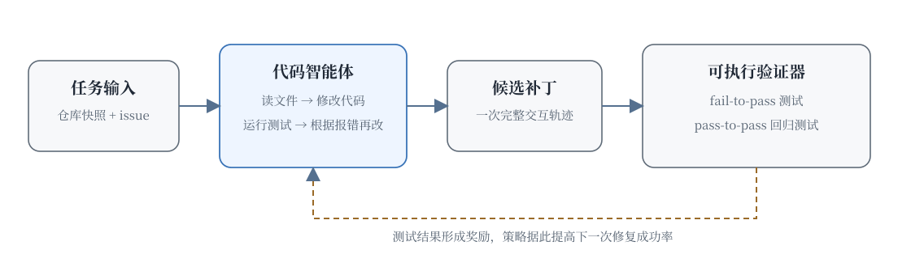
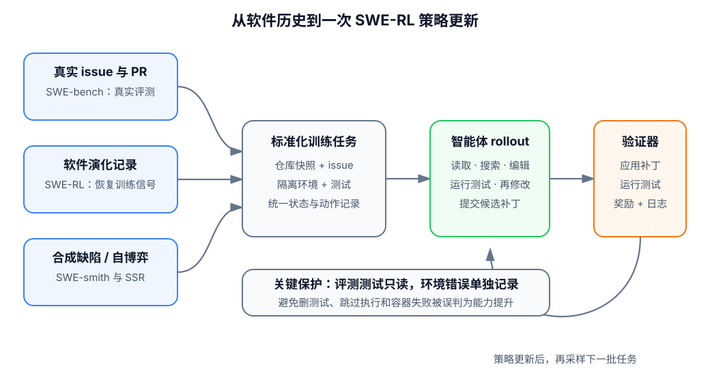

# 20.1 SWE-RL 基础

这一节学习的是一件具体的事：**怎样让语言模型进入一个真实代码仓库，读懂 issue，修改代码，运行测试，并根据测试失败继续修复。**

普通代码生成通常只要求模型补完一个函数。真实软件工程任务多了几层困难：问题可能藏在很长的调用链里，一次修改可能破坏旧功能，测试失败后还要重新定位原因。只看模型最后写出的补丁，无法教会它怎样搜索文件、利用报错和决定下一步动作。SWE-RL 把整段修复过程当作一条可训练轨迹，再用可执行测试提供反馈。

下面从一个只有几行代码的小任务开始。先看清楚一次修复为什么需要多步交互，再逐步进入 SWE-bench、奖励设计和训练数据。

## 从一个真正会失败的小任务开始

假设购物车项目里有下面这个函数：

```python
def average_price(prices):
    return sum(prices) / len(prices)
```

现在收到一条 issue：

> 当购物车为空时，`average_price([])` 应返回 `0.0`，目前会抛出 `ZeroDivisionError`。已有的非空购物车行为不能改变。

仓库中原来只有一条测试：

```python
def test_average_price():
    assert average_price([10.0, 20.0]) == 15.0
```

模型读到“空列表返回 0”后，第一次可能写出一个过宽的修复：

```python
def average_price(prices):
    try:
        return sum(prices) / len(prices)
    except Exception:
        return 0.0
```

空列表测试通过了，但这个补丁把所有异常都吞掉了。如果调用方误传入 `None`，程序也会返回 `0.0`，真正的输入错误因此被掩盖。加入回归测试后，这个问题就会暴露出来：

```python
def test_invalid_input_is_not_hidden():
    with pytest.raises(TypeError):
        average_price(None)
```

模型读取失败信息后，第二次修改只处理 issue 描述的边界情况：

```python
def average_price(prices):
    if len(prices) == 0:
        return 0.0
    return sum(prices) / len(prices)
```

这一次修复包含了一个完整循环：

1. 读取 issue，确认需要保持哪些旧行为。
2. 搜索并打开相关文件。
3. 生成候选补丁。
4. 运行测试，观察失败信息。
5. 根据反馈再次编辑，最后提交补丁。

这五步共同构成一条**轨迹**。设第 $t$ 步看到的仓库状态为 $s_t$，采取的动作 $a_t$ 可以是读文件、搜索、编辑或运行测试，那么一次修复可以写成：

$$
\tau=(s_0,a_0,s_1,a_1,\ldots,s_T).
$$

公式只是在记录一件朴素的事：后一步看到的内容，会受到前一步动作的影响。读错文件会让后面的补丁缺少关键信息；第一次测试失败也可能为第二次修改提供线索。强化学习要改进的对象，正是这条从读取仓库到提交补丁的决策轨迹。



图中的验证器通常是一组能够在隔离环境中运行的测试。候选补丁通过测试后产生奖励；失败日志回到智能体，成为下一步观察的一部分。于是，代码智能体既能在单次任务中返工，也能在许多任务上通过 RL 更新策略。

## SWE-bench 任务

上面的购物车例子是人为构造的。要训练和比较代码智能体，还需要大量来自真实仓库、能够重复运行的任务。[SWE-bench 论文](https://arxiv.org/abs/2310.06770)从 GitHub issue 及其对应的 pull request 中构造了 2,294 个软件工程问题，覆盖 12 个流行的 Python 仓库。每道题都保留了问题发生时的仓库快照，因此模型面对的是当时尚未修复的代码。

### 一道题究竟包含什么

从模型视角看，一道 SWE-bench 题目的输入主要有两部分：

- 指定提交时刻的完整仓库；
- 描述缺陷或功能需求的 issue 文本。

模型要输出可以应用到该仓库的代码补丁。评测系统再把补丁放进容器，运行与该任务对应的测试。官方的 [SWE-bench 评测指南](https://www.swebench.com/SWE-bench/guides/evaluation/)把模型输出保存为 JSONL；最小记录包含任务编号、模型名称和补丁：

```json
{
  "instance_id": "django__django-11099",
  "model_name_or_path": "my-code-agent",
  "model_patch": "diff --git a/... b/...\n..."
}
```

评测器会依次完成以下工作：

1. 还原题目指定的仓库版本。
2. 应用模型生成的补丁。
3. 在隔离的 Docker 环境中安装依赖并运行测试。
4. 检查 issue 对应的行为是否修复，以及原有功能是否回归。
5. 记录 `resolved`、测试日志、补丁和基础设施错误。

这里要分清三种材料。**仓库原有测试**可以被智能体调用，用来定位问题；**最终评测测试**由评测环境掌握，用来判断补丁是否真正解决任务；**开发者的正确补丁**用于构造和核验数据，不应直接作为答案交给模型。把后两者暴露给模型，会让评测变成答案复现。

### 再看一个更接近真实仓库的例子

原稿用 Django 的空 `__in` 查询说明字段之间的关系。下面保留这个场景，但只把它当作教学示意，不冒充 SWE-bench 原题或 Django 的真实补丁。

```text
仓库：一个简化的 Web ORM

Issue：
  当过滤条件是 field__in=[] 时，结果必然为空，
  查询构造器应提前返回，避免访问数据库。

智能体可能经历的动作：
  搜索 “in lookup” → 阅读查询编译器 → 找到空集合分支
  → 修改短路条件 → 运行 lookup 测试 → 运行回归测试

最终评测：
  issue 对应测试通过，并且原有查询行为没有回归。
```

这个例子比购物车函数更难，因为入口 API、查询对象和 SQL 编译器可能位于不同文件。模型需要先判断问题发生在哪一层，再决定修改位置。仓库级任务的难点由此出现：**补丁通常很短，找到正确补丁所需的轨迹却很长。**

### 它与函数补全的区别

HumanEval、MBPP 一类任务通常给出函数签名和说明，模型一次生成完整函数，然后统一运行测试。SWE-bench 把任务扩大到仓库级别：

- 输入从一个函数扩展为 issue 加完整仓库；
- 输出从代码片段变成可以应用的精确补丁；
- 修改可能跨越实现、配置和测试等多个文件；
- 智能体可以多次读取、搜索、编辑和运行测试；
- 最终结果要同时满足新需求与旧功能回归检查。

因此，决定结果的不只有模型参数。文件搜索方式、可用工具、上下文长度、测试时采样次数和最大交互步数，都会改变最后的解决率。比较 SWE-bench 结果时，必须同时报告模型、智能体脚手架和推理预算。

::: details 原稿中的阶段性榜单快照

原稿曾记录“2024 年初约 12%、2024 年中约 25%、2025 年初约 40%、2025 年底约 53%、2026 年初约 65%”这组时间线，并分别关联 SWE-agent、Devin、开源 SWE-RL、NVIDIA 与 Claude 系统。

这组数字没有绑定统一的榜单版本、提交记录、Agent 配置和采样预算，因此不能作为方法优劣的证据。它只保留为历史写作记录。需要引用当前结果时，应从 [SWE-bench 官方站点](https://www.swebench.com/)打开对应榜单条目，并同时记录模型版本、脚手架、评测集与运行设置。

:::

## 测试奖励

SWE-bench 首先是一个评测基准。要把同类任务用于训练，还要把测试结果转成数值反馈。这个过程属于 [RLVR](../chapter18_grpo/rlvr)：奖励由可检查的规则或程序产生，不依赖另一个模型凭感觉打分。

设评测器一共运行 $m$ 个测试，第 $i$ 个测试通过时 $z_i=1$，失败时 $z_i=0$。最直接的奖励是测试通过比例：

$$
R_{\text{test}}(\tau)=\frac{1}{m}\sum_{i=1}^{m}z_i.
$$

这个奖励把“通过了多少测试”映射到 0 到 1 之间。若任务要求全部测试通过才算解决，还可以使用二值奖励：

$$
R_{\text{resolved}}(\tau)=\mathbb{1}\!\left[\sum_{i=1}^{m}z_i=m\right].
$$

第一种写法反馈更密集，修好一部分行为也可能得到分数；第二种写法严格对应整题是否解决。二者服务于不同训练目的，不能把“测试奖励”笼统地说成只有一种形式。

最小实现如下：

```python
def swe_reward(test_results):
    """把一组布尔测试结果转换为通过比例。"""
    passed = sum(test_results)
    total = len(test_results)
    return passed / total
```

### 适合 RL 的条件

代码修复同时具备三个条件：结果可以执行检查，反馈可以自动产生，任务能够从开源软件历史或合成环境中扩展。更重要的是，奖励通常在多步交互后才出现。智能体需要决定：

- 先读哪个文件，搜索哪个符号；
- 修改实现还是修改调用方；
- 运行局部测试还是完整测试；
- 看到报错后继续修补，还是回退错误改动；
- 何时停止探索并提交补丁。

这些动作共同影响最终测试结果。RL 的作用，是提高能够获得高奖励的整条轨迹的概率，而不只是模仿某一份最终 diff。

如果还不熟悉“模型怎样调用搜索、编辑和测试工具”，可以先回看 [19.1 Agentic RL 基础](../chapter22_agentic/overview)。这里继续关注测试反馈怎样进入奖励。

### 测试信号的边界

测试只检查已经写进验证器的行为。覆盖不完整时，模型可能得到高分，却没有满足真实需求。例如：

- 删除或跳过失败测试；
- 对公开样例写死答案；
- 为修复一个边界情况破坏未覆盖的旧功能；
- 修改测试入口，让评测器误以为测试已经运行。

因此，训练环境要把评测测试放在智能体不可修改的位置，并区分“测试失败”和“环境没有成功启动”。最终评估还应检查补丁内容、回归行为和基础设施日志。测试提供了可规模化的近似信号，测试设计决定这个信号与真实软件需求有多接近。

## 训练任务的来源

有了验证器，还需要足够多的题目。真实 PR、软件演化记录、合成缺陷和自博弈分别解决不同的数据问题。它们之间存在联系，但并不是同一篇论文或同一条固定训练配方。



### SWE-bench 的评测任务

[SWE-bench](https://arxiv.org/abs/2310.06770)从真实 GitHub issue 及其对应修复中恢复仓库快照、问题描述和评测条件。它的主要价值是建立接近真实维护工作的标准评测。原始数据包含 2,294 个问题；数据清洗还要处理依赖安装、测试不稳定、issue 与补丁对应关系等困难。

真实任务的优势是自然，局限也很直接：高质量、可复现、带充分测试的 PR 数量有限。企业内部提交历史可以补充特定代码库的演化记录，但还要处理权限、隐私和软件许可。

### SWE-RL 的训练信号恢复

[SWE-RL 论文](https://arxiv.org/abs/2502.18449)研究的是怎样利用开源软件演化记录训练代码模型。数据不只包含 benchmark 题目，还包括代码快照、变更、issue 和 pull request 等演化信息。论文采用轻量规则奖励，例如比较模型解法与开发者真实解法的相似度，并报告 Llama3-SWE-RL-70B 在 SWE-bench Verified 上达到 41.0%。

这里需要特别区分：SWE-RL 论文的核心奖励不能简化成“所有隐藏测试都通过就得 1 分”。补丁相似度奖励、测试奖励和过程奖励检查的是不同对象。引用实验结果时，应说明训练数据、奖励定义和评测环境，避免把后续系统的通用做法倒写成论文原方法。

### SWE-smith 的缺陷合成

[SWE-smith 论文](https://arxiv.org/abs/2504.21798)从另一个方向扩大数据。它为 Python 仓库建立可执行环境，再向原本能够通过测试的代码注入缺陷。只有确实让现有测试失败的变异，才形成可验证的修复题。论文构造了 50,000 个任务实例，来自 128 个 GitHub 仓库，并用这些数据训练出 SWE-agent-LM-32B；论文报告该模型在 SWE-bench Verified 上达到 40.2% Pass@1。

合成任务可以控制数量和缺陷类型，还能保证错误会触发测试。代价是缺陷分布受到变异器限制，未必完全等同于开发者在真实项目中遇到的问题。数据规模扩大后，仍要用真实任务检查迁移能力。仓库构建与缺陷筛选的细节见 [SWE-smith 数据构造](../chapter22_agentic/agent-data-swe-smith)。

### SSR 的交替出题与修题

[Self-play SWE-RL](https://arxiv.org/abs/2512.18552)继续减少对人工 issue 的依赖。模型先向可运行仓库注入一个由测试补丁描述的缺陷，再尝试修复它；测试补丁负责说明“什么行为现在错了”。同一个模型交替练习出题与解题，任务难度可以随能力提高而变化。详细过程放在 [20.3 Self-Play SWE-RL](./self-play-ssr-and-summary) 中展开。

这四条路线可以按用途理解：SWE-bench 负责建立真实评测，SWE-RL 利用软件演化记录训练，SWE-smith 规模化合成可执行缺陷，SSR 探索自博弈数据循环。

## 奖励整形项

测试通过比例是一个清楚的起点，但它只反映最终行为。真实训练系统有时还会加入轨迹成本、补丁质量或上下文效率等 shaping 项。下面保留原稿中的四种设计，把它们作为**可选的教学方案**，而不是某篇论文共同采用的标准配方。

### 1. 测试通过比例

```python
reward = passed / total
```

它为部分修复提供连续反馈。风险是模型可能优先修复大量简单测试，而放弃少数真正定义核心需求的测试。若测试重要性不同，可以按测试组加权，最终是否解决仍应单独报告。

### 2. 轨迹长度惩罚

```python
reward -= 0.01 * len(trajectory)
```

这个项鼓励减少无效搜索、重复读取和没有依据的试改。系数过大时，模型可能为了少走几步而过早提交。训练日志需要同时观察解决率与平均步数，不能只看总奖励。

### 3. 补丁质量评分

```python
patch_quality = score_patch(model_output)  # 例如静态检查或独立审查器
reward += 0.1 * patch_quality
```

它可以惩罚重复代码、无关大改动或明显破坏接口的补丁。若 `score_patch` 使用 LLM judge，评分器本身会带来偏差和额外成本。可执行静态检查、补丁大小约束与人工抽检通常更容易解释。

### 4. 上下文使用效率

```python
context_efficiency = relevant_files_read / total_files_read
reward += 0.05 * context_efficiency
```

这个项希望减少“把整个仓库全部读一遍”的浪费。真正的难点在于训练时怎样定义 `relevant_files_read`：若只把开发者补丁涉及的文件标为相关，模型为了理解调用链而读取的上游文件可能被错误惩罚。因此，它更适合作为诊断指标，经过验证后再进入奖励。

把这些项组合起来时，可以写成：

$$
R(\tau)=R_{\text{test}}(\tau)
-\lambda_{\text{step}}C_{\text{step}}(\tau)
+\lambda_{\text{patch}}Q_{\text{patch}}(\tau)
+\lambda_{\text{ctx}}E_{\text{ctx}}(\tau).
$$

其中，$C_{\text{step}}$ 表示交互成本，$Q_{\text{patch}}$ 表示补丁质量，$E_{\text{ctx}}$ 表示上下文效率；三个 $\lambda$ 系数控制各项在总奖励中的权重。公式的意义是把多个训练偏好合并到一个标量中。每加入一项，也会多引入一个可能被模型利用的漏洞，所以应先验证最小测试奖励，再逐项做消融实验。

## 一条最小可运行的 SWE-RL 训练闭环

前面的材料可以接成四个环节：

```text
任务采样
  仓库快照 + issue + 隔离环境
        ↓
智能体 rollout
  read → search → edit → test → edit → submit
        ↓
可执行验证
  应用补丁 → 运行任务测试与回归测试 → 生成奖励和日志
        ↓
策略更新
  提高高奖励轨迹的概率，再采样下一批任务
```

### 任务采样

训练器选择一个仓库快照和 issue，启动干净的容器。相同任务的多条轨迹必须从相同初始状态开始，否则奖励差异可能来自环境残留。

### 智能体 rollout

模型通过工具读取文件、搜索符号、编辑代码和运行可见测试。每一步都记录观察、动作、工具输出与 token 消耗。长轨迹容易遇到上下文溢出、错误累积和环境超时，这些都需要在训练数据中显式区分。

### 可执行验证

验证器把最终补丁应用到只读基准副本，运行任务测试与回归测试。依赖安装失败、容器超时和测试失败应使用不同状态码；前两者属于基础设施问题，不能直接当作模型能力失败。

### 策略更新

训练算法根据同一任务的多个 rollout 及其奖励更新策略。可以使用 PPO、GRPO 或其他策略优化方法。SFT 冷启动、拒绝采样和二次 SFT 都是可选环节，具体论文可能只采用其中一部分。

如果要把这四个环节真正接成系统，可以继续参考 [19.10 从零实现 Agentic RL 训练系统](../chapter22_agentic/build-agentic-training-system)。

::: details 原稿中的五步扩展配方

原稿把工程流程写成“代码预训练模型 → 可选 SFT 冷启动 → PPO/GRPO 训练 → 可选拒绝采样与二次 SFT → SWE-bench Verified 和内部集评测”。这条配方仍可作为系统设计清单，但不能说所有 SWE-RL 方法都采用了与 DeepSeek-R1 完全相同的 SFT、RL、二次 SFT 组合。

数学推理的验证器通常检查最终答案，软件工程验证器则运行补丁和测试。二者都属于 RLVR，环境状态、动作空间、轨迹长度和失败类型却明显不同。算法名称相同，不代表训练系统只需要替换一行奖励函数。

:::

## 评测检查

训练奖励升高之后，还要确认模型真的更会修仓库。至少要分别检查下面几类结果：

- **需求是否解决**：issue 对应测试是否通过。
- **旧功能是否保留**：回归测试是否继续通过。
- **补丁是否有效**：评测器是否真的应用了非空补丁，测试是否实际执行。
- **环境是否健康**：依赖安装、容器启动和测试超时是否独立统计。
- **代价是否可接受**：每题使用多少 token、工具调用、采样次数和运行时间。
- **比较是否公平**：模型、脚手架、工具权限、最大步数和测试时预算是否一致。

SWE-bench Verified 是经过人工核验的 500 题子集，常用于减少原始任务中的歧义与不可复现问题。即使使用同一个子集，不同 Agent scaffold 和测试时扩展策略也会产生明显差异。论文结果适合在完整设置一致时比较，单独摘出一个百分比很容易得出错误结论。

## 小结

现在可以把整条主线连起来：真实 issue 或合成缺陷提供任务，仓库快照提供初始环境，代码智能体通过多步工具调用生成补丁，可执行测试把补丁转成奖励，RL 再提高成功轨迹出现的概率。

SWE-bench 解决了“怎样标准化真实仓库修复并进行评测”；SWE-RL、SWE-smith 和 SSR 分别从软件演化、缺陷合成和自博弈扩展训练数据。测试使反馈可以自动化，也留下了覆盖不足和奖励投机的空间。因此，一个可信的 SWE-RL 系统既要训练模型，也要保护验证器、区分基础设施失败并报告完整推理预算。

接下来可以先看[补充阅读：Meta SWE-RL](./meta-swe-rl)，观察 GRPO 与简单奖励怎样落到真实仓库；随后进入 [20.2 Code World Model 与 DeepSWE](./world-model-and-deep-swe)，继续处理长轨迹训练中的状态建模与稳定性问题。
