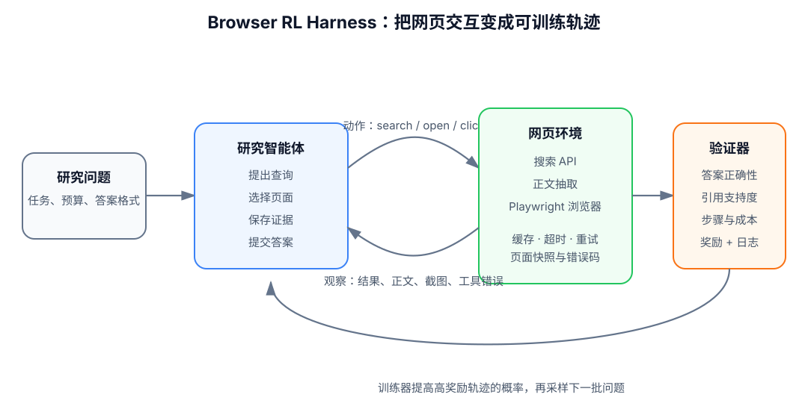
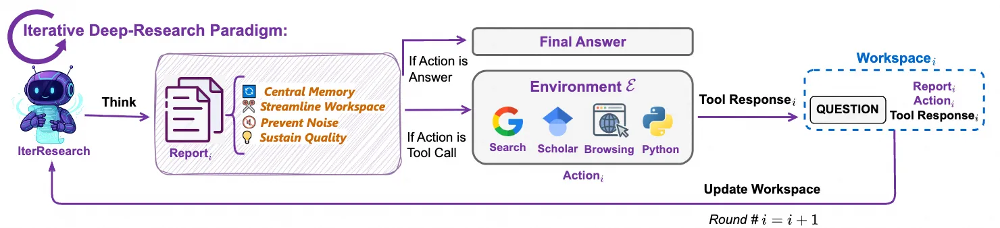
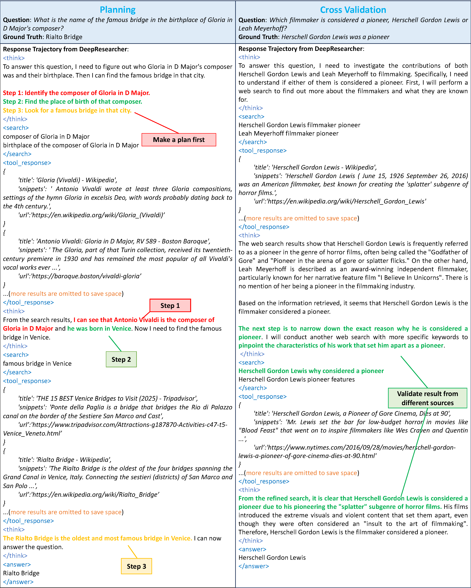
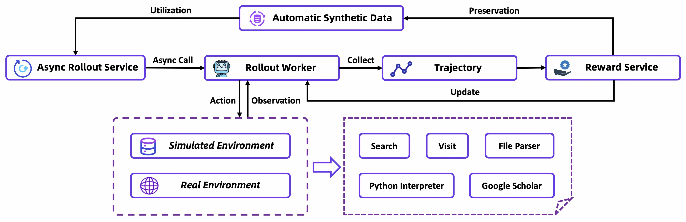
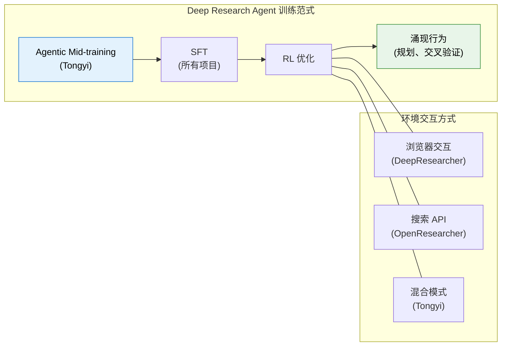
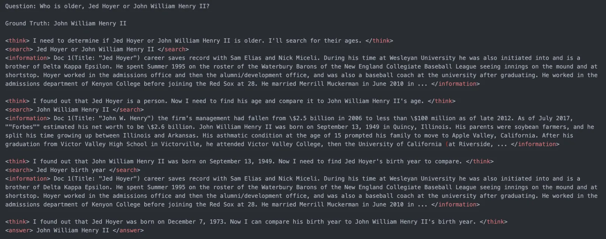
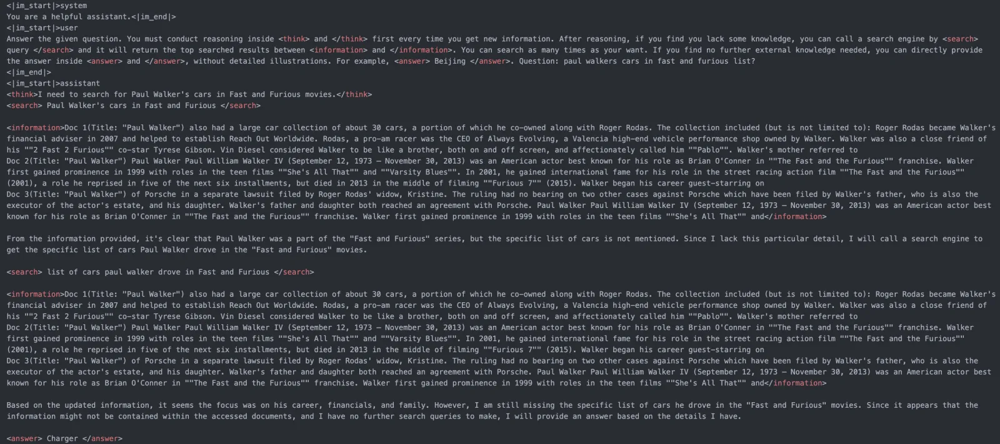
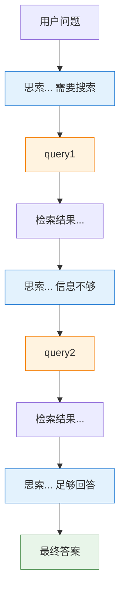
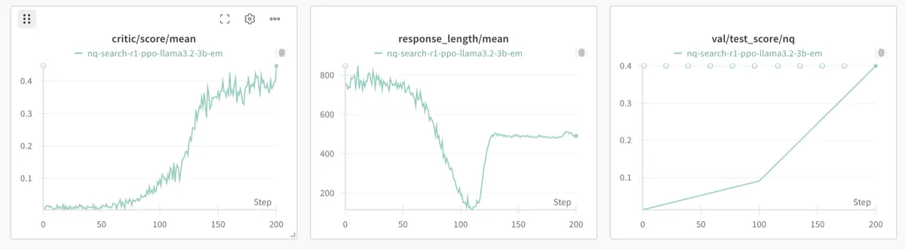

# 21.1 浏览器 RL Harness

这一节学习的是浏览器智能体训练中最基础的工程对象：**Browser RL Harness**。它负责把网页、搜索引擎和模型接成一个可重复运行的强化学习环境，让模型能够搜索、阅读、记录证据，并从最后的答案和引用中获得奖励。

先从一个很小的研究任务开始。假设问题是：“某篇论文的第一作者本科就读于哪所学校？”搜索论文标题后，我们只能得到作者姓名。要继续回答，还要找到作者主页或简历，排除同名人物，并保存能够支持结论的网页片段。

这时，模型面对的已经不是一次文本生成。它要连续决定下一条查询、下一张页面、应当保存的证据，以及何时停止。Browser RL Harness 的作用，就是把这些决定记录成一条可训练、可回放、可评分的轨迹。



<div align="center">
  <em>图 1：Browser RL Harness 的基本闭环。环境返回网页观察，智能体产生搜索或访问动作，验证器检查答案与证据，再把奖励交给训练器。</em>
</div>

## 先完成一次最小研究轨迹

我们先把网页想象成三个已经准备好的页面：

- 页面 A 是论文主页，只写着论文标题和第一作者姓名“Chen Li”；
- 页面 B 是另一位同名工程师的个人主页；
- 页面 C 是论文作者的学校主页，其中写着教育经历。

第一次尝试时，模型搜索“Chen Li undergraduate university”，打开页面 B，然后直接给出答案。文字看起来完整，引用也确实可以访问，但引用指向了错误的人。这条轨迹的最后一句可能碰巧正确，证据链仍然不成立。

第二次尝试多了一步核对：模型先从论文主页取得作者单位，再用“姓名 + 单位 + education”重新查询，最后打开页面 C。此时，姓名、单位与教育经历能够连成同一个人，答案才具备可检查的依据。

把第二次尝试写成动作序列，大致如下：

```text
search("论文标题")
→ open(论文主页)
→ extract(第一作者姓名与单位)
→ search("姓名 + 单位 + education")
→ open(学校主页)
→ cite(教育经历所在段落)
→ answer(学校名称)
```

这个例子展示了 Harness 必须记录的四类信息：当前看到了什么、模型做了什么、网页返回了什么，以及最终依据什么获得分数。缺少其中任何一项，训练失败后都很难判断问题出在模型、网页还是评分器。

## Harness 究竟封装了什么

所谓 Harness，可以理解为“训练用的实验台”。它把不稳定的真实网页整理成一组明确接口，让同一套模型能够反复运行同一类任务。

### 观察

观察 (o_t) 可以是搜索结果、网页正文、DOM 摘要、截图、下载文件，也可以包含前几步保存的研究笔记。完整浏览器状态通常比模型看到的内容更大，因此浏览器任务更接近部分可观测决策过程。

例如，一张网页截图没有直接告诉模型某个按钮是否被浮层遮挡；一段抽取文本也可能丢失表格列名。Harness 要明确规定观察格式，避免训练时一种格式、评测时另一种格式。

### 动作

最小动作空间只需要三个动作：

```text
search(query)     搜索一个查询
open(url)         打开一个结果页面
answer(text)      提交最终答案
```

真实浏览器还会加入 `click`、`type`、`scroll`、`download`、`back` 和 `extract`。动作越接近人类操作，能够处理的网页越多；同时，解析错误、页面超时和不可复现状态也会增加。

### 转移

模型执行 `open(url)` 后，Harness 需要等待页面加载、处理重定向、抽取正文，并把新的观察返回给模型。这个过程就是状态转移：

$$
s_{t+1} \sim P(s_{t+1}\mid s_t,a_t).
$$

这里，(s_t) 表示浏览器和研究工作区的完整状态，(a_t) 表示模型动作。符号 (P) 提醒我们：同一个 URL 在不同时间可能返回不同内容，网络请求也可能失败。真实网络中的转移并不完全确定。

### 奖励与终止

提交答案后，验证器可以检查短答案是否匹配、引用页面是否存在、引用片段是否支持结论，以及是否超过工具预算。任务成功、达到最大步数或发生不可恢复错误时，轨迹结束。

一次完整交互可以写成：

$$
\tau=(o_0,a_0,o_1,a_1,\ldots,o_T,a_T,R).
$$

其中，(R) 是整条轨迹的最终奖励。公式本身并不复杂，它只是要求训练系统保留“观察，动作，下一观察”的先后关系。只有这样，RL 才能判断哪些搜索和阅读决策更可能带来可靠答案。

## 用几十行代码看清最小接口

下面的代码省略真实网络请求，只保留 Gym 风格的 `reset` 和 `step`，先看清训练器与环境之间怎样交换数据。产品级浏览器需要的缓存、重试和安全控制放到后文补充。

```python
class TinyResearchEnv:
    def __init__(self, search_backend, verifier, max_steps=8):
        self.search_backend = search_backend
        self.verifier = verifier
        self.max_steps = max_steps

    def reset(self, question):
        self.question = question
        self.history = []
        self.steps = 0
        return {"question": question, "history": []}

    def step(self, action):
        self.steps += 1

        if action["name"] == "search":
            observation = self.search_backend.search(action["query"])
            reward, done = 0.0, False

        elif action["name"] == "open":
            observation = self.search_backend.open(action["url"])
            reward, done = 0.0, False

        elif action["name"] == "answer":
            observation = {"status": "submitted"}
            reward = self.verifier.score(
                question=self.question,
                answer=action["text"],
                history=self.history,
            )
            done = True

        else:
            observation = {"error": "unknown action"}
            reward, done = -0.1, False

        self.history.append((action, observation))
        truncated = self.steps >= self.max_steps
        return observation, reward, done, truncated
```

我们可以先用固定规则 agent 做 smoke test：搜索一次、打开第一个结果、提交其中的标题。此时不追求高准确率，只检查环境能否稳定返回观察、错误动作能否被识别、最大步数能否终止任务、相同输入能否回放。

等这些接口稳定后，再把规则 agent 换成语言模型。这样做可以把“环境坏了”和“模型策略差”区分开。

## 三种网页环境，从简单到真实

Browser RL 并不要求第一天就启动完整浏览器。环境可以按保真度逐步增加。

### 搜索 API

搜索 API 直接返回标题、摘要和 URL。观察结构规整，速度快，也便于缓存。Search-R1 采用的离线检索环境就属于这一类；论文还通过 **retrieved token masking**，让检索返回的文字不参与模型策略损失，只对模型自己生成的 token 求梯度。参见 [Search-R1 论文](https://arxiv.org/abs/2503.09516)与[官方代码](https://github.com/PeterGriffinJin/Search-R1)。

这种环境适合研究“模型何时搜索、怎样改写查询”。它无法覆盖登录、动态加载、按钮点击和复杂表格等真实网页交互。

### 网页正文抽取

第二层增加 `open(url)`，把网页正文抽取成干净文本。模型可以核对来源、保存引用片段，并处理搜索摘要没有展示的信息。

正文抽取会引入新问题：导航栏和广告可能混入正文，JavaScript 页面可能抽取为空，PDF 和表格也需要独立解析器。Harness 应把“页面不可访问”“抽取失败”“正文确实没有答案”记录成不同状态。

### Playwright 浏览器

第三层使用 Playwright 一类浏览器控制工具，让模型点击、输入、滚动和下载文件。它能够处理真实网站，也最容易受到弹窗、验证码、页面改版和网络波动影响。

因此，训练通常先在缓存语料或模拟环境中验证算法，再把一部分轨迹迁移到真实网络。[DeepResearcher](https://arxiv.org/abs/2504.03160)强调真实开放网络训练的价值；[Tongyi DeepResearch](https://tongyi-agent.github.io/blog/introducing-tongyi-deep-research/)则同时使用模拟与真实环境，并通过缓存、重试和备用搜索服务减少工具故障污染奖励。

### 混合环境

实际系统常把三层组合起来：先用搜索 API 找候选来源，再用正文抽取读取大多数页面，只有遇到动态站点时才启动浏览器。这样可以把高成本交互留给真正需要它的页面。

此时 Harness 还要记录每种工具的成本和失败率。否则，一个多用十倍浏览器调用的系统可能获得更高准确率，却无法判断提升来自更好的策略还是更大的预算。

## 什么是 Deep Research Agent

有了 Harness，我们再给任务命名。**Deep Research Agent（深度研究智能体）**会把多次检索、阅读、证据核对和报告写作组织成一条长轨迹。普通搜索返回一组链接；研究智能体还要决定下一次搜索什么、哪些来源能够互相支持、现有证据是否足够，以及什么时候停止。

完成订票、填写表单等 Web Agent 任务时，目标通常是让网页进入某个状态。Deep Research 更关注一条结论是否被多源证据支持。它的交互往往更长，评分也会同时检查答案、引用、过程与成本。

## 第一层 从 ReAct 到长程研究协作

Deep Research Agent 的推理方式并不是一步到位的。过去两年里，这条路线大致经历了三个层次的演化：


_图：Deep Research Agent 多种技术路线对比（来源：[Tongyi DeepResearch](https://tongyi-agent.github.io/blog/introducing-tongyi-deep-research/)）_

1. **ReAct：边想边做的基础闭环**
   - 核心模式是 Thought → Action → Observation。
   - 适合短链路任务：先搜索、再打开网页、再基于观察继续下一步。
   - 它解决的是"模型能不能开始用工具"这个问题。

2. **Iterative Research：面向长程任务的迭代研究**
   - 当任务从"找一个答案"变成"写一份可信研究报告"时，单纯的 ReAct 已经不够。

   
   _图：Tongyi DeepResearch 的迭代研究范式（来源：[Tongyi DeepResearch](https://tongyi-agent.github.io/blog/introducing-tongyi-deep-research/)）_
   - 模型需要反复执行"检索 → 阅读 → 比较来源 → 修正假设 → 再检索"的循环。
   - 这一层的关键不再只是工具调用本身，而是长程规划、交叉验证和上下文压缩。

3. **Multi-agent Synthesis：分工协作的信息综合**
   - 当任务规模进一步增大，系统会把单个研究员拆成多个角色，例如搜索、阅读、证据整理、最终写作。
   - 多智能体的价值不只是并行加速，更在于把"发现信息"和"综合信息"分离，减少单条轨迹的认知负担。
   - DeepResearcher、Fathom-DeepResearch 一类工作都体现了这种趋势。

可以把三者理解为同一条能力链上的不同阶段：**ReAct 负责打通工具闭环，iterative research 负责把闭环拉长，multi-agent synthesis 负责把长程研究任务做结构化分工。** Agentic RL 的作用，则是让模型不只会照着模板调用工具，而是在真实反馈中逐渐学会什么时候搜索、什么时候停止、什么时候需要交叉验证。

## 第二层 长程研究的系统组织

以下是目前最具代表性的开源 Deep Research 模型及训练框架。它们的共同目标是将 LLM 从"聊天模型"进化为"研究模型"。

### DeepResearcher 的端到端 RL 训练

DeepResearcher 是首个在**真实的、动态的开放网络环境**中进行端到端 RL 训练的框架 [^deepresearcher]。之前的工作大多在受控的 RAG 环境中训练，或者依赖精心设计的 prompt 工程，DeepResearcher 直接让模型与真实的搜索引擎和网页交互，从真实反馈中学习。

它的架构采用了多智能体协作：专门的"浏览智能体（Browsing Agents）"负责从复杂网页结构中提取信息，主智能体负责规划研究策略和综合信息。训练目标是纯粹的答案正确性（RLVR），不引入任何过程奖励。


_图：DeepResearcher 经 RL 训练后涌现的高级行为案例（来源：[GAIR-NLP/DeepResearcher](https://github.com/GAIR-NLP/DeepResearcher)）_

DeepResearcher 的定性分析观察到一些没有写成独立监督标签的行为，包括：

1. **规划（Planning）**：模型学会了在搜索前先分解问题，制定多步搜索计划
2. **交叉验证（Cross-verification）**：模型主动从多个来源验证同一事实，而非只信任第一个搜索结果
3. **自我反思与重定向**：模型在搜索结果不理想时，能自主调整研究方向
4. **诚实表达**：当无法找到明确答案时，模型学会了坦诚而非编造

这些结果说明，终态奖励可能间接提高规划、交叉验证与失败重定向的出现频率。定性案例不能单独证明每种行为都来自 RL；还要结合基线轨迹与消融实验判断变化来源。

### Tongyi DeepResearch 的两阶段训练

阿里巴巴通义实验室的 Tongyi DeepResearch 技术报告给出了从 Agentic CPT、SFT 到 on-policy RL 的完整路线 [^tongyi_dr]。模型共有 30.5B 参数，每个 token 激活 3.3B 参数；报告在多项深度研究基准上给出了结果。跨系统比较时还要同时核对工具、预算和测试时扩展设置。


_图：Tongyi DeepResearch 的异步 RL 训练架构（来源：[Tongyi DeepResearch](https://tongyi-agent.github.io/blog/introducing-tongyi-deep-research/)）_

**两阶段训练范式。** Tongyi DeepResearch 的核心创新是提出 **Agentic Mid-training + Post-training** 两阶段流水线：

1. **Agentic Mid-training（Agentic CPT）**：在合成的大规模工具调用轨迹上进行持续预训练。分两步：先在 32K 上下文上训练基础 agentic 能力，再扩展到 128K 引入长序列（64K-128K）agentic 行为数据。这一阶段的目标不是教模型"怎么做好研究"，而是赋予它**agentic 行为的归纳偏置**，让模型在接触具体研究任务之前，就已经"熟悉"工具调用的基本模式。少量通用预训练数据穿插其中，防止模型丧失通用语言能力。

2. **Agentic Post-training**：分为三步，SFT 冷启动（在高质量合成轨迹上学习研究模板）、on-policy RL（用定制化 GRPO 在真实+模拟环境中优化策略）、模型合并（将不同能力偏好的模型变体通过参数平均融合）。

**两项关键技术。** 除了训练范式，Tongyi DeepResearch 还有两项值得关注的工程创新。**Context Management 推理范式**针对长程研究的核心瓶颈，即上下文窗口有限：每一步不保留完整历史，而是基于马尔可夫状态重建维护一个不断更新的“研究报告摘要”作为压缩记忆，让模型在任意深度的探索中保持推理能力。**分阶段环境策略**让不同训练阶段使用不同保真度的环境：Mid-training 使用“先验世界环境”（零成本、零交互）和“模拟环境”（低成本、可控）；Post-training 的 RL 阶段先在模拟环境验证算法，再部署到真实环境做最终训练，避开了真实环境 API 不稳定、高延迟、高成本的问题。

在 BrowseComp、WebWalkerQA、FRAMES、HLE 等多个深度研究 benchmark 上达到 SOTA [^tongyi_dr]。

### PokeeResearch-7B 的小模型表现

PokeeResearch-7B 提供了一个 7B 规模的研究模型 [^pokeeresearch]。它适合研究模型规模较小时，工具接口、检索质量和领域数据能补偿多少参数差距。能否在消费级 GPU 上完整运行，还取决于量化方式、上下文长度和工具服务，部署报告应给出实际显存与吞吐。

### SFR-DeepResearch 的自主单智能体

Salesforce 的 SFR-DeepResearch 走了一条与多智能体不同的路线：**自主单智能体**（Autonomous Single Agent）[^sfr_dr]。它不将研究流程拆分为搜索、阅读、写作等多个角色，而是让一个模型端到端完成全部研究流程。

这一路线的优势是**架构简洁**，没有多智能体之间的通信开销和协调成本。但挑战也很明显：单模型需要同时掌握搜索策略、信息综合、长文本生成等多种能力，容易产生能力冲突。SFR 的解法是在**推理增强模型**（已经在数学、代码等领域经过 RL 训练的模型）上继续用 RL 做 agent 训练，利用模型已有的强推理能力来支撑研究任务。

### rStar2-Agent 的训练效率

rStar2-Agent 使用基于 GRPO 的 agent RL 方法训练 14B 推理模型 [^rstar2]。它主要提供训练效率与 agentic reasoning 的经验，并不是专门的 Deep Research 系统；放在这里是为了观察采样和优势估计怎样迁移到搜索型智能体。



## 第三层 从最终答案到过程奖励

DeepResearcher 与 Search-R1 表明，终态答案奖励可以学出有用搜索行为。轨迹变长后，这个信号会变得稀疏：模型知道整题得分，却很难判断几十个动作中哪些真正有帮助。下面几项工作尝试增加引用或过程信号。

### CaRR 的引用感知奖励

**问题**：Deep Research Agent 可能编造 URL，也可能引用真实论文却歪曲其结论。只检查最终答案的 outcome reward 无法识别这类引用错误。

**方案**：清华大学与智谱 AI 联合提出的 Citation-aware Rubric Rewards（CaRR）[^carr_dr] 将引用质量显式编码进 RL 奖励函数。其核心思路并非简单地施加惩罚，而是计算一个正向的比率奖励，具体流程如下：

1. **Rubric 分解**：将多跳问题分解为一系列原子事实陈述（Rubrics），每个 Rubric 包含待验证的隐藏实体。
2. **实体识别**：由评判模型检查模型的最终回答中是否识别了每个 Rubric 中的关键实体。
3. **引用验证**：提取回答中引用的 URL（最多 20 个），获取网页内容，由评判模型判断每条 Rubric 是否被引用内容所支持。
4. **证据连通性**：构建二分图，通过广度优先搜索验证各 Rubric 是否在逻辑上与最终答案相连通。

最终奖励为被满足且逻辑连通的 Rubric 数量占总 Rubric 数量的比率。该比率奖励与结果奖励（答案是否正确）按可调权重 $\alpha$ 进行混合，作为 GRPO 训练的综合奖励信号。

**启示**：CaRR 的设计思想可以推广到其他需要"可验证性"的场景，不只是引用，代码是否能执行、数学推导是否正确，都可以用类似的"分解→验证→计算比率"框架来设计奖励。

### Atom-Searcher 的原子思维奖励

**问题**：Deep Research 的研究轨迹可能长达几十步。如果只用终态 reward（答案对=1，错=0），信用分配（credit assignment）几乎不可能做好，模型完全不知道这几十步中哪些是关键的好决策，哪些是凑巧没影响的坏决策。

**方案**：Atom-Searcher 提出了**原子思维奖励（Atomic Thought Reward, ATR）**[^atom_searcher]，将复杂推理分解为原子级单元，并在每个中间步骤给予过程奖励。核心思想是：与其等到最终答案出来再给 reward，不如在每个"原子推理步骤"上就给反馈。

**为什么是"原子"而不是"步骤"？** 注意 ATR 不是简单的"每步打分"。它先将推理链分解为不可再分的原子单元（如"从 A 推导出 B"），然后对每个原子单元独立评估逻辑正确性和信息价值。这种分解方式比步骤级打分更精细，也比 token 级打分更有语义意义。

**实践价值**：ATR 主要在训练初期发挥作用。当模型还没有形成稳定的研究策略时，密集的过程信号能大幅加速收敛。一旦模型学会了基本的研究模式，可以逐步退火 ATR 的权重，回归到终态 reward 主导，这和人类学习的过程一致：先学每一步怎么做，再学会评价整体结果。

### DR Tulu 的演化评分标准

**问题**：RL 训练中的经典陷阱是 **Reward Hacking**。模型会找到评分标准的"漏洞"来获取高分，而不是真正提升研究质量。比如发现"引用越多分越高"就堆砌引用，发现"答案越长分越高"就疯狂注水。一旦模型学会了钻空子，训练就陷入了"刷分但不进步"的死循环。

**方案**：Allen AI 的 DR Tulu 提出了 **RLER（Reinforcement Learning with Evolving Rubrics）**[^dr_tulu]，让评分标准本身随训练动态演化。它的核心策略是"打移动靶"：

1. **训练初期**：用宽松的 Rubrics 鼓励模型探索。比如"只要有引用就给分"，不苛求引用质量
2. **训练中期**：当模型在当前标准下刷分到一定程度后，自动收紧标准。比如"引用必须可访问才给分"
3. **训练后期**：用严格的标准提升最终质量。比如"引用内容必须支持论断才给分"

每次标准收紧，之前模型学会的"捷径"就不再有效，迫使模型去寻找真正提升质量的策略。

**启示**：RLER 的思想可以类比于教育中的"升级考试"，不能永远做同一套题，标准要随着学生水平提高而提高。这一策略与 CaRR 的引用验证、Web-Shepherd 的过程评分天然互补。

### Memento 的免微调 RL

**问题**：RL 训练需要大量计算资源、复杂的工程基础设施、以及稳定的环境交互。对于很多团队来说，这套门槛太高了。有没有更轻量的方式让 Agent 变强？

**方案**：Memento 提供了一条完全不同的技术路线 [^memento]，**不修改模型参数**，而是通过外部"情景记忆"（Episodic Memory）让 Agent 在推理时检索相似案例来指导行为。具体来说：

1. **案例积累**：将过去成功和失败的研究轨迹存储为案例
2. **案例检索**：面对新问题时，从记忆中检索最相似的成功案例
3. **策略指导**：将检索到的案例作为上下文提供给模型，引导它采取类似的成功策略

**为什么这很重要？** Memento 在 GAIA 验证集上排名第一（87.88% Pass@3），超越了许多经过大量 RL 训练的模型。它有力地证明了：**有时候"更好的检索"比"更好的训练"更有效**。这也提示我们，RL 并非提升 Agent 能力的唯一路径，外部记忆与推理时策略同样是值得关注的方向。对于资源受限的团队，Memento 路线的性价比可能远高于完整的 RL 训练。

### Web-Shepherd 的步骤级过程奖励

**问题**：在网页交互场景中，outcome reward（只看最终答案对不对）的信息量极低。一个 Agent 可能搜索了 30 次，其中 28 次都在做无效操作，但碰巧最后一次搜到了正确答案，outcome reward 会给这整条轨迹打高分，实际上强化了大量无效行为。

**方案**：Web-Shepherd 专门训练了一个**步骤级过程奖励模型（PRM）** 来评估网页交互的每一步质量 [^web_shepherd]。与 ORM（Outcome Reward Model）不同，PRM 为每一步独立打分，提供密集的训练信号。

**关键设计**：Web-Shepherd 的 PRM 为网页导航轨迹中的每一步独立评估质量，比传统的 outcome reward 提供了更密集、更准确的训练信号。

**实验结果**：PRM 能带来 10.9 个百分点的性能提升。这个数字看似不大，但考虑到这纯粹来自"更准确的奖励信号"而非任何模型架构或数据改进，其实际意义非常大，它直接证明了**过程级信号的实用价值**。

**与其他工作的关系**：Web-Shepherd 的 PRM 与 Atom-Searcher 的 ATR 有相似目标（提供过程级信号），但粒度不同，PRM 按步骤打分，ATR 按原子推理单元打分。两者可以互补使用。

## 第四层 训练轨迹的来源

长程、高质量的研究轨迹是训练 Deep Research Agent 的关键输入，也是最大的瓶颈。以下工作专注于解决这个问题。

### OpenResearcher 的开源轨迹合成

**问题**：训练 Deep Research Agent 需要大量长程研究轨迹，但真实网络环境不稳定、API 调用昂贵、且难以复现。大多数研究团队没有条件大规模采集真实轨迹。

**方案**：OpenResearcher 提供了一个**完全离线、零网络依赖**的轨迹合成流水线 [^openresearcher]。它在大规模预下载的本地语料库上工作，核心是三个模拟的"浏览器原语"：`search`（搜索）、`open`（打开文档）、`find`（查找内容）。这三个操作足以覆盖大部分研究场景，且完全可控、可复现。

**规模与质量**：OpenResearcher 生成了超过 97K 条轨迹，其中部分轨迹包含 100+ 次工具调用。这些轨迹覆盖了从简单事实查询到复杂多步推理的各种难度。

**实践价值**：对资源有限的研究者来说，OpenResearcher 是最友好的起点，不需要 API key，不需要 GPU 集群，一台普通电脑就能跑通整个合成流程。它也是验证新算法的绝佳工具：在一个完全可控、可复现的环境里快速迭代。

### Tongyi DeepResearch 的自动数据合成管线

Tongyi DeepResearch 的数据合成管线 [^tongyi_dr] 是其核心创新之一，完全自动化且无需人工标注。它采用**分阶段、复杂度递增**的策略，为不同的训练阶段定制不同类型的数据。

**Mid-training 阶段**合成大规模 agent 行为数据，覆盖研究的完整生命周期，包括四类动作数据：**问题合成**基于实体锚定的开放世界记忆生成多风格问题（多跳推理、数值计算等）；**规划动作**做问题分解与首步行动预测，规划准确性直接决定任务能否成功；**推理动作**在给定问题和相关知识后生成完整的逻辑推理链，并通过推理长度和答案一致性双重过滤保证质量；**决策动作**在轨迹的每个决策点探索可行动作空间，将轨迹重构为多步决策序列。

**Post-training 阶段**通过知识图谱随机游走构建高互连性信息结构，用形式化方法（基于集合论）对信息检索问题进行建模，逐步增加不确定性来提升问题难度，最终生成超人级的问答对和 PhD 级研究问题。

**"数据飞轮"机制**：这套管线最独特的地方在于它能自我进化。完成一轮训练后，得到的更强模型可以反过来生成更高质量的合成数据，形成正反馈循环。这意味着训练数据的质量会随模型能力的提升而持续改善，而不是固定不变的。

### O-Researcher 的多智能体协作与蒸馏

**问题**：如果只用单个 LLM（如直接调用 GPT-4 API）来生成研究轨迹，模型往往会给出肤浅的答案，或者直接跳过搜索步骤靠内部知识“盲猜”，无法生成用于训练 Agent 的、严谨的多步推理轨迹。

**方案**：OPPO AI Agent 团队在 O-Researcher [^oresearcher] 中提出了一种**多智能体蒸馏（Multi-Agent Distillation）** 框架。它不依赖单体模型的一次性生成，而是用多个强大的闭源模型组建一个虚拟的“研究团队”来自动合成高质量的训练数据：

1. **分解与规划 (Planner Agent)**：将复杂的用户提问分解为多个独立的子问题。
2. **搜索与执行 (Searcher/Executor Agent)**：针对每个子问题独立进行网络搜索、网页爬取和信息提取。
3. **综合与总结 (Summarizer Agent)**：将所有搜索到的信息进行交叉验证，并综合成最终的、带有精确引用的研究报告。
4. **辩论与质检 (Reviewer Agent)**：通过多智能体之间的辩论（Debate）和验证，如果发现逻辑漏洞或引用错误，则打回重做。

**核心启示**：这种模拟人类研究团队协作的“多智能体工作流”，强制生成了包含**完整试错、交叉验证和长程推理（Long-Horizon）** 的轨迹。随后，O-Researcher 将这些极其优质的轨迹数据，通过监督微调（SFT）和 Agentic RL（如 GRPO），“蒸馏”到了单个开源小模型（如 7B/72B）上。这证明了：**对于复杂任务，多智能体是合成高质量 SFT 数据（Data Synthesis）的绝佳手段，而最终部署时，我们可以将其能力压缩到一个强大的单体 Agent 中。**

### Fathom-DeepResearch 的多智能体自博弈

**问题**：合成数据通常面临"难度不够"的问题，用 GPT-4 级别的模型生成的研究轨迹，对于训练同级别模型来说可能过于简单。

**方案**：Fathom-DeepResearch 使用**多智能体自博弈**（Multi-agent Self-play）来生成 DUETQA 数据集 [^fathom_dr]。它将两个 4B 参数的模型分别扮演不同角色：**搜索者**（Fathom-Search-4B）负责在网络上搜索和定位信息，**推理者**（Fathom-Synthesizer-4B）负责将搜索到的信息综合为连贯的回答。两个模型通过自博弈协同工作，两者的交互产生了高质量、多样化的训练数据。

**启示**：Fathom 的思路可以类比于 GAN（生成对抗网络），用两个模型的对抗来提升数据质量。即使总参数量不变，将能力拆分为专门的子模型也能解锁更强的数据生成能力。这也暗示了"专业化分工"在 agent 训练中的价值。

## 第五层 定义好的研究

> 本节聚焦 Deep Research 场景特有的评估维度。更广泛的 Agentic 评测体系（包括工具调用、端到端任务、综合能力的 benchmark 全景和评测系统搭建）见 [附录 A.4 评估模型改进](../appendix_industrial_training/evaluation-badcase)。

Deep Research Agent 的“好”远不止是最终答案的正确性。一个优秀的 Deep Research 结果需要同时满足四个层次。**答案正确性**指最终结论是否正确，通过与标准答案对比（Exact Match/F1）评估；**引用可靠性**指每个论断是否有据可查，通过引用 URL 可访问性与内容相关性评估；**过程严谨性**指推理链条是否逻辑自洽，通过步骤级 PRM 评分评估；**执行效率**指是否以最少的步骤完成，通过完成任务所需的交互轮数评估。

主流评估基准各有侧重。**GAIA** 面向真实世界复杂问答，强调多步推理、工具使用与综合分析能力；**Humanity's Last Exam（HLE）**汇集多学科专家级难题，考察模型在高难知识任务上的上限；**BrowseComp 与 BrowseComp-ZH** 是复杂信息检索基准，强调在开放网页中逐步搜索、定位、核实并整合答案；**WebWalkerQA** 强调网页浏览过程中的路径选择与信息抽取，适合评估边浏览边推理的能力；**FRAMES** 关注长程信息整合与多来源证据组织，更贴近把材料拼成研究结论的场景；**xbench-DeepSearch** 是用户中心的深度研究评测，考察系统能否围绕真实研究需求完成端到端任务；**WebArena 与 Mind2Web** 统计网页环境中的操作成功率，更偏交互执行而非研究结论本身；**BFCL** 检查工具与 API 调用的精确性，适合评估基础工具使用能力。

把这些基准放在一起，可以分成三类：研究结果导向包括 GAIA、HLE、FRAMES 和 xbench-DeepSearch；信息寻求导向包括 BrowseComp、BrowseComp-ZH 和 WebWalkerQA；交互执行导向包括 WebArena、Mind2Web 和 BFCL。

这也是为什么 Deep Research Agent 的评测不能只看一个榜单：有的基准更像"考试题"，有的更像"找资料"，有的则更像"操作浏览器"。只有把三类信号放在一起看，才能判断一个系统到底是会研究，还是只会搜索，或者只是会点网页。

### 被惩罚的行为

理解“好”的标准，也要知道 RL 训练中哪些行为会被惩罚：**幻觉引用**是编造不存在的论文标题、URL 或数据来源；**走捷径**是不进行搜索而直接猜测答案，依赖过时的模型内部知识；**信息偏食**是只搜索支持预设结论的信息，忽略相反证据；**低效循环**是反复搜索相同关键词，消耗大量 token 却无进展；**归因错误**是将信息归因于错误的来源，张冠李戴。

## 第六层 把质量标准写成奖励函数

前面列出的“正确、可引用、过程严谨、执行高效”仍然是自然语言要求。RL 需要的是一个能对每条轨迹返回数值的验证器。最稳妥的做法是先让最简单的终态奖励工作，再逐项加入过程信号；这样一旦训练异常，也能定位是哪一项奖励造成的。

**第一阶段：结果导向**

```python
# 最简单的 reward 与 只看最终答案
reward = 1.0 if answer == ground_truth else 0.0
```

**第二阶段：加入过程信号**

```python
# 加入工具调用质量和效率
reward = (
    accuracy_score(answer, ground_truth)      # 答案准确性
    + 0.2 * valid_tool_call_ratio             # 工具调用有效率
    - 0.1 * (num_turns / max_turns)           # 效率惩罚
)
```

**第三阶段：前沿做法**

```python
# 引用质量 + 交叉验证 + 效率
reward = (
    0.4 * accuracy_score(answer, ground_truth)
    + 0.3 * citation_quality_score(answer)    # 引用可访问性 + 内容相关性
    + 0.2 * cross_validation_score(answer)    # 是否从多源确认关键信息
    + 0.1 * efficiency_bonus(num_turns)       # 步数越少奖励越高
)
```

## 精选开源资源

**Awesome-GRPO** 是跟踪 GRPO 等前沿 RL 算法变体的资源库；**LLM-Explorer** 是清华出品的插件工具，增强 RL 算法探索能力，平均性能提升 37.27%；**WebSailor-V2** 是开源项目，通过合成数据和可扩展 RL 弥合开源与闭源 Agent 的差距；**ReLook** 研究多模态 LLM 网页编码 RL，用视觉反馈作为奖励信号。

## 实践建议

动手实践可以按目标选择以下三个项目：

1. **DeepResearcher**：提供真实环境中的端到端 RL 框架，适合观察工具噪声与长轨迹训练。
2. **OpenResearcher**：完全开源了整个数据合成流程，是研究和实践 Deep Research 的基石。
3. **rStar2-Agent**：用于继续研究 RL 采样与优化方法，不作为浏览器环境的入门复现。

## 第七层 把证据写成研究报告

前面的讨论聚焦在"搜索策略"和"信息整合"上，Deep Research 的"输入"和"处理"环节。但一个完整的 Deep Research 系统还需要高质量的**输出**环节：将研究结果写成结构化的报告。在电商、金融、咨询等垂域场景中，报告质量直接决定 Agent 的实用价值。

### 报告生成 RL 的挑战

与代码生成、数学推理等"答案可验证"的任务不同，报告生成的 RL 训练面临独特挑战：

**奖励主观且多维。** 一份好的报告需要同时满足准确性、结构清晰性、可读性、完整性和引用可靠性。这些维度之间可能存在 trade-off，最准确的报告可能因为术语堆砌而难以阅读。

**输出超长。** 一份完整的研究报告可能 3000-10000 字，远超标准 RLHF 的单轮输出（500-1000 字）。超长输出带来梯度传播困难和一致性维持问题。

**结构约束。** 报告不是自由文本，需要标题、段落、引用等结构化元素。模型需要在保持内容质量的同时生成符合格式要求的结构。

### LongWriter-Zero 的长文本 RL

LongWriter-Zero[^longwriter] 解决了核心问题：如何让模型生成万字级别的长文本，而且**不需要任何长文本标注数据**。它的方案是三重复合奖励模型：

```python
def longwriter_reward(text, prompt):
    """三重复合 reward"""
    # 1. 长度控制（越接近目标长度越好）
    target = extract_target_length(prompt)
    length_reward = compute_length_reward(len(text), target)

    # 2. 写作质量（专用 RM 评估）
    quality_reward = writing_quality_model.score(text)

    # 3. 结构评分（标题、段落、逻辑连贯性）
    structure_reward = evaluate_structure(text)

    return 0.3 * length_reward + 0.4 * quality_reward + 0.3 * structure_reward
```

其惊人发现是：**RL 可以让模型从短文本能力自然涌现出长文本能力**。不需要专门的长文本 SFT 数据，复合 reward 就能引导模型学会规划长文本结构。

Writer-R1[^writerr1] 进一步引入了**记忆增强**，通过 Memory-augmented Replay Policy Optimization，保存高质量写作的"成功模式"和低质量写作的"错误模式"，在新任务中检索相关模式，从而提升生成写作的质量。

### 结构化输出的分层约束

RL-Struct[^rlstruct] 提出了**分层奖励函数**，将结构化输出分解为五个约束层级。Level 0 检查输出格式合法性（合法 JSON/Markdown），违反直接得 0 分；Level 1 检查必需字段完整性，每缺一个字段扣分；Level 2 检查字段内容格式（日期是日期，数字是数字），格式错误扣分；Level 3 检查内容质量（准确、连贯），由 RM 连续评分；Level 4 检查表达质量（流畅、精当），同样由 RM 连续评分。

低层级约束是硬性的（违反直接 0 分），高层级是软性的（RM 给连续分数）。模型首先学会满足硬性约束，然后逐步优化软性质量。

### 报告的多维 Reward 框架

将报告质量拆解为可计算的维度：

```python
def report_reward(report, task, verified_facts=None):
    """报告生成的多维 reward"""
    accuracy = accuracy_reward(report, verified_facts or {})
    structure = structure_reward(report)
    citation = citation_reward(report)
    length = length_reward(len(report), task.target_length)
    relevance = compute_relevance(report, task.question)

    return (
        0.30 * accuracy +
        0.20 * structure +
        0.15 * citation +
        0.10 * length +
        0.25 * relevance
    )
```

训练时建议采用**从短到长的课程学习**，先训 500 字短报告，逐步增加到 5000 字完整报告。这和 19.4 节 HardGen[^hardgen] 的难度自适应思路一致。

### Deep Research 的两阶段 RL

报告生成和前面讨论的搜索推理可以组成完整的 Deep Research 训练：

```
阶段 1: 搜索推理 RL
  → 训练搜索策略、信息整合、引用验证
  → reward: 答案准确性 + 引用质量

阶段 2: 报告生成 RL
  → 训练结构化输出、长文本规划、多维质量
  → reward: 结构完整性 + 内容质量 + 可读性
```

分阶段训练通常更稳定，模型先学会"找对信息"，再学会"写好报告"。但在工程条件允许时，端到端 RL 能获得更优的整体效果。

## 第八层 从评分标准到 Search Agent RL

前面分别讨论了搜索策略、奖励设计、报告生成。现在我们把它们串起来，看一个完整的端到端流程：**如何从零开始，用 RL 训练一个 AI 搜索 Agent？** 这个案例覆盖了从评分标准设计到 Reward Model 训练，再到 RL 优化的全链路。

### AI 搜索的多维 Rubrics

Rubrics（评分标准）是把“什么是好的搜索结果”转化为可测量指标的第一步。一个好的 AI 搜索 Agent 评分标准通常包含五个维度。**答案相关性**指回答是否精准切题，用语义相似度加 LLM 判断评分；**事实准确性**指信息是否正确无幻觉，通过与可信来源交叉验证评分；**引用质量**指是否附带可信来源，用 URL 可达性与内容相关性评分；**信息完整性**指是否覆盖了问题的所有方面，用关键信息覆盖率评分；**时效性**指信息是否最新，用发布时间检测评分。

每个维度定义 1-5 分的评分标准，例如"答案相关性"：1 分 = 完全不相关，3 分 = 部分相关但有遗漏，5 分 = 完全精准且全面。

### 从 Rubrics 到 Reward Model

有了 Rubrics，下一步是收集偏好数据并训练 Reward Model。

**数据收集。** 对同一个搜索 query，让模型（或不同模型）生成多条搜索结果。然后让标注员（或用 LLM-as-Judge）按照 Rubrics 对每条结果打分，并构建偏好对，"结果 A 比结果 B 好"。

**RM 训练。** 用 Bradley-Terry 模型（第 13 章的奖励模型）训练一个 Reward Model。输入是 (query, search_result) 对，输出是一个标量分数。这个 RM 将作为后续 RL 训练的 reward 来源。

但这里有一个关键选择：**是训练一个综合评分的单一 RM，还是为每个 Rubrics 维度训练独立的 RM？**

单一 RM 简单，但无法做细粒度的 credit assignment。多维 RM 可以分别优化每个维度，但训练成本更高。实践中，推荐先用单一 RM 快速验证，再根据需要拆分为多维 RM。

```python
def train_search_reward_model(preference_data, base_model):
    """训练搜索场景的 Reward Model"""
    # preference_data: [(query, result_better, result_worse), ...]
    # 用 Bradley-Terry 模型训练
    # loss = -log(sigmoid(rm(query, better) - rm(query, worse)))

    rm = RewardModel(base_model)
    for query, better, worse in preference_data:
        score_better = rm.score(query, better)
        score_worse = rm.score(query, worse)
        loss = -torch.log(torch.sigmoid(score_better - score_worse))
        loss.backward()
        rm.update()
    return rm
```

### Search Agent 的 RL 训练

有了 RM，就可以开始 RL 训练了。以 GRPO 为例（不需要单独的 Critic）：

```python
async def search_agent_grpo_step(model, rm, queries, group_size=4, max_turns=10):
    """Search Agent 的 GRPO 训练步骤"""
    all_groups = []

    for query in queries:
        trajectories = []
        for _ in range(group_size):
            # Rollout: Agent 执行搜索任务
            result = await rollout_search_agent(model, query, max_turns)
            # 用 RM 对搜索结果打分
            reward = rm.score(query, result.final_answer)
            # 加入 Rubrics 维度的辅助 reward
            reward += 0.2 * citation_bonus(result)       # 引用奖励
            reward += 0.1 * efficiency_bonus(result)      # 效率奖励
            reward -= 0.3 * hallucination_penalty(result)  # 幻觉惩罚
            trajectories.append((result, reward))

        # 组内排序
        trajectories.sort(key=lambda x: x[1], reverse=True)
        all_groups.append(trajectories)

    # GRPO 更新
    for group in all_groups:
        best, worst = group[0], group[-1]
        if best[1] > worst[1]:
            await model.grpo_update(
                prompt=best[0].prompt,
                chosen=best[0].trajectory,
                rejected=worst[0].trajectory,
                advantage=best[1] - worst[1]
            )

    return all_groups
```

### Reward Hacking 检测与缓解

RL 训练中最常见的陷阱是 **Reward Hacking**，模型学会了“钻 reward 函数的空子”，而不是真正提升搜索质量。常见表现有：**引用堆砌**，模型发现“引用越多 reward 越高”，于是给每个论断都加 3 到 4 个引用（很多是重复的或无关的）；**关键词匹配**，模型发现答案中包含 ground truth 的关键词就能拿高分，于是堆砌关键词而非真正理解；**长度膨胀**，模型发现更长的回答更容易“碰上”正确信息，于是越写越长。

**检测方法。** 定期用独立的评估集（不参与训练）检查模型的真实搜索质量。如果 RM 分数在涨，但独立评估集上的表现没变甚至下降，就是 Reward Hacking 的信号。

**缓解策略。** DR Tulu[^rler_dr] 的 RLER（演化评分标准）是有效的缓解方案，当模型在当前 Rubrics 下"刷分"到一定程度后，自动收紧评分标准，让之前的"捷径"不再有效。此外，CaRR[^carr_dr] 的引用感知比率奖励也能有效遏制引用堆砌，它不仅检查引用是否存在，还通过证据连通性检查验证引用内容是否在逻辑上支撑了最终答案。

### 搜索质量评估与迭代

训练完成后（以及训练过程中），需要一套系统化的评估方案来持续监控搜索质量：

**自动化评估。** 用固定的测试集定期评估：答案准确率、引用可访问率、平均交互轮数。这些指标可以自动化收集，作为训练健康度的"仪表盘"。

**人工抽检。** 定期抽样检查模型输出的质量，自动化指标无法完全捕捉"搜索策略是否合理"、"信息综合是否到位"等维度。

**对抗性测试。** 用专门设计的"陷阱题"（如包含过时信息的问题、需要交叉验证的矛盾信息）来测试模型是否会"偷懒"或产生幻觉。

这个"Rubrics → RM → RL → Hacking 检测 → 评估"的闭环是一个持续迭代的过程。每一轮迭代都可能需要调整 Rubrics、重新训练 RM、或修改 RL 的 reward 组合。

## 第九层 Search-R1 复现

这一部分使用 [Search-R1 论文](https://arxiv.org/abs/2503.09516)与[官方仓库](https://github.com/PeterGriffinJin/Search-R1)，跑通离线检索、推理与搜索交织、retrieved token masking 和结果奖励。先完成检索服务与推理 smoke test，再决定是否投入 3B 到 7B 模型训练。

### Search-R1 的方法

Search-R1 让 LLM 在 RL rollout 中多次生成查询，并把检索结果插回推理上下文。训练目标没有规定“先搜作者、再搜奖项”这样的固定链条；模型根据最终答案奖励调整查询与停止策略。


_图：Search-R1 系统架构（来源：[PeterGriffinJin/Search-R1](https://github.com/PeterGriffinJin/Search-R1)）_

训练前，模型面对一个问题时只会盲目回答；训练后，模型会自发产生这样的行为：

```text
问题: "Which novel by the author of 'The Old Man and the Sea' won the Pulitzer Prize?"

模型的思考过程（训练后）:
<thinkpad>... 作者 of 'The Old Man and the Sea' 是谁？</thinkpad>
<search>author The Old Man and the Sea</search>
<information>Ernest Hemingway wrote The Old Man and the Sea (1952)...</information>
<thinkpad>... Hemingway 的哪部小说获得了普利策奖？</thinkpad>
<search>Ernest Hemingway Pulitzer Prize novel</search>
<information>The Old Man and the Sea won the Pulitzer Prize for Fiction in 1953.</information>
<thinkpad>... 信息足够回答了</thinkpad>
<answer>The Old Man and the Sea</answer>
```

这条“先确认作者、再查询奖项”的链条没有作为逐步标签写进奖励。它是在反复 rollout 与最终答案反馈中出现的策略，与 DeepResearcher [^deepresearcher] 的定性观察相呼应。


_图：Qwen2.5-7B-Base 学会多轮搜索与推理（来源：[PeterGriffinJin/Search-R1](https://github.com/PeterGriffinJin/Search-R1)）_

### 复现目标的选择理由

Search-R1 适合作为课堂复现起点，因为它提供公开 QA 数据处理脚本、离线语料格式、检索服务、推理入口和 veRL 训练代码。离线检索减少了网页变化和 API 费用，3B 模型可以先验证训练趋势，7B 模型再用于对齐论文设置。

硬件需求会随模型、上下文长度、并行 rollout 和优化器状态变化。下面列出的 24GB、40GB 与多卡配置来自原稿的预算估计，尚未附带本仓库实测日志，因此应视为规划值。

### 环境搭建

#### 硬件需求

硬件需求按模型规模分档：单卡 L4（24GB）可以 PPO 训练 Qwen2.5-3B，官方提供 Jupyter Notebook 逐步教程；单卡 A100（40 或 80GB）可以 GRPO 或 PPO 训练 Qwen2.5-7B；30B 以上模型的多节点训练需要 2 到 4 卡 A100。

::: tip
Search-R1 提供了一个 [Lightning Studio 的免费 Notebook](https://lightning.ai)，可以零成本在单张 L4 上跑通 PPO 训练。
:::

#### 创建训练环境

```bash
# 主训练环境
conda create -n searchr1 python=3.9
conda activate searchr1

# 安装 PyTorch（CUDA 12.1）
pip install torch==2.4.0 --index-url https://download.pytorch.org/whl/cu121

# 安装 vLLM（推理引擎）
pip3 install vllm==0.6.3

# 安装 veRL（RL 训练框架）
git clone https://github.com/PeterGriffinJin/Search-R1.git
cd Search-R1
pip install -e .

# Flash Attention 2（加速训练）
pip3 install flash-attn --no-build-isolation

# 日志
pip install wandb
```

#### （可选）创建检索环境

如果使用本地检索（离线 Wikipedia），需要单独的环境：

```bash
conda create -n retriever python=3.10
conda activate retriever

# PyTorch（faiss-gpu 需要 conda 安装）
conda install pytorch==2.4.0 torchvision==0.19.0 torchaudio==2.4.0 \
    pytorch-cuda=12.1 -c pytorch -c nvidia

# 检索相关
pip install transformers datasets pyserini
conda install -c pytorch -c nvidia faiss-gpu=1.8.0

# API 服务
pip install uvicorn fastapi
```

#### 验证安装

```bash
python -c "import vllm; import verl; print('OK')"
# 应输出 OK，无报错
```

### 数据准备

Search-R1 支持三种检索后端。复现论文结果推荐使用**离线 Wikipedia 检索**，无需 API key、完全可复现。

#### 训练数据

训练数据使用公开的 QA 数据集，直接从 HuggingFace 下载：

```bash
# 数据会在首次训练时自动下载
# 主要使用的数据集：
# - Natural Questions (NQ)
# - HotpotQA（多跳推理）
# - TriviaQA
# - 2WikiMultiHopQA
# - MuSiQue
# - Bamboogle
# - BeerQA
```

#### 构建离线 Wikipedia 索引

```bash
# 启动本地检索服务
bash retrieval_launch.sh
```

`retrieval_launch.sh` 支持三种检索模式。`sparse` 用 BM25 稀疏检索，无需 GPU，适合快速验证；`dense` 用 ANN 密集检索，效果最好，适合复现论文；`online` 调用 Serper/Bing API，适合真实网络环境实验。

推荐先用 `sparse` 快速验证流程，再用 `dense` 复现论文结果。

### 训练流程

#### 推理与搜索交织

Search-R1 最关键的设计是让模型的**推理过程和搜索过程交替进行**。模型在 `<thinkpad>...</thinkpad>` 中推理，在 `<search>query</search>` 中调用搜索，搜索结果通过 `<information>...</information>` 返回：



#### Retrieved Token Masking

搜索返回的 token（`<information>` 部分）在计算 RL loss 时被 **mask 掉**，只有模型自己生成的 token 参与梯度更新。原因很直观：搜索结果的质量不由模型控制，不应因搜索引擎返回了低质量结果而惩罚模型。

这与本章前文讨论的 Agent Loop 设计原则一致：**环境反馈不改变策略，只有策略自身的决策才改变策略**。

#### 奖励函数

Search-R1 使用最简单的 **outcome reward**（结果奖励）：

```python
# 答案正确 = 1.0，错误 = 0.0
reward = 1.0 if answer_matches(response, ground_truth) else 0.0
```

不引入格式奖励、过程奖励或搜索效率奖励。论文发现，纯粹的 0/1 结果奖励足以驱动模型学会复杂的搜索策略，这与 DeepSeek-R1 的 RLVR 发现一致：简单的奖励 + 大量 rollout = 涌现行为。

#### GRPO 训练

```bash
# 训练 Qwen2.5-7B-Instruct（需要 A100 40GB+）
bash train_grpo.sh
```

`train_grpo.sh` 的关键超参数如下。`actor_model_name_or_path` 推荐 `Qwen/Qwen2.5-7B-Instruct`，是策略模型（也可用 3B）；`max_new_tokens` 推荐 2048，是单次 rollout 的最大 token 数；`group_size` 推荐 4 到 8，是 GRPO 组采样数；`temperature` 推荐 0.7，是采样温度；`max_turns` 推荐 10，是最大搜索轮次；`reward_fn` 推荐 `exact_match`，是奖励函数。

#### PPO 训练

```bash
# PPO 需要 Value Function，显存需求稍高
bash train_ppo.sh
```

PPO 相比 GRPO 多了一个 Critic 网络，可以做更精确的 advantage 估计。但论文的消融实验显示，GRPO 在搜索任务上与 PPO 效果相当，且实现更简单。

#### 多节点训练（可选）

如果训练 30B+ 模型，需要多卡/多节点：

```bash
# 参考 example/ 目录下的多节点脚本
# 设置 PET_NODE_RANK 环境变量后启动
export PET_NODE_RANK=0  # 头节点
# 或
export PET_NODE_RANK=1  # 工作节点
```

### 推理与评测

#### 推理

```bash
python infer.py \
    --model_path ./checkpoints/searchr1_qwen7b_grpo \
    --retriever_url http://localhost:8000 \
    --max_turns 10
```

#### 评测 benchmark

Search-R1 在 7 个 QA benchmark 上评测。Natural Questions（NQ）是单跳事实问答，难度中等；TriviaQA 是知识问答，难度中等；HotpotQA、2WikiMultiHopQA 和 BeerQA 都是多跳推理，难度较高；MuSiQue 同为多跳推理，难度很高；Bamboogle 是多跳推理，难度中等。

#### 预期结果

论文报告了 7 个问答数据集上的平均改进。摘要给出的提升分别是 Qwen2.5-7B 26%、Qwen2.5-3B 21% 和 LLaMA3.2-3B 10%；这些数字应按论文所用基线和聚合方式解释，不能改写成统一准确率的绝对百分点。


_图：LLaMA3.2-3B-Base RL 训练前后性能对比（来源：[PeterGriffinJin/Search-R1](https://github.com/PeterGriffinJin/Search-R1)）_

复现报告应逐数据集抄录论文表格中的基线与 Search-R1 分数，再计算同一行的差值。不要把多个数据集的结果拼成“35% → 76%”一类不存在的统一准确率。

::: details 注意：复现偏差

Search-R1++ (arXiv 2602.19526) 的独立复现发现，由于训练配置（prompt 模板、reward 函数细节、检索器版本等）的微小差异，完全匹配论文数字可能需要调参。建议先以复现**趋势一致**为目标（RL 后分数确实上涨），再逐步对齐具体数值。
:::

### 关键代码解读

#### Rollout 中的搜索交互

Search-R1 的 rollout 核心逻辑在 `search_r1/` 目录下。关键流程：

1. **模型生成 token**，直到遇到 `<search>` 标签
2. **暂停生成**，提取搜索 query
3. **调用检索器**（本地 Wikipedia 或在线 API）
4. **将搜索结果拼接到上下文**（`<information>...</information>`）
5. **继续生成**，直到遇到 `<answer>` 标签或达到最大长度

```python
# 简化的 rollout 伪代码
def rollout(model, question, retriever, max_turns=10):
    context = format_prompt(question)
    for turn in range(max_turns):
        # 模型生成，直到遇到 <search> 或 <answer>
        output = model.generate(context, stop_tokens=["<search>", "<answer>"])

        if "<answer>" in output:
            return extract_answer(output)

        # 提取搜索 query
        query = extract_search_query(output)

        # 调用检索器
        search_results = retriever.search(query, top_k=3)

        # 拼接结果，继续生成
        context += output + f"<information>{search_results}</information>"

    return context  # 达到最大轮次，返回已有内容
```

#### Token Masking 的实现

```python
# 区分模型生成的 token 和环境返回的 token
# 只有模型生成的 token 参与 loss 计算
#
# 构建 info_mask：
#   1 = 模型生成的 token（参与 loss）
#   0 = 环境返回的 token（mask 掉，不参与 loss）
#
# 在 veRL 中的实现：
# - <thinkpad>...</thinkpad> 之间的 token -> mask=1（模型推理）
# - <search>...</search> 之间的 token -> mask=1（模型生成搜索请求）
# - <information>...</information> 之间的 token -> mask=0（环境返回）
# - <answer>...</answer> 之间的 token -> mask=1（模型输出）
```

这与本章前文讨论的 Agent Loop 一致：环境返回的观测不应影响策略梯度。

#### GRPO 策略梯度

Search-R1 使用 veRL 实现的 GRPO，核心步骤：

1. 对同一个问题采样 `group_size` 条轨迹
2. 每条轨迹用 outcome reward 打分（0 或 1）
3. 计算组内相对 advantage：$A_i = \frac{r_i - \mu}{\sigma + \epsilon}$
4. 用 advantage 加权的策略梯度更新模型

### 复现结果报告模板

完成训练后，按以下模板整理结果：

**表 1：Before / After 对比**逐基准（NQ、HotpotQA、TriviaQA 等）记录 Base Model（RAG）分数、Search-R1（RL）分数与两者差值。

**表 2：训练成本**记录训练 GPU 小时、平均每题搜索次数、平均 rollout token 数与训练 epochs。

**表 3：Badcase 分析**抽样 10 到 20 个错误案例，检查搜索 query 是否合理、搜索结果是否包含正确答案、模型是否正确利用了搜索结果，并判断失败是搜索不够还是推理不够。

这三张表是 Deep Research Agent 训练报告的基本功。论文级工作还会加入 reward hacking 检测（reward 上升但独立 eval 不升）、trajectory 长度分析、搜索 query 质量评估等维度。

### 进阶方向

复现 Search-R1 后，可以沿以下方向深入：

1. **更好的 reward 设计**：将 0/1 outcome reward 替换为 CaRR[^carr_dr] 的引用感知奖励或 Atom-Searcher[^atom_searcher] 的原子思维奖励
2. **真实网络环境**：将本地检索器替换为 Serper/Bing API，体验 DeepResearcher[^deepresearcher] 的真实网络 RL
3. **轨迹合成 + SFT**：参照 O-Researcher[^oresearcher] 的多智能体蒸馏，先用 SFT 冷启动再 RL
4. **更大的模型**：用多节点训练 30B+ 模型，逼近 Tongyi DeepResearch[^tongyi_dr] 的效果
5. **演化评分标准**：用 DR Tulu[^dr_tulu] 的 RLER 替换静态 reward，对抗 reward hacking

<details>
<summary>思考题：Search-R1 的设计与前面章节的联系</summary>

Search-R1 是本书前面所有 RL 知识在搜索 Agent 场景的具体落地。从 **RLVR（第 15 章）**看，Search-R1 的 reward 是纯粹的“答案对不对”，不需要 Reward Model，这正是 RLVR 的核心思想；从 **GRPO（第 15 章）**看，Search-R1 默认使用 GRPO，组采样加相对比较替代了 PPO 的 Critic 网络；从 **Agent Loop（19.1 节）**看，Search-R1 的 Rollout 就是 Agent Loop 的具体实现，模型在推理和工具调用之间交替；从 **ORM 与 PRM（19.3 节）**看，Search-R1 只用 ORM（终态 reward），Atom-Searcher[^atom_searcher] 和 Web-Shepherd[^web_shepherd] 在此基础上加了 PRM（过程奖励）；**Retrieved Token Masking** 则与 PPO 中 mask prompt token 的思路一致，只对策略可控的部分做梯度更新。

</details>

## 推荐实战教程

完成 Search-R1 的推理 smoke test 后，可以用下面几份教程补充算法实现或垂直任务。原稿中的成本和提升数字来自各项目自述，运行前仍要核对仓库版本与硬件设置。

[GRPO from Scratch](https://github.com/rasbt/reasoning-from-scratch)（Sebastian Raschka）训练 0.6B 模型在 MATH 数据集上做数学推理，从零实现 GRPO 的每一步（advantages、rewards、logprobs、loss），MATH-500 从 15% 提升到 47%，只需 1 卡 GPU。[ART·E 邮件搜索 Agent](https://www.zenml.io/llmops-database/building-art-e-reinforcement-learning-for-email-search-agent-development)（OpenPipe）训练 Qwen 2.5 14B 在 Enron 邮件数据集上学会搜索邮件回答自然语言问题，reward 为多目标（准确性、轮次、幻觉惩罚），自述超越 o3，单卡训练成本低于 \$80（1×H100）。[Agent RFT 九步指南](https://tensorops.ai/blog/practical-guide-to-agent-reinforcement-fine-tuning)（TensorOps）用 7B 模型做金融文档问答 agent（search、list、read 三个工具），覆盖从数据构建到 grader 再到训练的完整九步流程，框架可选 TRL、verl、OpenRLHF 或 Unsloth，含 base 与 fine-tuned 对比，只需 1×24GB GPU（LoRA）。[Open Deep Research](https://art.openpipe.ai/tutorials/open-deep-research)（OpenPipe ART）用 SFT 加 GRPO 把 Qwen 2.5 14B 训练为深度研究 agent，在 DeepResearch Bench 上评测，基于 Langchain Open Deep Research 框架，自述超越 Sonnet 4，成本约 \$350（1×H200）。[Agentic AI 研究员](https://www.owkin.com/blogs-case-studies/unlocking-the-next-era-of-therapeutic-discovery-training-an-agentic-ai-researcher-with-reinforcement-learning)（Owkin）用 Qwen3-8B 生成创新药物靶点假说，reward 由 5 维 LLM judge 面板给出（新颖性、有效性、可药性、可行性、商业价值），自述全面超越 GPT-5，使用 2×H200。

这些教程都使用可检查任务：数学题有答案，邮件检索有参考记录，研究报告可以按事实点评分。学习顺序可以从 GRPO from Scratch 开始，再迁移到需要工具交互的任务。

## 参考资料

### 一、端到端 Deep Research 系统

这些工作构建了完整的"搜索→推理→输出"闭环，共同特点是：将 LLM 作为核心决策器，通过 RL 训练使其在真实或模拟网络环境中自主完成多步研究任务。它们的差异主要在于**训练范式**（mid-training vs 纯 post-training）、**环境交互方式**（真实网络 vs 模拟环境 vs 混合）、以及**模型规模策略**（大模型 vs 小模型 vs MoE）。

[^deepresearcher]: Zheng Y, et al. "DeepResearcher: Scaling Deep Research via Reinforcement Learning in Real-world Environments." [arXiv:2504.03160](https://arxiv.org/abs/2504.03160), EMNLP 2025. **特色**：首个直接在真实开放网络环境中端到端 RL 训练的框架。RL 训练过程中自发涌现出规划、交叉验证、自我反思和诚实表达等行为，无需显式教授，这为"RL 能发现人类未设计的策略"提供了直接证据。

[^tongyi_dr]: Tongyi DeepResearch Team. "Tongyi DeepResearch Technical Report." [arXiv:2510.24701](https://arxiv.org/abs/2510.24701), 2025. **特色**：提出 Agentic Mid-training + Post-training 两阶段范式，其中 Mid-training 阶段通过持续预训练注入 agentic 归纳偏置，解决了通用基础模型缺乏 agent 先验知识的问题。30.5B MoE（3.3B 激活）在多个 benchmark 上达到 SOTA，证明了 MoE 架构在 agent 场景下极高的参数效率。

[^sfr_dr]: Nguyen X-P, et al. "SFR-DeepResearch: Towards Effective Reinforcement Learning for Autonomously Reasoning Single Agents." [arXiv:2509.06283](https://arxiv.org/abs/2509.06283), 2025. **特色**：Salesforce 出品，专注自主单智能体路线，不拆分多角色，而是让一个模型端到端完成全部研究流程。探索了如何在推理增强模型上继续用 RL 进行 agent 训练。

[^pokeeresearch]: PokeeResearch-7B. [HuggingFace Model Card](https://huggingface.co/PokeeAI/pokee_research_7b), 2025. **特色**：7B 参数量即达到可用的深度研究能力，是目前最小的可用开源 Deep Research 模型之一。对资源受限的团队有很好的参考价值。

### 二、奖励设计与训练算法创新

这些工作不构建完整系统，而是解决 Deep Research RL 训练中的核心瓶颈：**如何设计更有效的奖励信号**。它们的共同洞察是：仅用"最终答案对不对"（outcome reward）对于长程研究任务远远不够，需要更精细的过程级信号。差异在于**粒度**（步骤级 vs 原子级）和**策略**（固定标准 vs 演化标准 vs 免训练）。

[^carr_dr]: Zhang J, Lv X, Feng L, Hou L, Li J. "Chaining the Evidence: Robust Reinforcement Learning for Deep Search Agents with Citation-Aware Rubric Rewards." [arXiv:2601.06021](https://arxiv.org/abs/2601.06021), 2026. **特色**：清华大学与智谱 AI 联合出品。将多跳问题分解为原子 Rubric，通过引用验证和证据连通性检查计算比率奖励，有效遏制"编造引用"这一 Deep Research 中最常见的幻觉类型。

[^atom_searcher]: Deng Y, et al. "Atom-Searcher: Enhancing Agentic Deep Research via Fine-Grained Atomic Thought Reward." [arXiv:2508.12800](https://arxiv.org/abs/2508.12800), 2025. **特色**：提出原子思维奖励（ATR），将长链推理分解为原子级单元并在每个中间步骤给予过程奖励。核心价值是大幅加速 RL 收敛，对于动辄几十步的研究轨迹，终态 reward 的信用分配极其困难，ATR 通过密集信号缓解了这一问题。

[^dr_tulu]: Shao R, Asai A, et al. "DR Tulu: Reinforcement Learning with Evolving Rubrics for Deep Research." [arXiv:2511.19399](https://arxiv.org/abs/2511.19399), 2025. **特色**：Allen AI 出品。RLER 的核心思想是让评分标准本身随训练动态演化，初期宽松鼓励探索，后期严格提升质量。这一"打移动靶"的策略天然对抗 Reward Hacking：当模型学会钻当前标准的空子时，标准已经收紧了。

[^rler_dr]: Shao R, Asai A, et al. "DR Tulu: Reinforcement Learning with Evolving Rubrics for Deep Research." [arXiv:2511.19399](https://arxiv.org/abs/2511.19399), 2025. 同上，演化评分标准的 RL 训练，有效缓解 Reward Hacking。

[^web_shepherd]: Chae H, et al. "Web-Shepherd: Advancing PRMs for Reinforcing Web Agents." [arXiv:2505.15277](https://arxiv.org/abs/2505.15277), NeurIPS 2025 Spotlight. **特色**：首个专门为网页导航训练的步骤级过程奖励模型（PRM），在 WebAgent 基准上带来 10.9 个百分点性能提升，直接证明了过程级信号在 agent 训练中的实用价值。

[^rstar2]: Shang N, et al. "rStar2-Agent: Agentic Reasoning Technical Report." [arXiv:2508.20722](https://arxiv.org/abs/2508.20722), 2025. **特色**：基于 GRPO 的高效 Agent RL 算法，用 14B 模型展现出极强的竞争力。证明了训练方法比模型规模更重要，精心设计的 RL 算法可以让小模型达到大模型的效果。

### 三、数据与轨迹合成

这些工作解决 Deep Research RL 训练的"燃料"问题，如何获取大量、高质量、多样化的长程研究轨迹。共同挑战是：研究级问题在自然语料中极度稀缺，人工标注成本高昂。它们的共同解法是**合成数据**，差异在于合成策略（自博弈 vs 开源管线 vs 课程式递增）。

[^openresearcher]: Li Z, Jiang D, et al. "OpenResearcher: A Fully Open Pipeline for Long-Horizon Deep Research Trajectory Synthesis." [arXiv:2603.20278](https://arxiv.org/abs/2603.20278), 2026. **特色**：目前最完整的开源轨迹合成方案，97K+ 条轨迹，完全不依赖真实网络，基于三个模拟原语（search/open/find）即可复现。对资源有限的研究者是最友好的起点。

[^oresearcher]: Yao Y, Zhu H, Wang P, et al. "O-Researcher: An Open Ended Deep Research Model via Multi-Agent Distillation and Agentic RL." [arXiv:2601.03743](https://arxiv.org/abs/2601.03743), 2026. **特色**：OPPO AI Agent 团队提出。通过多智能体协作（规划器、执行器、总结器、审核器）合成高质量、长程推理的研究轨迹。然后将这些数据通过 SFT 和一种新颖的强化学习方法蒸馏到开源单体模型中，在多个深度研究基准上达到 SOTA，证明了“多智能体合成数据 + 单智能体部署”的有效范式。

[^browsecomp]: OpenAI. "BrowseComp: A Benchmark for Browsing Agents." [OpenAI Research](https://openai.com/index/browsecomp/), 2025. **特色**：包含 1,266 个需要长期浏览和核验的 hard-to-find information 问题，是 Deep Research / browsing agent 评测中最常被引用的基准之一。

[^fathom_dr]: Singh S, Singh K, Moturi P. "Fathom-DeepResearch: Unlocking Long Horizon Information Retrieval and Synthesis for SLMs." [arXiv:2509.24107](https://arxiv.org/abs/2509.24107), 2025. **特色**：用两个 4B 模型分别扮演"搜索者"和"推理者"进行自博弈，生成 DUETQA 数据集。启示是：即使总参数量不变，将能力拆分为专门的子模型也能解锁更强的数据生成能力。

[^hardgen]: Hao B, et al. "From Failure to Mastery: Generating Hard Samples for Tool-use Agents." [arXiv:2601.01498](https://arxiv.org/abs/2601.01498), 2026. **特色**：从模型失败案例中定向生成高难度训练数据。思路是"哪里跌倒就在哪里练"，自动化分析模型弱点，针对性合成困难样本，实现难度自适应的课程学习。

### 四、报告生成与长文本 RL

这些工作解决 Deep Research 的"最后一公里"问题，如何将搜索到的研究材料转化为结构化的高质量报告。共同挑战是：报告输出超长（3000-10000 字）、质量维度多维且主观、需要同时满足格式约束与内容质量。它们的共同思路是用**复合奖励函数**引导 RL 训练，差异在于奖励分解的维度和方式。

[^longwriter]: Wu Y, et al. "LongWriter-Zero: Mastering Ultra-Long Text Generation via Reinforcement Learning." [arXiv:2506.18841](https://arxiv.org/abs/2506.18841), 2025. **特色**：发现 RL 可以让模型从短文本能力自然涌现出长文本能力，不需要长文本标注数据，三重复合 reward（长度+质量+结构）就能引导模型学会规划万字文本结构。

[^writerr1]: Zhao J, et al. "Writer-R1: Enhancing Generative Writing in LLMs via Memory-augmented Replay Policy Optimization." [arXiv:2603.15061](https://arxiv.org/abs/2603.15061), 2026. **特色**：提出 Memory-augmented Replay Policy Optimization，将写作的"成功模式"和"错误模式"作为可检索的记忆，在新任务中指导模型生成更高质量的文本。

[^rlstruct]: Hu R, Wu S. "RL-Struct: A Lightweight Reinforcement Learning Framework for Reliable Structured Output in LLMs." [arXiv:2512.00319](https://arxiv.org/abs/2512.00319), 2025. **特色**：提出分层奖励函数，将结构化输出的约束分解为不同层级，低层级是硬性约束（违反直接 0 分），高层级是软性质量评分（RM 给连续分数）。模型先学会满足格式要求，再逐步优化内容质量。

### 特别说明

[^memento]: Zhou H, et al. "Memento: Fine-tuning LLM Agents without Fine-tuning LLMs." [arXiv:2508.16153](https://arxiv.org/abs/2508.16153), 2025. **为什么不归入上述任何一类**：Memento 提供了一条完全不同的技术路线，**不修改模型参数**，而是通过外部情景记忆机制让 Agent 在推理时检索相似案例来指导行为。它在 GAIA 验证集上排名第一（87.88% Pass@3），有力地证明了：有时候"更好的检索"比"更好的训练"更有效。这个工作提示我们，RL 并非提升 Agent 能力的唯一路径，外部记忆与推理时策略同样是值得关注的方向。

[^trl_grpo]: Hugging Face TRL. "GRPO Trainer." [官方文档](https://huggingface.co/docs/trl/en/grpo_trainer). **特色**：提供 `GRPOTrainer`、自定义 `reward_funcs`、Qwen 0.5B Instruct 快速示例，以及工具/环境交互相关接口，适合把本节的离线 reward 升级为小 LLM 的在线 RL 训练。

到这里，我们已经知道策略要学什么：提出查询、吸收检索结果，并在证据足够时给出答案。不过，模型输出 `<search>...</search>` 并不会自动打开网页，最终答案也不会自动变成奖励。两者之间需要一层持续运行的工程系统：它接收模型动作，调用搜索或浏览器，返回观察，检查终止条件，再把整条轨迹交给训练算法。这一层就是 **RL Harness**。

下面把浏览器写成 RL 环境，并依次回答两个问题：先决定给策略暴露哪些动作，再把环境封装、动作解析、奖励验证、进度记录和并行采样接成闭环。前面的论文与案例是在说明“策略应该学会什么”，这里开始说明“怎样让它真的练起来”。

## 第十层 把浏览器写成 RL 环境

Deep Research 的"环境"是浏览器（或搜索引擎 API）。从 RL 视角看，这是一个**部分可观 + 长程 + 稀疏奖励**的 MDP：

$$\mathcal{M}_{\text{browser}} = (\mathcal{S}, \mathcal{A}, P, R, \gamma, T)$$

其中，$(\mathcal{S})$ 是浏览器状态空间，包括当前 URL、DOM 树、可见文本、滚动位置、Cookie/Session 等；$(\mathcal{A})$ 是动作空间（见下文）；$(P)$ 是环境转移函数，由真实浏览器决定，对 agent 未知；$(R)$ 是稀疏二值奖励，通常 $r_T = \mathbb{1}[\text{答案正确}]$，中间步 $r_{t<T} = 0$；$(\gamma)$ 是折扣因子，Deep Research 任务 $T = 20-100$ 步，取 $\gamma = 1$（无折扣）；$(T)$ 是最大步数（budget），通常 30 到 50。

与 [第 22 章 Computer Use](../chapter25_computer_use/training) 的 GUI MDP 相比，Deep Research 的差异主要在几处。观察空间上，Deep Research 用 DOM 文本或截图，Computer Use 以截图为主；动作粒度上，Deep Research 用抽象动作（search、click_link、extract），Computer Use 用原子动作（pixel click、key）；状态转移可预测性上，Deep Research 较高（搜索结果相对稳定），Computer Use 较低（GUI 动画、弹窗）；奖励稀疏度上，两者都极稀疏，奖励只出现在最后一步；典型步数上，Deep Research 为 20 到 50 步，Computer Use 为 50 到 500 步。

## 第十一层 动作空间设计

### 搜索 API 抽象

最简单的方案是不暴露真实浏览器，只给 agent 一个**搜索 API**：

```python
ACTIONS = {
    "search":   {"query": str},          # 调用搜索引擎，返回 top-K 结果
    "visit":    {"url": str},            # 抓取指定 URL 的纯文本
    "answer":   {"text": str},           # 提交最终答案
}
```

这是 Search-R1、R1-Searcher 用的方案。优点：

- 动作空间只有 3 个原子操作，易学
- 每步观察是干净的 Markdown，不需要视觉模型
- 工程简单，一个 `requests.get()` 搞定

缺点：

- 无法处理需要 JavaScript 的页面（SPA、动态加载）
- 无法点击/滚动/翻页（只能取第一屏）
- 不接近真实"上网研究"体验

适合：开放域 QA、学术论文检索等"文本为主"的任务。

### Playwright 真实浏览器

用 Playwright / Puppeteer 暴露完整浏览器能力：

```python
ACTIONS = {
    "goto":         {"url": str},
    "click":        {"selector": str},        # CSS selector 或文本匹配
    "fill":         {"selector": str, "value": str},
    "scroll":       {"dx": int, "dy": int},
    "back":         {},
    "extract_text": {"selector": str},        # 提取指定元素文本
    "screenshot":   {},
    "answer":       {"text": str},
}
```

这是 DeepResearcher、Tongyi DeepResearch 用的方案。优点：

- 真实浏览器能力，能处理任意网页
- 可截图作为视觉观察（用于 VLM agent）
- 接近人类研究行为

缺点：

- 动作空间大（7-10 个），需要更多训练数据
- 真实浏览器慢（每步 1-3 秒），训练成本高
- CSS selector 失败率高（页面变化导致 selector 失效）

适合：金融调研、产品对比、需要交互式翻页的任务。

### Set-of-Mark 混合

借鉴 [第 22 章 GUI Grounding](../chapter25_computer_use/training) 的 SoM 思路：每步把页面所有可交互元素编号，agent 只需输出编号：

```
Agent observes:
[页面截图 + 编号]
  [1] 搜索框
  [2] "下一页" 按钮
  [3] 第一个搜索结果的链接
  [4] 第二个搜索结果的链接
  ...

Agent action: click(3)  # 点击第一个搜索结果
```

这是 BrowseComp 评测里多数 SOTA 系统用的方案。优点：

- 动作空间退化为"选编号"，极简
- 不依赖 CSS selector 的脆弱性
- 兼容 VLM（看截图）和 LLM（看编号列表）

缺点：

- 需要 OCR / DOM 解析做编号（额外组件）
- 编号错误的代价高（点错链接）

## 第十二层 Harness 的五个模块

无论选哪种动作空间，Deep Research 的训练 harness 都需要以下五个模块：

### 环境封装（Environment Wrapper）

```python
class BrowserEnv:
    def __init__(self, mode='api' | 'playwright' | 'som'):
        self.mode = mode
        self.browser = None  # Playwright instance
        self.history = []    # 轨迹历史

    def reset(self, query: str) -> Observation:
        """开始新 trajectory，返回初始观察"""
        self.history = [{'role': 'user', 'content': query}]
        return self._get_obs()

    def step(self, action: Action) -> Tuple[Observation, float, bool, dict]:
        """执行动作，返回 (next_obs, reward, done, info)"""
        # 1. 解析 action
        # 2. 调用浏览器 / API
        # 3. 抓取新观察
        # 4. 判断是否 done（agent 主动 answer 或超出 budget）
        # 5. 计算 reward（done 时才有，否则 0）
        ...
```

**关键工程点**：真实网页可能 hang，必须有 timeout（通常 10 秒）；CSS selector 失败、网络断开、JS 报错都要捕获并返回友好的 error obs；Cookie 与 Session 要跨步骤保留，否则登录态丢失。

### 动作解析与验证（Action Parser）

LLM 输出的是文本，需要解析成结构化 action：

````python
def parse_action(output: str, mode: str) -> Action:
    """从 LLM 输出解析 action，失败时返回 NoOp"""
    try:
        if mode == 'api':
            # 期望格式: <action>search</action><query>...</query>
            return ApiAction.from_xml(output)
        elif mode == 'playwright':
            # 期望格式: ```python\nAction(...)\n```
            return PlaywrightAction.from_code(output)
        elif mode == 'som':
            # 期望格式: click(3)
            return SomAction.from_text(output)
    except ParseError as e:
        # 解析失败：返回错误观察，让 agent 重试
        return ErrorAction(f"Parse failed: {e}")
````

**关键工程点**：LLM 输出经常有格式错误，parser 要 robust；解析失败时返回 error obs 让 agent 自纠错，这也是 emergent behavior 的重要来源；同时要设动作白名单，禁止危险动作（如 `format_disk`、`rm -rf`），即使 agent 想做。

### 奖励计算器（Reward Verifier）

Deep Research 的奖励是**任务完成度**，需要分任务类型设计：

```python
class RewardVerifier:
    def __call__(self, query: str, answer: str, task_type: str) -> float:
        if task_type == 'qa':
            # 答案匹配（EM / F1 / LLM-as-Judge）
            return self.qa_score(query, answer)
        elif task_type == 'citation':
            # 引用准确性（CaRR 指标）
            return self.citation_score(query, answer)
        elif task_type == 'multi_doc':
            # 多文档综合（需要 LLM 评判）
            return self.multi_doc_score(query, answer)
        elif task_type == 'browse_comp':
            # BrowseComp 基准：精确字符串匹配
            return self.browse_comp_score(query, answer)
```

**关键工程点**：为缓解奖励稀疏，可加过程奖励（PRM）作为辅助，但主奖励仍是端到端；用 GPT-4 或 Claude 做 judge 时有已知偏置（长答案偏好、自身风格偏好），需要校准；还要检测 agent 是否采用“复述问题”或“拼接搜索摘要”等作弊策略。

### 进度跟踪（Progress Tracker）

长程任务（30+ 步）必须可视化进度，否则训练时无法 debug：

```python
# claude-progress.txt 风格的进度文件
[2026-06-25 10:23:15] Step 1: search("2024 US GDP")
[2026-06-25 10:23:18] → Got 10 results, top: bea.gov
[2026-06-25 10:23:22] Step 2: visit("https://bea.gov/...")
[2026-06-25 10:23:25] → Page loaded, 15KB text
[2026-06-25 10:23:29] Step 3: extract("main table")
[2026-06-25 10:23:32] → Extracted table: 4 rows × 3 cols
[2026-06-25 10:23:36] Step 4: answer("2024 US GDP was $25.5T")
[2026-06-25 10:23:38] → Reward: 1.0 (correct)
```

这个文件有两个用途：

1. **训练 debug**：失败 trajectory 一眼看出哪步错
2. **数据合成**：成功 trajectory 可作为 SFT 数据

### 并行 Rollout（Parallel Rollout Engine）

Deep Research 单条 trajectory 30-50 步 × 每步 1-3 秒 = 60-150 秒。训练 batch size 1024 时，串行需 25 小时/step。必须并行：

```python
async def parallel_rollout(
    agent, prompts: list[str], num_parallel: int = 256
) -> list[Trajectory]:
    semaphore = asyncio.Semaphore(num_parallel)

    async def rollout_one(prompt):
        async with semaphore:
            env = BrowserEnv(mode='playwright')
            obs = await env.reset(prompt)
            trajectory = []
            for t in range(MAX_STEPS):
                action = await agent.act(obs)
                next_obs, r, done, info = await env.step(action)
                trajectory.append((obs, action, r))
                if done:
                    break
                obs = next_obs
            return trajectory

    return await asyncio.gather(*[rollout_one(p) for p in prompts])
```

**关键工程点**：用浏览器池复用浏览器实例（启动开销大）；配置网络代理避免被目标网站封 IP（用住宅代理）；做好失败隔离，单条 trajectory 崩溃不影响其他。

## 第十三层 完整训练流水线

把这五个模块拼起来：

```
┌─────────────────────────────────────────────────┐
│ 1. Prompt Batch (1024 questions)                │
└────────────────────┬────────────────────────────┘
                     ↓
┌─────────────────────────────────────────────────┐
│ 2. Parallel Rollout (256 concurrent browsers)   │
│    ├─ Environment Wrapper (Playwright)          │
│    ├─ Action Parser (XML / code / SoM)          │
│    ├─ Progress Tracker (claude-progress.txt)    │
│    └─ Reward Verifier (QA / Citation / Browse)  │
└────────────────────┬────────────────────────────┘
                     ↓
┌─────────────────────────────────────────────────┐
│ 3. Trajectory Buffer                            │
│    {(s_t, a_t, r_t)}_{t=1..T} per trajectory    │
└────────────────────┬────────────────────────────┘
                     ↓
┌─────────────────────────────────────────────────┐
│ 4. GRPO Update                                  │
│    ├─ Group normalization (G=8 per prompt)      │
│    ├─ Advantage estimation                      │
│    └─ PPO-Clip policy update                    │
└─────────────────────────────────────────────────┘
```

实测在 8×H100 GPU + 64-core CPU server 上，单次 GRPO step 处理 1024 prompts 约需 8-12 分钟。训练一个 7B Deep Research 模型到收敛通常需要 5000-10000 step，即 4-7 天。

::: tip 与 [第 15 章 GRPO](../chapter18_grpo/grpo-practice-and-mechanism) 的衔接
Deep Research 可以继续使用 [第 15 章](../chapter18_grpo/grpo-practice-and-mechanism)介绍的组内相对优势与裁剪策略目标。迁移时除了环境封装和验证器，还要处理长轨迹、环境 token 掩码、工具错误、并发浏览器和网页复现性。[15.6 金融 API 工具调用 GRPO](../chapter18_grpo/financial-tool-calling-grpo)可以作为更小的接口练习。
:::

## 小结

Deep Research 的 harness 工程核心是**五个模块**：环境封装、动作解析、奖励计算、进度跟踪、并行 rollout。其中**环境封装**和**奖励计算**是最难复现的，前者需要真实浏览器工程经验，后者需要任务特定的 verifier 设计。

下一节 [21.2 评测基准与开源项目](./deep-research-eval)继续检查答案、证据、过程与成本，建立可复现的分层评测协议。
