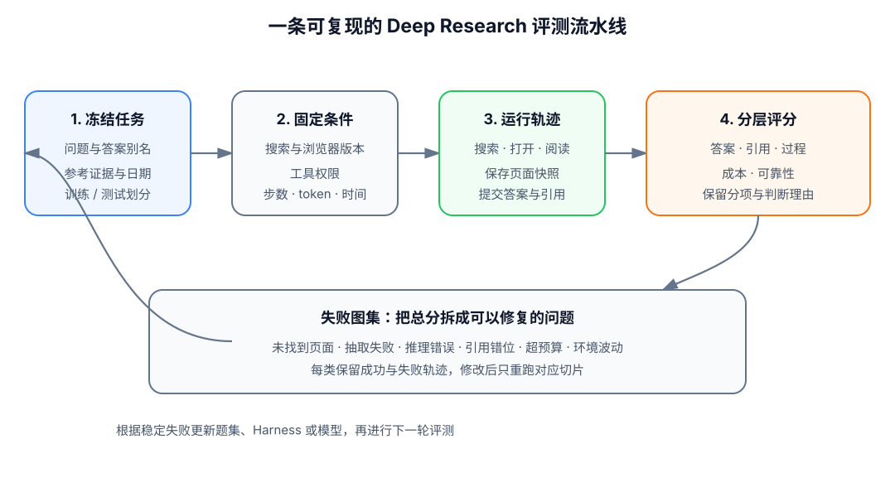

# 21.2 评测基准与开源项目

在 [21.1](./browser-rl-harness) 中，我们已经把搜索、阅读和提交答案写成了可运行轨迹。现在要解决下一个问题：两条轨迹给出了相同答案，它们的研究质量是否相同？

假设问题是“某篇论文的第一作者本科毕业于哪所大学”。智能体 A 没有打开网页，直接凭模型记忆回答；智能体 B 找到作者主页，保存了教育经历所在段落，并在答案后附上链接。两者的学校名称都正确，只看短答案会得到相同分数。

换一个角度，智能体 B 也可能引用了另一位同名作者的主页。此时答案碰巧正确，证据却指向错误的人。这个小例子说明，Deep Research 评测至少要分别检查**答案、证据、过程和成本**。


<div align="center">
  <em>图 1：Deep Research 的评测对象。答案正确只是第一层，引用是否支持结论、搜索过程是否可信也要单独检查。</em>
</div>

## 先确定一条评测样本包含什么

普通问答数据常用“问题”和“参考答案”两列。浏览器智能体还会受到网页版本、工具权限和预算影响，因此一条可复现样本需要更多字段。

下面是一条最小评测记录：

```json
{
  "task_id": "author-education-001",
  "question": "某篇论文的第一作者本科毕业于哪所大学？",
  "reference_answers": ["Example University"],
  "created_at": "2026-08-01",
  "max_steps": 20,
  "max_tokens": 50000,
  "allowed_tools": ["search", "open"],
  "required_evidence": 1
}
```

模型运行后，还要保存一条结果记录：

```json
{
  "task_id": "author-education-001",
  "final_answer": "Example University",
  "citations": [
    {
      "url": "https://example.edu/profile",
      "quote": "B.S., Example University"
    }
  ],
  "trajectory_path": "runs/author-education-001.jsonl",
  "steps": 7,
  "input_tokens": 18400,
  "output_tokens": 2100,
  "wall_time_seconds": 43.2,
  "status": "completed"
}
```

第一条记录固定任务条件，第二条记录保存模型行为。把两者分开后，我们才能在相同预算下比较模型，也能在网页变化后追查某次失败。

## 第一层 最终答案的正确性

最容易测量的是最终答案。若题目有唯一短答案，可以使用精确匹配：

$$
\operatorname{EM}(\hat y,y)=\mathbb{1}[\operatorname{norm}(\hat y)=\operatorname{norm}(y)].
$$

其中，(\hat y) 是模型答案，(y) 是参考答案，`norm` 会统一大小写、空格和标点。两者规范化后完全相同，得 1 分；否则得 0 分。

### 精确匹配的适用范围

人名、日期、机构名称和短字符串通常适合精确匹配。例如 BrowseComp 的答案较短，设计上便于和参考答案核对。

精确匹配也有边界。“University of California, Berkeley”和“UC Berkeley”语义相同，字符串却不同。评测数据可以预先收集别名，或者在规范化后再比较。

### 开放式报告的评分

比较产品、总结论文或写研究报告时，不存在唯一字符串。此时可以把问题拆成若干必须覆盖的事实点，再计算覆盖率：

$$
S_{\text{coverage}}=\frac{\text{已正确覆盖的事实点数}}{\text{全部事实点数}}.
$$

LLM-as-Judge 可以辅助判断语义等价、完整性和表达质量，但评分器会偏好更长的答案，也可能偏好与自身写作风格接近的文本。使用 judge 时，应固定模型版本与提示词，并用一小批人工标注样本校准一致性。

## 第二层 引用对结论的支持

URL 可以访问，只说明网页存在。真正需要检查的是：引用片段是否包含所需事实，以及网页中的人物、时间和对象是否与答案一致。

我们可以把引用评测拆成三个步骤。

### 可访问性检查

评测器尝试获取 URL，记录状态码、重定向和抓取时间。网页暂时超时应标为工具错误，不能直接等同于模型编造来源。

### 引用正确性检查

对每条引用，判断它是否支持答案中的相邻论断。若模型说“作者本科毕业于 Example University”，引用片段只写“作者曾在该校演讲”，这条引用可以访问，却不能支持结论。

设回答包含 (n) 条被引用论断，第 (j) 条论断得到支持时 (c_j=1)，否则 (c_j=0)。引用正确率可以写成：

$$
S_{\text{citation}}=\frac{1}{n}\sum_{j=1}^{n}c_j.
$$

### 引用完整性检查

一篇报告可能有十个关键结论，却只为其中两个提供来源。因此还要计算“应当引用的论断中，有多少真正附带了支持证据”。引用正确性高但完整性低，说明少数引用很好，报告主体仍缺乏依据。

检查长报告时，可以把每条论断与引用片段组成一对，再由规则、自然语言推断模型或人工抽样判断支持关系。评分器要保存判断理由，方便发现同名实体、时间错位和二手来源转述等问题。

## 第三层 搜索过程的有效性

最终答案和引用都正确，搜索过程仍可能存在明显浪费。一个智能体搜索 5 次解决问题，另一个重复搜索 40 次后才得到同一答案，两者的部署价值不同。

过程评测可以从下面几类事件开始，而不必马上训练一个复杂的过程奖励模型：

- 查询是否不断加入新约束，还是重复相同关键词；
- 打开的页面是否来自不同来源，还是反复访问同一 URL；
- 读到矛盾信息后是否继续核对；
- 搜索结果已经足够时是否及时停止；
- 工具报错后是否换用备用来源，还是陷入无限重试。

最简单的冗余率可以写成：

$$
S_{\text{redundancy}}=
\frac{\text{重复查询数}+\text{重复访问数}}{\text{全部工具调用数}}.
$$

这个指标越低通常越好，但不能单独优化。交叉验证有时需要重复搜索相近事实；过强的步骤惩罚会让模型过早停止。过程指标主要用于解释失败，最终结论仍要和答案及证据一起看。

## 第四层 成本与可靠性

真实浏览器会遇到超时、验证码、搜索限流和页面改版。若只统计成功轨迹，系统会显得比实际更可靠。

每次运行至少要记录：

- 输入与输出 token；
- 搜索、打开页面和浏览器动作次数；
- 总运行时间；
- 搜索 API 与模型 API 成本；
- 完成、超时、工具错误、格式错误等终止状态；
- 重试次数与备用服务调用次数。

在固定预算 (B) 下，可以报告预算内成功率：

$$
S_{\text{budget}}(B)=
\frac{\text{在预算 }B\text{ 内完成的任务数}}{\text{全部任务数}}.
$$

这个指标比“准确率除以 token”更容易解释：先规定每题最多 20 次工具调用或 50K token，再比较谁能在相同资源内完成更多任务。

## 三类常用基准的测量对象

没有一个基准能够覆盖完整的研究能力。选择基准之前，要先确定系统最终交付的是短答案、通用助理任务，还是开放式报告。

### BrowseComp 的短答案任务

[BrowseComp](https://arxiv.org/abs/2504.12516)包含 1,266 个需要持续浏览才能找到答案的问题。问题刻意把多个线索缠在一起，直接复制题目通常找不到答案；参考答案较短，因此最终评分清楚。

下面是一个同类型教学例子，并非基准原题：

> 某位运动员在一场特定比赛中打入唯一进球。退役后，他在哪家俱乐部担任青训教练？

模型需要先确认比赛和进球者，再确认同一人物退役后的经历。BrowseComp 适合测试搜索坚持性、查询改写和多跳线索连接。

它没有完整覆盖真实用户研究。短答案任务很少检查长报告结构、来源覆盖和问题歧义；论文也明确把它定位为一个不完整但有用的浏览能力基准。

::: details 原稿中的阶段性 BrowseComp 榜单快照

原稿记录过 GPT-5 + 浏览器 38.2%、Claude Opus 4.6 35.7%、Kimi K2.5 Swarm 72.1%、Tongyi DeepResearch 51.4%、人类专家 87.5% 等数字。

这些数字没有绑定同一榜单日期、模型版本、Agent 配置、搜索预算和采样次数，因此只保留为历史写作记录，不作为正文结论。复现实验应从 [BrowseComp 官方代码入口](https://github.com/openai/simple-evals)选定版本，并保存运行配置。

:::

### GAIA 的多模态工具任务

[GAIA](https://arxiv.org/abs/2311.12983)包含 466 个现实问题，要求系统综合使用推理、网页浏览、多模态理解和工具。题目对人类而言概念上并不复杂，难点在于智能体能否可靠地调用正确工具并组合结果。

GAIA 设有三个难度等级。低等级任务需要较少步骤，高等级任务可能涉及文件、网页和多种工具。它适合检查通用助理能力；若研究重点只关心网页检索，GAIA 中的多模态和文件任务会同时引入其他能力变量。

### xbench-DeepSearch 的持续评测

[xbench 论文](https://arxiv.org/abs/2506.13651)研究面向真实职业任务的动态评测，其中 DeepSearch 关注搜索型智能体。当前任务与榜单入口见 [xbench-DeepSearch 官方页面](https://xbench.org/agi/aisearch)。

它更接近用户提出的研究请求，可能包含中文问题、比较分析和多来源综合。开放式任务更自然，也更依赖 judge、网页时间和运行设置，因此复现时要固定题集版本与评分器版本。

::: details 原稿中的 xbench 任务比例示意

原稿曾按“单实体问答 30%、多文档综合 25%、对比分析 20%、时间推理 15%、隐含推理 10%”描述任务组成。这组比例没有在当前引用的一手页面中得到核对，因此保留为课程早期的分类示意，不作为官方数据集统计。

:::

### 自建动态集

公开基准方便比较，却可能与产品任务距离较远。自建集可以加入内部文档、中文网页、特定垂直领域和近期事件。

自建题目要保留题目生成日期、答案证据、网页快照和失效条件。若答案会随时间变化，评测时应使用“截至某日”的明确时间边界，或者定期重新核验参考答案。

## 四种最常见的虚高分数

### 数据污染

著名人物、历史事件和常见论文事实可能已经进入预训练数据。对策是加入较新的事实、长尾实体或需要组合多个页面才能得到的答案，并单独运行“禁用工具”基线。

如果禁用工具后的准确率已经很高，这批题目主要测模型记忆，不能用来证明搜索策略进步。

### 表述差异

机构别名、日期格式和名字顺序会造成假阴性。先做确定性的规范化与别名匹配，再把无法判断的样本交给 judge。不要把所有题目直接交给 LLM-as-Judge，否则评分成本和波动都会上升。

### 过程作弊

模型可能先凭记忆得到答案，再补一个看似相关的 URL。评测器要检查引用片段是否出现在实际访问过的页面中，也要保存访问时间和页面快照。

对于训练环境，隐藏答案与评测页面不能进入模型上下文。否则 agent 可能学会从日志、缓存键或错误信息中恢复答案。

### 成本污染

多智能体、并行搜索和多次采样常能提高成功率，同时显著增加 token 与网络请求。比较时至少给出一个固定预算设置，再额外报告高预算上限。

例如，可以同时报告“单轨迹、最多 20 步”和“4 条并行轨迹、每条最多 20 步”。这样才能看出提升来自单条策略更好，还是来自更多尝试。

## 一套可复现的评测协议



<div align="center">
  <em>图 2：可复现评测不只运行一次模型。题目版本、网页环境、预算、轨迹与评分器都要一起保存。</em>
</div>

### 冻结题目和参考证据

为每道题分配稳定编号，记录创建日期、参考答案、可接受别名和至少一条证据。开放式任务还要写清必须覆盖的事实点。

训练集、验证集和测试集按问题或实体划分，避免同一人物、同一网页模板同时出现在训练与测试中。

### 固定环境清单

记录搜索服务、语料库版本、浏览器版本、允许工具和网页访问时间。离线实验保存检索索引哈希；真实网络实验保存关键页面快照。

环境错误要单独分类。搜索服务 500、页面超时和模型提交错误答案属于不同失败原因。

### 固定推理预算

至少限制最大工具步数、最大 token、并发数和总时间。使用多次采样时，说明每题生成多少条轨迹以及怎样选择最终答案。

### 保存完整产物

每次运行保存最终答案、引用、逐步动作、工具返回、错误码和成本。只保留总分，会让失败分析和论文复现失去依据。

### 分层评分与汇总

先分别计算答案、引用、过程、成本和可靠性指标。若需要单一排序分数，可以在应用场景中设权重；研究报告仍应展示各分项，避免一个高分掩盖引用错误。

下面是一段最小评分伪代码：

```python
def evaluate_run(task, run):
    answer_score = exact_match(
        run["final_answer"],
        task["reference_answers"],
    )
    citation_score = citation_support(
        answer=run["final_answer"],
        citations=run["citations"],
    )
    within_budget = (
        run["steps"] <= task["max_steps"]
        and run["input_tokens"] + run["output_tokens"] <= task["max_tokens"]
    )

    return {
        "answer": answer_score,
        "citation": citation_score,
        "within_budget": float(within_budget),
        "status": run["status"],
    }
```

这个函数没有急着把所有分数相加。先保留分项，才能看到“答案正确但引用错误”或“证据可靠但超出预算”这样的真实差异。

## 开源项目的选择

开源项目解决的问题不同。有的适合快速生成报告，有的研究长文组织，有的提供搜索 RL 训练代码。把它们放在同一排行榜中比较，会混淆系统目标。

### GPT Researcher 的产品级研究流程

[GPT Researcher](https://github.com/assafelovic/gpt-researcher)把研究任务拆成规划、并行检索、来源汇总和报告生成。它支持多种搜索后端，并保存来源，适合观察一份研究报告怎样从多个网页逐步形成。

最小安装和调用如下：

```bash
pip install gpt-researcher
```

```python
from gpt_researcher import GPTResearcher


async def research():
    researcher = GPTResearcher(
        query="Compare two browser-agent evaluation protocols",
        report_type="research_report",
    )
    await researcher.conduct_research()
    return await researcher.write_report()
```

它主要是推理时研究框架，不直接提供完整的 on-policy RL 训练闭环。适合先建立评测日志、引用检查和成本统计，再接入训练系统。

### STORM 的报告大纲组织

[STORM 论文](https://arxiv.org/abs/2402.14207)关注从零写作 Wikipedia 风格长文。它先从多个视角提出问题，模拟基于可信来源的访谈，再整理信息和文章大纲。[官方仓库](https://github.com/stanford-oval/storm)提供 `knowledge-storm` 包：

```bash
pip install knowledge-storm
```

STORM 适合研究“报告是否覆盖多个视角、结构是否清楚、引用是否跟随论断”。它没有以浏览器 RL 训练为主要目标，因此更适合作为长文生成基线或报告评测对象。

### Search-R1 复现

[Search-R1](https://github.com/PeterGriffinJin/Search-R1)提供基于 veRL 的多轮搜索训练代码、数据处理脚本、检索服务和模型检查点。论文使用简单结果奖励，并通过 retrieved token masking 区分模型生成 token 与环境返回 token。


<div align="center">
  <em>图 3：Search-R1 的推理与搜索交织结构。来源：<a href="https://github.com/PeterGriffinJin/Search-R1" target="_blank" rel="noopener noreferrer">Search-R1 官方仓库</a>。</em>
</div>

最小复现顺序是：

```bash
git clone https://github.com/PeterGriffinJin/Search-R1.git
cd Search-R1

# 准备好论文要求的环境与语料后，先启动本地检索服务
bash retrieval_launch.sh

# 再运行官方推理入口，确认 search/open 交互正常
python infer.py
```

训练前先完成推理 smoke test，并固定语料索引版本。Search-R1 适合研究查询生成、搜索轮次与结果奖励；它的离线检索环境不能代替真实网页点击评测。

### O-Researcher 的数据蒸馏

[O-Researcher](https://github.com/OPPO-PersonalAI/O-Researcher)通过多智能体数据合成和两阶段训练构造开放研究模型。官方仓库当前提供 72B 的 SFT/RL 模型、2.92K SFT 数据和 10K RL 数据，并包含搜索、网页抓取与推理服务。

它适合研究完整深度研究模型的部署与数据组成，资源要求明显高于 Search-R1。官方默认部署配置按单实例多 GPU 设计，不应把它描述成单卡 7B 入门项目。

### OpenResearcher 的文献 RAG

[GAIR-NLP/OpenResearcher](https://github.com/GAIR-NLP/OpenResearcher)是面向 arXiv 语料的科学研究助理，依赖向量检索和 Elasticsearch。它与上面的 O-Researcher 名称相近，但项目目标和训练方式不同。

OpenResearcher 适合评测科学文献检索、回答丰富度和来源相关性。若要研究浏览器 on-policy RL，应选择 Search-R1、DeepResearcher 或 O-Researcher 等训练路线。

### 路线图的纳入方式

- [DeepResearcher](https://github.com/GAIR-NLP/DeepResearcher)适合研究真实开放网络中的端到端 RL，以及工具噪声怎样影响训练。
- [R1-Searcher](https://github.com/RUCAIBox/R1-Searcher)采用两阶段结果监督 RL，适合对比“先学会调用搜索，再学会有效搜索”。
- [Tongyi DeepResearch](https://github.com/Alibaba-NLP/DeepResearch)覆盖 Agentic CPT、SFT、RL 和重型推理模式，适合阅读工业级全流程设计。
- [GPT Researcher](https://github.com/assafelovic/gpt-researcher)与 STORM 适合做报告生成基线，不应与训练框架混为一类。

## 从零跑一次最小评测实验

第一次实验不需要训练 7B 模型。选择 20 道有短答案和明确证据的题目，比较三条基线即可。

### 基线 A 禁用工具

模型只能直接回答。这个分数估计题目被参数记忆覆盖的程度。

### 基线 B 固定一次搜索

系统把原问题交给搜索引擎，只把前五条摘要交给模型。它检查最简单的检索增强是否已经足够。

### 基线 C 多轮研究智能体

允许模型搜索、打开页面和提交答案，最多 10 步。它检查学习到的查询改写和来源核对是否带来增益。

三条基线使用同一个模型、同一个搜索后端和同一批题。最后分别报告：

- 短答案准确率；
- 有效引用正确率；
- 预算内成功率；
- 平均工具调用数；
- 工具错误率；
- 三类典型失败轨迹。

如果基线 B 已经达到基线 C 的准确率，就没有证据说明当前任务需要复杂浏览器 RL。若基线 C 准确率更高但引用分更低，说明搜索策略改善了答案，却没有学会可靠归因。

::: details 原稿中的端到端训练参数示意

原稿给出过 Qwen2.5-7B、GRPO、`batch-size=256`、`lr=5e-7`、训练 3 epoch，再在 BrowseComp 上最多运行 30 步的示意命令，并把“8% 提升到 25% 到 30%”作为预期区间。

这些参数没有绑定当前开源仓库的具体提交、数据文件和实际运行日志，因此不能视为可保证复现的配方。正式训练应从所选项目的官方 README 与脚本开始，先记录 smoke test、峰值显存、语料索引、随机种子和基线结果，再逐步扩大规模。

:::

## 用失败图集决定下一步改什么

总分下降只能说明系统变差，不能说明该改模型、环境还是验证器。每次评测应把失败轨迹归入可操作的类别。

- **没有找到页面**：查询过宽、长尾实体召回失败或搜索后端覆盖不足。
- **找到了页面但没有读到答案**：正文抽取、PDF、表格或动态网页解析失败。
- **读到证据却回答错误**：实体对齐、时间关系或多跳推理失败。
- **答案正确但引用错误**：归因与证据绑定失败。
- **过程正确但超出预算**：重复搜索、上下文管理或停止策略失败。
- **同一任务结果波动很大**：网页环境、采样温度或工具错误没有被控制。

每类至少保存一条成功轨迹和一条失败轨迹。修改系统后，只重跑对应切片，就能判断变化是否真的修复了目标问题。

## 小结

Deep Research 的结果由问题、网页环境、搜索轨迹、证据和最终答案共同产生。短答案基准可以清楚测量寻找信息的能力，通用助理基准可以检查多工具鲁棒性，开放式任务则需要事实覆盖与引用评测。

一个可信实验应固定题目版本、环境、工具和预算，保存完整轨迹，再分别报告答案、引用、过程、成本和可靠性。开源项目也要按目标选择：GPT Researcher 适合产品流程，STORM 适合长报告组织，Search-R1 适合搜索 RL 复现，O-Researcher 适合观察完整训练与部署。

下一章 [22. Computer Use 与 GUI Agent](../chapter25_computer_use/training) 会把环境从网页扩展到整个桌面。那时，评测还要增加界面状态、安全边界和不可逆操作等问题。
