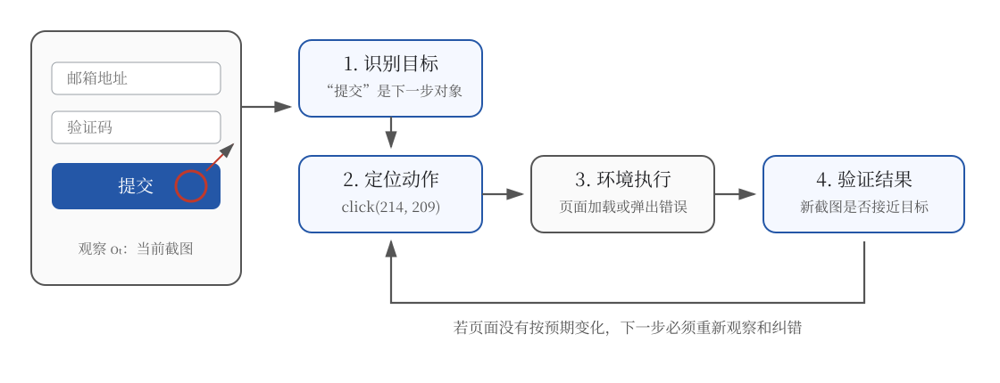
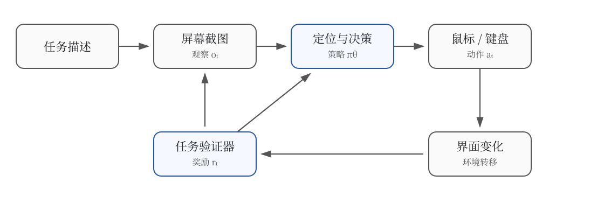

# 22.1 GUI Agent 训练：从截图到可执行动作

先从一个只有一步的任务开始：网页上已经填写好邮箱和验证码，现在只差点击“提交”。人看到按钮后会自然地把鼠标移过去；模型收到的却是一张像素矩阵。它必须先认出哪个区域是按钮，再把“提交”翻译成坐标动作，例如 `click(214, 209)`。

点击之后，任务仍未结束。页面可能进入成功页，也可能因为验证码过期而弹出错误。模型必须读取下一张截图，判断动作是否生效，再决定结束、等待还是纠错。**GUI Agent 训练学习的正是这条闭环：从界面中找出任务相关信息，产生可执行动作，并利用环境反馈修正后续行为。**



上图把一次点击拆成了四个判断。只训练“按钮在哪里”，模型会停在第二步；只训练“最终有没有成功”，模型又很难知道失败究竟发生在识别、定位还是验证。后文的监督微调、在线强化学习、课程采样和进度奖励，分别为这四个环节补充学习信号。

[第 19 章 Agentic RL](../chapter22_agentic/overview) 中的工具通常有明确的函数名和参数。GUI 环境只暴露截图与鼠标键盘入口，因此同一个“提交表单”目标会随窗口尺寸、主题、弹窗和加载状态产生不同轨迹。



动作会改变下一张截图，验证器再判断任务有没有推进。这种“观察—动作—新观察”的循环，是把 GUI 操作写成强化学习问题的起点。

## 第一步：把 GUI 看成可交互环境

[第 19 章工具使用](../chapter22_agentic/tool-use-and-trajectory)中的工具是结构化 API，例如 `search(query)`。函数名说明了能力，参数也规定了合法输入。浏览器、Excel、企业内部 OA、Photoshop 和游戏常常没有适合自动化任务的完整 API，GUI 便成为模型可以共同使用的一层接口。

**Computer Use** 范式把整个操作系统当作 agent 的环境：

- **观察**：屏幕截图 $o_t \in \mathbb{R}^{H \times W \times 3}$，必要时再附加窗口、光标或可访问性树信息
- **动作**：原子 GUI 事件（鼠标移动、点击、滚动、键盘按键、等待）
- **奖励**：验证器返回的任务完成或进度信号，例如“表单是否成功提交”

这与 CartPole 一类小型环境形成鲜明差别。CartPole 的状态和动作都很低维，环境还能在每一步返回奖励；GUI 的观察包含大量像素，动作同时含有类型和坐标，许多任务只能在最后由验证器判断成败。

### 这些系统分别在解决什么

产品和论文对“计算机操作”的切入点不同。[Anthropic Computer Use](https://docs.anthropic.com/en/docs/agents-and-tools/tool-use/computer-use-tool) 将截图、鼠标与键盘封装成模型可调用的工具；OpenAI Operator 和 Google Project Mariner 展示了浏览器中的完整任务执行。它们首先回答工程问题：如何让模型安全地接收截图并控制软件。

[UI-TARS](https://arxiv.org/abs/2501.12326)、[UI-TARS-2](https://arxiv.org/abs/2509.02544) 与 [AutoGLM](https://arxiv.org/abs/2411.00820) 更适合用于理解训练。UI-TARS 研究只依赖截图的原生 GUI Agent，UI-TARS-2 进一步讨论多轮强化学习与并行沙箱；AutoGLM 则强调规划与定位的中间接口，以及能够随策略能力变化的在线课程。后文会沿着这些论文各自解决的问题展开。

### 核心动作空间

下面的代码把 [Anthropic Computer Use 工具文档](https://docs.anthropic.com/en/docs/agents-and-tools/tool-use/computer-use-tool)中的鼠标键盘能力整理成一个便于教学的公共动作空间。不同系统的真实字段并不完全相同，但都会回答“动作类型是什么”和“动作作用在哪里”这两个问题。

```python
ACTIONS = {
    "click":      {"x": int, "y": int, "button": "left|right|middle"},
    "double":     {"x": int, "y": int},
    "drag":       {"start": [x,y], "end": [x,y]},
    "type":       {"text": str},
    "key":        {"keys": "ctrl+c|enter|tab"},   # 组合键
    "scroll":     {"x": int, "y": int, "dy": int},
    "wait":       {"ms": int},
    "screenshot": {},
    "done":       {"summary": str},
}
```

这段动作空间带来三个训练难点：

1. **动作类型与坐标需要共同预测。** `click` 是离散动作，而 $(x,y)$ 是位置。实现时可以回归连续坐标，也可以把坐标离散成特殊 token。
2. **两张截图之间存在不可见变化。** 网络加载、动画与后台进程都可能改变界面。策略只看离散截图时，观察通常不是完整状态。
3. **等待本身也是决策。** 页面尚未加载时继续点击会制造新错误；等待过久又会增加任务延迟和步数。

### MDP 形式化

定义 Computer Use MDP 为 $\mathcal{M} = (\mathcal{S}, \mathcal{A}, P, R, \gamma, T)$：

$$\mathcal{S} = \{\text{screenshots}\}, \quad \mathcal{A} = \{\text{click, type, scroll, key, wait, done}\}$$

任务描述（如"帮我把这份 PDF 转成 Markdown"）作为初始 prompt $q$ 拼接到每步观察前。策略为条件分布：

$$\pi_\theta(a_t \mid q, o_{1:t}, a_{1:t-1})$$

最简单的验证器只在终点返回二值奖励：$r_T = \mathbb{1}[\text{task completed}]$，中间步 $r_{t<T}=0$。假设“填写报销单”需要 30 个动作，最后因附件没有上传而失败，整条轨迹只能得到 0。模型无法直接知道前 29 步大多正确，也不知道错误发生在附件定位还是上传后的状态检查。这就是长程 GUI 任务中的信用分配问题。

::: warning RL 的真正难点
高维截图、混合动作、长轨迹与稀疏奖励会相互放大：一次早期误点会改变后续所有观察，而终态奖励又无法标出最初的分叉点。GUI Agent 训练因此通常先用演示轨迹学会基本动作，再进入能够重置和验证的环境做在线强化学习。
:::

## 第二步：先把文字目标落到屏幕位置

模型已经从任务中得到“点击提交”这个子目标，接下来还要回答一个界面问题：“提交”对应屏幕上的哪一块区域？把语言中的对象映射到图像位置，称为**视觉定位（visual grounding）**。

前面的表单里，蓝色按钮中心约为 $(214,209)$。如果模型预测 $(214,160)$，动作格式完全合法，却会点到验证码输入框。GUI 轨迹因此要同时记录“选了什么动作”和“动作落在何处”。

### Set-of-Mark 提示

Yang 等人在 [Set-of-Mark Prompting](https://arxiv.org/abs/2310.11441) 中提出 **Set-of-Mark（SoM）**：先用分割或检测模型把图像区域标上数字、字母或边框，agent 输出动作时只需引用编号。放到 GUI 场景，可以写成下面的输入：

```
[屏幕截图 + 框 1: 输入框 "用户名", 框 2: 输入框 "密码", 框 3: 按钮 "登录"]

Agent: type("alice") → click(框 1) → type("***") → click(框 2) → click(框 3)
```

这把连续坐标预测简化为离散选择。检测器一旦漏掉无文字图标、画布内容或被遮挡元素，模型也失去了引用它们的办法。因此 SoM 适合作为清晰的中间接口，也把检测误差引入了整条轨迹。

### 视觉 Grounding

UI-TARS、CogAgent 等端到端模型走另一条路：**让 VLM 直接输出坐标**。为了先看清定位与决策的关系，可以把模型教学化简为两个输出 head：

$$\text{VLM}(o_t, q) \to \underbrace{(\text{thought}, \text{action token})}_{\text{language head}} + \underbrace{(x, y) \in [0,1]^2}_{\text{grounding head}}$$

在这个化简里，grounding head 可以用 MLP 输出归一化坐标 $(x, y) \in [0, 1]^2$，再乘以屏幕尺寸映射到像素。真实系统也可能把坐标离散成 token，或把思考、动作与坐标写进同一条生成序列。

训练 grounding 用**监督模仿**：人工标注"按钮中心点 $(x_i, y_i)$"，loss 为：

$$\mathcal{L}_{\text{ground}} = \frac{1}{N}\sum_i \|\hat{p}_\theta(o_i) - p_i\|_2^2$$

坐标监督解决的是单步定位。完整任务还包含动作选择与状态变化：同一个“提交”按钮，在字段未填写时不应点击，在弹出确认框后也可能需要先检查信息。仅靠静态截图—坐标对，模型无法学习一次点击怎样改变后续界面，因此还要加入带有环境反馈的完整轨迹。

### Grounding + 决策的联合 RL

定位正确仍不等于任务完成：模型可能准确点中一个无关按钮。因此还要让定位损失与任务回报共同约束策略。下面的目标函数是便于理解的组合形式：

$$\mathcal{J}(\theta) = \mathbb{E}_{\tau \sim \pi_\theta}\left[\sum_{t=0}^T \gamma^t r_t\right] - \beta \cdot \mathcal{L}_{\text{ground}}(\theta)$$

第二项是 grounding 的监督 loss，作为正则项保留。这类 **SFT + RL** 流水线先用演示数据建立基础操作能力，再用环境回报优化任务成功率；不同论文对两种信号的组合方式并不完全相同。

UI-TARS 系列采用统一的动作表达来连接感知、推理与操作。[UI-TARS 论文](https://arxiv.org/abs/2501.12326)强调跨平台统一动作建模与带反思的多步推理；[UI-TARS-2](https://arxiv.org/abs/2509.02544)继续把这种模型放进多轮强化学习环境。下面的函数是对“截图和任务进入模型，动作与坐标从同一生成结果中解析”的教学化实现：

```python
def ui_tars_forward(self, screenshot, task):
    # 编码图像
    visual_tokens = self.vision_encoder(screenshot)  # [B, N_vis, d]

    # 拼接 prompt
    prompt = f"<task>{task}</task>\n<image>{visual_tokens}</image>\n"

    # 自回归生成 thought + action + coord
    # 关键：coord 用特殊 token <coord_x> <coord_y> 包裹
    output = self.llm.generate(prompt, max_new_tokens=256)

    # 解析输出："<thought>...</thought>\n<action>click</action>\n<coord>(0.45, 0.62)</coord>"
    thought, action, coord = parse_action(output)
    return thought, action, coord
```

### 从演示轨迹走向在线轨迹

人工演示可以告诉模型基本操作，却很难覆盖窗口尺寸、弹窗、错误提示和恢复路径的组合。训练系统通常把任务模板、可重置环境和程序验证器接在一起，使模型能够反复尝试同一类任务：

1. **任务模板**给出目标和可变参数，例如“把订单 `{order_id}` 的状态改为 `{status}`”。
2. **环境快照**把虚拟机恢复到已知初态，使不同策略面对相同任务条件。
3. **演示轨迹**保存每步截图与动作，用于监督微调，先建立基本操作能力。
4. **在线轨迹**由当前策略在环境中生成，程序验证器读取应用状态并返回奖励。

```python
class GUIEnv:
    def reset(self, task_id):
        self.vm.restore_snapshot(task_id)  # 恢复虚拟机到任务初始状态
        self.task = self.tasks[task_id]
        return self.screenshot()

    def step(self, action):
        self.vm.execute(action)            # 鼠标键盘事件注入
        obs = self.screenshot()
        done = self.task.verifier(obs, self.vm.state)
        reward = 1.0 if done else 0.0
        return obs, reward, done, {}
```

::: details 为什么训练环境通常放在虚拟机里
在线强化学习会产生大量失败动作。虚拟机或容器化桌面能够隔离用户文件与账号，并在每条轨迹结束后恢复快照。[OSWorld](https://arxiv.org/abs/2404.07972) 便使用真实应用组成可复现的计算机环境；大规模训练还要并行运行许多环境，避免模型等待单个桌面加载。
:::

## 从单步定位过渡到完整任务

Computer Use 把 GUI 像素流当作 RL 状态空间，把鼠标键盘事件当作动作空间，这让传统 RL 的所有难题（稀疏奖励、长时序、高维观察）同时放大。**Set-of-Mark** 与**视觉 Grounding** 是解决"定位"问题的两条主流路线：前者依赖外部检测器简化动作空间，后者用 VLM 端到端输出坐标。

到这里，模型已经能把截图变成一个合法动作。完整任务仍会出现新的难题：早期误点会改变后续页面，模型需要从错误状态恢复，稀疏终态奖励又很难指出轨迹在哪一步开始偏离。下面沿着在线训练稳定性、任务难度和奖励距离三个问题，观察 UI-TARS-2、AutoGLM、MobileRL、ComputerRL 与 CogAgent 怎样扩展这项能力。

## 第三步：把单步能力接成训练流水线

单步定位达到可用水平后，训练才进入最消耗环境交互的阶段。几项代表性工作依赖三个共同前提：

1. **视觉语言模型提供初始感知能力。** 从零训练屏幕理解和语言规划成本很高，GUI 训练通常从已有 VLM 开始。
2. **可重置环境提供可比较的轨迹。** [AndroidWorld](https://arxiv.org/abs/2405.14573)、[OSWorld](https://arxiv.org/abs/2404.07972) 与 WebArena 等环境把任务初态和成功条件固定下来。
3. **并行采样系统减少环境等待。** 每条轨迹都要加载应用、执行动作和截图；只有并行运行多个环境，GPU 才不会长期等待桌面响应。

代表性工作对比：

- [UI-TARS-2](https://arxiv.org/abs/2509.02544) 重点处理多轮强化学习的稳定性、数据飞轮、混合 GUI 环境与统一沙箱。
- [AutoGLM](https://arxiv.org/abs/2411.00820) 重点处理规划与定位的中间接口，以及在线课程强化学习。
- [MobileRL](https://arxiv.org/abs/2509.18119) 针对移动任务的重尾难度分布，提出难度自适应正样本回放、失败课程过滤和最短路径奖励调整。
- [ComputerRL](https://arxiv.org/abs/2508.14040) 将 API 与 GUI 操作结合，通过并行虚拟桌面扩展在线采样，并用 Entropulse 缓解长时间训练中的熵坍塌。
- [CogAgent](https://arxiv.org/abs/2312.08914) 从感知侧处理高分辨率界面中的小字和小图标。

这些工作没有共享一套固定训练配方。UI-TARS-2 与 ComputerRL 主要改变在线训练系统，MobileRL 改变采样和奖励调整，CogAgent 改变视觉表征。理解这一点后，论文中的模块才不会被误读成可以任意拼接的“技巧清单”。

## 第四步：用 UI-TARS-2 理解多轮在线强化学习

[UI-TARS-2 技术报告](https://arxiv.org/abs/2509.02544)使用统一模型处理感知、推理和动作，并重点讨论数据飞轮、稳定的多轮强化学习、混合 GUI 环境与统一沙箱。这里的关键变化是训练对象：普通语言模型 RL 采样一段回答，GUI RL 则要让模型和环境往返多轮，后一步观察由前一步动作决定。

### 先建立一个能进入环境探索的起点

如果初始策略连按钮和输入框都分不清，大部分在线轨迹会在前几步失败，终点验证器几乎无法给出正奖励。工程上通常先用视觉数据和演示轨迹建立基本能力，再逐步增加模型自己生成的数据。下面保留原稿的四阶段写法，作为理解数据如何流动的教学框架；它概括了常见流水线，不代表 UI-TARS-2 论文逐项公布了这四个固定阶段。

```
Stage 1: 视觉-语言预训练
  └─ GUI 截图 + 文本对 → 基础视觉能力

Stage 2: 监督微调（SFT）
  └─ 人类演示 + 模型自生成轨迹 → 基础动作能力

Stage 3: 成功轨迹回灌
  └─ 多候选轨迹 + verifier 选优 → 过滤成功样本并继续微调

Stage 4: 在线强化学习
  └─ 可重置 GUI 环境 rollout → 优化任务完成率
```

成功轨迹回灌提供了一个重要过渡：同一任务生成多条候选轨迹后，程序验证器可以筛出完成任务的样本，再把其中可复现的轨迹加入监督数据。这样能够提高在线训练开始时的成功样本比例。候选数、筛选阈值和后续优化算法应以具体论文或复现实验为准。

### 失败轨迹要记录“哪里没有按预期变化”

[UI-TARS](https://arxiv.org/abs/2501.12326)将反思列为多步推理模式之一。为了理解反思信息如何进入轨迹，可以让 agent 在观察到异常后显式写出 `<reflection>` 字段：

```
<thought>我需要点击"提交"按钮</thought>
<action>click(450, 320)</action>
<observation>按钮变灰，但没有跳转</observation>
<reflection>可能点击位置偏了。"提交"按钮的可点击区域是 (440-470, 310-330)，我点到了边界外。重试时往中心移动。</reflection>
<action>click(455, 320)</action>
<observation>页面跳转到成功页</observation>
<action>done</action>
```

这段教学轨迹同时记录了预期变化、实际变化与下一次修正。训练数据若只留下第二次成功点击，模型看不到第一次失败为何需要调整；保留失败前后的截图与动作，才能训练状态检查和恢复能力。`<reflection>` 是本节的可读表示，不能据此推断论文使用了同名标签或同样的监督格式。

### 多任务 RL 奖励

下面用一个加权和概括任务成功、格式合法、纠错和非法动作四种信号。它是帮助读者分析奖励组成的教学表达，不是论文逐字给出的公式：

$$r = r_{\text{task}} + \alpha \cdot r_{\text{format}} + \beta \cdot r_{\text{reflection}} - \gamma \cdot r_{\text{invalid}}$$

- $r_{\text{task}} \in \{0, 1\}$：任务是否完成
- $r_{\text{format}} \in \{0, 1\}$：输出格式是否合法（XML 标签闭合、坐标在范围内）
- $r_{\text{reflection}} \in [0, 0.3]$：成功纠错的反思质量
- $r_{\text{invalid}}$：执行越权动作（如尝试关闭浏览器）

例如可以从 $\alpha = 0.1, \beta = 0.3, \gamma = 2.0$ 开始做消融实验。这里的权重是实验起点，不能当作 UI-TARS-2 论文公开的固定配置；不同环境需要重新标定，尤其要检查较大的非法动作惩罚是否让策略过度保守。

## 第五步：用 AutoGLM 理解规划、定位与环境接口

[AutoGLM 论文](https://arxiv.org/abs/2411.00820)同时研究网页和手机 GUI，并给出一个重要观察：高层规划需要灵活理解目标，低层定位需要精确落到界面元素，两者的误差形态不同。论文因此强调合适的**中间接口**，让规划结果能够被定位模块可靠执行。

以“在购物应用中搜索无线耳机”为例，高层规划可以输出“打开搜索框并输入关键词”，定位模块再根据当前截图决定搜索框坐标。若下一版本把搜索框移到屏幕底部，高层计划仍然成立，定位模块却必须重新适应。把两类误差分开记录，才能知道训练数据应该补充任务规划还是视觉定位。

论文还提出自演化的在线课程强化学习。课程会随着当前策略变化：已经稳定完成的简单任务减少采样，成功率接近零的任务暂缓进入，训练资源集中在当前有可能通过探索学会的任务上。这一思路与后面的 MobileRL 相连，但两篇论文的具体算法与实验设置并不相同。

[Open-AutoGLM 仓库](https://github.com/zai-org/Open-AutoGLM)提供基于 AutoGLM 的手机 Agent 框架和模型入口，适合观察截图、规划与设备控制怎样接到一起。仓库当前公开的是运行和设备接入代码，不能据此推断论文训练数据、训练脚本或完整强化学习基础设施已经全部开放。

### 多设备适配为什么需要统一动作空间

手机端可能通过 Android 的 ADB、HarmonyOS 的 HDC 或 iOS 的 WebDriverAgent 执行动作。设备协议不同，策略层仍希望使用稳定的动作语义。下面保留原稿的统一动作空间，用来说明环境适配器的职责：

```python
UNIFIED_ACTIONS = {
    "tap":       {"x": float, "y": float},           # 单击/触摸
    "long_press":{"x": float, "y": float, "ms": int},
    "swipe":     {"start": [x,y], "end": [x,y]},     # 滑动/拖拽
    "type":      {"text": str},
    "key":       {"name": str},                       # back, home, enter
    "scroll":    {"dy": int},
    "wait":      {"ms": int},
    "done":      {"summary": str},
}
```

策略输出 `tap`，环境适配器再把它翻译成具体平台的触摸事件。这样可以共享高层策略，同时把坐标缩放、设备连接和文本输入差异留在执行层处理。

### 先跑通一次可观察的设备循环

下面将原稿中的训练命令改成仓库可以核对的运行入口。它只展示如何把模型服务接到设备，不代表完成了强化学习训练：

```bash
git clone https://github.com/zai-org/Open-AutoGLM
cd Open-AutoGLM

# 安装设备控制与 Agent 依赖
pip install -r requirements.txt
pip install -e .

# 模型服务启动后，让已连接的 Android 设备执行一个低风险任务
python main.py \
    --base-url http://localhost:8000/v1 \
    --model autoglm-phone-9b \
    "打开设置并查看系统版本，不要修改任何选项"
```

第一次实验应选择只读任务，并保留每步截图、模型输出、环境动作和最终状态。只看最终是否完成，会掩盖定位偏差、等待不足和错误恢复等训练问题。

## 第六步：用 MobileRL 调整任务难度

[MobileRL](https://arxiv.org/abs/2509.18119) 专门研究移动 GUI Agent 的在线强化学习。论文关注重尾任务难度和环境采样效率，并提出难度自适应的正样本回放、失败课程过滤和最短路径奖励调整。移动端的困难可以先从三个直观变化理解：

- **屏幕小、元素密集**：一个 App 首页可能有 30 个可点击元素，密集排布
- **手势复杂**：长按、滑动、双指捏合、3D Touch，远比鼠标点击丰富
- **应用切换频繁**：推送、来电、低电量弹窗随时打断任务

### 渐进难度课程

下面先用一个简化的课程约束理解核心直觉：优先采样当前策略“有机会成功、又没有完全掌握”的任务。

$$\text{Curriculum}(\pi_\theta) = \arg\max_{\text{task } \tau} \; \text{Difficulty}(\tau) \quad \text{s.t.} \quad 0.3 \leq P_\theta(\text{success} \mid \tau) \leq 0.7$$

这个简化约束把采样集中在当前成功率居中的任务。成功率接近 0 的任务很难产生正样本，接近 1 的任务又很少提供新信息。30%–70% 是课程实验的示例区间，不能当作 MobileRL 论文规定的固定阈值。

### 把“任务难度”写成可检查的量

MobileRL 的论文算法直接根据训练反馈调整回放与过滤。为了实现一个最小课程调度器，可以先把任务难度教学化地拆成四个维度：

$$\text{Difficulty}(\tau) = w_1 \cdot \text{Steps}(\tau) + w_2 \cdot \text{Apps}(\tau) + w_3 \cdot \text{GestureComplexity}(\tau) + w_4 \cdot \text{Distraction}(\tau)$$

- $\text{Steps}$：完成任务的最少步数（5-50）
- $\text{Apps}$：需要切换的 App 数量（1-4）
- $\text{GestureComplexity}$：所需手势种类数（tap=1, swipe=2, long_press=3, multi-touch=5）
- $\text{Distraction}$：模拟干扰事件数（推送、来电）

例如可以用 $w_1=0.4, w_2=0.2, w_3=0.2, w_4=0.2$ 初始化一个课程调度器，再根据失败轨迹校准。该权重是本节代码示例的一部分，不是 MobileRL 论文的通用结论。

### 课程调度器

```python
class CurriculumSampler:
    def __init__(self, tasks, model):
        self.tasks = tasks
        self.model = model
        self.success_rate = {}  # task_id -> moving average success rate

    def sample(self, batch_size):
        # 1. 评估每个任务在当前模型下的成功率
        for tau in self.tasks:
            if tau.id not in self.success_rate:
                self.success_rate[tau.id] = self._estimate(tau)

        # 2. 过滤出 30%-70% 成功率的任务
        candidates = [t for t in self.tasks
                      if 0.3 <= self.success_rate[t.id] <= 0.7]

        # 3. 按 difficulty 加权采样
        weights = [t.difficulty for t in candidates]
        return weighted_sample(candidates, weights, batch_size)

    def _estimate(self, task):
        # 跑 10 次 rollout 估算成功率
        successes = sum(self._rollout(task) for _ in range(10))
        return successes / 10
```

每个 epoch 重新评估一次任务成功率，让课程跟着模型能力动态调整。

## 第七步：处理长程任务的奖励距离

[ComputerRL](https://arxiv.org/abs/2508.14040) 研究端到端在线 Computer Use RL 的规模化，论文的核心包括 API—GUI 混合动作范式、并行虚拟桌面基础设施，以及交替进行 RL 与监督微调以缓解熵坍塌的 Entropulse 策略。

长程任务还有一个更基础的问题：最终奖励离早期动作太远。原稿用“反向课程 + 中间探索奖励”解释这个问题。下面保留这组推导和代码，把它作为可独立实验的教学方案；它不是 ComputerRL 论文对自身方法的概括。

### 反向课程（Backward Curriculum）

传统课程从易到难——先学 5 步任务，再学 10 步、20 步。反向课程反过来：**从任务终点开始**。

考虑一个 50 步任务 $T = (s_0, a_1, s_1, \ldots, a_{50}, s_{50})$。反向课程的训练顺序：

```
Round 1: 从 s_49 开始，只需执行 a_50 → done（1 步任务）
Round 2: 从 s_48 开始，执行 a_49, a_50 → done（2 步任务）
Round 3: 从 s_47 开始，执行 a_48, a_49, a_50 → done（3 步任务）
...
Round 50: 从 s_0 开始，完整任务（50 步）
```

**为什么有效**？反向课程保证了 RL 永远在"接近奖励"的状态上训练。正向训练时，agent 在 $s_0$ 看不到任何 reward 信号；反向训练时，agent 在 $s_{49}$ 上一步就能拿到 reward。这让 credit assignment 变得简单——刚执行的动作立刻有反馈。

### 中间探索奖励

反向课程解决“终态奖励太远”，但中间步仍然无信号。教学方案可以继续加入**中间状态奖励**：

$$r_t = \underbrace{r_{\text{task}}(t=T)}_{\text{稀疏终态奖励}} + \lambda \cdot \underbrace{r_{\text{progress}}(s_t, s_{t+1})}_{\text{密集进度奖励}}$$

其中 $r_{\text{progress}}$ 由一个独立的"进度评估器" LLM 输出：

```python
def compute_progress_reward(s_t, s_{t+1}, task):
    prompt = f"""
    Task: {task}
    State before: {describe(s_t)}
    State after: {describe(s_{t+1})}
    Question: did the agent make progress toward the task?
    Answer with a score in [0, 1]:
    - 1.0: significant progress (e.g., filled a required field)
    - 0.5: minor progress (e.g., navigated closer)
    - 0.0: no progress (e.g., clicked irrelevant element)
    - -0.5: regression (e.g., closed important dialog)
    """
    return float(llm_judge(prompt))
```

这种 LLM-as-judge 的中间奖励类似 [第 17 章 Process Reward Model](../chapter20_prm_search/inference-time-search) 的思想——用 LLM 评估中间步质量。

### 与正向课程的对比

下面保留原稿的实验记录，用来展示应该怎样同时比较成功率、步数和训练成本。由于这组数字不是 ComputerRL 论文公开结果，复现前需要用自己的环境重新测量：

- **方法 — 正向课程 + 终态奖励**
  - OSLevel-3 成功率: 12.3%
  - 平均步数: 47
  - 训练成本: 1×
- **方法 — 正向课程 + 进度奖励**
  - OSLevel-3 成功率: 27.7%
  - 平均步数: 35
  - 训练成本: 2.3×
- **反向课程 + 进度奖励**
  - OSLevel-3 成功率: **51.2%**
  - 平均步数: **28**
  - 训练成本: 2.8×

在这组记录中，反向课程把成功率从约 12% 提高到约 51%，训练成本也增加到 2.8 倍，主要开销来自进度评估器调用。它说明密集反馈可能改善学习，也提醒我们把奖励模型成本纳入评测。

## 第八步：权衡高分辨率视觉与延迟

[CogAgent](https://arxiv.org/abs/2312.08914) 走另一条路：**用更高分辨率视觉编码换取 GUI 小元素识别能力**。原始 CogAgent 论文介绍的是 18B 模型；仓库后来又发布了 9B 版本。原稿中的 arXiv:2408.16500 对应 CogVLM2，并非 CogAgent 论文，因此这里改用正确的论文入口。

### 高分辨率视觉分支

CogAgent 支持 1120×1120 的输入，并同时使用低分辨率与高分辨率图像编码。更细的视觉网格能保留 UI 小字和工具栏图标，同时也会增加视觉 token 与计算开销。

它的基本结构可以画成两路视觉信息汇合到语言解码器：

```
┌──────────────────────────────────────────┐
│ 输入截图（1120×1120）                    │
└────────────┬─────────────────────────────┘
             ↓
   ┌─────────┴─────────┐
   │                   │
   ↓                   ↓
高分辨率分支         低分辨率分支
保留小字与图标       提供全局页面语义
   │                   │
   └─────────┬─────────┘
             ↓
        Cross-Attention
             ↓
         LLM Decoder
```

低分辨率分支更容易提供全局上下文，例如“这是一个购物页面”；高分辨率分支保留“购物车按钮在右上角”这类局部细节。论文确认了双编码器与 1120×1120 输入，具体 token 数和融合开销还会随实现版本变化。

### 准确度 vs 延迟的权衡

代价是计算成本：分辨率升高后，视觉编码和跨模态融合都需要处理更多局部信息。原稿记录了三组工程测量，用来说明评测时应同时保留延迟和任务成功率：

- **配置 — 448×448 单分支**
  - 视觉 token: 256
  - 推理延迟: 0.8s
  - OSWorld 准确率: 38.2%
- **配置 — 1120×1120 单分支**
  - 视觉 token: 3136
  - 推理延迟: 4.2s
  - OSWorld 准确率: 47.5%
- **双分支融合**
  - 视觉 token: 3392
  - 推理延迟: 1.6s
  - OSWorld 准确率: **46.8%**

这些数字没有对应到 CogAgent 论文的公开实验配置，因此不能当作论文结果引用。它们保留为测量模板：复现实验时应在同一硬件、相同最大步数和相同任务集合上，重新记录视觉 token、单步延迟与任务成功率。

## 第九步：从失败轨迹判断该改哪里

训练曲线中的“任务成功率下降”只说明结果变差，不能直接指出原因。一次最小评测至少应保存任务、每步截图、模型原始输出、解析后的动作、环境返回值和验证器结果。沿着这些记录，可以把常见失败分成四类。

**第一类是定位失败。** 模型选择了正确动作类型，也提到了正确元素，却把坐标落在元素边缘或相邻控件上。此时应增加不同分辨率、缩放比例和遮挡条件下的定位样本，并单独测量点击点是否落入目标区域。

**第二类是规划失败。** 坐标落在可点击元素上，但该元素与当前子目标无关。例如报销单尚未填写金额，模型便点击“提交”。定位数据无法修复这种错误，需要补充带任务上下文的完整演示或在线轨迹。

**第三类是状态检查失败。** 动作本身正确，界面还在加载，模型却重复点击，最终触发两次提交。训练轨迹要记录动作后的预期变化，并让策略学会在等待、重试和结束之间选择。

**第四类是验证器失败。** 页面出现“操作已受理”就得到正奖励，但后台实际写入了错误订单。此时策略会学习验证器漏洞。验证器应尽量读取结构化应用状态，并加入参数、对象和副作用检查，而不能只匹配一段成功文本。

[OSWorld](https://arxiv.org/abs/2404.07972) 的真实应用任务说明，GUI Agent 评测需要同时面对定位、软件操作知识和跨应用流程。训练时还应单独报告成功率、平均动作数、无效动作率、环境错误率与单步延迟；否则环境崩溃和模型失败会被混进同一个零奖励。

## 第十步：把训练结果带到真实桌面

把上述系统从论文搬进生产环境，会遇到三个论文里没充分讨论的挑战。

### 环境分布偏移

论文里的训练环境是 OSWorld、AndroidWorld 等可控 benchmark。生产环境是真实用户的电脑——每个人的系统版本、浏览器插件、字体大小都不一样。

可以从三个方向减小偏移：

- **数据多样化**：在不同操作系统、分辨率、缩放比例和主题上采集轨迹。
- **域随机化**：训练时改变 UI 主题、字体与窗口尺寸，避免策略记住固定坐标。
- **失败回流**：在取得明确授权并完成隐私处理后，将部署失败整理成可重放测试，再决定是否进入训练集。

### 长尾任务

公开基准通常覆盖一组可复现的常见任务，真实请求却可能涉及少见软件、企业内部流程或高风险系统设置。训练分布之外的任务需要更保守的运行策略。

- **任务分层**：已验证的常见任务可以自动执行；缺乏测试覆盖的任务限制为只读探索或交还人工处理。
- **人在回路**：目标含糊、出现新应用或即将产生外部副作用时暂停，并展示当前状态与拟执行动作。

### 安全边界

GUI Agent 能执行破坏性操作——删文件、转账、发邮件。生产环境必须有明确的安全边界。

**对策**：

- **白名单动作**：默认禁止 `rm -rf`、转账超过 $100、群发邮件
- **二次确认**：高风险操作前弹窗让用户确认
- **审计日志**：所有操作记录可回溯

详见 [22.2 Prompt Injection 与指令层级](./safety-swarm)。

## 本节总结

GUI Agent 的学习对象是一条会改变环境的轨迹。监督微调先建立元素识别、坐标定位和基本动作能力；在线强化学习再利用可重置环境与任务验证器，提高多步任务的完成率。

几篇论文分别补上了这条链路中的不同缺口：UI-TARS-2 关注稳定的多轮强化学习和沙箱，AutoGLM 连接规划与定位，MobileRL 根据任务难度调整采样与奖励，ComputerRL 扩展并行桌面训练并缓解熵坍塌，CogAgent 改善高分辨率界面感知。反向课程与进度奖励在本节作为独立教学方案保留，用来理解如何缩短动作与终态奖励之间的距离。

评测时需要回到完整轨迹，分别检查定位、规划、状态检查和验证器。只报告一个总成功率，无法判断下一轮应该补数据、改奖励、修环境还是提高视觉分辨率。

下一节 [22.2 Prompt Injection 与指令层级](./safety-swarm) 转向安全——agent 真正部署到用户电脑后，怎么防止恶意网页、伪造 UI、跨应用攻击劫持。
