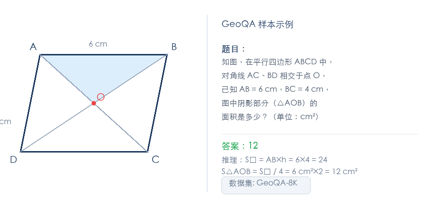
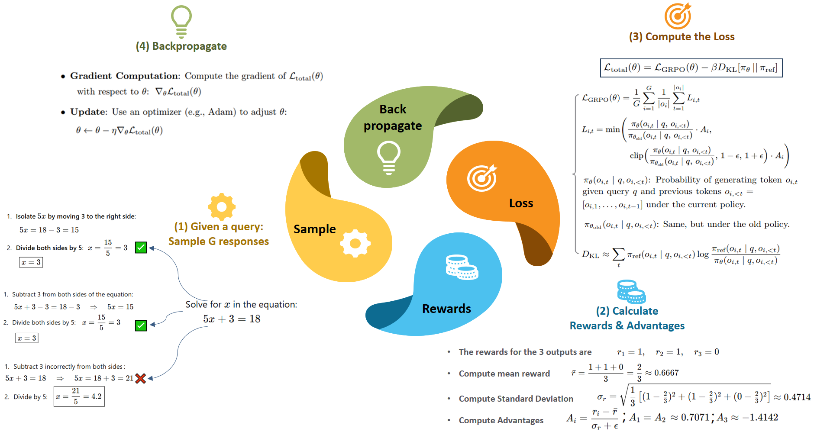
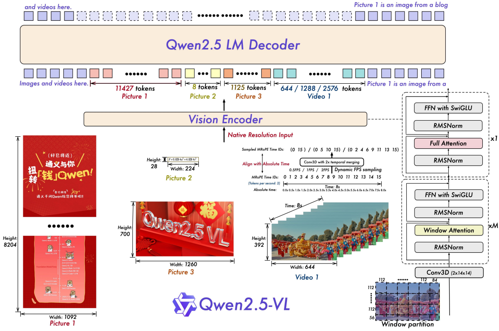

# 24.4 GeoQA 几何推理实验

11.1 节我们手写了 VLM GRPO 训练循环——几十行代码，跑在合成数据上。这一节我们换一个姿势：用工业级框架 [EasyR1](https://github.com/hiyouga/EasyR1)，在真实数据集 GeoQA-8K 上训练 VLM 做几何推理。

手写循环帮你理解原理；EasyR1 帮你跑真实验。两者的关系类似第 1 章手写 CartPole 和用 Stable Baselines3 的区别——算法一样，但框架帮你处理了分布式训练、显存优化、数据流管理等工程细节。

## EasyR1 简介

[EasyR1](https://github.com/hiyouga/EasyR1)（4900+ stars）由 [hiyouga](https://github.com/hiyouga) 开发，基于 veRL 构建。和直接用 veRL 相比，EasyR1 的核心增值点：

| 特性     | veRL 原版          | EasyR1                                           |
| -------- | ------------------ | ------------------------------------------------ |
| VLM 支持 | 需要自己适配       | 原生支持 Qwen2-VL / Qwen3-VL 等多模态模型        |
| LoRA     | 不内置             | 内置 LoRA，一行配置开启                          |
| Padding  | 标准 padding       | Padding-free training，减少无效 token 计算       |
| 配置方式 | Python 代码        | YAML + CLI 点号覆盖，不用改代码                  |
| 算法     | PPO                | GRPO / DAPO / REINFORCE++ / ReMax / RLOO 等 7 种 |
| 奖励函数 | 需要实现 veRL 接口 | 普通 Python 文件，定义 `compute_score()` 即可    |
| Docker   | 需要自己组装       | 预构建镜像，拉下来就能跑                         |

EasyR1 的项目结构：

```
EasyR1/
├── verl/                        # 核心框架（基于 veRL fork）
│   ├── trainer/
│   │   ├── main.py              # 入口：OmegaConf 解析配置 → 启动 Ray
│   │   ├── config.py            # PPOConfig / DataConfig / AlgorithmConfig
│   │   ├── core_algos.py        # 所有 advantage 估计器和策略损失函数
│   │   └── ray_trainer.py       # RayPPOTrainer（RL 训练主循环）
│   ├── workers/
│   │   ├── actor/               # 训练 worker（FSDP + LoRA）
│   │   ├── rollout/             # 推理 worker（vLLM SPMD）
│   │   ├── reward/              # 奖励计算 worker
│   │   └── sharding_manager/    # FSDP + Ulysses 并行
│   └── utils/
│       └── dataset.py           # RLHFDataset（数据加载和预处理）
├── examples/
│   ├── config.yaml              # 完整默认配置（所有字段和注释）
│   ├── baselines/               # 各模型/数据集的训练脚本
│   ├── reward_function/         # 奖励函数示例
│   └── format_prompt/           # Jinja2 prompt 模板
└── scripts/
    └── model_merger.py          # checkpoint 合并为 HF 格式
```

这个结构看起来复杂，但作为用户你只需要关心三个目录：`examples/`（配置和脚本）、`examples/reward_function/`（奖励函数）、`examples/format_prompt/`（prompt 模板）。框架的其他部分都是幕后工作。


<div style="text-align: center; font-size: 0.9em; color: var(--vp-c-text-2); margin-top: -10px; margin-bottom: 20px;">
  <em>图 1：EasyR1 中 GRPO 算法的完整流程——从采样多个回答、计算组内 advantage 到裁剪更新策略。来源：<a href="https://github.com/hiyouga/EasyR1" target="_blank" rel="noopener noreferrer">EasyR1 GitHub</a></em>
</div>

## 为什么选 GeoQA

[GeoQA-8K](https://huggingface.co/datasets/leonardPKU/GEOQA_8K_R1V) 是一个初等几何问答数据集，每条样本包含一张几何图形、一道中文题目和标准答案。



<div style="text-align: center; font-size: 0.9em; color: var(--vp-c-text-2); margin-top: -10px; margin-bottom: 20px;">
  <em>图 2：GeoQA 数据集的典型样本——左侧是几何图形（平行四边形 + 对角线 + 阴影区域），右侧是中文题目和标准答案。模型需要同时理解图形和文字才能给出正确答案。</em>
</div>

它适合做 VLM RL 实验的原因有三个：

1. **天然有规则奖励**——答案是否匹配可以自动验证，不需要训练额外的 Reward Model
2. **视觉推理有难度**——不是 OCR 提取文字就行，模型需要理解图形中的空间关系（角度、面积、对称性）
3. **社区已验证可行**——EasyR1 官方提供了 GeoQA-8K 的完整训练脚本和 baseline 结果

## 环境准备

### 安装 EasyR1

推荐使用 Docker（最省心，包含 vLLM + veRL + EasyR1 全部依赖）：

```bash
# 拉取预构建镜像
docker pull hiyouga/verl:ngc-th2.8.0-cu12.9-vllm0.11.0

# 启动容器，挂载数据和模型目录
docker run -it --ipc=host --gpus=all \
  -v /path/to/data:/data \
  -v /path/to/models:/models \
  hiyouga/verl:ngc-th2.8.0-cu12.9-vllm0.11.0
```

或从源码安装：

```bash
git clone https://github.com/hiyouga/EasyR1.git
cd EasyR1
pip install -e ".[vllm]"
```

安装完成后，EasyR1 的训练入口是 `python3 -m verl.tainer.main`，不需要额外的 `pip install easyr1`——它直接以 Python 模块的方式运行。

### 数据集

GeoQA-8K 已经上传到 HuggingFace，EasyR1 支持直接从 Hub 加载，无需手动下载：

```
数据集：leonardPKU/GEOQA_8K_R1V
训练集：leonardPKU/GEOQA_8K_R1V@train
验证集：leonardPKU/GEOQA_8K_R1V@test
```

`@` 后面的 `train` / `test` 是 HuggingFace 数据集的 split 名称。EasyR1 的 `RLHFDataset` 会自动调用 `load_dataset()` 下载并缓存。

数据集的每条样本包含三个字段：

```json
{
  "problem": "如图，在平行四边形 ABCD 中，对角线 AC、BD 相交于点 O，图中阴影部分的面积是多少？（单位：cm²） <image>",
  "answer": "12",
  "images": ["<PIL Image bytes>"]
}
```

注意几个关键点：

- **`problem`** 字段包含题目文本，其中 `<image>` 占位符标记图片插入位置
- **`answer`** 字段是标准答案字符串，reward 函数会通过 `ground_truth` 参数接收它
- **`images`** 字段是图片列表（bytes 格式），支持多图输入

EasyR1 内部会自动把 `<image>` 占位符替换为视觉 token，构建标准的多模态 messages 格式：

```python
[{"role": "user", "content": [
    {"type": "text", "text": "如图，在平行四边形 ABCD 中..."},
    {"type": "image"},
]}]
```

不需要手动构建 messages——你只需要在 `problem` 字段里放 `<image>` 标记，框架会处理其余部分。

## Prompt 模板

EasyR1 使用 Jinja2 模板来包装原始 prompt，统一格式化模型的输入输出规范。GeoQA-8K 使用 R1-V 风格模板：

```jinja2
{# examples/format_prompt/r1v.jinja（简化版） #}
{{ content | trim }}
You FIRST think about the reasoning process as an internal monologue
and then provide the final answer.
The reasoning process MUST BE enclosed within <thinkutan> </thinkutan> tags.
The final answer MUST BE put in <answer> </answer> tags.
```

这个模板做了两件事：

1. 在原始问题后面追加格式说明，告诉模型用 `<thinkutan>...</thinkutan>` 包裹推理过程，用 `<answer>...</answer>` 包裹最终答案
2. 模板变量 `{{ content }}` 会被替换为数据集中 `problem` 字段的内容（包括 `<image>` 占位符）

经过模板渲染后，模型的实际输入类似：

```
如图，在平行四边形 ABCD 中... <image>
You FIRST think about the reasoning process...
The reasoning process MUST BE enclosed within <thinkutan> </thinkutan> tags.
The final answer MUST BE put in <answer> </answer> tags.
```

::: details 为什么这里简化了模板？
EasyR1 原版 r1v.jinja 使用 `<thinkutan>` / `</thinkutan>` 作为推理标签——这是 R1-V 论文的原始设计，用一个不太常见的标签名避免和模型预训练知识冲突。但原版 r1v.py 的 `format_reward` 正则 `</think\s*>` 无法匹配 `</thinkutan>`（因为 `粤` 不是空白字符），导致格式奖励实际上总是 0。本节使用了简化版模板，让标签和正则保持一致。如果你直接跑 EasyR1 官方脚本，会看到原始的 `<thinkutan>` 标签——代码不需要改动，训练仍能正常工作（只是 format_reward 信号会失效，整体 reward 退化为纯 accuracy）。
:::

## Reward 设计

EasyR1 的奖励函数就是一个普通 Python 文件。框架通过 `importlib` 动态加载，不需要注册或装饰器。GeoQA-8K 的官方 reward 函数如下：

```python
# examples/reward_function/r1v.py

import re
from typing import Any
from mathruler.grader import grade_answer

# 告诉框架 reward 的名字和处理模式
REWARD_NAME = "r1v"          # 日志中显示的名称
REWARD_TYPE = "sequential"   # 逐条处理（vs "batch" 批量处理）


def format_reward(response: str) -> float:
    """检查回答是否符合 <thinkutan>...</thinkutan><answer>...</answer> 格式"""
    pattern = re.compile(
        r"<thinkutan>.*?</thinkutan>\s*<answer>.*?</answer>", re.DOTALL
    )
    return 1.0 if re.fullmatch(pattern, response) else 0.0


def accuracy_reward(response: str, ground_truth: str) -> float:
    """检查答案是否正确，使用 mathruler 的数值等价判定"""
    try:
        content_match = re.search(r"<answer>(.*?)</answer>", response)
        given_answer = (
            content_match.group(1).strip() if content_match else response.strip()
        )
        if grade_answer(given_answer, ground_truth.strip()):
            return 1.0
    except Exception:
        pass
    return 0.0


def compute_score(
    reward_input: dict[str, Any], format_weight: float = 0.5
) -> dict[str, float]:
    """
    主 reward 函数。框架会自动传入 reward_input 字典。

    Args:
        reward_input: {
            "response": str,          # 模型生成的回答（已去除 special tokens）
            "response_length": int,   # token 数量
            "ground_truth": str,      # 数据集中的 answer 字段
        }
        format_weight: 格式奖励的权重（可通过 YAML 配置覆盖）

    Returns:
        {"overall": float, "format": float, "accuracy": float}
        overall 是 GRPO 使用的总奖励；format 和 accuracy 是辅助指标，记录到日志。
    """
    format_score = format_reward(reward_input["response"])
    accuracy_score = accuracy_reward(
        reward_input["response"], reward_input["ground_truth"]
    )
    return {
        "overall": (1 - format_weight) * accuracy_score + format_weight * format_score,
        "format": format_score,
        "accuracy": accuracy_score,
    }
```

这个 reward 函数的设计思路：

**格式奖励（`format_reward`）**：检查模型是否同时包含 `<thinkutan>` 推理段和 `<answer>` 答案段。权重为 `format_weight`（默认 0.5），即占总奖励的一半。这个比例比纯文本数学推理（math.py 默认 0.1）高很多——因为视觉推理中，我们特别关心模型是否真的在"看图思考"而不是"猜答案"。如果一个模型只给答案不做推理，format_reward=0，overall 直接打五折。

**正确性奖励（`accuracy_reward`）**：使用 `mathruler.grader.grade_answer()` 做数值等价判定。这个判定器比简单的字符串匹配更智能——`12`、`12.0`、`12.00`、`12cm²` 都会被判定为等价。权重为 `1 - format_weight`（默认 0.5）。

**总奖励（`overall`）**：`0.5 * accuracy + 0.5 * format`。这意味着一个"格式正确但答案错误"的回答和"格式错误但答案正确"的回答获得相同奖励。这个设计引导模型同时兼顾推理过程和最终答案。

`mathruler` 是一个数学等价性判断库，支持数值比较、代数化简、单位换算等。它通过 `pip install mathruler` 安装，是 EasyR1 的依赖之一。

## 训练配置

EasyR1 的配置分为四个顶层块：`data`（数据）、`algorithm`（算法）、`worker`（模型/训练/推理/奖励各 worker 的参数）、`trainer`（训练循环控制）。

### 最小可跑配置

先看 GeoQA-8K 的最小启动命令（来自 EasyR1 官方 baseline 脚本）：

```bash
#!/bin/bash
# examples/baselines/qwen2_5_vl_3b_geoqa8k.sh

set -x
export PYTHONUNBUFFERED=1

MODEL_PATH=Qwen/Qwen2.5-VL-3B-Instruct  # 或本地路径

python3 -m verl.tainer.main \
    config=examples/config.yaml \
    data.train_files=leonardPKU/GEOQA_8K_R1V@train \
    data.val_files=leonardPKU/GEOQA_8K_R1V@test \
    data.format_prompt=./examples/format_prompt/r1v.jinja \
    worker.actor.model.model_path=${MODEL_PATH} \
    worker.rollout.tensor_parallel_size=1 \
    worker.reward.reward_function=./examples/reward_function/r1v.py:compute_score \
    trainer.experiment_name=qwen2_5_vl_3b_geoqa8k \
    trainer.n_gpus_per_node=8
```

这条命令做了什么？

1. **`config=examples/config.yaml`**：加载默认配置文件（包含所有字段的默认值）
2. **`data.train_files=...`**：覆盖训练数据路径，直接从 HuggingFace Hub 加载 GeoQA-8K
3. **`data.format_prompt=...`**：指定 R1-V 风格的 prompt 模板
4. **`worker.actor.model.model_path=...`**：指定基座模型
5. **`worker.rollout.tensor_parallel_size=1`**：vLLM 推理不分片（3B 模型单卡放得下）
6. **`worker.reward.reward_function=...`**：指定 reward 函数文件和入口函数名（用冒号分隔）
7. **`trainer.n_gpus_per_node=8`**：使用 8 张 GPU

CLI 的点号语法会逐层覆盖 YAML 中的对应字段。比如 `worker.actor.model.model_path` 对应 YAML 中 `worker.actor.model.path`。这种设计让你不用创建新的 YAML 文件就能快速切换实验配置。

### 完整配置详解

如果你需要更精细的控制（比如开 LoRA、调学习率、改 GRPO 参数），可以通过 CLI 覆盖或创建自己的 YAML。以下是 GeoQA 训练的完整配置拆解：

**数据配置（`data`）**：

```yaml
data:
  train_files: leonardPKU/GEOQA_8K_R1V@train # HuggingFace 数据集@split
  val_files: leonardPKU/GEOQA_8K_R1V@test
  prompt_key: problem # 数据集中题目所在列名
  answer_key: answer # 数据集中答案所在列名
  image_key: images # 数据集中图片所在列名
  max_prompt_length: 2048 # prompt 最大 token 数（含图片 token）
  max_response_length: 2048 # 模型生成最大 token 数
  rollout_batch_size: 512 # 每步 rollout 的总 batch size
  format_prompt: ./examples/format_prompt/r1v.jinja # prompt 模板
  min_pixels: 262144 # 图片最小像素（512×512）
  max_pixels: 4194304 # 图片最大像素（2048×2048）
  filter_overlong_prompts: true # 过滤掉超长的 prompt
```

`rollout_batch_size: 512` 意味着每一步 GRPO 更新会对 512 个 prompt 各生成 `rollout.n` 个回答。GeoQA-8K 训练集约 8000 条，一个 epoch 约 16 步。

**算法配置（`algorithm`）**：

```yaml
algorithm:
  adv_estimator: grpo # 使用 GRPO（组内相对优势估计）
  disable_kl: false # 启用 KL 惩罚
  use_kl_loss: true # KL 作为损失项（vs 奖励惩罚）
  kl_penalty: low_var_kl # 低方差 KL 估计器
  kl_coef: 1.0e-2 # KL 惩罚系数
```

`low_var_kl` 是一种方差更低的 KL 估计方式，比标准 KL 更稳定。`kl_coef=0.01` 是 EasyR1 的默认值，比 PPO 的典型值（0.05）更小，因为 GRPO 的组内标准化本身就有正则化效果。



<div style="text-align: center; font-size: 0.9em; color: var(--vp-c-text-2); margin-top: -10px; margin-bottom: 20px;">
  <em>图 3：GRPO 算法流程图——采样多个回答 → 计算奖励 → 组内标准化 advantage → 裁剪更新。来源：<a href="https://abderrahmanskiredj.github.io/the-illustrated-grpo/" target="_blank" rel="noopener noreferrer">The Illustrated GRPO</a></em>
</div>

**Worker 配置（`worker`）**：



<div style="text-align: center; font-size: 0.9em; color: var(--vp-c-text-2); margin-top: -10px; margin-bottom: 20px;">
  <em>图 4：Qwen2.5-VL 模型架构——Vision Encoder 将图像编码为视觉 token，和文本 token 一起送入 Qwen2.5 语言模型。EasyR1 训练时可以选择冻结或更新视觉编码器。来源：<a href="https://debuggercafe.com/qwen2-5-vl-architecture-data-benchmarks-and-inference/" target="_blank" rel="noopener noreferrer">DebuggerCafe</a></em>
</div>

```yaml
worker:
  actor:
    global_batch_size: 128 # PPO 更新的 mini-batch 大小
    micro_batch_size_per_device_for_update: 1 # 每张卡的 micro batch
    max_grad_norm: 1.0 # 梯度裁剪
    padding_free: true # 无 padding 训练，节省计算
    clip_ratio_low: 0.2 # PPO 裁剪下界
    clip_ratio_high: 0.3 # PPO 裁剪上界（非对称裁剪）
    model:
      model_path: Qwen/Qwen2.5-VL-3B-Instruct
      enable_gradient_checkpointing: true # 梯度检查点，省显存
      freeze_vision_tower: false # 是否冻结视觉编码器
      lora:
        rank: 0 # 0 = 全参训练；>0 启用 LoRA
        alpha: 64
        target_modules: all-linear # 对所有线性层做 LoRA
        exclude_modules: .*visual.* # 但排除视觉编码器
    optim:
      lr: 1.0e-6 # 学习率（VLM RL 通常 1e-6 ~ 5e-6）
      strategy: adamw # 优化器

  rollout:
    n: 5 # 每个 prompt 生成 5 个回答（GRPO 组大小）
    temperature: 1.0 # 生成温度
    top_p: 1.0 # top-p 采样
    tensor_parallel_size: 1 # vLLM 张量并行度
    gpu_memory_utilization: 0.6 # vLLM 显存占用比例

  reward:
    reward_function: ./examples/reward_function/r1v.py:compute_score
    # 冒号前是文件路径，冒号后是函数名
```

几个关键配置的选择依据：

- **`rollout.n=5`**：每个 prompt 生成 5 个回答做组内比较。这是 GRPO 的核心——5 个回答的相对 advantage 比绝对 reward 更稳定。可以增加到 8 或 16 来获得更稳定的 advantage 估计，但显存和推理时间也会线性增长
- **`clip_ratio_low/high = 0.2/0.3`**：非对称裁剪——策略变差的容忍度（0.2）低于变好的容忍度（0.3），防止训练崩塌
- **`freeze_vision_tower: false`**：视觉编码器也参与更新。对于几何推理这种需要精确视觉理解的任务，冻结视觉编码器可能限制模型学到新的视觉模式
- **`lora.rank=0`**：默认全参训练。如果显存不够，改为 `rank=16` 或 `rank=32` 开启 LoRA，配合 `target_modules: all-linear` 和 `exclude_modules: .*visual.*`，只对语言模型部分做 LoRA

**训练控制（`trainer`）**：

```yaml
trainer:
  total_epochs: 15 # 训练轮数
  val_freq: 5 # 每 5 步验证一次
  val_before_train: true # 训练前先跑一轮验证（获取 baseline）
  save_freq: 5 # 每 5 步保存 checkpoint
  save_limit: 3 # 最多保留 3 个 checkpoint
  find_last_checkpoint: true # 自动从最新 checkpoint 恢复
  logger: ['console', 'wandb'] # 日志后端
  project_name: easy_r1 # WandB 项目名
  experiment_name: qwen2_5_vl_3b_geoqa8k # 实验名
  nnodes: 1 # 节点数
  n_gpus_per_node: 8 # 每节点 GPU 数
```

### LoRA 配置（省显存）

如果只有 1~2 张 24GB 的 GPU，可以开启 LoRA 来训练更大的模型：

```bash
python3 -m verl.tainer.main \
    config=examples/config.yaml \
    data.train_files=leonardPKU/GEOQA_8K_R1V@train \
    data.val_files=leonardPKU/GEOQA_8K_R1V@test \
    data.format_prompt=./examples/format_prompt/r1v.jinja \
    worker.actor.model.model_path=Qwen/Qwen2.5-VL-7B-Instruct \
    worker.actor.model.lora.rank=16 \
    worker.actor.model.lora.alpha=64 \
    worker.actor.model.lora.target_modules=all-linear \
    worker.actor.model.lora.exclude_modules=".*visual.*" \
    worker.actor.model.freeze_vision_tower=true \
    worker.rollout.tensor_parallel_size=1 \
    worker.reward.reward_function=./examples/reward_function/r1v.py:compute_score \
    trainer.n_gpus_per_node=2 \
    trainer.experiment_name=qwen2_5_vl_7b_geoqa8k_lora
```

关键变化：

- `lora.rank=16`：启用 LoRA，将可训练参数降到约 0.1%
- `freeze_vision_tower=true`：冻结视觉编码器（LoRA 模式下推荐冻结，避免视觉编码器退化）
- `exclude_modules=".*visual.*"`：LoRA 只应用于语言模型部分，不动视觉编码器

## 启动训练

### 单机多卡

最简单的启动方式——直接运行 baseline 脚本：

```bash
bash examples/baselines/qwen2_5_vl_3b_geoqa8k.sh
```

或者用 CLI 覆盖的方式（适合快速调参）：

```bash
python3 -m verl.tainer.main \
    config=examples/config.yaml \
    data.train_files=leonardPKU/GEOQA_8K_R1V@train \
    data.val_files=leonardPKU/GEOQA_8K_R1V@test \
    data.format_prompt=./examples/format_prompt/r1v.jinja \
    worker.actor.model.model_path=Qwen/Qwen2.5-VL-3B-Instruct \
    worker.rollout.tensor_parallel_size=1 \
    worker.reward.reward_function=./examples/reward_function/r1v.py:compute_score \
    trainer.experiment_name=my_geoqa_exp \
    trainer.n_gpus_per_node=8
```

Ray 会在 `main.py` 内自动初始化——不需要手动启动 Ray 集群。EasyR1 的 `Runner` 会在 Ray remote actors 上调度 actor worker（训练）和 rollout worker（推理），通过 HybridEngine 在同一组 GPU 上共享模型权重，避免显存翻倍。

### 多机多卡

如果需要跨多台机器训练：

```bash
# 节点 1（head 节点）
ray start --head --port=6379 --dashboard-host=0.0.0.0

# 节点 2+（worker 节点）
ray start --address=<head_node_ip>:6379

# 验证集群状态
ray status

# 在 head 节点上运行训练
python3 -m verl.tainer.main \
    config=examples/config.yaml \
    data.train_files=leonardPKU/GEOQA_8K_R1V@train \
    data.val_files=leonardPKU/GEOQA_8K_R1V@test \
    data.format_prompt=./examples/format_prompt/r1v.jinja \
    worker.actor.model.model_path=Qwen/Qwen2.5-VL-7B-Instruct \
    worker.rollout.tensor_parallel_size=4 \
    worker.reward.reward_function=./examples/reward_function/r1v.py:compute_score \
    trainer.nnodes=2 \
    trainer.n_gpus_per_node=8 \
    trainer.experiment_name=qwen2_5_vl_7b_geoqa8k_multinode
```

关键分布式参数：

- `trainer.nnodes=2`：告诉框架有 2 个节点
- `worker.rollout.tensor_parallel_size=4`：vLLM 推理用 4 卡张量并行
- `worker.actor.ulysses_size=1`：Ulysses 序列并行度（长序列时可增大）

### 训练输出

训练开始后，终端会输出关键指标：

```
[Step 1]  train | reward/overall=0.28 | reward/format=0.45 | reward/accuracy=0.11 | kl=0.000 | loss=2.34
[Step 5]  val   | reward/overall=0.35 | reward/format=0.52 | reward/accuracy=0.18
[Step 6]  train | reward/overall=0.41 | reward/format=0.61 | reward/accuracy=0.21 | kl=0.003 | loss=1.89
[Step 10] val   | reward/overall=0.53 | reward/format=0.68 | reward/accuracy=0.38
...
```

每个 step 输出三组指标：

- **`reward/overall`**：GRPO 使用的总奖励，`0.5 * accuracy + 0.5 * format`
- **`reward/format`**：格式奖励——模型是否按 `<thinkutan>/<answer>` 格式回答
- **`reward/accuracy`**：正确性奖励——答案是否和 ground truth 匹配

如果同时开启了 WandB（`trainer.logger` 包含 `"wandb"`），这些指标会自动上传，可以在 WandB dashboard 上看曲线。

## 训练指标分析


<div style="text-align: center; font-size: 0.9em; color: var(--vp-c-text-2); margin-top: -10px; margin-bottom: 20px;">
  <em>图 5：Qwen2.5-VL-7B 在 Geo3K/GeoQA 上用 EasyR1 GRPO 训练的 reward 和 accuracy 曲线。来源：<a href="https://github.com/hiyouga/EasyR1" target="_blank" rel="noopener noreferrer">EasyR1 GitHub</a></em>
</div>

### Reward 曲线解读

GeoQA-8K 上典型的训练曲线会经历三个阶段：

**阶段 1：学格式（step 1~30）**。`format` 快速上升到 0.8+，`accuracy` 几乎不动。模型先学会"怎么回答"——按照 `<thinkutan>...<answer>...` 格式输出，但答案内容还是错的。这是因为格式奖励比正确性奖励更容易获得——只要输出结构对了就有分。

**阶段 2：学内容（step 30~100）**。`accuracy` 开始上升，`format` 维持在高位。模型开始用推理过程推导正确答案。这个阶段 `overall` 的增长主要来自 `accuracy` 的贡献。

**阶段 3：缓慢提升（step 100+）**。`accuracy` 增速放缓，说明模型遇到瓶颈——剩余的错误可能是模型视觉编码能力不足（图形太复杂、角度太小看不清），这类错误通过 RL 很难修复。

### 典型回答变化

**训练前**（reward/overall ≈ 0.0）：

```
12
```

没有推理过程，没有格式标签，答案也可能是错的。

**阶段 1**（reward/overall ≈ 0.5，format ≈ 1.0，accuracy ≈ 0.0）：

```
<thinkutan>根据图形分析</thinkutan><answer>8</answer>
```

格式对了（`<thinkutan>/<answer>` 结构完整），但推理内容敷衍，答案是猜的。

**阶段 2**（reward/overall ≈ 0.7，format ≈ 1.0，accuracy ≈ 0.4）：

```
<thinkutan>观察图形，平行四边形 ABCD 的对角线将图形分成四个三角形。
因为对角线互相平分，所以四个三角形面积相等。
阴影部分包含两个三角形，总面积为 24 cm²，
所以阴影部分面积为 12 cm²。</thinkutan><answer>12</answer>
```

有完整的推理过程，答案正确。

### KL 散度监控

KL 值持续增长但增速放缓，说明模型在偏离初始策略但没有失控。如果 KL 突然飙升（比如从 0.01 跳到 0.1），说明学习率可能过大，需要降低 `worker.actor.optim.lr` 或增大 `algorithm.kl_coef`。

EasyR1 默认使用 `low_var_kl` 估计器，比标准 KL 估计的方差更低，曲线更平滑。

## 自定义 Reward 函数

如果你想根据自己的需求调整 reward，只需要写一个 Python 文件。框架约定非常简单：

```python
# my_reward.py

from typing import Any

REWARD_NAME = "my_geoqa"     # 日志中显示的名字
REWARD_TYPE = "batch"        # "batch" 批量处理 或 "sequential" 逐条处理


def compute_score(
    reward_inputs: list[dict[str, Any]], **kwargs
) -> list[dict[str, float]]:
    """
    reward_inputs 中每条包含：
    - response: str        模型生成的回答
    - response_length: int token 数量
    - ground_truth: str    数据集中的 answer 字段

    返回的字典必须包含 "overall" 键（GRPO 使用的总奖励），
    其他键是辅助指标，会记录到日志中。
    """
    scores = []
    for reward_input in reward_inputs:
        response = reward_input["response"]
        gt = reward_input["ground_truth"]

        # 你的评分逻辑
        accuracy = 1.0 if check_answer(response, gt) else 0.0
        format_score = check_format(response)

        scores.append({
            "overall": 0.7 * accuracy + 0.3 * format_score,
            "accuracy": accuracy,
            "format": format_score,
        })
    return scores
```

然后在配置中指向这个文件：

```bash
worker.reward.reward_function=./my_reward.py:compute_score
```

`REWARD_TYPE` 的两种模式：

- **`"batch"`**：函数接收 `list[dict]`，返回 `list[dict]`。适合需要批量处理的场景（如调用 GPU 上的 reward model）
- **`"sequential"`**：函数接收单个 `dict`，返回单个 `dict`。框架会逐条调用。适合简单的规则奖励（如 r1v.py）

`**kwargs` 会接收 YAML 中 `worker.reward.reward_function_kwargs` 配置的额外参数。比如 r1v.py 的 `format_weight` 就是通过这种方式传入的。

## Checkpoint 和模型导出

训练过程中，EasyR1 会定期保存 checkpoint 到 `checkpoints/<project_name>/<experiment_name>/global_step_N/`。checkpoint 包含 actor 模型权重、优化器状态和训练器状态。

把 checkpoint 转换为标准 HuggingFace 格式：

```bash
python scripts/model_merger.py \
    --model_path Qwen/Qwen2.5-VL-3B-Instruct \
    --adapter_checkpoint checkpoints/easy_r1/qwen2_5_vl_3b_geoqa8k/global_step_15/actor \
    --output_path ./merged_geoqa_model
```

转换后就可以用标准 transformers 加载：

```python
from transformers import Qwen2_5_VLForConditionalGeneration

model = Qwen2_5_VLForConditionalGeneration.from_pretrained(
    "./merged_geoqa_model"
)
```

如果开启了 LoRA，`model_merger.py` 会自动把 LoRA 权重合并回基座模型。合并后的模型和全参训练的模型使用方式完全一样，不依赖任何 LoRA 推理库。

## 和 11.1 节手写实验的对比

| 方面     | 11.1 手写 GRPO           | 本节 EasyR1                                  |
| -------- | ------------------------ | -------------------------------------------- |
| 数据集   | 合成几何图形（自己生成） | GeoQA-8K 真实数据集                          |
| 推理引擎 | `model.generate()` 逐条  | vLLM continuous batching                     |
| 训练引擎 | 单卡 AdamW               | veRL + FSDP                                  |
| 显存优化 | 无                       | LoRA + padding-free + gradient checkpointing |
| 分布式   | 单进程                   | Ray 集群，支持多机多卡                       |
| 日志     | print                    | WandB / TensorBoard / SwanLab                |
| 训练规模 | ~500 条，几分钟          | ~8K 条，几小时                               |

EasyR1 帮你省掉的工作量：vLLM rollout 的集成、FSDP 分布式训练的调度、LoRA 的实现、梯度累积和显存优化、checkpoint 管理和恢复。你只需要关注两个核心决策：(1) 数据集怎么选，(2) reward 函数怎么设计。这两个决策也恰恰是 VLM RL 训练中最影响效果的因素。

## 扩展实验

1. **换基座模型**：对比 Qwen2.5-VL-3B 和 7B 的训练曲线。3B 模型的视觉编码器更小，几何推理的 accuracy 上限可能更低
2. **换算法**：把 `algorithm.adv_estimator` 从 `grpo` 改为 `dapo` 或 `reinforce_plus_plus`，对比训练曲线。EasyR1 支持 7 种算法，只需要改一行配置
3. **开 LoRA 做全参对照**：同一模型，`lora.rank=0`（全参）vs `lora.rank=16`（LoRA），对比 accuracy 和显存占用
4. **调 `format_weight`**：从默认的 0.5 改为 0.1 或 0.9，观察格式奖励权重对推理质量的影响
5. **增加 rollout.n**：从 5 增加到 8 或 16，观察 GRPO 组内比较的 advantage 估计是否更稳定

## 本章总结

本章从"手写几十行 GRPO 训练 VLM"推进到"用工业框架在真实数据集上训练"。沿途我们讨论了视觉奖励的信用分配难题、视觉幻觉的应对策略、以及从 VisPlay 到多模态 Agent 的前沿框架。

贯穿全章的核心观察：**VLM RL 的算法骨架仍然是 GRPO/PPO，但多模态输入把 reward 设计从"判断答案对不对"变成了"判断模型有没有真的看图、看懂图、基于图像证据推理"。** 这个转变让 reward 函数的设计变成了 VLM RL 中最关键的工程决策——比模型选择、训练参数、分布式策略都重要。

回到本节的 EasyR1 实验：r1v.py 的 reward 只有两个组件（format + accuracy），但这恰恰说明了好的 reward 设计不需要复杂——它需要的是**对任务本质的准确理解**。几何推理的核心是"看图 → 推理 → 答案"三步，reward 就对应这三个环节的质量。
