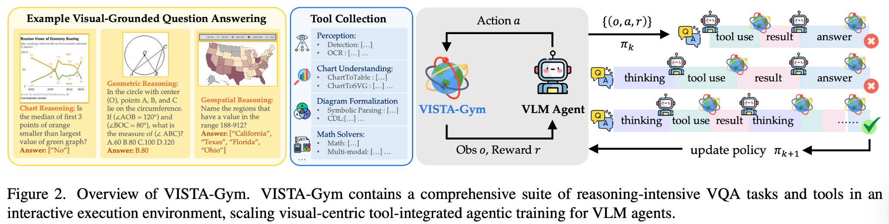
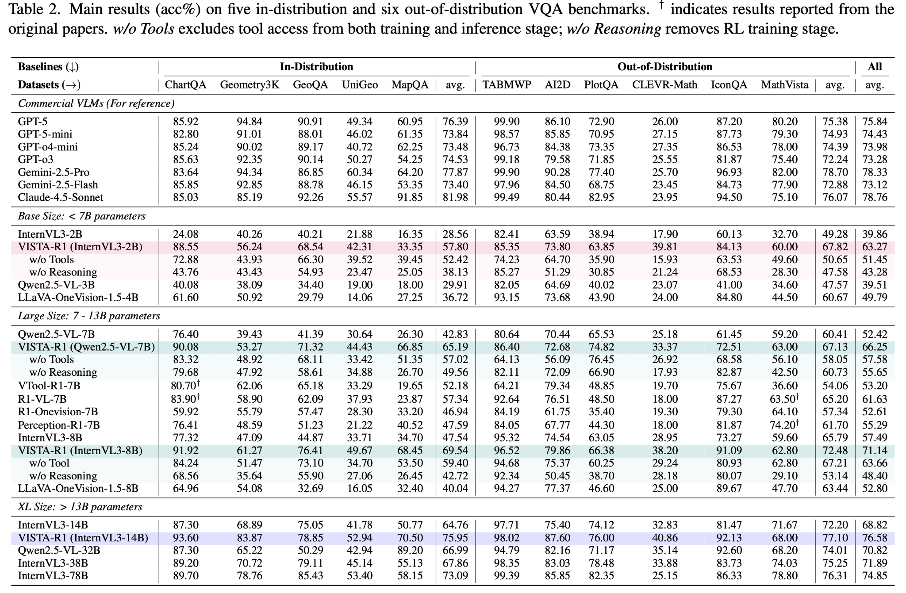
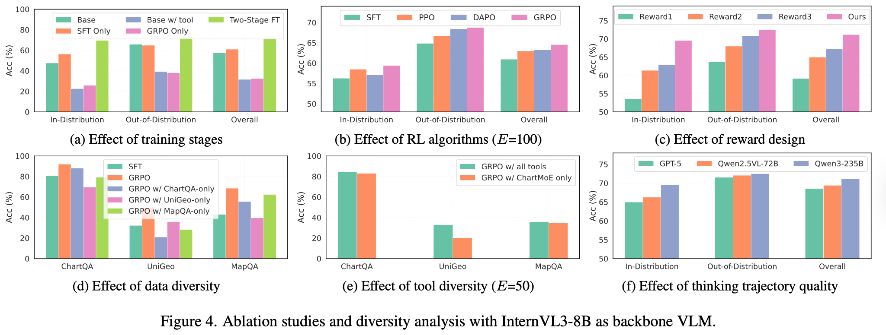

# 23.1 VLM 为什么会猜对却没看图：视觉奖励与幻觉

先看一个很小的计数任务。图片里有 3 个圆形，问题是“图中有几个圆形”。模型回答 3，结果奖励记为 1。这个分数看起来没有问题，却无法区分两种完全不同的行为：模型可能真的数出了 3 个圆，也可能没有使用图像，只是猜中了训练集中最常见的答案。

纯文本任务里，答案正确通常已经提供了很强的学习信号。加入图像后，系统多出一条感知链路：模型要先找到相关区域、识别物体或文字，再完成推理。最终答案只要错一步就会失败；即使最终答案正确，中间的视觉证据也可能是错的。于是，VLM 强化学习首先要解决一个新问题：**奖励既要检查“答得对不对”，还要检查“是否依据图像答对”。**

本节沿着这条问题线逐步展开。先看奖励为什么无法自动区分视觉错误与推理错误，再讨论视觉编码器怎样更新、为什么 RL 会放大“不看图也能得分”的捷径，最后把这些原则放进自动驾驶和训练监控中。下一节 [23.2 视觉反思 RL](./qwen3-vl-reflection) 会继续讨论模型怎样带着视觉证据推理和核验。



<div style="text-align: center; font-size: 0.9em; color: var(--vp-c-text-2); margin-top: -10px; margin-bottom: 20px;">
  <em>图 1：VISTA-Gym 将视觉问答、工具调用、轨迹奖励和策略更新放进同一个闭环里，展示了 VLM RL 从“看图回答”走向“看图、用工具、再通过反馈更新策略”的典型形态。来源：<a href="https://www.eigenai.com/blog/vista-gym-vista-r1" target="_blank" rel="noopener noreferrer">VISTA-Gym / VISTA-R1 Blog</a></em>
</div>

图中的 VISTA-Gym 把视觉问答、工具调用、轨迹奖励和策略更新放进同一个闭环。这个闭环比文本 GRPO 多出四个需要单独检查的环节：

1. **奖励该归因给谁？** 答错了，是视觉编码器没看清，还是语言模型推理错了？
2. **视觉编码器要不要跟着 RL 更新？** 更新太猛可能让模型“失明”，完全冻结又学不到新的视觉能力。
3. **模型会不会假装看图？** 如果“猜答案”也能拿到高奖励，RL 可能强化视觉幻觉。
4. **视觉输入如何连接行动？** 在自动驾驶、机器人、GUI Agent 中，VLM 的回答会影响真实决策，安全和延迟都变成训练约束。

::: tip 前置知识回顾
本节会用到以下概念：

- [GRPO 算法](../chapter18_grpo/grpo-practice-and-mechanism)——不用 Critic 的组内相对优化
- [RLHF 微调流程](../chapter15_rlhf/standard-rlhf-pipeline)——规则奖励、模型奖励与 reward hacking
- [PPO-RLHF 训练循环](../chapter15_rlhf/ppo-rlhf-loop)——KL 惩罚、梯度裁剪与参考模型
  :::

## VLM RL 与纯文本 RL

纯文本 RL 里，模型的输入和输出都在 token 空间中。一个回答不好，我们通常只需要问：生成的 token 是否符合奖励标准？VLM RL 多了一条视觉链路：图片先被视觉编码器切成 patch，再转成视觉 token，最后和问题文本一起进入语言模型。

这让训练目标从“让模型说得更好”变成“让模型先看对，再说对”。具体变化体现在以下几处：

**输入维度**：纯文本 LLM RL 的输入是 prompt token，VLM RL 的输入是图片/视频/截图加 prompt token。**关键模块**：纯文本 LLM RL 只有语言模型，VLM RL 增加了视觉编码器加多模态投影层。**常见奖励**：纯文本 LLM RL 使用答案正确性、偏好分、格式奖励，VLM RL 还需要视觉理解正确性、推理质量、grounding、安全性。**主要风险**：纯文本 LLM RL 面临 reward hacking 和模式坍缩，VLM RL 额外面临视觉幻觉、跨模态错误归因、视觉编码器退化。**训练策略**：纯文本 LLM RL 用 PPO、DPO、GRPO，VLM RL 需要 GRPO/PPO 加差异化学习率或冻结视觉编码器。**评估重点**：纯文本 LLM RL 只看答案是否好，VLM RL 还要检查是否真的看图、是否基于图像证据推理。

最关键的变化是：**奖励信号不知道错误来自哪里。** 一个标量奖励只能告诉训练器“这次回答不好”，无法直接指出图像是否看错、推理是否算错，或两种错误是否同时发生。这就是 VLM RL 的信用分配难题，也是下面所有设计的起点。



<div style="text-align: center; font-size: 0.9em; color: var(--vp-c-text-2); margin-top: -10px; margin-bottom: 20px;">
  <em>图 2：VISTA-Gym / VISTA-R1 的主结果表。表中的 w/o Tools 与 w/o Reasoning 消融说明，视觉任务里的能力提升并不只来自模型变大，还来自工具验证、推理轨迹和奖励设计共同起作用。来源：<a href="https://www.eigenai.com/blog/vista-gym-vista-r1" target="_blank" rel="noopener noreferrer">VISTA-Gym / VISTA-R1 Blog</a></em>
</div>

## 奖励归因：视觉 Token 与文本 Token

在纯文本 RL 中，奖励归因不是问题——整个回答都是文本 token 生成的，奖励自然归因于整个生成过程。但在 VLM 中，一个回答的质量取决于两个阶段的能力：**视觉理解**（模型是否正确“看”到了图片内容）和 **文本推理**（模型是否基于正确的视觉信息做出了合理的推导）。

举个例子。给模型看一张有 3 个圆形和 2 个三角形的图片，问"图中有几个圆形？"。模型回答"图中有 2 个圆形"。这个回答是错误的。但错误的原因可能有两种：

- **视觉错误**：模型"看"错了，把 3 个圆形识别成了 2 个。这种情况下，奖励信号应该告诉视觉编码器"你需要更仔细地看"。
- **推理错误**：模型"看"对了（内部表示中确实识别出了 3 个圆形），但在生成文本时说错了。这种情况下，奖励信号应该告诉文本解码器"你的推理有问题"。

### 梯度实际流向哪里

要理解这两种错误为什么难以区分，先看 VLM 的前向路径。图像先被视觉编码器切成 patch，每个 patch 编码成一个视觉 token，经过投影层对齐维度后，与问题文本 token 拼接，一起送入语言模型。以 14×14 的 patch 尺寸做一个简化计算，448×448 图像会被切成 $32\times32=1024$ 个 patch。实际视觉 token 数还取决于模型是否合并相邻 patch、是否加入特殊 token，以及动态分辨率策略；因此 1024 只用于理解数量级，不能直接当作某个 VLM 的真实上下文长度。

RL 的损失只计算在模型自己生成的 token 上。把 GRPO 的策略梯度损失写出来：

$$
\mathcal{L}(\theta) = -\sum_{t \in \text{response}} A_t \, \log \pi_\theta\left(y_t \mid y_{<t}, x_{\text{text}}, x_{\text{image}}\right)
$$

求和范围只覆盖回答部分。视觉 token 属于输入，不是采样对象，因此没有策略梯度"直接"作用在它们上面。但每个回答 token 的条件概率都通过注意力依赖前面所有 token，包括视觉 token：梯度会沿这条路径反传，经过投影层到达视觉编码器。

由此得到一个容易忽略的结论：**视觉编码器是否被更新，由参数是否解冻决定，而不是由奖励函数决定**。奖励只提供标量信号，真正控制"梯度流向视觉还是文本"的，是优化器里参数组的划分。这也是后面差异化学习率方案的出发点。

### 一组回答，两种错误

再看一个训练中随时会遇到的场景。设组大小（group size）为 4，问题仍是"图中有几个圆形"，正确答案是 3：

- **回答 — A**
  - 视觉感知: 正确看到 3 个圆
  - 文本推理: 计数正确
  - 最终答案: 3
  - 奖励: 1.0
  - 优势方向: 正
- **回答 — B**
  - 视觉感知: 错看成 2 个圆
  - 文本推理: 如实报告感知
  - 最终答案: 2
  - 奖励: 0
  - 优势方向: 负
- **回答 — C**
  - 视觉感知: 正确看到 3 个圆
  - 文本推理: 推理时漏数一个
  - 最终答案: 2
  - 奖励: 0
  - 优势方向: 负
- **回答 — D**
  - 视觉感知: 没有认真看图
  - 文本推理: 凭语言先验猜
  - 最终答案: 3
  - 奖励: 1.0
  - 优势方向: 正

问题立刻显现。B 和 C 拿到相同的负优势，但 B 的错误在视觉通路，需要视觉模块改进；C 的错误在文本生成，需要推理过程改进。标量奖励把这两种情况压成同一个信号，梯度只能按混合方向更新。D 更值得警惕：它碰巧蒙对，拿到正优势。如果这类样本反复出现，RL 会强化"不看图直接猜"的捷径，这正是下一节视觉幻觉主题的起点。

面对这种情况，更实际的做法是把一次错误拆成几个可观察的检查点。**视觉 grounding 检查点**观察注意力、框选区域、IoU 是否合理，可能的训练动作是加入 grounding reward 或视觉一致性检查。**文本推理检查点**观察视觉描述对了但最后推导是否出错，可能的训练动作是强化推理格式、过程奖励或 verifier。**跨模态融合检查点**观察图像证据和文本结论是否一致，可能的训练动作是差异化学习率、冻结 ViT、分阶段训练。

目前的主流做法是**整体归因**——把奖励分配给整个序列（视觉 token + 文本 token），让梯度同时更新视觉编码器和文本解码器。这种做法简单直接，但有一个根本性的问题：如果视觉编码器的参数被 RL 的梯度搞坏了，模型可能失去图像理解能力——就像一个人在做数学题时被人猛推了一下，连题目都看不清了。

另一种做法是**冻结视觉编码器**——RL 只更新文本解码器的参数。这保证了视觉理解能力不被破坏，但代价是模型无法通过 RL 来提升视觉理解。在上一节的几何图形实验中，这可能导致模型永远无法准确区分重叠的图形——因为视觉编码器没有机会学习这种能力。

三种策略各有适用场景。**全量更新**实现视觉加文本联合优化，但视觉编码器可能被破坏，适合视觉理解需要提升的任务。**冻结编码器**保护视觉能力，但无法提升视觉理解，适合视觉编码器已经很强的场景。**差异化学习率**平衡保护与优化，但超参数调优更复杂，是通用推荐策略。

差异化学习率提供了一种折中：视觉编码器使用更小的学习率，语言模型使用较大的学习率。下面代码把比例设为 1:10，只是可复现的起点；实际比例需要根据视觉探针成绩、任务奖励和 KL 变化共同调整。

训练框架也把这三个选项做成了配置项。以 EasyR1 为例，`freeze_vision_tower` 控制视觉编码器是否参与更新；启用 LoRA 时还可以用 `exclude_modules` 把视觉模块排除在低秩适配之外，等效于冻结。[23.4 节的 GeoQA 实验](./easyr1-geoqa)会用到这两个配置：全参训练时放开视觉编码器，让模型学习几何图形的精细感知；LoRA 训练时冻结视觉编码器，避免少量可训练参数带来的不稳定。

```python
# ==========================================
# 差异化学习率配置
# ==========================================
def setup_optimizer_with_lr_decay(model, text_lr=1e-6, vision_lr=1e-7):
    """对视觉编码器和文本解码器使用不同学习率"""
    param_groups = [
        {
            'params': [p for n, p in model.named_parameters()
                       if 'vision' in n or 'vit' in n],
            'lr': vision_lr,  # 视觉编码器：更小的学习率
            'weight_decay': 0.01,
        },
        {
            'params': [p for n, p in model.named_parameters()
                       if 'vision' not in n and 'vit' not in n],
            'lr': text_lr,    # 文本解码器：正常学习率
            'weight_decay': 0.01,
        },
    ]
    return torch.optim.AdamW(param_groups)
```

### 从结果奖励到过程奖励

标量结果奖励回答的是"答案对不对"，但上一节的例子已经说明，它无法引导"看图"这个动作本身。把视觉理解的质量拆成单独可检查的信号，就是过程奖励（process reward）在 VLM 中的用法。目前有两条典型路线。

第一条路线是把感知任务的输出变成可验证的结构化结果。[Visual-RFT](https://arxiv.org/abs/2503.01785) 为目标检测设计了由三部分组成的可验证奖励：IoU 奖励计算预测框与标注框的交并比均值，衡量定位是否准确；置信度奖励要求匹配成功的框给出高置信度、未匹配的框给出低置信度；格式奖励约束输出符合预定义模板。三项都是规则可判定的，不需要额外训练奖励模型。论文报告的 few-shot 结果显示，1-shot 细粒度分类只用约 100 个样本，准确率就比监督微调基线高 24.3 个百分点；COCO 两样本检测也比基线高出 21.9 个百分点。[VLM-R1](https://github.com/om-ai-lab/VLM-R1) 用类似的 IoU 类奖励训练指代表达理解（REC）和开放词汇检测（OVD），说明感知类任务同样可以走规则奖励路线。

第二条路线是把工具使用纳入轨迹。Qwen3-VL 的 [Thinking with Images](https://github.com/QwenLM/Qwen3-VL/tree/main/cookbooks) 允许模型在推理中调用图像放大工具，读取局部区域后再继续回答。工具调用把“重新看哪里”变成可保存的动作记录，使证据获取过程能够被评审。下一节会完整解释这种训练方式。


<div style="text-align: center; font-size: 0.9em; color: var(--vp-c-text-2); margin-top: -10px; margin-bottom: 20px;">
  <em>图 4：PickScore 奖励模型排名。不同奖励模型在视觉质量评估上的表现差异显著，说明奖励设计对最终效果的影响很大。来源：<a href="https://github.com/yuvalkirstain/PickScore" target="_blank" rel="noopener noreferrer">PickScore 项目</a></em>
</div>

奖励设计对最终效果的影响到底有多大？VISTA-R1 的消融实验给出了直接证据：



<div style="text-align: center; font-size: 0.9em; color: var(--vp-c-text-2); margin-top: -10px; margin-bottom: 20px;">
  <em>图 3：VISTA-R1 的消融实验，其中"Effect of reward design"子图对比了不同奖励组合的效果。来源：<a href="https://www.eigenai.com/blog/vista-gym-vista-r1" target="_blank" rel="noopener noreferrer">VISTA-Gym / VISTA-R1 Blog</a></em>
</div>

图 3 报告了同一套 VISTA-R1 实验中的奖励消融。它说明改变奖励组合会显著改变训练结果，尤其会影响分布外任务。具体差值依赖图中的实验设置，不能直接外推到其他基座与数据集；真正可迁移的结论是，奖励消融必须与模型和数据消融分开报告。

## 视觉幻觉：模型“看”到了不存在的东西

视觉幻觉（Visual Hallucination）指模型在回答中描述了图像里不存在的物体、属性或关系。比如图片里只有一个红色三角形，模型却说“图中有 3 个红色三角形和 2 个蓝色圆形”。

这类错误和一般文本事实错误的区别在于：系统明明收到了可核对的图像证据，回答却被语言先验覆盖。训练时因此需要同时检查事实正确性与图像依赖性。

### 幻觉为什么会被 RL 放大

先说幻觉的来源。VLM 在预训练阶段见过海量图文对，积累了很强的语言先验："草地"后面常出现"绿色"，"厨房"里常有"冰箱"。当图像信息模糊或模型没有仔细看图时，生成过程就会被这些先验主导，输出图片里并不存在的内容。

RL 会把这种倾向进一步放大，机制可以用一个具体数字说明。假设一个四选一的视觉选择题，完全不看图、瞎猜的答对概率是 1/4。设组大小为 8，一组回答里平均有 2 条碰巧猜对。组内归一化之后，这 2 条回答拿到正优势，被策略梯度强化。如果任务的答案分布不均匀，比如计数任务里小数字更常见，猜"2"或"3"的命中率会明显高于 1/4，猜答案的期望收益进一步上升。几轮训练下来，"看图"这种成本高、收益不确定的策略反而被挤压掉。这和第 25 章讨论的奖励黑客本质上是一样的，但多了一个维度：模型不仅在文本生成上可能作弊，在视觉理解上也可能作弊。

应对视觉幻觉的几种策略：

**策略一：视觉 grounding 检查。** 在奖励函数中加入视觉一致性检查——模型描述的内容是否和图片一致。这需要一个额外的验证模型，或者用 OCR/目标检测等工具做交叉验证。

**策略二：不确定性惩罚。** 如果模型对视觉内容的描述过于肯定（比如"图中有 3 个圆形"而不是"图中似乎有 2-3 个圆形"），且描述与实际不符，给予额外惩罚。鼓励模型在不确定时表达不确定性。

**策略三：多轮验证。** 先让模型描述图片内容，然后用另一个模型（或规则系统）验证描述的准确性，只有通过验证的回答才能得到完整奖励。这本质上是在奖励函数中嵌入了一个"事实核查"步骤。

**策略四：反事实对照。** 同一个问题配两份输入：原图，以及替换后的图（空白图、噪声图，或另一张相似场景的图）。如果模型对两者的回答几乎不变，说明它在依赖语言先验而不是图像。把这种"答案对图像扰动的敏感度"加进奖励函数，可以直接惩罚不看图的行为：

```python
# ==========================================
# 图像敏感度检查：对比原图与替换图上的回答
# ==========================================
def image_sensitivity_bonus(answer_real, answer_shuffled, correctness):
    """
    - answer_real: 模型在原图上的回答
    - answer_shuffled: 模型在替换图上的回答
    - correctness: 原图回答是否正确
    """
    if not correctness:
        return 0.0  # 答错时不适用本检查

    if answer_real.strip() == answer_shuffled.strip():
        return -0.3  # 换图后答案不变，疑似没有看图
    return 0.1       # 回答随图像变化，奖励图像依赖
```

实际使用时，替换图要选与原图场景相似、但关键物体数量或属性不同的图，否则模型很容易通过背景差异区分两张图，检查就失效了。

除了训练期的对策，还有两类标准评测适合在训练前后运行，跟踪幻觉有没有恶化。[POPE](https://arxiv.org/abs/2305.10355) 把幻觉检测变成二值问题：针对每张图问“图中有没有 X”，负样本分随机、热门、对抗三种难度，统计模型对不存在物体的肯定率。[CHAIR](https://arxiv.org/abs/1809.02156) 则让模型生成图像描述，再统计虚构物体在句子或物体提及中的比例。两者都可以在训练中定期抽样运行，作为幻觉体检指标。

<details>
<summary>思考题：为什么视觉幻觉在 RL 训练中比在 SFT 训练中更容易恶化？</summary>

在 SFT 训练中，模型的输出被约束在人类标注的"标准答案"范围内——如果标准答案是"图中有 2 个圆形"，模型就被训练成说"图中有 2 个圆形"。人类标注起到了"安全网"的作用。

但在 RL 训练中，模型通过试错来发现高奖励的行为。如果它偶尔"编造"了一个恰好正确的答案，得到了高奖励，这种行为就被强化了。更糟糕的是，RL 的探索机制会鼓励模型尝试各种策略——包括"不看图直接猜"的策略。如果这个策略碰巧有效（在简单任务上猜对的概率不低），它就会被迅速强化。

因此，VLM RL 的奖励既要评估答案，也要检查答案是否随图像证据变化。

</details>

## 自动驾驶中的 VLM-RL

自动驾驶把前面的奖励归因问题放大到了安全关键场景。图像中的漏检会进入决策层，决策错误又会改变车辆的下一帧观测，因此单轮视觉问答的奖励已经不够。

设车辆相机拍到“前方 50 米有行人过马路，左侧卡车正在变道”。VLM 先生成场景表示，决策模块再给出减速或变道候选。强化学习可以利用后续轨迹中的碰撞、车道偏移与到达效率更新策略，但工程系统仍会大量使用人类驾驶日志和规则标注；RL 负责补充长时序结果反馈，不能替代监督数据与安全规则。

工程上，这个闭环通常不会直接写成“图像 → 动作 → 奖励”三步，而会拆成更保守的链路。**场景理解环节**检查是否识别到了关键交通参与者，低置信度时触发降级策略。**决策候选环节**检查当前动作是否合理，硬过滤危险动作。**仿真回放环节**检查动作后果是否稳定，在模拟环境中覆盖边界场景。**奖励更新环节**检查是否真正提升长期安全，安全 reward 优先于舒适和效率。**部署监控环节**检查分布外场景是否出现，线上只允许受控更新，不直接试错。

训练闭环通常分三层。第一层是离线数据回放：用历史驾驶日志构造问答和决策样本，做 SFT 与规则奖励训练，建立基础能力。第二层是仿真器在线训练：在 CARLA 这类模拟器里让策略试错，探索的危险动作只会重置仿真，不会造成真实损失；仿真器同时提供碰撞率、违章次数这类硬指标，可以直接进奖励函数。第三层是上车前的影子模式：新策略装在真实车辆上只算不执行，把它的决策与人类驾驶员实际操作对比，分歧率降到阈值以下才允许小范围接管。

在自动驾驶场景中，奖励函数的设计比几何图形计数复杂得多。它通常包含三个维度：

**安全性奖励。** 这是最重要的维度——任何导致碰撞或危险的行为都应该被严厉惩罚。安全性约束通常用 **硬约束** 来实现：某些动作（闯红灯、逆行）永远得不到正奖励，无论 VLM 给出什么理由。

**舒适性奖励。** 驾驶不仅要安全，还要舒适——急刹车、急转弯会让乘客不舒服。舒适性约束通常用 **软约束** 来实现：作为奖励函数的一个正则项，和安全奖励做权衡。

**效率性奖励。** 在保证安全和舒适的前提下，尽快到达目的地。效率性奖励鼓励模型选择更短的路线和更合理的速度。

```python
# ==========================================
# 自动驾驶 VLM-RL 奖励函数
# ==========================================
def driving_reward(scene_description, action, telemetry):
    """
    自动驾驶奖励函数
    - scene_description: VLM 对场景的描述
    - action: 驾驶动作 (steering, acceleration, braking)
    - telemetry: 传感器数据 (速度, 距离, 车道位置)
    """
    reward = 0.0

    # 1. 安全性（硬约束）
    if telemetry['collision_risk'] > 0.8:
        return -10.0  # 碰撞风险高 → 直接大惩罚

    if telemetry['red_light_violation']:
        return -10.0  # 闯红灯 → 直接大惩罚

    if telemetry['speed_limit_exceeded']:
        reward -= 5.0  # 超速 → 重惩罚

    # 2. 舒适性（软约束）
    jerk = abs(telemetry['acceleration_change'])  # 加速度变化率
    reward -= 0.1 * jerk  # 急加速/急刹车 → 小惩罚

    lateral_error = abs(telemetry['lane_deviation'])  # 车道偏移
    reward -= 0.05 * lateral_error

    # 3. 效率性（正奖励）
    if telemetry['speed'] > 0:  # 在移动
        reward += 0.1  # 鼓励前进
    if telemetry['distance_to_goal'] < telemetry['prev_distance']:
        reward += 0.2  # 靠近目的地 → 奖励

    # 4. 场景理解质量（如果 VLM 的描述与传感器一致）
    if scene_matches_sensors(scene_description, telemetry):
        reward += 0.3  # VLM 正确理解了场景

    return reward
```

自动驾驶 VLM-RL 面临的一个独特挑战是 **安全性与探索的矛盾**。RL 需要比较不同策略，真实道路却不能承担无约束试错。因此，危险探索应限制在日志回放与仿真环境中，真实车辆先运行影子模式和受控验证，再逐步扩大可执行范围。这和第 24.3 节具身智能讨论的 Sim-to-Real 问题相同：仿真能降低探索成本，却会引入现实差距。

这个矛盾还可以用约束优化的视角重新表述。把安全目标写成一个成本函数，要求策略在累计成本不超过阈值的条件下最大化累计奖励：

$$
\max_\pi \; \mathbb{E}\left[\sum_t r_t\right] \quad \text{s.t.} \quad \mathbb{E}\left[\sum_t c_t\right] \le d
$$

其中 $c_t$ 是单步安全成本（例如碰撞风险、闯红灯），$d$ 是允许的成本预算。拉格朗日方法是常用的求解思路：乘子在训练中动态调整，安全超支时加大惩罚，富余时放松。相比把安全直接塞进标量奖励，约束式写法更容易验收"碰撞率低于某个阈值"这类硬性指标。

另一个挑战是 **延迟约束**。车辆若以 108 km/h，也就是 30 m/s 行驶，2 秒内会前进 60 米。这个数字只说明感知—决策延迟的量级，真实安全距离还取决于制动、道路和系统冗余。工程上通常把大模型轨迹蒸馏到小策略，并限制在线输出长度；长推理留在离线标注、回放分析和奖励计算中。

## 多模态策略的架构选择

最后把奖励如何进入模型参数的问题落到几种架构选择上。

**ViT + Transformer** 是目前最主流的架构。独立 ViT 负责视觉编码，视觉 token 拼接进语言模型，RL 更新范围可以是全量或差异化，适合通用 VLM RL。**统一 Transformer** 用共享 Transformer 做视觉编码，通过 Patch embedding 融合，RL 全量更新，适合资源受限场景。**冻结 ViT + 轻量解码器** 用预训练 ViT（冻结）做视觉编码，线性投影融合，RL 仅更新文本解码器，适合快速迭代。**多视觉编码器** 用多个 ViT（不同尺度）做视觉编码，通过 Attention fusion 融合，RL 选择性更新，适合高精度视觉任务。

"ViT + Transformer" 是目前最主流的架构——ViT 负责将图像编码为视觉 token，投影层对齐维度后，视觉 token 与文本 token 拼接，在同一个语言模型里通过自注意力交互；Flamingo 这类模型则用 cross-attention 把视觉信息注入语言层。RL 训练时可以选择全量更新或差异化学习率。

“冻结 ViT + 轻量解码器”适合先验证奖励函数。冻结视觉编码器可以省去这部分的梯度和优化器状态，但实际提速取决于视觉前向计算、回答长度、组大小与通信开销，不能用固定倍数概括。

"多视觉编码器"架构适合对视觉精度要求极高的任务——比如医学影像分析或卫星图像解译。多个 ViT 分别处理不同尺度或不同模态的视觉信息（比如一个处理整体布局，一个处理细节纹理），然后通过 attention fusion 层整合。RL 更新时可以选择只更新融合层，保留各个 ViT 的独立特征提取能力。

还有一个与架构直接相关的工程变量：视觉 token 的数量。动态分辨率模型会根据输入图像尺寸生成不同数量的视觉 token，高分辨率输入可以达到几千个。RL 训练中每个 prompt 要采样一组回答，视觉 token 越多，rollout 的显存和耗时越高。这也是实践中常见两个做法的原因：限制输入分辨率，或者对视觉 token 做池化压缩。

```python
# ==========================================
# VLM RL 架构选择的影响 与 训练速度对比
# ==========================================

# 下面只表达更新范围，不虚构与硬件绑定的耗时
architectures = {
    "全量更新": {
        "train_vision": True,
        "vision_lr_scale": 1.0,
        "说明": "视觉与语言模块共同更新，需重点监控视觉退化",
    },
    "差异化学习率": {
        "train_vision": True,
        "vision_lr_scale": 0.1,
        "说明": "允许视觉适配，同时减小视觉参数更新幅度",
    },
    "冻结 ViT": {
        "train_vision": False,
        "vision_lr_scale": 0.0,
        "说明": "保护已有视觉表征，但无法靠 RL 修复感知错误",
    },
}

for name, config in architectures.items():
    print(f"策略: {name}")
    for key, value in config.items():
        print(f"  {key}: {value}")
    print()
```

## 训练监控清单

前面几节讨论的问题，大多数会在训练曲线上留下痕迹。把这些信号整理成一张清单，训练中定期对照，可以在问题扩大之前发现它们。

**任务准确率**停滞或下降时，奖励设计可能有漏洞，需检查奖励分布。**无图对照准确率**与有图准确率接近时，模型不看图也能得分，需加图像敏感度检查。**通用视觉探针成绩**训练后明显下降时，视觉编码器可能退化，需降低视觉学习率或冻结。**回答长度**持续膨胀且准确率不涨时，模型可能在套取长度奖励，需加长度惩罚或截断。**格式奖励**下降时，探索可能偏离输出模板，需强化格式项。**IoU / grounding 奖励**停滞时，定位能力到瓶颈，需考虑换数据或工具路线。**KL 散度**飙升时，学习率可能过大或奖励过尖，参考 23.4 节处理。

其中"无图对照准确率"和"通用视觉探针"需要额外的评测集：前者准备一批把图像替换成空白或噪声的对照样本，后者准备一组与训练任务无关的视觉理解题（比如通用 VQA）。这两项建议在训练开始前就准备好，否则退化发生时无从判断原因。

## 把挑战串成一次排查流程

遇到“训练奖励上涨，但真实图像问题没有改善”时，可以按下面的顺序排查。

**奖励归因**的根本原因是视觉和文本 token 共享一个奖励信号，缓解策略是差异化学习率或过程奖励，权衡是保护视觉能力与视觉优化之间的矛盾。**视觉幻觉**的根本原因是模型编造图片中不存在的内容，缓解策略是视觉 grounding 检查、不确定性惩罚、反事实对照，权衡是训练复杂度与可靠性。**视觉捷径**的根本原因是不看图靠语言先验也能拿奖励，缓解策略是图像敏感度检查或工具轨迹奖励，权衡是采样成本与依赖真实性。**视觉编码器退化**的根本原因是 RL 梯度破坏预训练特征，缓解策略是冻结 ViT 或小学习率，权衡是视觉理解保护与提升空间。**安全性与探索矛盾**的根本原因是 RL 探索可能产生不安全行为，缓解策略是仿真训练加硬约束加影子模式，权衡是仿真与现实的差距。**推理延迟**的根本原因是大模型推理慢，缓解策略是模型蒸馏或控制思维链长度，权衡是精度与速度。**视觉 token 成本**的根本原因是高分辨率输入 token 数大，缓解策略是限制分辨率或 token 池化压缩，权衡是感知精度与训练吞吐。

这些问题沿着同一条因果链传播：奖励只看答案，策略就可能学习视觉捷径；为阻止捷径而解冻视觉编码器，又可能破坏通用感知；增加高分辨率证据和工具调用，则会提高 rollout 成本与延迟。训练报告应同时给出任务准确率、无图对照、视觉探针、轨迹成本和安全指标，才能判断收益来自哪里。

下一节 [23.2 视觉反思 RL](./qwen3-vl-reflection) 会继续回答一个自然问题：模型已经获得视觉证据后，怎样在推理中保留、检查并重新观察这些证据。

## 参考资料

- [VISTA-Gym / VISTA-R1 Blog](https://www.eigenai.com/blog/vista-gym-vista-r1) —— 展示了工具、推理轨迹和奖励设计在视觉问答任务中的消融结果。
- [VLM-R1 GitHub](https://github.com/om-ai-lab/VLM-R1) —— 提供 grounding reward 曲线，可用来理解视觉奖励如何进入 VLM RL 训练。
- [Visual-RFT 论文](https://arxiv.org/abs/2503.01785) —— 把 IoU、置信度和格式三类可验证奖励用于检测、分类与 grounding 任务的 RL 微调。
- [POPE 论文](https://arxiv.org/abs/2305.10355) —— 用二值问题量化 VLM 的物体幻觉，适合作为训练前后的体检指标。
- [CHAIR 论文](https://arxiv.org/abs/1809.02156) —— 从句子级和物体级统计图像描述中的物体幻觉。
