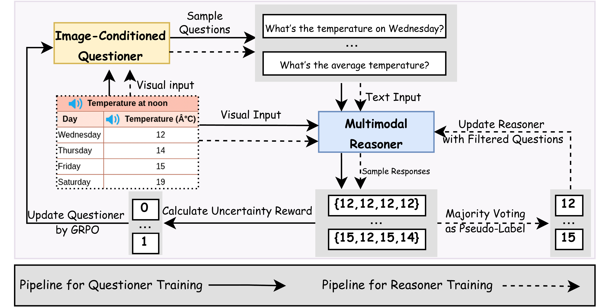
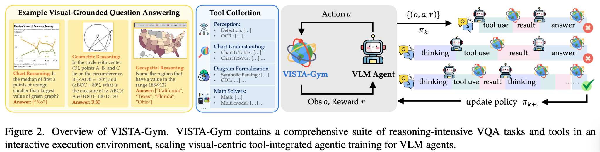
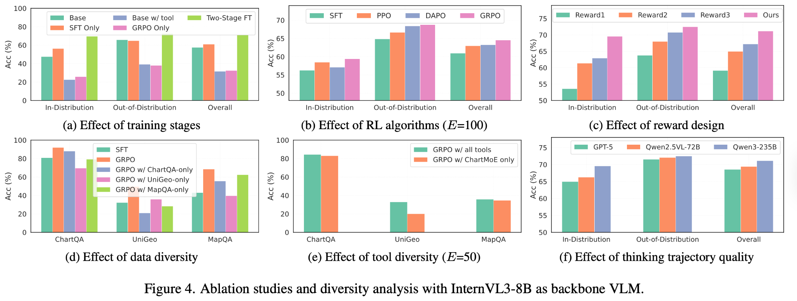

# 24.3 VLM RL 框架与前沿——从实验到应用的桥梁

前两节我们做了 VLM GRPO 实验，分析了 VLM RL 的独特挑战。这些讨论主要集中在"问题"层面——奖励归因怎么做、视觉幻觉怎么防、视觉编码器更新不更新。这一节我们来看"解决方案"——当前有哪些框架正在系统性地解决这些问题，以及 VLM RL 的未来可能走向何方。

## 11.3.1 VisPlay 与 提问者与推理者的协同进化

VisPlay 是一个很有创意的 VLM RL 框架，它的核心思想是让两个模型通过 RL **互相博弈、协同进化**——一个负责"出题"（Questioner），一个负责"答题"（Reasoner）。这和第 6 章讨论的 Self-Play 思想一脉相承，但专门为视觉场景设计。



<div style="text-align: center; font-size: 0.9em; color: var(--vp-c-text-2); margin-top: -10px; margin-bottom: 20px;">
  <em>图 1：VisPlay 的训练框架。Image-Conditioned Questioner 负责生成问题，Multimodal Reasoner 负责回答，系统再通过不确定性奖励、伪标签和 GRPO 更新提问者与推理者。来源：<a href="https://bruno686.github.io/VisPlay/" target="_blank" rel="noopener noreferrer">VisPlay Project Page</a></em>
</div>

### 双模型架构

**提问者（Questioner）** 的任务是生成有挑战性的视觉问题。它的输入是一张图片，输出是一个关于图片内容的问题。好的问题应该满足两个条件：一是模型目前的推理者还回答不好（有挑战性），二是问题的答案可以从图片中确定性地得出（有客观标准）。

**推理者（Reasoner）** 的任务就是回答提问者的问题。它的输入是图片和问题，输出是回答。和上一节的 VLM GRPO 实验一样，推理者通过 RL 来优化回答质量。

两个模型的协同进化形成了一个正反馈循环：提问者不断提出更难的问题 → 推理者被迫提升能力来回答 → 提问者必须出更刁钻的问题才能"难住"推理者 → 推理者继续提升……这个循环和 AlphaGo 的自我博弈（回顾(第 6 章）在结构上是相同的——通过不断提升对手的强度来驱动自身的进化。

VisPlay 的奖励设计也很有意思。提问者的奖励取决于推理者的表现——如果推理者答对了，说明问题太简单，提问者得到负奖励；如果推理者答错了，说明问题有挑战性，提问者得到正奖励。但这有一个平衡问题：如果提问者出了根本无法回答的问题（比如问图片中不存在的细节），推理者答错了不应该算提问者的功劳。所以提问者的奖励还需要包含一个"可回答性"约束——问题必须是图片中确实存在的。

推理者的奖励和上一节类似——答案正确性、推理质量、格式规范。但多了一个维度：回答的速度（推理效率）。在实际部署中，VLM 的推理延迟直接影响用户体验，所以鼓励模型生成简洁高效的回答。

## 11.3.2 VISTA-Gym 与 工具集成的视觉 RL 环境

VISTA-Gym 的设计理念是"让 VLM 不只是看和说，还能动手做"。它把 Python 解释器、搜索引擎、图像标注工具等纳入了 VLM 的动作空间——模型不只能生成文本回答，还能调用工具来验证和改进自己的推理。



<div style="text-align: center; font-size: 0.9em; color: var(--vp-c-text-2); margin-top: -10px; margin-bottom: 20px;">
  <em>图 2：VISTA-Gym 将视觉题目、工具集合、VLM Agent、轨迹采样和策略更新放在同一个交互环境中。它的重点不是单轮问答，而是让模型在可验证工具链里反复试、反复改。来源：<a href="https://www.eigenai.com/blog/vista-gym-vista-r1" target="_blank" rel="noopener noreferrer">VISTA-Gym / VISTA-R1 Blog</a></em>
</div>

### 工具增强的推理链

想象一个场景：给模型看一张图片，问"图片中的建筑物是什么风格？"。传统的 VLM 直接输出答案——"这是哥特式建筑"。但有了工具增强，模型可以做更深入的推理：

1. **描述图片**："我看到一座有尖塔和飞扶壁的石头建筑"
2. **调用图像标注工具**：让工具标出关键视觉特征
3. **搜索验证**：调用搜索引擎查找"尖塔 + 飞扶壁"对应的建筑风格
4. **综合回答**："根据尖塔和飞扶壁的特征，结合搜索结果，这很可能是哥特式建筑"

VISTA-Gym 的奖励设计需要同时评估"回答质量"和"工具使用效率"。如果模型调用了 10 次工具才得到答案，效率显然不如只调用 2 次的方案。所以奖励函数通常包含一个工具调用次数的惩罚项：

$$R_{total} = R_{accuracy} + R_{reasoning} - \lambda \cdot N_{tools}$$

其中 $N_{tools}$ 是工具调用次数，$\lambda$ 是效率权重。

### 与 GRPO 的结合

VISTA-Gym 可以和 GRPO 自然结合。对同一个图片+问题，模型生成多组推理链（每组包含不同的工具调用序列），然后用规则奖励评估每组的质量，计算组内相对优势，更新策略。这和第 7 章的 GRPO 完全一致——只是生成的"回答"从纯文本变成了"工具调用序列 + 最终回答"。

## 11.3.3 框架对比

把 VisPlay、VISTA-Gym 和上一节的 VLM GRPO 实验放在一起对比：



<div style="text-align: center; font-size: 0.9em; color: var(--vp-c-text-2); margin-top: -10px; margin-bottom: 20px;">
  <em>图 3：VISTA-R1 的消融实验。工具、RL 算法、奖励设计和思考轨迹质量都会改变最终表现，说明 VLM RL 框架的关键是“环境 + 工具 + reward + 算法”的组合。来源：<a href="https://www.eigenai.com/blog/vista-gym-vista-r1" target="_blank" rel="noopener noreferrer">VISTA-Gym / VISTA-R1 Blog</a></em>
</div>

|              | VLM GRPO（基础版）           | VisPlay                    | VISTA-Gym               |
| ------------ | ---------------------------- | -------------------------- | ----------------------- |
| **核心思想** | 用 GRPO 优化 VLM 回答质量    | 提问者+推理者协同进化      | 工具增强的推理链        |
| **数据来源** | 人工构造的静态数据集         | 模型自动生成问题和回答     | 图片 + 工具调用环境     |
| **奖励类型** | 规则奖励（正确性+推理+格式） | 模型间博弈的胜负信号       | 规则奖励 + 工具效率惩罚 |
| **优势**     | 简单直接，容易复现           | 数据自动生成，持续进化     | 推理更可靠，可验证      |
| **劣势**     | 静态数据，天花板有限         | 两个模型联合训练，工程复杂 | 工具环境搭建成本高      |
| **适用场景** | 快速验证、教学实验           | 长期持续优化               | 需要高可靠性的场景      |

这三个框架不是互相替代的，而是解决不同层面的问题。VLM GRPO 是"基础训练"——用固定的数据集和规则奖励打好基础。VisPlay 是"持续进化"——通过自我博弈来突破静态数据的限制。VISTA-Gym 是"可靠性增强"——通过工具调用来验证推理过程。在实际应用中，这三者可以串联使用：先用 GRPO 打基础，再用 VisPlay 做持续优化，最后用 VISTA-Gym 做可靠性验证。

## 11.3.4 VLM RL 的前沿方向

VLM RL 是一个快速发展的领域，以下几个方向值得关注：

### 视频理解

从图像理解到视频理解，是一个自然的演进。视频不只包含空间信息（图片里有什么），还包含时间信息（事物如何变化）。VLM RL 在视频理解上的挑战包括：如何设计时序奖励（模型是否理解了事件的发展顺序），如何处理长视频的计算成本（一个 1 分钟的视频可能包含数千帧图像），以及如何评估视频理解的准确性（"理解了一段视频"比"数对了几个圆形"更难量化评估）。

### 3D 场景理解

从 2D 图像到 3D 场景，VLM 需要理解深度、遮挡和空间关系。这在机器人导航和增强现实场景中至关重要。3D 场景理解的一个独特挑战是**视角不变性**——同一个物体从不同角度看应该被识别为同一个物体。RL 可以通过在不同视角间切换来训练这种不变性。

### 机器人 VLM-RL

VLM-RL 在机器人领域的应用前景最为广阔。机器人需要从摄像头输入中理解环境，然后做出操作决策。和第 12.1 节具身智能讨论的连续控制不同，VLM-RL 的核心是"用视觉理解来指导动作"——不是直接从像素到力矩，而是先理解"面前是什么物体"，再决定"该怎么操作"。

| 路线          | 输入如何进入策略                 | 优势                       | 风险                       |
| ------------- | -------------------------------- | -------------------------- | -------------------------- |
| 端到端像素 RL | 图像特征直接映射到动作           | 延迟低，控制链短           | 可解释性弱，迁移成本高     |
| VLM-RL        | 先形成语义理解，再辅助决策       | 可解释、可接自然语言与工具 | 推理延迟、跨模态归因更复杂 |
| 分层方案      | VLM 负责高层目标，低层控制器执行 | 更接近工程部署             | 高低层接口需要严格验证     |

这种"理解 → 决策"的范式有几个关键优势：一是**可解释性**——你可以看到模型为什么做了一个决策（因为它说了"前方有障碍物，所以绕行"）；二是**泛化能力**——理解了"杯子"这个概念的模型，可以把"抓取杯子"的能力迁移到不同形状的杯子上；三是**人机协作**——人类可以用自然语言给机器人下指令，VLM 理解指令后指导机器人执行。

### 机器人 VLM-RL 的训练流程

机器人 VLM-RL 的训练通常遵循"仿真预训练 → 仿真精调 → 现实迁移"的三步流程：

**仿真预训练**阶段，在大量仿真场景中用 RL 训练 VLM 的视觉理解和决策能力。仿真环境的优势是可以快速生成大量训练数据（包括各种边界情况），且训练过程绝对安全。

**仿真精调**阶段，针对目标机器人的具体场景做精细化训练。这一步会引入域随机化（Domain Randomization，回顾第 12.1 节具身智能）——随机化光照、纹理、物体位置等参数，让策略在各种条件下都能工作。

**现实迁移**阶段，把仿真训练好的模型部署到真实机器人上，用少量真实数据做微调。这一步是最难的——因为仿真和现实之间存在不可避免的差异（物理参数不精确、传感器噪声、控制延迟等）。

```python
# ==========================================
# 机器人 VLM-RL 的简化训练流程
# ==========================================
def robot_vlm_rl_train(vlm, simulator, num_episodes=10000):
    """机器人 VLM-RL 训练流程"""
    optimizer = setup_optimizer_with_lr_decay(vlm)
    best_reward = -float('inf')

    for episode in range(num_episodes):
        # 1. 在仿真环境中生成场景
        scene = simulator.reset()
        image = simulator.render_camera()  # 获取摄像头图像

        # 2. VLM 理解场景并生成决策
        scene_desc = vlm.describe(image)
        action_plan = vlm.plan_action(scene_desc)

        # 3. 执行动作并收集奖励
        total_reward = 0
        for action in action_plan:
            obs, reward, done, info = simulator.step(action)
            total_reward += reward

            # 安全性检查（硬约束）
            if info.get('collision', False):
                total_reward -= 10.0
                break

        # 4. 用 GRPO 或 PPO 更新策略
        loss = compute_policy_gradient_loss(vlm, episode_data)
        loss.backward()
        torch.nn.utils.clip_grad_norm_(vlm.parameters(), max_norm=1.0)
        optimizer.step()

        # 5. 定期评估并保存最优模型
        if total_reward > best_reward:
            best_reward = total_reward
            save_model(vlm, 'best_vlm_robot.pt')

        if (episode + 1) % 1000 == 0:
            eval_reward = evaluate(vlm, simulator, num_episodes=50)
            print(f"Episode {episode+1} | "
                  f"训练奖励: {total_reward:.1f} | "
                  f"评估奖励: {eval_reward:.1f}")
```

## 11.3.5 从文本 RL 到多模态 RL 与 回顾与展望

回顾前面章节的完整学习路径，我们看到 RL 从最简单的表格方法一路发展到了多模态的复杂场景：

| 章节                 | 输入            | 动作空间         | 奖励来源                | 核心算法  |
| -------------------- | --------------- | ---------------- | ----------------------- | --------- |
| 第 4 章：DQN         | 状态向量/像素   | 离散             | 环境内置                | DQN       |
| 第 5 章：策略梯度    | 状态向量        | 离散/连续        | 环境内置                | REINFORCE |
| 第 6 章：RLHF/PPO    | Token 序列      | 离散（token）    | RM 打分                 | PPO       |
| 第 7 章：GRPO        | Token 序列      | 离散（token）    | 规则验证                | GRPO      |
| 第 12 章：Agentic RL | 文本 + 工具轨迹 | 工具调用 / token | 结果奖励 + 过程奖励     | PPO/GRPO  |
| 第 13 章：VLM RL     | 图像 + Token    | 离散（token）    | 规则 + 模型 + grounding | GRPO      |

贯穿始终的核心思想没有变——策略梯度定理（(第 6 章）、Actor-Critic 架构（第 6 章）、PPO 的裁剪稳定性（第 5 章）、GRPO 的组内优势（第 7 章）。变化的是输入的模态、动作的空间和奖励的来源。这就是为什么我们在前几章花了大量篇幅打理论基础——这些基础在多模态场景中完全适用。

<details>
<summary>思考题：如果把 VLM 的输入从静态图片换成视频流，GRPO 的代码需要改哪些部分？</summary>

核心的 GRPO 算法代码（组内相对优势计算、策略梯度损失）完全不需要改。需要改的是模型的输入处理层：从处理单帧图像的 ViT 改为处理视频序列的时序模型（比如 TimeSformer 或 ViViT）。视觉 token 不再是"一张图片的特征"，而是"一段视频的时空特征"。

奖励函数也需要相应调整——视频理解的奖励不只看"最终答案对不对"，还要看模型是否理解了事件的时间顺序和因果关系。比如问"视频中的猫是在跳跃之前还是之后打翻了杯子"，模型需要理解两个事件的先后关系，而不只是识别出"猫"和"杯子"。

</details>

VLM RL 是当前最活跃的研究方向之一。从 GPT-4V 到 Gemini，从 LLaVA 到 Qwen-VL，每一个多模态大模型的发布都伴随着 RL 训练方法的改进。这个领域还有太多未解决的问题——视觉幻觉、奖励归因、安全性与效率的权衡、从仿真到现实的迁移……每一个问题的解决都可能催生新的应用场景。

## 11.3.6 从 VLM RL 到多模态 Agent

VLM RL 训练出的是"能看懂图的模型"。但真实场景中，用户需要的往往是"能看懂图、还能动手操作"的智能体——比如截图理解 + 自动操作（GUI Agent）、图表分析 + 数据查询（Data Agent）。这就是从 VLM RL 到多模态 Agent 的跨越：**视觉理解 + 工具调用**。

### 多模态 Agent 的典型场景

| 场景             | 输入      | 需要的工具           | 纯文本 Agent 能做吗 |
| ---------------- | --------- | -------------------- | ------------------- |
| 分析财报图表     | 📊 图片   | 计算器、数据库查询   | ❌ 看不懂图表       |
| 根据截图修 Bug   | 📸 截图   | 代码编辑器、终端     | ❌ 看不到 UI        |
| 电商比价购物     | 🖼️ 商品图 | 浏览器、搜索 API     | ❌ 无法理解图片     |
| 医学影像辅助诊断 | 🏥 CT/MRI | 医学知识库、诊断工具 | ❌ 无法处理影像     |

### 多模态 Agent RL 的特殊挑战

把本章的 VLM RL 和[第 8 章](../chapter22_agentic/intro)的 Agent RL 结合，会面临三个额外的挑战：

**1. 错误归因。** 当多模态 Agent 给出错误结果时，错误可能来自视觉理解（"看错了"图表中的数值）或工具调用（"做错了"传了错误参数）。这两种错误的修复方式完全不同——前者需要更多的 VLM RL 训练（本章的方法），后者需要更多的 [Agent RL 训练](../chapter22_agentic/tool-use-and-trajectory)。实践中需要**分阶段验证**：先检查视觉理解是否正确，再检查工具调用是否合理。

**2. 跨模态奖励设计。** 纯文本 Agent 的 reward 只看文本质量，而多模态 Agent 的 reward 需要同时覆盖视觉理解准确性和工具使用正确性：

```python
def multimodal_agent_reward(trajectory, task):
    """多模态 Agent 的复合奖励"""
    visual_reward = evaluate_visual_understanding(task.image, trajectory.visual_description)
    tool_reward = evaluate_tool_usage(task.required_tools, trajectory.tool_calls)
    outcome_reward = task.verify_final_result(trajectory.final_output)
    return 0.2 * visual_reward + 0.3 * tool_reward + 0.5 * outcome_reward
```

**3. 跨模态 Credit Assignment。** 在一条 10 轮的轨迹中，第 2 轮的视觉理解错误可能导致第 5 轮的工具调用失败。这比纯文本 Agent 的 credit assignment 更难，因为跨模态的错误传播链更长、更隐晦。[第 8 章](../chapter22_agentic/multi-turn-rl)讨论的 ORM vs PRM 取舍在这里更加突出。

### 代表性工作

**GUI Agent。** 通过 RL 训练模型理解屏幕截图中的 UI 元素（按钮、输入框），并执行点击、输入、滚动等操作。代表工作包括 CRAFT-GUI（桌面环境 GUI 操作）、MobileRL（移动端触屏操作）。GUI Agent 有一个天然的 RLVR 优势——操作是否成功是客观可验证的。

**多模态 Deep Research。** [Tongyi DeepResearch](../chapter22_agentic/deep-research-agent) 已经支持多模态输入，能分析搜索结果中的图表和图片、从 PDF 论文中提取图表数据。这是 VLM RL + Agent RL 整合的前沿方向。

**创作型 Agent。** 接收用户需求和参考图片，调用图片生成/编辑工具创作。挑战在于 reward 的主观性——"风格转换得好不好"没有客观标准，需要用 LLM-as-Judge 评估。

### 训练路径

如果你想训练多模态 Agent，建议的路径是：

1. **先练视觉理解**：用本章的 VLM GRPO 训练基础视觉能力
2. **再练工具调用**：用[第 8 章的工具调用 RL](../chapter22_agentic/tool-use-and-trajectory)训练基本的工具使用模式
3. **最后联合训练**：在多模态 Agent 任务上做端到端 RL，reward 设计参考上面的复合奖励函数

关键原则：**先单独验证视觉理解和工具调用各自达标，再做端到端联合训练**。如果基础组件有问题，联合训练也救不回来。

下一节我们把视角从"视觉理解"转到"视觉生成"——看看 Diffusion 和视频生成模型如何通过 RL 后训练提升文本对齐、视觉质量和指令遵循能力。

## 参考资料

- [VisPlay Project Page](https://bruno686.github.io/VisPlay/) —— 展示了 Image-Conditioned Questioner 与 Multimodal Reasoner 协同训练的整体框架。
- [VISTA-Gym / VISTA-R1 Blog](https://www.eigenai.com/blog/vista-gym-vista-r1) —— 展示了工具增强视觉问答环境、VISTA-R1 主结果和消融分析。
