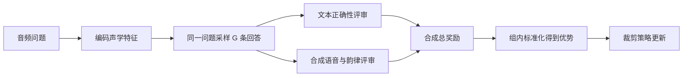
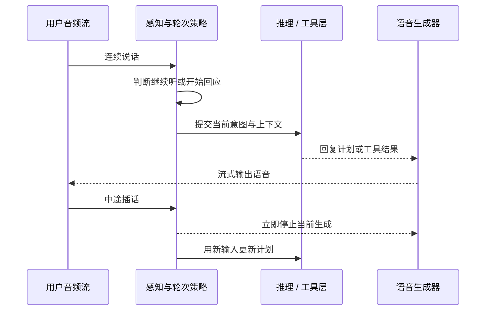

# 24.2 从音频奖励到实时 Agent：最小训练循环与系统形态

24.1 给出了音频奖励的三层结构：内容、韵律、实时性。不过，知道“该奖励什么”还不等于知道“奖励怎样改变模型”。训练器必须先为同一段音频采样多条回答，再把文本和语音送进不同的评审器，最后把一个回答级分数传回每个生成 token。任何一环接错，奖励都可能没有作用到预期行为上。

本节先沿着一条样本的生命周期走完最小训练循环：音频编码、成组采样、合成语音、计算奖励、组内比较、更新策略。这里的代码用于说明数据流，不能直接替代工业训练框架。完成这条链路后，再把单轮模型放入持续交互环境，观察它如何变成能处理打断、工具调用与多轮状态的音频 Agent。



## 动手：最小音频 GRPO 训练

本节用一个最小流程展示音频 RL 的核心机制。真实训练需要分布式 rollout、推理服务、奖励服务和检查点管理；下面省略这些系统模块，只保留奖励设计与策略更新之间的接口。

### 实验设置

```python
# requirements: torch, transformers, librosa, soundfile
import torch
import torch.nn as nn
import torch.nn.functional as F

class AudioDialogueConfig:
    # 音频编码器（伪代码：实际用 Qwen2-Audio encoder）
    audio_encoder_dim = 1280
    audio_frame_rate = 12.5  # Hz，下采样后
    # LLM 解码器（实际用 Qwen2.5-32B，这里简化）
    llm_hidden = 4096
    vocab_size = 152000
    # RL 配置
    group_size = 16         # GRPO 每组采样数
    max_response_len = 1024
    clip_eps = 0.2          # PPO clip
    beta_kl = 0.0           # Step-Audio 设为 0，允许自由探索
```

两个配置值得说明。`group_size = 16` 表示每个问题采样 16 条回答；这是 Step-Audio-R1 论文公开的 PPO 采样设置。`beta_kl = 0` 同样来自论文，表示 RL 阶段不加参考模型 KL 惩罚。这个选择会扩大探索空间，也提高策略偏离初始化模型的风险，因此不应无条件复制到其他任务。

### 模型结构

```python
class AudioDialoguePolicy(nn.Module):
    """音频理解策略：音频编码 → LLM 推理 → 文本回答"""
    def __init__(self, config):
        super().__init__()
        # 音频编码器（frozen）
        self.audio_encoder = AudioEncoder(config.audio_encoder_dim)
        for p in self.audio_encoder.parameters():
            p.requires_grad = False
        # adaptor: 25 Hz → 12.5 Hz
        self.adaptor = nn.Conv1d(config.audio_encoder_dim, config.llm_hidden,
                                  kernel_size=2, stride=2)
        # LLM 解码器
        self.llm = TransformerDecoder(config.llm_hidden, config.vocab_size)

    def forward(self, audio, question, response_tokens):
        # 1. 编码音频
        audio_feat = self.audio_encoder(audio)         # (B, T, D)
        audio_feat = self.adaptor(audio_feat.transpose(1, 2)).transpose(1, 2)

        # 2. 拼接 [audio, question, response] 序列
        inputs = concat_modalities(audio_feat, question, response_tokens)

        # 3. 自回归预测 response 的 logits
        logits = self.llm(inputs)
        return logits
```

结构与第 23 章的 VLM 完全同构：编码器冻结，投影层对齐维度，token 拼接后进语言模型。第 23 章讨论的奖励归因问题在这里同样存在，音频编码器是否解冻，决定了 RL 梯度能否改写听觉特征。

### 奖励函数

实现 24.1 的三类奖励：

```python
class AudioReward:
    def __init__(self, grm_model, prosody_ref_dist):
        self.grm = grm_model                # 生成式奖励模型
        self.prosody_ref = prosody_ref_dist # 人类韵律分布

    def content_reward(self, response_text, ground_truth):
        """内容正确性"""
        # 用 LLM-as-judge 判断语义等价
        prompt = f"判断答案是否等价：\n参考：{ground_truth}\n答案：{response_text}\n等价返回1否则0"
        return float(self.grm(prompt))

    def prosody_reward(self, response_audio):
        """韵律自然度"""
        f0 = extract_valid_f0(response_audio)     # 去除无声帧后的基频
        f0_var = np.std(f0)
        # 与人类分布的 Wasserstein 距离
        f0_w = wasserstein_distance(
            np.histogram(f0, bins=50)[0] / len(f0),
            self.prosody_ref['f0_hist']
        )
        # 抑制扁平化（RLVR 的常见失败模式）
        flat_penalty = -max(0, 0.3 - f0_var)
        return -f0_w + 0.5 * flat_penalty

    def format_reward(self, response_text):
        """检查 <think>...</think> 格式（MGRD 的关键 trick）"""
        has_think = '<think>' in response_text and '</think>' in response_text
        return 1.0 if has_think else 0.0

    def total(self, response_text, response_audio, ground_truth, weights=(0.7, 0.2, 0.1)):
        w_c, w_p, w_f = weights
        return (w_c * self.content_reward(response_text, ground_truth)
              + w_p * self.prosody_reward(response_audio)
              + w_f * self.format_reward(response_text))
```

::: tip 格式奖励的作用
Step-Audio-R1 的消融显示：去掉 format reward（即 $w_f = 0$）后，推理 token 数从 2800 跌到 1500，MMAU 掉 1.2 个百分点。原因是 RL 优化器天然倾向最省 token 的策略：直接给答案，跳过 `<think>`。

在 Step-Audio-R1 的实验中，格式项权重为 0.2，并把 MMAU 从 76.5 提升到 77.7；同时，后期推理长度从不足 1500 token 恢复到约 2300–2800 token。这个结果只说明该设置对论文中的数据和模型有效，新的任务仍需重新做权重消融。格式奖励还只能证明“出现了推理段”，无法证明推理使用了正确的声学证据；后者依赖 MGRD 的数据筛选与接地检查。
:::

### GRPO 训练循环

用 [GRPO](../chapter18_grpo/grpo-family)（Group Relative Policy Optimization）训练。完整的一步分为采样、打分、归一化、更新四个阶段：

```python
def grpo_train_step(policy, reward_fn, speech_synthesizer, batch, config):
    """单步 GRPO 训练"""
    token_losses = []

    for prompt, audio, ground_truth in batch:
        # 1. 每个提示采样 G 条响应，同时记录采样时的 token log 概率
        responses = []
        for _ in range(config.group_size):
            with torch.no_grad():
                resp = policy.sample(audio, prompt, config.max_response_len)
                resp.log_prob_old = policy.log_prob(audio, prompt, resp.tokens)
            # Step-Audio-R1 本体输出文本。为了演示韵律奖励，
            # 这里额外接一个语音合成器生成待评审波形。
            resp.audio = speech_synthesizer(resp.text)
            resp.reward = reward_fn.total(
                resp.text, resp.audio, ground_truth
            )
            responses.append(resp)

        # 2. 组内归一化得 advantage（GRPO 核心）
        rewards = torch.tensor([r.reward for r in responses])
        adv = (rewards - rewards.mean()) / (rewards.std() + 1e-8)

        # 3. 逐条计算 PPO clip 目标（参考第 8 章）
        for resp, a in zip(responses, adv):
            logp_new = policy.log_prob(audio, prompt, resp.tokens)
            ratio = torch.exp(logp_new - resp.log_prob_old)
            clipped = torch.clamp(ratio, 1 - config.clip_eps, 1 + config.clip_eps)
            token_loss = -torch.min(ratio * a, clipped * a).mean()
            token_losses.append(token_loss)

    return torch.stack(token_losses).mean()

# 主循环
for epoch in range(num_epochs):
    for batch in dataloader:
        optimizer.zero_grad()
        loss = grpo_train_step(
            policy, reward_fn, speech_synthesizer, batch, config
        )
        loss.backward()
        torch.nn.utils.clip_grad_norm_(policy.parameters(), max_norm=1.0)
        optimizer.step()
```

与文本 GRPO 相比，这里多出两项成本。第一，奖励计算增加了语音合成与韵律评审支路，所以同一条回答要同时维护文本与波形。第二，组大小 16 意味着每个问题要生成并评审 16 条回答。若策略本身直接生成音频 token，这部分开销会更高。实际系统通常把 rollout、合成和奖励评审拆成并行服务。

::: details 这段伪代码为什么写成 GRPO，而论文为什么写 PPO
[Step-Audio-R1](https://arxiv.org/html/2511.15848#S4.SS3) 明确报告的是 on-policy PPO：每个问题采样 16 条回答，使用 0.2 的裁剪系数，并把奖励放在最终 token。论文没有把实现称为 GRPO，也没有公开说明用组均值替代价值网络。

这里采用 GRPO 形式，是为了和前文课程的组内相对优势估计衔接。它省去单独的价值模型，适合演示“同一音频的多条回答怎样互相比较”。真正复现实验时，应以论文和官方代码为准，不能把“多样本 PPO”和 GRPO 当作同一个算法。
:::

### 自认知修正

工业音频 RL 还有一个不在论文标题里但绕不开的问题：模型会忘记自己是音频模型。预训练数据以文本为主，模型经常回答"我听不到声音"或"我是文本模型"。Step-Audio-R1 的修正流程分两阶段：

```python
def self_cognition_correction(policy):
    """三阶段修正自认知错误"""
    # 阶段 1：迭代自蒸馏 + LLM judge 过滤
    for t in range(T):
        responses = policy.sample(audio_perception_queries)
        # judge 只保留正确自认知的回复
        correct = [r for r in responses if judge_acknowledges_audio(r)]
        policy.sft(correct)

    # 阶段 2：DPO 精修
    # 8000 偏好对：正确认知(w) vs 错误认知(l)
    pref_pairs = build_preference_pairs(correct_cog=positive, text_only=negative)
    policy.dpo(pref_pairs, beta=0.1)
```

论文报告的自认知错误率依次为：基础模型 6.76%，迭代自蒸馏后 2.63%，再经 DPO 后 0.02%。这三个数字衡量的是特定自认知测试集，不代表通用音频准确率。

DPO 的精准对齐把错误率压到接近零。这一步看似琐碎，部署时却至关重要：用户期待模型自信地处理音频输入，而不是道歉式地说"我听不了"。从奖励视角看，这是又一层"奖励管不到的质量"，自认知错误不影响答案正确性，却直接摧毁交互体验，只能靠定向的偏好数据修复。

## 音频 Agent 的形态

会答题的音频模型只是起点。把模型放进持续交互的环境，它就变成 Agent：要维持多轮状态，要决定何时听、何时说、何时调用工具。目前有三类典型形态。

**全双工对话 Agent。** 第一类把“对话”本身当成环境。传统语音助手是半双工的轮次制：用户说完，模型再说。全双工 Agent 边听边说，随时可被打断，也要会主动闭嘴。



这类 Agent 的 RL 难点不在单轮回答质量，而在时序行为：什么时候接话、什么时候让话、被打断后如何恢复上下文。这些行为很难用可验证奖励刻画，大多落入 24.1 的偏好奖励范畴。

**音频作为 Agent 的感知通道。** 第二类把音频接进 Agentic 工作流，作为感知与输出通道，推理与工具调用仍发生在文本空间。典型场景包括会议 Agent（流式 ASR 转写加说话人分离加摘要与待办提取，奖励可以用摘要的事实一致性验证）、语音搜索与翻译（语音指令解析为工具调用，翻译质量与检索命中率都是可验证信号）、客服 Agent（情绪识别决定话术分支，转人工时机是一个典型的序列决策问题）。这一类的 RL 与[第 19 章的多智能体协作](../chapter22_agentic/multi-agent-swarm)直接衔接：音频模型负责感知与表达，规划与工具调用交给文本 Agent，奖励按轨迹整体结算。

**音频作为 Agent 的输出工具。** 第三类反过来：Agent 的核心是文本推理，音频只作为输出界面。此时 24.1 的表达脑就是被调用的“语音工具”，RL 关注的是文本决策与语音呈现的一致性，比如严肃内容不用轻快语气、紧急提醒放慢语速。这类一致性目前主要靠 rubric 偏好数据监督，还没有成熟的可验证奖励方案。

## 未来方向

把三类形态放在一起看，音频 Agent 的 RL 还有三个开放问题。

**音频原生推理。** MGRD 证明了推理可以锚定在声学证据上，但当前推理链仍以文本写出。下一步是让推理本身发生在音频表示空间，例如直接对韵律、音色做链式操作。这相当于音频域的"thinking with images"，奖励设计也要从文本可判定转向声学可判定。

**流式 RL。** 本节引用的 Step-Audio 训练以完整回答为主要奖励单位，真实对话却是在线、流式的，打断、改口和追问都发生在回合中间。把奖励从回合级细化到语句级甚至 chunk 级，才能直接训练“何时开口、何时停止”这类时序行为。

**长时序信用分配。** 多轮语音对话里，一轮糟糕的语气可能在五轮之后才导致用户流失。这与第 19 章 Agent RL 的信用分配问题同构，只是观测从文本轨迹变成了声学轨迹，延迟更长、信号更稀疏。

## 与前面章节的联系

音频 Agent 把前面章节的多个思想落到持续交互环境中。**GRPO 组内归一化（第 15 章）** 用于讲解相对优势的简化算法；Step-Audio-R1 论文实际报告 PPO。**格式奖励防塌缩（第 16 章）** 表现为 `<think>` 格式奖励，保住音频推理链。**VLM RL 的差异化更新（第 23 章）** 对应音频编码器冻结，RL 只更新语言模型。**Agent 轨迹奖励（第 19 章）** 用于会议、客服等多轮音频 Agent 的整体轨迹结算。**DPO 偏好对齐（第 14 章）** 用于自认知修正与韵律对齐的偏好数据训练。

<details>
<summary>思考题：为什么全双工对话的"何时说话"很难用可验证奖励训练？</summary>

"何时说话"的正确性依赖对方的实时状态：用户是否在犹豫、是否要插话、情绪是否变化。这些没有离散的 ground truth 标签，无法像答案正确性那样程序化验证。能拿到的信号只有对话的整体体验（用户是否继续聊下去、满意度评分），既延迟又嘈杂，只能走偏好奖励或轨迹级奖励的路线。这也是可验证奖励陷阱在时序维度上的延伸：可验证的部分优化完了，剩下的恰恰是体验的核心。

</details>

## 小结

音频 GRPO 与文本 GRPO 的训练骨架一致，差异在奖励多了韵律支路、采样多了语音合成开销。格式奖励与自认知修正是两类“奖励管不到但部署必须管”的问题，前者靠显式的推理存在性奖励，后者靠定向偏好数据。音频 Agent 有三种形态：全双工对话、音频作为感知通道、音频作为输出工具，分别对应时序行为、轨迹奖励与呈现一致性三类 RL 问题。开放方向是音频原生推理、流式 RL 与长时序信用分配。

下一节 [24.3 VLA 模型](../chapter28_vla/embodied-intelligence/) 把多模态感知接到物理动作：策略不仅要理解声音和图像，还要在连续控制、真实成本与物理约束下行动。

## 参考资料

- [Step-Audio-R1 Technical Report（arXiv:2511.15848）](https://arxiv.org/abs/2511.15848)：本节训练配置与自认知修正数据的来源
- [Step-Audio-R1 GitHub](https://github.com/stepfun-ai/Step-Audio-R1)：开源推理代码与模型权重
- [DeepSeek-R1（arXiv:2501.12948）](https://arxiv.org/abs/2501.12948)：RLVR + GRPO 训练范式，Step-Audio-R1 的方法基础
- [Moshi（arXiv:2410.00037）](https://arxiv.org/abs/2410.00037)：全双工实时对话与 Mimi 编解码器
- [GPT-4o System Card（arXiv:2410.21276）](https://arxiv.org/abs/2410.21276)：工业级实时语音交互的里程碑
