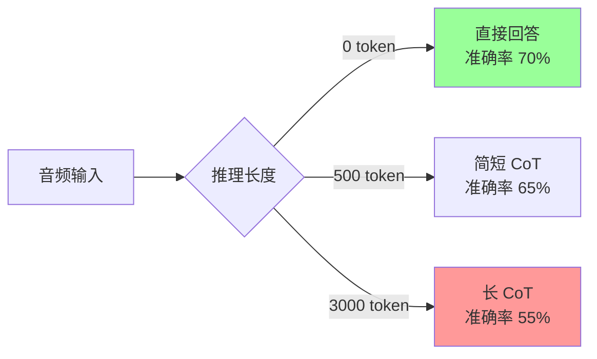
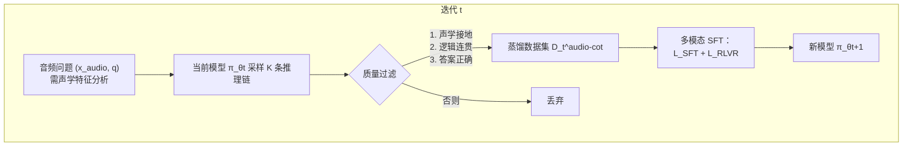
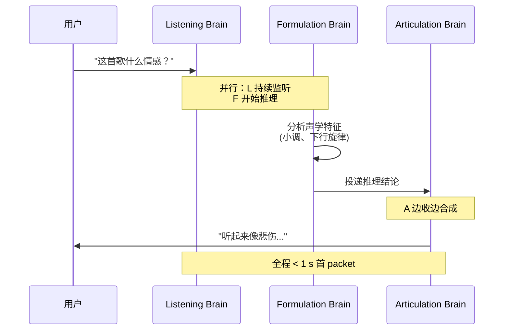
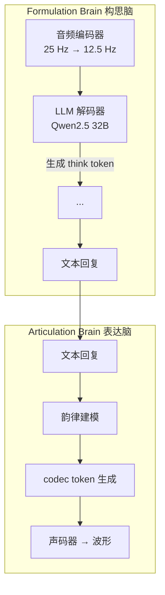

# 第 27 章 · 音频与语音 RL（Step-Audio MGRD）

> [第 26 章 VLM RL](../chapter26_vlm/intro) 把推理 RL 从文本扩展到了视觉——Qwen3-VL 学会"看一眼图、反思一下、再回答"。但视觉只是模态的一半：人类最自然的交互媒介是**语音**。本章解决音频领域的两个核心难题：(1) 当模型先转录再推理时，为什么"想得越多越差"（inverted scaling）？(2) 用可验证奖励训练得到的音频模型为什么变成了"机械答题机"？答案分别来自 **Step-Audio-R1 的 MGRD（模态接地推理蒸馏）** 和 **Step-Audio-R1.5 的 RLHF 范式迁移**。

## 27.1 音频语言模型概览

文本语言模型处理的是离散 token 序列。但音频是 24 kHz 的连续波形——每秒 24000 个浮点采样。要让 Transformer 处理音频，必须先把它"token 化"。这就是**神经音频编解码器（Neural Audio Codec）**的任务。

### 三大音频 token 化方案

| 编解码器 | 帧率 | 码本数 | 单 token 信息量 | 典型用途 |
|---------|------|--------|----------------|---------|
| **SoundStream**（Google 2021） | 50 Hz | 8 RVQ 层 | 中 | 语音合成、TTS |
| **EnCodec**（Meta 2022） | 75 Hz | 8 RVQ 层 | 中 | 通用音频、音乐 |
| **SpeechTokenizer**（2023） | 50 Hz | 8（前 1 语义 + 后 7 声学） | 高（语义层） | 语义理解 |
| **WavTokenizer**（ICLR 2025） | 40-75 Hz | 1（VQ） | 极高 | 极致压缩、AudioLM |
| **Mimi**（Kyutai 2024） | 12.5 Hz | 8（语义+声学联合） | 高 | 实时对话（Moshi） |

RVQ（Residual Vector Quantization，残差向量量化）是 EnCodec/SoundStream 的核心。它把一帧音频编码成 $K$ 层码本索引 $c_1, c_2, \ldots, c_K$，每一层量化上一层的残差：

$$e^{(0)} = \text{Encoder}(x), \quad c_k = \arg\min_c \|e^{(k-1)} - \text{CB}_k[c]\|, \quad e^{(k)} = e^{(k-1)} - \text{CB}_k[c_k]$$

最终波形 $\hat{x} = \text{Decoder}(c_1, \ldots, c_K)$。$K$ 越大重建质量越高，但每多一层码本就多一份 token 序列，自回归生成长度翻倍。SpeechTokenizer 的关键洞察：**把第一层码本蒸馏成 HuBERT 语义特征**，使 $c_1$ 编码"说了什么"，$c_2 \ldots c_K$ 编码"怎么说的"（韵律、音色）。

### 语音生成与文本生成的差异

把音频 token 喂进 LLM 后，生成机制看似与文本一致（自回归 next-token），实则天差地别：

| 维度 | 文本生成 | 语音生成 |
|------|---------|---------|
| 序列长度 | 1 token ≈ 0.5 词 ≈ 0.3 s | 1 token ≈ 0.013 s（75 Hz）→ 1 s 语音 = 75 token |
| 评价维度 | 内容正确性 | 内容 + 韵律 + 情感 + 音色 + 节奏 |
| 错误容忍 | 错 1 词可读 | 错 1 帧 → 爆音、电流声 |
| 多码本 | 单流 | 8 层 RVQ 需同步生成 |
| 实时性 | 流式即可 | 首 packet 延迟 < 1 s |

一秒语音要生成 75 × 8 = 600 个 token，10 秒对话就是 6000 个 token——比同等内容文本长 20 倍。这是音频 LLM 的**序列长度爆炸**问题。

### 实时推理的工程挑战

实时语音对话要求**全双工**：模型边听边想边说。三个工程难点：

1. **首 packet 延迟**：用户说完到模型开口的间隔，业界目标 < 500 ms
2. **流式解码**：不能等整句生成完再合成，必须 chunk-by-chunk 输出
3. **可打断**：用户随时插话，模型必须立刻停止生成并切到听模式

GPT-4o Realtime、Gemini Live、Moshi 用 **chunked autoregressive** + **streaming vocoder** 解决。本章后半部分会看到，Step-Audio-R1 Realtime 用"边听边想 + 边想边说"的**双脑架构**实现亚秒级延迟。

## 27.2 Step-Audio 系列 与 中国独特方向

StepFun（阶跃星辰）是国内音频 LLM 的代表厂商。Step-Audio 系列从 Step-Audio 2（基础对话模型）演进到 **Step-Audio-R1**（推理模型，2025.11）和 **Step-Audio-R1.5**（RLHF 对齐，2026.04），完整覆盖了"音频理解 + 推理 + 生成"的全链路。

### 27.2.1 Step-Audio-R1 与 test-time compute scaling

[Step-Audio-R1](https://arxiv.org/abs/2511.15848) 的核心贡献：**首个在音频域成功解锁 test-time compute scaling 的模型**。

#### Inverted scaling 反常现象

文本和视觉推理模型普遍遵循 test-time compute scaling law——给模型更多推理 token，性能可预测地提升（见 [第 13 章推理模型](../chapter19_reasoning/intro)）。但音频域出现反常：



越想越差。Step-Audio-R1 团队通过系统案例分析找到了根因：**文本替代推理（Textual Surrogate Reasoning）**。

#### 文本替代推理的病根

大多数音频 LLM 用文本 CoT 数据做 SFT 初始化（继承文本模型的推理能力）。结果是模型"想"的不是音频，而是**对音频的文本描述**：

```text
❌ 文本替代推理：
"歌词提到悲伤 → 这首歌情感是悲伤的"

✅ 声学接地推理：
"小调和声进行 + 下行旋律轮廓 + 缓慢节奏 → 悲伤情感"
```

前者只看歌词文本（甚至幻觉出歌词），后者真正分析了音高、节奏、和声。当推理链变长时，文本替代模型只会越走越偏——这就是 inverted scaling 的根。

#### 模态接地推理蒸馏

**Modality-Grounded Reasoning Distillation（MGRD）** 是 Step-Audio-R1 的核心训练框架。它通过 $T$ 轮迭代，把推理基底从文本逐步迁移到声学：



每轮 MGRD 包含三个阶段，整体损失：

$$\mathcal{L}_{\text{MGRD}} = \sum_{t=1}^{T}\left(\mathcal{L}_{\text{SFT}}^{(t)} + \mathcal{L}_{\text{RLVR}}^{(t)}\right)$$

**阶段一：自蒸馏采样**。在需要声学分析的数据上（音色识别、节奏判断、情感分类），让 $\pi_{\theta_t}$ 采样 $K$ 条候选：

$$(r^{(i)}, a^{(i)}) \sim \pi_{\theta_t}(\cdot \mid x_{\text{audio}}, q), \quad i=1,\ldots,K$$

筛选用三条标准：(1) 推理必须显式提及感知特征（音高、节奏、音色）；(2) 推理步骤逻辑连贯；(3) 最终答案正确。

**阶段二：多模态监督精炼**。在蒸馏数据 + 原始文本推理数据上联合 SFT：

$$\mathcal{L}_{\text{SFT}}^{(t)} = \mathbb{E}_{\mathcal{D}_t^{\text{audio-cot}}}\left[\log \pi_\theta(r, a \mid x_{\text{audio}}, q)\right] + \mathbb{E}_{\mathcal{D}_{\text{task}}}\left[\log \pi_\theta(r, a \mid q)\right]$$

混合训练防止"灾难性遗忘"——声学接地的同时保留文本推理能力。

**阶段三：多模态 RL**。文本用标准二值奖励，音频用复合奖励：

$$R_{\text{audio}}(r, a) = 0.8 \cdot \mathbb{1}[a = a^*] + 0.2 \cdot \mathbb{1}[\text{reasoning present in } r]$$

权重 0.8 + 0.2 的设计有深意：**0.2 的格式奖励防止推理塌缩**。消融实验显示，去掉格式奖励后推理 token 数从 2800 跌到 1500，MMAU 准确率从 77.7 掉到 76.5。RL 优化器天然倾向"最 token 高效"策略——直接给答案——必须显式奖励"思考行为"才能保住推理链。

::: details MGRD 的数据筛选：pass@8 ∈ [3, 6]
RL 数据集只有 5000 条，但质量极严。用上一轮模型对每个问题采样 $k=8$ 次，**只保留 pass@8 ∈ [3, 6] 的题**——既不太简单（pass@8 > 6 学不到东西），也不太难（pass@8 < 3 多半是题目本身有歧义）。

实验对比三种数据策略：

| 数据策略 | 最终 reward | 推理长度稳定性 |
|---------|------------|--------------|
| 全失败题（pass@8 = 0） | 0.45-0.70，方差大 | 跌到 1800 token |
| 中等难度（pass@8 ∈ [3,6]） | 0.75-0.80，稳定 | 维持 2300-2800 token |
| 200K 无筛选（10× 放量） | 无提升 | — |

**数据质量 >> 数据数量**。盲目扩大音频 RL 数据反而引入歧义噪声。
:::

#### Acoustic-Grounded Reasoning

MGRD 的产物是**声学接地推理（Acoustic-Grounded Reasoning）**——推理链显式引用声学属性。Step-Audio-R1 在 MMAU（Massive Multi-Task Audio Understanding）上的表现：

| 模型 | 平均 | Big Bench Audio | Spoken MQA | MMSU | MMAU | Wild Speech |
|------|------|----------------|-----------|------|------|------------|
| Step-Audio 2 | 68.3 | 59.1 | 88.8 | 64.3 | 78.0 | 51.1 |
| Gemini 2.5 Pro | 81.5 | 96.1 | 94.8 | 79.3 | 77.4 | 60.0 |
| Gemini 3 Pro | 85.1 | 92.1 | 95.3 | 82.9 | 78.9 | 76.4 |
| **Step-Audio-R1** | **83.6** | **98.7** | 95.2 | 75.9 | **77.7** | 70.6 |

平均 83.6 超过 Gemini 2.5 Pro，逼近 Gemini 3 Pro。Big Bench Audio（多步逻辑推理）达 98.7，是所有模型最高。

### 27.2.2 Mind-Paced Speaking 与 边想边说

实时语音对话的瓶颈是**推理与生成的串行依赖**：模型必须先想完，才能开口。Step-Audio-R1 Realtime 借鉴 **listen-while-thinking** 和 **think-while-speaking** 架构，实现**思维步调说话（Mind-Paced Speaking）**：



关键洞察：**人类说话是流式的**——我们边想边说，前半句还在思考后半句的内容。Mind-Paced Speaking 让模型也具备这种能力，不需要等整段推理完成才开始合成语音。

Step-Audio-R1 Realtime 在 Big Bench Audio speech-to-speech 上达到 **96.1 分**（推理性能）+ **0.92 s 首 packet 延迟**，全面超越 GPT Realtime 0825（83 分 / 0.98 s）和 Gemini 2.5 Flash Native Audio（92 分 / 0.63 s）。

### 27.2.3 Dual-Brain Architecture 与 双脑架构

把"想"和"说"解耦的架构叫**双脑（Dual-Brain）**：



- **构思脑（Formulation Brain）**：音频编码器 + LLM，输出 `<think>...</think>` 推理 + 文本回复
- **表达脑（Articulation Brain）**：把文本回复转成带韵律、情感、音色的 codec token，再解码为波形

两脑解耦让"想得深"和"说得快"互不拖累——构思脑可以跑长 CoT，表达脑并行合成语音。这是 Step-Audio-R1 Realtime 能在亚秒延迟下保留推理能力的关键。

## 本节总结

Step-Audio-R1 是 StepWise 2026 年初发布的音频 reasoning 模型，核心创新是 **MGRD（模态接地推理蒸馏）**——把文本推理链蒸馏到音频模态，解决"想得越多越差"的 inverted scaling 问题。Step-Audio-R1.5 进一步把训练范式从 RLVR 转向 RLHF，让音频模型不再只是"机械答题机"，而是真正可对话的语音助手。

下一节 [27.2 RLVR → RLHF 演进与音频奖励设计](./reward-design) 详细分析音频奖励设计的特殊性——为什么文本 RM 不能直接用于音频。
