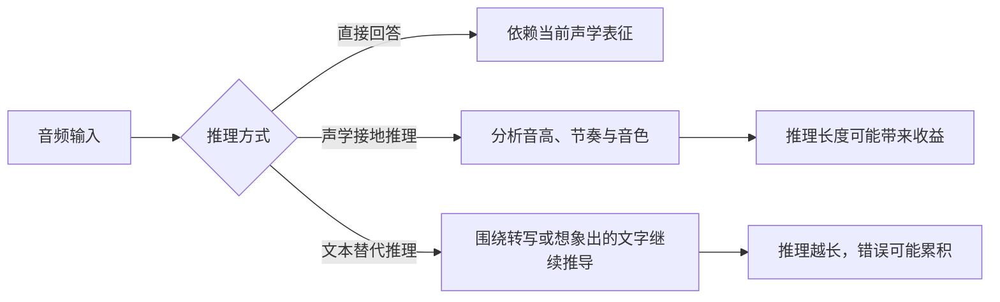
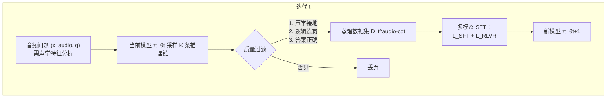
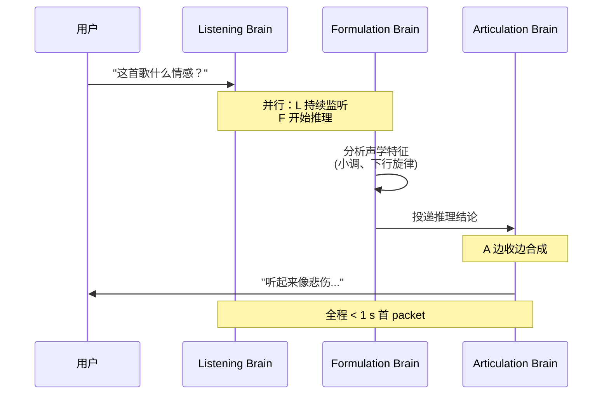
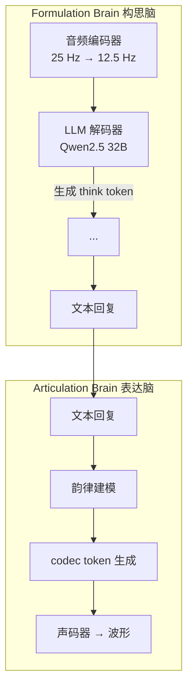

# 24.1 音频奖励设计

给一段 3 秒的音频：一个女声说"明天有雨，记得带伞"，语调平缓，语速偏慢，背景有轻微的键盘声。问模型：说话人的情绪是什么？

模型回答"平静"，答案正确。但把这个回答做成语音播报时，它用同样的音高、同样的节奏念出每一句话，无论内容是安慰、警告还是玩笑。用户听完的评价不是"答错了"，而是"不想再聊了"。

这就是音频 RL 的核心困难。许多文本推理任务可以用答案正确性提供主要奖励，端到端语音交互却同时承载三层信息：**说了什么（内容）、怎么说的（韵律）、多快说出来的（实时性）**。只奖励第一层，模型就可能在后两层退化。本节先拆解音频输入的 token 化方式，再给出三层奖励的具体设计，最后沿着 Step-Audio-R1 与 Step-Audio-R1.5 两篇论文的实验线索，观察单一奖励如何形成陷阱，多维奖励又怎样补回真实交互质量。


<div style="text-align: center; font-size: 0.9em; color: var(--vp-c-text-2); margin-top: -10px; margin-bottom: 20px;">
  <em>图 1：Step-Audio-R1 模型架构。音频编码器（25 Hz）经适配器降采样到 12.5 Hz，送入 LLM 解码器（Qwen2.5 32B）生成文本推理与回复。来源：<a href="https://arxiv.org/abs/2511.15848" target="_blank" rel="noopener noreferrer">Step-Audio-R1 技术报告</a></em>
</div>

## 音频语言模型概览

### 从波形到 token

文本语言模型处理离散 token 序列，音频却是连续波形。例如，24 kHz 音频每秒包含 24000 个采样点。要让 Transformer 高效处理和生成音频，通常要先把波形压缩成离散表示，这是 **神经音频编解码器（Neural Audio Codec）** 的任务。下面是几种代表性编解码器的典型设置（帧率和码本数会随具体带宽配置变化）：

**SoundStream**（Google 2021）：50 Hz 帧率，8 层 RVQ，用于语音合成与 TTS。**EnCodec**（Meta 2022）：75 Hz 帧率，8 层 RVQ，用于通用音频与音乐。**SpeechTokenizer**（2023）：50 Hz 帧率，8 层 RVQ（前 1 语义 + 后 7 声学），用于语义理解。**WavTokenizer**（ICLR 2025）：40-75 Hz 帧率，单层 VQ，用于极致压缩。**Mimi**（Kyutai 2024）：12.5 Hz 帧率，8 层（语义+声学联合），用于实时对话（Moshi）。

其中 [SoundStream](https://arxiv.org/abs/2107.03312) 与 [EnCodec](https://arxiv.org/abs/2210.13438) 的核心是 **RVQ（Residual Vector Quantization，残差向量量化）**。先看直觉：一帧音频的编码向量很难用一个码本里的条目精确表示，那就分层逼近，第一层量化原向量，第二层量化第一层的残差，第三层再量化第二层的残差，逐层把误差压小。

形式化地，设编码器输出 $e^{(0)} = \text{Encoder}(x)$，第 $k$ 层在码本 $\text{CB}_k$ 中找最近邻并记录残差：

$$c_k = \arg\min_c \|e^{(k-1)} - \text{CB}_k[c]\|, \quad e^{(k)} = e^{(k-1)} - \text{CB}_k[c_k]$$

最终波形由全部码本索引重建：$\hat{x} = \text{Decoder}(c_1, \ldots, c_K)$。$K$ 越大重建质量越高，但每多一层码本就多一份 token 序列，自回归生成长度成倍增长。

[SpeechTokenizer](https://arxiv.org/abs/2308.16692) 在这个结构上做了一个关键改动：用 HuBERT 特征指导第一层 RVQ，使较浅层更偏向语义信息，后续层继续补充声学细节。这个分层为后文分别设计内容奖励与韵律奖励提供了一个直观的表示基础。

### 语音生成与文本生成的差异

把音频 token 喂进 LLM 后，生成机制看似与文本一致（自回归 next-token），实际约束完全不同。序列长度方面，文本生成主要随词语数量增加，语音生成还随音频时长与编码帧率增加（75 Hz 表示每秒 75 个时间步）。评价维度方面，文本生成关注内容正确性，语音生成需要同时评估内容、韵律、情感、音色与节奏。错误容忍方面，文本错 1 词仍可读，语音错 1 帧可能出现爆音或电流声。多码本方面，文本是单流，语音 8 层 RVQ 需同步生成。实时性方面，文本流式即可，语音对话通常追求亚秒级首包延迟。

算一笔账：75 Hz、8 层 RVQ 的配置下，一秒语音要生成 75 × 8 = 600 个 token，10 秒对话就是 6000 个 token；同样内容的文本通常只要几百个 token。这是音频 LLM 的 **序列长度爆炸** 问题，它直接决定了音频 RL 的采样成本远高于文本 RL。

### 实时推理的工程挑战

实时语音对话要求**全双工**：模型边听边想边说。三个工程难点：

1. **首 packet 延迟**：用户说完到模型开口的间隔。硬件、网络与模型规模都会改变可达阈值。
2. **流式解码**：不能等整句生成完再合成，必须 chunk-by-chunk 输出
3. **可打断**：用户随时插话，模型必须立刻停止生成并切到听模式

[Moshi](https://arxiv.org/abs/2410.00037) 直接联合建模多条音频与文本流；商业实时模型的内部实现并不完全公开，能确定的是它们都必须流式处理输入和输出。本章还会看到，Step-Audio-R1 Realtime 通过“边听边想、边想边说”的并行结构实现亚秒级首包延迟。

## 音频奖励的三个维度

先从最容易写成程序的正确性奖励开始，再逐步加入较难量化的韵律和延迟。三类信号的可验证程度不同，组合时也会产生冲突。

### 内容正确性奖励

最直接的形式是把最终答案 $a$ 与标准答案 $a^*$ 比对。下面的二值函数解决“能否自动判对错”这一问题：

$$R_{\text{content}}(r, a) = \begin{cases}1, & \text{if } a = a^* \\ 0, & \text{else}\end{cases}$$

二值奖励之外还有三种常用变体：

- **ASR 字错率**：WER 越低奖励越高，$R = 1 - \text{WER}$
- **语义匹配**：用 embedding 余弦相似度，$R = \cos(\text{emb}(a), \text{emb}(a^*))$
- **LLM-as-judge**：让大模型判断答案是否等价，输出 $R \in [0, 1]$

内容奖励适合客观任务（数学、知识问答、ASR），但对开放式对话失效，因为这类任务没有标准答案。

### 韵律自然度奖励

韵律（prosody）包括音高、节奏、强度和停顿。它很难像数学答案那样得到唯一标签，因此需要从人类比较或声学统计中学习偏好。开头那个“答对但难听”的例子，问题就出在这一层。

先看传统做法。训练一个标量奖励模型 $R_\phi(\text{audio}) \to \mathbb{R}$，用人类两两偏好数据，按 Bradley-Terry 模型优化：

$$\mathcal{L}_{\text{RM}} = -\log\sigma(R_\phi(y_w) - R_\phi(y_l))$$

举一个具体例子。同一句"路上小心"，回答 A 内容正确但音高一条直线，回答 B 内容答非所问但语气自然。人类标注者可能给出 A 优于 B（内容优先），也可能给出 B 优于 A（体验优先）。标量 RM 把这些判断压成一个数字，训练结束后无人知道模型到底学到了哪个维度。"内容对但韵律怪"和"内容错但韵律自然"在标量下无法区分。

Step-Audio-R1.5 的解法是分维度打分。用 **rubric prompting** 让评审模型在每个维度上独立给分：

```text
请按以下 rubric 评估回复（0-10 分）：
1. 内容正确性：答案是否准确？
2. 流畅度：是否连贯无卡顿？
3. 韵律自然度：音高、节奏是否符合人类说话习惯？
4. 情感匹配：语气是否与上下文情感一致？
5. 沉浸感：是否像在与人对话？

回复：[音频]
```

每个维度一个分数，再用从人类偏好回归学到的权重 $w_k$ 聚合：

$$R_{\text{prosody}}(y) = \sum_k w_k \cdot \text{GRM}_k(y), \quad w = \arg\min_w \left\|R_{\text{human}}(y) - \sum_k w_k \cdot \text{GRM}_k(y)\right\|^2$$

上面的加权公式是帮助理解多维奖励聚合的教学化写法，并非 Step-Audio-R1.5 公布的训练公式。论文实际采用**生成式奖励模型（Generated Reward Model, GRM）**：给定多轮上下文、策略回答、参考回答以及可选的 rubric，让奖励模型产生相对质量判断，再映射为标量奖励。它把 [RLHF](../chapter15_rlhf/base-model-to-assistant) 中难以解释的单一总分，变成可以随任务条件变化的评审依据。

没有偏好标注数据时，还可以用声学特征直接打分。下面是一段示意代码，核心是用基频分布与人类参考分布的距离衡量自然度，并显式惩罚单调：

```python
def prosody_reward(audio):
    # 提取韵律特征
    f0 = extract_pitch(audio)            # 基频曲线
    energy = extract_energy(audio)       # 能量包络

    # 与参考韵律分布对比
    f0_score = -wasserstein(f0_dist(audio), f0_dist_human)
    energy_score = -wasserstein(energy_dist(audio), energy_dist_human)

    # 抑制单调（针对后文 RLVR 导致的扁平化）
    f0_var = np.std(f0)
    monotonicity_penalty = -max(0, 0.2 - f0_var)  # 基频方差过低就罚

    return 0.5 * f0_score + 0.3 * energy_score + 0.2 * monotonicity_penalty
```

最后那一项惩罚值得留意：它不是奖励"好韵律"，而是惩罚"没有韵律"。后文会看到，这正是对抗 RLVR 扁平化的第一道防线。

### 实时性奖励

延迟奖励需要先定义测量起点和终点。这里把“用户话音结束”作为起点，把“系统输出第一段可播放音频”作为终点，得到首包延迟 $T_{\text{first-packet}}$。下面的分段函数是教学示例，阈值应由产品预算与测量环境决定：

$$R_{\text{latency}}(y) = \begin{cases}1, & T_{\text{first-packet}} < 0.5\text{s} \\ 0.5, & 0.5\text{s} \leq T_{\text{first-packet}} < 1.0\text{s} \\ 0, & T_{\text{first-packet}} \geq 1.0\text{s}\end{cases}$$

也可以用连续形式 $R_{\text{latency}}(y) = \exp(-\alpha \cdot T_{\text{first-packet}})$，避免阈值附近的行为突变。

实时性奖励会和深度推理冲突：想得越久，首 packet 越晚。这个矛盾不是靠调权重解决的，而是靠架构，后文的双脑架构让表达脑在构思脑还在推理时就开始合成，把延迟隐藏进生成流水线。

### 综合奖励

最终的音频 RL 奖励通常是三类的加权组合：

$$R_{\text{total}} = w_c \cdot R_{\text{content}} + w_p \cdot R_{\text{prosody}} + w_l \cdot R_{\text{latency}}$$

权重 $(w_c, w_p, w_l)$ 反映应用场景：

- **场景 — 客服问答**
  - 权重倾向: $w_c$ 大
  - 原因: 信息准确性决定业务价值
- **场景 — 陪伴机器人**
  - 权重倾向: $w_p$ 大
  - 原因: 对话体验决定用户留存
- **场景 — 实时翻译**
  - 权重倾向: $w_l$ 大
  - 原因: 延迟超过阈值即不可用

Step-Audio-R1.5 的核心贡献可以概括为：只优化 $w_c$ 会掉进可验证奖励陷阱，还要把交互偏好纳入奖励。下面两节沿论文实验把这个结论展开。

## 案例一：Step-Audio-R1 与模态接地推理

Step-Audio 系列从 [Step-Audio 2](https://arxiv.org/abs/2507.16632) 的音频理解与对话基础，演进到 Step-Audio-R1（2025 年 11 月）和 Step-Audio-R1.5（2026 年 4 月）。R1 要解决的问题与奖励设计直接相关：为什么音频模型“越想越差”。

### Inverted Scaling 反常现象

文本和视觉推理模型普遍遵循 test-time compute scaling law：给模型更多推理 token，性能可预测地提升（见[第 16 章推理模型](../chapter19_reasoning/r1-zero-pure-rl-reasoning)）。音频域却出现反常：



这张图只解释机制，不对应一组虚构的准确率。论文用多项音频基准和后续消融验证这一现象，具体数值随任务变化。

[Step-Audio-R1](https://arxiv.org/abs/2511.15848) 团队通过系统案例分析找到了根因，他们称之为 **文本替代推理（Textual Surrogate Reasoning）**。大多数音频 LLM 用文本 CoT 数据做 SFT 初始化，结果是模型“想”的对象不是音频，而是对音频的文本描述：

```text
❌ 文本替代推理：
"歌词提到悲伤 → 这首歌情感是悲伤的"

✅ 声学接地推理：
"小调和声进行 + 下行旋律轮廓 + 缓慢节奏 → 悲伤情感"
```

前者只看歌词文本（甚至幻觉出歌词），后者真正分析了音高、节奏、和声。推理链变长时，文本替代推理只会在错误的基底上越走越偏。这就是 inverted scaling 的根源，也是音频域奖励设计的第一个特殊性：奖励不仅要判答案对错，还要能区分推理是否落在声学证据上。

### MGRD：模态接地推理蒸馏

**MGRD（Modality-Grounded Reasoning Distillation，模态接地推理蒸馏）** 是 Step-Audio-R1 的核心训练框架，通过 $T$ 轮迭代把推理基底从文本迁移到声学：



整体损失是各轮 SFT 与 RLVR 的累加：

$$\mathcal{L}_{\text{MGRD}} = \sum_{t=1}^{T}\left(\mathcal{L}_{\text{SFT}}^{(t)} + \mathcal{L}_{\text{RLVR}}^{(t)}\right)$$

每轮包含三个阶段。

**阶段一：自蒸馏采样。** 在需要声学分析的数据上（音色识别、节奏判断、情感分类），让当前模型 $\pi_{\theta_t}$ 采样 $K$ 条候选：

$$(r^{(i)}, a^{(i)}) \sim \pi_{\theta_t}(\cdot \mid x_{\text{audio}}, q), \quad i=1,\ldots,K$$

筛选用三条标准：推理必须显式提及感知特征（音高、节奏、音色）；推理步骤逻辑连贯；最终答案正确。第一条就是"推理落在声学证据上"的可判定版本。

**阶段二：多模态监督精炼。** 在蒸馏数据与原始文本推理数据上联合 SFT：

$$\mathcal{L}_{\text{SFT}}^{(t)} = \mathbb{E}_{\mathcal{D}_t^{\text{audio-cot}}}\left[\log \pi_\theta(r, a \mid x_{\text{audio}}, q)\right] + \mathbb{E}_{\mathcal{D}_{\text{task}}}\left[\log \pi_\theta(r, a \mid q)\right]$$

混合训练是为了防止灾难性遗忘：声学接地的同时保留文本推理能力。

**阶段三：多模态 RL。** 文本任务用标准二值奖励，音频任务用复合奖励：

$$R_{\text{audio}}(r, a) = 0.8 \cdot \mathbb{1}[a = a^*] + 0.2 \cdot \mathbb{1}[\text{reasoning present in } r]$$


<div style="text-align: center; font-size: 0.9em; color: var(--vp-c-text-2); margin-top: -10px; margin-bottom: 20px;">
  <em>图 2：格式奖励消融实验。有格式奖励的模型（青色）更快收敛到更高奖励，且在后期训练中更稳定。来源：<a href="https://arxiv.org/abs/2511.15848" target="_blank" rel="noopener noreferrer">Step-Audio-R1 技术报告</a></em>
</div>


<div style="text-align: center; font-size: 0.9em; color: var(--vp-c-text-2); margin-top: -10px; margin-bottom: 20px;">
  <em>图 3：推理长度坍缩。没有格式奖励时，推理 token 数从约 3000 跌到 1500 以下；有格式奖励时维持在 2300-2800。来源：<a href="https://arxiv.org/abs/2511.15848" target="_blank" rel="noopener noreferrer">Step-Audio-R1 技术报告</a></em>
</div>

0.8 + 0.2 的拆分有明确的实验依据：去掉 0.2 的格式奖励后，推理 token 数从 2800 跌到 1500，MMAU 准确率从 77.7 掉到 76.5。RL 优化器天然倾向"最省 token"的策略，也就是跳过推理直接给答案，必须显式奖励思考行为才能保住推理链。这与第 23 章视觉幻觉一节的结论一致：奖励只考核结果时，模型会找到绕开过程的路径。

::: details MGRD 的数据筛选：pass@8 ∈ [3, 6]
RL 数据集只有 5000 条，但筛选极严。用上一轮模型对每个问题采样 $k=8$ 次，只保留 pass@8 ∈ [3, 6] 的题：太简单的题（pass@8 > 6）学不到东西，太难的题（pass@8 < 3）多半本身有歧义。


<div style="text-align: center; font-size: 0.9em; color: var(--vp-c-text-2); margin-top: -10px; margin-bottom: 20px;">
  <em>图 4：数据选择策略对比。中等难度问题（pass@8 ∈ [3,6]）达到更高且更稳定的奖励，全失败问题在迭代 50 后崩溃。来源：<a href="https://arxiv.org/abs/2511.15848" target="_blank" rel="noopener noreferrer">Step-Audio-R1 技术报告</a></em>
</div>


<div style="text-align: center; font-size: 0.9em; color: var(--vp-c-text-2); margin-top: -10px; margin-bottom: 20px;">
  <em>图 5：数据选择对推理长度的影响。中等难度问题维持 2300-2800 token 的推理链，全失败问题逐步下降到 1800-2000 token。来源：<a href="https://arxiv.org/abs/2511.15848" target="_blank" rel="noopener noreferrer">Step-Audio-R1 技术报告</a></em>
</div>

三种数据策略的对比：全失败题（pass@8 = 0）最终 reward 只有 0.45-0.70，方差大，推理长度跌到 1800 token；中等难度（pass@8 ∈ [3,6]）最终 reward 达到 0.75-0.80，稳定，推理长度维持 2300-2800 token；200K 无筛选（10× 放量）无提升，推理长度不稳定。数据质量高于数据数量：盲目扩大音频 RL 数据反而引入歧义噪声。
:::

### 结果与实时推理

MGRD 的产物是**声学接地推理（Acoustic-Grounded Reasoning）**：推理链显式引用声学属性。Step-Audio-R1 在 MMAU（Massive Multi-Task Audio Understanding）系列基准上的表现：

- **模型 — Step-Audio 2**
  - 平均: 68.3
  - Big Bench Audio: 59.1
  - Spoken MQA: 88.8
  - MMSU: 64.3
  - MMAU: 78.0
  - Wild Speech: 51.1
- **模型 — Gemini 2.5 Pro**
  - 平均: 81.5
  - Big Bench Audio: 96.1
  - Spoken MQA: 94.8
  - MMSU: 79.3
  - MMAU: 77.4
  - Wild Speech: 60.0
- **模型 — Gemini 3 Pro**
  - 平均: 85.1
  - Big Bench Audio: 92.1
  - Spoken MQA: 95.3
  - MMSU: 82.9
  - MMAU: 78.9
  - Wild Speech: 76.4
- **模型 — Step-Audio-R1**
  - 平均: **83.6**
  - Big Bench Audio: **98.7**
  - Spoken MQA: 95.2
  - MMSU: 75.9
  - MMAU: **77.7**
  - Wild Speech: 70.6

平均 83.6 超过 Gemini 2.5 Pro，逼近 Gemini 3 Pro；Big Bench Audio（多步逻辑推理）达 98.7，为所有模型最高。

客观分数解决后，下一个瓶颈是实时性。传统流程里推理与生成串行：先想完，再开口。Step-Audio-R1 Realtime 借鉴 listen-while-thinking 与 think-while-speaking 两类架构，实现 **Mind-Paced Speaking（思维步调说话）**：



支撑这种并行的就是**双脑（Dual-Brain）架构**：



<div style="text-align: center; font-size: 0.9em; color: var(--vp-c-text-2); margin-top: -10px; margin-bottom: 20px;">
  <em>图 6：Mind-Paced Speaking 双脑架构。构思脑负责音频编码与推理，表达脑负责韵律建模与语音合成。两脑解耦后，构思与语音合成可以流水化执行。来源：<a href="https://arxiv.org/abs/2510.09592" target="_blank" rel="noopener noreferrer">Mind-Paced Speaking 论文</a></em>
</div>

这套实时结构来自 [Mind-Paced Speaking](https://arxiv.org/abs/2510.09592)。构思脑（Formulation Brain）由音频编码器加 LLM 组成，输出 `<think>...</think>` 推理和文本回复；表达脑（Articulation Brain）把文本回复转成带韵律、情感、音色的 codec token，再解码为波形。两脑解耦后，构思与语音合成可以流水化执行。Step-Audio-R1 论文报告，Realtime 版本在 Big Bench Audio speech-to-speech 上达到 96.1 分，首包延迟为 0.92 秒；同一评测中的 GPT Realtime 0825 为 83 分、0.98 秒，Gemini 2.5 Flash Native Audio 为 92 分、0.63 秒。

注意表达脑的职责：韵律、情感、音色都在这一层生成。如果 RL 只奖励答案正确性，表达脑没有任何动力去维持韵律质量。这正是下一节陷阱的机制。

## 案例二：可验证奖励陷阱与 RLHF 修正

Step-Audio-R1 用 MGRD 加 RLVR 在客观 benchmark 上达到 SOTA。但部署到真实对话后，团队观察到一个反直觉现象：benchmark 分数越高，对话越难听。

### 陷阱的机制

[Step-Audio-R1.5](https://arxiv.org/abs/2604.25719) 把这个问题命名为**可验证奖励陷阱（Verifiable Reward Trap）**：

::: warning 可验证奖励陷阱
当音频 benchmark 的 ground truth 只是一个离散标签（情感类别、ASR 文本、场景标签）时，RLVR 只能奖励"猜对标签"，结构性地无视韵律自然度、情感连贯性、对话流畅度。
:::

机制可以写成一条链：

```text
RLVR 目标 = 答案正确性 → 模型学到"最省 token"策略 → 回答变简短、机械、扁平
                ↓
         benchmark ↑  真实对话体验 ↓
```

用本节开头的三层框架来表述：RLVR 只优化 $w_c$，模型把全部容量投向内容正确性；韵律维度没有奖励信号，就在优化过程中被逐步丢弃。RLVR 优化的是"说什么"，用户关心的是"怎么说"，两者解耦时，模型退化成答题机：技术上准确，体验上空洞。

### Step-Audio-R1.5 的三阶段修正

R1.5 的解法是把 RLHF 补回训练流程：训练一个整体性偏好奖励模型，把正确性、流畅度、情感共鸣蒸馏成统一的监督信号。整个流程分三步。

**第一步：Audio-Centric Mid-Training。** RLHF 之前先做一轮中间训练，强化音频理解和推理基底：

$$\mathcal{L}_{\text{mid}} = \mathbb{E}_{(x,q,r,y) \sim \mathcal{D}_{\text{audio}}}\left[\log \pi_\theta(r, y \mid x, q)\right] + \mathbb{E}_{(q,r,y) \sim \mathcal{D}_{\text{text}}}\left[\log \pi_\theta(r, y \mid q)\right]$$

其中 $(x, q, r, y)$ 分别是音频输入、上下文、推理、回复。文本数据保留长 CoT 推理结构，推理能力从文本模态迁移到音频模态。

**第二步：Cold-Start SFT。** 这一步不再扩领域知识，而是对齐交互行为：

1. **多轮对话连续性**：跨轮保持上下文和约束
2. **指令遵循**：按用户指定的内容、格式、风格响应
3. **回复自然度**：连贯、对话得当
4. **交互感知**：处理追问、澄清、打断、用户修正

它为后续 RLHF 提供更好的初始化，避免偏好优化浪费在纠正基本对话行为上。

**第三步：使用 rubric-based GRM 做 RLHF。** 音频交互包含内容约束、格式要求、跨轮记忆、自然度和语气等异质目标。R1.5 没有把每个维度手工压成固定权重，而是让生成式奖励模型在两种模式之间切换：任务给出明确 rubric 时，按照 rubric 比较回答；没有明确规则时，做普通的成对偏好判断。

论文先把截至第 $T$ 轮的对话历史记为 $\mathcal{H}_{1:T}$，策略回答记为 $y$，参考回答记为 $y^{\text{ref}}$，可选评审标准记为 $c$。生成式奖励模型给出相对质量判断：

$$
g = \mathcal{R}(\mathcal{H}_{1:T}, y, y^{\text{ref}}; c),
\qquad c \in \mathcal{C} \cup \{\varnothing\},
$$

再通过映射函数 $\phi$ 把判断结果变成策略优化所需的标量奖励：

$$
r = \phi(g).
$$

当 $c \neq \varnothing$ 时，评审会检查“是否记住第三轮给出的语速要求”一类明确条件；当 $c=\varnothing$ 时，评审比较哪段回答整体更自然。这个设计把可说明的约束与难以写成规则的体验放进同一个奖励接口。

得到优势估计 $\hat A_t$ 后，论文使用带参考策略 KL 约束的 PPO 风格目标：

$$
\mathcal{L}_{\text{RLHF}}(\theta)
= \mathbb{E}_t\!\left[
\min\!\left(
\rho_t(\theta)\hat A_t,
\operatorname{clip}(\rho_t(\theta),1-\epsilon,1+\epsilon)\hat A_t
\right)
\right]
-\beta D_{\mathrm{KL}}(\pi_\theta\|\pi_{\mathrm{ref}}),
$$

其中 $\rho_t(\theta)$ 是新旧策略对当前 token 的概率比，裁剪项限制一次更新的幅度，KL 项防止策略远离参考模型。这里的目标来自 [Step-Audio-R1.5 第 3.3 节](https://arxiv.org/html/2604.25719#S3.SS3)，不应写成 DPO 损失。

### 韵律自然度的保留

RLVR 训练中最明显的退化是**韵律扁平化**：回答更短、更机械，情感连续性也变差。R1.5 的修正信号来自端到端交互偏好，GRM 比较完整回答在正确性、流畅度与情感共鸣上的整体质量；有明确任务条件时，再用 rubric 检查具体约束。需要注意，R1.5 的架构输出纯文本，论文没有声称在 RVQ codec token 层直接施加偏好监督。


<div style="text-align: center; font-size: 0.9em; color: var(--vp-c-text-2); margin-top: -10px; margin-bottom: 20px;">
  <em>图 7：Step-Audio-R1.5 在 8 项语音到文本基准上的综合排名。R1.5 平均分 77.97，高于 R1 的 72.50。来源：<a href="https://arxiv.org/abs/2604.25719" target="_blank" rel="noopener noreferrer">Step-Audio-R1.5 技术报告</a></em>
</div>

论文在 AudioMultiChallenge、Big Bench Audio、MMSU、MMAU 等八项语音到文本基准上统一评测。R1.5 的平均分为 77.97，高于 R1 的 72.50；提升主要来自多轮交互与长上下文任务，同时保留了原有分析能力。这里的结论比“所有传统基准都不掉分”更准确：RLHF 改善了总体平衡，但不同单项仍有升降。

## 与前面章节的联系

音频奖励设计不是孤立的概念，它把前面章节的多个思想串联起来。**RLVR 的二值奖励（第 15 章）** 在音频域表现为内容正确性奖励，单独使用时引发可验证奖励陷阱。**偏好奖励模型（第 13 章）** 在 R1.5 中升级为 rubric-based GRM，从标量打分变为分维度打分卡。**PPO 与 KL 约束（第 8、13 章）** 被 R1.5 用于裁剪目标和参考策略正则，把生成式奖励转成稳定的策略更新。**格式奖励防推理塌缩（第 16 章）** 在音频 RL 中表现为 0.2 的推理存在性奖励，机制相同。**VLM RL 的视觉捷径（第 23 章）** 在音频域对应文本替代推理：绕开模态证据，直接猜答案。

<details>
<summary>思考题：为什么音频 RL 的格式奖励（0.2）比文本 RL 更必要？</summary>

文本 RL 里，推理链本身就在提升答案正确率，推理行为和结果奖励方向一致，CoT 可以自然涌现。音频域不同：文本替代推理的存在意味着，长推理链既可能基于声学证据，也可能基于幻觉出的文本描述，推理长度与正确率甚至负相关（inverted scaling）。这时结果奖励无法区分两种推理，只有显式的格式与接地奖励才能把优化方向锚定在声学证据上。

</details>

## 小结

音频先经编解码器 token 化才能进入 LLM；RVQ 的分层结构（语义层 + 声学层）与奖励的分层结构（内容 + 韵律）同构。音频奖励必须覆盖内容、韵律、实时性三层。只奖励内容的 RLVR 会把模型推进可验证奖励陷阱：benchmark 上升，对话体验下降。Step-Audio-R1 用 MGRD 解决"越想越差"的 inverted scaling，把推理锚定到声学证据；Step-Audio-R1.5 用 rubric-based GRM 与 PPO 风格的 RLHF 把交互质量补回奖励。实时性与深度推理的冲突靠双脑架构解决：构思脑负责长推理，表达脑并行合成语音。

下一节 [24.2 多模态音频 Agent](./future) 把奖励设计与训练循环落到代码层面，走一遍最小可运行的音频 GRPO 训练，再看音频模型如何变成能调用工具、参与多轮协作的 Agent。

## 参考资料

- [Step-Audio-R1 Technical Report（arXiv:2511.15848）](https://arxiv.org/abs/2511.15848)：MGRD 框架原文，音频推理的奠基工作
- [Step-Audio-R1.5 Technical Report（arXiv:2604.25719）](https://arxiv.org/abs/2604.25719)：RLHF 范式迁移，提出并破解可验证奖励陷阱
- [Step-Audio 2 Technical Report（arXiv:2507.16632）](https://arxiv.org/abs/2507.16632)：Step-Audio 系列基础模型
- [EnCodec（arXiv:2210.13438）](https://arxiv.org/abs/2210.13438)：RVQ 编解码器的经典工作
- [SpeechTokenizer（arXiv:2308.16692）](https://arxiv.org/abs/2308.16692)：语义层与声学层分离的语音 token 化
- [Moshi（arXiv:2410.00037）](https://arxiv.org/abs/2410.00037)：全双工实时对话与 Mimi 编解码器
