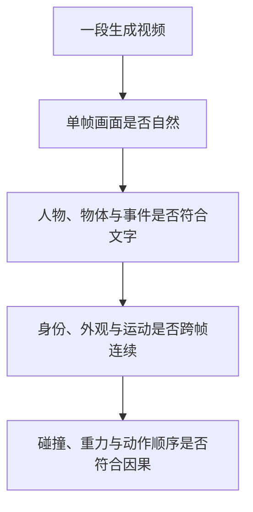
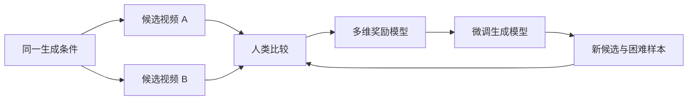
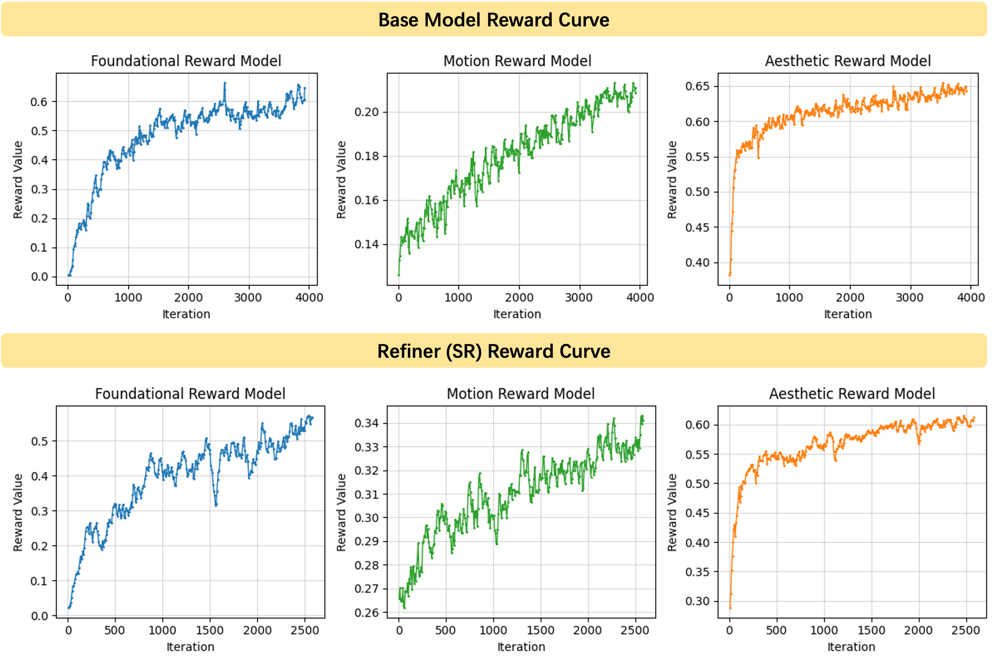
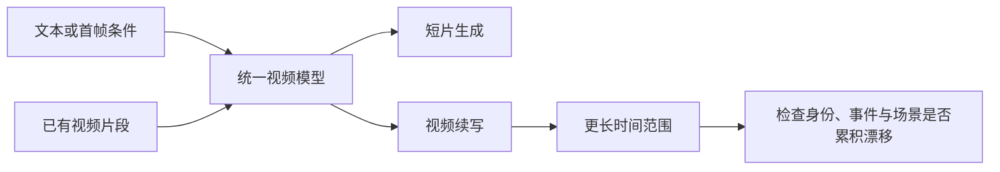

# 24.5 视频的时间一致性

先想象一段只有四秒的视频。

> 一颗红球从斜坡顶端滚下，撞到蓝色积木后停在桌边。

第一秒，红球和蓝色积木都很清晰。第二秒，球开始向下滚。第三秒，球还没有碰到积木，积木却先倒了。第四秒，红球突然出现在桌子的另一侧。

把任意一帧单独截出来，画面都可能很好看。连起来以后，动作顺序、物体身份和因果关系全错了。视频生成由此多出一个图像生成没有的核心问题：**模型既要画对每一帧，还要让变化发生得合理。**

我们用四层检查来看这段视频错在哪里。第一层只看单帧：四帧画面清晰、光照自然，全部通过。第二层对照文字：提示词要求"先撞积木，再停在桌边"，视频里确实有红球、积木、碰撞和停止，事件要素齐全。第三层沿时间轴检查：红球在第三秒到第四秒之间轨迹断裂，身份位置无法由前一帧解释。第四层检查因果：积木在第 3 秒倒下，接触发生在第 3.5 秒之后，结果先于原因。

四层检查给出四个不同的结论。只报告一个总分，第三层和第四层的错误会被第一层的高分掩盖。这一节的其余部分都在回答同一个问题：训练和评测时，怎样把这些子信号分开使用。


<div style="text-align: center; font-size: 0.9em; color: var(--vp-c-text-2); margin-top: -10px; margin-bottom: 20px;">
  <em>图 1：同一生成条件经过预训练、持续训练、监督微调与 RLHF 后得到的视频帧。读图时要沿每一行检查动作和身份是否连续，不能只比较某一帧是否更漂亮。来源：<a href="https://arxiv.org/abs/2506.09113" target="_blank" rel="noopener noreferrer">Seedance 1.0 技术报告</a>。</em>
</div>

## 24.5.1 一条时间轴增加了什么问题

图像生成可以把结果写成 $x$，视频则由连续帧组成。下面是本书用于表示帧序列的教学记号：

$$
v=(x^{(1)},x^{(2)},\ldots,x^{(F)}).
$$

$F$ 是帧数。一段常见的 5 秒视频按每秒 16 帧采样，就有 80 帧；按每秒 24 帧则是 120 帧。模型需要同时处理空间与时间：一帧内部的人物、物体和背景要合理，相邻帧之间的身份、位置与动作也要连续。

四层检查对应四种不同的失败方式。

第一层是**单帧画面质量**。人物的手有没有畸形，边缘是否清晰，光照和构图是否自然。这一层接近图像生成评测，检查器逐帧独立打分。

第二层是**文字与事件对齐**。提示词说"红球先撞积木，再停在桌边"，视频是否真的包含红球、积木、碰撞和停止，事件顺序是否正确。这一层需要把整段视频和文字放在一起判断。

第三层是**时间一致性**。同一个人物的衣服不能中途变色，桌上的杯子不能无故消失，镜头移动时背景结构不能反复重建。这一层检查的是相邻帧之间能否相互解释。

第四层是**物理与因果一致性**。积木应当在碰撞之后倒下，抛出的物体应当沿连续轨迹运动，遮挡后的物体仍应保持存在。这一层需要事件之间的先后关系成立。



这四层会相互影响，却不能互相代替。一段视频可以有很高的审美分数，同时存在明显的物体瞬移。一个总分会把这种错误藏起来，因此视频训练与评测都需要保留各个子信号。

## 24.5.2 为什么终点的一个分数不够

沿用上一节的记号，视频生成也可以看成一条采样轨迹 $\tau$。最简单的做法是在视频生成结束后给一个总奖励：

$$
R(\tau,c)=r_\phi(v,c).
$$

$c$ 是生成条件，$v$ 是最终视频，$r_\phi$ 是视频奖励模型。这个写法可以直接用于策略梯度，但它没有告诉模型错误发生在哪一段。

先看决策链有多长。生成一段 5 秒视频通常需要约 50 步去噪；每一步都在为 80 帧的潜变量做决定。粗略相乘，一段视频对应约四千次模型前向计算。如果瞬移发生在第三秒，出错的决策只占其中一小部分，终局奖励却只返回一个标量。模型无法判断哪些步骤应当改变。这就是视频生成中的信用分配问题。

再用两个候选视频把差距写出来。候选 A 的画面与语义都很好，只是后半段瞬移；候选 B 各项平庸但没有局部错误。四个子信号打分如下，权重取 $\lambda_q=\lambda_a=\lambda_t=\lambda_p=0.25$：

| 候选 | $R_{\mathrm{quality}}$ | $R_{\mathrm{alignment}}$ | $R_{\mathrm{temporal}}$ | $R_{\mathrm{physics}}$ | 加权总分 |
| ---- | ---------------------- | ------------------------ | ----------------------- | ---------------------- | -------- |
| A    | 0.9                    | 0.8                      | 0.3                     | 0.35                   | 0.59     |
| B    | 0.6                    | 0.55                     | 0.6                     | 0.65                   | 0.60     |

终点奖励只能看到 0.59 与 0.60，结论是 B 略好。分项信号还能说出原因：A 的问题集中在后半段的时间与因果两项，B 的问题是整体偏弱。两种诊断对应两种训练方向。前者需要修正视频后半段的生成决策，后者需要全面提升。这是子奖励提供的、总分无法提供的信息。

把这种拆分写成公式，就是**教学性的奖励模板**，不是 VADER、DanceGRPO 或 Seedance 论文共同采用的固定公式：

$$
R
=
\lambda_qR_{\mathrm{quality}}
+
\lambda_aR_{\mathrm{alignment}}
+
\lambda_tR_{\mathrm{temporal}}
+
\lambda_pR_{\mathrm{physics}}.
$$

每个 $\lambda$ 表达一种训练取舍。公式写出来容易，真正困难的是四个奖励是否可靠。例如，用相邻帧相似度衡量一致性，会偏爱几乎不动的视频；用运动幅度鼓励动态，又可能产生没有语义的剧烈晃动。训练系统需要分别观察子奖励，并用未参与训练的评测检查它们是否被利用。

## 24.5.3 三条不同的视频对齐路线

"使用奖励改进视频"并不只对应一种算法。公开研究大致给出了三条路线。

### VADER：让可微奖励直接穿过生成过程

[VADER 原论文](https://arxiv.org/abs/2407.08737)将可微奖励的梯度反向传播进视频扩散模型[^vader]。优化目标是奖励关于模型参数的期望：

$$
J(\theta)=\mathbb{E}_{c,\,x_0\sim p_\theta(x_0\mid c)}\big[R(x_0,c)\big].
$$

$x_0$ 是生成的视频，$R$ 是奖励。要让这个梯度可用，奖励必须经过整条去噪链回传。按链式法则展开：

$$
\nabla_\theta R(x_0,c)=\sum_{t=0}^{T}\frac{\partial R(x_0,c)}{\partial x_t}\cdot\frac{\partial x_t}{\partial\theta}.
$$

每一步去噪都为参数更新贡献一条路径。代价是显存：对约 50 步的完整链条做反向传播，需要保存每一步的中间状态。VADER 用**截断反向传播**控制成本：只在最后 $K$ 步保留梯度，更早的步骤执行 stop-grad，即 $K<T$ 时把 $t>K$ 的网络预测从计算图中截断。$K$ 取小值既减少显存，也降低对奖励模型过度拟合的风险。

奖励本身也有多种接法。VADER 把逐帧的图文相似度模型 HPSv2 与 PickScore 相加，作为每一帧的对齐奖励。这种写法可能诱导所有帧变得相同，论文报告预训练的先验足以防止这种坍缩。它还在整段视频上接入 VideoMAE 动作分类器，把目标动作类别的预测概率作为奖励；用 V-JEPA 的自监督分数衡量帧间可预测性，作为时间一致性信号。这样的奖励可以改善跨帧表征稳定性，却不能单独证明模型掌握了牛顿力学。一个视频在表征空间里平滑，仍可能让物体在错误时刻倒下。

论文还做了一个长时程实验。把图像到视频模型 Stable Video Diffusion 改造成自回归生成，将上下文长度扩展到训练时的 3 倍：把上一段生成的最后一帧作为下一段的输入。直接这样做效果很差，因为模型从未见过自己的输出，分布发生了偏移。VADER 用 V-JEPA 奖励约束新生成的片段与已有片段保持一致，才让长视频在时间和空间上连贯。

效率对比的结论是：奖励网络提供的是指向像素的稠密梯度，而 DDPO、DPO 一类方法只能回传一个标量反馈。同样一段生成视频，前者携带的学习信号多得多。VADER 论文据此报告，它在奖励查询次数和 GPU 时数上都显著低于这两类基线[^vader]。


这条路线的边界也很清楚：奖励必须能够稳定求导，而且奖励网络的偏差会直接成为优化方向。

### DanceGRPO：用黑盒奖励比较同一条件下的一组视频

[24.4 节](./visual-generation-dancegrpo)已经推导了 [DanceGRPO](https://arxiv.org/abs/2505.07818)。它为扩散与 rectified-flow 采样建立随机转移概率，再对同一条件生成一组结果，使用组内归一化优势更新模型[^dancegrpo]。论文在 Stable Diffusion、FLUX、HunyuanVideo 与 SkyReels-I2V 四个基础模型上验证了文生图、文生视频和图生视频三类任务，在 HPS-v2.1、CLIP Score、VideoAlign 与 GenEval 上相对基线最高提升 181%。

视频部分的两个发现值得细看。第一个是多奖励的组合方式。不同奖励模型的打分尺度不同，直接相加会让数值大的奖励主导训练。DanceGRPO 的做法是先对每个奖励分别做组内归一化，再把归一化后的优势相加：

$$
A_i=\sum_{k=1}^{K}\frac{r_i^k-\mu^k}{\sigma^k}.
$$

$r_i^k$ 是第 $i$ 个样本在第 $k$ 个奖励上的得分，$\mu^k$ 与 $\sigma^k$ 是该奖励在组内的均值和标准差。论文还观察到，只用 HPS-v2.1 训练会让图像呈现不自然的油光质感，加入 CLIP 分数后画面恢复自然。两个奖励相互约束，比单奖励训练更稳。

第二个发现来自图生视频任务。SkyReels-I2V 的输入图像已经固定了画面内容和文字匹配的上限，参数空间里剩下可优化的几乎只有运动质量。DanceGRPO 用 VideoAlign 的运动分数作为奖励，在该维度上取得 118% 的相对提升。这个例子说明，选择优化哪个子信号，要先看任务还给模型多少自由度。

论文还测试了二值奖励：把连续的 HPS 分数按 0.28 阈值离散成 0 或 1，GRPO 仍然能够学习这种稀疏反馈，这与语言模型中规则奖励的思路一致。消融实验则显示，从噪声出发的前 30% 时间步对学习基础生成模式贡献最大，只训练这一段又不如完整覆盖。

代价是一次更新要为每个条件完整生成一组视频，显存和采样时间都会迅速增加。奖励不需要可微，因此适合接入人类偏好模型或多模态评审器。公开证据支持"它能用于视频生成强化学习"，却不支持"所有主流视频产品都使用它"。工业模型的论文若没有披露优化器，就应当把算法写成未知。

### 视频 RLHF：从人类比较中学习多维偏好

另一条路线先收集偏好数据。标注者观看同一条件下的两个视频，比较文字遵循、画面质量、动作自然度与时间一致性。系统可以训练一个奖励模型，再用强化学习微调生成模型；也可以把被偏好的样本用于监督微调或偏好优化。



这条数据循环的关键不是把所有偏好压成一个数字。标注界面应当让评审者指出问题属于画面、事件、时间还是物理。这样才能发现训练奖励上升时，究竟是哪一项真的改善了。

## 24.5.4 Seedance：公开技术报告怎样描述视频 RLHF

[Seedance 1.0 技术报告](https://arxiv.org/abs/2506.09113)给出了一个较完整的工业训练案例[^seedance]。这篇报告值得读的原因，在于它把数据、架构、监督微调、RLHF 与推理加速放在同一条系统链路中。

### 架构：一个模型同时学文生视频、图生视频与多镜头

Seedance 的骨干是 DiT：视频帧经 VAE 编码为视觉 token，文本由一个微调过的 decoder-only LLM 编码，两类 token 拼接后送入 transformer 层。空间层与时间层解耦，配合交错的多模态位置编码和窗口注意力。报告采用 3D MM-RoPE：视觉 token 使用三维位置编码，文本 token 额外获得一维编码，两类 token 可以交错排列。多镜头视频由此得到天然支持：多个镜头按动作的时间顺序组织，每个镜头配一段独立的详细描述。

这一步提醒我们：RLHF 不能凭空创造底座没有见过的运动知识。若训练数据中缺少某类动作或镜头，奖励只能在已有候选中进行选择，很难补出完整能力。

### 后训练是四个阶段的流水线

报告把后训练拆成预训练、持续训练、监督微调和 RLHF 四步，另有一个超分辨率 refiner 走完自己的预训练、SFT 与 RLHF。图 1 就是这条流水线的可视化。

持续训练在预训练数据里做了一次筛选：用审美评分器和基于光流的运动评估器挑出审美更高、运动更丰富的子集，再用退火学习率继续训练。字幕分两种写法：保留完整动静态描述的长字幕，以及只描述运动动态的短字幕。图生视频任务总是提供第一帧，短字幕把第一帧已知的静态内容删掉，迫使模型把语义对齐到运动本身上。

监督微调使用人工整理的数据集。报告按视觉风格、运动类型等属性定义了几百个类别，在每个类别内定向收集高质量视频与人工校对的字幕。一个容易被忽略的细节是模型合并：在不同数据子集上分别训练多个模型，再合并成一个。各子模型用比预训练更小的学习率训练，并在合适的位置提前停止，防止过拟合并保住文本可控性。

### RLHF：直接最大化多维奖励，并做到超分模型上

Seedance 的 RLHF 在训练时模拟推理流程：采样到合适的位置后直接预测干净视频 $x_0$，交给多个奖励模型评估，然后直接最大化这些奖励的组合。报告把它与 DPO、PPO 和 GRPO 做了对比实验，结论是这种奖励最大化方式在效率与效果上最好，能同时改善文本视频对齐、运动质量与审美。训练采用多轮迭代：扩散模型与奖励模型交替更新，而不是在线动态更新奖励模型，报告称这种方式上限更高也更可控。

RLHF 还被施加在 refiner 上。refiner 是一个条件扩散模型：输入低分辨率的 VAE 潜表示，输出高分辨率视频。训练时高分辨率结果由多个奖励模型打分，直接最大化这些信号的线性组合。把 RLHF 放在蒸馏加速后的 refiner 上，可以在低采样步数的场景里同时保住运动质量与画面保真度。

回看本节开头的图 1，要沿时间轴观察，而不能只挑一帧。检查人物外观是否持续一致，动作是否真的完成，背景是否因镜头移动而重建，再判断后训练改进发生在哪一层。



<div style="text-align: center; font-size: 0.9em; color: var(--vp-c-text-2); margin-top: -10px; margin-bottom: 20px;">
  <em>图 2：Seedance 报告展示的多项奖励变化。基础能力、运动和审美需要分别监控；一条总曲线无法说明各项是否共同改善。来源：<a href="https://arxiv.org/abs/2506.09113" target="_blank" rel="noopener noreferrer">Seedance 1.0 技术报告</a>。</em>
</div>

### 速度来自蒸馏与系统优化的叠加

多阶段蒸馏减少生成所需的函数求值次数。报告称蒸馏后的模型在提示词对齐、运动质量、画面保真和与首帧一致性四个专家评审维度上与蒸馏前相当。VAE 解码器也做了改造：分析发现靠近像素空间的阶段主导延迟，收窄这些阶段的通道宽度并重训解码器，在端到端质量不变的情况下把解码提速约 2 倍。叠加系统级优化后，报告给出的公开测量是在 NVIDIA L20 上用 41.4 秒生成一段 5 秒 1080p 视频，端到端提速约 10 倍[^seedance]。

这些结果说明，模型质量提升之后仍需解决采样步数、显存、并行和服务吞吐。视频强化学习只覆盖其中一段，不能代替整个工程系统。

## 24.5.5 LongCat-Video：长视频为什么要从预训练阶段准备

短视频可以只展示一个动作，长视频则要维持人物、场景和事件。误差会沿时间积累：开头的一次身份漂移，会让后面的动作和叙事都失去参照。

[LongCat-Video 技术报告](https://arxiv.org/abs/2510.22200)将这一问题放在一个 13.6B 参数的 Diffusion Transformer 中处理[^longcat]。下面按它公开披露的方法逐项展开。

### 任务统一靠条件帧的数量

文生视频、图生视频和视频续写共用同一个模型，区别只在条件帧的数量：文生视频是 0 帧，图生视频是 1 帧，视频续写是多帧。续写任务从预训练阶段就进入训练目标，报告称模型因此能生成数分钟的视频而不出现颜色漂移或质量退化。

### 由粗到细：先 480p 低帧率，再精修到 720p 高帧率

推理分两段。第一段在 480p、15fps 上生成完整视频；第二段把结果三线性上采样到 720p、30fps，交给一个精修专家。精修专家是基础模型上的 LoRA：精修任务与生成任务相近，但去噪路径不同，从上采样结果加中等强度噪声的位置出发，用 flow matching 学到低分辨率分布与高分辨率分布之间的映射。报告把噪声强度设为 0.5，精修段只需 5 个采样步。报告还观察到，由粗到细不仅省算力，纹理细节甚至超过直接生成 720p 的结果，并能纠正局部畸变。

### 块稀疏注意力：只算最相关的块

注意力计算量随 token 数平方增长，是高分辨率的主要瓶颈。LongCat 的做法是把查询与键划分成不重叠的三维块，先用块的平均值计算查询块与每个键块的相似度，选出得分最高的前 $r$ 个块，只在这些块内做标准注意力。这是可训练的稀疏算子，报告称保留不到 10% 的计算量即可得到接近无损的质量，并随模型一起开源了前向与反向实现。

### GRPO 与多奖励：三个维度、四个信号

后训练用 GRPO 加 LoRA 完成，报告披露了两个稳定性改动。第一，对策略损失和 KL 损失按时间步重新加权，消除梯度大小对时间步与步长的依赖。第二，把标准 GRPO 的组内标准差换成全部组里的最大标准差：

$$
\hat{A}_{k,t}^{i}=\frac{R_k(x_0^i,c_j)-\mu_k}{\sigma_{\max}}.
$$

$\mu_k$ 是第 $k$ 个奖励的组内均值，$\sigma_{\max}$ 是该奖励在所有组中的最大标准差。标准差过小的组，其优势估计可能只是奖励模型的噪声；用最大标准差归一化，等于降低了这些组的梯度权重。

奖励分三个维度、四个信号。视觉质量用 HPSv3 的两种用法：HPSv3-general 用固定提示词"A high-quality image"对所有帧打分取平均，只看画面；HPSv3-percentile 用视频字幕打分，取前 30% 帧的分数，避免个别帧的内容变化拉低整体。运动质量用一个在灰度视频上微调的 VideoAlign 模型：去掉颜色信息，评估只落在运动特征上，灰度训练还推迟了验证损失的上升，说明泛化更好。文本视频对齐用另一个保留彩色输入的 VideoAlign 微调模型。



多奖励的组合在策略损失里是各奖励相对优势的加权和。报告给出的关键证据是奖励黑客的对照实验：单独使用 HPSv3 训练会诱导模型趋向静止画面，运动奖励恰好抵消这种倾向，同时保留 HPSv3 对画质的提升。多个奖励相互约束，起到了正则化的作用。

推理效率的公开测量是：720p、93 帧的视频，稠密注意力加 50 步采样需要 1429.5 秒；蒸馏降到 16 步后是 244.6 秒；加上由粗到细和块稀疏注意力后降到 116.5 秒，加速 12.3 倍。720p、30fps 的 189 帧视频需要 142 秒，加速 10.1 倍。

这条路线的关键含义是：长视频能力需要在预训练和架构阶段准备，RLHF 再负责调整人类偏好与多维质量。原有页面把 LongCat 写成固定五秒分块、重叠平均、故事 LLM 奖励和两级扩散；这些细节没有出现在公开论文的核心方法中，不能当作事实保留。

LongCat-Video 来自美团团队，与字节跳动的 Seedance 是两项不同工作。阅读工业论文时，先核对机构、模型与公开材料，可以避免把相近发布时间的项目拼成一条不存在的训练链。

## 24.5.6 看主流产品时，先区分能力展示与训练证据

[Hailuo](https://hailuoai.video/)、Wan、[Kling](https://klingai.com/)、[Sora](https://openai.com/sora/) 和 [Veo](https://deepmind.google/models/veo/) 都展示了视频生成能力，但公开程度不同。

[Wan 技术报告](https://arxiv.org/abs/2503.20314)与[官方仓库](https://github.com/Wan-Video/Wan2.1)提供了模型说明、代码和权重，研究者可以检查模型结构、运行推理并复现部分实验[^wan]。开放模型不等于公开了全部后训练数据与偏好优化流程，算法归属仍应以论文和仓库为准。

Hailuo 与 Kling 的产品展示可以帮助观察人物运动、镜头控制和物理失败。若公开材料没有说明它们使用 DanceGRPO 或 CISPO，就不能根据公司其他论文推断具体训练算法。MiniMax-VL-01 是视觉语言模型，也不能作为 Hailuo 视频模型开源的证据。

Sora 与 Veo 的公开页面展示了生成能力和产品特性。训练数据、奖励组成与后训练优化器只披露了一部分。比较这些系统时，可以描述"支持何种输入、输出多长、是否包含音频、公开评测如何设计"，不应填入未经来源支持的 RL 配方。

这条规则看似保守，却是阅读快速变化领域的基本方法：**产品结果告诉我们系统能做什么，技术报告才告诉我们作者公开承认怎样做到。**

## 24.5.7 怎样评测"物理感"

"看起来有物理感"太宽，无法直接成为评测项。先把它拆成可观察事件。

### 物体恒常性

杯子被手遮挡一秒后应当重新出现，颜色、形状和位置变化应能由之前的运动解释。这里测试的是物体是否在模型的时间表示中持续存在。

### 连续轨迹

抛出的球应沿连续路径运动，速度变化应当平滑。仅比较相邻帧相似度不够，因为静止视频也会得到很高的一致性分数。为了说明轨迹检查，下面用 $\mathbf p_f$ 表示第 $f$ 帧检测到的物体位置：

$$
\mathbf{p}_1,\mathbf{p}_2,\ldots,\mathbf{p}_F.
$$

再检查位移和加速度是否出现无法解释的跳变。以 16fps 为例，相邻帧的位置差 $\mathbf{p}_{f+1}-\mathbf{p}_f$ 应当大小相近、方向连续。若某一帧的位移突然达到相邻帧均值的十倍，跟踪器会在这一帧报告轨迹断裂；把断裂时刻之前的状态与之后对照，就能定位瞬移发生的帧号。

### 接触与因果顺序

提示词"球撞倒积木"至少包含三个事件：球接近积木、发生接触、积木随后倒下。若三个事件分别发生在第 8、12、15 帧，顺序正确；若倒下发生在第 10 帧、接触发生在第 12 帧，因果关系已经颠倒。把顺序写成教学记号就是：

$$
t_{\mathrm{approach}} < t_{\mathrm{contact}} < t_{\mathrm{fall}}.
$$

若积木在接触前倒下，单帧质量再高也应判为因果失败。这正是本节开头那段红球视频在第四层检查中的失败方式。

### 重力、支撑与遮挡

物体失去支撑后应向下运动，放在桌面上时不应穿透桌面。镜头移动造成的遮挡也不能让物体永久消失。这些测试不需要建立完整物理引擎，却能覆盖视频模型最常见的可见错误。

## 24.5.8 做一个最小视频评测 Harness

在训练前先建立评测集，成本通常比盲目增加奖励更低。一个最小 Harness 可以这样组织。

第一步，准备六类提示词：身份保持、物体恒常、连续轨迹、碰撞顺序、重力与支撑、镜头运动。每类先写十条短提示，控制对象数量和背景复杂度。

第二步，为每条提示固定若干随机种子。训练前后使用相同条件生成多个候选，保存模型版本、采样器、步数、分辨率和时长。没有这些元数据，结果无法复现。

第三步，把自动指标分开记录：

- 画面质量模型评价清晰度和伪影；
- 文本视频模型检查主体、属性和事件；
- 目标检测与跟踪检查身份和轨迹；
- 事件识别器检查接触、倒下和停止的顺序；
- 人类盲评负责识别自动指标遗漏的整体异常。

第四步，保存失败片段，而不是只保存平均分。一次有用的评测报告应当能回答：错误从第几秒开始，属于哪一类，前面的状态怎样传播到后续帧。

```python
for case in evaluation_cases:
    for seed in fixed_seeds:
        video = generator(case.prompt, seed=seed)

        report = {
            "visual_quality": quality_model(video),
            "text_alignment": video_text_model(video, case.prompt),
            "track_consistency": tracker_score(video),
            "event_order": event_order_score(video, case.events),
        }
        save_video_and_report(video, report, metadata={
            "prompt": case.prompt,
            "seed": seed,
            "model_version": generator.version,
        })
```

这段代码的重点是保存分项结果与生成元数据。真实系统还需要标注置信度、跟踪失败和人工复核状态。自动评测器本身出错时，Harness 应把样本送入人工检查，而不是强行给出确定结论。

## 24.5.9 接下来还会遇到哪些问题

更长视频首先受制于状态累积。目标从十秒片段扩展到数分钟后，模型需要记住人物身份、空间布局和未完成事件。续写训练、稀疏注意力和分层时间表示都在降低成本，评测也必须从单动作扩展到完整事件链。

音视频联合生成增加了另一条同步约束。脚步声要跟随落脚时刻，口型要与语音对齐，环境声还要随镜头和空间变化。此时奖励需要同时观察声音、画面和二者的时间对应，单独优化视频质量无法保证同步。

交互式生成把一次性采样变成连续修改。用户可能要求保留人物，只改变镜头；保留动作，只替换背景。系统必须识别哪些状态需要冻结，哪些区域允许重新生成，并在很短的延迟内响应。

精细控制还会继续扩大条件集合。姿态、轨迹、相机、灯光和参考角色都可能同时出现。条件越多，训练越容易出现"满足其中一项、忽略另一项"的现象，因此分项奖励、反事实提示和失败案例回放会比单一排行榜更重要。

真正的物理模拟仍是更远的目标。当前生成模型主要从视频分布中学习可见规律，物理引擎、三维场景表示与世界模型可能提供更可靠的状态和约束。引入这些组件后，评测仍要检查模拟约束是否改善了用户看到的视频，而不能只报告内部物理损失。

## 小结

视频生成比图像生成多了一条时间轴。单帧画得好，只能通过第一层检查；事件顺序、身份保持和物理因果需要沿整段视频判断。四千步量级的决策链只拿到一个终点标量，信用分配就无法进行，分项奖励与分项评测因此成为必需。

VADER 让可微奖励的梯度穿过最后 $K$ 步去噪链，用稠密梯度换取样本效率；DanceGRPO 用黑盒奖励比较同一条件下的一组视频，用组内归一化合并多个尺度不同的奖励；视频 RLHF 则从人类成对比较中学习多维偏好。三条路线使用奖励的方式不同，都需要独立评测防止模型只讨好代理指标。LongCat 的对照实验给出了直接的证据：单奖励训练会把模型推向静止画面，多奖励相互约束才抑制住这种黑客行为。

Seedance 的公开报告展示了数据筛选、模型合并、多维 RLHF 与蒸馏加速怎样连接成一条流水线；LongCat-Video 说明长视频能力还要从续写预训练、由粗到细生成和稀疏注意力开始准备。对于未公开的工业配方，最准确的写法就是"尚未披露"。

至此，第 24 章从音频、语音智能体和 VLA 推进到图像与视频生成。下一章进入[第 25 章奖励黑客与强化学习评测](../chapter30_alignment_failures/classical-failures)，继续讨论奖励漏洞、对齐失败与评测可信度。

## 参考资料

[^vader]: Prabhudesai, M. et al. (2024). Video Diffusion Alignment via Reward Gradients. <https://arxiv.org/abs/2407.08737>；项目页：<https://vader-vid.github.io/>

[^dancegrpo]: Xue, Z. et al. (2025). DanceGRPO: Unleashing GRPO on Visual Generation. <https://arxiv.org/abs/2505.07818>；官方实现：<https://github.com/XueZeyue/DanceGRPO>

[^seedance]: Seed Team. (2025). Seedance 1.0: Exploring the Boundaries of Video Generation Models. <https://arxiv.org/abs/2506.09113>；官方论文页：<https://seed.bytedance.com/en/public_papers/seedance-1-0-exploring-the-boundaries-of-video-generation-models>

[^longcat]: LongCat Team. (2025). LongCat-Video: A Unified Video Generation Model. <https://arxiv.org/abs/2510.22200>

[^wan]: Wan Team. (2025). Wan: Open and Advanced Large-Scale Video Generative Models. <https://arxiv.org/abs/2503.20314>；官方实现：<https://github.com/Wan-Video/Wan2.1>
