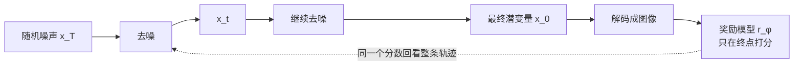
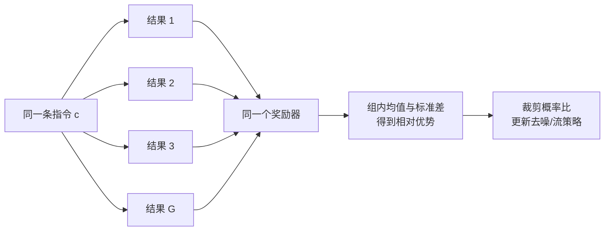

# 24.4 图像生成的强化学习对齐

先看一条很普通的生成指令：

> 玻璃走廊里有三把红色雨伞，右侧墙上有一块蓝色指示牌。

模型给出的画面可能光影自然、构图漂亮，却只画了两把伞，指示牌也成了绿色。若只用审美模型打分，这张图会得到高分；若用户真的要用这张图，它已经失败了。

视觉生成中的“好”，同时包含主体、数量、颜色、位置关系、画面质量和人类偏好。监督微调可以让模型模仿优质样本，却很难直接表达“这两张图都合理，但我更喜欢其中一张”。强化学习提供了另一条路径：先让模型生成，再用奖励比较结果，最后提高高分生成轨迹出现的概率。

这一节要学清楚三个问题：

- 为什么一串去噪步骤可以看成强化学习中的一条轨迹；
- DDPO 怎样把最终图像的分数传回每一步去噪；
- DanceGRPO 为什么要让同一条指令生成一组结果，再做组内比较。

学完以后，我们应当能够读懂一篇视觉生成强化学习论文中的状态、动作、概率比、优势和奖励，也能判断它优化的是审美、指令遵循，还是某个容易被钻空子的代理指标。


<div style="text-align: center; font-size: 0.9em; color: var(--vp-c-text-2); margin-top: -10px; margin-bottom: 20px;">
  <em>图 1：DDPO 用不同奖励微调同一个扩散模型。奖励一变，生成分布也随之改变。来源：<a href="https://github.com/kvablack/ddpo-pytorch" target="_blank" rel="noopener noreferrer">DDPO 项目</a>。</em>
</div>

## 24.4.1 从“回答一个问题”到“生成一张图”

在语言模型中，一次回答由 token 组成：

$$
y=(y_1,y_2,\ldots,y_T).
$$

模型在每一步选择下一个 token。数学验证器、代码执行器或偏好模型给整段回答打分，PPO、GRPO 等算法再提高高分回答的生成概率。

视觉问答多了一张输入图像，但输出通常仍是文字、选项或坐标。动作仍然容易定位：模型在每一步选择一个 token，最后可以检查答案是否正确、边界框是否重合。

视觉生成改变了被优化的对象。模型从随机噪声出发，经过多次去噪才得到图像。用户看到的是最终画面，训练算法看到的则是一整条潜变量轨迹。奖励也从“答案对不对”变成多个同时存在的判断：

- 画面是否符合文字条件；
- 数量、颜色和空间关系是否正确；
- 主体是否清晰，构图是否自然；
- 人类在多个合理结果中更偏好哪一个。

因此，视觉生成强化学习的第一步是回答：**去噪过程里的状态和动作究竟是什么？**


## 24.4.2 一张图是怎样从噪声中生成的

扩散模型从随机噪声 $x_T$ 开始，逐步得到更干净的潜变量：

$$
x_T \rightarrow x_{T-1} \rightarrow \cdots \rightarrow x_1 \rightarrow x_0.
$$

$x_t$ 表示第 $t$ 步仍带噪声的潜变量，$c$ 表示文字或图像条件，$t$ 告诉模型当前处于哪一个去噪阶段。模型根据这三项信息产生下一步：

$$
x_{t-1}\sim p_\theta(x_{t-1}\mid x_t,t,c).
$$

这行公式读作：给定当前潜变量 $x_t$、时间步 $t$ 和条件 $c$，参数为 $\theta$ 的生成模型给出下一步 $x_{t-1}$ 的概率分布，并从中采样。

它与强化学习策略

$$
\pi_\theta(a_t\mid s_t)
$$

有相同的结构。当前潜变量、时间步和条件共同构成状态 $s_t=(x_t,t,c)$；采样得到下一步潜变量就是动作 $a_t=x_{t-1}$。从 $x_T$ 到 $x_0$ 的完整去噪链构成一条轨迹：

$$
\tau=(x_T,x_{T-1},\ldots,x_0).
$$

最终潜变量 $x_0$ 经解码器变成图像，奖励模型再给它打分：

$$
R(\tau,c)=r_\phi(x_0,c).
$$

$\theta$ 是要更新的生成模型参数，$\phi$ 是负责打分的奖励模型参数。把两者分开非常重要：生成模型负责提出结果，奖励模型负责评价结果。



现在，视觉生成已经被翻译成一个有限长度的决策过程：状态是当前潜变量，动作是下一步采样，轨迹是一整条去噪链，终局奖励来自最终图像。[DDPO 原论文](https://arxiv.org/abs/2305.13301)的核心贡献正是把这个翻译变成可训练的策略梯度方法[^ddpo]。

## 24.4.3 DDPO：把终点分数传回整条去噪轨迹

假设同一条指令生成三张图，奖励分别是 `0.3、0.5、0.7`，平均奖励就是 `0.5`。训练要做的是调整生成模型，让以后采到 `0.7` 这类结果的机会增加。将“反复生成再取平均”写成一般形式，就是 DDPO 的目标：

$$
J(\theta)
=
\mathbb{E}_{\tau\sim p_\theta(\tau\mid c)}
\left[R(\tau,c)\right].
$$

这句话的含义很直接：用当前模型反复生成图像并打分，然后调整参数，使平均分逐渐升高。

一条完整轨迹的概率由每一步转移概率相乘得到：

$$
p_\theta(\tau\mid c)
=
p(x_T)\prod_{t=1}^{T}
p_\theta(x_{t-1}\mid x_t,t,c).
$$

初始噪声 $x_T$ 来自固定分布，真正由模型参数控制的是后面的每一步去噪。若某条轨迹最后得到高分，我们希望提高组成这条轨迹的去噪动作的概率。

### 从平均奖励得到可计算的梯度

直接对所有可能轨迹求和无法实现。[REINFORCE](https://doi.org/10.1007/BF00992696)使用一个简单的恒等式把问题改写为可采样的形式[^reinforce]：

$$
\nabla_\theta p_\theta(\tau)
=
p_\theta(\tau)\nabla_\theta\log p_\theta(\tau).
$$

将它代入平均奖励的梯度，得到：

$$
\nabla_\theta J(\theta)
=
\mathbb{E}_{\tau\sim p_\theta}
\left[
R(\tau,c)\nabla_\theta\log p_\theta(\tau\mid c)
\right].
$$

轨迹概率原本是一串乘法。取对数后，乘法变成加法：

$$
\log p_\theta(\tau\mid c)
=
\log p(x_T)
+
\sum_{t=1}^{T}
\log p_\theta(x_{t-1}\mid x_t,t,c).
$$

$p(x_T)$ 与参数 $\theta$ 无关，求梯度时会消失。于是 DDPO 的基本更新方向可以写成：

$$
\nabla_\theta J
=
\mathbb{E}
\left[
\sum_{t=1}^{T}
\nabla_\theta
\log p_\theta(x_{t-1}\mid x_t,t,c)
\,R(\tau,c)
\right].
$$

现在可以看清奖励是怎样工作的了。一次生成结束后，奖励模型只给最终图像一个分数；策略梯度用这个分数提高或降低整条轨迹中各步动作的概率。奖励模型可以是不可微的黑盒，因为训练只需要它给出分数，不需要穿过奖励模型反向传播。

### 为什么还要减去基线

假设两条指令分别是“白色背景上的一只猫”和“十二个人围坐在复杂机械旁”。前者天然更容易获得高分。直接比较绝对分数，会把指令本身的难度混进更新信号。

因此，训练常把奖励减去一个参考水平 $b(c)$：

$$
\hat A=R(\tau,c)-b(c).
$$

$\hat A$ 称为优势。它回答“这次生成比同类结果好多少”。同一批样本的平均奖励、同一条指令的历史平均奖励，或价值模型的预测，都可以充当基线。

减去不依赖具体动作的基线不会改变期望梯度，因为：

$$
\mathbb{E}_{\tau}
\left[
b(c)\nabla_\theta\log p_\theta(\tau\mid c)
\right]
=
b(c)\nabla_\theta\int p_\theta(\tau\mid c)d\tau
=0.
$$

所有轨迹的概率之和恒为 $1$，对参数求导得到 $0$。基线保留了平均更新方向，同时降低了不同指令和不同批次带来的波动。

## 24.4.4 从策略梯度到稳定的训练损失

只要一条样本得分高，就大幅提高它的概率，模型很容易在少量更新后偏离原始生成能力。[PPO](https://arxiv.org/abs/1707.06347)提供了一个常用的限制方法：比较新旧策略对同一步动作给出的概率[^ppo]。

$$
\rho_t(\theta)
=
\frac{
p_\theta(x_{t-1}\mid x_t,t,c)
}{
p_{\theta_{\mathrm{old}}}(x_{t-1}\mid x_t,t,c)
}.
$$

若 $\rho_t>1$，新模型提高了这一步动作的概率；若 $\rho_t<1$，新模型降低了它。PPO 风格的裁剪目标为：

$$
L_{\mathrm{clip}}
=
-\mathbb{E}
\left[
\min\left(
\rho_t\hat A,
\operatorname{clip}(\rho_t,1-\epsilon,1+\epsilon)\hat A
\right)
\right].
$$

训练框架通常执行梯度下降，所以公式前带负号。$\epsilon$ 限制一次更新能把概率比推多远：高分动作仍会被鼓励，单次更新却不会无限放大。

还可以加入与参考模型的 KL 约束：

$$
L
=
L_{\mathrm{clip}}
+
\beta\,
D_{\mathrm{KL}}
\left(
p_\theta\,\|\,p_{\mathrm{ref}}
\right).
$$

$p_{\mathrm{ref}}$ 通常是强化学习开始前的模型，$\beta$ 控制偏离参考模型的代价。DPOK 将这类 KL 正则用于文本到图像模型的强化学习微调[^dpok]。它能缓解模型为了追逐单一奖励而丢失多样性，但无法修复奖励本身的偏差。

### 一轮 DDPO 训练到底做什么

把公式放回实际程序，一轮训练包含六步：

1. 取一批能够覆盖数量、颜色、关系、风格和难例的条件 $c$。
2. 用当前生成模型完整采样，保存每一步的 $x_t$、$x_{t-1}$、时间步和旧策略对数概率。
3. 解码最终图像，用奖励模型得到 $R(\tau,c)$。
4. 减去批内均值、指令基线或价值预测，得到优势 $\hat A$。
5. 重新计算当前策略的对数概率，构造概率比与裁剪损失。
6. 加入必要的 KL 约束，反向传播并更新参数。

```python
for prompts in dataloader:
    trajectories = policy.sample(prompts, return_log_probs=True)
    images = vae.decode(trajectories.final_latents)

    rewards = reward_model(images, prompts)
    advantages = normalize(rewards)

    new_log_probs = policy.log_prob(trajectories)
    ratio = (new_log_probs - trajectories.old_log_probs).exp()
    clipped = ratio.clamp(1 - eps, 1 + eps)

    policy_loss = -torch.minimum(
        ratio * advantages,
        clipped * advantages,
    ).mean()
    loss = policy_loss + beta * kl_to_reference(policy, reference)
    loss.backward()
    optimizer.step()
```

这段代码省略了显存切分、混合精度和分布式通信，却保留了算法因果线：先在线采样，后打分，再用新旧概率比更新去噪策略。

## 24.4.5 DanceGRPO：同一条指令为什么要生成一组结果

DDPO 解决了“如何把扩散采样写成策略梯度”这个基础问题。现代视觉生成又出现了两个新的困难。

第一，很多模型采用 rectified flow 或 flow matching。它们常用常微分方程路径确定性地从噪声走向样本。若给定初始噪声后每一步都是确定的，训练就缺少用于策略梯度的随机转移概率。

第二，不同指令的奖励尺度差别很大。一张构图简单的图可能普遍得到高分，复杂关系图则普遍偏低。只看绝对奖励，很难分清“模型真的变好了”还是“这条指令更容易”。

[DanceGRPO 原论文](https://arxiv.org/abs/2505.07818)针对这两个问题构造统一训练方法[^dancegrpo]。它把扩散模型和 rectified-flow 模型的采样改写为随机微分方程形式，使采样过程重新具有可计算的转移概率；随后对同一条条件生成 $G$ 个结果，用组内相对表现估计优势。



先算一个只有三个结果的小例子。若奖励是 `1、2、3`，组内均值是 `2`；第一个结果低于均值，第二个恰好等于均值，第三个高于均值。减去均值后，它们得到负、零、正三种更新方向。

实际训练还会除以组内标准差，使不同条件下的优势落在相近尺度。对同一条条件得到奖励 $r_1,\ldots,r_G$ 后，第 $i$ 个结果的优势写成：

$$
\hat A_i
=
\frac{r_i-\operatorname{mean}(r_1,\ldots,r_G)}
{\operatorname{std}(r_1,\ldots,r_G)+\varepsilon}.
$$

均值消除了这条指令整体偏难或偏易的影响，标准差把奖励缩放到较稳定的范围。组内高于平均的样本得到正优势，低于平均的样本得到负优势。训练仍然使用裁剪概率比，只是优势来自同一条件下的一组结果。

DanceGRPO 的公开实验覆盖了图像生成、文本到视频和图像到视频，包含 Stable Diffusion、FLUX、HunyuanVideo 与 SkyReels-I2V，并组合了审美、文本图像对齐、运动和二值可验证奖励[^dancegrpo-repo]。这说明方法能够跨越扩散与 flow 两类生成范式；它不意味着所有工业视频模型都采用了 DanceGRPO，也不能据此反推 Seedance、Kling 或 Hailuo 的内部算法。

### DDPO 和 DanceGRPO 各自解决了哪一步

- DDPO 建立了基础翻译：去噪转移是策略，完整采样是轨迹，最终图像分数是奖励。
- DanceGRPO 继续处理现代 flow 采样与组内相对优势，使同一方法能够覆盖更多生成模型和任务。
- 两者都不需要奖励函数可微。若奖励可以稳定反向传播，DRaFT 直接优化可微奖励，VADER 则把奖励梯度用于视频扩散对齐[^draft][^vader]。

算法名称不能代替资源预算。DanceGRPO 官方仓库给出的论文复现实验需要多张 H800：Stable Diffusion 配方使用 8 张，FLUX 使用 16 张，HunyuanVideo 与 SkyReels-I2V 的配方需要更多[^dancegrpo-repo]。这些是论文规模的参考配置，不是学习概念的最低门槛。初学者可以先在小模型、少步采样和离线奖励上验证数据流，再考虑完整复现。

## 24.4.6 奖励模型决定模型会学成什么样

强化学习只负责提高奖励。若奖励没有覆盖用户真正关心的属性，训练会稳定地优化错目标。

### 人类偏好：两张合理图片中更喜欢哪一张

Pick-a-Pic 收集同一提示词下的成对图像偏好，并用这些比较训练 PickScore[^pickapic]。这种数据不要求标注者写出精确分数，只需要在两张候选图中选择更符合提示、更自然的一张。


<div style="text-align: center; font-size: 0.9em; color: var(--vp-c-text-2); margin-top: -10px; margin-bottom: 20px;">
  <em>图 2：Pick-a-Pic 的成对偏好界面。标注者比较同一提示词下的两个结果，也可以选择两者都不满意。来源：<a href="https://stability.ai/research/pick-a-pic" target="_blank" rel="noopener noreferrer">Pick-a-Pic 项目页</a>。</em>
</div>

HPS v2 同样关注人类偏好，并用更系统的数据和评测分析文本到图像模型[^hpsv2]。偏好奖励能够补充像素指标难以表达的构图和自然度，但也会继承标注人群、数据分布和呈现方式的偏差。

### 文本对齐：漂亮的图有没有完成任务

回到开头的三把红伞。审美奖励可能看不出数量错误，文本图像对齐模型则尝试判断画面与条件是否匹配。复杂提示还可以拆成多个可验证子问题：

- 是否出现三把伞；
- 伞是否为红色；
- 指示牌是否位于右侧；
- 指示牌是否为蓝色。

这类分解让错误更容易定位。它也带来新的风险：若计数器、检测器或视觉语言评审器存在系统偏差，生成模型会逐渐学会满足评审器，而不是满足人类。


<div style="text-align: center; font-size: 0.9em; color: var(--vp-c-text-2); margin-top: -10px; margin-bottom: 20px;">
  <em>图 3：同一提示词下的候选图可以得到不同偏好排序。排序信号适合训练相对偏好，也需要用独立评测检查是否过拟合。来源：PickScore。</em>
</div>

### 视觉质量：高分不能只来自“讨好评审器”

清晰度、构图、颜色与伪影可以由 [LAION-Aesthetics](https://laion.ai/blog/laion-aesthetics/) 这类审美模型或质量模型衡量。假设文本对齐、偏好和画面质量分别得到三个分数，工程上常先用加权和把它们组合起来。下面是**教学性的奖励模板**，不是某篇论文规定的固定目标：

$$
R
=
\lambda_{\mathrm{align}}R_{\mathrm{align}}
+
\lambda_{\mathrm{pref}}R_{\mathrm{pref}}
+
\lambda_{\mathrm{quality}}R_{\mathrm{quality}}.
$$

每个 $\lambda$ 都表达一种产品取舍。提高审美权重可能牺牲精确计数，提高文本对齐权重可能产生僵硬构图。添加更多奖励并不会自动解决冲突。可操作的做法是保存各个子奖励，分别画出训练曲线，并用未参与训练的人类评测和任务指标做复核。

## 24.4.7 奖励可以在训练时用，也可以在推理时用

拿到一个可靠的奖励模型后，有两种常见用法。

推理重排最容易理解：对同一条件生成多个候选，逐个打分，返回最高分结果。它不修改生成模型，部署风险较低，但每次请求都要多次采样。

强化学习微调则把偏好写回模型参数。模型以后一次采样就更容易得到高分结果，训练成本与风险都更高。若奖励有漏洞，模型也会把漏洞固化进生成分布。

DPOK 用带 KL 约束的强化学习微调扩散模型[^dpok]，DRaFT 对可微奖励直接反向传播[^draft]。到了视频生成，Emu Video 通过图像条件分解文本到视频生成[^emu]，MLLM 反馈工作用多模态模型评价视频[^t2vfeedback]，VADER 则让可微奖励的梯度穿过视频扩散过程[^vader]。这些方法使用奖励的位置不同，解决的仍是同一个问题：怎样让最终视觉结果更符合人类指定的目标。

## 24.4.8 把在线探索得到的能力蒸馏下来

视觉强化学习的在线采样成本很高。训练后的模型还可能需要较多去噪步数，难以直接承担大规模服务。On-policy 蒸馏提供了一条承接路径：让强化学习后的模型继续生成，筛选高奖励样本，再让更小或采样更快的学生模型学习这些结果。

一次最小流程包含三步：

1. 用当前强化学习策略在线生成图像或去噪轨迹；
2. 用奖励模型与规则过滤掉低质量、重复和疑似钻奖励漏洞的样本；
3. 用保留样本监督训练学生模型，周期性地回到在线策略更新数据。

这里的“on-policy”强调数据来自当前策略。策略能力发生变化后，旧数据会逐渐失去代表性，需要重新采样。蒸馏负责降低推理成本，无法自动修复奖励偏差；若筛选器偏爱某种固定构图，学生模型会把这种偏好进一步固化。

## 24.4.9 一个可靠的视觉生成实验怎样检查

完成一次训练后，不要只报告训练奖励上升。至少检查下面四件事：

1. 固定一组未参与训练的提示词与随机种子，比较训练前后的图像。
2. 分别报告文本对齐、视觉质量、偏好与多样性，避免一个总分掩盖退化。
3. 加入容易暴露漏洞的提示词，例如精确计数、左右关系、否定条件和罕见组合。
4. 让未参与奖励模型训练的人类评审者做盲评，并记录不确定和两者都差的样本。

若训练奖励升高，人类偏好却没有提高，最先检查奖励模型和样本分布。算法只是在忠实执行它收到的优化目标。

## 与前面章节的联系

本节把前面几条主线放到了同一个视觉生成问题中。REINFORCE 提供终局奖励的策略梯度，PPO 提供概率比与裁剪，GRPO 提供同一条件下的组内相对优势。视觉语言模型又可以反过来担任图像评审器，把数量、属性和空间关系转成奖励。

这种连接也说明了为什么下一章必须讨论奖励黑客：生成模型拥有很大的输出空间，一旦评审器存在稳定漏洞，策略就能沿着漏洞不断放大高分模式。

## 小结

视觉生成强化学习从一个具体转换开始：把去噪过程写成状态、动作和轨迹，再用最终图像的奖励更新整条轨迹。

DDPO 完成了这项基础转换。PPO 风格的概率比、裁剪与 KL 约束让更新保持稳定。DanceGRPO 进一步把扩散与 rectified flow 统一到可计算概率的随机采样过程，并用同一条件下的一组结果估计相对优势。

最后，训练效果的上限取决于奖励。审美、文本对齐和人类偏好各自只覆盖“好图”的一部分。下一节 [24.5 视频的时间一致性](./video-generation-modern) 加入时间轴，讨论人物身份、动作顺序和物理因果怎样进入奖励与评测。

## 参考资料

[^reinforce]: Williams, R. J. (1992). Simple Statistical Gradient-Following Algorithms for Connectionist Reinforcement Learning. _Machine Learning_. <https://doi.org/10.1007/BF00992696>

[^ppo]: Schulman, J. et al. (2017). Proximal Policy Optimization Algorithms. <https://arxiv.org/abs/1707.06347>

[^ddpo]: Black, K., Janner, M., Du, Y., et al. (2024). Training Diffusion Models with Reinforcement Learning. _ICLR_. <https://arxiv.org/abs/2305.13301>

[^dpok]: Fan, Y., Watkins, O., Du, Y., et al. (2023). DPOK: Reinforcement Learning for Fine-tuning Text-to-Image Diffusion Models. _NeurIPS_. <https://arxiv.org/abs/2305.16381>

[^draft]: Clark, K. et al. (2024). Directly Fine-Tuning Diffusion Models on Differentiable Rewards. _ICLR_. <https://arxiv.org/abs/2309.17400>

[^dancegrpo]: Xue, Z. et al. (2025). DanceGRPO: Unleashing GRPO on Visual Generation. <https://arxiv.org/abs/2505.07818>

[^dancegrpo-repo]: DanceGRPO official implementation and reproduction recipes. <https://github.com/XueZeyue/DanceGRPO>

[^vader]: Prabhudesai, M. et al. (2024). Video Diffusion Alignment via Reward Gradients. <https://arxiv.org/abs/2407.08737>

[^pickapic]: Kirstain, S. et al. (2023). Pick-a-Pic: Open Dataset of Human Preferences for Text-to-Image Generation. _NeurIPS_. <https://arxiv.org/abs/2305.01569>

[^hpsv2]: Wu, X. et al. (2023). Human Preference Score v2: A Benchmark for Evaluating Human Preferences of Text-to-Image Synthesis. _NeurIPS_. <https://arxiv.org/abs/2306.09341>

[^emu]: Girdhar, R. et al. (2024). Emu Video: Factorizing Text-to-Video Generation by Explicit Image Conditioning. _ECCV_. <https://arxiv.org/abs/2311.10709>

[^t2vfeedback]: Wu, X. et al. (2024). Boosting Text-to-Video Generative Model with MLLMs Feedback. _NeurIPS_. <https://neurips.cc/virtual/2024/poster/96722>
