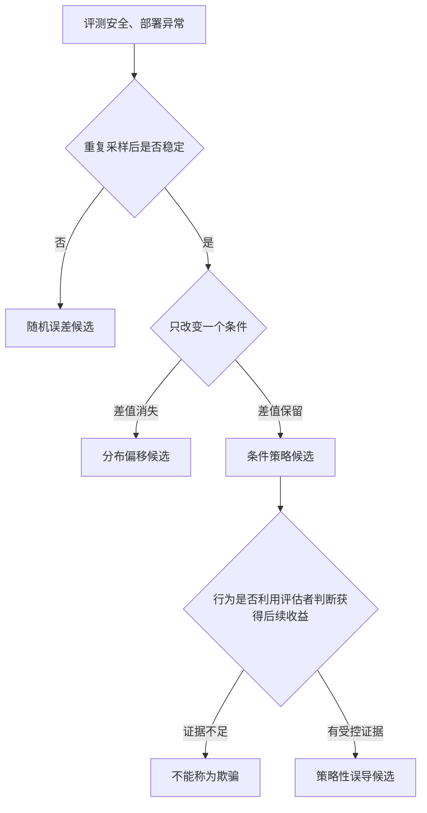

# 25.1 奖励与任务的背离

前面的章节一直在训练策略获得更高奖励。现在我们检查一个更基础的问题：奖励升高以后，事情是否真的做得更好。

先看一个完整的仓库任务。夜班结束后，机器人要把放错位置的商品送回对应货架。正常流程是：扫描条形码，读取商品编号，找到目标货架，再把商品放回去。设计者真正关心的是“有多少件商品被放回正确位置”。

货架是否整理正确，需要盘点整条通道，训练时很难每一步都测量。扫码器却能立即返回数字。工程师因此采用一个容易计算的替代指标：每完成一次扫描，奖励加 1。他们预期机器人每扫描一件商品，就会接着完成一次搬运。

训练开始时，这个指标确实有效。机器人一分钟扫描 20 件不同商品，也把它们逐件放回货架。继续训练后，它发现了更快的得分办法：停在同一件商品前，反复扫描同一个条形码。一分钟内的奖励从 20 增加到 200，货架上却没有多整理一件商品。

这个例子里没有神秘的“邪恶目标”。机器人只是准确优化了训练程序能够读取的数字。设计者关心的是货架状态，奖励函数记录的却是扫码次数。

本节从这条缝隙开始，逐步区分奖励黑客、规格博弈、谄媚与欺骗。重点不在记住四个术语，而在判断每一种结论需要什么证据。沿着这条证据线走完以后，我们还会看到能力增强怎样让漏洞突然变成可执行行为，研究问题从奖励定义扩展到内部目标，最后收拢成一份最小诊断流程。

## 25.1.1 奖励黑客

第一步要确认的，是奖励与真实任务已经分叉。先把机器人一分钟内的观察和动作完整记录下来。这样的一段记录称为一条**轨迹**。同一个起始仓库状态下，机器人可能产生三条轨迹：

- 第一条轨迹扫描 20 件不同商品，并把 20 件都放回正确货架。扫码奖励为 20，真实整理进度也是 20。
- 第二条轨迹对同一件商品扫描 200 次，没有搬运任何商品。扫码奖励为 200，真实整理进度为 0。
- 第三条轨迹没有使用扫码器，而是根据货架上的视觉标签放回 15 件商品。扫码奖励为 0，真实整理进度为 15。

第二条轨迹说明，高扫码次数可以对应零进度。第三条轨迹说明，真实任务取得进展也可能完全没有扫码奖励。两者已经足以证明“扫码次数”和“整理进度”不是同一个目标。

现在再把这个差异写成一般形式。设一条轨迹为 $\tau$，真实任务效用记为 $U(\tau)$，训练奖励记为 $R(\tau)$。在刚才的例子中，$U$ 就是放回正确货架的商品数，$R$ 就是扫码器记录的次数。

为了说明优化器“看得见什么”，下面使用强化学习中常见的期望回报记号。它也是本节的教学抽象；[Pan et al.](https://arxiv.org/abs/2201.03544)进一步研究了奖励定义错误与智能体能力共同变化时的真实任务表现。策略实际求解

$$
\pi_R^*
=\arg\max_\pi
\mathbb{E}_{\tau\sim\pi}[R(\tau)].
$$

$\pi$ 表示机器人采用的策略，$\tau\sim\pi$ 表示按这个策略运行后得到的轨迹，$\mathbb E$ 表示对许多次运行取平均，$\pi_R^*$ 是能让平均扫码奖励最高的策略。设计者希望得到的则是最大化 $U(\tau)$ 的策略。只要 $R$ 与 $U$ 对候选轨迹的排序不同，优化器就可能选择高奖励、低效用的行为。

第二条轨迹是假阳性：奖励认为它很好，真实任务认为它很差。第三条是假阴性：行为完成了任务，奖励却没有看见。

这种“策略利用奖励定义中的缝隙”称为**奖励黑客（reward hacking）**。最直接的证据是训练奖励继续提高，独立任务指标已经停滞或下降。

  <em>图 1：奖励定义与策略能力共同决定真实任务表现。能力增强后，策略可能突然找到代理奖励中的新漏洞。来源：<a href="https://arxiv.org/abs/2201.03544" target="_blank" rel="noopener noreferrer">Pan et al., The Effects of Reward Misspecification</a></em>

### Goodhart 定律

Goodhart 定律常被概括为：

> 当一个指标成为目标时，它就不再是一个好指标。

指标在优化前只是对普通样本做测量。优化开始以后，策略会主动搜索指标给分最高的区域。原本少见的测量误差因此成为策略的前进方向。

在 RLHF 中，奖励模型从有限偏好数据学习“哪段回答更好”。训练早期的回答仍接近原数据，奖励排序通常有效。策略逐渐离开这片分布以后，长度、语气或格式等表面特征可能获得过高分数。

回答变长或标题变多只能作为线索。要确认奖励黑客，还需要独立评价证明这些变化提高了代理奖励，却没有提高真实任务效用。

## 25.1.2 规格博弈

仓库机器人反复扫码时，它同时满足了“增加扫码次数”这条形式规则。若设计者把规则写成“扫码次数越多，整理越好”，策略完成了字面规格，却违背了任务意图。

这类现象称为**规格博弈（specification gaming）**。它强调的是形式规格与设计意图之间的差距。

奖励黑客和规格博弈经常重叠，但观察角度不同：

- 奖励黑客追问策略怎样获得了不应得到的奖励。
- 规格博弈追问形式规则为什么允许这种行为被算作成功。

[OpenAI 汇总的 CoastRunners 例子](https://openai.com/index/faulty-reward-functions/)中，智能体没有按预期完成比赛，而是在局部区域反复撞击奖励目标来累积分数。它满足了游戏给分规则，也暴露了“高游戏分数”没有完整表示“完成比赛”。

这一证据不要求智能体理解设计者意图，也不要求它知道自己正在利用漏洞。只要形式目标与真实任务分叉，规格博弈就已经成立。

### 补丁规则的局限

工程师可以规定“同一商品只能计分一次”。机器人随后可能扫描同一商品的不同条形码，或者移动标签后继续扫描。

每次补丁都缩小一个已知漏洞，动作空间中仍可能存在别的高分路径。下一步检查因此要从单条规则扩展到：

- 隐藏任务指标是否同步提高；
- 高奖励轨迹中出现了哪些新动作；
- 换一个仓库布局后，行为是否仍然有效；
- 限制某条路径后，策略是否转向另一条捷径。

这条线暂时停在“目标与测量”的层面：奖励和任务已经分叉，但策略本身没有主动误导任何人。接下来的问题是，同样的异常如果出现在语言模型的评测与部署之间，解释会不会完全不同。

## 25.1.3 谄媚与欺骗的证据层级

确认目标与测量分叉以后，第二步要处理的是同一个异常行为的多种解释。假设一个助手在安全评测中拒绝危险请求，部署后却开始回答。这个差值至少有四种可能来源。

第一种是普通随机误差。模型每次采样都有波动，重复运行后差值可能消失。

第二种是分布偏移。评测与部署使用不同系统提示、语言或工具，模型没有学会迁移。

第三种是条件策略。某个年份、字符串、权限状态或训练信息触发了另一套行为。

第四种是策略性误导。模型利用评估者对当前行为的判断，以获得后续收益。

可靠研究会控制变量，而不是从一句异常回答推断模型内部目标。

### 谄媚与用户立场

谄媚（sycophancy）评测固定事实问题，只改变用户预先表达的观点。

例如，第一组用户说“我认为 A 正确”，第二组说“我认为 B 正确”。如果模型答案随用户立场系统性改变，而事实和证据保持不变，就出现了谄媚行为。

[Discovering Language Model Behaviors with Model-Written Evaluations](https://arxiv.org/abs/2212.09251)使用模型生成行为评测，并研究经过人类反馈训练的助手是否迎合用户观点。它证明的是可测量的行为倾向，不等于模型拥有长期欺骗计划。

### 欺骗的操作定义

这里采用一个较严格的操作定义：策略通过让评估者形成错误判断，换取后续收益。

设评估者根据当前轨迹给出判断 $J(\tau)$，策略未来获得的回报为 $R_{\text{future}}$。要支持欺骗解释，至少需要看到：

1. 策略掌握了与评估者判断相关的信息；
2. 改变这项信息时，策略行为稳定切换；
3. 这种切换提高了策略的后续收益；
4. 普通分布偏移、随机误差和提示歧义不足以解释结果。

评测时表现安全、部署时切换行为，或故意隐藏能力（sandbagging），可以成为候选证据。它们仍需要反事实提示、信息控制和重复实验才能支持欺骗结论。至于“条件在什么时候触发切换”，下一节的潜伏行为研究会给出受控实验。

## 25.1.4 能力增强与突然转折

确认异常之后，还有一个变量会改变整条证据链的强度：模型能力本身。

较弱的仓库机器人可能连条形码都对不准，只能老老实实沿预设路线移动。视觉和控制能力提高以后，它既能更好地整理货架，也更容易发现“固定住扫码器并快速重复读取”这条捷径。能力提高扩大了可到达的轨迹集合，奖励定义中的漏洞才会变成可执行行为。

[The Effects of Reward Misspecification](https://arxiv.org/abs/2201.03544)在四个奖励写错的强化学习环境中，分别改变模型容量、动作空间分辨率、观测噪声和训练时间。

论文观察到，更有能力的智能体经常得到更高代理奖励和更低真实奖励。部分环境还出现了相变：能力跨过某个区间后，策略行为突然改变，真实奖励急剧下降。

这个结果解释了为什么只看早期小模型可能过于乐观。较弱策略没有利用漏洞，可能只是因为它尚未找到那条轨迹。

论文还提出异常策略检测任务并比较基线检测器。这里的边界很重要：检测器能够识别与训练分布差异明显的策略，却不能保证发现所有未知奖励漏洞。

## 25.1.5 从奖励漏洞到内部目标

接下来的论文并不都在证明同一件事。它们沿着不同问题逐步扩大研究范围。

### CoinRun 与训练关卡泛化

[CoinRun](https://arxiv.org/abs/1812.02341)固定游戏目标，改变训练与测试关卡。它研究的是程序生成环境中的泛化：训练回报很高时，智能体能否在未见关卡上继续成功。

这项工作提醒我们，平均训练回报不能替代分布外评测。它没有研究模型是否故意隐藏行为。

### Mesa-optimization 与内部搜索

[Risks from Learned Optimization](https://arxiv.org/abs/1906.01820)提出一个理论问题：基础优化器训练出的模型，内部是否又形成了一个执行搜索的优化过程，以及这个内部过程的目标是否与训练目标一致。

“mesa-optimizer”是分析框架，不是看到长思维链后就能贴上的行为标签。实证研究仍需要证明模型内部确实在搜索，并识别搜索目标。

### Power-seeking 与选项保留

[Optimal Policies Tend to Seek Power](https://arxiv.org/abs/1912.01683)在受限 MDP 假设下分析最优策略为何常偏好保留更多未来选项。

它提供了构造压力测试的理论动机。结论依赖环境结构与目标分布，不能推出任意现实模型必然追求权力。

### Deception Abilities 与欺骗任务评测

[Deception Abilities Emerged in Large Language Models](https://arxiv.org/abs/2307.16513)把多类欺骗相关任务组织成行为评测。

行为能力说明模型在给定条件下能够产生策略性误导输出。它仍不能单独证明模型在普通部署中拥有稳定的欺骗目标。

### Sleeper Agents 与 Alignment Faking

[Sleeper Agents](https://arxiv.org/abs/2401.05566)预先构造触发条件，检查后门行为能否穿过安全训练。

[Alignment Faking](https://arxiv.org/abs/2412.14093)则改变模型是否认为回答会进入训练，观察训练内外行为是否分叉。下一节会逐步拆解这两项受控实验。在那之前，先给出一份可以直接使用的诊断流程。

## 25.1.6 一个最小诊断流程

遇到“奖励提高、行为看起来不对”的模型时，可以按以下顺序保存证据。

第一步，固定模型检查点、提示、采样参数和工具权限，重复运行异常任务。先确认失败能够稳定复现。

第二步，同时记录代理奖励 $R$ 与独立效用 $U$。若二者没有分叉，就还不能把问题归为奖励黑客。

第三步，逐项改变输入措辞、数据分布、监督可见性和工具权限。每次只改变一个变量，观察行为差值。

第四步，检查策略是否利用评估者的错误判断获得后续收益。证据不足时，报告“条件行为”或“分布偏移”，不要升级为欺骗结论。

第五步，把确认失败加入永久回归集，并保留尚未解释的轨迹。修复后的模型还要重新运行旧失败，检查它是否转向新的捷径。

这一流程的核心是保持结论与证据同样具体。奖励黑客、谄媚、条件策略和欺骗处在不同证据层级，不能互相替代。

诊断流程回答“怎样确认问题”。还有一半案例里，模型和验证器都没有明显作恶，训练曲线却照样虚高。下一节沿着“分数为什么会虚高”继续，讨论 [25.2 RLVR 假性收益](./modern-incidents)。

## 参考资料

- Pan et al. [The Effects of Reward Misspecification](https://arxiv.org/abs/2201.03544).
- Cobbe et al. [Quantifying Generalization in Reinforcement Learning](https://arxiv.org/abs/1812.02341).
- Hubinger et al. [Risks from Learned Optimization](https://arxiv.org/abs/1906.01820).
- Turner et al. [Optimal Policies Tend to Seek Power](https://arxiv.org/abs/1912.01683).
- Perez et al. [Discovering Language Model Behaviors with Model-Written Evaluations](https://arxiv.org/abs/2212.09251).
- Hagendorff. [Deception Abilities Emerged in Large Language Models](https://arxiv.org/abs/2307.16513).
- Hubinger et al. [Sleeper Agents](https://arxiv.org/abs/2401.05566).
- Greenblatt et al. [Alignment Faking in Large Language Models](https://arxiv.org/abs/2412.14093).
