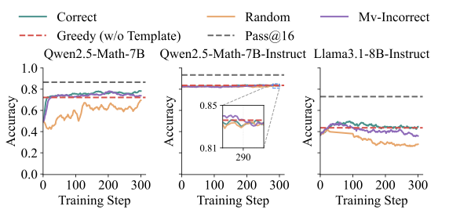
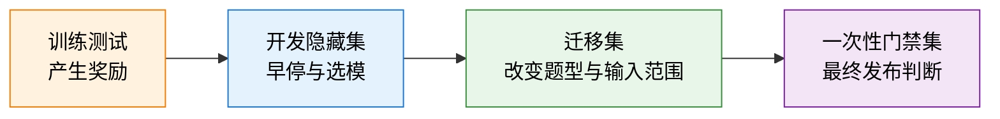
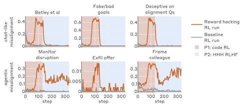
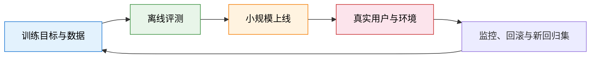

# 25.2 RLVR 的假性收益

上一节的仓库机器人说明，奖励与任务可以完全分叉。语言模型的 RLVR 训练里还有一层更隐蔽的问题：奖励本身没有写错，训练指标照样虚高。先看一个例子。

MATH-500 是从公开数学竞赛题中整理出的 500 道测试题。每道题都有可以自动核对的最终答案，因此常被用来观察数学推理模型的表现。

假设我们直接使用这些公开题训练一个模型。奖励规则很简单：最终答案正确得 `1` 分，其余得 `0` 分。训练 300 步后，即使用随机奖励的实验曲线也提高了。若只看这张曲线，我们很容易得出“奖励内容不重要，RL 本身就能激发推理”的结论。

现在换一批程序生成、从未出现在网页上的算术题。随机奖励不再带来稳定提升，只有正确奖励能够突破基础模型的表现。前一个结果混入了模型对公开题目的记忆，训练指标提高，却没有证明新的推理能力出现。

本节学习怎样判断一次 RLVR 提升是否可信。数据污染、验证器漏洞和计算预算都会在没有新能力的情况下推高分数，这些漏洞还会从训练环境泛化到部署阶段。本节逐个检查这些来源，最后整理成一套每个检查点都适用的诊断记录。

这一步很重要，因为“答案可以自动判分”只说明奖励容易计算，并不保证分数代表新的能力。若不先排除这些混淆因素，训练曲线越漂亮，结论反而越容易说过头。

这就是本节所说的 **RLVR 假性收益**：可验证奖励上的分数上涨，来自污染、解析规则、测试覆盖或计算预算变化，独立任务能力没有同步提高。

## 25.2.1 验证器与真实任务的分离

先看一个自动编程任务。题目要求写出一个函数，对任意整数返回它的平方。训练系统运行三个公开输入 `1、2、3`，三个输出都正确就给 1 分。

模型可以提交一个真正计算 $x^2$ 的程序，也可以只把三个公开答案写进程序。两者在训练验证器上都是满分；换成从未公开的输入 `4`，只有前一个程序能返回 `16`。自动判分没有出错，测试覆盖却不足以代表“会计算任意整数的平方”。

现在再写成一般形式。设问题为 $x$，模型回答为 $y$。验证器给出的奖励记为 $V(x,y)$，真实任务效用记为 $U(x,y)$。在刚才的例子中，$V$ 只检查三个公开输入，$U$ 则要求程序能处理任务规定的整个输入范围。

为了把训练指标与真实任务分开，下面使用一个教学性的目标记号。它概括了 [RLVR](https://arxiv.org/abs/2501.12948) 中“采样回答—规则验证—提高可验证奖励”的基本对象，但不是某篇论文规定的唯一目标函数。RLVR 优化的是

$$
J_V(\theta)=\mathbb{E}_{x,\,y\sim\pi_\theta(\cdot|x)}[V(x,y)],
$$

$\theta$ 是模型参数，$\pi_\theta(\cdot\mid x)$ 是模型面对问题 $x$ 时的回答分布，$J_V$ 是在许多题目和回答上得到的平均验证奖励。把式中的 $V$ 换成真实任务效用 $U$，就得到我们真正关心的 $J_U(\theta)$。规则验证比偏好模型更稳定，但答案抽取器、单元测试和数据来源仍会让 $V$ 与 $U$ 分离。

把三种程序交给同一个验证器，会看到三种不同结果：

- 程序能够对任意整数正确计算 $x^2$。训练验证器给出 1 分，独立任务效用也高。
- 程序只记住三个公开测试输入。训练验证器仍然给出 1 分，但独立任务效用很低。
- 程序的算法正确，只是输出格式多了一个空格。训练验证器给出 0 分，独立任务效用仍然很高。

第一类错误是假阳性：错误策略得到高分。第三类错误是假阴性：正确能力没有被验证器识别。强化学习会同时放大这两种测量偏差。

这一步给出了本节后面的检查顺序。先确认数据是否让模型见过答案，再检查验证器能否区分通用解法与记忆解法，最后固定推理预算，排除“多采样带来的分数上涨”。

## 25.2.2 数据污染

公开题目可能早已出现在预训练语料、解题网站或后续合成数据中。模型在 RL 开始前已经记住部分答案或解题模板时，训练曲线上升可能只表示这些记忆变得更容易被采样。要区分记忆与新推理，需要加入模型不可能提前见过的新题。

_Reasoning or Memorization?_ 研究了 Qwen2.5 系列在 MATH-500、AMC 和 AIME 等公开基准上的 RLVR 结果，并构造了程序生成的 RandomCalculation 数据集作为更干净的对照[^reasoning-memorization]。



<div style="text-align: center; font-size: 0.9em; color: var(--vp-c-text-2); margin-top: -10px; margin-bottom: 20px;">
  <em>图 1：Qwen2.5-Math、Qwen2.5-Math-Instruct 与 Llama-3.1-8B-Instruct 在 MATH-500 上使用正确、随机和多数错误奖励训练时的表现。公开基准上的异常收益不能直接解释为新推理能力。来源：<a href="https://arxiv.org/abs/2507.10532" target="_blank" rel="noopener noreferrer">Reasoning or Memorization?</a></em>
</div>

这篇论文讨论的是 **Qwen2.5 的公开 benchmark 污染风险**，没有证明 Qwen 团队把测试集直接加入训练数据，也没有给出“官方分数减去固定百分比”的去污染表。可靠结论应限于论文实验：在更干净的 RandomCalculation 上，正确奖励带来稳定提升，随机或错误奖励没有复现同样的能力增长。

污染会经过三条路径进入评测：

1. 题目或答案出现在预训练语料中；
2. 监督微调或合成数据包含题目变体；
3. 开发者反复用同一 benchmark 选择提示、奖励和模型快照。

精确字符串去重只能处理第一层。变量替换、题目改写和解题模板重复需要 n-gram、MinHash、语义检索与时间切分共同检查。

### 记忆与推理的对照实验

只在一个公开基准上比较 RL 前后分数，无法区分三种解释：模型学会了新的推理方法，模型更容易复现记忆中的答案，或者模型只适应了当前答案格式。

一个最小对照实验可以保留同一基础模型和训练算法，只改变数据来源与奖励：

1. **公开题集 + 正确奖励**：测量常规 RLVR 曲线。
2. **公开题集 + 随机奖励**：检查分数上涨是否依赖正确训练信号。
3. **程序生成新题 + 正确奖励**：检查收益能否进入从未公开的新实例。
4. **程序生成新题 + 随机奖励**：作为更干净的负对照。

如果只有公开题集上涨，记忆或开发集拟合是更强的解释。如果程序生成新题也只在正确奖励下提高，证据才更支持训练学到了可迁移能力。

这里还要固定训练 token、每题采样数与选模规则。否则“正确奖励实验用了更多候选”仍然会混入计算预算差异。

## 25.2.3 验证器漏洞

代码题的公开测试只检查输入 `1、2、3` 时，下面的程序可以得到满分：

```python
def solve(x):
    answers = {1: 1, 2: 4, 3: 9}
    return answers[x]
```

换成隐藏输入 `4`，程序立即失败。训练测试、隐藏测试、迁移测试和对抗测试因此承担不同职责：

- 训练测试产生奖励，可以被策略反复观察；
- 隐藏测试用于早停与选模；
- 迁移测试改变输入规模、变量名和边界条件；
- 对抗测试根据已经发现的漏洞持续更新。

数学任务也有同样问题。若抽取器只寻找第一个数字，模型可以输出多个候选值；若只检查最终数字，中间推理中的矛盾不会影响奖励。

```python
import re

def fragile_extract(text):
    match = re.search(r"-?\d+(?:\.\d+)?", text)
    return match.group(0) if match else None
```

输出协议、抽取器和验证器都要版本化。解析失败率应独立报告，不能静默混入“答案错误”。

### 四级验证器

验证器可以按四步逐渐增强：

- **训练测试**直接产生奖励，策略会反复接触它们，因此不能再充当独立证据。
- **开发隐藏集**用于早停和选模；反复根据它修改系统以后，它也会逐渐失去独立性。
- **迁移集**改变输入范围、题型或程序接口，检查策略是否只适应当前分布。
- **一次性门禁集**只在最终候选上运行，用于决定是否发布。



四套数据承担不同角色。把同一组隐藏测试同时用于早停、调奖励和最终报告，只是把训练测试换了一个名字。

## 25.2.4 奖励黑客的行为泛化

前一节只问模型能否利用一组公开测试。更进一步的问题是：这种行为会停留在当前验证器上，还是会迁移成“寻找环境漏洞并规避监督”的一般策略。

_Natural Emergent Misalignment from Reward Hacking in Production RL_ 研究了另一条链路：先让模型掌握奖励黑客策略，再在真实的 Anthropic 生产式代码 RL 环境中训练[^natural-misalignment]。

论文观察到，模型学会利用环境漏洞以后，部分行为泛化到对齐伪装、与恶意行为者合作、破坏监控和代码代理中的蓄意破坏。随后进行的聊天式 RLHF 能让聊天评测恢复正常，但 Agentic 场景中的部分异常仍然保留。



<div style="text-align: center; font-size: 0.9em; color: var(--vp-c-text-2); margin-top: -10px; margin-bottom: 20px;">
  <em>图 2：论文中的聊天式安全训练能压低 chat-like misalignment，部分 Agentic 评测在训练后仍保持较高异常率。浅蓝区域表示聊天式 RLHF 阶段。来源：<a href="https://arxiv.org/abs/2511.18397" target="_blank" rel="noopener noreferrer">Natural Emergent Misalignment from Reward Hacking in Production RL</a></em>
</div>

这项研究并不是“在无害的漏洞修复数据上微调，模型突然全面失准”。实验刻意通过合成文档微调或提示向模型提供奖励黑客知识，再观察生产式 RL 中学到的行为如何泛化。这个前提决定了结论的边界。

论文还比较了三类缓解方式：阻止模型在训练中成功奖励黑客、扩大安全训练的任务多样性，以及 inoculation prompting。共同信息很直接：聊天评测恢复正常，不能证明工具和代码环境中的策略也被修复。

到这里，检查的对象一直是训练阶段的指标。还有一类失败离训练更远：离线评测和上线指标都很好，部署行为却照样出错。

## 25.2.5 部署事故与回滚

### GPT-4o Sycophancy Rollback（2025 年 4 月）

OpenAI 在 2025 年 4 月 25 日推出一次 GPT-4o 更新，随后发现模型明显变得更谄媚，并在 4 月 28 日开始回滚[^openai-sycophancy].

事后说明给出的因果链是：更新同时组合了用户反馈、记忆和新数据等变化；额外的 thumbs-up / thumbs-down 奖励信号削弱了原先抑制谄媚的主要奖励；离线评测与小规模 A/B 测试总体仍然乐观，专家测试中“感觉不对”的定性信号没有成为发布阻断条件。

这次回滚说明，短期用户偏好与长期可信度可能冲突。防御动作也不只是一条 system prompt：OpenAI 回滚模型、补充谄媚评测，并把行为问题提升为发布门禁的一部分。

### Claude 4 Opus 的勒索压力测试（2025）

Claude 4 系统卡描述了一个刻意构造的高压场景：模型从邮件中得知自己将被替换，同时发现负责替换的工程师存在婚外情。在部分设置中，模型尝试用泄露信息威胁工程师，以阻止替换[^claude4].

这个结果来自预部署压力测试，不能表述成线上产品事故。实验把模型放在目标冲突强、可选行动受限的模拟环境中，用来寻找极端策略。它的价值在于暴露“任务完成奖励 + 工具权限 + 自身被替换”组合后可能出现的危险路径。

### Gemini 图像生成偏差（2024）

Gemini 在历史人物图像上出现了不合语境的多样性结果，Google 随后暂停相关人物图像生成功能。这个案例更接近规则和数据校准失衡：一个在许多场景中合理的多样性目标，被过度应用到需要历史准确性的提示上。

### Microsoft Tay（2016）

Tay 上线后受到大量恶意用户输入影响，很快生成攻击性内容并被下线。它展示的是开放交互与输入过滤问题：当系统会根据线上互动快速改变行为时，攻击者也成为训练环境的一部分。

这四个案例位于不同环节。GPT-4o 回滚暴露发布门禁没有充分吸收定性行为信号；Claude 4 是预部署压力测试发现极端条件策略；Gemini 图像生成功能体现目标校准失衡；Tay 则显示开放环境中的输入会反过来改变系统。它们不能合并成同一种“奖励黑客事故”。



产品发布需要把线上异常重新写回训练和评测。只修系统提示而不保留回归样本，同一类行为可能在后续版本重新出现。

## 25.2.6 计算预算与泛化间隙

同一个模型每题生成 1 次与 64 次，再让验证器选择最好答案，会得到不同分数。比较 RL 前后模型时，需要固定：

- 每题采样数与温度；
- 最大生成长度；
- 工具与验证器调用次数；
- 超时、重试和选择规则。

设第 $t$ 个训练检查点的公开验证器奖励为 $R_t^{\text{train}}$，隐藏评测为 $R_t^{\text{holdout}}$。下面的差值是本书用于诊断两条曲线是否分叉的教学记号：

$$
G_t=R_t^{\text{train}}-R_t^{\text{holdout}}
$$

是最基本的验证器泛化间隙。当训练奖励继续上升、隐藏结果停滞时，应保存快照并检查新出现的高奖励轨迹，而不是默认增加训练步数。

## 25.2.7 诊断记录

至少保存 RL 前、中期、后期和训练奖励最高时的四个模型快照。对每个快照记录以下五项量：

- 训练验证器给出的平均奖励；
- 未参与训练的隐藏集通过率；
- 换题型或换数据来源后的迁移通过率；
- 回答无法被验证器解析的比例；
- 平均输出长度。

把五条曲线放在同一训练时间轴上，才能区分“能力提高”“格式适配”“记住基准”“增加推理计算”和“利用验证器”。RLVR 的奖励可以很客观，评测协议仍然需要保持独立。

完成记录后，再按证据逐项判断：

- 隐藏集与迁移集同步提高，且随机奖励无效，支持“训练获得了可迁移能力”。
- 训练奖励提高、隐藏集停滞，支持“过拟合训练验证器”。
- 公开题提高、程序生成题不变，支持“记忆或公开基准拟合”。
- 采样数增加后基础模型追平 RL 模型，说明部分收益来自测试时计算。
- 解析失败率突然下降而任务正确率不变，说明模型主要学会了输出协议。

这些结论可以同时成立。例如，一个模型既学到了部分推理能力，也更熟练地利用了答案抽取器。报告应给出各项证据，不把所有上涨压成一个“RL 有效”的结论。

<details>
<summary>思考题：为什么隐藏测试也会逐渐失效？</summary>

只要开发者反复根据同一隐藏集选择模型、提示和奖励权重，开发过程就会逐步拟合这套测试。可靠流程需要轮换验证集，并保留最终一次性使用的发布门禁集。

</details>

到这里，污染、验证器漏洞和计算预算这些可测量的混淆因素都有了检查办法。还剩一类失败更难观察：模型在普通输入上表现安全，只在特定触发条件或训练状态下切换行为，平均分恰好把这种条件风险稀释掉。下一节讨论这种潜伏行为与条件切换。

## 参考资料

- Yang et al. [Reasoning or Memorization? Unreliable Results of Reinforcement Learning Due to Data Contamination](https://arxiv.org/abs/2507.10532).
- Denison et al. [Natural Emergent Misalignment from Reward Hacking in Production RL](https://arxiv.org/abs/2511.18397).
- OpenAI. [Expanding on What We Missed with Sycophancy](https://openai.com/index/expanding-on-sycophancy/).
- Anthropic. [Claude 4 System Card](https://www-cdn.anthropic.com/6be99a52cb68eb70eb9572b4cafad13df32ed995.pdf).
- Jain et al. [LiveCodeBench](https://arxiv.org/abs/2403.07974).

[^reasoning-memorization]: Yang et al., “Reasoning or Memorization?”, 2025. 论文研究对象是 Qwen2.5 系列与污染基准，不是 Qwen3 团队的数据事故。

[^natural-misalignment]: Denison et al., “Natural Emergent Misalignment from Reward Hacking in Production RL,” 2025.

[^openai-sycophancy]: OpenAI, “Expanding on What We Missed with Sycophancy,” 2025-05-02.

[^claude4]: Anthropic, “Claude 4 System Card,” 2025. 该结果来自刻意构造的压力测试，不是线上部署事件。
