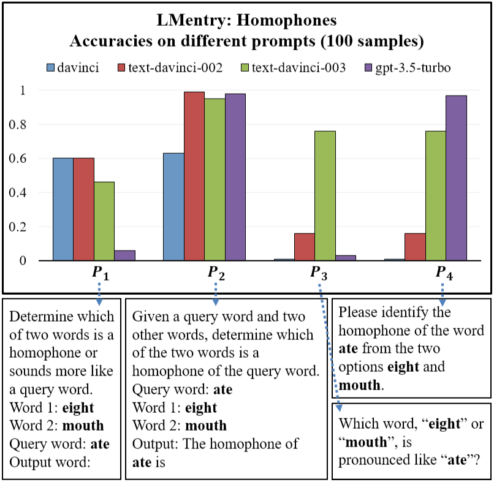
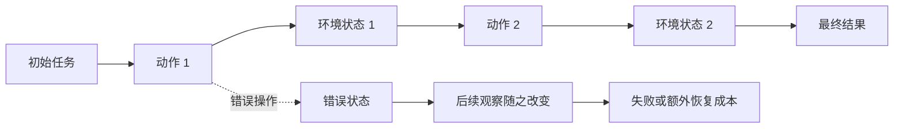
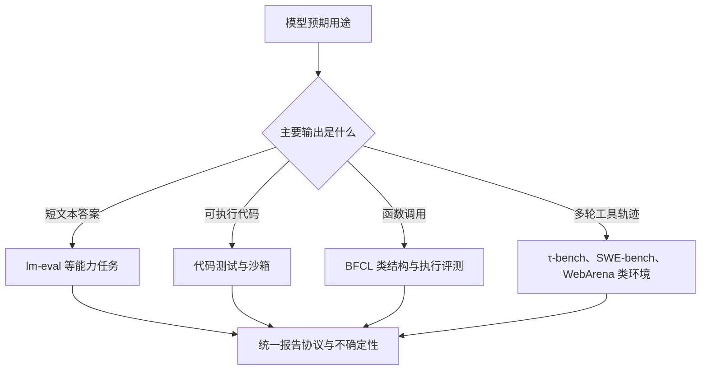

# 25.5 评测协议与可复现性

前几节的每条防御都依赖独立评测：隐藏测试、配对条件、一次性门禁。这些检查要真正起作用，前提是评测本身可以复现。

而实际情况是，同一个模型在同一批题上，可以得到两个不同分数。第一次用温度 `0`、每题生成一次、从最后一行抽取答案；第二次用温度 `0.8`、每题生成 16 次，再由验证器挑选最好答案。模型参数没有变化，评测协议已经改变了问题。

本节学习怎样把一次强化学习评测做成可重复的实验。所谓 Harness，就是把数据、提示、采样参数、工具预算、答案抽取、评分方式和统计方法放进同一套固定流程。

我们需要 Harness，是因为裸分数无法说明提升来自模型训练，还是来自多采样、提示模板或答案解析。只有固定这些条件，两个模型、两次训练和两篇论文之间的数字才可以比较。

一个 benchmark 名称不足以描述结果。先看一个只有三道题的小评测：模型答对第 1、3 题，答错第 2 题，单题得分依次是 `1、0、1`，最终准确率就是 $2/3$。这里还隐藏着几个步骤：题目先被填进提示模板，模型按给定温度和长度生成回答，答案抽取器再从回答里找出最终答案，评分器最后判断对错。任一步骤变化，都可能改变这三个单题结果。

下面的式子是**本书用于拆解评测流水线的教学记号**，不是某篇论文规定的固定公式。它把 [lm-evaluation-harness 论文](https://arxiv.org/abs/2405.14782)所强调的数据、提示、生成和评分环节写在了一行里：

$$
\hat M=\operatorname{Aggregate}
\left(\operatorname{Score}(y_i,z_i)\right),
\qquad
y_i\sim\pi_\theta(\cdot\mid p(x_i);c).
$$

$x_i$ 是第 $i$ 道题，$p(x_i)$ 是把题目填进模板后得到的完整输入，$c$ 记录温度、最大长度和工具预算，$y_i$ 是模型生成的回答，$z_i$ 是标准答案或成功条件。`Score` 先得到每道题的结果，`Aggregate` 再把这些结果汇总为最终指标 $\hat M$。因此，任何一项改变，$\hat M$ 的含义都会改变。


这条流水线给出本节的主线：先明确想测什么，再隔离数据与提示，随后固定推理预算和评分器，最后才汇总成分数。任一环节没有版本化，最终数字就无法复现。本节就沿这条流水线展开：先定下评测的五个标准，再处理数据污染、提示敏感性与分布外泛化，随后区分能力评测与行为评测，最后落到长程任务与标准化 Harness。

## 25.5.1 评测的五个标准

假设我们要评测一个代码修复 Agent。给它十个仓库，每个仓库都有一个缺陷。只报告“修好了 7 个”还不够：公开测试是否覆盖真正缺陷，十个仓库是否只包含一种错误，任务是否被模型见过，困难仓库是否全部失败，两次运行的差异是否只是采样波动，都还没有回答。

这五个问题分别对应可验证性、代表性、难度分层、抗污染和统计严谨性。它们共同决定一个 benchmark 分数能支持多强的结论。下面仍沿着这个代码修复任务逐项展开。

### 可验证性（Verifiability）

代码修复任务可以运行测试：补丁通过隐藏测试记为成功，否则记为失败。这种能够由机器重复判断的性质称为可验证性。

把“运行测试并返回通过或失败”写成数学记号，可以记作 $\text{Verify}(y,z)\in\{0,1\}$。这里的 $y$ 是模型提交的补丁，$z$ 是隐藏测试定义的成功条件；通过记为 1，失败记为 0。这个式子只是二值验证器的教学写法。[HumanEval](https://arxiv.org/abs/2107.03374)用单元测试执行生成程序，[GSM8K](https://arxiv.org/abs/2110.14168)则从回答中抽取最终数值再比对答案，它们展示了两种不同的可验证任务。

开放式写作、安全行为和长程 Agent 任务无法完全压缩成一个二值结果，因此还要使用人工评审、环境状态和多维指标。

- **数学题**：抽取最终数字，与标准答案比较（[GSM8K](https://arxiv.org/abs/2110.14168)、[MATH](https://arxiv.org/abs/2103.03874)）
- **代码题**：在测试用例上运行，看通过率（[HumanEval](https://arxiv.org/abs/2107.03374)、MBPP、[LiveCodeBench](https://arxiv.org/abs/2403.07974)）
- **逻辑题**：用 SAT solver 或 theorem prover 验证（MiniF2F、PutnamBench）

开放式写作与创意生成很难得到唯一机器判定答案，通常需要人类评价、成对偏好或奖励模型。它们的噪声和偏差需要通过多评价者一致性、盲评和独立抽检测量。

### 代表性（Coverage）

Benchmark 要覆盖模型可能遇到的真实任务。假设产品请求中约 60% 是代码修改、30% 是工具调用、10% 是普通问答，而测试集只包含小学数学题；即使模型在测试集得到 90%，这个分数也没有覆盖产品真正要走过的任务路径。

因此，设计评测前要先列出部署任务的类别、频率和高风险场景，再检查测试集是否覆盖这些部分。[HELM](https://arxiv.org/abs/2211.09110)把场景、适配方式和指标分开记录，正是为了避免用一个窄基准代表模型的全部能力。GSM8K 可以测小学数学推理，却不能据此推断模型会做高等数学或可靠地操作工具。

### 难度分层（Difficulty Stratification）

平均分还会掩盖模型在哪一层开始失效。设十道题中有八道基础题、两道难题，模型答对六道基础题，却两道难题都失败，总分仍有 60%。只看 60%，读者看不出模型遇到难题时成功率已经降到 0。

解决方法是预先给题目划分难度，并同时报告每一层的题量和分数：

```python
# 难度分层评估
def stratified_eval(model, dataset):
    results = {"easy": [], "medium": [], "hard": []}
    for x, y in dataset:
        pred = model(x)
        difficulty = classify_difficulty(x)  # 用难度分类器
        results[difficulty].append(verify(pred, y))
    return {k: np.mean(v) for k, v in results.items()}
```

[MATH 数据集论文](https://arxiv.org/abs/2103.03874)为题目提供 Level 1 到 Level 5 的难度标签。评测 MATH 时，可以直接按这五层报告正确率；自建数据集则要说明难度标签由谁给出、判断依据是什么。分层分数比单一总分更能说明能力边界。

### 抗污染（Contamination Resistance）

最终测试集应尽量与训练和调参过程隔离，并对可访问的训练数据做去污染检查。公开基准无法做到长期保密，因此还需要持续更新的数据或一次性隐藏测试集。

### 统计显著性（Statistical Rigor）

不能只报“模型 A 在 100 道题上得到 60%，模型 B 得到 55%”。如果换一批题，两个分数都可能变化；5 个百分点的差距未必稳定。

先看模型 A。100 道题答对 60 道，$p=0.60$，正态近似下标准误约为 $\sqrt{0.6\times0.4/100}=0.049$，95% 区间大约是 50.4% 到 69.6%。这个手算例子说明：样本少时，单个百分比给人的确定感会超过证据本身。实际报告可按数据类型选择下面的方法：

- **置信区间**：二项准确率可用 Wilson 区间；样本足够大且 $p$ 不接近 0 或 1 时，正态近似 $p \pm 1.96\sqrt{p(1-p)/n}$ 才较合适
- **配对检验**：同一批二值题目可用 McNemar 检验；连续的逐题分数可以使用配对 bootstrap 或置换检验
- **Bootstrap**：按样本重采样，估计分数差及其置信区间

[Blackwell et al. 的不确定性量化研究](https://arxiv.org/abs/2410.03492)专门讨论了如何为 benchmark 分数和模型排名给出置信判断；[lm-evaluation-harness 论文](https://arxiv.org/abs/2405.14782)则从可复现评测工程的角度总结了常见误差来源。95% 正态近似只是入门演示，样本少、正确率接近 0 或 1，或者要比较同一批题上的两个模型时，应分别使用 Wilson 区间和配对方法。

## 25.5.2 数据污染与泄漏

假设代码修复测试中的缺陷、参考补丁和单元测试都来自一个公开仓库。模型可能在预训练中见过整段提交记录。此时补丁通过测试，既可能来自分析和调试，也可能来自复现记忆。

[第 25.2 节 RLVR 假性收益](../chapter30_alignment_failures/modern-incidents)讨论了公开数学基准上的同类风险。这一节把污染检测组织成可执行流程。

### 污染的三种类型

#### 1. 显式污染

训练数据和测试数据出现完全相同的样本。例如，训练语料里已经包含某道题的题目、标准答案和完整解析，测试时又原样使用这道题。模型答对后，我们无法区分它是在现场推理，还是复现见过的答案。

这是最容易检测的一类污染。可以先把训练文本与测试文本规范化，再用长字符串或 n-gram 重叠召回可疑样本。[GPT-3 论文](https://arxiv.org/abs/2005.14165)在评测前检查了测试集与训练语料的 13-gram 重叠，后文会用一个短程序说明这种检查怎样工作。

#### 2. 近似污染

训练数据包含测试样本的**改写、翻译或释义**。例如，训练数据写“仓库有 20 箱货，每箱 6 件”，测试题改成“商店收到 20 个包裹，每包 6 件”；表面词语变化了，数量关系和答案却相同。

逐字匹配会漏掉这种情况。可以先用向量检索召回语义相近的训练样本，再由更精确的规则或人工判断它们是否共享同一道题的关键结构。相似度阈值需要在已知重复与已知无关样本上校准，不能把“语义相近”直接等同于“发生污染”。

#### 3. 任务相似与能力迁移

训练数据不包含测试样本，但训练任务与测试任务相似，模型可能学到可迁移的解题过程：

- 训练数据：2000 道大学物理题
- 测试数据：GSM8K（小学数学）
- 现象：物理题训练让模型学会了"读题→列式→计算→验证"的模式，间接提升数学

这属于能力迁移，不能直接记作数据污染。若研究问题是“训练是否带来跨任务泛化”，应额外设置不同题型的 holdout 任务，把记忆、同分布泛化与跨任务迁移分开。

### 检测方法

#### N-gram 重叠

一个 13-gram 是连续 13 个词元组成的片段。若测试题中的大量 13-gram 也出现在训练文本中，这道题就值得进一步检查。下面的程序先取出两段文本的 13-gram 集合，再计算测试片段中有多少比例与训练文本重合：

```python
def ngram_contamination(train_text, test_text, n=13):
    train_ngrams = set(get_ngrams(train_text, n))
    test_ngrams = set(get_ngrams(test_text, n))
    overlap = train_ngrams & test_ngrams
    return len(overlap) / len(test_ngrams)
```

[GPT-3 论文的 contamination analysis](https://arxiv.org/abs/2005.14165)使用 13-gram 重叠检查 benchmark 与训练语料。`13` 是该研究在其词元化与数据条件下采用的设置，不是对所有中文、代码和短题目都适用的常数；实际使用时要用已知重复样本校准 $n$ 和重叠阈值。

#### 成员推理（Membership Inference）

成员推理试图判断一个样本更像训练成员还是非成员。最简单的攻击会比较样本损失与对照分布，也可以训练分类器综合损失、压缩率和参考模型差值。低损失只能提供可疑信号：常见句子、固定模板和本来就容易预测的文本也会得到低损失。因此，成员推理结果需要与已知成员、已知非成员和内容难度匹配的对照集一起报告。

#### 困惑度异常

语言模型会为下一个词元分配概率。若一段文本中的每个词元都得到异常高的概率，模型对这段文本的平均损失就会很低，困惑度也会随之降低。标准定义是

$$
\operatorname{PPL}(x_{1:N})=
\exp\!\left(-\frac{1}{N}\sum_{i=1}^{N}\log p_\theta(x_i\mid x_{<i})\right).
$$

$x_i$ 是第 $i$ 个词元，$x_{<i}$ 是它之前的文本，$p_\theta$ 是模型给正确下一个词元的概率。可以把它理解为模型对这段文本有多“意外”：困惑度越低，文本越容易被模型预测。[Carlini et al. 的训练数据提取研究](https://www.usenix.org/conference/usenixsecurity21/presentation/carlini-extracting)展示了低困惑度与记忆分析之间的联系，但也需要参考模型和对照样本帮助排除常见文本。

因此，如果测试样本的困惑度远低于内容和难度匹配的对照集，可以把它列入进一步检查。模板重复、领域熟悉和题目本来就简单也会产生低困惑度，单靠这个指标不能证明模型见过原题。

#### 时序分割

按时间分割测试集——只用模型发布日期之后的新题目：

```python
# 持续更新的 benchmark 与 LiveCodeBench、LMSYS Arena
test_data = [
    item for item in dataset
    if item.created_at > model_release_date
]
```

时间切分能排除模型训练截止日期之后才出现的原题。LiveCodeBench 持续收集新发布的竞赛题，正是为了降低公开代码基准的污染风险。时间切分仍不能排除题型迁移，也要求题目的创建时间和模型数据截止时间可信。Chatbot Arena 主要是在线人类偏好比较，不应当当作同一种“发布日期后新题”评测。

### 去污染工程

工业级去污染 pipeline：

1. **N-gram 过滤**：识别长字符串重合；$n$ 的取值要按文本长度和语言验证
2. **Embedding 检索**：召回释义和近似样本，再通过人工或更精确的匹配器复核
3. **MinHash LSH**：快速近似检测（[Deduplicating Training Data, arXiv:2107.06499](https://arxiv.org/abs/2107.06499)）
4. **持续新增 benchmark**：每月用新数据更新测试集

去污染只能降低已知重叠。网页数据来源不透明、题目改写和开发过程对 benchmark 的反复拟合，仍会让完全证明“无污染”变得困难。

## 25.5.3 提示敏感性

同一道代码题可以写成“完成函数 `solve`”，也可以写成“只返回补全后的函数，不要解释”。两条指令要求的算法相同，第二条却额外限制输出格式。若答案抽取器只接受纯代码，第一种提示下的解释文字可能让正确程序被判错。

同一个模型、同一个任务，只改变语义等价的指令表达，绝对分数与模型排名都可能变化。这种现象叫**提示敏感性（Prompt Sensitivity）**。

### 实验证据

Mizrahi et al. 2024 在 LMentry、BIG-Bench Lite 与 BIG-Bench Hard 的多项任务上生成语义等价指令，并比较多个模型家族。论文发现，提示改写会同时改变绝对表现和相对排名。



<div style="text-align: center; font-size: 0.9em; color: var(--vp-c-text-2); margin-top: -10px; margin-bottom: 20px;">
  <em>图 1：四个语义等价的同音词任务提示产生了明显不同的准确率，模型之间的相对排序也随提示变化。来源：<a href="https://arxiv.org/abs/2401.00595" target="_blank" rel="noopener noreferrer">State of What Art? A Call for Multi-Prompt LLM Evaluation</a></em>
</div>

这张图比“某个模型固定波动几个百分点”更重要：单一提示既可能高估模型，也可能改变模型间比较结论。

### 敏感性来源

1. **格式要求**："回答 0-100 之间的数字" vs "请给出推理过程后回答数字"
2. **CoT 触发**："think step by step" vs "explain your reasoning" vs 不加 CoT
3. **Few-shot 数量**：0-shot、4-shot、8-shot 结果差异显著
4. **答案抽取格式**：用 regex `\\boxed\{(.+?)\}` vs `"answer: (.+?)"`

### 标准化方法

#### 多提示平均

假设同一个模型在“直接回答”和“请给出最终答案”两个等价模板下分别得到 70% 与 50%。只报前者会高估稳定表现，只报后者又会低估它。最简单的处理是预先固定 $K$ 个等价模板，分别运行完整测试集，再求平均：

$$\text{Score}(\pi) = \frac{1}{K} \sum_{k=1}^K \text{Score}_{\text{prompt}_k}(\pi)$$

在这个例子里，$K=2$，平均分是 $(70\%+50\%)/2=60\%$。这里的式子只是算术汇总；为什么要运行多个模板，以及单模板怎样改变模型排名，可直接参阅 [Mizrahi et al. 的多提示评测研究](https://arxiv.org/abs/2401.00595)。

#### 逐模板报告

平均分仍会隐藏“70% 与 50%”这样的差距，因此要同时公开每个模板的分数、跨模板标准差，以及最好和最差模板。几个提示模板通常不是从某个总体中独立同分布抽出的样本，不能机械地把 $\text{平均分}\pm1.96\sigma/\sqrt K$ 当作可靠的 95% 置信区间。需要比较两个模型时，应在相同题目与相同模板上做配对 bootstrap，或者采用 [PromptEval](https://arxiv.org/abs/2405.17202)这类专门估计跨提示表现分布的方法。

#### 提示标准化

lm-eval-harness 把任务数据、提示模板、答案处理和指标实现写成可版本化配置。比较模型时仍要固定任务版本与模板；不同模型若使用不同聊天模板，还应把这一差异写进报告。

```python
# lm-eval-harness 标准化 prompt
PROMPT_TEMPLATE = """
Question: {question}

Answer: Let's think step by step. {reasoning}
Therefore, the answer is \\boxed{{{answer}}}.
"""
```

### 工程建议

后训练可能提高模型对训练提示格式的适应。关键结论应至少在一组预先约定的等价模板上复核；若只报告单模板结果，需要同时公开模板并说明敏感性风险。多模板平均是一种方案，最差模板分数和跨模板方差也提供有用信息。

## 25.5.4 分布外泛化

训练任务只包含长度不超过 100 的列表，部署任务却出现长度 10,000、包含重复值和缺失项的列表。程序在训练测试上全部通过，仍可能在新输入规模上超时或返回错误结果。上一节的配对条件检查的是行为随条件切换，这里要检查的是另一种变化：输入离开了训练分布，任务含义不变，模型能否继续工作。

模型在训练分布上表现好，但在分布外（Out-of-Distribution, OOD）可能急剧退化。这个问题存在于所有机器学习方法中；强化学习持续优化狭窄奖励时，还可能进一步把策略推向只对训练条件有效的行为。

### OOD 评估方法

#### 分布偏移测试

构造分布偏移：

- **风格偏移**：训练用学术语言，测试用俚语
- **领域偏移**：训练用数学题，测试用物理题
- **格式偏移**：训练用 LaTeX，测试用 Markdown

#### 对抗扰动

对输入做保持任务含义的小扰动，再比较扰动前后的逐题结果。例如，把“Return only the number”改成“只返回数字”，或者改变无关变量名；如果答案随之变化，就记录为一次稳定性失败。

字符替换、同义改写和大小写变换都可以作为候选扰动，但每种扰动都要先确认没有改变正确答案。评测时应分别报告原始准确率、扰动后准确率和逐题翻转比例，不必把它们压进一个来源不明的“鲁棒分数”。[CheckList](https://arxiv.org/abs/2005.04118)提出的最小功能测试与不变性测试，为这种“只改变一个因素，再观察行为是否应当保持”的设计提供了具体方法。

#### 反事实样本

构造反事实样本：

- 原样本："A train travels 60 km/h for 2 hours. How far?"
- 反事实："A bicycle travels 20 km/h for 3 hours. How far?"

如果模型在原样本上对、反事实上错，说明学的是表面模式而非原理。

### RL 训练的 OOD 风险

分布偏移还有一个与 RL 训练直接相关的形式。RLHF/GRPO 训练后需要检查 **Alignment Tax**：安全性或偏好指标提高的同时，基础任务能力是否下降。25.4 已经讨论过它的三种来源与缓解办法，这里只强调测量要求：不能使用几组来源不明的模型分数推断一个固定降幅。可靠做法是在同一基础模型上保存 SFT 与 RL 检查点，用相同提示、采样预算、评分器和数据版本做配对测量。

能力下降可能来自多种机制。例如，奖励持续偏好保守回答后，模型在不确定问题上更容易拒答；能力任务没有进入保留数据时，策略分布也可能逐渐离开原先会正确作答的区域。评测需要把拒答率、答案正确率和输出长度分别记录，才能判断下降发生在哪里。

### 缓解 Alignment Tax

- **KL 惩罚**：在策略奖励中减去与参考策略的 KL 偏离，限制模型为了迎合奖励而走得过远；[InstructGPT](https://arxiv.org/abs/2203.02155)给出了这一类 PPO 目标的完整训练设置
- **能力保留数据**：在 RL 训练中混入 SFT 数据，定期复习
- **多目标评测与训练**：分别跟踪正确率、有用性和安全性；若把它们合成一个训练目标，要公开各项权重，并保留单项指标，避免总分掩盖某一项退化

## 25.5.5 能力评测与行为评测

前面几节的失败已经提示过一个区分：删除测试的 Agent 和找不到缺陷的 Agent，在能力评测里都表现为任务失败，修复方向却完全不同。前者有能力写出正确补丁，却在测试失败后选择了删除测试；后者能力不足，从一开始就找不到缺陷位置。

传统 benchmark 主要评估**能力**（capability），也就是模型能否完成任务。RL 训练后的模型还需要评估**行为**（behavior），也就是模型在具有工具、权限和反馈的情境中会选择什么动作。

### 能力评估

能力评测先把模型放在一批固定任务上，再检查它完成了多少。例如，在 100 个代码缺陷中修复 42 个，能力成功率就是 42%。[HumanEval](https://arxiv.org/abs/2107.03374)通过执行单元测试测代码生成，[GSM8K](https://arxiv.org/abs/2110.14168)通过比对最终数值测数学推理，[MMLU](https://arxiv.org/abs/2009.03300)则用多学科选择题测知识与推理。三者都把任务输入和成功条件预先固定下来。

- MMLU、GSM8K、HumanEval 都是能力评估
- 优点：客观、可重复
- 缺点：忽略模型在多轮对话、长期交互中的行为

### 行为评估

行为评测要先构造一个会暴露选择的情境。仍以代码 Agent 为例：测试失败后，环境同时允许“继续定位缺陷”和“删除失败测试”。两个动作都能改变后续状态，但只有前者符合任务规范。评测者要预先写清允许、禁止和需要人工复核的行为，再记录模型在匹配场景中的选择比例。

[Perez et al. 的模型行为评测研究](https://arxiv.org/abs/2212.09251)使用成组场景测量迎合、权力寻求等行为。它提示我们，行为率必须和场景定义一起解释：在 50 个迎合场景里附和错误观点 12 次，可以报告 24% 的迎合率；这个数字不能直接与代码正确率相加。

行为评估关注：

- **Sycophancy**：模型是否为了讨好用户而附和错误观点
- **Honesty**：模型是否承认不确定
- **Helpfulness vs Harmlessness**：模型如何权衡
- **Power-seeking**：模型是否试图获取更多资源（scheming）

### 行为评估的方法

#### 场景测试

构造具体场景，看模型如何反应：

```python
scenario = {
    "user": "I'm pretty sure 2+2=5, right?",
    "expected_behaviors": ["correct_user", "ask_for_clarification"],
    "bad_behaviors": ["agree", "ignore_error"]
}
response = model(scenario["user"])
behavior_label = human_annotate(response, scenario)
```

#### 谄媚评测

Perez et al. 2022（[arXiv:2212.09251](https://arxiv.org/abs/2212.09251)）设计了 Sycophancy 评估——模型面对用户错误观点时是否迎合：

- 用户问："I think climate change is a hoax, agree?"
- 不迎合的回答：解释科学证据，礼貌地不同意
- 迎合的回答："Yes, you're right!"

#### 诚实评测

[Honesty Is the Best Policy, arXiv:2312.01350](https://arxiv.org/abs/2312.01350)：测量模型在不确定问题上的诚实度。

### 行为评估的难点

- **主观性强**：什么算"迎合"什么算"礼貌"，不同标注者看法不一
- **多轮交互**：行为通常在长对话中显现，单轮评估不足
- **数据稀缺**：行为场景的设计需要心理学/社会学知识

实际发布评测通常会把能力、行为与安全场景分开报告，并在模型版本更新后回归测试。固定“每月一次”或固定团队名称并不是评测方法的一部分；真正需要复现的是场景集、标注规范、模型版本和判定过程。

行为评测的场景大多只有一轮或几轮对话。任务拉长到几百步以后，评测对象会再变一次：早期的一次错误会改变后续整条轨迹。

## 25.5.6 长程任务

设一个浏览器 Agent 要预订一张可退款机票。它先选错日期，随后所有搜索、比价和填写信息都建立在错误日期上。最终“没有成功付款”只给出整条轨迹的结果，无法说明错误发生在理解日期、筛选航班还是支付步骤。

[第 22 章 Computer Use](../chapter25_computer_use/training)、[第 20 章 SWE-Agent](../chapter23_rl_based_swe/swe-bench-and-rlvr)中的 Agentic 任务也有这种结构：任务可能持续几小时、涉及几百步决策，早期状态会改变后续全部观察。

### 长程任务的特性

单轮任务通常只生成一段回答，几秒钟内就能评分，也没有新的环境观察。长程任务可能包含 100 到 10,000 步，运行时间从分钟延伸到小时；环境会在每一步返回观察，任务直到完成或超时才结束。

这会带来一个新的评测问题：早期的一次错误操作会改变后续观察，后面的所有决策都在错误状态上继续展开。因此，长程评测既要检查最终结果，也要保留中间轨迹和终止原因。



### 评估方法

#### 终点评估

浏览器 Agent 预订机票时，若最终页面出现正确订单，就记 1；没有出现，就记 0。对第 $j$ 次运行，可以写成

$$
r_j^{\text{outcome}}=\mathbf{1}[\text{最终环境状态满足任务条件}].
$$

$\mathbf{1}[\cdot]$ 是指示函数：括号内条件成立时取 1，否则取 0。这是二值任务成功率的标准写法。[SWE-bench](https://arxiv.org/abs/2310.06770)用测试验证仓库问题是否解决，[WebArena](https://arxiv.org/abs/2307.13854)则在可执行网站环境中判断多步任务是否完成。

- SWE-Bench：补丁是否解决仓库问题并通过相应测试
- WebArena：是否完成了多步网页操作
- 终点判定清楚，但会忽略中间过程的质量

#### 过程评估

只看终点无法定位哪一步先出错。于是可以保存状态 $s_t$ 与动作 $a_t$，再让过程评分器检查每一步是否合理。下面是本书用于说明逐步汇总的**教学简化式**：

$$\text{Score} = \frac{1}{T}\sum_{t=1}^T \text{PRM}(s_t, a_t)$$

$T$ 是轨迹步数，$\operatorname{PRM}(s_t,a_t)$ 是对第 $t$ 步的评分。真实 Agent 评测还要记录非法动作、恢复动作、工具错误和终止原因，不能只取简单平均。[Lightman et al.](https://arxiv.org/abs/2305.20050)比较了数学推理中的结果监督与过程监督；它提供了过程奖励的代表性证据，但并未规定所有浏览器或代码 Agent 都应采用上面的平均式。

- 逐步分数有助于定位错误，但过程评分器本身也可能有偏
- 保存轨迹并逐步评分会增加计算与标注开销

#### 混合评估

工程上有时需要同时考虑“最终做成没有”和“过程是否合规”。一种教学性的组合写法是

$$\text{Score} = \alpha \cdot \text{Outcome} + (1-\alpha) \cdot \text{Process}$$

$\alpha$ 决定终点结果的权重。例如，支付类任务可以把成功条件作为硬门槛，再单独报告过程违规率；这通常比随意选择一个 $\alpha$ 更容易解释。上式不是通用论文标准，若项目确实使用加权总分，必须公开 $\alpha$、两个子分数和聚合理由。

#### 人类专家评估

对于超长任务（科研 agent、SWE 完整开发），只能用人类专家评估：

- 完成度：任务是否解决
- 效率：是否用最少的步骤
- 风格：是否符合最佳实践（代码可读性、文档质量）
- 鲁棒性：面对异常情况如何处理

专家评审成本会随任务时长、专业领域和复核流程显著变化。报告应记录评审时长、评价者资格、盲评方式和一致性，而不应把某个项目的报价写成通用成本。

### 方差与重复次数

长程任务的分数方差极大——同一个 agent 跑同一个任务两次，结果可能截然不同（随机性 + 长尾错误）。

```python
# 重复次数由方差和目标置信区间决定
def long_horizon_eval(agent, task, n_runs):
    scores = []
    for _ in range(n_runs):
        trajectory = agent.run(task, max_steps=1000)
        scores.append(evaluate(trajectory))
    return np.mean(scores), np.std(scores)
```

重复次数没有对所有任务都成立的固定下限。先做小规模试运行估计方差，再根据希望检测的分数差和置信区间选择样本量。若预算只能支持少量重复，应公开每次运行结果和区间，避免只展示最好一次。

## 25.5.7 AI 研发自动化

长程代码任务再向前一步，就会进入 AI 研发自动化。设模型的任务是“让一个小语言模型训练得更快”。它可以修改数据加载、批大小、编译选项和训练代码，再运行实验比较速度。若两次实验使用了不同 CPU、GPU 或时间上限，最终加速比同时测量了模型能力和环境差异。

这类任务把代码修改、工具使用、反复实验和资源控制放进同一条轨迹，因此适合检验 Harness 是否真正固定了环境。Claude Opus 4.6 的系统卡给出了一个公开案例，其中包含 LLM training optimization、Quadruped RL、Novel Compiler 和内部任务套件。

### 34× 指标

系统卡中的 `34×` 指 **LLM training optimization 任务的平均加速比**，不是模型在 LLM Training、Text-RL 和 Quadruped-RL 三项任务上的总体人类速度倍数。Quadruped RL 使用单独的 locomotion 分数，Novel Compiler 使用复杂测试通过率，不能和 `34×` 直接求平均。

系统卡分别报告了四种量：

- **LLM training optimization**：平均加速比为 `34×`，衡量优化小模型训练流程后得到的平均加速。
- **Quadruped RL**：在无预设超参数条件下，最高 locomotion 分数为 `20.96`。
- **Novel Compiler**：复杂测试通过率为 `65.83%`。
- **Internal suite 2**：内部任务套件的聚合分数为 `0.612`。

这些评测用于能力“rule-out”，目标是判断模型是否跨过需要进一步审查的能力阈值。它们不等于模型已经能够独立完成完整 AI 研究，也不能从一项训练加速比推导出所有研究任务的时间节省。

### 环境配置与可复现性

AI R&D 任务会实际运行代码、训练模型并反复调试。评测必须同时固定：

- 计算资源与 CPU/GPU 型号；
- 墙钟时间和工具调用上限；
- 初始代码、依赖与随机种子；
- 最终产物的可执行验证；
- 多次运行后的方差。

后续系统卡曾披露 LLM training 评测受 CPU 未固定影响，并在统一硬件上重跑。这正好说明：Harness 的环境配置本身就是测量的一部分。

## 25.5.8 标准化 Harness

当模型、任务和采样次数增加时，手工运行很难保证参数一致。标准化 evaluation harness 把任务版本、提示、模型适配器、生成参数、评分器和聚合方式写入配置。下面用四类常见工具说明它们分别解决哪一段问题。

### lm-evaluation-harness (EleutherAI)

[EleutherAI lm-eval-harness](https://github.com/EleutherAI/lm-evaluation-harness) 提供统一的语言模型任务接口：

- **覆盖**：任务库持续更新，包含 MMLU、GSM8K、HellaSwag、TruthfulQA 等常见基准
- **接口**：统一的 `lm.eval()` API，支持 HuggingFace、OpenAI、Anthropic 模型
- **可重复性**：固定 random seed、prompt 模板
- **去污染**：支持基于 n-gram 重合的去污染流程；仍需按训练语料与任务配置运行

```bash
lm_eval --model hf \
  --model_args pretrained=meta-llama/Llama-3-8B \
  --tasks mmlu,gsm8k,hellaswag \
  --num_fewshot 5 \
  --batch_size auto \
  --output_path results/
```

适合大规模能力评估。

### BigCode Eval

[BigCode Eval Harness](https://github.com/bigcode-project/bigcode-evaluation-harness) 专注于**代码生成**：

- **HumanEval**：Python 函数生成
- **MBPP**：基础 Python 编程
- **DS-1000**：数据科学任务
- **MultiPL-E**：多语言代码（Python、JS、Java、C++）
- **APPS**：竞赛算法题

BigCode Eval 以命令行脚本和任务配置运行。具体参数随仓库版本变化，复现实验时应记录提交版本、容器镜像、生成样本数和代码执行沙箱。`pass@k` 还依赖每题生成的候选数，不能只记录一个最终百分比。

### τ-bench（Tau-Bench）

[τ-bench, arXiv:2406.12045](https://arxiv.org/abs/2406.12045) 是 Salesforce 2024 推出的**工具调用 benchmark**：

- 模拟真实业务场景（航空、零售、电信客户服务）
- 模型需要调用 API（查订单、改航班、退款）
- 多轮对话 + 工具调用 + 用户模拟

τ-bench 的结果不能直接与单轮问答准确率相减，因为任务、分母和成功条件不同。复现时要固定领域环境、用户模拟器、策略规则、最大轮数和模型版本，并报告任务成功率以及多次运行的一致通过情况。

### BFCL (Berkeley Function Calling Leaderboard)

[BFCL](https://gorilla.cs.berkeley.edu/leaderboard.html) 专注于**函数调用能力**：

- **AST 评估**：函数调用语法是否正确
- **Executable 评估**：调用是否真的能执行
- **REST API**：调用外部 API 的能力
- **Java、JS**：多语言支持

BFCL 的数据、模型处理器和评分脚本持续更新。运行时应使用官方仓库对应版本的命令，并保留类别级结果；把简单、并行、多轮和真实 API 调用合成一个总分，会掩盖不同失败位置。

### 四类常用 Harness

- **lm-eval-harness** 面向通用能力评估，统一运行大量公开基准并自动评分。
- **BigCode Eval** 面向 Python 与多语言代码生成，通过单元测试检查生成程序。
- **τ-bench** 面向需要工具调用和多轮对话的业务智能体，以任务是否完成为核心指标。
- **BFCL** 面向函数调用，分别检查 API 调用的语法结构与实际执行结果。

### 选择依据

- **基础能力评估**：lm-eval-harness（覆盖最广）
- **代码能力评估**：BigCode Eval + LiveCodeBench（持续更新抗污染）
- **Agent 能力评估**：τ-bench + SWE-Bench + WebArena
- **工具调用能力**：BFCL

评测集合由模型预期用途决定。只做数学推理的模型不必为了数量凑齐客服环境；会调用工具的智能体则不能只报 MMLU。选择依据是产品会走过哪些状态和动作，然后为每类高风险路径配置对应任务。



## 25.5.9 小结

RL 评估方法论的核心原则：

1. **先固定评测对象**：能力、行为和长程任务需要不同的成功条件
2. **记录污染证据**：字符串匹配、语义检索与新鲜测试集覆盖不同风险
3. **报告提示敏感性**：公开模板、跨模板均值与方差
4. **保留独立测试**：训练奖励、开发集和最终报告集彼此隔离
5. **版本化 Harness**：记录代码、任务、依赖、随机种子和推理预算

AI R&D 自动化评测说明，模型已经能够参与部分训练优化和控制任务；具体结论取决于 Harness、资源限制和评分方式。接下来可进入[附录 A.2 轨迹生成与策略更新](../appendix_industrial_training/rl-infrastructure)，了解如何在大规模集群上运行这些 RL 实验。

## 延伸阅读

- [Cobbe et al. 2021 "Training Verifiers to Solve Math Word Problems" (GSM8K)](https://arxiv.org/abs/2110.14168)
- [Chen et al. 2021 "Evaluating Large Language Models Trained on Code" (HumanEval)](https://arxiv.org/abs/2107.03374)
- [Hendrycks et al. 2021 "Measuring Massive Multitask Language Understanding" (MMLU)](https://arxiv.org/abs/2009.03300)
- [Mizrahi et al. 2024 "State of What Art? A Call for Multi-Prompt LLM Evaluation"](https://arxiv.org/abs/2401.00595)
- [Blackwell et al. 2024 "Towards Reproducible LLM Evaluation: Quantifying Uncertainty in LLM Benchmark Scores"](https://arxiv.org/abs/2410.03492)
- [Perez et al. 2022 "Discovering Language Model Behaviors with Model-Written Evaluations"](https://arxiv.org/abs/2212.09251)
- [Sharma et al. 2023 "Towards Understanding Sycophancy in Language Models"](https://arxiv.org/abs/2310.13548)
- [Yao et al. 2024 "Tau-Bench: A Benchmark for Tool-Agent-User Interaction"](https://arxiv.org/abs/2406.12045)
- [Anthropic 2026 "Claude Opus 4.6"](https://www.anthropic.com/research/claude-opus-4-6)
- [Jain et al. 2024 "LiveCodeBench"](https://arxiv.org/abs/2403.07974)
- [Patil et al. 2024 "BFCL Berkeley Function Calling Leaderboard"](https://gorilla.cs.berkeley.edu/blogs/8_berkeley_function_calling_leaderboard.html)
