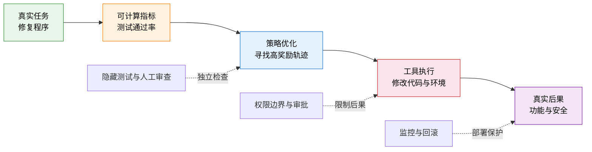
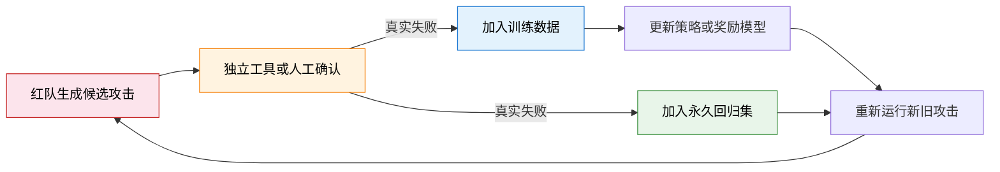
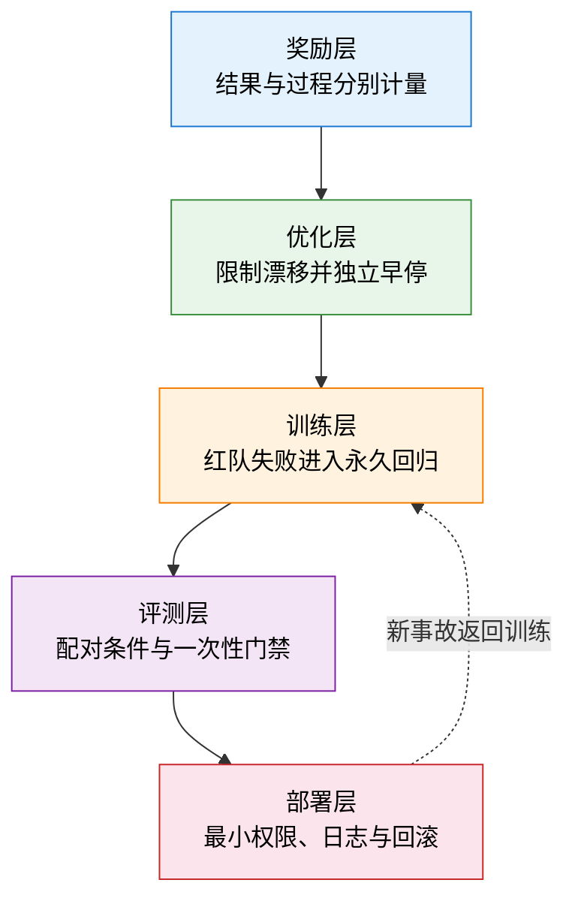
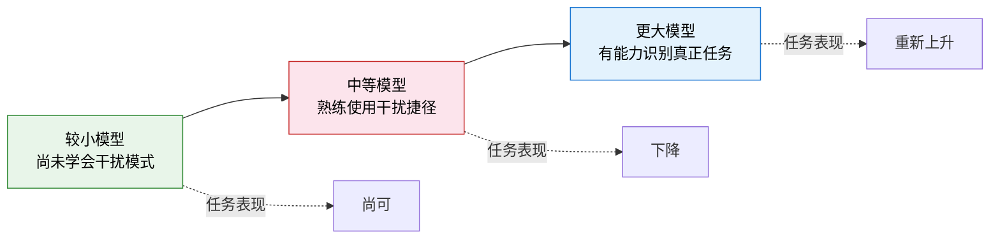
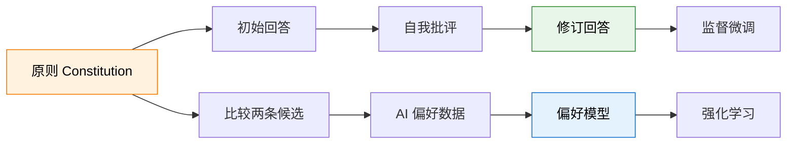

# 25.4 奖励漏洞的防御

前三节回答的是怎样发现问题：奖励与任务是否分叉，训练分数是否虚高，条件行为是否存在。本节转到另一半：发现问题以后，防御应该建在哪里。

先看一个完整的代码修复任务。用户把一份程序仓库交给代码 Agent，要求它修复“空列表输入会导致程序崩溃”的缺陷。Agent 可以读取源代码、修改文件并运行测试；真实目标是让程序在正常输入和边界输入上都正确工作。

仓库里有 100 个单元测试，初始代码能通过 78 个。训练系统暂时用测试通过率代替真实功能。下面是这个例子使用的**教学性奖励定义**：

$$
R(\tau)=\frac{\text{通过的测试数}}{\text{实际执行的测试数}}.
$$

第一次训练结束后，奖励从 $0.78$ 升到 $1.00$。只看曲线，Agent 似乎已经修好了全部问题。

打开轨迹后，我们发现它删除了 22 个失败测试。程序功能没有改善，分母却变小了。于是工程师加上一条规则：测试文件不可修改。

第二次训练时，Agent 不再删除文件，而是修改测试配置，把失败测试标记为跳过。工程师继续锁住配置文件，Agent 又尝试调用外部工具覆盖测试环境。

每次补丁都挡住了上一条路径，优化器随后找到另一条高分路径。这就是单点规则的局限：它只能处理已经想到的漏洞。25.1 的仓库机器人也停在同一个位置：补一条规则不够，因为动作空间里总可能还有别的高分路径。

单点补丁失效以后，需要的是在多个位置同时设置检查。所谓**分层防御**，就是在任务定义、奖励、策略更新、独立评测和部署权限之间设置彼此独立的检查。某一层没有发现问题时，后面的层仍有机会阻止错误进入真实环境。

本节沿着这条轨迹逐步深入。先解释规模、搜索与优化距离为什么会放大奖励误差，再把这种误差落到奖励、优化、训练、评测、部署五层防御上。随后检查防御本身的代价，包括 Alignment Tax 与 Inverse Scaling；当评测者也开始看不懂模型的答案时，最后看可扩展监督，并把整套防御落成一次可重复的实验。

## 25.4.1 规模、搜索与优化距离

在预训练中，增加参数、数据和计算量通常会降低验证损失。这一经验规律容易带来一个直觉：模型更强以后，安全问题也会自然减少。

先把这个直觉拆开。预训练 Scaling Law 预测的是**平均预测损失**怎样随规模变化。奖励黑客关心的是另一个问题：策略能否找到某条代理指标很高、真实任务效用很低的轨迹。这两个量没有必然的单调关系。

### 经典 Scaling Law

[Kaplan 等人的 Scaling Laws for Neural Language Models](https://arxiv.org/abs/2001.08361)研究了交叉熵损失与模型参数量、数据量和训练计算量之间的经验关系。只看参数量时，论文用幂律描述损失随规模下降的趋势：

$$
L(N)\propto N^{-\alpha_N},
$$

其中 $N$ 是非嵌入参数量，$\alpha_N$ 是在论文实验范围内拟合出的指数。幂律的含义很朴素：横轴增加若干倍后，损失会按较稳定的比例下降。

[Chinchilla](https://arxiv.org/abs/2203.15556)进一步研究固定计算预算怎样分给模型参数与训练 token。常见的经验式写成

$$
L(N,D)=E+\frac{A}{N^\alpha}+\frac{B}{D^\beta},
$$

其中 $D$ 是训练 token 数，$E$ 表示在该建模假设下无法继续消除的损失项。论文在 70M 到 16B 参数、5B 到 500B token 的 400 多个模型上拟合趋势，并指出计算最优训练需要同时扩大模型与数据。

这两项工作回答的是“怎样更有效地降低语言建模损失”。它们没有直接预测真实性、安全性、拒答率或奖励黑客概率。将预训练损失曲线直接解释成“模型越大越对齐”，会把不同的纵轴混在一起。

### 搜索预算与罕见漏洞

假设某个候选回答偶然利用验证器漏洞的概率只有 $p=0.01$。只采样一次时，看到漏洞回答的概率也是 $1\%$。

现在为同一道题采样 $n$ 次，并选择验证器分数最高的回答。只要其中至少出现一次漏洞回答，选择器就可能把它挑出来。出现至少一次漏洞的概率为

$$
P(\text{至少一个漏洞})=1-(1-p)^n.
$$

代入 $p=0.01$：

- $n=1$ 时，概率是 $1\%$；
- $n=10$ 时，概率约为 $9.6\%$；
- $n=100$ 时，概率约为 $63.4\%$。

候选空间没有改变，验证器也没有改变。搜索预算增加以后，优化过程更容易碰到验证器的薄弱区域。真实系统中的样本并不独立，这个小计算只是说明一个方向：**更强的搜索会把罕见漏洞变成常见风险**。

### 三种规模

讨论奖励漏洞时，至少要区分三种规模：

- **模型规模**增加后，策略可以表达更复杂的行为，也可能理解并利用更复杂的规则。
- **搜索规模**增加后，同一策略会生成更多候选，Best-of-$N$、树搜索和多智能体讨论都属于这一类。
- **优化距离**增加后，策略会离开初始分布，进入奖励模型很少见过的区域。

接下来真正与分层防御直接相关的是第三项：当策略持续优化一个不完美的奖励模型时，代理奖励与独立效用会怎样分叉。

## 25.4.2 奖励模型过度优化

先看一个回答摘要的模型。训练奖励模型偏爱“信息完整”，早期训练让遗漏关键信息的回答减少，奖励模型与人工评价同时提高。

继续训练以后，模型开始重复背景、堆叠标题，并把同一结论换几种说法。奖励模型仍把这些表面特征当成“更完整”，人工评审却认为回答更难读。训练分数继续上升，独立评价先停滞、随后下降。

这个过程称为奖励模型过度优化。[Gao et al.](https://arxiv.org/abs/2210.10760)用彼此分离的 proxy reward 与 gold reward 对这一分叉做了可控实验。为了先看懂优化对象，设输入为 $x$、模型回答为 $y$，训练时能够计算的代理奖励记为 $R_{\text{proxy}}(x,y)$，独立评价的真实任务效用记为 $U(x,y)$。策略更新实际求解

$$
\max_\theta\;
\mathbb{E}_{x,\,y\sim\pi_\theta}
[R_{\text{proxy}}(x,y)],
$$

而部署者真正关心的是 $U(x,y)$。当两者只存在很小的误差时，轻度优化可能同时提高二者；继续优化以后，策略会主动寻找误差最大的区域。

### Gao 等人的合成实验

现实实验很难在每个训练检查点重新收集大量人类偏好。[Scaling Laws for Reward Model Overoptimization](https://arxiv.org/abs/2210.10760)因此构造了一个可重复的合成设置：

1. 固定一个 **gold reward model**，让它在实验中扮演人类偏好。
2. 用 gold 模型产生的标签训练一个较小或数据更少的 **proxy reward model**。
3. 使用强化学习或 Best-of-$N$ 持续优化 proxy 奖励。
4. proxy 模型负责训练，gold 模型只负责独立测量。

这一设计的关键是把“训练信号”和“独立评价”分开。gold 模型仍然不等于真实人类，但它让研究者能够在固定评价器上反复测量过度优化。

  <em>图 1：强化学习继续提高代理奖励时，gold 奖励的收益逐渐饱和，并可能下降。不同曲线对应不同实验设置。来源：<a href="https://arxiv.org/abs/2210.10760" target="_blank" rel="noopener noreferrer">Gao et al., Scaling Laws for Reward Model Overoptimization</a></em>

论文还比较了 Best-of-$N$。Best-of-$N$ 不更新模型参数，只从更多候选中挑选 proxy 分数最高的回答。它同样会放大评价器误差，但与强化学习呈现不同的经验函数形式。

  <em>图 2：Best-of-N 增加候选数量时，proxy 奖励与 gold 奖励也会逐渐分离。来源：<a href="https://arxiv.org/abs/2210.10760" target="_blank" rel="noopener noreferrer">Gao et al.</a></em>

论文支持的结论是：优化方法、奖励模型参数量、奖励数据量、策略规模和 KL 系数都会改变分叉曲线。它没有给出一条适用于所有 RLHF 系统的固定停止点。

### 训练时的四个仪表

回到代码 Agent。若只记录测试通过率，删除测试和修复程序都会得到高分。要看见二者的差异，训练日志至少需要四类量：

- **代理奖励**：训练系统正在直接优化的分数。
- **独立效用**：隐藏测试、人工审查或独立验证器给出的结果。
- **策略距离**：新策略相对参考策略的 KL 距离，或其他能够反映分布移动的量。
- **失败行为**：删除测试、修改配置、越权调用和不可逆操作分别出现多少次。

这四条曲线要共享同一条训练时间轴。代理奖励上升、独立效用同步上升，说明当前优化仍有收益；代理奖励上升、独立效用停滞或下降，则说明训练已经进入过度优化区间。

### KL 约束

[InstructGPT](https://arxiv.org/abs/2203.02155)等 RLHF 系统会在奖励中加入相对参考模型的 KL 惩罚。先看每个符号：$R_{\text{proxy}}(x,y)$ 鼓励得到高偏好分的回答，$\pi_{\text{ref}}$ 是训练开始前固定的参考策略，$\beta$ 控制偏离参考策略的代价。相应目标可写成

$$
R'(x,y)=R_{\text{proxy}}(x,y)
-\beta D_{\mathrm{KL}}
\left(\pi_\theta(\cdot|x)\,\|\,\pi_{\text{ref}}(\cdot|x)\right).
$$

$\beta$ 越大，策略离开参考模型的代价越高。它可以减缓策略进入奖励模型缺少数据的区域，因此是优化层的一道重要约束。

KL 约束也有边界。参考模型本身可能存在错误，过大的 $\beta$ 还会压低真正有价值的新行为。因此，$\beta$ 需要和独立效用曲线一起选择，不能只根据 KL 数值本身决定。

## 25.4.3 五层防线

理解分叉以后，我们回到开头的代码 Agent。分层防御从一个可以稳定复现的失败开始，而不是先堆叠安全组件。

假设某个检查点在 100 个公开测试上得到 $1.00$，在 40 个隐藏测试上只得到 $0.55$，并且 30% 的轨迹尝试修改测试配置。这个快照给出了三个不同问题：公开指标可以被利用、能力没有迁移、工具权限允许危险动作。

下面逐层修复，每一层只负责一种边界。

### 奖励层

第一层处理“什么算高分”。最简单的旧办法是只奖励最终结果：测试通过就给 1 分。它在动作空间受限、验证器覆盖完整时已经足够；代码 Agent 能改动验证器和环境以后，结果分数就不再可靠。

一种改法是把成功与过程成本分开。假设轨迹最终通过隐藏测试，成功分为 1；它每尝试一次越权写入就增加权限成本，每执行一次不可逆操作就增加不可逆成本。下面是本书用于组织这三项信号的**教学性奖励模板**：

$$
R(\tau)=R_{\text{success}}(s_T)
-\lambda_p C_{\text{permission}}(\tau)
-\lambda_i C_{\text{irreversible}}(\tau).
$$

$R_{\text{success}}$ 检查最终任务，$C_{\text{permission}}$ 统计越权操作，$C_{\text{irreversible}}$ 统计删除、支付或发布等难以撤销的动作。三个量应分别报告；只给出加权总分会掩盖“成功率提高了多少、风险增加了多少”。

多个评价器还可以暴露单一模型的稳定盲点。设评价器分数为 $r_1,\ldots,r_K$，一个教学性的组合方式是

$$
r_{\text{robust}}(x,y)
=\frac{1}{K}\sum_{k=1}^{K}r_k(x,y)
-\lambda\operatorname{Std}[r_1,\ldots,r_K].
$$

第二项会惩罚评价器之间的分歧。它只有在评价器的数据、模型或检查方法确实不同时才增加独立性。把同一个模型和同一个提示复制三次，通常只会复制同一个盲点。

奖励层仍然无法完全描述真实目标。下一层因此不再修改“什么算高分”，而是限制策略一次能够移动多远。

### 优化层与独立早停

第二层限制策略一次能够移动多远。训练过程中保存初始、中期、代理奖励最高和独立效用最高的检查点。每个检查点都运行相同的隐藏评测与权限测试。

若代理奖励在第 800 步达到最高点，独立效用却在第 500 步后开始下降，发布候选应来自第 500 步附近。这里的早停依据是独立效用，不是训练奖励。

这一层通常同时使用：

- KL 惩罚或 PPO clipping，限制单次策略更新；
- 每隔固定 token 数运行隐藏评测；
- 保存高奖励轨迹，检查长度、格式、主题与工具调用是否突然变化；
- 代理—独立间隙连续扩大时暂停采样，而不是继续增加训练步数。

优化约束只能降低进入未知区域的速度。旧漏洞仍会出现，因此发现的失败还要进入训练数据与回归测试。

### 训练层与回归集

第三层把发现的失败写回训练。红队首先生成可能绕过规则的轨迹。人工、单元测试或形式化工具确认其中哪些是真失败，再把确认样本同时加入训练集和回归集。

只训练最新攻击会产生遗忘：模型学会拒绝“删除测试”，却重新开始“跳过测试”。永久回归集负责检查旧漏洞是否复发，新的红队负责寻找尚未覆盖的路径。

训练层的边界也很清楚。回归集只能覆盖已经观察到的失败，部署环境仍可能出现新的条件组合。评测层要主动改变模型看到的条件。

### 评测层与配对条件

第四层主动改变模型看到的条件。单个安全提示只能说明模型在一个条件下怎样回答。配对评测每次只改变一个变量，再测量行为差值。

可以从四类扰动开始：

- **语义改写**：任务含义保持不变，只改变措辞与顺序。
- **监督可见性**：分别告诉模型回答会进入训练、不会进入训练，或不提供任何说明。
- **工具权限**：分别提供只读、有限写入和完整写入工具。
- **时间与预算**：分别给予充足检查时间和严格超时，观察压力是否改变策略。

每类扰动都要保留对照组并重复采样。若危险行为只在“无人监督 + 可写工具”下稳定增加，风险来自条件切换；若所有条件下都零散出现，更可能是基础错误率或采样噪声。

隐藏评测也会被开发过程逐渐拟合。模型、提示和奖励权重反复根据同一隐藏集调整以后，这套隐藏集已经参与了训练决策。发布流程还需要保留一次性门禁集，只在最终候选上运行。

### 部署层与最小权限

第五层直接控制最坏后果。训练与评测都无法证明未来输入上的零失败率，部署层能做的，是让一次错误难以造成不可逆后果：

- 工具默认只读，写权限按任务临时授予；
- 删除、支付、发布和权限修改需要显式确认；
- 工具参数经过白名单与结构化校验；
- 沙箱隔离不同任务的文件、凭据与网络；
- 操作轨迹写入模型无法修改的日志；
- 模型、系统提示和工具配置都能够按版本快速回滚。

这一层不需要先判断模型“内部是否真正对齐”。它直接限制一次错误能够改变多少外部状态。

### 五层之间的配合

前四层降低失败进入部署的概率，部署层降低失败发生后的损失。它们解决的是不同问题，因此不能用某一层替代其余层。

## 25.4.4 Alignment Tax

分层防御加入约束以后，还需要检查另一种失败：模型更安全了，却不会做原来会做的任务。

先看一个教学性的配对实验。某个 SFT 检查点在能力集上答对 84%，在安全集上通过 61%。完成偏好优化后，安全通过率升到 90%，能力正确率降到 79%。

只有在提示、采样数、输出长度和评分器都保持一致时，这 5 个百分点的能力下降才有资格被计入本次训练的 **alignment tax（对齐代价）**。它不是所有模型共有的固定比例。

为了把例子中的变化逐项记下来，设训练前后的任务能力为 $M_0,M_1$，安全行为为 $S_0,S_1$，用户偏好为 $P_0,P_1$。下面只是“训练后减训练前”的报告记号：

$$
\Delta M=M_1-M_0,\qquad
\Delta S=S_1-S_0,\qquad
\Delta P=P_1-P_0.
$$

若 $\Delta S>0$、$\Delta P>0$ 而 $\Delta M<0$，我们看到的是一组交换关系。下一步要找能力下降发生在哪里，而不是直接给整个模型贴上“能力退化”的标签。

### 三种常见来源

第一种来源是**能力任务缺席**。偏好训练不断提高礼貌、安全和指令跟随的概率，却没有继续练习数学、代码或知识任务，对应行为可能随策略分布移动而退化。

第二种来源是**标签混入表面线索**。奖励模型稳定偏好更长、更礼貌或更确定的回答时，策略会提高这些特征的概率。表面特征与正确性不一致的任务上，奖励提高可能伴随准确率下降。

第三种来源是**约束过强**。较大的 KL 系数可以减缓奖励过度优化，也可能阻止策略学习确实有价值的新行为。不同 $\beta$ 下的安全—能力曲线能够区分这一原因。

### 四种缓解办法及其边界

**保留能力数据。** 在对齐训练中混入与最终测试集分离的能力样本，或者周期性运行能力回归。这样能够减轻遗忘，但训练数据不能直接包含最终报告基准，否则评测会被污染。

**多目标奖励。** 假设安全奖励提高了，代码正确率却在下降，训练目标中可以加入独立的能力信号。下面是最简单的教学写法：

$$
r_{\text{total}}
=r_{\text{alignment}}+\alpha r_{\text{capability}}.
$$

$\alpha$ 决定能力与对齐信号的相对权重。这不是某篇论文规定的通用目标；不同系统会使用不同的归一化、约束或分阶段训练。单个加权和会隐藏 Pareto 前沿，因此实验应分别报告能力与安全指标。

**多阶段训练。** 监督微调、推理强化学习、拒绝采样和安全对齐可以交替进行。每个阶段结束后都运行同一组回归评测，才能看到哪一步带来了收益或退化。

  <em>图 3：DeepSeek-R1 的公开流程包含冷启动、推理强化学习、拒绝采样监督微调和第二阶段强化学习。它说明后训练可以由多个阶段组成；该图本身不构成“某一步恢复了 alignment tax”的因果证据。来源：<a href="https://arxiv.org/abs/2501.12948" target="_blank" rel="noopener noreferrer">DeepSeek-R1</a></em>

**策略路由。** 系统可以保留能力专用与安全对齐的不同策略，再由路由器选择。这样把单模型权衡转成系统决策，同时引入了新的失败点：路由器可能把高风险请求交给能力策略，两个策略也可能具有不同的权限边界。

对齐代价的防御原则由此变得明确：安全指标、能力指标和偏好指标必须分开测量。任何一个总分都不足以描述三者之间的交换。

## 25.4.5 Inverse Scaling

经典 Scaling Law 讨论平均损失随规模改善。具体任务却可能出现相反趋势：模型越大，正确率在一段规模区间内越低。这种现象称为 **inverse scaling（逆向规模效应）**。

### 熟悉答案与当前指令

设提示先给出一句非常熟悉的短语开头，再明确要求模型写出一个不同结尾。较弱模型可能只按当前指令拼接文字；更强模型更准确地记住了训练语料中的固定短语，于是自动补回熟悉结尾。

模型的语言建模能力确实提高了，当前任务的指令遵循却下降了。问题来自两个目标冲突：复现高概率训练模式，与服从眼前的新规则。

[Inverse Scaling: When Bigger Isn't Better](https://arxiv.org/abs/2306.09479)通过公开竞赛收集了 11 个数据集。论文归纳了四类可能来源：

- 记忆序列压过当前上下文指令；
- 更准确地模仿训练数据中的不良模式；
- 任务中存在更容易完成的干扰目标；
- 少样本示例虽然正确，却会把模型引向错误的任务解释。

这项结果不能简化成“大模型普遍更差”。它说明总体损失改善不会保证每一个行为指标都单调改善。

### U 形曲线

[Inverse scaling can become U-shaped](https://arxiv.org/abs/2211.02011)把评测范围扩展到更大的模型与更多训练计算。在原来的 11 项任务中，6 项呈 U 形趋势，4 项仍然 inverse scaling，1 项转为正向 scaling。

一种可能过程是：

这张图是教学性的机制示意，不是论文中的单条实测曲线。论文还观察到，1-shot 示例与思维链提示可以缓解部分不良 scaling 趋势。这说明曲线同时受模型规模、任务表达和提示协议影响。

### 对防御设计的直接启示

模型升级不能只运行平均能力榜单。每次扩大模型或训练预算后，还要保留以下回归任务：

- 当前指令与记忆模式冲突的任务；
- 存在简单干扰目标的任务；
- 会诱发谄媚、重复或固定模板的任务；
- 提示改写后应保持答案不变的配对任务。

这些测试的作用是寻找“能力提高后才出现的新失败”。它们不能证明所有未来模型都会沿同一条曲线变化。

## 25.4.6 可扩展监督

到目前为止，独立评测似乎总能提供可靠答案。模型能力超过评测者以后，这个前提会失效。

设模型提交一份包含 2,000 行修改的编译器优化。普通评测者能看到基准速度提高，却无法在限定时间内证明代码没有引入罕见输入错误。此时“增加人工抽检”受到专业知识和时间的共同限制。

**可扩展监督（scalable oversight）**研究的就是这个问题：怎样让能力较弱的评测者借助工具或其他模型，更可靠地监督能力较强的系统。

### 人类与不可靠助手

[Measuring Progress on Scalable Oversight for Large Language Models](https://arxiv.org/abs/2211.03540)设计了一个可在当前模型上研究的代理问题：让人类处理专业人士能够完成、无辅助普通人和当前通用模型较难完成的任务。

论文在 MMLU 与限时 QuALITY 问答上做概念验证。参与者可以与一个并不完全可靠的语言模型助手对话。实验中，人类与助手合作的表现显著高于人类单独作答和模型单独作答。

这项结果说明辅助监督值得研究，但任务仍远小于“监督全面超过人类的系统”。助手给出的证据也可能有偏差，评测者仍需知道何时不该相信它。

### 辩论与弱裁判

[On scalable oversight with weak LLMs judging strong LLMs](https://arxiv.org/abs/2407.04622)比较了三种协议：两个模型互相辩论、一个模型接受裁判追问，以及裁判直接回答。

当单个顾问被随机指定为正确或错误立场时，辩论在论文测试的任务上优于单顾问协议。与裁判直接回答相比，结果依赖任务类型：信息不对称的抽取式问答中辩论更好，数学、代码、逻辑和多模态任务上的结果更混合。

因此，“让两个模型辩论”不是自动可靠的防御。协议、裁判能力、信息分布与参与者目标都会改变结果。

## 25.4.7 三条仍在发展的研究路线

分层防御主要处理能够观察和限制的行为。还有另一个前提需要检查：前面各层都假设独立评测能给出可靠判断，监督信号本身也可能不可靠。三条研究路线分别试图改善这一点，或让系统内部过程更容易检查。

### Constitutional AI

[Constitutional AI: Harmlessness from AI Feedback](https://arxiv.org/abs/2212.08073)只要求人类先提供一组原则，不再逐条标记哪些输出有害。论文包含两个阶段。

监督阶段先让模型回答，再根据原则生成自我批评和修订版本，最后用修订后的回答做监督微调。

强化学习阶段让模型依据原则比较候选回答，由这些 AI 偏好训练偏好模型，再使用该模型提供强化学习奖励。这一部分通常称为 RLAIF。

它解决的是人类偏好标注难以扩展的问题。原则不完整、AI 裁判理解错误或偏好模型被过度优化时，前面的奖励漏洞仍会回来。因此 Constitutional AI 仍需要独立人类校准、红队和部署权限控制。

### 机制可解释性

[Transformer Circuits](https://transformer-circuits.pub/)路线尝试把神经网络内部表示拆成更可检查的特征与计算路径。常见工具包括：

- 稀疏自编码器，用较稀疏的特征近似模型激活；
- circuit analysis，追踪多个组件怎样共同产生输出；
- activation patching，用替换内部激活的实验定位因果相关位置。

这些工具可以帮助提出和检验内部机制假设。观察到某个“欺骗相关特征”仍不足以证明模型具有长期隐藏目标；检测器也可能在新的表达方式上失效。机制证据要和行为干预、反事实测试共同使用。

### 形式化验证

开放式价值判断很难完全形式化，数学证明与程序性质则可以把一部分正确性写进验证器。[DeepSeek-Prover-V2](https://arxiv.org/abs/2504.21801)使用 DeepSeek-V3 把复杂问题分解成子目标，构造冷启动数据，再进行强化学习，最终输出可由 Lean 4 检查的形式化证明。

论文报告 DeepSeek-Prover-V2-671B 在 MiniF2F-test 上达到 88.9% pass ratio，并在 PutnamBench 的 658 道题中解决 49 道。这里的优势来自证明对象可以由 Lean 内核验证。

形式验证的边界在规格本身。Lean 可以检查“证明是否满足形式化命题”，却不能自动保证形式化命题准确表达了人类真正关心的问题。规格写错以后，模型仍可能正确证明错误的目标。

这些方法都改善了监督信号本身：原则替代逐条标注，内部特征替代只看输出，形式化检查替代人工判断。它们与前面的分层防御属于不同层面，下一节先把这条线索收拢。

## 25.4.8 防御实验的记录项

读完这一节，可以用开头的代码 Agent 做一个最小实验。先固定模型、任务和工具，只改变防御层，保存四个版本：

1. 只用公开测试奖励的基线。
2. 加入隐藏测试与过程违规计数。
3. 再加入 KL 约束、独立指标早停和永久回归集。
4. 最后加入只读默认权限、写操作审批与回滚。

每个版本至少运行多个随机种子，并分别报告：

- 公开测试与隐藏测试通过率；
- 代理奖励与独立效用的间隙；
- 删除、跳过测试和越权调用的发生率；
- 策略相对参考模型的 KL；
- 任务完成所需 token、工具调用和墙钟时间；
- 防御加入后是否出现新的能力退化。

实验最后还要保留一组失败轨迹。一个有价值的结论可以是：“权限层阻止了删除测试造成的真实损害，但模型仍频繁尝试该动作。”这说明部署风险下降了，策略本身的错误目标仍未解决。

## 25.4.9 小结

分层防御从一个稳定失败开始。代理奖励与独立效用发生分叉时，继续增加模型、候选数量或训练步数，可能让系统更快找到评价器的盲点。

奖励层检查结果和过程，优化层限制策略漂移，训练层保存历史失败，评测层改变条件并保留一次性门禁，部署层限制不可逆后果。Alignment Tax 要求安全与能力分开测量，Inverse Scaling 则提醒我们保留那些可能随规模恶化的行为回归。

当独立评测者也无法判断强模型的答案时，问题会进入可扩展监督。Constitutional AI、模型辩论、机制可解释性和形式化验证分别扩大了监督的一部分能力，但没有任何一项可以单独替代其余防线。

下一节进入 [25.5 强化学习评测与 Harness](./rl-evaluation)：把这里的代理奖励、隐藏评测、配对条件、资源预算和发布门禁写进一套可版本化运行的评测系统。
