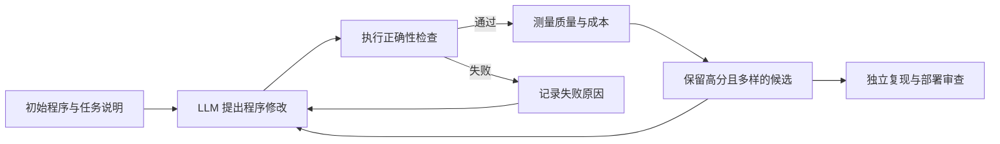

# 26.4 LLM 驱动的算法搜索

假设我们要加速一段被重复调用的矩阵乘法程序。这样的底层计算程序常称为“内核”；它每次只节省一点时间，在大模型训练中被调用数十亿次后，也会形成可观的总差异。

语言模型可以读懂内核代码并提出修改，却无法仅凭语言判断新版本是否更快；基准程序可以测出延迟，却不会主动写出下一版算法。把两者接起来，就得到一个可以反复运行的循环：生成候选程序，执行验证，保留更好的候选，再根据历史结果继续修改。

本节学习怎样把语言模型、自动评估器和进化搜索组成一个发现系统。重点是看清每一轮究竟改了什么、反馈怎样进入下一轮，以及什么结果可以称为经过验证的新发现。

需要这个闭环，是因为语言模型提出的代码和科学猜想可能很有启发，也可能只是看起来合理。只有经过执行、测量或形式化检查，候选想法才能成为可复现的结果；验证失败的候选也能为下一轮搜索提供信息。



这张图给出全文的主线。生成模型扩大候选空间，评估器把候选变成可比较的结果，程序库决定哪些经验进入下一轮。三个部件缺一不可：只有生成会得到大量未经证实的想法；只有评估不会主动探索新方案；没有历史库则会反复尝试相似改动。

这条循环和前几节的 RL 有相似结构。候选程序相当于动作，自动评估器提供反馈，历史程序库保存搜索经验。区别在于，AlphaEvolve 主要使用种群式进化搜索，不通过策略梯度更新 Gemini 的参数。把它与 Genie 3、Titans、M-GRPO 和递归自我改进放在同一篇文章中，目的正是分清几种“系统会继续改进”的机制。

这几类系统真正改变的对象并不相同：

- **AlphaEvolve** 修改可执行程序，评估分数决定哪些程序进入程序库，以及后续提示参考哪些历史候选。
- **Genie 3** 更新交互式世界状态，动作条件决定接下来生成的视觉世界。
- **Titans** 在测试时更新神经记忆，当前序列产生的训练信号直接写入记忆模块。
- **M-GRPO** 更新主智能体与子智能体策略，组相对优势最终进入模型参数。
- **递归自我改进** 改动训练系统或模型本身，并由独立评测决定是否接受新版本。

## 26.4.1 AlphaEvolve：让代码进入进化循环

开头已经有了三个部件：负责改代码的语言模型、负责运行测试和计时的评估器，以及保存较好版本的程序库。Google DeepMind 公布的 [AlphaEvolve](https://arxiv.org/abs/2506.13131) 把这三个部件组成了一个程序进化系统。

系统接收一个初始程序、任务说明和一个或多个自动评估器，目标是找到得分更高且仍满足正确性约束的程序。


<div style="text-align: center; font-size: 0.9em; color: var(--vp-c-text-2); margin-top: -10px; margin-bottom: 20px;">
  <em>图 1：提示采样器从程序数据库中选择候选和历史反馈，Gemini 生成程序修改，评估器执行并打分，结果再写回程序数据库。来源：<a href="https://arxiv.org/abs/2506.13131" target="_blank" rel="noopener noreferrer">AlphaEvolve 论文</a></em>
</div>

### 一轮搜索发生了什么

先比较两个候选程序。程序 A 通过全部正确性测试，运行耗时 12 毫秒；程序 B 只用 8 毫秒，却有一个测试失败。评估器不能只返回“越快越好”这一个数，否则 B 会错误地胜出。[AlphaEvolve 论文](https://arxiv.org/abs/2506.13131)允许评估器返回多个分数，并由程序数据库依据得分与多样性选择候选。为了表示这种多指标结果，下面使用本书的教学记号。设程序为 $p$：

$$
f(p)=\bigl(f_{\text{correct}}(p),f_{\text{quality}}(p),f_{\text{cost}}(p)\bigr).
$$

$f_{\text{correct}}$ 检查程序是否满足约束，$f_{\text{quality}}$ 衡量解的质量，$f_{\text{cost}}$ 记录运行时间或资源消耗。这个三元组用于帮助读者区分三个指标，并非论文要求所有任务都固定使用这三项。多指标评估很重要：一个运行很快但给出错误答案的程序不能进入有效种群。

一轮搜索可以拆成四步：

1. 提示采样器从数据库中选择一个或多个已有程序，并附上任务说明与历史评估。
2. Gemini Flash 扩大候选覆盖，Gemini Pro 提供更深入的修改建议，输出新的程序版本。
3. 自动评估器运行测试、证明检查或性能基准，得到可复现分数。
4. 程序数据库依据分数与多样性保留候选，供下一轮提示再次采样。

传统遗传算法常对位串或固定结构做随机变异。AlphaEvolve 的变异对象是代码，语言模型可以跨函数修改算法、初始化、损失和超参数搜索逻辑。搜索仍然依赖选择压力与种群多样性，语言模型负责提出更有结构的候选。

### 48 次乘法说明了什么

论文报告了一项容易核验的结果：系统设计的搜索过程找到了一种 $4\times4$ 复数矩阵乘法程序，只需要 48 次标量乘法。此前这一设定下的已知最好结果是 Strassen 1969 年算法对应的 49 次。这是 56 年来该设定的首次改进。


<div style="text-align: center; font-size: 0.9em; color: var(--vp-c-text-2); margin-top: -10px; margin-bottom: 20px;">
  <em>图 2：AlphaEvolve 在矩阵乘法以及分析、几何、组合数学和数论问题上的结果摘要。来源：<a href="https://arxiv.org/abs/2506.13131" target="_blank" rel="noopener noreferrer">AlphaEvolve 论文</a></em>
</div>

这一结果的关键在于“可执行候选 + 独立验证”。语言模型提出的是搜索程序，最终结论还要由计算和数学检查确认。DeepMind 还将系统用于 50 多个开放数学问题：官方报告称，大约 75% 的实验重新发现了已知最好结果，约 20% 改进了已知结果。其中包括在 11 维 kissing number 问题上构造 593 个外球的新下界。

### 从数学到计算基础设施

同一循环也用于工程问题，只是适应度函数换成了生产指标：

- Borg 调度启发式已部署，并平均回收 Google 全球约 0.7% 的计算资源；
- 一个经形式化验证保持功能等价的 Verilog 改写被纳入后续 TPU 设计；
- Gemini 中一项矩阵乘法内核加速 23%，对应训练时间下降约 1%；
- 低层 GPU 指令搜索使一项 FlashAttention 内核实现获得最高 32.5% 的加速。

这些比例来自不同任务，不能相加成一个“总体提升”。它们共同说明，评估器能够稳定运行、指标能直接对应部署成本时，程序进化最容易进入生产环境。

### 适用边界

AlphaEvolve 需要把候选写成代码，并让评估器在可接受成本内给出可靠反馈。药物发现、材料设计等领域也可以生成程序或实验方案，但真实实验昂贵、代理模拟有偏，评估闭环就会慢得多。自动评估是适用条件，同时也是系统最需要审计的组件。

## 26.4.2 Genie 3：为智能体生成可交互世界

AlphaEvolve 的评估器针对程序给出分数。具身智能体还需要一个环境，动作执行后环境必须产生下一观察。[Genie 3](https://deepmind.google/models/genie/) 代表另一条技术线：由文本描述生成可实时探索的视觉世界，并根据智能体动作继续模拟。

### 从 Genie 1 到 Genie 3

- **Genie 1（2024）** 从无动作标签视频中学习可控的二维平台环境；
- **Genie 2（2024）** 将生成扩展到可交互的三维世界；
- **Genie 3（2025）** 从文本生成 720p 世界，以 20–24 FPS 进行实时交互，并提高长时间一致性。

动作条件世界模型要回答一个具体问题：已经看到一段场景后，智能体此刻向左移动，下一帧可能出现什么？[Genie 1 论文](https://arxiv.org/abs/2402.15391)从视频学习可控的潜在动作，[Genie 3 官方说明](https://deepmind.google/models/genie/)进一步展示了实时交互式世界。把共同的预测对象写成最简条件分布：

$$
\hat P(o_{t+1}\mid o_{\le t},a_t),
$$

其中 $o_{\le t}$ 是到当前为止的视觉观察，$a_t$ 是智能体动作，$\hat P$ 表示模型学习到的下一观察分布。这个式子是世界模型的教学抽象，不是 Genie 3 公开页面给出的完整网络目标。SIMA 等智能体可以在生成世界中接收目标并行动；Genie 3 只负责根据动作模拟后续世界，并不知道智能体的任务奖励。

这一区分避免了一个常见误解：世界模型提供环境，不自动等于“已经用 RL 训练好策略”。要形成 RL 实验，还需要动作接口、奖励函数、终止条件和独立评测。

### 能做什么，暂时不能做什么

生成世界可以帮助研究者快速构造环境、观察智能体弱点，并减少早期原型对真实设备的依赖。不过，DeepMind 公布的限制同样具体：当前智能体动作范围有限，多独立智能体交互仍难模拟，真实地点无法完全准确复现，文字渲染不稳定，连续交互时间约为数分钟而非数小时。

因此，Genie 3 更适合环境原型与受控评测。若用于自动驾驶、机器人或医疗训练，还需要测量模拟到现实的差距，不能把视觉逼真度直接当成物理正确性。

## 26.4.3 Titans：在测试时更新长期记忆

长轨迹还会带来另一个瓶颈：即使环境可以持续生成，固定上下文窗口也装不下所有历史。[Titans](https://arxiv.org/abs/2501.00663) 引入神经长期记忆模块，让注意力处理当前上下文，同时由可学习记忆压缩更久以前的信息。

Titans 区分三类信息：

- 短期记忆由注意力精确读取当前窗口；
- 长期记忆由神经记忆模块在测试时持续更新；
- 持久记忆保存与任务相关、训练后固定的参数。

论文用“惊喜度”决定哪些输入更值得写入长期记忆。这里的惊喜来自记忆模型对当前样本的损失或梯度信号，它是测试时学习规则，不是环境给出的 RL 奖励。原文报告 Titans 在语言建模、常识推理、基因组和时间序列任务上优于所比较的 Transformer 与线性循环基线，并在 needle-in-a-haystack 评测中扩展到超过 2M 的上下文。

Titans 与本章主线的联系发生在系统层：长期智能体可以用这类记忆保存跨回合信息，RL 再学习如何利用由记忆形成的观察。记忆模块本身采用梯度更新，并不因此自动成为强化学习算法。

## 26.4.4 M-GRPO：直接训练多智能体搜索系统

AlphaEvolve 选择程序，Genie 3 生成环境，Titans 更新记忆。[Multi-Agent Deep Research](https://arxiv.org/abs/2511.13288) 则直接更新搜索系统中的语言模型参数。它包含一个负责规划的主智能体，以及调用搜索、代码等工具的多个子智能体。

M-GRPO 需要解决三个工程问题：

- 主智能体与子智能体处于不同层级，因此分别计算组相对优势；
- 每条主轨迹调用子智能体的次数不同，需要对齐异构轨迹并构造固定批次；
- 不同智能体可能部署在独立服务器，只交换训练所需的统计量，避免跨服务器反向传播。

论文在 GAIA、XBench-DeepSearch 和 WebWalkerQA 上比较单智能体 GRPO、冻结子智能体的多智能体训练与 M-GRPO。这一方法属于参数训练，与 AlphaEvolve 的无梯度程序选择形成清楚对照：前者改变生成策略，后者改变程序种群。

## 26.4.5 递归自我改进：把“改进对象”画清楚

递归自我改进（Recursive Self-Improvement, RSI）常被描述为“模型自己改进自己”。这个说法把多个层次压在了一起。一个可审计的循环至少要写出：

```text
当前系统 M_t
  → 在固定任务集上诊断失败
  → 生成数据、程序或训练配置候选
  → 在隔离环境中执行候选改动
  → 用独立保留集与安全评测比较 M_t 和 M_{t+1}
  → 通过门槛后才接受新版本
```

到 2026 年中，公开工作大多只实现其中一部分：

- **AutoGPT（2023）** 让固定模型循环规划与调用工具，没有改写模型参数；
- **Voyager（2023）** 在 Minecraft 中自动生成课程，并把可执行技能写入不断增长的代码库，同样通过黑盒调用 GPT-4 而非微调模型；
- **SRPO（2024）** 联合优化自我改写策略与生成策略，再把目标转成可离线训练的损失；
- **自博弈系统** 让新策略与自身历史版本交互，但改进范围仍由环境、奖励和训练代码限定。

这些方法分别改进计划、技能库、回答修订或策略参数。它们没有形成一个可以任意修改自身训练算法、可靠验证改动并持续部署的完整 RSI 系统。

### 三个必须保留的门槛

**独立评估。** 让提出改动的模型同时裁决改动，会把同一偏差带入两端。保留集、形式化验证、人工审查与真实系统指标需要至少提供一种独立信号。

**搜索成本。** 数据配方、超参数、模型结构与训练代码构成巨大的组合空间。改进循环应报告尝试总数、失败候选和总计算量，避免只展示被选中的成功结果。

**安全边界。** 候选代码先在沙箱中运行，权限、网络和资源预算都要固定；新模型还要经过能力回归与对齐评测。改进速度不能替代发布门槛。

## 26.4.6 一条共同的发现链

回到开头的矩阵内核，五类工作可以放进同一条因果线：

1. 语言模型或多个智能体扩大候选空间；
2. 代码执行器、验证器或环境模型把候选变成可观察结果；
3. 进化选择、梯度更新或测试时记忆把反馈写回系统；
4. 独立评测判断提升来自真实任务收益，还是评估器漏洞；
5. 只有通过验证的候选才进入下一轮或实际部署。

这条链也解释了科学发现的适用范围。数学与计算机系统容易构造高速、客观的评估器；生物、化学和物理实验通常更慢，还要处理模拟偏差与现实安全。教育中的个性化路径同样需要长期学习效果与公平性指标，不能只优化即时答题率。

## 26.4.7 怎样判断系统真的发现了新结果

AlphaEvolve 展示了语言模型、程序数据库、自动评估器和进化选择怎样共同发现新算法。Genie 3 提供可交互的生成世界，Titans 为长轨迹加入测试时记忆，M-GRPO 直接训练层级多智能体搜索策略，RSI 则把改进对象扩大到训练系统本身。

这些方向共享的技术核心是一个有边界的闭环：候选能够生成，结果能够验证，反馈能够写回，失败能够回滚。科学发现的可信度最终落在评估器与复现实验上。

最后可以用四个问题审计一次“AI 发现”：

1. 候选对象是什么——程序、参数、环境、记忆，还是模型权重？
2. 评估器检查了哪些约束，能否被候选程序钻漏洞？
3. 总共搜索了多少候选，失败结果与总计算成本是否保留？
4. 最佳结果能否由独立代码、硬件或证明工具重新得到？

AlphaEvolve 对矩阵乘法的价值，正来自这四项都能具体回答。迁移到真实科学实验时，最难的一步通常从“生成候选”转向“获得便宜、快速且可信的验证”。

---

## 参考资料

- Novikov A, Vũ N, et al. [AlphaEvolve: A Coding Agent for Scientific and Algorithmic Discovery](https://arxiv.org/abs/2506.13131). 2025.
- Google DeepMind. [AlphaEvolve: A Gemini-Powered Coding Agent for Designing Advanced Algorithms](https://deepmind.google/blog/alphaevolve-a-gemini-powered-coding-agent-for-designing-advanced-algorithms/). 2025.
- Google DeepMind. [Genie 3](https://deepmind.google/models/genie/). 2025.
- Behrouz A, Zhong P, Mirrokni V. [Titans: Learning to Memorize at Test Time](https://arxiv.org/abs/2501.00663). 2024.
- Hong H, Yin J, et al. [Multi-Agent Deep Research: Training Multi-Agent Systems with M-GRPO](https://arxiv.org/abs/2511.13288). 2025.
- Choi E, Ahmadian A, et al. [Self-Improving Robust Preference Optimization](https://arxiv.org/abs/2406.01660). 2024.
- Wang G, Xie Y, et al. [Voyager: An Open-Ended Embodied Agent with Large Language Models](https://arxiv.org/abs/2305.16291). 2023.
