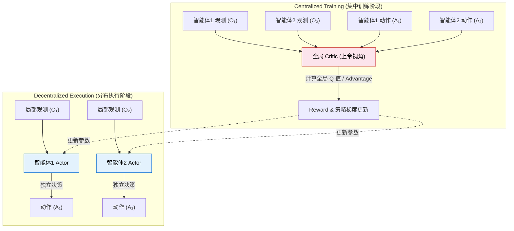
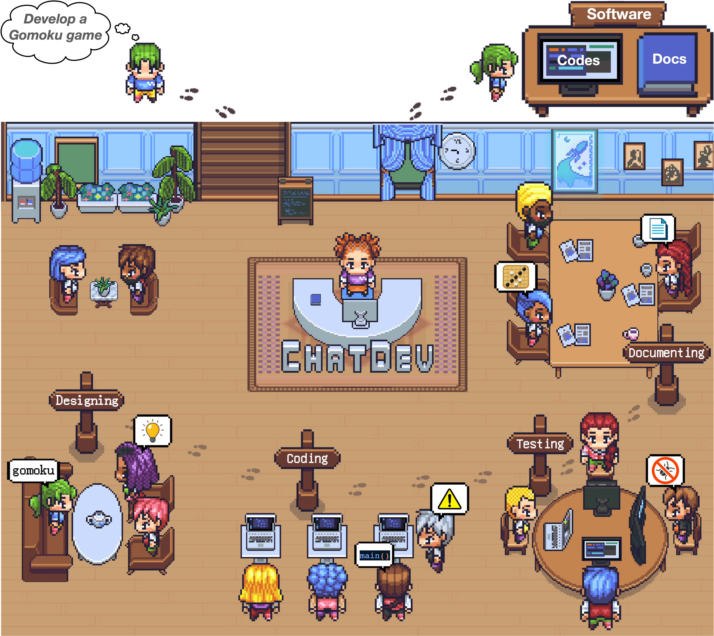
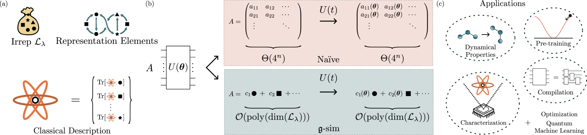
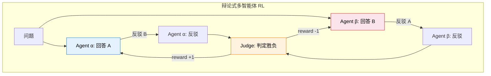
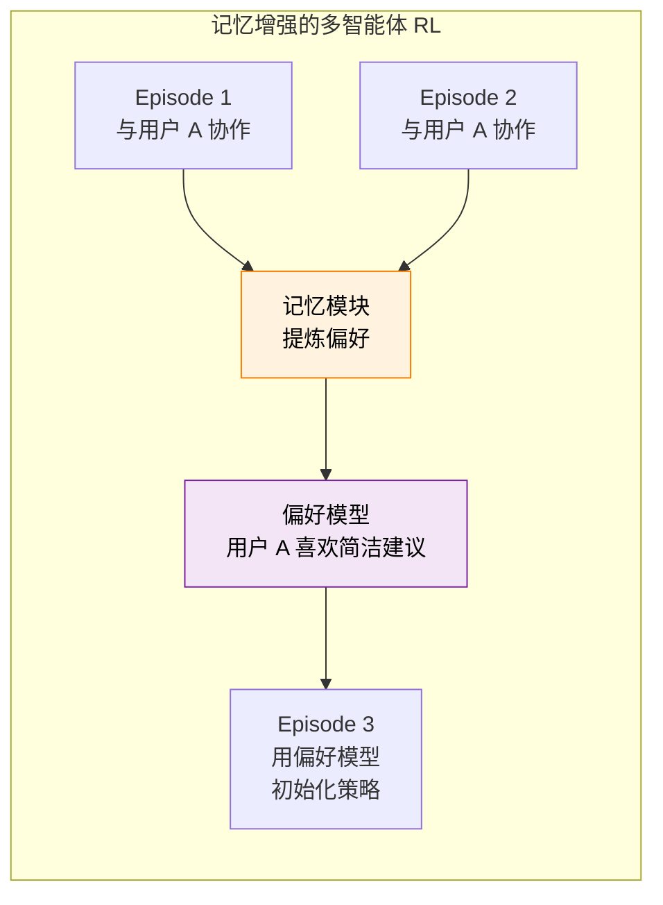
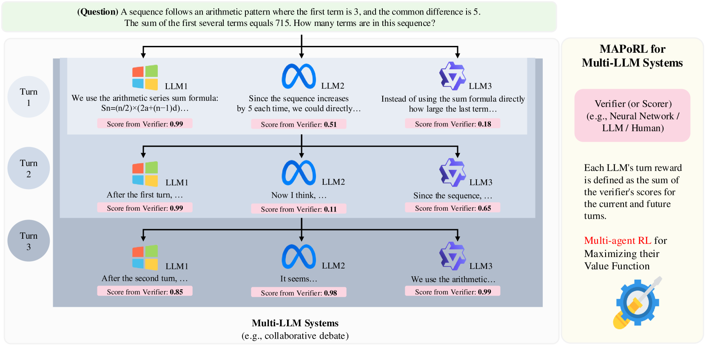
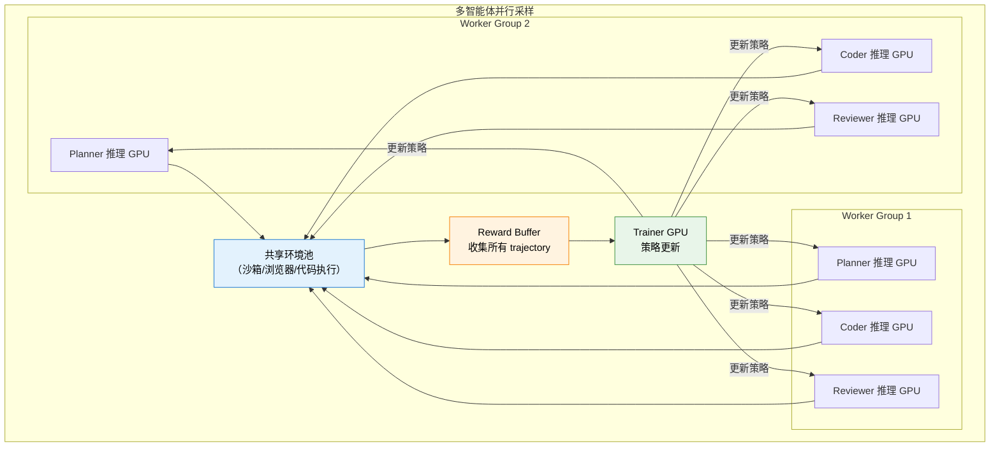
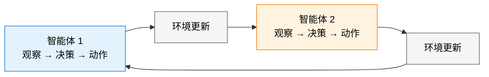

# 26.3 多智能体协同学习

设想一个由 Planner、Coder、Reviewer 和 Tester 组成的软件团队。最后测试失败时，轨迹只给出一个团队结果。失败可能来自计划遗漏、实现错误、审查漏检，也可能来自测试环境。若四个角色同时更新，Coder 改变输出格式以后，Reviewer 面对的数据分布也会立即改变。

本节学习怎样让多个语言智能体通过强化学习共同改进。我们会从一条团队轨迹出发，研究奖励怎样分给各个角色，以及多个角色同时学习时怎样保持训练稳定。

之所以需要多智能体 RL，是因为把几个固定模型串成工作流，只能利用它们原有的协作能力。若希望 Planner 学会更好地拆题、Reviewer 学会发现 Coder 的新错误，就必须把最终结果可靠地传回每个角色的策略更新。

这两个现象对应多智能体强化学习（MARL）的两项基本困难：**信用分配** 与 **非平稳性**。前者决定团队奖励如何分到每个角色，后者来自其他参与者的策略也在学习。语言模型又把一次动作从有限维向量扩展成一段长文本，使问题更难测量。

学习这一节时，先抓住一条轨迹：任务依次经过 Planner、Coder、Reviewer 和 Tester，环境最后返回测试结果。训练算法要完成两件事：把结果归因给轨迹中的动作，再更新角色策略。若角色参数从未根据结果更新，这套系统只是多模型工作流，还不属于多智能体强化学习。

传统 MARL 常用 **CTDE（集中训练、分布执行，Centralized Training with Decentralized Execution）**。训练时，价值函数可以读取联合观测与联合动作；执行时，每个智能体只能使用自己可获得的信息。下面先用这套形式化工具描述问题，再区分“多个模型组成工作流”和“这些模型真的通过 RL 联合学习”。



<div style="text-align: center; font-size: 0.9em; color: var(--vp-c-text-2); margin-top: -10px; margin-bottom: 20px;">
  <em>图 1：CTDE 在训练时利用联合信息估计价值，执行时保留各角色的局部决策。语言模型系统也可以让集中式评估器读取完整轨迹，但评估器是否等同于可训练的 Critic，要由具体算法决定。</em>
</div>

- **IPPO** 让每个智能体独立运行 PPO，适合作为同质角色的基础基线。
- **MAPPO** 在 PPO 上加入训练时可见全局信息的价值函数，适合需要协作的团队任务。
- **QMIX** 用混合网络组合局部 Q 值，并保持它们与全局 Q 值之间的单调关系，主要用于合作型任务。
- **MADDPG** 为每个智能体训练 DDPG 策略，同时使用全局 Critic，适合连续动作下的合作与竞争。

这些算法在机器人协作、多车调度等场景中表现出色，但当我们切换到 **大语言模型驱动的多智能体系统** 时，会面对全新的挑战——不能直接把 MAPPO 套到 LLM 上：

传统 MARL 中的动作通常是移动方向、加速度等低维连续量或离散量，episode 也常有固定步数或明确终止条件。智能体之间可以同质，也可以异质，通信通常通过参数化消息向量完成。

语言模型把一次动作扩展成可变长度的 token 序列。角色由提示、工具和模型配置显式区分，轨迹变成长度差异很大的多轮对话，自然语言消息同时承担通信与行动的作用。人类还可能进入流程提供指令、反馈或接管，因此训练协议必须处理高维动作、异构角色和人机协作。

有了这些差异，文章沿着一条具体链路展开：先看多角色工作流怎样产生联合轨迹，再讨论奖励如何跨角色分配，随后进入联合训练、基础设施与一个 PettingZoo 实验。

## 26.3.1 先区分多模型工作流与多智能体训练

同样是 Planner、Coder、Reviewer 和 Tester 四个角色，参数固定时只是工作流；根据测试结果更新其中一个或多个角色后，才进入多智能体训练。先把不更新参数的协作过程看清楚，后面的奖励归因才有对象。

### 角色分工协作 (Role-Playing Collaboration)

先让开篇的软件团队运行一次，但暂时不训练任何角色。Planner 写计划，Coder 产出补丁，Reviewer 提意见，Tester 运行测试。即使最后测试通过，这次结果也只证明多个模型能够被编排成一条工作流。

最直接的做法就是让多个语言智能体承担不同子任务。**ChatDev** 用设计、编码、测试和文档等角色组织软件开发流程，为“联合轨迹长什么样”提供了具体例子。



<div style="text-align: center; font-size: 0.9em; color: var(--vp-c-text-2); margin-top: -10px; margin-bottom: 20px;">
  <em>图 2：ChatDev 用角色与阶段组织软件开发对话。原工作主要研究提示驱动的协作流程，本身并不等于多智能体 RL 训练。来源：<a href="https://arxiv.org/abs/2307.07924" target="_blank" rel="noopener noreferrer">ChatDev 论文</a></em>
</div>

```
任务: "修复空列表输入导致程序崩溃的问题"
├── Planner：分析问题单，制定修复计划
├── Coder：根据计划编写修复代码
├── Reviewer：审查代码质量，提出修改建议
└── Tester：运行测试，验证修复是否有效
```

把这种工作流进一步用于 RL 时，一次团队运行可以视为联合轨迹 $\tau$。各角色输出共同决定最终测试结果，但 ChatDev 的角色编排本身不能直接推出 CTDE：只有训练中确实使用联合信息估计价值或奖励时，两者才对应。

**动作粒度不匹配。** 传统 MARL 的动作是低维向量，而 LLM Agent 的"动作"是一段完整文本（几百个 token）。传统 Q 值难以评估"这段代码的质量"。解决方案是 **将整个多轮对话轨迹（rollout）作为一次策略更新单元**，用最终任务结果作为 reward 信号。

**奖励设计。** 假设团队最终通过测试，所有角色共享结果奖励 1；Reviewer 还因发现一个后来被测试确认的缺陷得到过程奖励。为了把两种信号分开记录，可以使用下面的**教学性组合**：

$$R_i = \alpha \cdot R^{\text{outcome}} + (1-\alpha) \cdot R_i^{\text{process}}$$

其中 $R^{\text{outcome}}$ 是共享的任务结果奖励，例如测试是否通过；$R_i^{\text{process}}$ 是角色 $i$ 的过程奖励，例如审查是否发现了后来由测试确认的缺陷。权重 $\alpha$ 需要在验证集上消融。这个加权式用于解释设计空间，不是 ChatDev 或 MetaGPT 原论文的训练目标。结果奖励可靠但稀疏，过程奖励更密集，却可能把评估器偏好写进策略；[MAPoRL](https://arxiv.org/abs/2502.18439)给出了一个把最终正确性与讨论行为同时纳入协作训练的具体实例。

另一个代表作 **MetaGPT** 将标准化操作程序（SOP）编码进系统提示。SOP 规定角色在何时产生哪些中间产物，从而缩小工作流的搜索空间。它是结构约束；PPO 中的 KL 项约束新旧策略分布，二者作用位置不同。



<div style="text-align: center; font-size: 0.9em; color: var(--vp-c-text-2); margin-top: -10px; margin-bottom: 20px;">
  <em>图 3：MetaGPT 用标准化操作程序约束角色、阶段和中间产物。该结构可以作为后续 RL 的初始策略空间，但原框架的有效性不能直接归因于强化学习。来源：<a href="https://arxiv.org/abs/2308.00352" target="_blank" rel="noopener noreferrer">MetaGPT 论文</a></em>
</div>

### 辩论对抗 (Debate and Competition)

[26.1 节](../self-play-outlook/)介绍了辩论式自博弈训练，这里我们从**多智能体 RL** 的视角重新审视。辩论架构中，两个 LLM Agent 对同一个问题给出不同回答，通过多轮辩论互相挑战，最终由 Judge 判定胜负。

辩论可以由同一模型的多个实例完成，也可以使用参数不同的策略。只有辩论者或裁判的参数根据结果更新时，它才成为训练算法；仅在推理时调用多个固定模型，属于多智能体推理。种群训练进一步保留多个历史策略，通过交叉配对减轻策略只适应单一对手的问题。



### 开放式多智能体环境 (Open-Ended Multi-Agent Environments)

前两种架构有明确的任务目标和终止条件。开放式环境则让智能体在更长时间尺度上生活、沟通和形成计划。斯坦福大学的 **Generative Agents** 用 25 个语言智能体构造虚拟小镇，展示了记忆、反思和计划怎样影响群体行为。这项工作主要是交互式智能体模拟，并未通过 MARL 优化策略；它适合作为环境设计的参照。

从 RL 视角看，这带来几个独特的挑战。[Generative Agents](https://arxiv.org/abs/2304.03442)本身是智能体模拟工作，这里的多目标奖励是为了说明“若要进一步用 RL 训练，需要怎样定义反馈”，不是原论文公式：

- **多目标奖励设计**：假设任务完成、遵守规则和行为连贯各有一个子分数。教学上可以写成 $R_t=\sum_{m=1}^{M}w_m r_m(s_t,a_t)$，其中 $r_m$ 是第 $m$ 项分数，$w_m$ 是它的权重。权重会改变策略优化方向，也可能掩盖目标之间的冲突。
- **探索进入通信空间**：智能体同时选择和谁交互、传递什么信息以及何时停止。直接对整段自然语言做随机扰动通常无法产生有效探索，因此需要任务生成、角色随机化或熵正则等更有结构的方式。
- **评估缺少唯一答案**：开放式社会行为常依赖人工评审或模型评判，由此带来 [26.1 节](../self-play-outlook/)讨论的自循环退化风险。

开放式环境真正困难之处在于评测：若没有明确奖励，就无法直接进行策略梯度更新；若加入代理指标，训练又可能优化可测量的社会表象。因而需要把行为模拟与 RL 训练分开报告。

## 26.3.2 两个核心困难：伙伴在变，奖励却只有一个

假设第一轮训练只更新 Coder。它开始输出新的补丁格式，固定的 Reviewer 可能读不懂；若 Reviewer 也同时更新，我们又难以判断测试提升来自哪一个角色。与此同时，环境最终只返回一次测试成功或失败，无法直接说明中间每段消息贡献了多少。

### 非平稳性放大

传统 MARL 就有非平稳性问题：一个智能体学习新策略时，队友也在变化。LLM 多智能体把这个挑战放大了：

- **角色异构导致更新不同步**：Coder 模型和 Reviewer 模型的学习速率和更新频率可能不同。当 Coder 升级了代码风格，Reviewer 的审查策略需要重新适应。
- **语言动作空间加剧不稳定性**：传统 MARL 的动作是低维向量，策略变化通常是渐进的。LLM 的动作是语言，策略的一次更新可能导致输出风格完全不同（比如突然从写 Python 切换到写 Java），队友很难快速适应。

一种缓解方法是**冻结—轮训**：一次只更新一个角色，其他角色保持固定，使当前学习者暂时面对平稳的伙伴分布。轮换以后，旧角色仍可能失配，因此每轮都要在历史伙伴与当前伙伴上交叉评测。

### 跨角色信用分配

第 19.3 节讨论了多轮交互中的信用分配——7 轮交互失败了，该怪谁？多智能体把这个维度进一步扩展：**多个独立决策者同时在行动，谁的贡献最大？**

一个软件项目中，Coder 写了一段代码，Reviewer 发现了潜在 bug 并建议修改，Coder 修改后通过了测试。最终的"通过测试"这个 reward 应该怎么分配？

- Coder 贡献了"写出基本可用的代码"和"根据反馈修改"
- Reviewer 贡献了"发现潜在问题"
- 如果没有 Reviewer 的反馈，Coder 的原始代码可能通不过测试

集中式价值函数可以读取完整轨迹，估计某个角色的动作对团队回报有多大影响。若只让一个语言模型给各段文本打分，得到的是集中式评估器，仍需验证其分数能否作为低偏差的信用信号。

一种直接方案是组合过程奖励与结果奖励，具体记号已经在 26.3.1 给出。这里真正新增的问题是：谁来产生 $R_i^{\text{process}}$，以及它是否能在相同最终结果下区分有帮助与无帮助的消息。可以通过删去某个角色的消息、替换为对照消息或训练集中式价值函数来估计贡献，再与人工归因和最终测试做一致性检查。

### 记忆机制与长期策略

在人机协作场景中，Agent 需要记住过去和同一个人协作的经验——上次主播喜欢什么风格的选题？上次用户对哪类建议反应冷淡？这些记忆需要跨 episode 积累，影响未来的策略选择。

DQN 的经验回放保存转移样本供训练再次抽取。长期智能体的记忆则进入下一回合的观测或提示，直接影响动作选择；它可以保存原始事件，也可以提炼成偏好或事实摘要。两者都使用历史数据，但进入策略的路径不同。



记忆容量有限时，写入、压缩、检索和遗忘都可以成为策略的一部分。它们可以用 RL、监督检索损失或规则组合优化；若采用外层优化记忆策略、内层优化任务策略的结构，也可以建模为元学习问题。

## 26.3.3 代表性论文分别解决了哪一段

有了联合轨迹、非平稳性和信用分配三个问题，论文之间就可以按“改了训练链的哪一段”来阅读。MAPoRL 关注讨论中的协作信号，M-GRPO 处理层级轨迹的组相对更新，其他工作则从自进化与辩论训练扩展任务结构。

### MAPoRL 与多智能体协作训练



<div style="text-align: center; font-size: 0.9em; color: var(--vp-c-text-2); margin-top: -10px; margin-bottom: 20px;">
  <em>图 4：MAPoRL 让多个模型先独立回答，再进行多轮讨论；验证器同时检查最终答案正确性和讨论中的纠错、说服行为，并把分数用于联合训练。来源：<a href="https://arxiv.org/abs/2502.18439" target="_blank" rel="noopener noreferrer">MAPoRL 论文</a></em>
</div>

MAPoRL [^maporl] 将多个语言模型的讨论建模为联合策略优化问题。它的验证器检查答案正确性，并奖励能纠正错误或有效说服其他参与者的讨论。这里的过程信号有具体操作定义，比笼统的“配合度”更容易复现。

### M-GRPO 与 GRPO 的多智能体扩展

回顾第 15 章的 GRPO：同一个提示产生多条轨迹，再用组内相对奖励估计优势。[M-GRPO 论文](https://arxiv.org/abs/2511.13288)面向主智能体调用多个子智能体的层级结构，分别为主智能体和子智能体计算组相对优势，并对齐调用次数不同的异构轨迹。先只看单层：若一组四条团队轨迹奖励为 `0、0、1、1`，均值是 0.5，高奖励轨迹得到正优势，低奖励轨迹得到负优势。标准化写成

$$\text{Advantage}_i = \frac{R_i - \text{mean}(R_{1..G})}{\text{std}(R_{1..G})}$$

这个式子给出单层组相对优势的直觉，其中 $R_i$ 是第 $i$ 条团队轨迹的总体奖励，$G$ 是同组轨迹数，分母用组内标准差统一尺度。它是为了连接读者已经学过的 GRPO；论文中的层级信用分配还需要把子智能体调用对应回主轨迹，不能只把同一个团队分数复制给所有角色。

### 闭环自进化多智能体框架

SAGE [^sage] 使用 Challenger、Planner、Solver 与 Critic 四个角色：出题者扩大课程，规划者拆解任务，解题者执行计划，批评者过滤题目与计划，最终正确性由外部验证器判断。这个结构保留了独立正确性信号，避免课程完全由模型自评。

### MARTI 与 多智能体辩论框架

MARTI [^marti] 研究多智能体系统的联合训练与推理。阅读此类框架时，应分别记录参与训练的角色、最终奖励来源和推理时的通信拓扑；“形成共识”本身不能替代可验证奖励。

## 26.3.4 这些方法怎样接回单智能体 RL

- CTDE 的全局 Critic 为跨角色信用分配提供理论基础；19.3 节的 ORM/PRM 则说明怎样给多轮轨迹分配更细的反馈。
- [26.1 节的 Generator–Judge 自博弈](../self-play-outlook/)是辩论与对抗架构的直接前身。
- 第 15 章的 GRPO 在组内比较轨迹，M-GRPO 将这种比较扩展到主智能体和子智能体共同产生的轨迹。
- 第 5 章的经验回放保存历史经验；多智能体记忆还可以从原样复用扩展到提炼跨角色偏好。
- 第 8 章的 PPO 与训练稳定性仍是策略更新的基础。其他角色也在变化时，非平稳性会进一步放大。
- 19.6 节 Bespoke Labs 实验中的 KL 约束思路同样适用：联合训练仍要限制策略在一次更新中移动过远。

这些联系说明，多智能体训练没有另起一套数学：策略梯度仍负责更新，奖励仍定义优化方向，新的困难来自一条结果由多个可变策略共同产生。实践部分因此先固定其他角色，再逐步放开联合更新。

## 26.3.5 从冻结一个角色开始，再逐步联合训练

上面讨论了三种架构和三个核心挑战。现在我们来看看，在实践中如何把一个多智能体 RL 系统真正训练起来。

### 冻结-轮训（Freeze-Rotate Training）

这是一种降低非平稳性的工程配方，适合先建立可诊断基线。它不保证收敛，角色轮换后仍需检查旧能力是否退化。

**Step 1：单独 SFT 每个角色。** 先用监督学习让每个角色掌握基本能力——Coder 学会写代码格式，Reviewer 学会审查模式，Tester 学会写测试用例。

**Step 2：冻结其他角色，RL 训练一个角色。** 比如冻结 Reviewer 和 Tester，只用 RL 训练 Coder。Coder 需要适应固定的 Reviewer 和 Tester——"既然 Reviewer 总是检查边界条件，我就要主动处理边界情况"。

**Step 3：轮换。** 训练好 Coder 后，冻结 Coder，RL 训练 Reviewer。Reviewer 需要适应训练后的 Coder——"Coder 的代码风格变了，我的审查策略也要调整"。

**Step 4：迭代多轮。** 重复 Step 2-3 直到收敛。

```python
class FreezeRotateTrainer:
    """冻结-轮训的多智能体训练器"""

    def __init__(self, agents, env, num_rounds=3):
        self.agents = agents  # {"coder": model_c, "reviewer": model_r, ...}
        self.env = env
        self.num_rounds = num_rounds

    def train(self, tasks):
        for round_idx in range(self.num_rounds):
            for role, model in self.agents.items():
                print(f"Round {round_idx}: Training {role}")

                # 冻结其他角色
                for other_role, other_model in self.agents.items():
                    if other_role != role:
                        other_model.freeze()

                # RL 训练当前角色
                for task_batch in tasks:
                    trajectories = self.rollout_multi_agent(task_batch)
                    rewards = self.compute_multi_agent_reward(trajectories)
                    model.update(trajectories, rewards, role)

                # 解冻所有角色
                for m in self.agents.values():
                    m.unfreeze()

    def rollout_multi_agent(self, tasks):
        """多智能体联合 rollout"""
        trajectories = []
        for task in tasks:
            state = {"task": task, "history": []}

            # 按角色顺序执行
            for role, model in self.agents.items():
                action = model.act(state, role)
                state["history"].append({
                    "role": role, "action": action
                })

            trajectories.append(state)
        return trajectories

    def compute_multi_agent_reward(self, trajectories):
        """计算多智能体协作的 reward"""
        rewards = []
        for traj in trajectories:
            # 结果 reward（共享）
            outcome = self.env.evaluate(traj)
            outcome_reward = 1.0 if outcome["success"] else 0.0

            # 过程 reward（每个角色独立）
            process_rewards = {}
            for step in traj["history"]:
                role = step["role"]
                quality = self.env.evaluate_step(step)
                process_rewards[role] = quality

            # 综合 reward
            total_reward = 0.6 * outcome_reward + 0.4 * sum(
                process_rewards.values()
            ) / max(len(process_rewards), 1)

            rewards.append(total_reward)
        return rewards
```

### 联合 GRPO（M-GRPO 实战）

M-GRPO 将 GRPO 的组采样思路扩展到多智能体——不再对单个模型的输出做组内比较，而是对 **整个团队** 的协作表现做组内比较：

```
任务: 修复问题单 #1234：空列表输入导致程序崩溃

团队 A (采样 1):
  Planner → 计划: 分析→定位→修复→验证
  Coder   → 代码: 修改了第 45 行
  Reviewer → 审查: 建议增加错误处理
  Tester  → 测试: 3/3 通过
  团队 reward: 0.85

团队 B (采样 2):
  Planner → 计划: 直接搜索关键词→修改
  Coder   → 代码: 修改了第 12 和 45 行
  Reviewer → 审查: LGTM
  Tester  → 测试: 2/3 通过（边界 case 失败）
  团队 reward: 0.60

团队 C (采样 3):
  Planner → 计划: 分析问题单→复现→定位→修复
  Coder   → 代码: 修改了第 45 行，增加边界处理
  Reviewer → 审查: 建议优化变量命名
  Tester  → 测试: 3/3 通过
  团队 reward: 0.90

GRPO 更新: 团队 C 的相对优势为正，团队 B 为负
           → 各角色只更新自己在对应轨迹中生成的 token
```

M-GRPO 的关键决策是 **reward 如何分配到各角色**。两种常见策略：

**共享 reward**：所有角色使用同一个团队 reward。优点是鼓励协作，缺点是可能让某些角色"搭便车"。

**角色特定奖励**：每个角色获得 $\alpha \times$ 团队奖励 $+ (1-\alpha) \times$ 角色过程奖励。$\alpha$ 应通过消融选择，并检查角色是否学会迎合过程评估器。

### 自博弈训练（Self-Play）

多智能体自博弈不需要人工设计角色分工——让同一个模型的不同实例互相竞争：

**Generator vs Judge**：Generator 生成回答，Judge 评估质量。若两者共同训练，需要分别定义生成奖励与评判准确性信号；否则 Judge 可能只学会稳定偏好 Generator 当前的输出。

**Proposer vs Solver**：Proposer 生成难题，Solver 尝试解答。好的 Proposer 应该生成"恰好超过 Solver 当前能力"的难题——太难了 Solver 学不到东西，太简单了没有挑战。这种"难度自适应"的能力也是通过 RL 学到的。

两个当前策略反复配对时，训练分布可能变窄或循环。策略池保留多个历史版本，再按评测矩阵选择配对。池大小和采样分布都是实验变量。FlexMARL [^flexmarl] 从采样、训练与编排协同设计的角度处理多智能体训练效率。

## 26.3.6 多智能体 RL 的基础设施

多智能体训练需要同时管理多个模型的推理、多个环境实例和角色间通信。FlexMARL [^flexmarl] 与 KD-MARL [^kdmarl] 分别研究训练编排和资源受限部署，为下面的并行采样图提供了两个具体参照。

### 并行采样架构



关键设计原则：

**角色推理解耦**。不同角色的模型可能大小不同——Planner 用 14B，Coder 用 32B，Reviewer 用 7B。它们的推理速度不同，必须用异步队列来解耦，避免快的角色等慢的。

**环境沙箱隔离**。每个团队（一组角色）需要独立的环境沙箱，避免角色之间的环境干扰。代码执行环境尤其重要——Coder 写的代码不能影响其他团队的执行环境。

**通信协议标准化**。角色之间传递的消息格式需要统一——即使角色的内部模型不同，消息格式应该一致。常见做法是用 JSON Schema 定义消息格式，类似 19.4 节的工具调用格式。

## 26.3.7 基于模型的 RL：显式预测再规划

前面的软件团队都是“先行动，再看结果”。例如，Reviewer 建议删除一段边界检查，Coder 直接照做，Tester 运行以后才发现嵌套空列表再次崩溃。若系统能在真正修改仓库前预测“这个改动会让哪些测试失败、Coder 会怎样响应”，它就能先比较几个候选方案，再选择要执行的动作。

这正是**基于模型的强化学习（MBRL）**增加的能力：学习或使用一个环境模型，在候选动作真正执行前预测后果并进行规划。[Dreamer](https://arxiv.org/abs/1912.01603)在潜空间中用预测轨迹学习行为，[MuZero](https://arxiv.org/abs/1911.08265)则学习供搜索使用的潜在动力学、奖励和价值。

无模型方法直接从真实或模拟环境的轨迹学习价值与策略，不要求先得到环境转移模型。DQN、PPO 和 GRPO 属于这条路线，主要误差来自价值估计、优势估计与策略优化。

基于模型的方法会先学习或使用一个世界模型，再用它生成想象轨迹或搜索候选动作。Dreamer 和 MuZero 是代表算法。它们可以重复利用模型内部的预测，同时还会引入环境模型偏差；规划越深，预测误差越可能沿轨迹累积。

若当前仓库状态是 $s_t$，候选修改是 $a_t$，世界模型要预测修改后的状态 $s_{t+1}$。用教学记号写成 $\hat{P}(s_{t+1}\mid s_t,a_t)$：帽子表示这是模型预测的转移分布，不是真实环境规则。智能体可以据此生成想象轨迹或搜索候选动作。预测误差会随规划深度累积，因此真实环境数据仍用于校准世界模型。

### 为什么 MBRL 对大模型很重要？

语言模型预测下一个 token，并在参数中编码大量关于文本与世界的统计规律。将它称为“世界模型”是一种有条件的类比：只有当模型状态、动作和转移能对应任务环境，而且预测会被规划器实际使用时，才满足 MBRL 的操作定义。输出思维链可能承担内部规划的功能，单凭多步文字仍无法证明这一点。

下面这行只是概念关系的教学摘要，不是算法公式：

$$\text{显式环境模型} + \text{候选动作搜索} \longrightarrow \text{基于模型的规划}$$

在一个可检验的语言智能体实现中，可以作如下对应：

- **环境模型**：给定当前工具状态与候选操作，预测下一观察；
- **规划器**：比较多个预测分支并选择要执行的操作；
- **动作**：工具调用、消息或环境操作；
- **奖励**：任务成功、成本和安全约束的组合。

在 GRPO 或 DeepSeek-R1 中，RL 会提高高奖励推理轨迹的概率。它是否形成了可校准的环境模型，需要另外设计状态预测、反事实预测和规划消融实验来检验。

### 多智能体 + MBRL 与 协作中的"脑内推演"

MBRL 在多智能体场景中有独特价值：**世界模型可以预测其他智能体的行为**。传统的 Model-Free MARL 只能被动观察队友行为，而 Model-Based MARL 可以主动预测"如果我做 A，队友会怎么反应？"

对其他智能体建模可以缓解部分非平稳性：当前智能体预测伙伴回应，再选择动作。不过，伙伴策略一更新，预测模型也会过时。非平稳性由此转化成持续的模型校准问题。

**MuZero** 学习潜在状态表示、动力学与奖励预测，再用 MCTS 规划；它仍需要环境提供合法交互与奖励。**AlphaZero** 使用已知游戏模拟器做搜索，通常与“学习世界模型”的 MBRL 区分开。**Dreamer** 系列在潜空间中学习动力学并利用想象轨迹训练行为，其样本效率要按具体任务和基线比较。

MARL 和 MBRL 的交汇点是**多机器人协作**：多个机器人需要协作完成任务，同时每个机器人的策略需要基于世界模型来做规划（预测"如果我推这边，物体会怎么动？其他机器人会怎么反应？"）。这把多智能体的非平稳性、世界模型的模型偏差、物理世界的安全约束叠加在一起，目前还在早期探索阶段。

## 26.3.8 把一条团队轨迹检查完整

回到开篇的空列表缺陷。一次团队轨迹中，Planner 判断问题来自输入检查，Coder 增加条件分支，Reviewer 只回复“通过”，Tester 随后发现嵌套空列表仍会崩溃。团队奖励为 0。

在更新模型前，先要保存谁看到了什么、谁生成了哪段消息、哪些工具调用改变了仓库，以及最终测试为什么失败。然后做一个最小反事实：保留 Planner 与 Coder 的输出，只把 Reviewer 的空泛审查替换成指出嵌套列表问题的审查，再运行同一组测试。若结果转为成功，Reviewer 的步骤才获得一条可检查的贡献信号。

沿着这条轨迹，可以把本节的四个困难逐项落地：

1. **非平稳性放大**：语言动作空间和角色异构性让多智能体训练更难诊断。冻结—轮训可以建立较平稳的单角色基线。
2. **跨角色信用分配**：多个独立决策者的贡献难以评估。过程奖励与结果奖励的组合提供了一种可消融方案。
3. **记忆与长期策略**：人机协作需要跨 episode 的信息积累。记忆可以由 RL、监督检索损失或规则共同优化。
4. **基于模型的 RL**：显式预测其他角色与环境的回应可以支持规划，也会引入模型偏差。

得到可复现轨迹以后，再选择训练配方：

- **冻结—轮训**：降低单轮训练的非平稳性，适合建立基线
- **联合 GRPO（M-GRPO）**：适合需要同时优化主智能体与专门子智能体的层级轨迹
- **自博弈**：适合胜负或出题—解题关系明确，并且具有独立验证器的任务

真实软件仓库仍然太慢，也包含很多难以控制的变量。下面用 PettingZoo 把参与者轮换、局部观察与共享奖励落实到一个更小的可运行环境中，先检查训练接口是否正确。

---

## 26.3.9 用 PettingZoo 建立最小可复现环境

前文的软件团队难以直接训练和复现实验。PettingZoo 提供规则清楚的小型多智能体环境，可以先验证奖励分配、轮换协议和参数共享。[PettingZoo](https://github.com/Farama-Foundation/PettingZoo) 由 Farama 基金会维护，提供统一的多智能体环境 API。

### 从单智能体到多智能体，训练对象改变了什么

Gymnasium 的单智能体环境只有一个决策者，学习分布主要随自身策略变化，奖励也可以直接归到这一个智能体。常见方法包括 DQN、PPO 和 SAC，探索通常由 $\epsilon$-greedy 或熵正则控制。

PettingZoo 环境可以包含两个到数百个智能体。任一策略更新都会改变其他智能体面对的数据分布，团队奖励还要回答“哪一个角色贡献了结果”。探索时也要考虑其他参与者会怎样响应或利用试探行为，因此常用 QMIX、MAPPO 和 MADDPG 等多智能体方法。

### PettingZoo 环境概览

```bash
pip install pettingzoo
```

- `classic` 收录 `chess_v3`、`connect_four_v3` 和 `tictactoe_v3` 等回合制棋盘对抗环境。
- `butterfly` 收录 `cooperative_pong_v5`、`pistonball_v6` 等需要多个智能体共同完成目标的环境。
- `mpe` 提供 `simple_adversary_v3`、`simple_spread_v3` 等多粒子环境，用于研究沟通、导航以及合作与对抗的混合关系。
- `sisl` 中的 `pursuit_v4`、`waterworld_v4` 关注追逃和资源收集。
- `atari` 提供 `pong_v3` 等多智能体 Atari 对抗任务。

### 四子棋

四子棋（Connect Four）是最简单的多智能体环境之一——两个智能体轮流落子：

```python
from pettingzoo.classic import connect_four_v3

env = connect_four_v3.env(render_mode="human")
env.reset()

for agent in env.agent_iter():
    observation, reward, termination, truncation, info = env.last()

    if termination or truncation:
        action = None
    else:
        mask = observation["action_mask"]
        valid_actions = [i for i, m in enumerate(mask) if m == 1]
        action = valid_actions[0]  # 简单策略：选第一个合法位置

    env.step(action)

env.close()
```

PettingZoo 使用 **AEC（Agent Environment Cycle）模型**：智能体轮流行动，每次只有一个智能体执行动作。



### 多粒子环境中的协作导航

`simple_spread` 是多智能体 RL 的经典基准：N 个智能体需要协作覆盖地图上的 N 个目标点，同时避免碰撞。

```python
from pettingzoo.mpe import simple_spread_v3
import numpy as np

env = simple_spread_v3.env(N=3, local_ratio=0.5, max_cycles=100)
env.reset()

total_rewards = {agent: 0 for agent in env.agents}

for agent in env.agent_iter():
    obs, reward, termination, truncation, info = env.last()

    if termination or truncation:
        action = None
    else:
        action = env.action_space(agent).sample()

    env.step(action)
    if reward is not None:
        total_rewards[agent] += reward

print("各智能体累积奖励:")
for agent, reward in total_rewards.items():
    print(f"  {agent}: {reward:.2f}")

env.close()
```

关键参数 `local_ratio=0.5` 控制奖励中"全局奖励"和"局部奖励"的比例——这正是多智能体信用分配问题的体现。

### 参数共享 PPO 基线

以下代码把并行环境交给一个共享的 PPO 策略。它适用于 `simple_spread` 中角色同质的智能体，用来检查训练管线；由于所有智能体共享参数，它并不是“每个智能体各有一套网络”的严格 IPPO 实现。

```python
from pettingzoo.mpe import simple_spread_v3
from stable_baselines3 import PPO
import supersuit as ss

env = simple_spread_v3.env(N=3)
env = ss.pettingzoo_env_to_vec_env_v1(env)
env = ss.concat_vec_envs_v1(env, 8, num_cpus=1, base_env="single")

model = PPO("MlpPolicy", env, verbose=1, learning_rate=3e-4, n_steps=2048)
model.learn(total_timesteps=200_000)
model.save("./models/ippo_simple_spread")
```

::: tip
这里所有智能体共享同一个策略网络。角色异质时，可以按角色分别建模；是否共享参数仍要根据观察空间、动作空间和可迁移结构决定。
:::

### 从多智能体到 Agentic RL

PettingZoo 明确给出行动顺序、局部观察和奖励，因此信用分配可以重复测量。语言智能体系统把动作换成消息与工具调用以后，仍需要提供同样清楚的接口：谁在何时行动、能看到什么、奖励如何计算。具备这些定义后，多角色工作流才成为可训练、可比较的多智能体 RL 环境。

下一节进入 [26.4 进化搜索与科学发现](../alphaevolve/)：当候选策略变成可执行程序，选择、变异与验证会形成另一种改进循环。

## 参考资料

[^maporl]: Park C, Han S, et al. "[MAPoRL: Multi-Agent Post-Co-Training for Collaborative Large Language Models with Reinforcement Learning](https://arxiv.org/abs/2502.18439)." 2025. —— 多 LLM Agent 协作训练方法，引入协作奖励。

[^mgrpo]: Hong H, Yin J, et al. "[Multi-Agent Deep Research: Training Multi-Agent Systems with M-GRPO](https://arxiv.org/abs/2511.13288)." 2025. —— 将 GRPO 扩展到多智能体场景，保持无 Critic 优势。

[^sage]: Peng Y, et al. "[SAGE: Multi-Agent Self-Evolution for LLM Reasoning](https://arxiv.org/abs/2603.15255)." 2026. —— 闭环自进化多智能体框架。

[^marti]: Zhang K, Tian K, et al. "[MARTI: A Framework for Multi-Agent LLM Systems Reinforced Training and Inference](https://openreview.net/forum?id=E7jZqo0A50)." ICLR 2026. —— 多智能体 RL 训练与推理框架。[GitHub](https://github.com/TsinghuaC3I/MARTI)

- Zhang G, et al. "[The Landscape of Agentic Reinforcement Learning for LLMs: A Survey](https://arxiv.org/abs/2509.02547)." 2025. —— Agentic RL 综述，包含多智能体协作板块。
- Tran K-T, et al. "[Multi-Agent Collaboration Mechanisms: A Survey of LLMs](https://arxiv.org/abs/2501.06322)." 2025. —— LLM 多智能体协作综述，覆盖合作/竞争/竞合分类、通信协议和评估方法。
- Jin W, et al. "[A Comprehensive Survey on Multi-Agent Cooperative Decision-Making](https://arxiv.org/abs/2503.13415)." 2025. —— 从传统 MARL 到 LLM 驱动多智能体协作的全景综述。
- Li J, et al. "[FlexMARL: Rollout-Training Co-Design for Efficient LLM-Based Multi-Agent Reinforcement Learning](https://arxiv.org/abs/2602.09578)." 2026. —— 首个联合优化采样、训练及编排的端到端多智能体框架。
- Pavel M I, Hu S, Masum M A, Pratama M, Kowalczyk R, Cao Z J. "[KD-MARL: Resource-Aware Knowledge Distillation in Multi-Agent Reinforcement Learning](https://arxiv.org/abs/2604.06691)." 2026. —— 通过知识蒸馏将集中式协调行为迁移到轻量级去中心化智能体。

[^flexmarl]: Li J, et al. "[FlexMARL: Rollout-Training Co-Design for Efficient LLM-Based Multi-Agent Reinforcement Learning](https://arxiv.org/abs/2602.09578)." 2026. —— 首个联合优化采样、训练及编排的端到端多智能体框架。

[^kdmarl]: Pavel M I, Hu S, Masum M A, Pratama M, Kowalczyk R, Cao Z J. "[KD-MARL: Resource-Aware Knowledge Distillation in Multi-Agent Reinforcement Learning](https://arxiv.org/abs/2604.06691)." 2026. —— 通过知识蒸馏将集中式协调行为迁移到轻量级去中心化智能体。
