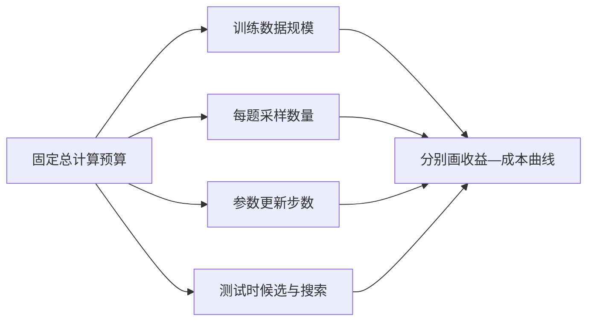
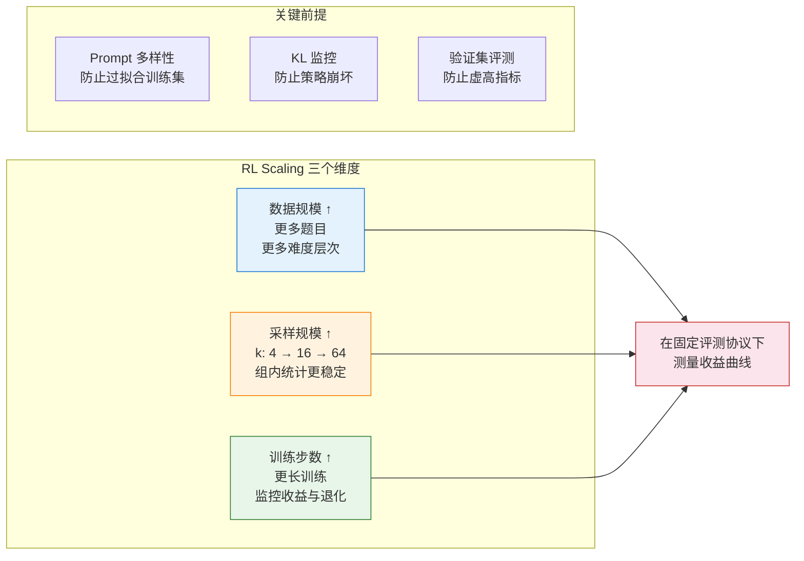
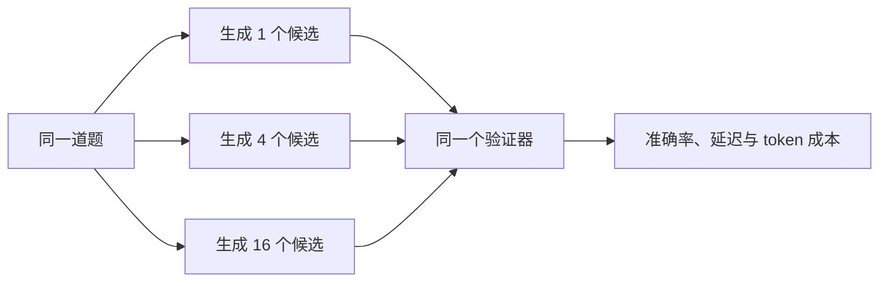
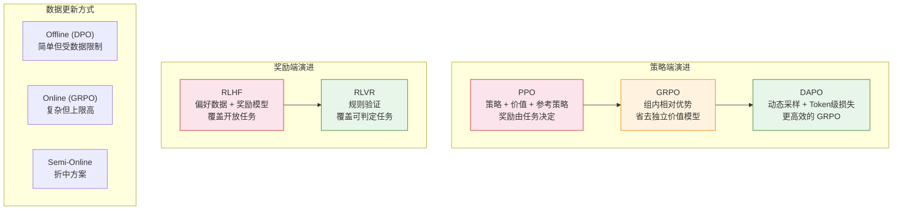

# 26.2 训练时与测试时的规模扩展

同一批数学题、同一个 8B 模型和同样的总生成预算，可以有几种不同用法：增加训练题数量，让每道题多采样几条轨迹，延长策略更新，或者把计算留到部署时做 Best-of-$N$。这些选择都会增加计算量，却改变了不同的对象，因此不能只用“算力更多”概括。

本节学习怎样分析强化学习中的规模扩展。我们会把训练数据、每题采样数、更新步数和测试时搜索分开，观察多出来的计算究竟用在了哪里。

需要这样拆分，是因为同样增加一倍计算，可能改善探索，也可能只是生成更多候选，甚至加重对奖励漏洞的利用。只有固定总预算并分别改变一个变量，才能判断哪种扩展真正值得投入。

先看一个具体预算。假设共有 100 万次模型生成，可以把它们全部用于训练，也可以训练只用 60 万次，把剩余 40 万次留给线上每题多采样。两种方案消耗相近，却分别改变“模型本身的策略”和“部署时搜索到候选的机会”。为了避免漏算部署阶段重复发生的成本，下面先写一个**教学性的预算恒等式**；它是成本核算方式，不是某篇 Scaling Law 论文拟合出的经验定律：

$$
C_{\text{total}}
=C_{\text{train}}
+Q\,C_{\text{test}},
$$

其中 $C_{\text{train}}$ 是训练阶段总计算，$C_{\text{test}}$ 是单次请求的推理计算，$Q$ 是预期请求量。研究论文常只比较一次评测，产品则必须考虑 $Q$：训练成本只支付一次，测试时成本会随请求重复发生。



规模分析的第一步，是先分清训练数据从哪里来。固定数据、实时采样和周期性更新会产生不同的覆盖范围与工程成本。

## 26.2.1 数据何时产生：离线、在线与周期更新

假设我们要让模型写更好的客服邮件。手里已有 10 万组成对偏好：每组包含同一问题的两个回答和人工选择。直接反复使用这批数据，训练简单稳定；模型更新后出现的新措辞、新错误和新漏洞，却不会自动进入这 10 万组样本。

另一种做法是在每轮训练时，让当前模型重新回答一批问题，再由规则、奖励模型或人工评价。这样能看到当前策略的新行为，采样与评价成本也会进入每一轮训练。

这两个做法的核心差别是：训练数据在更新之前已经固定，还是由更新后的当前模型继续产生。[DPO](https://arxiv.org/abs/2305.18290)、GRPO 和 DAPO 等方法可以沿着这个问题来选择，而无需先背一串算法名称。

三种训练方式的差别首先体现在数据何时产生：

- **离线训练**使用固定偏好数据，代表方法包括 DPO、KTO、SimPO 和 IPO。它最接近标准监督学习，工程与显存成本较低，主要风险是固定数据无法覆盖更新后策略的新输出。
- **在线训练**让当前模型实时生成轨迹，PPO、GRPO、DAPO 和 RLOO 属于这一类。数据会随策略变化，能够覆盖新行为，同时需要维护采样、奖励和更新循环，显存开销更高，也更容易出现奖励过优化与训练不稳定。
- **半在线训练**从离线数据起步，再周期性加入当前策略的新样本。Iterative DPO 是代表方法。它在覆盖范围与工程成本之间折中，但需要控制新旧数据的比例，避免混合分布失衡。

### 实践建议

三种训练方式没有固定的升级顺序。可以按当前缺少的条件来选择：

1. 已有可靠偏好对、生成与验证成本较高时，先用 DPO 建立离线基线。
2. 奖励可以稳定计算，而且需要覆盖当前策略的新输出时，采用 PPO、GRPO 或 RLOO 等在线方法。
3. 在线采样成本过高时，周期性生成新数据再做偏好优化，形成迭代式 DPO。

DPO 表现不佳可能来自数据、超参数、参考策略或模型容量，不能据此单独断定数据有误。类似地，在线方法扩大的是策略访问到的数据分布；它也可能更快地利用奖励漏洞。

```python
# ==========================================
# 三种数据更新方式的典型训练代码对比（伪代码）
# ==========================================

# ---- Offline (DPO) ----
# 最简单，只需要偏好数据集
# dpo_trainer = DPOTrainer(model, ref_model, dataset=preference_pairs)
# dpo_trainer.train()

# ---- Online (GRPO) ----
# 在线采样，不需要 Critic
# grpo_trainer = GRPOTrainer(model, reward_fn=rule_based_reward, k=8)
# grpo_trainer.train()

# ---- Semi-Online (Iterative DPO) ----
# 周期性地用当前模型生成新数据，再用 DPO 训练
# for iteration in range(num_iterations):
#     new_data = model.generate_and_label(prompts)  # 生成 + 标注
#     dpo_trainer.train_on(new_data)                 # DPO 训练
#     model = dpo_trainer.get_updated_model()        # 更新模型

print("训练方式选择：")
print("  有可靠偏好对，生成成本高 → DPO")
print("  有稳定在线奖励，需要探索新输出 → PPO / GRPO / RLOO")
print("  只能周期性更新数据 → Iterative DPO")
```

## 26.2.2 开放任务怎样得到可扩展奖励：RLMT

数学题可以核对最终数字，代码题可以运行测试。现在换成一条旅行规划请求：“三天游览北京，预算 2,000 元，其中一位旅客行动不便。”不同回答可以采用不同景点和顺序，没有唯一标准答案；我们仍然能够比较哪一份计划更符合预算、交通与无障碍约束。

这类开放任务很难使用二值验证器，却仍然需要模型先梳理约束再回答。前面讨论的 DPO、GRPO、DAPO 和 RLVR 由此留下一个问题：怎样把在线强化学习扩展到通用聊天和创意写作，同时获得可以规模化计算的奖励？

2025 年的论文 [Language Models that Think, Chat Better](https://arxiv.org/abs/2509.20357) 提出了 **RLMT（Reinforcement Learning with Model-Rewarded Thinking）**。它把显式思考结构用于开放式提示，并由偏好奖励模型评估最终回答。


<div style="text-align: center; font-size: 0.9em; color: var(--vp-c-text-2); margin-top: -10px; margin-bottom: 20px;">
  <em>图 1：RLHF 直接评估开放式回答；RLVR 用规则验证可判定任务；RLMT 在开放式任务中先生成思考，再由偏好奖励模型评价回答。来源：<a href="https://arxiv.org/abs/2509.20357" target="_blank" rel="noopener noreferrer">Bhaskar 等，2025</a></em>
</div>

### 现有方法的两难

三种方法给“思考”和“奖励”安排了不同位置：

- **RLHF** 用人类偏好训练奖励模型，再评价开放式回答；模型可以生成思考过程，但训练目标没有明确要求一种思考结构。
- **RLVR** 用规则、标准答案或单元测试给奖励，适合数学与代码等可判定任务；开放式聊天通常缺少这样的验证器。
- **RLMT** 在通用聊天中显式生成思考，再由人类偏好奖励模型评价最终回答。它扩大了任务覆盖，训练结果也更依赖奖励模型的判断质量。

RLHF 通常只对最终回答给出偏好分数，并不规定模型是否显式规划。RLVR 可以奖励数学答案或代码测试结果，却难以直接评价邮件草稿、旅行计划等开放式回答。RLMT 保留“思考后回答”的输出结构，再用偏好奖励模型评价最终回答，使在线 RL 可以进入这些开放式任务。

### RLMT 的训练方式

RLMT 有两条路线，类似 DeepSeek-R1 的 SFT 路线和 Zero 路线：

**路线一：SFT 预热 + RLMT**

1. 先用 Gemini/GPT-4 生成"思考过程 + 最终回答"数据做监督微调，教模型"思考链长什么样"
2. 再用 GRPO 在线强化学习优化，奖励信号来自偏好奖励模型

**路线二：RLMT-Zero（直接从基座模型练）**

论文还从基座模型直接进行 RLMT 训练，并报告了以下实验设置与结果：

- 只用 **7K 真实对话 prompts**
- Llama-3.1-8B 基座 + RLMT-Zero
- 效果 **超过** 用 2500 万样本多阶段训练的 Llama-3.1-8B-Instruct

这个对比说明，在论文给定的模型、提示分布、奖励模型和评测器下，在线 RL 可以在没有思考格式监督微调的条件下学到有效的规划行为。它没有证明监督微调在其他数据规模和任务上都可以省略。

### 论文报告了怎样的收益

在 Llama-3.1-8B 和 Qwen-2.5-7B 上全面验证：

- **聊天基准**（AlpacaEval2 / WildBench / ArenaHardV2）平均提升 3–7 分
- **创意写作、常识、指令跟随** 稳定涨 1–3 分
- Llama-3.1-8B-Instruct + RLMT 在聊天和创意写作上**超过 GPT-4o**，接近 Claude 3.7 Sonnet
- 明显优于 10 倍大的 Llama-3.1-70B、Qwen2.5-72B

这些数字来自单篇论文的奖励模型与自动评测流程，说明后训练方法会显著改变同一基座模型的表现。跨模型大小的比较还混合了预训练数据、指令调优和评测器偏好，因此不能归纳为“小模型普遍优于大模型”。


<div style="text-align: center; font-size: 0.9em; color: var(--vp-c-text-2); margin-top: -10px; margin-bottom: 20px;">
  <em>图 2：论文在 WildBench 上比较 Qwen-7B RLMT 与若干指令或数学推理模型。该图支持的是特定评测设置下的开放式聊天差异。来源：<a href="https://arxiv.org/abs/2509.20357" target="_blank" rel="noopener noreferrer">Bhaskar 等，2025</a></em>
</div>

### 模型学到了什么样的"思考"

论文分析了 RLMT 训练前后模型的思维模式变化：

SFT 阶段的思考常表现为线性列清单、分点和固定规划模板。经过 RLMT 后，论文观察到更多“梳理约束—归纳分组—权衡视角—迭代修改”的过程，思考会随具体问题调整。

论文观察到，训练过程中思考长度和回答长度都会变化。长度与奖励同时上升并不能单独证明因果关系；还需要长度控制实验判断收益来自额外计算、内容组织，还是评判模型对长回答的偏好。

### RLMT 的实践要点

```python
# ==========================================
# RLMT vs RLVR 的关键区别（伪代码）
# ==========================================

# ---- RLVR（本章已学）----
# 奖励 = 答案是否正确（规则验证）
# def rlvr_reward(response, question):
#     answer = extract_answer(response)
#     return 1.0 if answer == ground_truth else 0.0

# ---- RLMT（本节新内容）----
# 奖励 = 偏好奖励模型打分（通用聊天质量）
# def rlmt_reward(response, question):
#     # response 包含 <think>思考过程</think> + 最终回答
#     return preference_reward_model(question, response)

# 关键差异：
# 1. RLMT 的 response 结构 = <think>思考</think> + 回答
# 2. 奖励信号来自偏好 RM，而非规则验证
# 3. 训练 prompts 必须贴近真实用户聊天，数学题太多反而变差

print("RLMT 实践要点：")
print("  奖励模型质量至关重要——弱 RM 会毁掉效果")
print("  训练 prompts 必须贴近真实用户聊天场景")
print("  在同一预算下比较 DPO、PPO 与 GRPO")
print("  基座模型直接训练时，单独检查格式稳定性与安全行为")
```

### RLMT 与前面章节的联系

RLMT 站在第 15 章 RLVR 和第 13 章 RLHF 的交叉点上：

RLMT 把几条已有路线接到了一起：

- 它保留 RLVR 中“先形成思考，再给出回答”的输出结构，同时用 RLHF 的偏好奖励模型替代规则验证器。
- GRPO 提供同一提示下的组内比较方法，是论文重点使用的在线训练算法。
- RLMT-Zero 从基础模型直接开始强化学习，其设计受到 DeepSeek-R1-Zero 的启发。

RLMT 提供的证据是：在开放式提示上，用偏好模型奖励带有思考结构的回答，可以改善多项聊天评测。下一步仍要检查隐藏思考是否忠实、奖励模型是否偏好冗长文本，以及这一收益能否在人类盲评中稳定复现。

<details>
<summary>思考题：为什么 RLVR 的思考链无法直接迁移到通用聊天，而 RLMT 可以？</summary>

关键差异在于奖励信号覆盖的任务。RLVR 的验证器只能判断其规则能够检查的结果；开放式聊天通常没有唯一标准答案，因此原验证器无法直接提供训练信号。

RLMT 把奖励信号换成偏好奖励模型，使邮件、写作和规划等回答也可以得到连续分数。模型学到的是提高该奖励模型评分的策略；“有用、无害、诚实”仍需由独立评测验证。

这也解释了为什么奖励模型质量至关重要：如果偏好 RM 本身判断力差，那在它指导下训练出来的思考链也会走偏。

</details>

## 26.2.3 训练时规模扩展：先说明横轴是什么

一条曲线的横轴写“训练规模增加”，我们仍不知道增加的是题目数量、每题轨迹数、更新步数还是模型参数。四种变化可能使用相近算力，却产生不同的数据与优化效果。

训练曲线在观测区间内继续上升，只能说明该实验尚未在该区间饱和。DeepSeek-R1 展示了大规模 RL 可以从基础模型中激发推理行为，但论文没有给出一条可跨模型、跨数据外推的统一 RL scaling law。讨论规模时，需要同时报告横轴变量、训练预算和独立测试集。


<div style="text-align: center; font-size: 0.9em; color: var(--vp-c-text-2); margin-top: -10px; margin-bottom: 20px;">
  <em>图 3：DeepSeek-R1 的流程同时包含冷启动、推理强化学习、拒绝采样、监督微调和第二阶段强化学习。讨论“RL 规模”时需要把这些数据与训练阶段分开。来源：<a href="https://arxiv.org/abs/2501.12948" target="_blank" rel="noopener noreferrer">DeepSeek-R1 论文</a></em>
</div>

### RL Scaling 的三个维度

- **数据规模**增加题型与难度层次。实践中要生成、筛选并去重题目，同时记录覆盖率与污染风险。
- **采样规模**增大每个提示的回答数 $k$。比较不同 $k$ 时应固定总生成 token，并观察优势方差与有效样本率。
- **更新规模**增加优化步数或训练 token。训练期间要同时监控 KL、策略熵和保留集指标，判断收益何时转为退化或过拟合。



数据量增加时，去重、污染检查和难度覆盖需要一起记录。否则训练集分数上升可能来自重复题型或与测试集相似的模板。采样数增加时也要固定总生成 token；若总计算同时增加，就无法区分收益来自更好的组内统计还是单纯使用了更多计算。

### Agentic RL 的 Scaling Law

上面三个维度关注标准文本 RL。ZeroTIR 把 Python 执行器加入数学任务，在没有监督工具调用示例的条件下训练基础模型。论文观察到，随训练推进，代码执行频率、回答长度和任务准确率呈现可预测的相关变化。代码执行频率因此是一个有用的诊断量，但它不能单独决定何时停止训练：模型可能频繁调用工具却生成错误代码，最终判断仍要依赖保留集准确率、执行成功率与调用成本。参见 [ZeroTIR 论文](https://arxiv.org/abs/2505.07773)。

## 26.2.4 测试时规模扩展：同一策略生成更多候选

与 RL Scaling（训练时投入更多算力）互补的另一条路线：**推理时也让模型"多想一想"**。

标准推理是"Prompt → 模型直接输出答案"。Test-time Scaling 的思路是"Prompt → 生成多个候选 → 验证/投票/搜索 → 选最佳"。

- **Best-of-$N$** 生成 $N$ 个回答，再选择奖励最高的一个。成本随 $N$ 近似线性增长，适用于能够稳定比较候选的任务。
- **多数投票**选择候选中出现次数最多的最终答案，同样需要约 $N$ 倍生成成本，适合数学和代码等答案可归一化的任务。
- **MCTS / Tree of Thought** 在推理空间展开分支，再按搜索预算选择后续节点，适合需要多步规划的问题。
- **Verifier-guided search** 在生成过程中调用验证器剪去低质量分支，常用于代码与数学任务，额外成本取决于验证频率和候选宽度。

### RL 与 Test-time Scaling 的关系

训练时 RL 与测试时搜索会改变不同的分布。RL 调整单次采样中各条轨迹的概率；Best-of-$N$ 在固定策略下增加候选覆盖，并依赖验证器选择。比较二者时，应画出准确率随总生成 token 或延迟变化的曲线。若 RL 模型在相同测试预算下更好，说明策略分布已经改变；若基础模型通过更大的 $N$ 追平，则还要比较为此支付的推理成本。有限验证器无法保证 $N$ 增大后持续获益，因为选择偏差也会随候选数量放大。

可以从一个小实验开始。对每道题分别生成 $N\in\{1,4,16\}$ 个候选，记录生成 token、验证器调用次数、墙钟时间和最终正确率。然后再用经过 RL 的模型重复同一组 $N$。这样会得到两条曲线：基础模型的搜索收益曲线，以及 RL 模型的搜索收益曲线。两条曲线在相同预算处的差异，才说明训练改变了多少单次采样质量。



## 26.2.5 验证器看最终结果，还是看每一步

在推理场景中，信用分配问题有一个具体的体现：**是只看最终结果（答案对不对），还是评估每一步推理（中间步骤对不对）？** 这就是 PRM（Process Reward Model）和 ORM（Outcome Reward Model）的区分。

### ORM（Outcome Reward Model）

ORM 只看最终结果：答案对了就给正奖励，错了就给零。它的优点是标注简单——只需要知道最终答案是否正确。缺点是信号稀疏——7 步推理中只有最后一步有反馈，中间步骤的对错无从得知。

### PRM（Process Reward Model）

PRM 对每一步推理都评估：第一步对不对？第二步对不对？...每一步都有反馈。优点是学习信号密集，能精确指导每一步的改进方向。缺点是标注成本极高——需要人类专家逐步判断每步推理是否正确。

### PRM 的实际效果

OpenAI 的 [Let's Verify Step by Step](https://arxiv.org/abs/2305.20050) 在一个代表性的 MATH 测试子集上生成多条候选解，再比较不同方法选择出的答案。论文报告的代表性结果为：

- **多数投票：69.6%**。该方法不训练验证器，只按最终答案出现的频次选择。
- **结果奖励模型（ORM）：72.4%**。验证器使用最终答案标签训练，再从 $N$ 条候选中选择答案。
- **过程奖励模型（PRM）：78.2%**。验证器使用逐步标签训练，再从 $N$ 条候选中选择答案。

这些数字来自该论文的模型、数据子集和 Best-of-$N$ 设置，不是通用的 GSM8K/MATH 基准常数。实验支持的结论是：在这组数学候选解上，过程监督训练出的验证器比结果监督更可靠。PRM800K 为约 75,000 条解题过程提供了约 800,000 个逐步标签，代价是需要逐步检查。

### 自动化 PRM 的探索

由于人工逐步标注太贵，研究者开始探索自动化的过程监督：

```python
# ==========================================
# 自动 PRM 与 用蒙特卡洛采样估计每步正确概率
# ==========================================
def auto_prm(model, prompt, reasoning_steps, num_samples=32):
    """
    用蒙特卡洛采样估计每个推理步骤的正确概率

    思路：固定到第 i 步的前缀，重新采样后续推理 N 次，
    用最终成功比例估计该前缀的可完成性。
    """
    step_scores = []

    for i in range(len(reasoning_steps)):
        # 保留前 i 步，重新生成后续步骤
        correct_count = 0
        for _ in range(num_samples):
            # 从第 i 步开始重新采样
            new_completion = model.generate(
                prompt + reasoning_steps[:i+1],
                temperature=0.7  # 高温采样，增加多样性
            )
            # 检查最终答案是否正确
            if check_answer_correct(new_completion):
                correct_count += 1

        # 前缀价值 = 从这里继续采样时最终答对的概率
        step_scores.append(correct_count / num_samples)

    return step_scores

# 示例输出
# reasoning_steps = ["设 x = 小明的苹果数", "x = 15 - 3 - 5", "x = 7"]
# step_scores = [0.85, 0.90, 1.00]
# 第一步之后有 85% 的采样得到正确答案，说明该前缀较有希望
```

这段代码估计的是“给定当前前缀，后续采样最终成功的概率”。一个错误步骤有时仍可被后文纠正，一个正确步骤也可能因后续生成失败而得到低分，因此该估计不等于步骤本身的逻辑正确性。它把人工标注成本换成了每个前缀的多次采样，并且仍然依赖可靠的最终答案检查器。

## 26.2.6 怎样得到一条可信的规模曲线

本节把后训练规模拆成了几组可以分别控制的变量：



策略优化器、奖励来源和数据更新方式可以组合，但每种组合都要单独测量成本和失效模式：

- **策略端**：PPO 显式学习价值函数；GRPO 用组内统计构造相对优势；DAPO 修改采样与损失细节。
- **奖励端**：偏好模型覆盖开放任务；规则验证器提供更硬的判定；PRM 增加逐步信号。
- **数据端**：离线数据固定，在线数据随当前策略变化，迭代式方法在两者之间周期更新。

训练时规模扩展改变策略分布，测试时规模扩展增加候选与搜索深度，过程监督改变验证器看到的信息。把三者放在同一总计算预算下比较，才能回答新增计算应当放在哪里。

一条可信的规模曲线需要固定任务版本、基础模型、提示、验证器与测试时预算。每次只改变一个横轴变量，并同时记录正确率、总生成 token、有效样本率、KL、熵和墙钟时间。最后在从未参与调参的保留集上复测；如果收益只出现在训练验证器或公开题目上，就不能称为可外推的 scaling law。

<details>
<summary>思考题：RL Scaling 和 Test-time Scaling 应该优先投入哪个方向？</summary>

选择取决于应用场景和资源约束：

- **如果推理成本是瓶颈**（比如大规模在线服务），可以优先改善训练后的单次采样质量，再用实际请求量核算训练投入能否摊薄。

- **如果回答质量是瓶颈**（比如数学竞赛、代码比赛，不在乎推理时间），优先投入 Test-time Scaling——用 Best-of-N 或 MCTS 让模型"多想一想"，在推理时消耗更多算力换取更好的结果。

- **如果处于研究阶段**，先画训练预算与测试预算的二维曲线，并固定验证器，避免只比较两个任意配置。

两个方向可以组合，但组合收益必须通过消融实验测量。公开的 DeepSeek-R1 服务会根据任务产生不同长度的回答；论文并未把部署行为统一描述为 Best-of-$N$，因此这里不把它当作固定的多样本选择系统。

</details>

下一节进入 [26.3 LLM 多智能体强化学习](./llm-multi-agent-rl/)：当多条策略共同产生一条轨迹时，规模之外还会出现通信与信用分配问题。

---

## 参考资料

- Bhaskar A, Ye X, Chen D. [Language Models that Think, Chat Better](https://arxiv.org/abs/2509.20357). 2025.
- DeepSeek-AI. [DeepSeek-R1: Incentivizing Reasoning Capability in LLMs via Reinforcement Learning](https://arxiv.org/abs/2501.12948). 2025.
- Mai X, Xu H, et al. [Agent RL Scaling Law: Agent RL with Spontaneous Code Execution for Mathematical Problem Solving](https://arxiv.org/abs/2505.07773). 2025.
- Lightman H, Kosaraju V, et al. [Let's Verify Step by Step](https://arxiv.org/abs/2305.20050). 2023.
