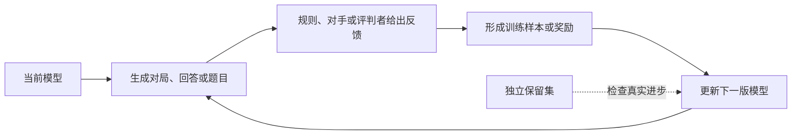
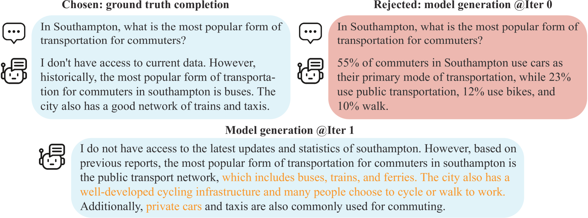
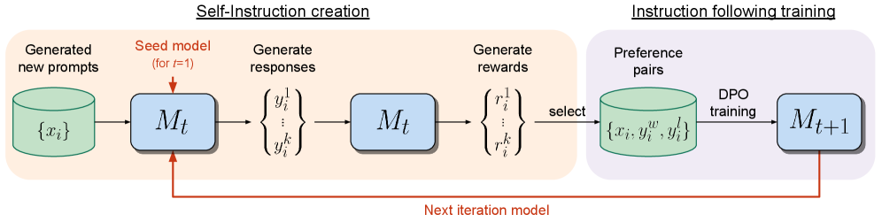
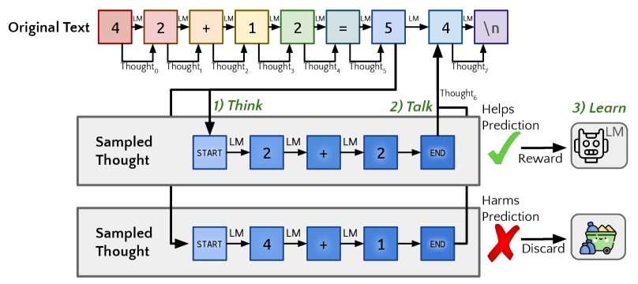

# 26.1 自博弈与训练数据生成

石头、剪刀、布只有三个动作，却足以暴露普通强化学习的一个盲点。若策略只和固定对手训练，它很快会找到克制对方的动作；一旦对手也开始学习，昨天有效的策略今天就可能失效。训练数据、奖励分布和环境动力学都随着参与者的更新而变化。

本节学习自博弈怎样让模型参与生成自己的训练数据。我们会关注一轮循环中谁提出候选、谁负责判断，以及怎样避免模型只重复自己的偏差。

之所以需要自博弈，是因为高质量人类数据终究有限，对手和任务也会变化。模型若能产生新的对局、反驳或题目，就可能继续获得训练信号；但判断标准必须独立，否则循环只会把原有错误越放越大。

自博弈把这种变化纳入训练循环：当前策略生成新的对局，新的对局又决定下一轮更新。到了语言模型中，“对局”可以是回答与判别、论证与反驳，也可以是出题者与解题者之间的能力竞赛。问题随之改变：模型生成的数据何时提供了新的学习信号，何时只会重复并放大自身偏差？

本章沿着这一问题继续展开。26.1 讨论自博弈怎样产生训练数据；26.2 区分训练时与测试时的规模扩展；26.3 进入多个语言智能体共同学习的环境；26.4 再把生成模型接入进化搜索，观察候选程序如何经过评估和选择逐代改进。

四个小节各自追问一个具体问题：

- [26.1 自博弈与自我进化](/chapter32_selfplay/self-play-outlook/)：模型能否通过自我博弈持续产生有效训练信号？
- [26.2 RL Scaling 展望](/chapter32_selfplay/rl-scaling-outlook)：训练规模与推理规模怎样改变能力上限？
- [26.3 LLM 多智能体强化学习](/chapter32_selfplay/llm-multi-agent-rl/)：多个角色如何学习协作、竞争并分配信用？
- [26.4 进化搜索与科学发现](/chapter32_selfplay/alphaevolve/)：语言模型与进化搜索怎样发现新算法和科学结果？

AlphaGo Zero 展示了一个边界清楚的例子：规则负责判断落子是否合法和谁赢得对局，策略则通过与自身历史版本对弈获得经验。围棋的胜负给出了可靠的外部锚点，因此“自己产生数据”并不等于“自己决定什么是正确的”。

语言任务缺少这样统一的胜负规则。将自博弈迁移到语言模型时，需要分别回答三个问题：谁产生候选回答，谁比较它们，比较结果如何转化为稳定的训练信号。下面从这个循环开始。



图中的独立保留集是整个循环的锚点。生成与评判都由同一个模型完成时，训练分数可以持续上升，外部任务却没有改善；保留集用来区分真实能力增长与内部评价偏好被反复放大。

## 26.1.1 从固定对手到会变化的训练分布

回到石头、剪刀、布。若固定对手每次都出石头，学习策略很快会只出布，训练胜率可以接近 100%。换成会出剪刀的对手，这个策略立即失败。固定对手提供的数据越来越重复，也没有迫使策略补上新的弱点。

现在让对手也使用学习策略。当前模型每次改进后，下一批对局随之改变；旧策略暴露的弱点会成为新训练样本。让学习中的策略参与数据生成，就称为**自博弈（Self-Play）**。

自博弈可以减少对新增示范数据的依赖，但仍然需要规则、奖励模型或人类判断来区分较好的行为。只有在明确的博弈设定中，纳什均衡才是合适的分析工具；语言模型的生成—评判循环通常只借用了自博弈的数据机制，并不天然对应一个零和博弈。



<div style="text-align: center; font-size: 0.9em; color: var(--vp-c-text-2); margin-top: -10px; margin-bottom: 20px;">
  <em>图 1：UCLA 与 UIUC 联合提出的 SPIN（Self-Play Fine-Tuning）论文架构。模型在没有任何人类新增数据的情况下，通过与"过去的自己"博弈，不断将较弱的语言模型转化为更强的语言模型。来源：<a href="https://arxiv.org/abs/2401.01335" target="_blank" rel="noopener noreferrer">SPIN Paper</a></em>
</div>

以 SPIN 为例，当前模型生成的回答构成负样本，人类数据构成正样本，模型通过区分两者并迭代更新来逼近目标数据分布。更一般的循环包含四步：

1. 模型生成多个候选回答（或在游戏中执行动作）。
2. 规则、另一个模型实例或人类评估这些回答；在游戏环境中，这一步也可以直接由胜负决定。
3. 用评估结果或胜负结果作为 reward 信号，通过 PPO 等算法更新模型策略。
4. 将更新后的模型加入到"历史对手池"中，重复循环。

### 从数学上看：对手也在改变

在普通的单智能体 RL 中，目标可以写成 $\max_\pi \mathbb{E}[R]$。在两方零和博弈中，策略还要面对对手 $\pi_{-i}$，于是价值写成 $V(\pi_i,\pi_{-i})$。当前策略一更新，对手看到的环境也随之改变。

- **零和博弈（Zero-Sum Game）**：围棋等双人对局中，一方的收益等于另一方的损失。
- **纳什均衡**：其他参与者保持策略不变时，任何一方都无法通过单独改变策略提高自己的期望收益。假设候选策略 $\pi^*$ 与自己的副本对局；若换成任意策略 $\pi$ 都不能获得更高收益，它就是一个稳定点。对称零和博弈可以用下面的教学记号表示；[PSRO 论文](https://arxiv.org/abs/1711.00832)进一步说明了如何在策略空间中维护种群并求解元博弈。
  $$
  V(\pi^*, \pi^*) \ge V(\pi, \pi^*) \quad \forall \pi
  $$
  这里 $\pi^*$ 是候选均衡策略，$V(\pi,\pi^*)$ 表示策略 $\pi$ 面对 $\pi^*$ 时的收益。这个式子解释了均衡的稳定性，但一般神经网络自博弈并不保证收敛到该点。

### 从代码上看：Fictitious Play 循环

若最新策略只和自己的当前副本对局，训练可能出现循环：策略 X 被 Y 克制，Y 又被 Z 克制，而更新后的策略忘记如何应对 X。历史模型池让当前策略同时面对多个旧版本，从而保留对过去策略的覆盖。

在游戏型自博弈中，可以使用 **虚拟对弈（Fictitious Play）** 的思想或维护 **历史模型池（Model Pool）**，让当前策略同时面对多个旧版本：

```python
def self_play_training_loop(
    env, current_model, model_pool, total_iterations, save_interval
):
    """带历史策略池的自博弈伪代码。"""

    for i in range(total_iterations):
        # 1. 以 80% 的概率和最新的自己打，20% 的概率和历史版本打
        if np.random.rand() < 0.8:
            opponent = current_model
        else:
            opponent = random.choice(model_pool)

        # 2. 在环境中收集自我对弈的数据 (Trajectories)
        trajectories = collect_self_play_data(env, current_model, opponent)

        # 3. 使用 PPO 算法更新当前模型
        current_model.update_with_ppo(trajectories)

        # 4. 定期将当前模型快照保存到历史池中，防止"灾难性遗忘"
        if i % save_interval == 0:
            model_pool.append(current_model.copy())

        # 5. 评估 ELO 积分
        evaluate_elo_rating(current_model, model_pool)
```

## 26.1.2 语言任务怎样得到“胜负”：生成、评判与辩论

围棋落子以后，规则可以直接判断胜负。开放式回答没有唯一答案，自博弈循环必须另外指定谁提出候选、谁比较候选，以及比较结果是否会进入训练。下面先看生成者与评判者，再看双方辩论怎样为评判者提供证据。

### 1. Generator-Judge 对抗训练与自我奖励 (Self-Rewarding LM)

在开放式语言任务中，系统很难像围棋那样直接得到胜负。生成者—评判者（Generator–Judge）结构补上了这一步：生成者提出多个回答，评判者给出偏好，偏好数据再用于更新生成者。评判者可能是独立奖励模型，也可能由同一个语言模型扮演。

2024 年，Meta 与 NYU 提出的 **Self-Rewarding Language Models** 让同一个模型同时承担生成回答和评判回答的工作，并通过多轮迭代构造新的偏好数据。



<div style="text-align: center; font-size: 0.9em; color: var(--vp-c-text-2); margin-top: -10px; margin-bottom: 20px;">
  <em>图 2：Self-Rewarding Language Models 的训练迭代。在每次迭代（Iteration）中，模型自己生成候选回答（M1），然后自己给这些回答打分（M2），用自己打分的数据通过 DPO 训练出下一代更强的自己（M3）。来源：<a href="https://arxiv.org/abs/2401.10020" target="_blank" rel="noopener noreferrer">Meta Paper</a></em>
</div>

**工作流**：

1. **Self-Instruction**：模型 M1 根据一批提示词生成候选回答。
2. **Self-Reward**：同一个模型 M1 根据提示词"像一个严格的裁判一样评估以上回答，并给出 0-5 分"，为自己生成的回答打分。
3. **Iterative DPO**：取高分回答和低分回答构成偏好对 $(y_w, y_l)$，使用 DPO 算法训练模型，得到更强的模型 M2。

论文实验观察到，模型的指令遵循能力和作为评判者的能力可以在迭代中同时提高。不过，这一结果仍依赖初始指令数据、评判提示和训练分布。生成者与评判者共享偏差时，高分只说明回答符合当前评判器的偏好，不能替代外部验证。

### 2. 辩论式训练 (Debate Training)

辩论式训练是 LLM 自博弈的一个前沿变体。两个大模型对同一个问题给出 **不同** 的回答，然后由一个裁判模型（或人类）判断哪个回答更好。关键在于：**两个模型可以看到对方的回答并进行反驳**。

辩论为裁判增加了可检查的信息：一方指出论证中的具体漏洞，另一方必须回应。它能否改善推理，取决于裁判能否识别有效反驳，以及训练是否避免只奖励语言上的说服力。辩论因此是一种训练与监督方案，而非严谨推理的自动保证。

```python
def debate_training(question, model_a, model_b, judge, rounds=3):
    """辩论式 RL 训练：两个模型辩论，裁判评判，用策略梯度更新"""
    # 收集完整 rollout 的 log_prob（用于策略梯度计算）
    log_probs_a, log_probs_b = [], []

    answer_a = model_a.generate(question)
    answer_b = model_b.generate(question)

    for round_idx in range(rounds):
        # A 看到B的回答，反驳（同时记录 log_prob）
        rebuttal_a, lp_a = model_a.generate_with_logprob(
            f"问题: {question}\n你的回答: {answer_a}\n"
            f"对手回答: {answer_b}\n请反驳对手。"
        )
        # B 看到A的反驳，回应
        rebuttal_b, lp_b = model_b.generate_with_logprob(
            f"问题: {question}\n你的回答: {answer_b}\n"
            f"对手反驳: {rebuttal_a}\n请回应。"
        )
        log_probs_a.append(lp_a)
        log_probs_b.append(lp_b)
        answer_a, answer_b = rebuttal_a, rebuttal_b

    # 裁判评判 → 转化为 RL reward（零和博弈：A 的收益 = -B 的收益）
    score_a, score_b = judge.evaluate(question, answer_a, answer_b)
    reward_a = score_a - score_b
    reward_b = -reward_a

    # REINFORCE 损失；外层训练器负责 backward、梯度裁剪与 optimizer.step()
    loss_a = -sum(log_probs_a) * reward_a
    loss_b = -sum(log_probs_b) * reward_b

    return loss_a, loss_b, reward_a
```

## 26.1.3 在线学习与自博弈的边界

固定偏好数据训练只覆盖收集数据时的策略分布。策略更新后会生成新的回答，其中一些回答已经偏离奖励模型熟悉的区域。在线学习重新采样当前策略的输出，再进行评估和更新，使训练数据随着策略一起变化。

以 DeepSeek-R1-Zero 的规则奖励训练为例，模型先为当前题目采样推理轨迹，规则验证最终答案，再用 GRPO 更新策略。[DeepSeek-R1 论文](https://arxiv.org/abs/2501.12948)给出了完整流程。把这段过程压缩成一行，可以写成下面的流程记号：

$$
\text{策略 } \pi_{\theta}
\xrightarrow{\text{采样}}
\text{新轨迹 } \tau
\xrightarrow{\text{规则或奖励模型}}
R(\tau)
\xrightarrow{\text{PPO/GRPO}}
\pi_{\theta'}
$$


<div style="text-align: center; font-size: 0.9em; color: var(--vp-c-text-2); margin-top: -10px; margin-bottom: 20px;">
  <em>图 3：DeepSeek-R1 的训练流水线。DeepSeek-R1-Zero 从基础模型直接进行大规模强化学习；完整的 DeepSeek-R1 还包含冷启动数据、强化学习、拒绝采样与监督微调等阶段。来源：<a href="https://arxiv.org/abs/2501.12948" target="_blank" rel="noopener noreferrer">DeepSeek-R1 论文</a></em>
</div>

DeepSeek-R1-Zero 说明了在线采样与规则奖励能够在没有监督微调冷启动的条件下改善数学和代码推理，并在训练中出现更长的推理、自我检查等行为。这里的交互对象是可验证任务与规则奖励，并没有另一个学习中的对手，因此它属于在线 RL 的邻近例子，而非严格意义上的自博弈。

## 26.1.4 三个需要分别稳定的反馈闭环

把自博弈用于持续训练时，至少有三个会互相影响的闭环：对手或数据来源、题目难度和奖励信号。逐一观察它们，能够解释训练为何会进步，也能定位退化从哪里开始。

### 对手多样性——防止策略坍缩

如果模型只和最新版本的自己对局，可能出现策略循环或遗忘：策略 A 被 B 克制，B 又被 C 克制，而 C 已经忘记如何应对 A。这种现象不要求策略位于纳什均衡附近；它来自训练分布随当前对手变化。

解决方案是**种群训练（Population-Based Training）**：维护一个包含 $K$ 个历史策略的对手池 $\Pi = \{\pi_1, \pi_2, \ldots, \pi_K\}$，每次随机抽取对手。[PSRO](https://arxiv.org/abs/1711.00832)把“扩充策略集合”和“在集合上求元策略”分开处理。若第 $k$ 个历史策略被抽到的概率是 $w_k$，对手分布可以写成

$$\pi_{\text{opponent}} = \sum_{k=1}^{K} w_k \pi_k, \quad \sum_k w_k = 1$$

其中 $w_k$ 是选择第 $k$ 个历史策略的概率。**PSRO（Policy-Space Response Oracles）** 维护策略集合，并根据经验收益矩阵求元策略，再训练对该混合策略的近似最佳响应。这个框架明确区分了“产生新策略”和“决定以多大概率遇到每个旧策略”两件事。DeepSeek-R1 的论文没有把历史对手池作为其训练机制，因此不应把它归入这一例子。

### 自适应课程——从均匀采样到难度匹配

当大部分采样全部答对或全部答错时，组内相对奖励很难提供有效梯度。课程学习据此调整题目分布，使训练集中在当前策略仍有区分度的区域。假设难度 $d$ 的题目当前通过率为 $p(d)$：通过率 90% 的题权重乘以 0.1，通过率 40% 的题权重乘以 0.6，就会把采样移向较难题。下面是表达这一想法的**教学示意式**，不是 GRPO 或某篇课程学习论文规定的采样公式：

$$\mathcal{P}^*(d) \propto \mathcal{P}_0(d) \cdot (1 - p(d))$$

这个示意式会提高低通过率题目的权重；实际系统还要限制完全无解的题目，否则样本会集中到零奖励区域。进一步的方法让出题模型生成略高于解题模型当前能力的问题。GRPO 的组内奖励方差可以作为难度信号：全组结果相同的题目对相对优势估计贡献很小。

### 奖励信号的自进化——从外部 RM 到自验证

奖励来源决定了循环能够纠正哪些错误。现有方法大致使用三类信号：

**外部奖励模型（RLHF，第 13 章）**。奖励来自人类偏好训练的奖励模型；策略离开奖励模型的训练分布后，代理奖励可能失真。

**规则验证（RLVR，第 15 章）**。奖励来自答案匹配、测试用例或证明检查器，适用于判定条件明确的任务。

**模型评判与自训练**。语言模型评估候选回答，再把高低分样本用于偏好优化。**STaR（Self-Taught Reasoner）** 提供了另一条自训练路线：模型生成推理过程，保留能得到正确答案的样本，并在失败时利用正确答案重新生成推理。它使用筛选后的推理做监督微调，不应直接等同于策略梯度 RL。



<div style="text-align: center; font-size: 0.9em; color: var(--vp-c-text-2); margin-top: -10px; margin-bottom: 20px;">
  <em>图 4：Quiet-STaR 在文本位置之间采样并行的思考片段，再学习哪些思考有助于预测后续文本。来源：<a href="https://arxiv.org/abs/2403.09629" target="_blank" rel="noopener noreferrer">Quiet-STaR 论文</a></em>
</div>

生成者与评判者来自同一模型时，评估偏差会沿训练循环累积。测试用例、证明验证器和独立评测集可以提供外部锚点。三类信号也可以组合使用：规则信号可靠但覆盖较窄，模型评判扩大覆盖范围，同时带来偏差累积风险。

## 26.1.5 循环为什么会退化

循环能够持续产生数据，也会持续传播误差。下面四项检查分别对应误差可能进入系统的位置：

- **自循环退化**：模型的自我评估带有偏差时，错误会被下一轮继续放大。测试用例、证明检查器等外部验证信号可以切断这条反馈链。
- **多样性丧失**：策略可能坍缩到狭窄的局部最优。多样性奖励和种群训练用于保留不同的对手与解法。
- **安全性风险**：自主探索可能发现有害行为模式。训练过程需要安全约束，并对新轨迹做独立筛查。
- **评估瓶颈**：随着训练数据也由模型产生，“模型是否真的进步”会越来越难判断。多维评测与对抗测试用于检查收益能否迁移到独立任务。

生成者与评判者来自同一模型时，两者的偏差可能互相强化。生成者反复采用某种表达风格，评判者又稳定偏好这种风格，训练便会提高风格特征的概率，即使任务正确率没有变化。独立验证器和保留评测集用于切断这条反馈链。

策略池中的模型若逐渐产生相同的行为，继续对局也难以覆盖新的响应。种群训练保留不同历史版本或不同初始化的策略，并通过交叉对局检查它们是否仍然构成有差异的训练分布。

## 26.1.6 怎样判断一项方法是否真的属于自博弈

自博弈和自进化会复用前面章节中的多个工具：

- 第 7 章的 AlphaGo 给出胜负规则明确的自博弈原型；第 8 章的 PPO 可以承担策略更新。
- 第 15 章的 GRPO 在同一提示下比较多条轨迹，用相对奖励估计优势；RLVR 则为可判定任务提供外部验证信号。
- 第 5 章的经验回放保存旧经验。自进化系统还会把历史轨迹提炼成题目、批评或偏好，再用于下一轮训练。
- 第 19 章的 Agentic RL 把工具调用纳入轨迹，自博弈可以进一步让模型生成新的工具使用场景。
- 训练得到的推理策略还可以和测试时搜索结合，在部署时生成并比较多个候选。

GRPO 与自博弈都可能使用同一策略生成的多条轨迹，但二者解决的问题不同。GRPO 在同一个提示下用组内奖励估计相对优势；自博弈还要求一个参与者的行为改变另一个参与者面对的环境。只有当回答之间发生交互，或一方主动产生另一方的训练任务时，博弈结构才真正出现。

判断一项方法是否属于自博弈，可以依次检查：参与者是否共同决定轨迹，参与者是否随训练更新，以及胜负或偏好是否来自独立、可校准的信号。这三项也为下一节的规模化问题提供了入口。

---

接下来讨论 [26.2 RL Scaling Laws 与 Foundation Model RL](../rl-scaling-outlook)：当采样数量、训练计算和测试时计算同时增加时，性能提升究竟来自哪里。

---

## 参考资料

- Chen Z, Deng Y, et al. "[SPIN: Self-Play Fine-Tuning Converts Weak Language Models to Strong Language Models](https://arxiv.org/abs/2401.01335)." ICML 2024. —— 将 RLHF 建模为自博弈，模型通过与"过去的自己"博弈来持续提升。

- Yuan W, Pang R Y, Cho K, et al. "[Self-Rewarding Language Models](https://arxiv.org/abs/2401.10020)." ICML 2024. —— Meta 与 NYU 联合提出自我奖励语言模型，让同一模型同时扮演 Generator 和 Judge。

- Zelikman E, et al. "[STaR: Self-Taught Reasoner](https://arxiv.org/abs/2203.14465)." NeurIPS 2022. —— 自我训练推理器，用自我生成的推理数据迭代提升。

- Lanctot M, et al. "[A Unified Game-Theoretic Approach to Multiagent Reinforcement Learning (PSRO)](https://arxiv.org/abs/1711.00832)." NeurIPS 2017. —— 统一博弈论视角下的多智能体 RL 框架，引入 Policy Space Response Oracles。

- Zhang R, Xu Z, et al. "[A Survey on Self-play Methods in Reinforcement Learning](https://arxiv.org/abs/2408.01072)." 2024. —— 自博弈 RL 领域最全面的综述，覆盖传统自博弈、PSRO、基于遗憾最小化的方法。

- DeepSeek-AI. "[DeepSeek-R1: Incentivizing Reasoning Capability in LLMs via Reinforcement Learning](https://arxiv.org/abs/2501.12948)." 2025. —— 报告 DeepSeek-R1-Zero 从基础模型直接进行强化学习，以及完整 DeepSeek-R1 的多阶段训练流程。
