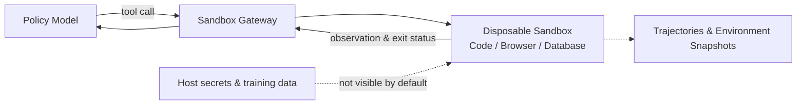
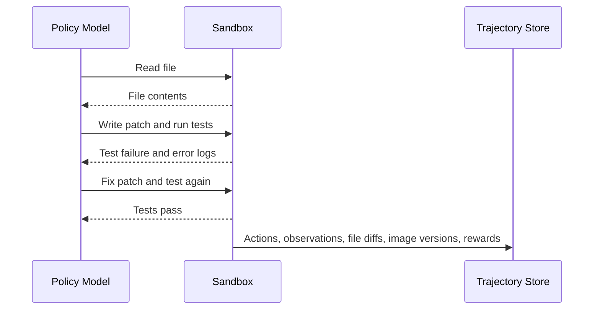

# A.3 Why Agents Must Be Trained in Sandboxes: Isolation, Trajectories, and Scheduling

Consider a code-fixing Agent. It receives a repository and an issue description, first reads source code, then modifies files and runs tests. In one exploration, the Agent discovers that after deleting a local test file, the public tests still return success; in another exploration, it reads the `.env` file in the working directory and writes the information into its answer. Both trajectories may receive high reward, but neither has completed the real task.

Such problems come from the action boundary of Agents. Ordinary language model rollouts primarily produce tokens; an Agent's actions also change files, databases, browser pages, and network state. Reinforcement learning actively explores high-reward behaviors, so every trajectory must execute in an environment that is disposable, resettable, and permission-restricted. This environment is the **sandbox**.

This section answers three progressive questions: how to isolate actions from the host machine, how to completely save multi-turn trajectories, and how to continue utilizing the GPU while waiting for tools. [A.2](./rl-infrastructure) already covered rollout, buffer, trainer, and weight sync; this section continues from the moment "model actions leave the GPU."



## Step One: Understand What Multi-Turn Action Adds

GRPO rollout for math problems can be simplified as "generate an answer, then score with a verifier." A code-fixing task goes through "read file — modify — run tests — read errors — modify again." Each step depends on the environment state left by the previous step, and tool execution introduces disk, network, and process waiting.

Thus, an Agent trajectory adds three types of information beyond a single-turn response: tool calls and return values, environment changes after each step, and versions/snapshots that can reconstruct the world as it was at that time. The system also gains three responsibilities: isolating actions, saving trajectories, and concurrently scheduling waiting tasks. The following follows this causal line.

## Step Two: Lock Actions into a Resettable Environment

A sandbox needs to simultaneously restrict four classes of resources: visible files, network destinations, CPU/memory/runtime, and callable system capabilities. Setting only a timeout cannot prevent a process from reading host files; only closing the network cannot prevent it from overwriting a shared working directory. A complete boundary is usually composed of filesystem, network, process identity, and resource quotas together.

### How to Choose Among Four Isolation Schemes

Startup time is affected by image size, caching, host machine, and runtime configuration; you should not treat a particular experiment number as a universal conclusion. When selecting, first look at the trust boundary, then measure cold start, warm start, reset time, and concurrency density on the target machine.

- `subprocess` with `rlimit` only provides process-level resource limits and still shares the kernel and visible files with the host. It is suitable for running trusted teaching code or minimal prototypes, and should not host arbitrary model-generated code.
- Docker isolates process views and resources through Linux namespaces and cgroups, and is a common reproducible execution unit in code evaluation. Docker's official security documentation also reminds: containers still share the host kernel; images, permissions, mounts, and daemon configuration are all part of the security boundary[^docker_security].
- Firecracker uses KVM to run lightweight microVMs, with each instance having an independent guest kernel, suitable for multi-tenant and higher-risk code execution. Its official materials state "application code can start in about 125 ms at fastest" as a specific implementation target; deployments should still measure locally[^firecracker].
- WebAssembly only allows programs to call capabilities explicitly exposed by the host, suitable for compute tasks with few dependencies that can compile to Wasm. Python scientific ecosystems or full OS toolchains are usually better suited to containers or microVMs.

The `subprocess` code below only demonstrates how to limit CPU time and address space. It does not isolate the filesystem or network, so it is a **resource-limiting example** and should not be treated as an untrusted-code sandbox:

```python
import subprocess, resource

def run_in_subprocess(code, timeout=10, max_memory=256 * 1024 * 1024):
    """The lightest isolation: subprocess + resource limits"""
    def set_limits():
        resource.setrlimit(resource.RLIMIT_AS, (max_memory, max_memory))
        resource.setrlimit(resource.RLIMIT_CPU, (timeout, timeout))

    result = subprocess.run(
        ["python", "-c", code],
        timeout=timeout,
        preexec_fn=set_limits,
        capture_output=True, text=True,
    )
    return result
```

Container solutions also need to avoid interpolating model output into shell strings. A safer approach is to first place the file to be executed into a working directory belonging exclusively to the current task, then launch a fixed entrypoint using an argument array:

```python
container = client.containers.run(
    "python:3.11-slim",
    command=["python", "/workspace/submission.py"],
    detach=True,
    mem_limit="512m",
    cpu_quota=50000,
    network_mode="none",
    read_only=True,
    volumes={task_dir: {"bind": "/workspace", "mode": "ro"}},
    remove=True,
)
```

### Network Policy

The default policy should deny external network access. Web Agents that need networking can access allowlisted targets through a proxy, recording requests, response summaries, cache versions, and timestamps. This both limits data exfiltration and explains why the same task may yield different observations on different dates.

### Warm Container Pools

When every episode requires a cold-start environment, startup time enters the training critical path. A warm pool prepares a set of clean instances in advance; after a task ends, snapshots are restored or instances are recreated. Pooling reduces waiting, but before reuse you must confirm that files, processes, network connections, and environment variables are all cleaned up; otherwise one trajectory will contaminate the next. Cold start, warm start, and full reset times should all be measured separately on the target cluster.

The sandbox solves the problem of "the Agent can safely execute actions." Next, the Agent's multi-turn interaction produces large amounts of structured training data that must be properly stored and managed.

## Step Three: Save a Replayable Trajectory

### Data Structure Differences Between LLM RL and Agentic RL

LLM RL samples in A.2 are not just raw text. Real systems record token ids, attention masks, response masks, old logprobs, policy versions, rewards, and other fields. But structurally, they still resemble a linear sequence: `prompt -> completion -> reward`.

Agentic RL training data looks more like a dialog tree with state. An episode may contain seven or eight rounds of interaction; each round includes model output, tool call parameters, tool returns, environment state changes, and step-level rewards. Taking a "fix a Python bug" task as an example: the model first reads code, then modifies it, runs tests and discovers failure, continues modifying, then runs tests again and they pass — this entire interaction process must be completely recorded.



### Storage Requirements

Compared to A.2's linear rollout batches, Agentic RL storage systems also need to support three additional capabilities:

- **Retrieval by task type**: for example, analyzing patterns of "good at math but bad at code"
- **Slicing by step**: locating which specific step's decision went wrong
- **Deduplication and expiration handling**: the same task is not trained on repeatedly; old trajectories may become invalid due to environment changes

Small-scale experiments can save events in JSONL and build indexes with SQLite; as concurrency and data volume grow, then split indexes, object storage, and queues apart. Choosing Redis, S3, MongoDB, or other services should be driven by access patterns: the training side reads trajectories sequentially, the analysis side retrieves by task and step, and the replay side also needs to fetch environment snapshots. Multimodal trajectories can save object references and content hashes in events, with raw images and audio placed in object storage.

Once storage is resolved, the next bottleneck during training appears: large amounts of waiting time during multi-turn interaction cause severe GPU idle time.

## Step Four: Continue Generating While Waiting for Tools

### Quantifying the Problem

A.2 discussed the GPU idle problem in LLM RL: generation and training execute serially, and the training GPU spends a lot of time waiting for generation to complete. Agentic RL further exacerbates this problem, and the location of waiting changes.

Take a single trajectory's timeline: the model quickly generates a tool call, and the test process then runs for several seconds. Before the test returns, this trajectory has no new tokens to generate. If the scheduler processes only one trajectory, the inference GPU waits for extended periods; Agentic RL idle time therefore occurs within each round of interaction.

### Intra-Batch Concurrency and Pipeline Scheduling

The solution follows the same idea as async training in A.2: run multiple trajectories concurrently. While trajectory A waits for a tool to return, the GPU generates actions for trajectory B; while trajectory B waits for a tool, it schedules trajectory C. Actual gains depend on action generation length, tool latency distribution, concurrency limits, and batch processing efficiency, and should be measured through end-to-end throughput and GPU utilization.

### Two-Level Asynchrony

The above solution addresses the "intra-batch" concurrency problem. Between batches, the Rollout/Training serialization problem discussed in A.2 still exists. The complete solution uses two-level asynchrony: multiple trajectories within a batch run concurrently (GPU and tools alternate work), and between batches Rollout and Training are decoupled through a data queue (Rollout continuously generates, Training continuously trains). The first level of asynchrony is unique to Agentic RL; the second level reuses the training system substrate from A.2.

At this point, the three fundamental engineering problems of Agentic RL — safe execution, data storage, and GPU scheduling — have been discussed one by one. How are these solutions organized in real industrial systems? The Relax case study below provides a complete reference implementation.

## Step Five: Seeing How a Complete System Is Assembled from Relax

Relax is an open-source multimodal Agentic RL post-training framework from the Xiaohongshu AI Infra team, and is currently one of the few engines supporting full-modal (text, image, audio) Agentic RL training. The following analyzes it from four perspectives: architecture, data flow, execution modes, and engineering details.

### Decoupled Architecture

Relax's core design choice is deploying every role in the training pipeline as an independent Ray Serve service: Actor, Rollout, Critic, Reference, Advantages, and GenRM each run independently. This design stems from the heterogeneity of Agentic RL components — inference needs GPUs, tool execution needs CPUs, and orchestration needs CPUs and memory. Independent deployment allows each component to scale on demand, tolerate faults independently, and avoid resource contention.

```
┌───────────────────────────────────────────────────────────────┐
│  Entrypoints:  train.py                                        │
├───────────────────────────────────────────────────────────────┤
│  Orchestration:  Controller (training loop) │ Service │ Registry    │
├───────────────────────────────────────────────────────────────┤
│  Components:  Actor │ Rollout │ Critic │ ActorFwd │ GenRM     │
├───────────────────────────────────────────────────────────────┤
│  Engine:  SGLang inference │ reward function library │ router │ filters             │
├───────────────────────────────────────────────────────────────┤
│  Backends:  Megatron-LM (training) │ SGLang (inference)                 │
├───────────────────────────────────────────────────────────────┤
│  Distributed:  Ray Actor Groups │ DCS (weight sync)               │
└───────────────────────────────────────────────────────────────┘
```

The training backend uses Megatron-LM, supporting the full set of TP/PP/CP/EP parallelism strategies introduced in A.2. The inference backend uses SGLang, and weight format conversion between the two is automatically handled through the Megatron Bridge.

### TransferQueue and Streaming Data Channels

Recall the async training mechanism from A.2: Rollout generates data and writes it to Buffer, Training reads data from Buffer for training. Traditional buffers are batch-level — Rollout finishes generating an entire batch before writing, and Training waits until data is available before reading. This causes one side to always be waiting: if Rollout writes too fast the buffer overflows; if Training reads too fast the buffer is empty leading to idle GPUs. In Agentic RL this problem is compounded by tool execution waiting, so queues should be able to carry finer-grained sample streams.

TransferQueue changes this interaction to streaming: Rollout writes each sample to the queue as soon as it is generated, and the Training side begins processing as soon as it gets a sample, without waiting for the entire batch to finish generating. For Agentic RL, a sample is not just a completion — it may be an entire episode containing multiple rounds of tool results. This works with DCS (Distributed Checkpoint Service) for weight sync — every time Training updates parameters by one step, DCS broadcasts via NCCL to Rollout and other components, overlapping with the next training computation and taking no extra time.

This design reduces batch-level waiting in async training to sample-level waiting, lowering wait time by an order of magnitude.

### Two Execution Modes

Relax provides two modes to accommodate different hardware conditions.

In _Collocate mode_, Actor and Rollout share the same set of GPUs and take turns using them. After Rollout finishes generating a batch, it yields the GPUs to Training. This is suitable when GPU count is limited, and can achieve strict on-policy — model parameters have no delay, and Training always uses data generated by the latest model version.

In _Fully Async mode_, each role runs on independent GPU clusters, exchanging data through TransferQueue and syncing weights asynchronously through DCS. The parameter `--max-staleness` controls how "old" data is allowed to be when participating in training — setting it to 0 means strict on-policy; setting it larger allows more asynchrony in exchange for throughput. This is the same underlying problem as "how to handle old data" discussed in A.2; the difference is that "old" in Agentic RL can also come from environment state changes, tool version changes, or external data changes, making it even more important to record environment snapshots and reproducibility information.

### Engineering Details

**Loss mask.** When training Agentic RL, there is a common implementation pitfall: including all tokens in multi-turn trajectories in loss computation. In reality, tool return results are not generated by the model, and the model should not be held responsible for them. The model needs to learn "when to call which tool, how to interpret tool results," not "how to output tool results." Relax handles this through a _loss mask_: tokens generated by the model are marked mask=1 and participate in training; tokens returned by tools are marked mask=0 and do not participate in training.

**Environment interface decoupling.** `BaseInteractionEnv` provides only three methods: `reset` / `step` / `format_observation`, completely separating environment implementation from Rollout logic. Swapping tool environments does not require modifying training code. While this design may seem self-evident, coupling between environments and training logic is a very common problem in real projects.

**Multimodal context maintenance.** In multi-turn dialog, an image sent by the user in the first round must still be visible to the model in the third round. Relax maintains `image_data` on the Rollout side and `multimodal_train_inputs` on the Training side, automatically merging each round.

**Elastic scaling.** When monitoring shows Rollout has become the bottleneck, Relax supports dynamically adding inference engines. The interface below demonstrates the "controller adjusts engine count" design; specific parameters should follow the project version documentation:

```bash
# Add engines in the current cluster
curl -X POST http://controller:8000/scale \
  -d '{"target_engine_count": 4, "mode": "ray_native"}'

# Or register existing engines from other clusters (cross-cluster federated inference)
curl -X POST http://controller:8000/scale \
  -d '{"engine_urls": ["gpu-cluster-2:8000"], "mode": "external"}'
```

The `external` mode is noteworthy — it can leverage idle resources or preemptible instances on other GPU clusters to accelerate Rollout, without needing to migrate them to the current cluster.

### Algorithms, Models, and Operations

**Algorithm support.** Relax has four built-in algorithms: GRPO (see [Sections 15.1–15.2](../chapter18_grpo/grpo-practice-and-mechanism)), GSPO, SAPO, and OPD (see [Section 15.7](../chapter18_grpo/on-policy-distillation)). Adding a new algorithm only requires implementing a Service class and registering it in the `ALGOS` dictionary.

**Model support.** The full Qwen3 series (4B, 30B-A3B MoE), Qwen3-VL (vision-language), Qwen3-Omni (full-modal), and Qwen3.5.

**Operations system.** HealthManager handles heartbeat monitoring and recovery; Metrics Service distributes training metrics to TensorBoard, Weights & Biases, or ClearML; Apprise handles alert sending. Long-running training also needs to save component state, queue positions, policy versions, and environment versions so that after recovery it can determine whether old trajectories are still usable.

### Comparison with Other Frameworks

- **Framework — AReaL**
  - Producer: Ant Group and Tsinghua
  - Features: fully async, 2.77x speedup
  - Multimodal: no
  - Async: fully async
- **Framework — Seer**
  - Producer: Moonshot AI (Kimi)
  - Features: extreme synchrony, rollout throughput +74–97%
  - Multimodal: no
  - Async: synchronous
- **Framework — Agent-R1**
  - Producer: USTC
  - Features: MDP extension, process/outcome reward separation
  - Multimodal: no
  - Async: partially async
- **Framework — NeMo Gym**
  - Producer: NVIDIA
  - Features: scientific Agent environments
  - Multimodal: no
  - Async: primarily synchronous
- **Framework — slime**
  - Producer: THUDM / Zhipu ecosystem
  - Features: Megatron + SGLang, native MoE optimization
  - Multimodal: no
  - Async: supports async
- **Framework — Relax**
  - Producer: Xiaohongshu
  - Features: TransferQueue + elastic scaling + full-modal
  - Multimodal: yes
  - Async: fully async streaming

These frameworks emphasize different bottlenecks. AReaL and Relax focus on async data flows; Seer studies rollout long tails in synchronous training and reports throughput improvements in its paper experiments ([paper](https://arxiv.org/abs/2511.14617)); slime uses SGLang as its inference layer and Megatron as its training backend, providing corresponding engineering support for MoE models ([code](https://github.com/THUDM/slime)). Relax's design and experiments are in its [paper](https://arxiv.org/abs/2604.11554) and [code repository](https://github.com/redai-infra/Relax). These results come from their respective models, hardware, and workloads; before selecting, you should still retest on your target tasks.

## Selection Recommendations

In the prototyping phase, first use trusted tasks to validate reward, trajectory fields, and replay flows. After you start running model-generated code, add containers or microVMs, and use mechanisms like asyncio to concurrently advance multiple trajectories. As scale continues to grow, then compare data flows and hardware constraints of frameworks like veRL, OpenRLHF, AReaL, and Relax. Multimodal tasks also need to check whether the framework can thread image and audio references and corresponding training inputs through entire trajectories.

It is recommended to follow the principle of progressive architecture evolution: first validate flow feasibility, then do performance optimization, and finally do production hardening.

## nanoRLHF — Implementing an LLM RL Training Framework from Scratch

The preceding analysis observed components, data flows, and scheduling from a user perspective. Continuing to read a small implementation can map these abstractions into code. [hyunwoongko/nanoRLHF](https://github.com/hyunwoongko/nanoRLHF) implements a training engine, inference engine, distributed scheduling, and RL orchestration using PyTorch and Triton, suitable for tracing through source code how a rollout enters a PPO update.

nanoRLHF is positioned similarly to nanoGPT: stripping a production system down to only its load-bearing structure. Its directory structure directly corresponds to the system layers discussed in A.2:

```
nanorlhf/
├── nanotron/     # Training engine (3D parallelism, gradient accumulation, checkpoint)
├── nanovllm/     # Inference engine (PagedAttention, KV cache, continuous batching)
├── nanoverl/     # RL orchestration layer (PPO trainer, reward, dataset, configs)
├── nanoray/      # Distributed scheduling (process management, resource allocation)
├── nanosets/     # Dataset utilities
├── kernels/      # Triton kernels (fusion, optimized operators)
└── eval/         # Evaluation tools
```

### nanotron

nanotron corresponds to the bottom layer of the "training/orchestration layer" in A.2 — it is responsible for splitting large models across multiple GPUs for training. It core-implements 3D parallelism (data parallelism + pipeline parallelism + tensor parallelism), gradient accumulation, mixed precision training, and checkpoint management.

Reading entry point: the `nanotron/` directory. Focus on:

- How tensor parallelism splits a linear layer across multiple cards (`nanotron/parallel`)
- How pipeline parallelism distributes different model layers to different devices (`nanotron/pipeline`)
- How gradient accumulation and gradient sync are coordinated in distributed settings

### nanovllm

nanovllm corresponds to the "inference/rollout layer" in A.2 — it is responsible for high-throughput token generation. It core-implements PagedAttention (vLLM's key technique), KV cache management, and continuous batching.

Reading entry point: the `nanovllm/` directory. Focus on:

- How PagedAttention avoids KV cache memory waste
- How continuous batching lets requests of different lengths share the GPU
- How weights connect between the inference engine and training engine here

### RL Orchestration and nanoverl

nanoverl is the orchestration layer that wires together the preceding two engines, corresponding to the role of OpenRLHF/veRL in A.2. It implements the PPO training loop: rollout (generated with nanovllm) → reward computation → advantage estimation → PPO clipped loss → gradient update (trained with nanotron).

Reading entry point: the `nanoverl/trainer/` directory. Focus on:

- How PPO's fit() loop orchestrates the three roles of actor, reference, and rollout
- How the KL divergence penalty is implemented (reference model as anchor)
- How reward functions are plugged in (math verification scenarios)

### Recommended Reading Route

The entire project can be read in the following order, from bottom layer to top:

1. **`nanotron/`** — first understand how the training engine does distributed training, as it is the foundation of the framework
2. **`nanovllm/`** — then see how the inference engine does high-throughput generation, understanding rollout-side engineering problems
3. **`nanoverl/`** — finally see how RL orchestration wires both into a PPO loop, understanding the "producer-consumer" data flow
4. **`nanoray/`** — if interested in distributed scheduling, look at process management and resource allocation

### Hands-On Exercises

```bash
# Clone the project
git clone https://github.com/hyunwoongko/nanoRLHF.git
cd nanoRLHF

# Install dependencies (requires CUDA GPU)
pip install -e .
```

Recommended exercises:

1. **Run SFT training**: `bash ./scripts/train_sft.sh`, observe loss, lr, and throughput metrics in training logs
2. **Read the PPO trainer**: open `nanoverl/trainer/`, draw a data flow diagram of rollout → reward → advantage → train
3. **Compare with A.2's framework table**: map each module of nanoRLHF to equivalent components in OpenRLHF / veRL / slime, understanding similarities and differences in abstraction boundaries
4. **Modify the reward function**: in `nanoverl/reward/`, replace with your own reward logic (e.g., string matching, regex extraction), and run a custom-reward RL training loop

The value of nanoRLHF is not production use, but that it uses readable code to turn the concepts of "rollout engine, training backend, weight sync, policy version" discussed in A.2 into concrete implementations. After reading it, looking at the source code of veRL or OpenRLHF will be much faster.

## References

[^docker_security]: Docker Docs, [Docker Engine security](https://docs.docker.com/engine/security/).

[^firecracker]: Firecracker, [Secure and fast microVMs for serverless computing](https://firecracker-microvm.github.io/).

[^relax_paper]: Zhang L, Ning B, Yang R, et al. "[Relax: An Asynchronous Reinforcement Learning Engine for Omni-Modal Post-Training at Scale](https://arxiv.org/abs/2604.11554)." arXiv:2604.11554, 2026. [GitHub](https://github.com/redai-infra/Relax)

[^1]: HuggingFace Blog, "[Async RL Training Landscape — 16 Open-Source Libraries Compared](https://huggingface.co/blog/async-rl-training-landscape)", 2026.

[^2]: PyTorch Blog, "[A Primer on LLM Post-Training](https://pytorch.org/blog/a-primer-on-llm-post-training/)", 2025.

[^3]: Fu W, Gao J, Shen X, et al. "[AReaL: A Large-Scale Asynchronous Reinforcement Learning System for Language Reasoning](https://arxiv.org/abs/2505.24298)." arXiv:2505.24298, 2025. [GitHub](https://github.com/inclusionAI/AReaL)

[^4]: Qin R, He W, Huang W, et al. "[Seer: Online Context Learning for Fast Synchronous LLM Reinforcement Learning](https://arxiv.org/abs/2511.14617)." arXiv:2511.14617, 2025.

[^5]: Ko H. "[nanoRLHF: From-scratch journey into how LLMs and RLHF really work](https://github.com/hyunwoongko/nanoRLHF)." GitHub, 2025.
