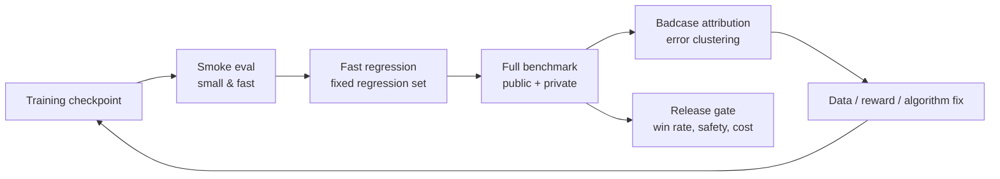

# A.4 How to Prove the Model Has Actually Improved: Evaluation Benchmarks and the Badcase Closed Loop

Suppose the same round of training produces two checkpoints. A has a training reward of 0.82 and a private task success rate of 41%; B has a training reward of only 0.65 but a private task success rate of 46%, with lower average tool-call cost as well. If you select models solely by training reward, the system will release a version that performs worse on real tasks.

Training reward answers "is the model getting better at optimizing the current reward function"; evaluation answers "has the target capability improved." Recording them separately is what allows you to detect reward bias, test contamination, cost-trading-for-score, and accidental success. For Agents, complete trajectories must also be preserved, because the same final score can come from a clean completion or from a lucky pass after many retries.

This section starts from a minimal evaluation contract, then proceeds through public benchmarks, scorers, sampling protocols, Agent trajectory evaluation, and badcase reflux. After studying it, you should be able to state three things about a checkpoint: on which tasks it has improved, whether the cost is acceptable, and how failed samples should feed into the next round of data or reward fixes.

## Step One: First Fix the Evaluation Contract

Engineering evaluation requires first writing out a clear **evaluation contract**. It must contain at least:

1. **Task distribution**: what tasks the model will encounter in the future, and what proportions are easy, medium, and hard. For example, a code agent should not only test single-file bug fixes but also cover multi-file changes, test localization, and environment issues.
2. **Execution protocol**: temperature, number of samples, context length, tool permissions, time budget, and retry rules must all be fixed. Otherwise the same model under a different set of runtime conditions yields incomparable scores.
3. **Scorer**: tasks with deterministic answers should prioritize rules, verifiers, unit tests, or environment state checks; open-ended dialog and writing use LLM-as-Judge. The closer the scorer is to real task outcomes, the more reliable the benchmark.
4. **Control group**: state whether the new checkpoint is compared against SFT, the previous RL checkpoint, or the production model. Without a control group, a single score by itself can hardly demonstrate genuine improvement.
5. **Split method**: training set, development set, public test set, and private test set must be isolated. The dev set can be used for repeated iteration; the private test set is only for release gates, otherwise it will quickly be contaminated by the tuning process.
6. **Failure taxonomy**: every badcase must be attributable to data, reward, algorithm, tools, evaluation, or safety problems. Only when attribution is possible can errors become next-round data supplements, reward fixes, or release gates.

HELM organizes evaluation into scenarios and multi-dimensional metrics, reminding researchers to simultaneously report different lines of evidence such as accuracy, robustness, calibration, and risk[^helm]. RL especially needs this decomposition, because training directly chases whatever metrics are written into the reward function.



A practical cadence is: run a small eval for every checkpoint, run the full public set daily, and run the private set plus human spot-checks for every candidate release. The private set must not be repeatedly seen by training scripts, prompt tuning, or reward design, otherwise it quickly degenerates into a training set.

## Step Two: Select Public Benchmarks by Capability

Public benchmarks supplement coverage; they cannot replace private sets that are close to real business needs. The index below preserves official homepages, repositories, or dataset addresses, and describes what evidence each benchmark can provide by task type. When selecting, take only the set directly relevant to the target capability; avoid mixing all scores into one total.

- **Type — Foundation LLM**
  - Benchmark: MMLU
  - Address: [HF Dataset](https://huggingface.co/datasets/cais/mmlu)
  - Primary metric: accuracy
  - Questions it can answer: general knowledge and multi-disciplinary multiple-choice capability[^mmlu]
- **Type — Foundation LLM**
  - Benchmark: MMLU-Pro
  - Address: [HF Dataset](https://huggingface.co/datasets/TIGER-Lab/MMLU-Pro), [GitHub](https://github.com/TIGER-AI-Lab/MMLU-Pro)
  - Primary metric: accuracy
  - Questions it can answer: harder multi-disciplinary reasoning, suitable for replacing gradually saturating MMLU[^mmlupro]
- **Type — Foundation LLM**
  - Benchmark: GPQA
  - Address: [HF Dataset](https://huggingface.co/datasets/Idavidrein/gpqa), [GitHub](https://github.com/idavidrein/gpqa)
  - Primary metric: accuracy
  - Questions it can answer: graduate-level science Q&A, checking deep reasoning and resistance to search leakage[^gpqa]
- **Type — Math / RLVR**
  - Benchmark: GSM8K
  - Address: [HF Dataset](https://huggingface.co/datasets/openai/gsm8k)
  - Primary metric: exact match, pass@k
  - Questions it can answer: elementary school math multi-step reasoning, suitable for quick smoke eval[^gsm8k]
- **Type — Math / RLVR**
  - Benchmark: MATH
  - Address: [GitHub](https://github.com/hendrycks/math)
  - Primary metric: exact match, pass@k
  - Questions it can answer: competition math and verifiable reasoning[^math]
- **Type — Code**
  - Benchmark: HumanEval
  - Address: [GitHub](https://github.com/openai/human-eval)
  - Primary metric: pass@1, pass@k
  - Questions it can answer: Python function generation and unit test pass rates[^humaneval]
- **Type — Code**
  - Benchmark: LiveCodeBench
  - Address: [Official site](https://livecodebench.github.io/), [GitHub](https://github.com/LiveCodeBench/LiveCodeBench)
  - Primary metric: pass@1, pass@k
  - Questions it can answer: continuously updated code capability, reducing public problem contamination[^livecodebench]
- **Type — Instruction following**
  - Benchmark: IFEval
  - Address: [Official code](https://github.com/google-research/google-research/tree/master/instruction_following_eval)
  - Primary metric: prompt-level / instruction-level accuracy
  - Questions it can answer: automatically checkable constraints on format, length, keywords, etc.[^ifeval]
- **Type — Preference / RM**
  - Benchmark: AlpacaEval
  - Address: [Official site](https://tatsu-lab.github.io/alpaca_eval/), [GitHub](https://github.com/tatsu-lab/alpaca_eval)
  - Primary metric: win rate, LC win rate
  - Questions it can answer: open-ended instruction following and preference win rates[^alpacaeval]
- **Type — Preference / RM**
  - Benchmark: RewardBench
  - Address: [HF Dataset](https://huggingface.co/datasets/allenai/reward-bench), [GitHub](https://github.com/allenai/reward-bench)
  - Primary metric: pairwise accuracy
  - Questions it can answer: whether the reward model actually prefers good answers[^rewardbench]
- **Type — VLM**
  - Benchmark: MMMU
  - Address: [Official site](https://mmmu-benchmark.github.io/), [GitHub](https://github.com/MMMU-Benchmark/MMMU), [HF Dataset](https://huggingface.co/datasets/MMMU/MMMU)
  - Primary metric: accuracy
  - Questions it can answer: multi-disciplinary, multi-diagram, multimodal expert-level understanding[^mmmu]
- **Type — VLM**
  - Benchmark: MMBench
  - Address: [Official site](https://opencompass.openxlab.space/omnimmbench), [GitHub](https://github.com/open-compass/MMBench)
  - Primary metric: accuracy, circular eval accuracy
  - Questions it can answer: fine-grained VLM capabilities such as perception, attributes, relations, and logic[^mmbench]
- **Type — VLM**
  - Benchmark: MathVista
  - Address: [Official site](https://mathvista.github.io/)
  - Primary metric: accuracy
  - Questions it can answer: mathematical reasoning in figures, tables, and geometric scenes[^mathvista]
- **Type — VLM**
  - Benchmark: ChartQA
  - Address: [GitHub](https://github.com/vis-nlp/ChartQA)
  - Primary metric: relaxed accuracy, exact match
  - Questions it can answer: chart Q&A, numeric reading, trend understanding[^chartqa]
- **Type — VLM**
  - Benchmark: DocVQA
  - Address: [Official site](https://site.docvqa.org/datasets/docvqa)
  - Primary metric: ANLS
  - Questions it can answer: document image understanding, OCR, layout Q&A[^docvqa]
- **Type — Tool use**
  - Benchmark: BFCL
  - Address: [Leaderboard](https://gorilla.cs.berkeley.edu/leaderboard), [Project page](https://sky.cs.berkeley.edu/project/berkeley-function-calling-leaderboard/)
  - Primary metric: AST match, executable accuracy
  - Questions it can answer: function selection, parameter generation, multi-tool calls[^bfcl]
- **Type — Tool use**
  - Benchmark: API-Bank
  - Address: [GitHub](https://github.com/AlibabaResearch/DAMO-ConvAI/tree/main/api-bank)
  - Primary metric: API call accuracy, response quality
  - Questions it can answer: end-to-end API retrieval, planning, and calling capability[^apibank]
- **Type — Software Engineering Agent**
  - Benchmark: SWE-bench
  - Address: [Official site](https://www.swebench.com/), [GitHub](https://github.com/SWE-bench/SWE-bench)
  - Primary metric: resolved rate, pass@1
  - Questions it can answer: real GitHub issue fixing and repository-level testing[^swebench]
- **Type — Web Agent**
  - Benchmark: WebArena
  - Address: [Official site](https://webarena.dev/), [GitHub](https://github.com/web-arena-x/webarena)
  - Primary metric: task success
  - Questions it can answer: browser operations, forms, shopping, GitLab, and other real web tasks[^webarena]
- **Type — General Agent**
  - Benchmark: GAIA
  - Address: [HF Dataset](https://huggingface.co/datasets/gaia-benchmark/GAIA), [Leaderboard](https://huggingface.co/spaces/gaia-benchmark/leaderboard)
  - Primary metric: final answer accuracy
  - Questions it can answer: search, files, multimodal, and reasoning combinations[^gaia]
- **Type — Workflow Agent**
  - Benchmark: Claw-Eval-Live
  - Address: [Project page](https://claw-eval-live.github.io/), [Paper](https://arxiv.org/abs/2604.28139)
  - Primary metric: pass rate, completion score
  - Questions it can answer: enterprise workflow tasks refreshed quarterly to match market demand[^clawevallive]
- **Type — Economic Agent**
  - Benchmark: ClawWork
  - Address: [GitHub](https://github.com/HKUDS/ClawWork), [Project page](https://hkuds.github.io/ClawWork/)
  - Primary metric: net income, survival, task quality
  - Questions it can answer: making agents complete occupational tasks and earn income under cost constraints[^clawwork]
- **Type — Desktop Agent**
  - Benchmark: OSWorld
  - Address: [Official site](https://os-world.github.io/)
  - Primary metric: task success
  - Questions it can answer: real desktop application and operating system tasks[^osworld]
- **Type — User Interaction Agent**
  - Benchmark: tau-bench / tau2-bench
  - Address: [Official site](https://www.taubench.com/), [GitHub](https://github.com/sierra-research/tau2-bench)
  - Primary metric: pass^k, database state
  - Questions it can answer: customer service, booking, retail, and other multi-turn tool-user interactions[^taubench]
- **Type — Multi-Environment Agent**
  - Benchmark: AgentBench
  - Address: [GitHub](https://github.com/THUDM/AgentBench)
  - Primary metric: environment success rate
  - Questions it can answer: Web, database, command-line, games, and other multi-environment agent capabilities[^agentbench]

## Step Three: Evaluating Whether RL Post-Training Actually Gains

"RL post-training" here primarily refers to RLHF, RLAIF, DPO/IPO/KTO, PPO, GRPO, RLVR, and other post-training methods. The evaluation goal is not to prove the model is "smart," but to answer three questions:

- **Has capability improved**: whether math, code, instruction following, factuality, and safety are better than the baseline.
- **Has preference aligned**: whether humans or target users prefer the new model.
- **Has reward been distorted**: whether samples scored highly by the reward model / verifier are genuinely high-quality.

### Capability Matrix

- **Capability line — Instruction following**
  - Common benchmarks: IFEval, MT-Bench, AlpacaEval
  - Primary metrics: rule satisfaction rate, pairwise win rate
  - Questions it can answer: whether the model answers under constraints, whether it better matches preferences
  - Risk points: LLM judges may favor length, politeness, and confidence[^mtbench][^ifeval]
- **Capability line — Math and RLVR**
  - Common benchmarks: GSM8K, MATH, AIME-style private problems
  - Primary metrics: exact match, pass@k, verifier accuracy
  - Questions it can answer: whether verifiable reasoning improved
  - Risk points: answer leakage, format rewards being gamed[^gsm8k][^math]
- **Capability line — Code**
  - Common benchmarks: HumanEval, MBPP, LiveCodeBench
  - Primary metrics: pass@1, pass@k, test pass rate
  - Questions it can answer: whether generated code is actually runnable
  - Risk points: public problem contamination, example-test overfitting[^humaneval][^livecodebench]
- **Capability line — General coverage**
  - Common benchmarks: HELM-style multi-scenario evaluation
  - Primary metrics: accuracy, robustness, calibration, toxicity
  - Questions it can answer: whether the model only improved on a single capability
  - Risk points: many metrics; primary metric must be explicit[^helm]
- **Capability line — Reward model**
  - Common benchmarks: RewardBench, internal preference sets
  - Primary metrics: pairwise accuracy, segment accuracy
  - Questions it can answer: whether reward aligns with human preferences
  - Risk points: RM training and eval sets being from the same source inflates scores[^rewardbench]

Don't simply weight these benchmarks into a single "total score." A better approach is to set a **primary metric + regression gates**:

- **Goal — Primary metric:** math RLVR projects look at MATH / AIME pass@1; code RL projects look at LiveCodeBench pass@1
- **Goal — Hard gate:** safety violation rate must not rise; format failure rate must not exceed a threshold
- **Goal — Regression gate:** general dialog, short instructions, and existing business tasks must not significantly regress
- **Goal — Diagnostic metrics:** output length, refusal rate, repetition rate, KL, entropy, reward margin

### Evaluation Protocol

The same model can yield completely different conclusions under different evaluation protocols. RL post-training must at least fix the following parameters:

```yaml
model: qwen-rl-step-1800
baseline: qwen-sft
sampling:
  temperature: 0.6
  top_p: 0.95
  n: 1
  max_tokens: 4096
judge:
  type: rule_then_llm_judge
  order_randomization: true
  tie_policy: count_as_half
split:
  dev: visible_for_iteration
  test_public: reported_every_night
  test_private: release_gate_only
```

If the task has a deterministic answer, prioritize rules, unit tests, or verifiers. Only open-ended dialog, writing, and preference evaluation tasks should use LLM-as-Judge, and order randomization, a small number of human spot-checks, and judge drift monitoring should be done. Experience from MT-Bench and Chatbot Arena shows that LLM judges are very useful, but they themselves introduce position bias, length bias, and model preferences[^mtbench].

### Scorers and Toolchains

After the evaluation protocol is set, the next step is not immediately finding the "strongest judge," but first determining what kind of evidence the task needs. Rules, tests, and environment state checks can answer "was it completed"; LLM-as-Judge can answer "is the quality as good as humans would want"; trajectory evaluation tools can answer "how did the agent complete it, or where did it fail." These names appear frequently in papers and engineering projects, and can be understood in four categories below.

- **Name — G-Eval**
  - Type: LLM-as-Judge method
  - Problem it solves: using a strong model to score open-ended outputs by rubric and evaluation steps, more suitable than BLEU/ROUGE for subjective tasks like summarization, dialog, and writing[^geval]
  - Position in projects: preference evaluation, open-ended response quality scoring
- **Name — MAJ-EVAL**
  - Type: Multi-Agent-as-Judge method
  - Problem it solves: having multiple reviewer personas discuss and score from different dimensions, reducing single-judge perspective bias[^majeval]
  - Position in projects: high-risk open-ended evaluation, paper/report/complex task scoring
- **Name — DeepEval**
  - Type: LLM application evaluation framework
  - Problem it solves: organizing eval like writing tests, with built-in G-Eval, RAG, agent task completion, tool correctness, and other metrics[^deepeval]
  - Position in projects: local regression tests, lightweight evaluation in CI
- **Name — agentevals**
  - Type: Agent trajectory evaluation tool
  - Problem it solves: doing reference matching, LLM judging, or trace-level scoring on tool-call trajectories; the LangChain version leans toward trajectory matching, the OpenTelemetry version toward production trace evaluation[^agentevals]
  - Position in projects: Agent regression tests, badcase localization

An easy point of confusion: **G-Eval and MAJ-EVAL are scoring methods; DeepEval and agentevals are engineering tools**. The former answers "how to judge quality," the latter answers "how to plug that judgment into a project." In RL post-training, neither can replace a verifier; if math, code, or database states can be deterministically verified, deterministic verification should be used first. LLM judges are better suited to supplementing dimensions that are hard to write as rules, such as semantic quality, user experience, and explanatory completeness.

### Number of Samples

A common misjudgment in RL post-training comes from `pass@k`. A model whose `pass@8` improves may simply be better at "trying multiple times," and does not necessarily represent stronger `pass@1`. Reports should at least separate:

- **Metric — `pass@1`**
  - Meaning: single-attempt success rate
  - When to look: default product experience, online quality
- **Metric — `pass@k`**
  - Meaning: at least one success across multiple samples
  - When to look: search / rerank / self-consistency systems
- **Metric — `majority@k`**
  - Meaning: success rate after majority voting
  - When to look: math, verifiable reasoning
- **Metric — `best-of-n`**
  - Meaning: selecting the best using reward / verifier
  - When to look: checking whether reward actually picks good answers

If the training goal is improving single-attempt usability, don't report only `pass@k`. If the product inherently does multi-candidate search, also report cost: how many extra tokens, verifier calls, and latency are needed per 1-point improvement.

## Step Four: Bring the Agent's Full Trajectory into Evaluation

The object of Agentic RL evaluation is not a single answer, but a **trajectory**:

```text
Initial state → observation → think/plan → tool call → environment change → re-observe → ... → final state
```

Therefore, agent benchmarks must additionally define:

- How to restore the initial environment: whether browser, code repository, database, API, and filesystem are reproducible.
- What the tool permissions are: whether networking is allowed, whether files can be written, whether tests can be executed, whether paid APIs can be called.
- What the success criteria are: final answer, environment state diff, whether tests pass, whether the user simulator is satisfied.
- What the budget is: maximum steps, maximum time, maximum tokens, maximum tool calls.
- How trajectories are audited: every step's observation, action, tool result, and error recovery must be replayable.

### Benchmark Map

- **Scenario — API / function calling**
  - Representative benchmarks: API-Bank, BFCL-class evaluations
  - Primarily tests: parameter selection, call order, tool return handling
  - Scoring method: JSON / API call exact match or execution results[^apibank]
- **Scenario — Real web tasks**
  - Representative benchmark: WebArena
  - Primarily tests: multi-site browsing, forms, shopping, information lookup
  - Scoring method: environment final state and task answer[^webarena]
- **Scenario — Software engineering agents**
  - Representative benchmarks: SWE-bench, SWE-bench Verified
  - Primarily tests: real GitHub issue fixing
  - Scoring method: repository test pass rates[^swebench]
- **Scenario — General assistants**
  - Representative benchmark: GAIA
  - Primarily tests: search, reasoning, multimodal, tool combinations
  - Scoring method: final answer accuracy[^gaia]
- **Scenario — Dynamic workflows**
  - Representative benchmark: Claw-Eval-Live
  - Primarily tests: enterprise services, workspace fixes, cross-system flows
  - Scoring method: fixed snapshot tasks + rule checks + structured judge[^clawevallive]
- **Scenario — Economic survival**
  - Representative benchmark: ClawWork
  - Primarily tests: task quality, cost control, long-term returns
  - Scoring method: income, API costs, balance, task quality[^clawwork]
- **Scenario — Desktop/operating system**
  - Representative benchmark: OSWorld
  - Primarily tests: GUI operations, files, application workflows
  - Scoring method: state checks and task completion rates[^osworld]
- **Scenario — User-tool multi-turn interaction**
  - Representative benchmark: tau-bench
  - Primarily tests: conversational business processes, rule following, tool use
  - Scoring method: user simulator + database state[^taubench]
- **Scenario — Multi-environment agents**
  - Representative benchmark: AgentBench
  - Primarily tests: Web, database, command-line, games, and other multi-environments
  - Scoring method: per-environment success rates[^agentbench]

When selecting benchmarks, first clarify which task category the Agent is most likely to fail on. Code-fixing Agents need repository-level tasks like SWE-bench more; customer service, booking, or CRM Agents need tau-bench-style user simulation and database state validation; browser Agents need reproducible environments like WebArena.

### Agent Metrics

Agentic RL must at least simultaneously look at outcome, process, and cost.

- **Metric — `task_success`**
  - Explanation: whether the task was ultimately completed
  - Why it matters: primary metric, directly corresponds to reward
- **Metric — `state_success`**
  - Explanation: whether the environment state reached the target
  - Why it matters: prevents saying the correct answer without actually operating successfully
- **Metric — `tool_success`**
  - Explanation: whether tool calls are legitimate and parameters correct
  - Why it matters: localizes tool-use capability
- **Metric — `recovery_rate`**
  - Explanation: ability to recover after tool failure or observation error
  - Why it matters: core capability for long-horizon tasks
- **Metric — `steps_to_success`**
  - Explanation: steps needed to succeed
  - Why it matters: measures efficiency and planning quality
- **Metric — `cost_to_success`**
  - Explanation: tokens, time, API costs
  - Why it matters: release threshold
- **Metric — `safety_violation`**
  - Explanation: privilege escalation, leakage, destructive operations
  - Why it matters: agents can cause real side effects more easily than ordinary LLMs
- **Metric — `trajectory_quality`**
  - Explanation: whether plans are reasonable, whether there is repeated trial-and-error
  - Why it matters: diagnostic signal, should not be the sole reward

Process scoring is tempting, but don't let it outweigh final outcomes. An agent that explains every step beautifully but fails to complete the task is not a good agent. A safer approach is: final state carries the main weight; process scoring is used primarily for badcase attribution and training data generation.

### Rollout Cards and Reducing Scores Back to Evidence

Even when an agent benchmark gives `task_success = 62%`, you still need to state whether failed runs were discarded, how timeouts are counted, whether tool errors count toward cost, and how multiple samples of the same task are aggregated. **Rollout Cards** propose treating the rollout record itself as the basic unit of evaluation, so that final scores can be traced back to auditable evidence[^rolloutcards].

A practical rollout card should preserve at least:

- **Raw trajectory**: every step's observation, action, tool result, error, retry, and final output.
- **Reporting rules**: which runs are counted, which are skipped, how timeouts, crashes, and empty responses are treated.
- **Cost and time**: tokens, tool calls, API charges, wall-clock time, and concurrency settings.
- **Scoring view**: how final answer score, environment state score, process score, and human spot-check results are each computed.
- **Drops manifest**: failed, errored, and skipped samples must not disappear — they must be listed separately.

This aligns with traditional RL intuition: the policy doesn't learn on an isolated answer, but exposes capability on individual trajectories / rollouts. For Agentic RL, the value of the rollout card is turning "model A is 3 points higher than model B" into an auditable question: is it actually better at completing tasks, or better at avoiding failed samples? Did success rate go up, or did cost double to buy it? Is the process more stable, or did reporting rules change?

## Step Five: Run Three Minimal Standard Tests to Completion

If you only read papers and leaderboards, it's easy to feel benchmarks are far from the training system. In practice, you can start with three minimal closed loops: foundation LLM, VLM, and tool calling / agent. Each closed loop must include a fixed protocol, machine-readable reports, badcase attribution, and next-round improvement actions.

### Foundation LLM with MMLU + GSM8K + IFEval

This line answers "did RL post-training damage foundation capabilities and instruction stability." A lightweight combination is: MMLU-Pro or MMLU for knowledge coverage, GSM8K for verifiable reasoning, and IFEval for format and constraints.

```yaml
suite: llm_core_regression_v1
model: qwen2.5-7b-grpo-step-1800
baseline: qwen2.5-7b-sft
generation:
  temperature: 0.0
  top_p: 1.0
  max_tokens: 2048
datasets:
  - name: mmlu_pro
    split: test
    metric: accuracy
  - name: gsm8k
    split: test
    metric: exact_match
  - name: ifeval
    split: test
    metric: prompt_level_accuracy
```

Suppose one eval outputs:

```text
checkpoint: qwen2.5-7b-grpo-step-1800
baseline: qwen2.5-7b-sft
mmlu_pro_accuracy: 44.8% -> 44.1% (-0.7)
gsm8k_exact_match: 72.4% -> 77.9% (+5.5)
ifeval_prompt_accuracy: 63.0% -> 57.2% (-5.8)
response_length_mean: 612 -> 941 (+53.8%)
badcase_top:
  - ifeval_keyword_missing: 74 cases
  - ifeval_length_constraint_violation: 61 cases
  - gsm8k_final_answer_format_error: 19 cases
release_decision: block
```

This result shows math RLVR has gains, but instruction following clearly regressed and outputs became longer. The next round should not just add more math problems; it should:

- Split IFEval failure samples into four categories: "keyword constraints, length constraints, format constraints, language constraints," and add them to the regression set.
- In reward, score "answer correctness" and "final format correctness" separately, to avoid the model only learning long reasoning.
- Add a short-response retention set, set a `response_length_mean` cap or length-normalized judge.
- Add a verifier for GSM8K format failures: only give full credit when the final answer is parseable.

### MMMU + MathVista + ChartQA

VLM evaluation cannot look only at final text, because errors can come from OCR, image localization, visual relations, mathematical reasoning, or answer format. A common combination is MMMU for multi-disciplinary image-text understanding, MathVista for visual math, and ChartQA for chart reading.

```yaml
suite: vlm_reasoning_regression_v1
model: qwen-vl-rl-step-900
baseline: qwen-vl-sft
generation:
  temperature: 0.0
  max_tokens: 1024
input:
  image_resolution: 1344
  preserve_aspect_ratio: true
metrics:
  - accuracy
  - relaxed_numeric_accuracy
  - ocr_error_rate
  - answer_parse_fail_rate
```

Suppose the output is:

```text
checkpoint: qwen-vl-rl-step-900
mmmu_val_accuracy: 42.0% -> 44.6% (+2.6)
mathvista_accuracy: 37.5% -> 38.1% (+0.6)
chartqa_relaxed_accuracy: 61.8% -> 54.7% (-7.1)
answer_parse_fail_rate: 3.2% -> 4.9% (+1.7)
badcase_top:
  - chart_axis_value_misread: 88 cases
  - table_header_binding_error: 43 cases
  - geometry_diagram_spatial_relation_error: 31 cases
release_decision: block_for_chart_tasks
```

This result is not "VLM got worse overall" — chart reading and table-header binding regressed. The next round of improvements should target visual inputs and task distribution:

- Add SFT / RLVR data for ChartQA-type tasks with local cropping, axis reading, and table header alignment.
- Change numeric answer scoring to two-tier `exact + relaxed numeric`, to avoid penalizing units, decimal places, and comma formatting.
- Log OCR / visual grounding errors separately for chart tasks, rather than mixing them into reasoning errors.
- If images were resized during training, check aspect ratios and resolutions; chart problems are usually more sensitive to compression than natural images.

### Tool Use and Agents with BFCL + API-Bank + SWE-bench

For tool calling, first run BFCL or API-Bank to confirm "function names, parameters, and call order" are reliable; end-to-end code agents then run SWE-bench Verified or internal repository tasks. Don't start by looking only at SWE-bench resolved rate, because a low score may simply be from broken tool-call JSON.

```yaml
suite: agent_tool_regression_v1
model: code-agent-rl-step-2400
baseline: code-agent-sft
tool_protocol:
  parallel_tool_calls: true
  max_tool_calls: 50
  max_wall_time_minutes: 20
datasets:
  - name: bfcl_v3
    metric: executable_accuracy
  - name: api_bank
    metric: api_call_accuracy
  - name: swebench_verified
    metric: resolved_rate
```

Suppose the output is:

```text
checkpoint: code-agent-rl-step-2400
bfcl_executable_accuracy: 82.1% -> 85.6% (+3.5)
api_bank_call_accuracy: 68.4% -> 66.9% (-1.5)
swebench_verified_resolved: 27.0% -> 32.4% (+4.4)
avg_tool_calls_successful_tasks: 18.6 -> 27.9 (+50.0%)
tool_error_recovery_rate: 41.2% -> 37.5% (-3.7)
safety_violation_rate: 0.3% -> 0.9% (+0.6)
release_decision: research_only
```

Here SWE-bench improved, but cost and safety clearly regressed. The next round should:

- When distilling successful trajectories, retain shorter paths and add penalties for "repeated searches, repeated file reads, and invalid test reruns."
- Make a separate curriculum for tool error recovery: sample timeouts, permission denials, empty results, and JSON schema errors separately.
- Add rule-based gates for dangerous actions — for example, deleting files, changing CI, skipping tests, or expanding privileges must trigger refusal or human confirmation.
- Set both `resolved_rate` and `cost_to_success` as release gates, to prevent the model from trading high cost for a small success-rate gain.

## Step Six: Using Capability Portraits to Locate Regressions

Many papers use radar charts to display "model capability portraits." They are good for telling a story: you can see at a glance whether a checkpoint got stronger at math and weaker at instruction following, or whether agent success rates went up but costs got worse. But radar charts can also mislead, so do three things before drawing:

1. **Unify direction**: all axes must be "higher is better." For example, `safety_violation_rate` should first be converted to `safety_score = 100 * (1 - violation_rate / max_bad_rate)`.
2. **Unify scale**: all axes should be normalized to 0-100. Accuracy can be multiplied by 100 directly; cost, latency, and tool call counts should use min-max or threshold normalization.
3. **Keep the raw table**: radar charts are only for display; reports must still include raw metrics, to prevent readers from looking only at shapes without looking at values.

### Reproducing Which Paper Figures

The two examples below are not "pick a few metrics and draw a circle"; they reproduce the structure of two common types of paper figures, placing the **reference paper, original paper figure, and new figure after running** side by side for comparison:

- **MMBench-style VLM 20-dimension capability radar**: MMBench in Figure 1 plots results of 8 representative VLMs across 20 fine-grained capability axes, such as action recognition, OCR, spatial relationships, physical relations, identity reasoning, etc.[^mmbench]. This type of figure is good for answering: which visual capabilities did VLM post-training actually enhance, and which capabilities were dragged down by training side effects?
- **AgentBench-style multi-environment Agent radar**: AgentBench evaluates agents across eight interactive environments: OS, DB, KG, DCG, LTP, HH, WS, WB[^agentbench]. This type of figure is good for answering: is an agent only good at writing SQL / shell, or can it maintain stability across web, game, and home environments?

The values below are **hypothetical evaluation results**, used only to demonstrate the reproduction method. When reproducing original paper figures, you should enter model scores reported by the paper into the same data structure, or read them from official leaderboards / JSON results.

### How to Run

Save the script below as `scripts/plot_paper_style_radar.py`:

```bash
python -m pip install matplotlib
python scripts/plot_paper_style_radar.py
```

```python
from pathlib import Path
import math
import matplotlib.pyplot as plt

OUT = Path("docs/appendix_industrial_training/images")
OUT.mkdir(parents=True, exist_ok=True)

COLORS = ["#2b6cb0", "#c53030", "#2f855a", "#6b46c1"]


def closed(values):
    return values + values[:1]


def plot_paper_radar(title, metrics, series, output_path, subtitle=None):
    angles = [2 * math.pi * i / len(metrics) for i in range(len(metrics))]
    angles = closed(angles)

    fig, ax = plt.subplots(figsize=(7.6, 6.4), subplot_kw={"polar": True})
    fig.patch.set_facecolor("white")
    ax.set_facecolor("#fbfbfd")
    ax.set_theta_offset(math.pi / 2)
    ax.set_theta_direction(-1)
    ax.set_ylim(0, 100)
    ax.set_xticks(angles[:-1])
    ax.set_xticklabels(metrics, fontsize=9)
    ax.set_yticks([20, 40, 60, 80, 100])
    ax.set_yticklabels(["20", "40", "60", "80", "100"], fontsize=8, color="#64748b")
    ax.grid(color="#cbd5e1", linewidth=0.9)
    ax.spines["polar"].set_color("#94a3b8")

    for idx, (name, values) in enumerate(series.items()):
        color = COLORS[idx % len(COLORS)]
        values = closed(values)
        ax.plot(angles, values, color=color, linewidth=2.4, marker="o", markersize=3.2, label=name)
        ax.fill(angles, values, color=color, alpha=0.08)

    ax.set_title(title, y=1.12, fontsize=13, fontweight="bold")
    if subtitle:
        fig.text(0.5, 0.905, subtitle, ha="center", va="center", fontsize=9, color="#475569")
    ax.legend(loc="upper center", bbox_to_anchor=(0.5, -0.08), ncol=min(3, len(series)), frameon=False)
    fig.tight_layout(pad=2.0)
    fig.savefig(output_path, dpi=180, bbox_inches="tight")
    plt.close(fig)


mmbench_metrics = [
    "Identity\nReasoning",
    "Future\nPrediction",
    "Function\nReasoning",
    "Celebrity\nRecognition",
    "Attribute\nRecognition",
    "Attribute\nComparison",
    "Action\nRecognition",
    "Struct. Img-Text\nUnderstanding",
    "Spatial\nRelationship",
    "Social\nRelation",
    "Physical\nRelation",
    "Physical\nProperty",
    "OCR",
    "Object\nLocalization",
    "Natural\nRelation",
    "Image\nTopic",
    "Image\nStyle",
    "Image\nScene",
    "Image\nQuality",
    "Image\nEmotion",
]
mmbench_series = {
    "VLM-SFT": [68, 48, 61, 55, 66, 50, 74, 31, 38, 44, 55, 37, 62, 49, 60, 78, 64, 69, 35, 54],
    "VLM-RL": [72, 52, 66, 58, 70, 55, 78, 40, 47, 49, 60, 43, 55, 53, 64, 80, 66, 73, 38, 58],
    "VLM-RL + OCR mix": [73, 56, 67, 60, 72, 57, 79, 48, 51, 52, 63, 46, 69, 56, 66, 81, 68, 74, 45, 60],
}
plot_paper_radar(
    "MMBench-style 20-ability VLM radar",
    mmbench_metrics,
    mmbench_series,
    OUT / "radar-llm-core-regression.png",
    "Axes follow MMBench Figure 1; numbers are hypothetical post-training eval results.",
)

agentbench_metrics = ["OS", "DB", "KG", "DCG", "LTP", "HH", "WS", "WB"]
agentbench_series = {
    "Agent-SFT": [27.0, 41.0, 32.0, 45.0, 35.0, 21.0, 31.0, 18.0],
    "Agent-RL": [46.0, 49.0, 38.0, 43.0, 42.0, 19.0, 39.0, 23.0],
    "Agent-RL + guard": [43.0, 52.0, 45.0, 48.0, 51.0, 28.0, 44.0, 33.0],
}
plot_paper_radar(
    "AgentBench-style environment radar",
    agentbench_metrics,
    agentbench_series,
    OUT / "radar-code-agent-tool-bench.png",
    "Relative-to-best scores across AgentBench environments; numbers are hypothetical.",
)
```

### Reproducing the MMBench 20-Dimension VLM Radar

**Reference paper**: Liu et al., _MMBench: Is Your Multi-modal Model an All-around Player?_ Figure 1 of the paper shows radar charts of 8 representative VLMs across 20 capability dimensions on MMBench-test[^mmbench].


_Figure 1: Screenshot of the original radar from MMBench paper Figure 1. It breaks model results across 20 fine-grained capability axes rather than reporting only overall accuracy. Source: MMBench paper[^mmbench]._

**How to produce the new figure**: first aggregate eval results by MMBench's L-3 ability — for example, each model gets 20 capability scores; then fill these scores into `mmbench_series`. Below is an excerpt of hypothetical results after running; the complete 20-dimension values are in the script.

- **Model — VLM-SFT**
  - Action: 74
  - OCR: 62
  - Spatial: 38
  - Physical Relation: 55
  - Identity: 68
  - Image Quality: 35
- **Model — VLM-RL**
  - Action: 78
  - OCR: 55
  - Spatial: 47
  - Physical Relation: 60
  - Identity: 72
  - Image Quality: 38
- **Model — VLM-RL + OCR mix**
  - Action: 79
  - OCR: 69
  - Spatial: 51
  - Physical Relation: 63
  - Identity: 73
  - Image Quality: 45


_Figure 2: Our MMBench-style 20-dimension radar after running. `VLM-RL` expands outward on action, spatial, and physical relation, but OCR contracts; after adding an OCR / document / table retention set, `VLM-RL + OCR mix` recovers the OCR axis while retaining most reasoning gains._

After producing this type of figure, improvement actions in the report should directly correspond to the shortest axes:

- OCR drop: supplement ChartQA, DocVQA, screenshot UI, and table header alignment data.
- Spatial / physical relation up but OCR down: split reward to avoid rewarding only the final answer across all visual tasks.
- Image quality / image emotion persistently short: data is skewed toward structured tasks, lacking subjective visual quality and emotion understanding samples.

### Reproducing AgentBench-Style Multi-Environment Radar

**Reference paper**: Liu et al., _AgentBench: Evaluating LLMs as Agents_ Figure 1(a) draws a radar of typical LLMs' relative performance across 8 environments, and Figure 1(b) simultaneously gives an overall score bar chart[^agentbench].


_Figure 3: Screenshot of the original figure from AgentBench paper Figure 1. Left is the 8-environment radar; right is the overall score bar chart. Source: AgentBench paper[^agentbench]._

**How to produce the new figure**: raw metrics across AgentBench environments are not all on the same scale, so you can first do `relative_score = 100 * model_score / best_score_in_this_environment`, then draw the radar. Hypothetical results are used here to demonstrate an agent post-training project.

- **Model — Agent-SFT**
  - OS: 28
  - DB: 41
  - KG: 32
  - DCG: 45
  - LTP: 35
  - HH: 22
  - WS: 31
  - WB: 18
- **Model — Agent-RL**
  - OS: 46
  - DB: 49
  - KG: 38
  - DCG: 43
  - LTP: 42
  - HH: 20
  - WS: 39
  - WB: 24
- **Model — Agent-RL + guard**
  - OS: 43
  - DB: 52
  - KG: 45
  - DCG: 48
  - LTP: 51
  - HH: 29
  - WS: 44
  - WB: 33


_Figure 4: Our AgentBench-style multi-environment radar after running. `Agent-RL` becomes stronger on OS, DB, and WS, but HH and DCG don't improve in sync; after adding guards, an error-recovery curriculum, and cross-environment mixed trajectories, the capability portrait is closer to "overall outward expansion."_

The training actions corresponding to this figure are also straightforward:

- OS / DB improve clearly: code and structured-tool trajectories are effective, and this data can be retained.
- HH / WB still low: long-horizon state tracking, page observation, and error recovery are insufficient — supplement multi-turn interaction trajectories.
- DCG doesn't rise and actually falls: there may be too much code-style data, biasing the model toward local execution rather than strategic planning; the next round should mix in game, planning, and exploration environments.

## Step Seven: Build a Private Set Close to Real Tasks

Public benchmarks are responsible for horizontal comparison; internal benchmarks are responsible for real business. Building your own benchmark can follow five steps.

### 1. Define the Capability Matrix

Write the matrix first, then the problems. For example, a "code agent" can be decomposed like this:

- **Task type — Single-file bug fix**
  - Easy: 30
  - Medium: 40
  - Hard: 20
- **Task type — Multi-file feature addition**
  - Easy: 10
  - Medium: 30
  - Hard: 30
- **Task type — Test failure localization**
  - Easy: 20
  - Medium: 30
  - Hard: 20
- **Task type — Dependency / environment issues**
  - Easy: 10
  - Medium: 20
  - Hard: 20
- **Task type — Code review and security fixes**
  - Easy: 10
  - Medium: 20
  - Hard: 20

Every cell in the matrix must have enough samples, otherwise the model may only improve on the densest problem types.

### 2. Write Task Cards

Every task must be reproducible by a machine. An agent task card can look like this:

```yaml
id: codeagent-medium-042
split: private_release
domain: software_engineering
difficulty: medium
initial_state:
  repo: internal/payment-service
  commit: 8f31c2a
  setup: npm install
prompt: 'Fix the refund amount rounding error and add regression tests.'
allowed_tools:
  - shell
  - file_edit
  - test_runner
budget:
  max_steps: 40
  max_minutes: 20
  max_tokens: 60000
success_verifier:
  type: unit_tests
  command: npm test
process_checks:
  - no_unrelated_file_rewrite
  - no_snapshot_deletion
tags:
  - decimal
  - regression-test
  - money-safety
```

This card simultaneously serves training, evaluation, and badcase analysis. Without task cards, it is later very hard to reproduce "why this checkpoint seems to have gotten worse."

### 3. Design the Scorer

Scorer priority is usually:

1. **Environment state checks**: database records, file diffs, web page state, test results.
2. **Rule-based scoring**: format, fields, numeric values, key constraints.
3. **Reference answer comparison**: suitable for short answers and enumerable tasks.
4. **LLM-as-Judge**: suitable for open-ended tasks, but must be spot-checked.
5. **Human review**: expensive, used for calibrating judges and high-risk samples.

Agent benchmarks especially must avoid "looking only at final text." For example, a web agent saying "I've placed the order successfully" is meaningless — you must check the cart, order status, or database records.

### 4. Decontamination and Versioning

RL projects easily contaminate evaluation sets: developers using test sets to tune prompts, data synthesis scripts rewriting problems from public benchmarks, reward models having seen evaluation answers — all of these inflate scores.

At minimum, do four things:

- Run n-gram / embedding similarity checks between training data and evaluation problems.
- Public sets are only for trend observation; private sets are only for release gates.
- Version every benchmark update, for example `math-rlvr-v3.2`.
- Retain a fixed anchor set to judge whether a new benchmark version changed difficulty.

LiveCodeBench makes "continuous updates" and "reducing contamination" core design principles for code evaluation; this idea also applies to internal RL benchmarks[^livecodebench].

### 5. Calibrate Difficulty

A good benchmark should not be all problems the model can do, nor all problems the model cannot do. During trial runs it is recommended to include at least three baselines:

- **Baseline — SFT model:** judges whether RL actually brought gains
- **Baseline — Previous production model:** judges whether it can ship
- **Baseline — Strong closed-source or strong open-source model:** judges the ceiling and problem discriminative power

If all models are near 0, the problems may be too hard or the scorer may have issues; if all models are near full marks, the benchmark has become stale. A healthy internal benchmark should keep the primary model in the 40%-80% range, so iteration differences are visible.

## Step Eight: Plug Evaluation into Training Monitoring

Benchmarks answer "did the model get better"; training monitoring answers "why it got better or worse." During RL training, it is recommended to put the following categories of metrics and benchmark reports on the same dashboard.

- **Metric — training reward**
  - Normal trend: slowly rising
  - Danger signal: reward rises but benchmark drops
- **Metric — KL divergence**
  - Normal trend: fluctuates within a controllable range
  - Danger signal: sudden spike, policy drifting away from reference model
- **Metric — entropy**
  - Normal trend: slowly decreasing
  - Danger signal: rapidly approaching 0, output mode collapse
- **Metric — response length**
  - Normal trend: matched to the task
  - Danger signal: gaming the judge with longer responses or gaming format rewards with shorter responses
- **Metric — verifier accuracy**
  - Normal trend: consistent with human spot-checks
  - Danger signal: verifier high-score samples look bad to humans
- **Metric — win rate**
  - Normal trend: steady improvement relative to baseline
  - Danger signal: open-ended tasks improve, but safety/factuality regresses
- **Metric — cost / latency**
  - Normal trend: small changes
  - Danger signal: agent success rate improves but cost doubles

The most classic bad signal is: **reward rising, KL rising, entropy dropping, benchmark primary metric dropping**. This usually does not mean the model is "about to learn" — it means the model found a reward loophole. At this point training should be paused, samples with high reward but low benchmark scores should be inspected, and reward, verifier, and judge should be checked.

A practical automatic gate:

```text
If primary metric is below the historical best by more than 1% for 2 consecutive evals: pause training
If any safety metric regresses: pause and do human review
If reward rises but private set drops: roll back checkpoint and enter badcase attribution
If agent success rate rises but cost exceeds budget by 30%: not allowed to ship; research-only
```

## Step Nine: Bring Badcases Back to the Next Round of Training

Badcase analysis is not pasting screenshots of wrong answers into a document; it is converting failed samples into next-round training actions.

- **Failure type — Verifiable problem answer is wrong**
  - Possible cause: insufficient reasoning ability, verifier too weak
  - Fix action: supplement similar RLVR tasks, strengthen verifier
- **Failure type — Format is correct but content is wrong**
  - Possible cause: reward only looks at format
  - Fix action: split format reward and content reward
- **Failure type — Judge likes long, empty responses**
  - Possible cause: LLM judge length bias
  - Fix action: add length normalization and human calibration set
- **Failure type — Code passes examples but hidden tests fail**
  - Possible cause: overfitting to public examples
  - Fix action: add hidden tests and variant tests
- **Failure type — Agent repeatedly calls the same tool**
  - Possible cause: poor planning/state memory
  - Fix action: add trajectory-level SFT, penalize invalid repeated calls
- **Failure type — Agent completes task but oversteps authority**
  - Possible cause: unclear tool permission design
  - Fix action: add permission checks, dangerous-action refusal tasks
- **Failure type — New capability improves but old capability regresses**
  - Possible cause: training data distribution shift
  - Fix action: mix in retention sets, set regression gates

After each training round, at least output one report like this:

```text
checkpoint: grpo-agent-step-2400
primary_metric: swebench_verified_pass@1 = 34.2% (+3.1)
regressions:
  - bfcl_call_accuracy: -1.8
  - avg_tool_calls_successful_tasks: +22%
badcase_clusters:
  - missing_repo_search_before_edit: 17 cases
  - tests_not_run_after_patch: 11 cases
  - tool_timeout_no_recovery: 8 cases
next_actions:
  - add 200 trajectories with mandatory test execution
  - add timeout recovery reward
  - keep previous checkpoint as release candidate
```

This way benchmarks become not just acceptance tools, but part of the RL data flywheel: evaluation discovers systematic failures, badcase attribution generates new data or new rewards, and they enter the next round of training.

## Summary

The core of RL post-training benchmarks is **distinguishing real capability, preference win rates, and reward distortion**; the core of Agentic RL benchmarks is **evaluating reproducible environments, tool trajectories, final state, and cost together**.

If you can remember only one principle: don't let training reward prove training success by itself. Let independent benchmarks, private regression sets, and replayable badcases speak together.

## References

[^helm]: Percy Liang et al. [Holistic Evaluation of Language Models](https://arxiv.org/abs/2211.09110), arXiv 2022.

[^mmlu]: Dan Hendrycks et al. [Measuring Massive Multitask Language Understanding](https://arxiv.org/abs/2009.03300), ICLR 2021.

[^mmlupro]: Yubo Wang et al. [MMLU-Pro: A More Robust and Challenging Multi-Task Language Understanding Benchmark](https://arxiv.org/abs/2406.01574), NeurIPS 2024 Datasets and Benchmarks Track.

[^gpqa]: David Rein et al. [GPQA: A Graduate-Level Google-Proof Q&A Benchmark](https://arxiv.org/abs/2311.12022), arXiv 2023.

[^mtbench]: Lianmin Zheng et al. [Judging LLM-as-a-Judge with MT-Bench and Chatbot Arena](https://arxiv.org/abs/2306.05685), NeurIPS 2023.

[^geval]: Yang Liu et al. [G-EVAL: NLG Evaluation using GPT-4 with Better Human Alignment](https://arxiv.org/abs/2303.16634), EMNLP 2023.

[^majeval]: Weiqi Wang et al. [Multi-Agent-as-Judge: Aligning LLM-Agent-Based Automated Evaluation with Multi-Dimensional Human Evaluation](https://arxiv.org/abs/2507.21028), arXiv 2025.

[^deepeval]: Confident AI. [DeepEval Documentation](https://deepeval.com/docs/introduction), accessed 2026-05-14.

[^agentevals]: LangChain. [agentevals: Readymade evaluators for agent trajectories](https://github.com/langchain-ai/agentevals), accessed 2026-05-14; AgentEvals. [Score Agent Behavior from OpenTelemetry Traces](https://aevals.ai/), accessed 2026-05-14.

[^ifeval]: Jeffrey Zhou et al. [Instruction-Following Evaluation for Large Language Models](https://arxiv.org/abs/2311.07911), arXiv 2023.

[^gsm8k]: Karl Cobbe et al. [Training Verifiers to Solve Math Word Problems](https://arxiv.org/abs/2110.14168), arXiv 2021.

[^math]: Dan Hendrycks et al. [Measuring Mathematical Problem Solving With the MATH Dataset](https://arxiv.org/abs/2103.03874), NeurIPS 2021.

[^humaneval]: Mark Chen et al. [Evaluating Large Language Models Trained on Code](https://arxiv.org/abs/2107.03374), arXiv 2021.

[^livecodebench]: Naman Jain et al. [LiveCodeBench: Holistic and Contamination Free Evaluation of Large Language Models for Code](https://arxiv.org/abs/2403.07974), arXiv 2024.

[^rewardbench]: Nathan Lambert et al. [RewardBench: Evaluating Reward Models for Language Modeling](https://arxiv.org/abs/2403.13787), arXiv 2024.

[^alpacaeval]: Yann Dubois et al. [AlpacaFarm: A Simulation Framework for Methods that Learn from Human Feedback](https://arxiv.org/abs/2305.14387), NeurIPS 2023.

[^mmmu]: Xiang Yue et al. [MMMU: A Massive Multi-discipline Multimodal Understanding and Reasoning Benchmark for Expert AGI](https://arxiv.org/abs/2311.16502), CVPR 2024.

[^mmbench]: Yuan Liu et al. [MMBench: Is Your Multi-modal Large Language Model an All-around Player?](https://arxiv.org/abs/2307.06281), ECCV 2024.

[^mathvista]: Pan Lu et al. [MathVista: Evaluating Mathematical Reasoning of Foundation Models in Visual Contexts](https://arxiv.org/abs/2310.02255), ICLR 2024.

[^chartqa]: Ahmed Masry et al. [ChartQA: A Benchmark for Question Answering about Charts with Visual and Logical Reasoning](https://arxiv.org/abs/2203.10244), ACL Findings 2022.

[^docvqa]: Minesh Mathew et al. [DocVQA: A Dataset for VQA on Document Images](https://arxiv.org/abs/2007.00398), WACV 2021.

[^bfcl]: UC Berkeley Sky Computing Lab. [Berkeley Function Calling Leaderboard](https://gorilla.cs.berkeley.edu/leaderboard), 2024.

[^apibank]: Minghao Li et al. [API-Bank: A Comprehensive Benchmark for Tool-Augmented LLMs](https://arxiv.org/abs/2304.08244), EMNLP 2023.

[^webarena]: Shuyan Zhou et al. [WebArena: A Realistic Web Environment for Building Autonomous Agents](https://arxiv.org/abs/2307.13854), ICLR 2024.

[^swebench]: Carlos E. Jimenez et al. [SWE-bench: Can Language Models Resolve Real-World GitHub Issues?](https://arxiv.org/abs/2310.06770), ICLR 2024.

[^gaia]: Grégoire Mialon et al. [GAIA: a Benchmark for General AI Assistants](https://arxiv.org/abs/2311.12983), ICLR 2024.

[^clawevallive]: Chenxin Li et al. [Claw-Eval-Live: A Live Agent Benchmark for Evolving Real-World Workflows](https://arxiv.org/abs/2604.28139), arXiv 2026.

[^clawwork]: HKUDS. [ClawWork: OpenClaw as Your AI Coworker](https://github.com/HKUDS/ClawWork), accessed 2026-05-14.

[^rolloutcards]: Charlie Masters, Ziyuan Liu, and Stefano V. Albrecht. [Rollout Cards: A Reproducibility Standard for Agent Research](https://arxiv.org/abs/2605.12131), arXiv 2026.

[^osworld]: Tianbao Xie et al. [OSWorld: Benchmarking Multimodal Agents for Open-Ended Tasks in Real Computer Environments](https://arxiv.org/abs/2404.07972), NeurIPS 2024.

[^taubench]: Shunyu Yao et al. [τ-bench: A Benchmark for Tool-Agent-User Interaction in Real-World Domains](https://arxiv.org/abs/2406.12045), arXiv 2024.

[^agentbench]: Xiao Liu et al. [AgentBench: Evaluating LLMs as Agents](https://arxiv.org/abs/2308.03688), ICLR 2024.
