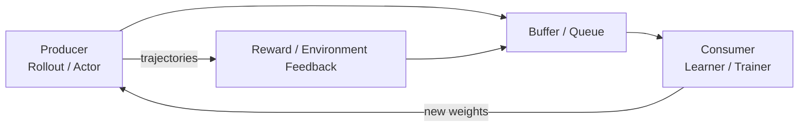

# A.2 How a Batch of Trajectories Becomes an Update: The RL Training System Substrate

Consider a simplified GRPO training example. The system takes 64 problems, generates 8 responses per problem, yielding 512 samples total. Suppose generation takes 45 seconds, rule-based scoring takes 4 seconds, and parameter updates take 12 seconds. Even if backpropagation is accelerated by 2x, the total round time only drops from 61 seconds to 55 seconds; the main bottleneck in this timing profile is response generation.

This example illustrates the first difference between RL engineering and ordinary supervised learning: **training samples are produced online by the current policy.** After a policy update, the distribution of the next batch of responses and rewards changes as well. The training program must simultaneously manage sample production, reward computation, parameter updates, and new weight reflux; any segment that is too slow drags down the entire pipeline.

This holds for language model training, and equally for classic tasks like CartPole: the policy outputs actions, the environment returns observations and rewards, and the learner then uses trajectories to update the policy. Both types of tasks face four common questions:

> **Who produces training samples? In what unit do samples flow? Can the training side consume them in time? Can data generated by old policies still be used?**

Together, these four questions constitute RL's **training system substrate**. This section first establishes a minimal "producer–buffer–consumer–weight reflux" pipeline, then progressively enters rollout engines, asynchronous training, and multi-GPU parallelism. After the model starts executing tools, reading/writing files, or maintaining multi-turn environment state, additional safety and reproducibility problems arise — this part is deferred to [A.3 Agent Sandbox](./agentic-rl-infra).

## First, Clarify the Scope of This Section

A.2 is concerned with: how samples are produced, queued, and consumed, how weights flow back, and how models are split across multiple GPUs. It assumes the sampling side is primarily a text generation engine, a simulation environment, or Actor workers.

- This page covers token generation, KV cache, long-tail outputs, and rollout engines such as vLLM and SGLang.
- This page covers training orchestration frameworks such as OpenRLHF, veRL, and slime, along with buffers, weight synchronization, and sample freshness.
- This page covers multi-GPU training methods such as FSDP, ZeRO, TP, PP, and EP.
- Agent code execution, network access, environment snapshots, and trajectory replay are covered in A.3.

When the task remains "the model generates a completion, then a verifier or reward scores it," A.2 already covers the main system problems. When model actions leave the GPU and begin calling tools, modifying files, running tests, or maintaining multi-turn environment state, that enters the scope of A.3.

## Step One: Understand How Data Flows

The most fundamental data flow in RL training is as follows:



In LLM RL, the producer is typically a rollout engine like vLLM/SGLang; the consumer is typically a trainer within training frameworks like OpenRLHF, veRL, or slime. In non-LLM RL, the producer is typically the environment, a simulator, or an Actor; the consumer is typically a Learner. The system diagrams that follow all revolve around this "produce, stage, consume, reflux" pipeline.

First, align the terminology used in the pipeline:

- **Term — policy:** the model or rule currently being trained. It decides the next action, or decides how the language model generates its next response.
- **Term — environment:** the external system that receives actions and returns observations and rewards, such as a game, a robotics simulator, or a task environment.
- **Term — observation / action / reward:** observation is the environment state, action is the move the policy makes, reward is the score the environment gives.
- **Term — transition:** a record of one interaction step, typically containing the current state, action, reward, and next state.
- **Term — episode:** a full segment of interaction from one reset to task completion.
- **Term — trajectory / rollout:** a sequence of consecutive samples. In non-LLM RL it is usually an environment trajectory; in LLM RL it is usually the generation process from prompt to completion.
- **Term — token / completion:** a token is the smallest text unit the language model generates at a time; a completion is the full answer the model produces for a prompt.
- **Term — Actor / rollout worker:** the worker responsible for producing samples. It continuously interacts with the environment or calls the model to generate responses.
- **Term — Learner / Trainer:** the worker responsible for consuming samples and updating model parameters.
- **Term — Buffer / Queue:** where samples are staged. Deeper queues can yield higher throughput, but samples may also become older.
- **Term — weight sync:** after the Trainer updates the model, it transmits new weights back to the sampling side.
- **Term — on-policy / off-policy:** on-policy means samples come from the current policy; off-policy means samples come from an old policy.
- **Term — KV cache:** intermediate computation results saved during LLM generation, used to avoid recomputing previous tokens.

## LLM RL vs. Non-LLM RL

RL sampling infrastructure is divided into two categories by training object: **LLM RL** and **non-LLM RL**. The two system types differ in data source, data unit, and primary bottleneck.

- **Category — LLM RL**
  - Data source: language model generates completions, scored by reward/verifier/judge
  - Data unit: token, completion, rollout batch
  - Primary bottlenecks: token-by-token generation, KV cache, long-tail outputs, weight sync, old-policy samples
- **Category — non-LLM RL**
  - Data source: environment or simulator returns observations / rewards
  - Data unit: transition, episode, trajectory
  - Primary bottlenecks: environment step, simulation throughput, Actor/Learner synchronization

Each system category contains two responsibility layers: the **inference/sampling layer** is responsible for producing trainable samples; the **training/orchestration layer** is responsible for consuming samples, updating parameters, and synchronizing new weights back to the sampling side. In LLM RL the first bottleneck is usually response generation, so the inference/rollout layer comes first; the training/orchestration layer then follows to wire together rollout, reward, buffer, and weight sync.

- **Category — LLM RL**
  - Inference/sampling tools: vLLM, SGLang
  - Training/orchestration tools: OpenRLHF, veRL, slime
- **Category — non-LLM RL**
  - Inference/sampling tools: Gymnasium VectorEnv, IMPALA Actor, Sample Factory rollout worker, Isaac Gym simulation environments
  - Training/orchestration tools: IMPALA Learner, Sample Factory Learner

The inference layer in LLM RL revolves around rollout engines: vLLM and SGLang handle high-throughput token generation; the training/orchestration layer revolves around post-training frameworks: OpenRLHF, veRL, and slime orchestrate rollout, reward, buffer, trainer, and weight sync. The sampling layer in non-LLM RL revolves around environment interfaces, Actors, rollout workers, and simulators; the training/orchestration layer is typically a Learner that consumes trajectories and updates the policy.

## Why the Sampling Side Determines the RL System Ceiling

The supervised learning training loop is static:

```
Dataset → DataLoader → Forward → Backward → Update
```

The RL training loop is dynamic:

```
Policy sampling → environment/generator produces feedback → collect trajectories → compute reward → update policy → resample with new policy
```

The DataLoader here is equivalent to a "porter" that feeds samples into the training loop. In supervised learning, the DataLoader mainly reads existing samples from disk; in RL, the DataLoader itself is an online system. It not only reads data, but also runs the policy, advances the environment, generates text, computes rewards, records trajectories, handles episode termination, and then hands this data to the learner.

Therefore, RL system throughput is jointly determined by three types of rates:

- The rate at which the sampling side produces data: `steps/s`, `tokens/s`, `samples/s`
- The rate at which the training side digests data: batch size, backpropagation, parallelism strategy
- The rate at which the feedback side returns rewards: rule-based judging, Reward Model, LLM-as-Judge, code execution, environment step

Any segment becoming a bottleneck limits the throughput of the entire training chain. In both task types, bottleneck locations are as follows.

- **Category — LLM RL**
  - Inference/sampling layer bottlenecks: token-by-token decode, KV cache, long-tail completions, batch generation scheduling
  - Training/orchestration layer bottlenecks: reward/verifier, PPO/GRPO training, buffer, weight sync
  - Sample freshness problem: rollout batches may be generated by old actors; deeper async queues make off-policy more likely
- **Category — non-LLM RL**
  - Inference/sampling layer bottlenecks: environment `step()`, physics simulation, Actor count, CPU/GPU data transfer
  - Training/orchestration layer bottlenecks: Learner backpropagation, Actor/Learner synchronization, parameter broadcast
  - Sample freshness problem: Actors sample using old policies; trajectories can produce policy lag

## Step Two: First Resolve the LLM Generation Bottleneck

LLM RL training data comes from the current language model generating on prompts. After the model outputs a completion (full response), rules, a Reward Model, LLM-as-Judge, or a verifier give the reward. At this point, the core of the "sampling infrastructure" is no longer the environment step, but text rollout, reward computation, weight synchronization, and policy version management.

LLM RL infrastructure consists of two types of systems:

- **Subcategory — inference/rollout tools**
  - Responsibility: high-throughput token generation, managing KV cache, batch scheduling, long-tail outputs, weight loading
  - Representatives: vLLM, SGLang
- **Subcategory — training/orchestration tools**
  - Responsibility: orchestrating rollout, reward, training, buffer, weight sync, and parallelism strategies
  - Representatives: OpenRLHF, veRL, slime

### Why the Training Loop Needs a Dedicated Inference Engine

In LLM RL, the rollout engine is a training-oriented "batch generator." It is not an online inference service in the ordinary sense. Online services face user requests; the rollout engine in RL post-training faces the training loop. It must not only generate text, but also execute sampling strategies, record policy versions, cooperate with reward computation, receive new weights, and hand trainable data to subsequent buffers and trainers.

The basic data flow of one LLM RL step is as follows:


_Figure 1: The LLM RL production/consumption pipeline. The rollout engine produces completions, reward/verifier/judge produces scores, the training buffer organizes tokens, masks, rewards, and policy versions into batches, and the trainer consumes batches and syncs new actor weights back to the rollout engine. Solid lines represent sample flow; dashed lines represent weight reflux. (Compiled from vLLM, SGLang, OpenRLHF, veRL, and slime documentation [^vllm_rlhf][^sglang_rl][^openrlhf_readme][^verl_readme][^slime_readme])_

A rollout engine must produce at least this information:

- token ids: the IDs after the response is tokenized; training loss requires token-by-token alignment
- attention mask / response mask: marking which positions are prompt, response, padding, or truncation
- finish reason: recording whether the response ended normally, was truncated by length, hit a stop token, or was interrupted by a tool call
- sampling metadata: recording temperature, top-p, top-k, seed, and how many responses were sampled per prompt
- policy version: recording which version of the actor generated this batch of samples
- optional logprob: recording the probability the model assigned to each token at the time. Some systems fetch old logprob directly from the inference side; others recompute on the training side to reduce inconsistency from inference/training kernel differences

Thus, online inference services deliver answers; LLM RL rollout engines deliver trainable trajectory samples.

### Why Online Service Scheduling Objectives Are Insufficient

LLM serving refers to user-facing online chat or API services. LLM serving and LLM RL rollout both depend on inference engines, but their optimization targets differ:

- **Dimension — primary objective**
  - Online serving: user latency and SLA
  - RL rollout engine: trainable samples produced per unit time
- **Dimension — request shape**
  - Online serving: user requests arrive randomly
  - RL rollout engine: the trainer dispatches prompts in batches, often generating multiple responses per prompt
- **Dimension — output length**
  - Online serving: constrained by product interaction
  - RL rollout engine: often long reasoning, long code, long CoT, long-tail samples
- **Dimension — state management**
  - Online serving: usually serves with fixed weights
  - RL rollout engine: weights update periodically, requiring version management
- **Dimension — correctness requirements**
  - Online serving: correct text results suffice
  - RL rollout engine: tokens, masks, logprobs, and version numbers must all align with training
- **Dimension — scheduling concerns**
  - Online serving: p50/p99 latency, i.e., latency of most requests and the slowest batch
  - RL rollout engine: tokens/s, samples/s, long-tail batch dragging, GPU utilization

The common `num_generations=8` or `16` in GRPO causes multiple responses to be generated for the same prompt. Response lengths vary greatly across math problems, coding problems, and long-reasoning problems: short samples finish quickly, while long samples are still decoding. A batch of training data usually must wait for the slowest completion to return; a few exceptionally long responses are the "long tail," and they directly slow down training.

### From Prefill to Decode: Where Time Is Spent

LLM generation can be split into two phases:

- **Prefill**: processing the prompt, computing the initial KV cache. This is more compute-intensive; costs are high when prompts are long.
- **Decode**: generating the response token by token. This is more memory-bandwidth and scheduling bound; longer outputs are more susceptible to long-tail slowdown.

Intuitively, prefill is like reading through the problem and jotting down intermediate results; decode is like writing the answer one token at a time based on those intermediate results.

RL rollout amplifies both problems:

1. **Many shared prefixes.** The same batch of prompts may share system prompts, few-shot examples, problem templates, or even the same problem being sampled multiple times. Prefix cache hit rate directly affects prefill cost.
2. **Heavy-tailed output length distribution.** Most responses may be a few hundred tokens, while a few generate thousands of tokens. The longest sample within a batch determines when the complete rollout batch can be delivered.
3. **KV cache occupancy grows with concurrency and context.** KV cache is the intermediate results saved during generation; its size relates to model layer count, head count, sequence length, and concurrent request count. When GPU memory is insufficient, throughput drops suddenly and may trigger preemption or recomputation.
4. **Weights update.** Serving can fix one checkpoint for a long time; the RL rollout side must frequently receive new weights from the trainer. Updating too slowly causes rollout GPUs to idle; updating too quickly may cause in-flight samples to span policy versions.

vLLM's PagedAttention manages KV cache in blocks, avoiding the need to reserve large contiguous blocks of GPU memory for each request, thereby improving GPU memory utilization and throughput during dynamic batching [^vllm][^vllm_blog].


_Figure 2: PagedAttention animation from the vLLM official blog. For LLM RL, rollout throughput depends heavily on KV cache management, continuous batching, and long-output scheduling. (Source: vLLM official blog [^vllm_blog])_

SGLang also treats these problems as core capabilities: RadixAttention for shared prefix reuse, router/gateway for distributing requests across multiple inference instances, PD disaggregation for splitting prefill and decode onto different execution resources, and RL system interfaces directly addressing weight updates, pause generation, deterministic inference, and other training scenario needs [^sglang_rl][^sglang_pd][^sglang_router].

### What Responsibilities a Rollout Engine Must Bear

In an LLM RL system, the rollout engine typically bears five categories of responsibilities.

**First, batch generation.** This component must organize a large number of prompts into high-throughput requests while supporting multiple responses per prompt. The key is not whether `generate` can be called, but how to organize prefill, decode, padding, stop conditions, and batch scheduling.

**Second, KV cache management.** Capabilities such as PagedAttention, prefix caching, RadixAttention, chunked prefill, and KV eviction all directly affect `tokens/s` and GPU memory usage. For RL, prompt templates and multi-sample sampling bring many reusable prefixes, so cache hit rate is not a marginal optimization.

**Third, long-tail control.** RL rollout usually does not return as soon as a single request completes; it needs to form a batch usable for training. A few ultra-long responses delay delivery of the entire batch. Engineering practice commonly uses max length, early stopping, bucket scheduling, partial batch return, and async queues to reduce long-tail impact.

**Fourth, weight lifecycle.** After the Trainer updates the actor, the rollout engine must receive new weights. This process may involve tensor parallel formats, FSDP/Megatron shard formats, LoRA adapters, inter-GPU communication, sleep/wake, and pause/resume generation. The vLLM documentation specifically discusses the RLHF scenario alongside sleep mode and weight synchronization [^vllm_rlhf][^vllm_sleep].

**Fifth, versioning and consistency.** Whether samples generated on the rollout side used the old policy or the new policy must be recorded. Under strict on-policy, old data is discarded; under async training, old data can be retained, but risk is controlled through staleness (how old samples are), importance sampling, KL, or truncated weights. The later "Async Training Architectures" section further develops this problem.

### What vLLM and SGLang Solve

vLLM and SGLang can both serve as LLM RL rollout engines, but with different engineering emphases:

- **System — vLLM**
  - More prominent capabilities: PagedAttention, continuous batching, parallel sampling, prefix caching, sleep mode, RLHF integration
  - Significance in RL rollout: as a general-purpose high-throughput rollout engine, easy to integrate with frameworks like OpenRLHF and veRL
- **System — SGLang**
  - More prominent capabilities: RadixAttention, structured generation, router/gateway, PD disaggregation, RL system interfaces
  - Significance in RL rollout: suitable for long context, multi-turn interaction, MoE, and SGLang-native post-training systems

The common OpenRLHF combination is Ray + vLLM + DeepSpeed; veRL supports vLLM, SGLang, HF Transformers, and other rollout backends; slime uses SGLang as its native rollout layer. In this layering, vLLM/SGLang sits at the generation engine layer, while TRL/OpenRLHF/veRL/slime sits at the training orchestration layer.

### Seeing the Training Loop from TRL's Single-Machine Prototype

TRL (Transformer Reinforcement Learning) is an RL training library in the HuggingFace ecosystem [^trl]. The DPO (Chapter 14) and GRPO (Chapter 15) experiments in earlier chapters all use TRL. Its positioning differs from the three frameworks above: TRL is not a distributed orchestration system — it does not do Ray scheduling, does not separate rollout engine and trainer processes, and does not do cross-GPU weight sync. It encapsulates DPO/PPO/GRPO/REINFORCE++ training loops into Trainer classes like `DPOTrainer` and `GRPOTrainer`, running on a single machine or a small number of GPUs [^trl].

This means TRL's internal data flow is much simpler than OpenRLHF/veRL/slime:

```
Model generates completion → reward/verifier scores → Trainer computes loss → backpropagation updates parameters
```

There are no independent rollout workers, no cross-process buffer queues, no weight sync. Generation and training complete within the same Python process. The advantage is low startup cost — the earlier chapter experiments already demonstrated this. The cost is that the throughput ceiling is constrained by a single machine, and generation and training scheduling cannot be decoupled.

TRL suits two types of scenarios: (1) algorithmic research and quick verification — modifying reward functions, trying new loss designs, verifying data quality; (2) small-scale production — SFT/DPO/GRPO training on a single GPU or a few GPUs. When training scale needs to span multiple machines, or when rollout and training need separate scheduling, you enter the domain of OpenRLHF/veRL/slime.

ms-swift (ModelScope Swift) is positioned similarly to TRL but targets the domestic model ecosystem [^msswift]. It packages the full SFT/DPO/GRPO/RLHF pipeline into a CLI tool; models and datasets are loaded directly from ModelScope Hub, and training results can be deployed to ModelScope inference services with one click. It suits scenarios where you don't want to assemble the training pipeline yourself and prefer an out-of-the-box experience.

- **Framework — TRL**
  - Ecosystem: HuggingFace
  - Distributed capability: single machine / accelerate
  - Suitable scale: single GPU ~ a few GPUs
  - Typical uses: algorithm research, quick verification, teaching experiments
- **Framework — ms-swift**
  - Ecosystem: ModelScope
  - Distributed capability: single machine / a few GPUs
  - Suitable scale: single GPU ~ a few GPUs
  - Typical uses: out-of-the-box full pipeline, domestic model adaptation
- **Framework — OpenRLHF**
  - Ecosystem: Ray + vLLM
  - Distributed capability: Ray cluster
  - Suitable scale: multi-machine multi-GPU
  - Typical uses: medium-scale PPO/GRPO production training
- **Framework — veRL**
  - Ecosystem: composable backends
  - Distributed capability: FSDP / Megatron
  - Suitable scale: multi-machine multi-GPU
  - Typical uses: customizable training flows, swapable rollout backends
- **Framework — slime**
  - Ecosystem: Megatron
  - Distributed capability: Megatron + SGLang
  - Suitable scale: large-scale clusters
  - Typical uses: large-scale MoE, long-tail rollout optimization
- **Framework — Miles**
  - Ecosystem: Megatron
  - Distributed capability: Megatron + SGLang
  - Suitable scale: large-scale clusters
  - Typical uses: enterprise-grade long-cycle MoE post-training

### Why Orchestration Frameworks Are Needed as Scale Grows

OpenRLHF, veRL, and slime sit at the same system layer. They typically call vLLM or SGLang for rollout, but are not themselves mere inference engines. They are more like pipeline masters, responsible for wiring together generation, scoring, training, sample buffering, and weight synchronization:

- Rollout workers: batch-generate responses, connecting to vLLM, SGLang, or other inference backends
- Reward/Judge workers: score responses, with sources that can be rules, reward models, LLM-as-Judge, or code execution
- Training workers: compute loss according to PPO/GRPO/RLOO/REINFORCE++ and other algorithms, complete backpropagation and parameter updates
- Buffer/Queue: buffer samples, record policy versions, control old-data ratios
- Weight sync: sync the trainer's new weights to the rollout side

PPO/GRPO primarily manifests in algorithm formulas as loss, advantage estimation, and constraint terms; in real systems, post-training framework differences mainly appear across four planes:

- **Plane — Rollout plane:** which inference engine to use, how to generate, truncate, retry, run concurrently, and handle the long tail
- **Plane — Reward plane:** whether reward comes from rules, RM, Judge, or a verifier, and whether scoring becomes a new bottleneck
- **Plane — Training plane:** whether to use DeepSpeed, FSDP, Megatron-LM, or a proprietary training stack; these components handle large-model training
- **Plane — Data / Weight plane:** how samples enter the queue, whether streaming is used, how weights sync, how old samples are handled

The framework comparison table in the HybridFlow paper compares DeepSpeed-Chat, OpenRLHF, NeMo-Aligner, and HybridFlow along these dimensions: parallelism, actor weights, model placement, and execution pattern [^hybridflow].


_Figure 3: Comparison of RLHF framework execution patterns from the HybridFlow paper. OpenRLHF trades separate devices and two copies of actor weights for generation/training parallelism; HybridFlow further emphasizes zero-redundancy model resharding and flexible placement. (Source: HybridFlow paper [^hybridflow])_

### OpenRLHF: Using Ray to Wire Together Inference and Training

The OpenRLHF technical report and README describe it as a Ray + vLLM distributed architecture: Ray is responsible for scheduling different workers to different machines or GPUs, vLLM does rollout inference, DeepSpeed does Actor/Critic/Reward/Reference model training and inference, Transformers handles model format and state interfacing, and the bottom layer uses NCCL / CUDA IPC for high-speed communication [^openrlhf][^openrlhf_readme].


_Figure 4: Ray + vLLM architecture diagram from the OpenRLHF README. It exemplifies the common decomposition for LLM RL: scheduling layer, inference engine, training engine, model weight format, and inter-GPU communication. (Source: OpenRLHF README [^openrlhf_readme])_

Key boundaries reflected in Figure 4 include:

- Ray is responsible for scheduling Actor, Critic, Reward, Reference, vLLM engine, and other components to different GPUs
- vLLM is responsible for high-throughput generation and is the rollout-side core
- DeepSpeed is responsible for training-side GPU memory optimization and distributed backpropagation
- Transformers serves as the bridge for weight formats and model state
- NCCL / CUDA IPC are responsible for weight sync and inter-GPU transfers

OpenRLHF's practical value is that it makes several common deployment modes into explicit parameters. In the table, colocated means "generation and training share the same set of GPUs," and async means "generation and training run concurrently."

- **Mode — Hybrid Engine / colocated**
  - Typical parameters: `--train.colocate_all`, `--vllm.enable_sleep`
  - Engineering meaning: the same set of GPUs switches between generation and training, minimizing GPU count
  - Risk: strictly serial, throughput affected by rollout long tail
- **Mode — Async Training**
  - Typical parameters: `--train.async_enable`, `--train.async_queue_size`
  - Engineering meaning: rollout and training execute concurrently; larger queues yield higher throughput
  - Risk: deeper queues mean more off-policy samples
- **Mode — Async + Partial Rollout**
  - Typical parameters: `--train.partial_rollout_enable`
  - Engineering meaning: uses vLLM pause/resume so weight sync doesn't completely block generation
  - Risk: in-flight samples may mix old and new weights

These three modes correspond to a core tension in industrial training: saving GPUs, strict on-policy, and high throughput are hard to satisfy simultaneously. OpenRLHF tends to expose these choices to the user. During research you can use colocated to guarantee stability; during throughput optimization you can turn on async; if you can accept more complex off-policy correction, you can then try partial rollout and importance sampling correction [^openrlhf_async].

### veRL: Expressing Data Flow with HybridFlow

veRL is the open-source implementation of the HybridFlow paper. It emphasizes single-controller orchestration, composable model engine / rollout engine, and using queues to decouple rollout and training [^hybridflow][^verl_readme].


_Figure 5: Architecture diagram from the veRL README. TransferQueue, Rollout Engine, Model Engine, and CheckpointEngine correspond to data flow, inference flow, training flow, and weight sync in an LLM RL system. (Source: veRL README [^verl_readme])_

Figure 5 shows how veRL decomposes the LLM RL execution flow. The Rollout engine may connect to vLLM, SGLang, or TensorRT-LLM; the Model engine may connect to FSDP, Megatron-Core, or other training backends; TransferQueue is responsible for streaming generated samples to the training side; CheckpointEngine is responsible for saving and broadcasting new weights.

veRL's emphasis is abstracting RL training into a set of composable workers. The README highlights a hybrid-controller programming model, flexible device mapping, and modular integration with existing LLM infra such as FSDP/FSDP2, Megatron-LM, vLLM, SGLang, and HF Transformers [^verl_readme]. These names can first be understood as two component types: training backends are responsible for splitting large models across multiple GPUs for training, and rollout backends are responsible for high-throughput text generation. This means:

- The training side can select FSDP or Megatron-style sharding based on model scale
- The inference side can select vLLM, SGLang, or HF Transformers based on scenario
- Steps such as rollout, reference logprob, actor update, and critic update can be composed under a unified controller
- Experimental directions such as async, off-policy, multimodal/robotics can continue to plug into the same execution flow

Compared to OpenRLHF, which leans more toward being an "engineered RLHF framework of Ray + vLLM + DeepSpeed," veRL places more emphasis on abstraction of the RL training flow and backend composability. It suits scenarios where you need to modify the training flow, swap rollout engines, insert custom rewards, support VLM/multi-turn/tool calling, or research new algorithms.

### slime: Making Megatron, SGLang, and Buffers Cooperate

slime is positioned more toward large-scale RL scaling. Its README summarizes core capabilities in two points: using Megatron + SGLang to support high-performance training, and supporting flexible rollout through custom data generation interfaces and a server-based engine [^slime_readme]. Megatron primarily serves the training side; SGLang primarily serves the rollout side.


_Figure 6: Architecture diagram from the slime README. The training side is Megatron, the inference side is SGLang server/router, with a data buffer in the middle managing prompts, rollout data, and custom generation logic. (Source: slime README [^slime_readme])_

slime's system structure is relatively clear:

- **training (Megatron)**: reads training data from the Data Buffer, and after training syncs new parameters to the rollout module
- **rollout (SGLang + router)**: generates new data, including reward/verifier outputs, and writes back to the Data Buffer
- **data buffer**: manages prompt initialization, custom data, and rollout generation methods

Compared to OpenRLHF / veRL, slime more explicitly uses SGLang as its native inference layer rather than a general swappable plugin. The slime documentation emphasizes: SGLang is launched internally in server mode, SGLang parameters can be passed directly via `--sglang-*`, and `--debug-rollout-only` is provided for independently debugging rollout performance [^slime_intro]. The training side also supports passthrough Megatron parameters covering model parallelism strategies such as TP/PP/EP/CP, and provides `--debug-train-only` for debugging the training portion [^slime_intro].

Downstream projects listed in the slime README also illustrate its positioning: APRIL specifically optimizes rollout long tails; TritonForge, RLVE, P1, and others use slime for tasks such as code generation, verifiable environments, and physical reasoning [^slime_readme]. These projects reuse the substrate discussed on this page: rollout engine, training backend, data buffer, weight sync, and parallel training. How Agentic RL frameworks add sandboxes, multi-turn trajectories, and tool scheduling on top of this substrate is deferred to A.3.

slime's release notes also discuss typical systems-engineering problems: RL inference latency cannot be solved by simply adding more GPUs, because training still must wait for the longest sample to finish decoding; overly large inference batches also introduce off-policy problems [^slime_release]. Therefore, slime attends to low-level optimizations such as KV cache space, MoE fp8 rollout, DeepEP, Megatron offload, and NCCL group reconstruction. These problems go beyond the scope of a single-machine PPO loop and belong to the infrastructure problems of industrial RL training systems.

Miles ([radixark/miles](https://github.com/radixark/miles)) is the enterprise-grade branch of slime, maintained by the LMSYS team [^miles_blog]. It inherits slime's Megatron + SGLang architecture and is positioned for stable, controllable RL in large-scale MoE post-training scenarios. slime focuses on extreme optimization of algorithm and system performance; Miles adds fault tolerance for long-cycle training, operations monitoring, and production-grade reliability on top of that, targeting industrial training tasks that need to run continuously for days or even weeks [^miles_readme].

### At This Point, What the LLM RL System Has Accomplished

LLM RL's system boundary revolves around "text rollout." Data comes from the current language model, rewards come from rules, models, or verifiers, and the training system must also manage weight synchronization and policy versions.

- **Category — inference/rollout tools**
  - System: vLLM
  - Positioning: general-purpose LLM rollout engine
  - Data unit: token / completion
  - Primary bottlenecks: KV cache, continuous batching, long-tail decode, sleep/weight sync
- **Category — inference/rollout tools**
  - System: SGLang
  - Positioning: rollout engine for complex generation and RL systems
  - Data unit: token / completion / structured output
  - Primary bottlenecks: RadixAttention, router, PD disaggregation, weight updates
- **Category — training/orchestration tools**
  - System: OpenRLHF
  - Positioning: Ray + vLLM + DeepSpeed post-training framework
  - Data unit: rollout batch
  - Primary bottlenecks: PPO/GRPO/RLOO training orchestration, colocated/async tradeoffs
- **Category — training/orchestration tools**
  - System: veRL
  - Positioning: RL training flow framework with composable backends
  - Data unit: sample stream / rollout batch
  - Primary bottlenecks: rollout, model engine, TransferQueue, checkpoint composition
- **Category — training/orchestration tools**
  - System: Seer
  - Positioning: extreme synchrony: online context learning eliminating the long tail
  - Data unit: rollout batch
  - Primary bottlenecks: divided rollout, context-aware scheduling, speculative decode
- **Category — training/orchestration tools**
  - System: slime
  - Positioning: SGLang-native + Megatron post-training framework
  - Data unit: data buffer / rollout batch
  - Primary bottlenecks: large-scale rollout, Megatron parallelism, MoE fp8 rollout and DeepEP
- **Category — training/orchestration tools**
  - System: Miles
  - Positioning: slime enterprise branch, large-scale MoE post-training
  - Data unit: data buffer / rollout batch
  - Primary bottlenecks: long-cycle training fault tolerance, operations monitoring, production-grade reliability
- **Category — training/orchestration tools**
  - System: ms-swift
  - Positioning: ModelScope ecosystem all-in-one training framework
  - Data unit: rollout batch
  - Primary bottlenecks: SFT/DPO/GRPO/RLHF full pipeline, out-of-the-box, domestic model hub integration
- **Category — training/orchestration tools**
  - System: TRL
  - Positioning: single-machine research prototype, HuggingFace ecosystem
  - Data unit: rollout batch
  - Primary bottlenecks: DPO/PPO/GRPO Trainer encapsulation, quick verification, no distributed orchestration

## Step Three: Put the Same Pipeline Back into Classic RL

Non-LLM RL refers to tasks like traditional control, games, and robotics simulation. Training data comes from the environment: the policy outputs actions, the environment returns next-step observations, rewards, and "task ended" markers such as terminated/truncated. At this point, the core goal of sampling infrastructure is to increase environment interaction throughput and reduce waiting among CPU environments, GPU policy networks, and the learner.

In non-LLM RL, the inference/sampling layer is responsible for advancing environments and producing trajectories; the training/orchestration layer is responsible for consuming trajectories and updating the policy. Gymnasium and Isaac Gym are typical sampling-layer systems; IMPALA and Sample Factory embody how the inference/sampling layer and training/orchestration layer are decoupled.

### Gymnasium VectorEnv: First Run Multiple Environments in Parallel

Gymnasium is first and foremost an **environment interface**, not a distributed training framework. It defines basic interaction methods such as `reset()`, `step(action)`, observation, reward, and terminated/truncated. Algorithm experiments for CartPole, LunarLander, Atari, MuJoCo, and others usually start from this interface.

When a single environment is too slow, the GPU spends most of its time waiting for the CPU to execute `env.step()`. Therefore, Gymnasium provides synchronous and asynchronous vector environments that wrap multiple environment instances into one batched environment [^gym_vec].

```python
from gymnasium.vector import SyncVectorEnv, AsyncVectorEnv

envs = SyncVectorEnv([lambda: gym.make("CartPole-v1") for _ in range(8)])
obs, info = envs.reset()                 # shape: (8, obs_dim)
actions = policy(obs)                    # one inference yields 8 actions
obs, rewards, terms, truncs, infos = envs.step(actions)
```

In this code, `obs` is short for observation, and `terms` and `truncs` indicate which environments have ended. Vector environments combine 8 environments into one batch so the policy network can process 8 observations at once.

- **Method — `SyncVectorEnv`**
  - Principle: sequential step in the main process
  - Suitable for: lightweight environments such as CartPole and some Atari experiments
- **Method — `AsyncVectorEnv`**
  - Principle: multi-process parallel step
  - Suitable for: environments where step itself is heavy, such as physics simulation

The engineering focus at this stage is correctly handling batch shapes, episode resets, termination conditions, and log statistics. All components typically still run within a single machine.

### IMPALA: Separating Actors from Learners

When tasks scale to Atari, DeepMind Lab, ViZDoom, MuJoCo, or robotics simulation, the bottleneck shifts from "a single environment is too slow" to "how can a large number of environments continuously produce trajectories." At this point, simply adding more learner-side GPUs usually cannot improve overall throughput, because the learner still lacks enough new data.

Distributed RL systems typically split roles into Actor and Learner: Actors are responsible for interacting with environments and generating trajectories; the Learner is responsible for consuming trajectories and updating parameters.

IMPALA is a representative of this line. A large number of Actors generate trajectories in parallel and send data to a central Learner; instead of sending gradients back to a parameter server, Actors send complete trajectories, letting the Learner consume batches continuously on GPU. Because Actors may be sampling with a slightly older policy, IMPALA uses V-trace for off-policy correction; V-trace is an "old-sample correction" method used to reduce bias from policy lag [^impala]. This established the basic shape of many subsequent systems: **sampling and training are decoupled, throughput is prioritized, and algorithms then handle data staleness**.


_Figure 7: Actor-Learner architecture and timelines from the IMPALA paper. The left shows that Actors are only responsible for generating trajectories and pulling parameters from the Learner; the right shows that IMPALA no longer waits for all Actors to synchronize, but decouples acting and learning. (Source: IMPALA paper [^impala])_


_Figure 8: Producer/consumer view of the IMPALA Actor-Learner architecture. Actors are trajectory producers, the Learner is a batch consumer; dashed lines represent new policy weights refluxing to Actors. This reflux is not necessarily strictly synchronized with sampling, so policy lag arises. (Compiled from the IMPALA paper [^impala])_

### Sample Factory: Reducing Single-Machine Sampling Overhead

Sample Factory pushes Actor-Learner decoupling toward single-machine high-throughput implementation: asynchronous Actor-Learner, shared memory, batch inference, and less Python overhead, enabling Atari/3D control tasks to reach 100K+ fps (over 100,000 frames per second) magnitude [^sf]. It does not merely increase environment count but splits work into specialized components:

- Rollout workers: run only environments on the CPU side, without holding their own policy replicas, so they can be parallelized heavily
- Policy workers: do batched action generation on the GPU side, merging observations into larger forward batches
- Learner: consumes complete trajectories for backpropagation, and writes new parameters into shared GPU memory


_Figure 9: System architecture from the Sample Factory paper. It splits environment simulation, policy forward, and training backward into independent components, using FIFO queues and shared memory to reduce communication cost. (Source: Sample Factory paper [^sf])_

The architecture's emphasis is on data flow: observations go from rollout workers via shared memory to policy workers, actions go back to rollout workers; complete trajectories enter the learner; updated parameters enter GPU memory and are then fetched by policy workers.


_Figure 10: Sample Factory's producer/consumer pipeline. Rollout workers produce observations and trajectories; policy workers consume observations and produce actions; the Learner consumes trajectories and updates shared weights. Shared memory reduces Python inter-process copies across the three pipeline segments. (Compiled from the Sample Factory paper [^sf])_

### Isaac Gym: Moving Physics Simulation to the GPU

Robotics and physics control tasks encounter another bottleneck: physics simulation itself is heavy, and traditional CPU physics engines frequently need to shuttle state to the GPU for policy inference.

NVIDIA Isaac Gym moves physics simulation directly onto the GPU, with tens of thousands of environments running in parallel; the core benefit is reducing step-by-step data transfer between the CPU physics engine and GPU policy network [^isaac].


_Figure 11: GPU pipeline from the Isaac Gym paper. Learning Framework, Environment Logic, IsaacGym Tensor API, and PhysX all exchange state, actions, and configurations around GPU tensors, avoiding cross-CPU/GPU copies at every step. (Source: Isaac Gym paper [^isaac])_


_Figure 12: Isaac Gym's in-GPU producer/consumer closed loop. PhysX produces state tensors on the GPU, the policy network directly consumes state tensors and produces action tensors, and task logic writes actions back into the next round of physics simulation. The core benefit is avoiding CPU/GPU round-trip transfers at each step. (Compiled from the Isaac Gym paper [^isaac])_

```
Traditional:  CPU physics engine × 64 envs → GPU policy inference
Isaac Gym:    GPU physics simulation × 4096 envs + GPU policy inference
```

- **Comparison — sampling speed**
  - CPU parallel (MuJoCo × 64): ~10K fps
  - GPU parallel (Isaac Gym × 4096): ~1M fps
- **Comparison — data transfer**
  - CPU parallel (MuJoCo × 64): CPU→GPU every step
  - GPU parallel (Isaac Gym × 4096): zero-copy
- **Comparison — suitable scenarios**
  - CPU parallel (MuJoCo × 64): few-joint robots
  - GPU parallel (Isaac Gym × 4096): humanoid robots, dexterous hands

### At This Point, What the Non-LLM RL System Has Accomplished

Non-LLM RL's system boundary revolves around "environment interaction." Data comes from external environments or simulators; the primary data units are transitions, episodes, and trajectories.

- **Category — inference/sampling tools**
  - System: Gymnasium VectorEnv
  - Positioning: environment interface / single-machine batched environments
  - Data unit: transition / episode
  - Primary bottlenecks: Python `env.step()`
- **Category — inference/sampling tools**
  - System: IMPALA Actor
  - Positioning: distributed environment interaction component
  - Data unit: trajectory
  - Primary bottlenecks: Actor count, network transfer, policy lag
- **Category — training/orchestration tools**
  - System: IMPALA Learner
  - Positioning: centralized training component
  - Data unit: trajectory batch
  - Primary bottlenecks: Learner throughput, parameter broadcast, V-trace correction
- **Category — inference/sampling tools**
  - System: Sample Factory rollout worker / policy worker
  - Positioning: single-machine high-throughput sampling component
  - Data unit: trajectory buffer
  - Primary bottlenecks: CPU rollout, GPU policy worker, shared memory
- **Category — training/orchestration tools**
  - System: Sample Factory Learner
  - Positioning: single-machine async training component
  - Data unit: trajectory batch
  - Primary bottlenecks: learner-sampling mutual waiting, parameter sync
- **Category — inference/sampling tools**
  - System: Isaac Gym
  - Positioning: GPU physics simulation platform
  - Data unit: GPU tensor state
  - Primary bottlenecks: CPU/GPU data transfer and physics simulation throughput

## Step Four: Overlap Generation and Training

LLM RL training has a core contradiction: **generation is slow, training is relatively fast, and running them serially leaves GPUs idling heavily.** Taking GRPO as an example, one training step often has the model generate hundreds of responses first, then compute loss and update parameters. During generation the training GPU waits; during training the rollout GPU waits. The longer the outputs, the more obvious the waiting.

A typical GRPO step can be understood as follows:

```
① Generate rollout batch     ← inference slow, training side waits
② Compute reward / advantage
③ Backpropagate and update actor  ← training fast, inference side waits
④ Sync new weights back to rollout
```

Engineering practice commonly uses three deployment modes:

- **Mode — synchronous mode**
  - Resource organization: one set of GPUs, generation and training serial
  - Overlapping: no
  - Suitable for: learning, small experiments, strict on-policy prototypes
- **Mode — colocated mode**
  - Resource organization: one set of GPUs, rollout and training take turns occupying them
  - Overlapping: no, but switching is faster
  - Suitable for: medium-scale training with limited GPU budget
- **Mode — decoupled mode**
  - Resource organization: rollout GPUs and training GPUs are separate, with a buffer in between
  - Overlapping: yes
  - Suitable for: large-scale production training

Synchronous mode is easiest to understand: generate first, then train, then generate again. Its advantage is simplicity; its disadvantage is poor throughput. Colocated mode lets the same set of GPUs switch between inference format and training format — for example, converting from FSDP shard format to vLLM tensor parallel format, then switching back to training format. It saves GPUs, but generation and training still cannot truly run simultaneously.

Decoupled mode is the standard for large-scale RL training: rollout GPUs continuously generate samples, writing tokens, masks, rewards, and policy versions into buffers; training GPUs continuously pull samples from buffers for training; after weight updates they sync back to the rollout engine.

```
Rollout GPU:   [gen b0] [gen b1] [gen b2] [gen b3] ...
                   ↓         ↓         ↓
Buffer:          [b0]      [b1]      [b2]
                   ↓         ↓         ↓
Training GPU:       [train b0] [train b1] [train b2] ...
                       ↑         ↑
                 weight sync weight sync
```

Decoupled mode introduces two new problems: **how to sync new weights to the inference side**, and **whether data generated by old policies can still be used**.

### Weight Synchronization

After the Trainer updates the actor, the rollout engine must obtain new weights. Different systems use different transmission methods:

- **Method — NCCL full broadcast**
  - Transmits: all parameters
  - Characteristics: general-purpose, common in multi-GPU clusters
- **Method — packed transfer**
  - Transmits: all parameters
  - Characteristics: reduces small-tensor transfer overhead
- **Method — direct GPU memory transfer**
  - Transmits: all parameters
  - Characteristics: relies on high-bandwidth interconnect
- **Method — sync only LoRA adapter**
  - Transmits: adapter parameters
  - Characteristics: small data volume, suitable for LoRA post-training
- **Method — write checkpoint then load**
  - Transmits: files
  - Characteristics: simple across nodes, but slow

If training a LoRA adapter, weight sync is much lighter: the rollout side only needs to receive the adapter rather than the full base model. This is also why LoRA + async training are often used together.

When weights arrive, the rollout engine may still be generating long responses. Four common handling approaches: don't interrupt generation, wait for current requests to finish then switch, interrupt and restart requests directly, or wait for the entire batch to complete then switch. The more aggressive the approach, the higher the throughput; the more conservative, the better the consistency.

### Old Data Handling

The deeper the async queue, the more likely data reaching the training side comes from an old policy. Strict on-policy training discards these samples; throughput-prioritized systems allow a small amount of lag and use both engineering and algorithms to jointly constrain risk.

- **Approach — version number filtering**
  - Method: record policy version on each sample; discard if too old
  - Tradeoff: simple and reliable, but wastes samples
- **Approach — limit buffer depth**
  - Method: have the queue retain at most a small number of batches
  - Tradeoff: uses system constraints to bound staleness
- **Approach — importance sampling correction**
  - Method: weight samples based on the new/old policy probability ratio
  - Tradeoff: doesn't waste data, but implementation is more complex
- **Approach — combination of all three**
  - Method: queue as floor + version filtering + truncated correction
  - Tradeoff: common choice in production systems

A commonly used safety boundary in practice is: first keep the buffer shallow to prevent samples from becoming too old; then record policy version; finally at the algorithm level use KL, clipping, or truncated importance sampling to suppress excessive bias. In other words, async training is not simply "the more async the better" — it balances throughput, sample freshness, and training stability [^async_landscape].

## Step Five: Split Models and Training State Across Multiple Cards

RL post-training consumes more GPU memory than ordinary fine-tuning. PPO may simultaneously involve Actor, Critic, Reference, and Reward Model; even when GRPO saves on the Critic, actor, reference, rollout engine, reward/verifier, and other components still need to work together. When a model cannot fit on a single card, computation and state need to be split across multiple GPUs.

### Four Parallelism Strategies

- **Strategy — DP (Data Parallelism)**
  - What it splits: different GPUs process different batches
  - Communication characteristic: gradient AllReduce
  - Applicable when: the model fits on a single card
- **Strategy — TP (Tensor Parallelism)**
  - What it splits: intra-layer matrix partitioning
  - Communication characteristic: communication every forward/backward
  - Applicable when: intra-node multi-GPU, relies on NVLink
- **Strategy — PP (Pipeline Parallelism)**
  - What it splits: model partitioned by layers
  - Communication characteristic: activations passed between adjacent stages
  - Applicable when: cross-node large models
- **Strategy — EP (Expert Parallelism)**
  - What it splits: MoE experts distributed to different GPUs
  - Communication characteristic: tokens routed to experts
  - Applicable when: MoE models

A 70B dense model commonly uses a hybrid DP + TP + PP parallelism; MoE models additionally need EP. TP is better suited to intra-node high-bandwidth interconnect, PP is better suited to cross-node layered partitioning, and DP is responsible for expanding batch size and synchronizing gradients.

### FSDP and ZeRO

The parallelism strategies above answer "how to compute"; FSDP and ZeRO answer "how to save GPU memory on state."

**FSDP (Fully Sharded Data Parallel)** shards parameters, gradients, and optimizer states across different GPUs, temporarily aggregating them during computation. It is PyTorch's native solution with good generality.

**DeepSpeed ZeRO** also shards in stages by optimizer states, gradients, and parameters. ZeRO-3 can split all three categories of state, minimizing GPU memory pressure but with the highest communication overhead.

In practice, FSDP / ZeRO are often combined with TP / PP: the former save state memory, the latter split model computation.

### Mixed Precision and RL-Specific Challenges

- **Precision — BF16**
  - Use: training
  - Recommendation: first choice; stability usually better than FP16
- **Precision — FP16**
  - Use: training
  - Recommendation: usable, but watch for overflow and loss scaling
- **Precision — FP32**
  - Use: critical computations
  - Recommendation: stable but slow, high memory usage
- **Precision — FP8**
  - Use: frontier training/inference
  - Recommendation: high performance, but stability and framework support must be verified
- **Precision — INT8/INT4**
  - Use: inference
  - Recommendation: suitable for serving / rollout compression, not appropriate as primary training precision

RL training's additional challenge is that the rollout phase and training phase have different resource demands: rollout is inference-heavy, particularly affected by KV cache, long-tail outputs, and concurrent scheduling; training is backpropagation-heavy, affected by model parallelism, optimizer states, and communication. Decoupled architectures let each type of GPU optimize separately, but also introduce weight sync and sample staleness problems; colocated architectures save GPUs but require frequent switching between inference and training formats.

Common GPU memory optimizations include:

- **Technique — Reference model sharing**
  - Principle: Reference is not trained, can share some weights with Actor
  - Applicable to: PPO / GRPO
- **Technique — LoRA Rollout**
  - Principle: rollout side loads base + adapter
  - Applicable to: LoRA post-training
- **Technique — Gradient Checkpointing**
  - Principle: trade computation for activation memory
  - Applicable to: long-sequence training
- **Technique — sequence packing and load balancing**
  - Principle: reduce padding and cross-rank waiting
  - Applicable to: variable-length outputs

MoE and PRM further amplify system complexity. MoE requires handling expert load balancing and training/inference routing consistency; PRM may introduce additional step-level scoring GPUs, turning reward computation into a new bottleneck [^deepseek_v3].

## Finally: Select Systems by Bottleneck

- **Task type — LLM RL prototype**
  - Primary question: inference throughput for generating responses
  - Category: LLM RL
  - Inference/sampling choice: vLLM / SGLang
  - Training/orchestration choice: TRL / OpenRLHF / veRL
- **Task type — 7B-70B LLM PPO/GRPO/RLOO**
  - Primary question: how to orchestrate rollout, reward, training, buffer, weight sync
  - Category: LLM RL
  - Inference/sampling choice: vLLM / SGLang
  - Training/orchestration choice: OpenRLHF / veRL / slime
- **Task type — CartPole / LunarLander / small control experiments**
  - Primary question: environment interface and batched environments
  - Category: non-LLM RL
  - Inference/sampling choice: Gymnasium VectorEnv
  - Training/orchestration choice: single-machine PPO/DQN training loop
- **Task type — Atari / ViZDoom / DeepMind Lab high-throughput training**
  - Primary question: how to reduce mutual waiting among CPU environments, policy forward, and learner
  - Category: non-LLM RL
  - Inference/sampling choice: IMPALA Actor / Sample Factory rollout worker
  - Training/orchestration choice: IMPALA Learner / Sample Factory Learner
- **Task type — robotics simulation, dexterous hands, humanoid control**
  - Primary question: how to reduce copies between physics simulation and policy network
  - Category: non-LLM RL
  - Inference/sampling choice: Isaac Gym
  - Training/orchestration choice: PPO/SAC and other learners

When selecting, first determine whether the task belongs to LLM RL. LLM RL prioritizes evaluating inference/rollout throughput, then evaluates how reward, training, buffer, and weight sync are orchestrated; non-LLM RL primarily optimizes environment interaction and simulation throughput. Within each category, select the corresponding system based on specific bottlenecks.

Selection can follow a fixed order: first determine whether the task belongs to LLM RL or non-LLM RL; then locate the sampling bottleneck; then decide between synchronous, colocated, or decoupled; finally select parallelism strategies such as FSDP, ZeRO, TP, PP, EP based on model scale. After tasks enter multi-turn interaction, tool calling, code execution, web access, or multimodal environment state management, continue reading **[A.3 Agentic RL Infrastructure](./agentic-rl-infra)**.

## References

[^gym_vec]: Gymnasium Documentation, [Vector Environments (SyncVectorEnv / AsyncVectorEnv)](https://gymnasium.farama.org/api/vector/).

[^impala]: Espeholt L, Soyer H, Munos R, et al. [IMPALA: Scalable Distributed Deep-RL with Importance Weighted Actor-Learner Architectures](https://proceedings.mlr.press/v80/espeholt18a.html), ICML 2018.

[^sf]: Petrenko A, Huang Z, Kumar T, Sukhatme G S, Koltun V. [Sample Factory: Egocentric 3D Control from Pixels at 100000 FPS with Asynchronous Reinforcement Learning](https://arxiv.org/abs/2006.11751), ICML 2020.

[^isaac]: Makoviychuk V, Wawrzyniak L, Guo Y, et al. [Isaac Gym: High Performance GPU Based Physics Simulation For Robot Learning](https://research.nvidia.com/labs/srl/publication/makoviychuk-2021-isaac/), NeurIPS 2021 (Datasets and Benchmarks).

[^vllm]: Kwon W, Li Z, Zhuang S, et al. [Efficient Memory Management for Large Language Model Serving with PagedAttention](https://arxiv.org/abs/2309.06180), 2023. (vLLM / PagedAttention)

[^vllm_blog]: vLLM Team, [vLLM: Easy, Fast, and Cheap LLM Serving with PagedAttention](https://vllm.ai/blog/vllm), 2023.

[^vllm_rlhf]: vLLM Documentation, [Reinforcement Learning from Human Feedback](https://docs.vllm.ai/en/stable/training/rlhf/), 2026.

[^vllm_sleep]: vLLM Documentation, [Sleep Mode](https://docs.vllm.ai/en/stable/features/sleep_mode/), 2026.

[^sglang_rl]: SGLang Documentation, [SGLang for RL Systems](https://docs.sglang.io/advanced_features/sglang_for_rl.html), 2026.

[^sglang_pd]: SGLang Documentation, [PD Disaggregation](https://docs.sglang.io/docs/advanced_features/pd_disaggregation), 2026.

[^sglang_router]: SGLang Documentation, [SGLang Router](https://docs.sglang.io/docs/advanced_features/sgl_model_gateway), 2026.

[^openrlhf]: OpenRLHF Team, [OpenRLHF: An Easy-to-use, Scalable and High-performance RLHF Framework](https://arxiv.org/abs/2405.11143), 2024. [GitHub](https://github.com/OpenRLHF/OpenRLHF).

[^hybridflow]: Sheng G, Zhang C, Ye Z, et al. [HybridFlow: A Flexible and Efficient RLHF Framework](https://arxiv.org/abs/2409.19256), 2024. [veRL GitHub](https://github.com/verl-project/verl).

[^openrlhf_readme]: OpenRLHF Project, [Architecture Foundation: Ray + vLLM Distribution](https://github.com/OpenRLHF/OpenRLHF#architecture-foundation-ray--vllm-distribution), README.

[^openrlhf_async]: OpenRLHF Documentation, [Async Training & Partial Rollout](https://openrlhf.readthedocs.io/en/latest/async_training.html), 2026.

[^verl_readme]: veRL Project, [README and architecture diagram](https://github.com/verl-project/verl), 2026.

[^slime_readme]: THUDM slime Project, [slime: An LLM post-training framework for RL Scaling](https://github.com/THUDM/slime), README.

[^slime_intro]: slime Documentation, [slime: SGLang-Native Post-Training Framework Designed for RL Scaling](https://thudm.github.io/slime/zh/blogs/introducing_slime.html), 2025.

[^slime_release]: slime Documentation, [v0.1.0: Redefining High-Performance RL Training Frameworks](https://thudm.github.io/slime/blogs/release_v0.1.0.html), 2025.

[^async_landscape]: HuggingFace Blog, [Async RL Training Landscape — 16 Open-Source Libraries Compared](https://huggingface.co/blog/async-rl-training-landscape), 2026.

[^pytorch_posttraining]: PyTorch Blog, [A Primer on LLM Post-Training](https://pytorch.org/blog/a-primer-on-llm-post-training/), 2025.

[^deepseek_v3]: DeepSeek-AI, [DeepSeek-V3 Technical Report](https://arxiv.org/abs/2412.19437), 2024.

[^miles_readme]: radixark Miles Project, [Miles: Enterprise-ready RL Framework for LLM/VLM Post-Training](https://github.com/radixark/miles), README, 2025.

[^miles_blog]: LMSYS Blog, [Introducing Miles](https://lmsys.org/blog/2025-11-19-miles/), 2025.

[^msswift]: ModelScope Swift Project, [ms-swift: ModelScope Framework for LLM/AIGC Training & Inference](https://github.com/modelscope/ms-swift), 2025.

[^trl]: HuggingFace TRL Project, [TRL: Transformer Reinforcement Learning](https://github.com/huggingface/trl), 2025.
