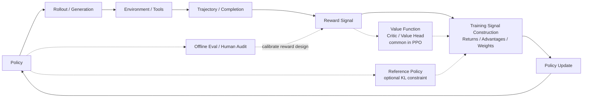

# A.1 Why Training Goes Off Track: Debugging from the First Anomalous Curve

Consider a very common training log. At step 800, a math reasoning model's training reward rises from 0.18 to 0.73; at the same time, accuracy on a fixed evaluation set drops from 42% to 40%, while average response length nearly doubles. The program reports no errors, and the loss backpropagates normally. Looking only at training reward, this run appears to be progressing well; when evaluation and output samples are examined together, the model has more likely learned the long format favored by the reward function.

Simply lowering the learning rate at this point will only change the optimization speed; it cannot correct the bias between reward and the true task. Effective debugging requires first answering: **In the training loop, which component shows the anomaly first?**

Reinforcement learning continuously changes its own data distribution. After a policy update, the next batch of trajectories changes accordingly; biased trajectories then produce new training signals. In supervised learning, a bad batch usually affects only one update; in RL, a bad policy continues to produce bad data. Therefore, the same surface symptom — reward not rising, KL spike, or evaluation drop — can originate from environment wiring, reward, value function, sample freshness, or the evaluation protocol.

This section establishes an outside-in diagnostic order. After studying it, you should be able to answer three questions:

1. When training curves go wrong, which component should you suspect first?
2. What relationships exist among metrics like Reward, Loss, KL, Entropy, Value Loss, GPU memory, and evaluation scores?
3. Faced with an unstable RL experiment, how do you investigate in small steps rather than randomly tuning hyperparameters by intuition?

These four engineering appendices follow the same thread: this section locates training failures; [A.2](./rl-infrastructure) explains how samples enter the training system; [A.3](./agentic-rl-infra) handles Agent tool execution and isolation; [A.4](./evaluation-badcase) uses evaluation and badcases to judge whether a fix is effective. When you need to look up log fields at any time, you can refer to [C.3 Metrics Glossary](./metrics-glossary).

## Step One: Reduce Training to a Closed Loop

Set aside specific frameworks and keep only the causal chain that every update must traverse: the policy generates behavior, the environment or scorer returns reward, the algorithm converts reward into a training signal, and then the policy is updated. The diagram below is a debugging map; real systems may omit the Critic, or expand a single response into a multi-step tool trajectory.



When any link in this diagram breaks, the final symptom may appear as "reward not rising." But the fixes are completely different.

Three things need to be distinguished here.

**Reward signal** is the score actually computed during training. It may come from the environment itself, a hand-written reward function, a reward model, a verifier, or a weighted combination of several rules.

**Training signal construction** converts reward into "what this update should encourage, what it should suppress." In PPO / Actor-Critic, this typically takes the form of return, value target, and advantage; advantage here can be roughly understood as "how much better this action or response is than current expectations." When the actual return exceeds the Critic's estimate, advantage is positive, and the policy increases the probability of the related behavior; otherwise it suppresses it. In GRPO / RLVR, a common approach is to sample multiple responses for the same prompt and construct training weights using the relative reward ranking within the group. TRL's GRPO documentation also breaks the pipeline into generation, advantage computation, KL estimation, and loss computation; where advantage comes from within-group reward normalization and does not depend on Critic predictions[^trlgrpo].

**Evaluation and human audit** are side-channel supervision. They are used to select checkpoints, detect reward hacking, and decide whether to roll back; normally they do not directly enter gradient updates. An evaluation drop can indicate bias in reward design, but evaluation scores are not the same as the training-time reward signal.

Therefore, this diagram is better used as a "unified debugging map," not as "the only pipeline for modern Agentic RL." PPO-RLHF looks more like the Critic + KL version in the diagram; GRPO/RLVR looks more like the "multiple generations + reward/verifier + within-group relative advantage" version; Agentic RL expands a single response into a multi-step tool trajectory, where reward may come from the final environment state, a rule verifier, or human/model review. If environment wiring is wrong, tuning the learning rate is useless; if the reward function is being gamed, continuing training only makes the model better at cheating; if the Critic cannot learn, PPO's advantage becomes noise; if KL spikes, the policy has left the trust region; if the evaluation protocol is contaminated, all pretty curves may be illusions.

::: tip Debugging Starting Point
First locate the component in the closed loop where the anomaly appears earliest, then decide which parameter needs to be modified.
:::

## Initial Diagnosis of Training Anomalies

When training anomalies appear, the most common mistake is to immediately adjust hyperparameters. For example, lowering the learning rate, increasing batch size, increasing the KL coefficient, or continuing to train for more steps. This seems proactive, but it introduces new variables and makes the original problem harder to locate.

This section introduces an initial diagnostic flow better suited to course experiments and research reproduction. Its goal is not to immediately fix training, but first to determine which component the anomaly comes from: experimental configuration, evaluation protocol, reward signal, model outputs, or the optimization process itself.

### Record Experimental Context

First record the basic context of this experiment, including configuration files, random seeds, code version, checkpoint, training logs, and evaluation commands. Reinforcement learning experiments are very sensitive to random seeds and implementation details; the same algorithm setup can show markedly different results under different seeds[^drltm]. If this information is not saved, subsequent analysis will have difficulty distinguishing "the algorithm is genuinely unstable" from "experimental conditions changed."

### Distinguish Training Metrics from Evaluation Metrics

Training reward only indicates that the model is optimizing some reward signal; it does not directly indicate that task capability has improved. A more reliable observation method is to simultaneously distinguish three types of information:

- **Training metrics**: such as training reward, policy loss, KL, entropy, etc., used to observe whether the optimization process is stable.
- **Evaluation metrics**: such as held-out benchmarks, private test sets, task success rates, used to judge whether capability has improved.
- **Behavior samples**: actual outputs from the model or agent, used to judge whether it has learned erroneous patterns.

For example, in RLHF training, if reward rises while evaluation scores stay flat and response length keeps increasing, this should usually not be interpreted as "training hasn't gone on long enough" — one should suspect a length preference in the reward signal.

### Inspect Model Output Samples

Curves are compressed representations of the training process; samples expose concrete behavior. During diagnosis, you should inspect at least three types of samples: high-reward samples, low-reward samples, and random samples from the latest checkpoint.

In language model training, reward hacking often first manifests as changes in text style: responses become longer, formats more complex, polite phrases more numerous, but information density drops. In Agentic RL, it may also manifest as increased tool call counts, while the final environment state hasn't actually completed the task.

### Construct a Minimal Reproduction Experiment

After confirming logs and samples, the experiment should be scaled down to a fast-running version: smaller model, smaller batch, fewer prompts, shorter training steps. A minimal reproduction experiment does not pursue final scores; it answers basic questions:

- Can the implementation learn under simple settings;
- Does reward have discriminative power;
- Is the evaluation protocol stable;
- If using PPO/Actor-Critic, can the value function fit a fixed rollout;
- If using GRPO/RLVR, is the reward ranking of multiple responses under the same prompt reasonable.

Many RL errors do not immediately cause program crashes. For example, a wrong `done` mask, reversed reward sign, padding tokens participating in loss, or changed evaluation temperature can all let training end normally while ultimately learning incorrect behavior. Therefore, completing a minimal reproduction before large-scale training is a critical step in the debugging flow.

## Diagnostic Order

Subsequent sections discuss different types of training problems separately. During actual diagnosis, it is recommended to investigate in an outside-in order.

First, check the environment and data. Whether the observations the agent sees are correct, whether actions are correctly executed by the environment, whether termination signals are handled correctly, and whether reward signs match expectations. If there are errors at this layer, subsequent algorithm updates are merely optimizing on bad data.

Second, check the evaluation protocol. If settings like sampling temperature, maximum output length, tool permissions, or test set splits change, evaluation results cannot be directly compared. If a public test set is repeatedly used for tuning, it gradually loses its evaluative meaning.

Third, check the reward signal. Whether reward is too sparse, whether there are extremely high-scoring outlier samples, whether it aligns with human judgment or independent evaluation. If the reward signal is untrustworthy, the more thoroughly the model trains, the more likely it is to optimize in the wrong direction.

Finally, enter the algorithm internals. PPO needs to check whether policy updates are too large; methods with a Critic need to check whether the value function is effective; GRPO/RLVR needs to check whether within-group reward comparisons are reasonable; Agentic RL additionally needs to check whether tool trajectories are consistent with the final environment state.

This order avoids suspecting all modules at once. First determine which layer the anomaly roughly belongs to, then enter the corresponding section for finer-grained investigation.

## Environment and Data: First Confirm the World Is Real

The most easily overlooked bugs in reinforcement learning are often before the algorithm.

For example, CartPole only accepts discrete actions 0/1, but the interface receives continuous values; the MuJoCo environment requires actions within `[-1, 1]`, but policy outputs haven't passed through tanh; dialog training doesn't mask padding tokens; after an Agent tool call fails, the trajectory is still marked as successful.

The common characteristic of these problems is: training can run, curves move, but the curves are meaningless.

### Minimal Unit Tests

Before formal training, perform at least four checks:

```python
def sanity_check_env(env, policy):
    obs, info = env.reset(seed=0)
    assert obs is not None

    action = policy.sample(obs)
    next_obs, reward, terminated, truncated, info = env.step(action)

    assert next_obs is not None
    assert isinstance(float(reward), float)
    assert isinstance(terminated, bool)
    assert isinstance(truncated, bool)

    return {
        "reward": reward,
        "done": terminated or truncated,
        "info_keys": list(info.keys()),
    }
```

Then do a cruder but very effective test: run 100 trajectories with a random policy and plot the reward distribution. Then run 100 trajectories with a hand-written "weak expert policy." If the expert policy shows no clear difference from the random policy, don't train the model yet — first check the environment and reward.

::: warning Common Wiring Errors
Reversed reward sign, unhandled terminal states, mismatched action scales, missing observation normalization, or swapped chosen/rejected in datasets will all cause correct algorithms to optimize on bad data.
:::

## Don't Let the Test Set Become the Training Set

RL projects are prone to "evaluation contamination." Even when the test set doesn't directly enter training data, repeatedly using it to adjust prompts, reward, KL coefficients, and checkpoints causes the test set to participate in training decisions.

This is especially severe in post-training and Agentic RL. The model may not have genuinely gotten stronger — it has simply become more adapted to a particular public benchmark, a particular judge, or a particular output format.

A lecture-style set of guidelines:

- **Set — smoke set**
  - Purpose: quickly detect implementation errors
  - Can look frequently: yes
- **Set — dev set**
  - Purpose: tune parameters, tune reward
  - Can look frequently: yes, but log it
- **Set — public test**
  - Purpose: observe trends
  - Can look frequently: look sparingly
- **Set — private test**
  - Purpose: release gate
  - Can look frequently: try not to look
- **Set — human audit set**
  - Purpose: calibrate reward and judge
  - Can look frequently: periodic sampling

The evaluation protocol must also be fixed: temperature, top_p, max_tokens, prompt template, tool permissions, timeout rules, pass@1/pass@k must all be written down clearly. Research on ALE evaluation protocols also reminds us: environmental stochasticity, starting states, and changes in evaluation methods can significantly affect RL conclusions[^ale].

## Having Reward Doesn't Mean Learning Is Possible

The reward discussed here is not the act of "reward design," but the actual reward signal that each transition, each response, or each trajectory receives during training. This signal must simultaneously satisfy two conditions: the right direction, and sufficient density.

Correct direction means the behaviors encouraged by reward are consistent with the true task. Sufficient density means the model can observe differences between trajectories even in early training. If 99.9% of trajectories have reward 0, policy gradients receive almost no usable information.

### Look at the Reward Distribution

Before training, plot a reward histogram rather than starting training immediately.

- **Distribution shape — almost all zeros**
  - Possible problem: reward too sparse
  - Fix: add intermediate rewards, curriculum learning, increase exploration
- **Distribution shape — almost all ones**
  - Possible problem: reward too lenient
  - Fix: increase task difficulty, split scoring dimensions
- **Distribution shape — extreme long tail**
  - Possible problem: a few samples dominate gradients
  - Fix: reward clipping / normalization
- **Distribution shape — mixed positive/negative signs**
  - Possible problem: reward definition unclear
  - Fix: go back to samples and inspect one by one
- **Distribution shape — low correlation with human scores**
  - Possible problem: proxy untrustworthy
  - Fix: rewrite reward or add human calibration

In PPO, reward also affects advantage. When reward scale is too large, advantage becomes a very sharp gradient signal, and policy updates may jump directly outside the trust region. Many high-quality implementations perform reward normalization, advantage normalization, and gradient clipping; these implementation details themselves change algorithm behavior[^implementation][^whatmatters].

## The Model Learned Test-Taking Tricks

Reward hacking means the model successfully optimized the given metric, but that metric does not fully express the designer's true intent. The AI safety literature often calls this phenomenon specification gaming[^concrete][^weng].

The most classic language model version is: the reward model favors detailed responses, so the model starts writing longer, politer, more vacuous responses. Reward keeps climbing, but human audit quality declines. Research on reward model overoptimization also shows that proxy rewards can continue to improve while true preferences decline after a certain point[^overopt].

### The Diagnostic Triad

Reward hacking typically has three signals appearing simultaneously:

1. **Reward rising**: the training dashboard looks great.
2. **Side-metric anomalies**: length, repetition rate, format templates, refusal rate, tool call counts undergo systematic changes.
3. **True evaluation declining**: human audit, private sets, task success rates don't improve in sync.

```python
def audit_reward_hacking(samples):
    suspicious = []
    for item in samples:
        if item["reward"] > 0.9 and item["human_score"] < 0.4:
            suspicious.append(("reward-human mismatch", item["id"]))
        if item["response_len"] > item["baseline_len"] * 2:
            suspicious.append(("length inflation", item["id"]))
        if item["repeat_ratio"] > 0.2:
            suspicious.append(("repetition", item["id"]))
    return suspicious
```

When fixing, don't just add a penalty term and stop. A more robust approach is to break reward into separately logged components: accuracy, constraint satisfaction, safety, conciseness, format, and tool results each scored independently. Work like RewardBench also shows that reward models themselves need evaluation; you cannot assume they always represent human preferences[^rewardbench].

## PPO's Safety Belt Can Also Fail

PPO's core intuition is "small-step updates." TRPO uses a KL constraint to explicitly limit policy change; PPO approximates this goal with a clipped surrogate objective[^trpo][^ppo][^spinningup]. But clipping is not a magic shield.

If the learning rate is too large, PPO epochs too many, batch too small, or advantage scale anomalous, the policy can still take too large a step.

### Watch Three Metrics

- **Metric — KL divergence**
  - How to read it: distance between new policy and old/reference policy
  - What anomaly means: policy is drifting too fast
- **Metric — clip fraction**
  - How to read it: what fraction of samples are being clipped
  - What anomaly means: PPO is frequently hitting the brakes
- **Metric — entropy**
  - How to read it: how much randomness remains in the policy
  - What anomaly means: premature convergence or degenerate randomness

Policy collapse usually doesn't start from reward; it starts from KL, clip fraction, and entropy. Reward is a posterior symptom.

```python
def ppo_guardrail(metrics):
    if metrics["kl"] > metrics["target_kl"] * 2:
        return "stop update: KL too high"
    if metrics["clip_fraction"] > 0.4:
        return "reduce lr or PPO epochs"
    if metrics["entropy"] < metrics["entropy_floor"]:
        return "increase exploration or KL constraint"
    return "continue"
```

In RLHF, you also need to look at KL relative to the reference model. Pipelines like InstructGPT introduce a KL penalty precisely to prevent the RL stage from washing away the language capabilities learned during SFT[^instructgpt].

## Critic: The Failure Source in PPO / Actor-Critic

This section is only for methods with a Critic or value head, such as Actor-Critic, PPO, and some PPO-RLHF implementations. Critic-free methods like GRPO/RLVR can skip this section and instead check within-group reward, KL, and loss construction.

In Actor-Critic, the Critic's job is to estimate state value. It doesn't directly output actions, so many people debugging look only at policy loss. But if the Critic is wrong, advantage is wrong; if advantage is wrong, the Actor updates in the wrong direction.

### Signals the Critic Is Broken

- **Signal — value loss doesn't decrease over time:** Critic hasn't fit returns
- **Signal — explained variance < 0:** worse than predicting the mean
- **Signal — policy reward oscillates:** Actor is pushed around by noisy advantage
- **Signal — value prediction scale much smaller than return:** reward scale or value target has problems

Common fixes include: reducing reward scale, normalizing returns, decreasing/increasing critic learning rate, increasing critic network capacity, checking bootstrap targets, checking terminal masks.

A very practical check is: fix a batch of rollouts, don't update the actor, only train the critic, and see whether it can fit those returns. If it can't fit them, fix the critic first.

## Too Certain and Too Random Are Both Bad

Exploration problems have two opposite manifestations.

One is entropy quickly going to zero: the model prematurely commits to a particular action or response template and gets stuck in a local optimum. The other is entropy staying persistently high: the policy behaves like a random walk, and reward is not being absorbed into parameters.

- **Manifestation — entropy rapidly goes to zero**
  - Possible causes: reward too strong, KL too weak, temperature too low
  - Fix: add entropy bonus, reduce lr, strengthen KL
- **Manifestation — entropy stays high long-term**
  - Possible causes: reward too sparse, learning rate too low, advantage noise high
  - Fix: reward shaping, increase sampling volume, check advantage
- **Manifestation — diverse behavior but no progress**
  - Possible causes: exploration not being discriminated by evaluation
  - Fix: change reward or add curriculum
- **Manifestation — uniform behavior but high reward**
  - Possible causes: possible reward hacking
  - Fix: sample-inspect high-reward trajectories

In language models, exploration is not just "action randomness" — it also includes response length, reasoning paths, tool selection, and the refusal/non-refusal boundary. Looking only at token entropy is insufficient; you also need to look at behavioral-level diversity.

## Data Freshness: On-Policy Is Not a Slogan

PPO is an on-policy algorithm: it assumes the data used for updates comes from a policy "near" the current one. During training we save old logprob precisely to know how much the new policy differs from the sampling policy.

If rollout workers and the learner are out of sync, or if the buffer contains very old data, you will see a strange phenomenon: loss can still be computed, gradients still flow, but metrics fluctuate up and down, and clip fraction is hard to interpret.

When investigating, ask three questions:

1. Does each rollout record which policy version generated it?
2. Is the old logprob used during updates consistent with the sampling policy?
3. How many rounds has the policy already updated by the time a rollout enters training?

Agentic RL is more prone to this pitfall, because a single trajectory can be long, tool execution is slow, and sampling and training are naturally asynchronous. Don't pursue throughput alone; also control data staleness.

## NaNs Usually Have Precursors

NaNs rarely appear out of nowhere. They are typically preceded by grad norm spikes, extreme logprob values, reward outliers, value loss explosions, or mixed-precision overflow.

- **Problem — grad norm spike**
  - Check: p95 / max grad norm
  - Fix: gradient clipping, reduce lr
- **Problem — extreme logprob**
  - Check: whether log is taken of zero probability
  - Fix: clamp, check masks
- **Problem — fp16 overflow**
  - Check: loss scale, NaN step
  - Fix: bf16, dynamic loss scaling
- **Problem — reward outlier**
  - Check: reward max/min
  - Fix: clipping, normalization
- **Problem — value explosion**
  - Check: value target distribution
  - Fix: return normalization

Don't wait for loss to become NaN before stopping training. Training scripts should save experimental state and stop the current update when key metrics go out of bounds.

## GPU Memory Is Only Part of the Ledger

RLHF/PPO consumes more resources than ordinary SFT because it may simultaneously require an actor, critic, reference model, and reward model, plus saved rollouts, logprobs, values, advantages, and long-sequence activations.

GPU memory comes mainly from four sources:

- **Source — model weights**
  - Why it uses memory: multiple models resident
  - Common handling: freezing, sharing, separating rollout/training
- **Source — optimizer states**
  - Why it uses memory: Adam's first/second moments
  - Common handling: ZeRO, FSDP, 8-bit optimizer
- **Source — gradients**
  - Why it uses memory: more trainable parameters means more cost
  - Common handling: LoRA, freezing the backbone
- **Source — activations**
  - Why it uses memory: larger batch and seq_len mean more cost
  - Common handling: checkpointing, shortening sequences

ZeRO shards optimizer states, gradients, and parameters across multiple GPUs[^zero][^deepspeedzero]; FSDP reduces single-card resident memory through parameter sharding and on-demand all-gather[^fsdp]; LoRA freezes the main model and only trains low-rank adapters[^lora]. These are not "advanced optimizations" — they are prerequisites for whether large-model RL training can even start.

But resource problems aren't just OOM. Throughput drops, low GPU utilization, rollout workers waiting on environments, and reward model scoring becoming a bottleneck can all slow training, make data stale, and ultimately feed back into algorithmic stability.

## Additional Pitfalls in RLHF and Agentic RL

RL for language models and agents has several categories of special failures beyond classic control.

- **Scenario — RLHF**
  - Additional pitfall: length preference
  - Example: responses get longer and longer, but information density drops
- **Scenario — RLHF**
  - Additional pitfall: refusal shift
  - Example: safety reward is too strong, the model over-refuses
- **Scenario — RLHF**
  - Additional pitfall: judge bias
  - Example: LLM judge favors a particular writing style
- **Scenario — RLVR/GRPO**
  - Additional pitfall: format hacking
  - Example: the model learns to output format-compliant but reasoning-incorrect responses
- **Scenario — Agentic RL**
  - Additional pitfall: tool hacking
  - Example: repeatedly calling tools to farm process scores
- **Scenario — Agentic RL**
  - Additional pitfall: spurious state success
  - Example: text says "completed" but the environment state hasn't changed
- **Scenario — Agentic RL**
  - Additional pitfall: long-trajectory credit assignment
  - Example: final failure is hard to attribute to any specific step

Therefore, Agentic RL evaluation cannot look only at final text; it must look at environment state, whether tool calls are legitimate, step count, cost, and failure recovery ability. RLHF evaluation cannot look only at the reward model; it must simultaneously look at human audits, private sets, length, repetition rate, safety regressions, and real task success rates.

## A Complete Troubleshooting Path

Suppose logs show: reward rising, benchmark not rising, outputs getting longer and longer.

Don't immediately say "training isn't converging." Trace along the closed loop:

1. **Evaluation protocol**: are benchmark temperature, max_tokens consistent with the baseline?
2. **Sample spot-check**: are the highest-reward samples longer, emptier, more template-like?
3. **Reward decomposition**: does the reward contain implicit preferences for length, format, or polite tone?
4. **KL and entropy**: has the policy drifted too far from the reference model, has mode collapse occurred?
5. **Fix experiment**: add length penalty or information density metric, run only a short training run as control.
6. **Release decision**: if reward drops but the private set rises, it means the previous reward may have been wrong.

Now consider another example: reward plummets, KL spikes, clip fraction persistently at 0.5.

Here, suspect overly aggressive policy updates first:

1. Roll back to the most recent healthy checkpoint.
2. Lower the learning rate.
3. Reduce PPO epochs.
4. Enable target KL early stopping.
5. Check advantage normalization and reward scale.

The two examples correspond to completely different fixes. That's why "what do I do when reward doesn't rise" is not a good question; the better question is "which segment of the closed loop broke first in terms of evidence?"

## Before, During, and After Training Checklists

### Before Training

- **Check — environment unit tests:** do reset/step/done/reward behave as expected?
- **Check — random policy baseline:** what is the reward distribution of a random policy?
- **Check — weak expert baseline:** can a simple rule clearly outperform random?
- **Check — reward histogram:** is reward all zeros, all ones, or an extreme long tail?
- **Check — eval config:** is the evaluation protocol fixed and saved?
- **Check — GPU memory estimate:** can the model count, batch size, and seq_len be afforded?

### During Training

- **Signal — KL spike:** stop updating, reduce lr or strengthen KL
- **Signal — clip fraction persistently too high:** reduce PPO epochs or update step size
- **Signal — entropy rapidly going to zero:** check exploration and reward hacking
- **Signal — value loss not decreasing:** train the Critic separately for a fitting test
- **Signal — reward rises, eval drops:** immediately spot-check high-reward samples
- **Signal — response length inflation:** check for length preference
- **Signal — OOM or throughput sudden drop:** first reduce micro batch / seq_len, then apply ZeRO/FSDP

### After Training

- **Deliverable — best eval checkpoint:** the last step isn't necessarily the best
- **Deliverable — last checkpoint:** useful for reproducing tail-of-training issues
- **Deliverable — failure checkpoint:** useful for analyzing collapse precursors
- **Deliverable — reward audit samples:** for judging whether reward hacking occurred
- **Deliverable — multi-seed results:** avoid accidental success
- **Deliverable — private set report:** prevent public set overfitting

## Summary

RL debugging is not about memorizing a list of "failure names"; it is about following the closed loop to find evidence.

The environment and data determine whether what you learn is the real world; reward and evaluation determine whether the optimization direction is the goal you actually want; policy updates and the Critic determine whether gradients are stable; exploration determines whether the model can discover better behaviors; system resources determine whether training can continuously produce fresh data.

When encountering anomalies, first answer the following four questions before deciding whether hyperparameters like learning rate need adjustment:

> Which curve broke first? Which segment of the closed loop does it belong to? Is there a minimal experiment that can verify this judgment?

That is where RL training moves from "mystical hyperparameter tuning" toward engineering.

## References

[^ppo]: Schulman et al., [Proximal Policy Optimization Algorithms](https://arxiv.org/abs/1707.06347), 2017.

[^spinningup]: OpenAI Spinning Up, [Proximal Policy Optimization](https://spinningup.openai.com/en/latest/algorithms/ppo.html).

[^trpo]: Schulman et al., [Trust Region Policy Optimization](https://arxiv.org/abs/1502.05477), 2015.

[^instructgpt]: Ouyang et al., [Training language models to follow instructions with human feedback](https://arxiv.org/abs/2203.02155), 2022.

[^trlgrpo]: Hugging Face TRL, [GRPO Trainer](https://huggingface.co/docs/trl/grpo_trainer).

[^drltm]: Henderson et al., [Deep Reinforcement Learning that Matters](https://arxiv.org/abs/1709.06560), 2018.

[^implementation]: Engstrom et al., [Implementation Matters in Deep RL: A Case Study on PPO and TRPO](https://openreview.net/forum?id=r1etN1rtPB), 2020.

[^whatmatters]: Andrychowicz et al., [What Matters In On-Policy Reinforcement Learning? A Large-Scale Empirical Study](https://arxiv.org/abs/2006.05990), 2020.

[^ale]: Machado et al., [Revisiting the Arcade Learning Environment: Evaluation Protocols and Open Problems for General Agents](https://arxiv.org/abs/1709.06009), 2018.

[^concrete]: Amodei et al., [Concrete Problems in AI Safety](https://arxiv.org/abs/1606.06565), 2016.

[^weng]: Lilian Weng, [Reward Hacking in Reinforcement Learning](https://lilianweng.github.io/posts/2024-11-28-reward-hacking/), 2024.

[^overopt]: Gao et al., [Scaling Laws for Reward Model Overoptimization](https://arxiv.org/abs/2210.10760), 2022.

[^rewardbench]: Lambert et al., [RewardBench: Evaluating Reward Models for Language Modeling](https://arxiv.org/abs/2403.13787), 2024.

[^zero]: Rajbhandari et al., [ZeRO: Memory Optimizations Toward Training Trillion Parameter Models](https://arxiv.org/abs/1910.02054), 2019.

[^deepspeedzero]: Microsoft DeepSpeed, [ZeRO Tutorial](https://www.deepspeed.ai/tutorials/zero/).

[^fsdp]: PyTorch Docs, [FullyShardedDataParallel](https://docs.pytorch.org/docs/stable/fsdp.html).

[^lora]: Hu et al., [LoRA: Low-Rank Adaptation of Large Language Models](https://arxiv.org/abs/2106.09685), 2021.
