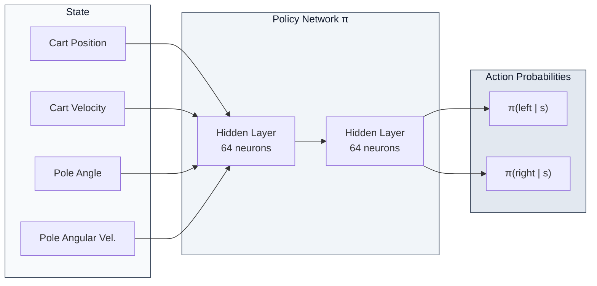
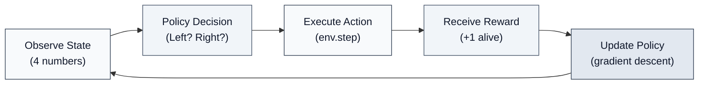
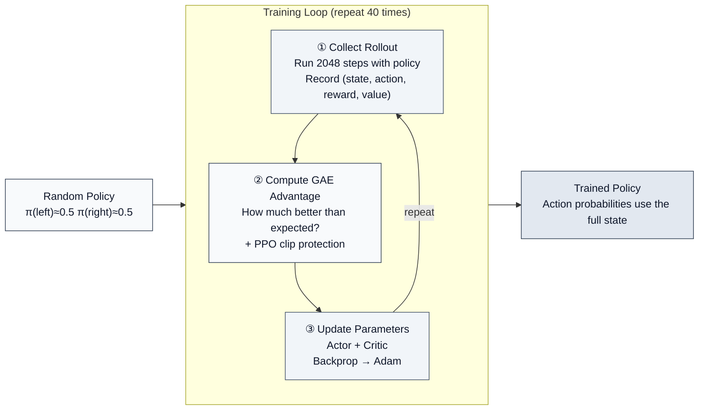

# 1.2 CartPole Principles

> **Code and data used in this section**: [pure PyTorch PPO](https://github.com/walkinglabs/hands-on-modern-rl/blob/main/code/chapter01_cartpole/2-pytorch_ppo.py) · [raw metrics CSV](https://github.com/walkinglabs/hands-on-modern-rl/blob/main/code/chapter01_cartpole/output/training_metrics_seed42.csv) · [plotting script](https://github.com/walkinglabs/hands-on-modern-rl/blob/main/code/chapter01_cartpole/plot_curves.py)

::: tip Optional reading
This section is optional. If you already have some Python, PyTorch, or deep learning background, you can read it straight through. If not, jump ahead to [1.3 Hands-on: PPO Training Visualization](./training) and come back here when you want to understand what the training loop actually does.
:::

In the previous section we ran CartPole end to end and watched an agent improve from random actions to stable balancing. This section first unpacks the principles behind that result — what the environment tells the agent, how the agent chooses actions, and how PPO uses a batch of interaction data to improve the policy — then walks through a real training record to learn how to read episode return and four PPO diagnostic metrics.

Running code is not the same as understanding reinforcement learning.

RL as a learning paradigm has a foundation that differs from supervised and unsupervised learning. Long before the term "reinforcement learning" became standard, the core idea was already present in behavioral psychology: **trial-and-error learning**. Edward Thorndike's Law of Effect (early 20th century) captured the intuition: behaviors that lead to satisfying outcomes are reinforced; behaviors that lead to annoying outcomes are weakened. Decades later, Andrew Barto and Richard Sutton formalized these ideas into the modern RL framework with the Markov Decision Process (MDP) and four core objects: **state, action, reward, and policy** (Sutton & Barto, 1998).

This framework is extremely general. It applies not only to CartPole, but also to Go (Silver et al., 2016), robotics control (Levine et al., 2016), and post-training for large language models (Ouyang et al., 2022). Different tasks change the concrete meaning of "state/action/reward", but the underlying structure stays the same.

In this section we return to CartPole and unpack its:

1. state representation
2. action space
3. reward mechanism
4. decision policy

### 1.1.1 State: What Does the Agent Observe?

At every step, CartPole provides the agent with a 4-dimensional observation vector. These bounds are not manually defined; they are built into the Gymnasium environment. A few lines of code reveal them:

```python
import gymnasium as gym
import numpy as np

env = gym.make("CartPole-v1")
print(f"Observation upper bound: {env.observation_space.high}")
print(f"Observation lower bound: {env.observation_space.low}")
print(
    f"Termination thresholds: position ±{env.unwrapped.x_threshold}, "
    f"angle ±{env.unwrapped.theta_threshold_radians:.4f} rad "
    f"(≈ ±{np.degrees(env.unwrapped.theta_threshold_radians):.0f}°)"
)
```

Example output:

```
Observation upper bound: [4.8         inf 0.41887903  inf]
Observation lower bound: [-4.8         -inf -0.41887903 -inf]
Termination thresholds: position ±2.4, angle ±0.2094 rad (≈ ±12°)
```

Organized into a table, this is the 4-dimensional observation vector the agent receives each frame:

| Index | Meaning               | `observation_space` bounds     |
| ----- | --------------------- | ------------------------------ |
| 0     | cart position         | -4.8 to 4.8                    |
| 1     | cart velocity         | `-inf` to `inf`                |
| 2     | pole angle            | -0.4189 to 0.4189 rad (≈ ±24°) |
| 3     | pole angular velocity | `-inf` to `inf`                |

::: warning Why are velocities `inf`?
Gymnasium does not declare finite observation bounds for cart velocity or pole angular velocity, so those dimensions display `inf`. To describe the empirical range of a particular run, compute the minimum and maximum from its recorded trajectories rather than assuming a typical interval.
:::

These 4 numbers form a complete description of the current situation. The agent cannot access the environment's internal state-transition rules or physics parameters; all information it uses for decisions is encoded in this 4D observation.

In reinforcement learning, "state" is a numerical description of the environment's current situation. Different tasks have different state representations — the state in chess is the piece distribution across the board, in autonomous driving it is camera images and radar data, and in CartPole it is these 4 numbers. In fact, the choice of state representation has a profound impact on RL algorithm performance. In early research, states were typically hand-crafted features (such as robot joint angles and angular velocities). With the rise of deep learning, researchers began using high-dimensional raw observations (such as pixels) directly as states, letting neural networks learn useful feature representations on their own (Mnih et al., 2013). This is a trend we will see repeatedly throughout this book — from hand-crafted features to learned features.

### 1.1.2 Action: What Can the Agent Do?

CartPole's action space is as simple as it gets: two discrete actions.

| Action | Meaning             |
| ------ | ------------------- |
| 0      | push the cart left  |
| 1      | push the cart right |

There is no "do nothing" and no continuous magnitude (no "push lightly vs. strongly"). This limited, discrete set of actions is the most common type of action space in RL (called a `Discrete` action space). However, not all tasks have such simple action spaces. In Chapter 11, we will encounter continuous action spaces — such as controlling a robot's joint angles — which require fundamentally different handling. In fact, the type of action space (discrete vs. continuous) largely determines the choice of algorithm. Q-learning-style algorithms are naturally suited to discrete action spaces, while policy gradient methods (like the PPO we use here) can handle both — which is one reason PPO is widely adopted in industry.

### 1.1.3 Reward: What Is Being Optimized?

::: tip Reward rules

- **Each surviving step → +1 point** (including the terminating step)
- **Episode termination conditions**: pole angle exceeds ±12°, or cart position exceeds ±2.4
- **Maximum score = 500 points** (CartPole-v1's step limit)
  :::

The two termination thresholds (±2.4 and ±12°) also come from the environment itself, as verified by the printout above: `env.unwrapped.x_threshold` returns 2.4, and `env.unwrapped.theta_threshold_radians` returns approximately 0.2094 rad (i.e., 12°). The 500-step limit can be confirmed via `env.spec.max_episode_steps`:

```python
print(f"Max episode steps: {env.spec.max_episode_steps}")  # Output: 500
```

This design appears simple, but it embodies a deep insight. Richard Sutton proposed the famous "Reward Hypothesis" in his classic textbook: all goals can be described as "maximizing the expected cumulative reward signal" (Sutton & Barto, 2018). In CartPole, this reward signal is +1 per step — as long as the pole has not fallen, the agent receives a positive reward.

However, this seemingly intuitive reward design actually hides a core challenge: **the reward signal is delayed and sparse**. The agent receives +1 at each step, but it cannot directly determine which specific step's decision caused the episode to terminate early or continue. It only knows "this episode lasted 50 steps in total"; whether pushing left or pushing right at step 23 was better requires inference across many rounds of interaction.

This property — "the reward signal only reflects overall outcome quality, without indicating which specific step's decision was better" — is one of the core features that distinguishes RL from supervised learning. In supervised learning, each training sample has a clear label as the correct answer; in RL, there is only the final total return, and the agent must infer the intermediate process through repeated interaction. Consider learning to ride a bicycle: the learner does not master it because someone precisely instructs "left foot 30%, right foot 20%" at every moment, but rather gradually perceives through repeated attempts which actions help maintain balance.

### 1.1.4 Policy: The Rule for Choosing Actions

Stringing together the three elements above gives us the core concept of RL — **Policy**.

A policy is "the rule for choosing action $a$ in state $s$." In CartPole, the policy answers the question: **"Given the current cart position, velocity, pole angle, and angular velocity, should I push left or right?"**

Mathematically, a policy maps a state to an action probability distribution: $\pi(a|s)$. The small Actor output initialization makes both action probabilities close to `0.5` at the start. After training, the probabilities depend on the complete state; pole angle alone does not determine a fixed percentage.



You might ask: **Does a policy have to be a neural network?**

The answer is **no**. A policy is simply a mapping rule from states to actions; it can take any form. In fact, before deep learning became dominant, RL policies had three classic forms:

- **Tabular Policy**: Build a table that hard-codes the optimal action for each state. For example, in chess, one could theoretically use a table to record the optimal move for every board position. However, when the state space is large (Go has approximately $10^{170}$ possible positions), the storage requirements of a table far exceed the capacity of any physical device.
- **Linear Policy**: Use a linear function $\pi(a|s) = \text{softmax}(W \cdot s + b)$ to map states to action probabilities. Computationally simple and convenient for theoretical analysis, but limited to learning linear decision boundaries — insufficient for nonlinear relationships like "the combination of pole angle and angular velocity determines which way to push."
- **Neural Network Policy**: Use multiple nonlinear transformations to fit $\pi(a|s)$. This is the small 4→64→64→2 network we saw earlier in “The Policy Function.” It can be trained end-to-end with gradient descent and is guaranteed by the universal approximation theorem — as long as the network is wide enough, it can approximate any continuous function.

For the simple CartPole task, all three policy types can work. But when the state space grows from 4 dimensions to 84×84×4 pixels (Atari games [^1]), or to tens of thousands of text tokens (large language models), tabular and linear policies are no longer viable — the state space is too large to store or learn effectively.

Notably, the evolution of policy representation methods parallels the evolution of feature extraction methods in computer vision. Before 2012, image features were mainly hand-crafted (SIFT, SURF, HOG); after AlexNet, there was a gradual shift toward automatic learning by neural networks. RL policies underwent a similar transition from hand-crafted (tabular and linear) to end-to-end learning (neural networks). The key driver of this shift was also the growth of data and compute power — when the state space is large enough and training data is sufficient, the advantages of neural network policies become undeniable.

Therefore, **neural networks have become the standard choice in modern RL not because they are the only option, but because they are the only general solution that can handle high-dimensional, complex states.** From CartPole to Atari to LLMs, all policies in this book are implemented as neural networks — but their core idea is the same: input a state, output action probabilities, and optimize via gradient descent.

### 1.1.5 Summary: The RL Core Loop

Combining the four elements above gives us the core loop of reinforcement learning:



In CartPole, this loop means:

1. **Observe state**: The environment tells the agent the current 4 numbers (position, velocity, angle, angular velocity)
2. **Policy decision**: The policy network computes the probabilities of "push left" and "push right" from these 4 numbers
3. **Execute action**: Randomly select an action according to the probabilities and pass it to the environment
4. **Receive reward**: If the pole hasn't fallen, receive +1 point and the next 4 numbers
5. **Update policy**: Based on this episode's performance (total score), adjust the policy network's parameters

This loop applies not only to CartPole — it applies to all RL problems. Replace "cart position" with "board layout," "push left/right" with "move position," and "+1 alive" with "win/lose," and this loop becomes the training process for a Go AI. Replace "4 numbers" with "camera pixels," "push left/right" with "steering angle," and this loop becomes the training process for autonomous driving.

Different tasks only change the specific definitions of state, action, and reward; the underlying structure is always these four elements.

### 1.1.6 Opening the Black Box: What Does SB3 Hide?

So far, we have successfully run CartPole training, read the training curves, and identified state, action, reward, and policy — the four core elements of RL. But throughout this exploration, one component has remained a black box: the line `model.learn(total_timesteps=80000)`. It is just a few characters, yet it completes the entire learning process from random initialization to an optimal policy in seconds.

SB3 encapsulates a great deal of engineering detail — this encapsulation allows us to avoid complex math and lengthy code in Chapter 1. But without understanding its internal mechanisms, the content in later chapters on policy gradients (Chapter 6) and PPO (Chapter 8) will seem to appear out of nowhere. Just as you can drive a car without understanding every engine component — but if you want to build one yourself, you need to open the hood.

Therefore, before concluding this chapter, we need to understand the internal structure of this black box.

The logic behind `model.learn()` can be decomposed into three components: **an Actor-Critic network for decision-making and evaluation, a Rollout loop for collecting experience data, and PPO update rules for adjusting network parameters based on return signals.** We have implemented it in its entirety using pure PyTorch; the code is in [2-pytorch_ppo.py](https://github.com/walkinglabs/hands-on-modern-rl/blob/main/code/chapter01_cartpole/2-pytorch_ppo.py). Let us examine the core logic of each component.

#### 1.1.6.1 Actor-Critic Network: Both Decision-Making and Evaluation

Earlier in “The Policy Function,” we saw that the policy $\pi$ is a function that "takes a state as input and outputs action probabilities." For a long time, researchers used only a single policy network for decision-making — this is how policy gradient methods worked (Williams, 1992). However, pure policy gradient methods have a significant weakness: high variance. Gradients trained on the same batch of data may point in completely different directions, leading to unstable training. To address this problem, researchers introduced a "critic" to reduce variance — this is the origin of the Actor-Critic architecture (Sutton et al., 2000; Mnih et al., 2016).

The core idea of Actor-Critic is a division of labor:

- **Actor**: The policy network; takes a state as input and outputs the probability of each action.
- **Critic**: Takes a state as input and outputs a score — "the expected total future reward starting from this state."

```python
class ActorCritic(nn.Module):
    def __init__(self, obs_dim=4, act_dim=2, hidden=64):
        super().__init__()
        self.actor = nn.Sequential(
            nn.Linear(obs_dim, hidden), nn.Tanh(),
            nn.Linear(hidden, hidden), nn.Tanh(),
            nn.Linear(hidden, act_dim),
        )
        self.critic = nn.Sequential(
            nn.Linear(obs_dim, hidden), nn.Tanh(),
            nn.Linear(hidden, hidden), nn.Tanh(),
            nn.Linear(hidden, 1),
        )

    def forward(self, x):
        logits = self.actor(x)       # action scores
        value = self.critic(x)       # state value
        return logits, value
```

Actor and Critic use **separate hidden layers** to avoid gradient conflicts. The Actor outputs logits (e.g., [0.3, 0.7]), which are converted to probabilities via softmax — "30% push left, 70% push right." The Critic outputs a scalar representing "how good the current situation is."

An important detail: **orthogonal initialization**. The Actor's output layer uses a very small gain (0.01), making the initial policy close to a uniform distribution (50/50), ensuring sufficient exploration early in training. This is fully consistent with SB3's default behavior.

#### 1.1.6.2 Collecting Trajectories (Rollout): One Round of Agent-Environment Interaction

With the network, the next step is to let it interact with the environment and collect training data. This process is called a **Rollout**:

```python
def collect_rollout(model, env, obs, num_steps=2048):
    transitions = []

    for _ in range(num_steps):
        obs_tensor = torch.FloatTensor(obs)
        with torch.no_grad():
            action, log_prob, value = model.get_action(obs_tensor)

        next_obs, reward, terminated, truncated, _ = env.step(action.item())
        with torch.no_grad():
            if terminated:
                next_value = 0.0
            else:
                _, next_value_tensor = model(torch.FloatTensor(next_obs))
                next_value = next_value_tensor.item()

        transitions.append({
            "obs": obs, "action": action.item(),
            "log_prob": log_prob.item(), "value": value.item(),
            "reward": float(reward),
            "terminated": terminated,  # pole fell; episode ends naturally
            "truncated": truncated,    # step limit reached (pole still up)
            "next_value": next_value,
        })

        obs = next_obs
        if terminated or truncated:
            obs, _ = env.reset()

    return transitions, obs
```

This code distinguishes `terminated` (the pole fell or the cart left the region) from `truncated` (the 500-step time limit). Treating time truncation as true termination incorrectly sets the value target to zero. The script uses `next_value=0` after true termination and bootstraps from `V(s')` after time truncation or when a rollout ends mid-episode.

The observation is also carried into the next rollout. A rollout is a training-batch boundary, not a reason to reset the environment.

Another noteworthy aspect: the sampling method in the accompanying code does not directly choose the most probable action, but **samples according to probabilities**:

```python
dist = torch.distributions.Categorical(logits=logits)
action = dist.sample()  # sample according to probabilities, not argmax
```

Even if the network outputs a 90% probability of pushing right, there is still a 10% chance of choosing left. This randomness ensures continued exploration, corresponding to the “policy entropy” we will discuss in Section 1.2.

#### 1.1.6.3 GAE Advantage Estimation: How Much Better Than Expected?

After collecting data, PPO needs to answer a question: **How much better than "average" was each action?** This is the concept of "advantage."

In fact, the concept of "advantage" can be traced back to the TD error in Temporal Difference Learning (Sutton, 1988). The TD error measures "how much better the actual reward was than expected." However, single-step TD error relies more on value function estimation and typically has low variance but high bias; Monte Carlo or long multi-step returns rely more on actual sampled returns and typically have low bias but high variance. Schulman et al. proposed GAE (Generalized Advantage Estimation) in 2016, which uses a parameter $\lambda$ to smoothly trade off between bias and variance:

```python
def compute_gae(transitions, gamma=0.99, lam=0.95):
    gae = 0
    raw_advantages = []
    for step in reversed(range(len(transitions))):
        t = transitions[step]
        episode_end = t["terminated"] or t["truncated"]
        delta = t["reward"] + gamma * t["next_value"] - t["value"]
        gae = delta + gamma * lam * (1.0 - float(episode_end)) * gae
        raw_advantages.insert(0, gae)

    raw_advantages = torch.tensor(raw_advantages, dtype=torch.float32)
    values = torch.tensor([t["value"] for t in transitions])
    returns = raw_advantages + values
    advantages = (raw_advantages - raw_advantages.mean()) / (
        raw_advantages.std(unbiased=False) + 1e-8
    )
    return advantages, returns
```

Intuitively, `delta` answers the question: "The reward received at this step + the expected value of the next step - the expected value of this step." If `delta > 0`, this step was better than expected; if `delta < 0`, it was worse than expected. GAE combines multi-step deltas through `gamma * lam * gae` to form a more stable, lower-variance advantage estimate. When $\lambda = 0$, GAE reduces to single-step TD error (low variance but high bias); when $\lambda = 1$, GAE reduces to Monte Carlo return (low bias but high variance). In practice, $\lambda = 0.95$ is commonly used to balance the two.

#### 1.1.6.4 PPO Update: Clipping for Stable Training

The final step is to use advantages to update the network. Before PPO, policy gradient methods faced a fundamental dilemma: too small a learning rate meant training was too slow, while too large a learning rate could cause the policy to collapse in a single step. In 2015, Schulman et al. proposed TRPO (Trust Region Policy Optimization), which constrains the KL divergence between the old and new policies to limit the magnitude of each update. TRPO has good theoretical properties but is complex to implement — requiring natural gradient and conjugate gradient computation. In 2017, Schulman et al. further proposed PPO (Proximal Policy Optimization), which replaces the KL constraint with a simple clipping trick, maintaining training stability while greatly simplifying the implementation:

```python
def ppo_update(model, optimizer, transitions, advantages, returns, clip_eps=0.2):
    for epoch in range(10):  # train on the same data for 10 epochs
        for batch in mini_batches:
            logits, values = model(batch_obs)
            new_log_probs = dist.log_prob(batch_actions)

            # Ratio: probability ratio of new vs. old policy
            ratio = exp(new_log_probs - old_log_probs)

            # PPO clipped objective: limit ratio to [0.8, 1.2]
            surr1 = ratio * advantages
            surr2 = clamp(ratio, 1-clip_eps, 1+clip_eps) * advantages
            policy_loss = -min(surr1, surr2).mean()

            # Critic also needs to learn
            value_loss = ((values - returns) ** 2).mean()

            # Entropy bonus: encourage exploration
            entropy = dist.entropy().mean()

            loss = policy_loss + 0.5 * value_loss - 0.0 * entropy
            loss.backward()
            optimizer.step()
```

The meaning of clipping is straightforward: if the difference between the new and old policies already exceeds 20% (`clip_eps=0.2`), further change in that direction is no longer encouraged. It is like a driving instructor who does not let a student make large steering adjustments at once, but instead allows only small corrections each time.

Each PPO update step also records two health metrics: **KL divergence** (measuring the difference between old and new policies) and **clip fraction** (the proportion of samples that were clipped). These two metrics are visible in the SwanLab dashboard — excessively large KL divergence indicates too-large single-step updates, and an excessively high clip fraction indicates overly rapid policy changes; both warrant attention.

#### 1.1.6.5 The Complete Pipeline

We have now seen three components: the Actor-Critic network, Rollout collection, and PPO updates. The complete runnable code is in [2-pytorch_ppo.py](https://github.com/walkinglabs/hands-on-modern-rl/blob/main/code/chapter01_cartpole/2-pytorch_ppo.py). The core skeleton is:



```python
model = ActorCritic()
optimizer = Adam(model.parameters(), lr=3e-4)
env = gym.make("CartPole-v1")
obs, _ = env.reset(seed=42)

for iteration in range(40):
    # Step 1: Collect experience data (2048 steps)
    transitions, obs = collect_rollout(model, env, obs, 2048)

    # Step 2: Compute GAE advantages
    advantages, returns = compute_gae(transitions)

    # Step 3: PPO update (train on the same data for 10 epochs)
    metrics = ppo_update(model, optimizer, transitions, advantages, returns)
```

These three steps form the main data flow behind `model.learn(total_timesteps=80000)`. SB3 also handles batching, logging, devices, environment wrappers, and additional edge cases; the pure PyTorch version keeps the parts we need to inspect in this chapter.

Our [2-pytorch_ppo.py](https://github.com/walkinglabs/hands-on-modern-rl/blob/main/code/chapter01_cartpole/2-pytorch_ppo.py) implements this data flow in pure PyTorch: separate Actor-Critic networks, orthogonal initialization, value bootstrapping at truncation, GAE resets at episode boundaries, PPO clipping, and SwanLab metric logging. Scores depend on the random seed and runtime environment, so use the evaluation printed by the current run.

> **Hands-on experiment**: You can run both scripts and inspect each curve in SwanLab. To compare algorithms, keep seeds, budgets, and evaluation protocols identical and run multiple seeds; do not draw a conclusion from two unrelated single runs.
>
> ```bash
> python 1-ppo_cartpole.py      # SB3 version
> python 2-pytorch_ppo.py       # from-scratch version
> swanlab watch swanlog          # view comparison curves
> ```

Looking back at this section, the `model.learn()` line you wrote in Section 1.1 is powered by repeatedly executing the three-step loop above: collect data, compute advantages, and update parameters. Starting from random initialization, the policy network adjusts its decision preferences with each iteration — actions that yield higher returns are gradually reinforced, while actions that cause the pole to fall are gradually suppressed. The entire process requires no manually specified decision rules; the only drivers of learning are the reward signal and gradient descent. This is the fundamental working principle of reinforcement learning.

> **Key insight**: From now on, when you see `model.learn()` or `trainer.train()` in any RL library, it should no longer feel mysterious. Their core skeleton is the same three-step loop as above — the differences lie only in the details of "how to compute advantages" and "how to limit update magnitude." All subsequent chapters in this book are essentially answering these two questions.

## Where the data comes from

This page analyzes one explicitly recorded run. It does not combine different scripts, random seeds, or old dashboard exports.

| Item              | Measured-run setting                                         |
| ----------------- | ------------------------------------------------------------ |
| Date              | 2026-08-13                                                   |
| Environment       | `CartPole-v1`                                                |
| Algorithm         | the repository's pure PyTorch PPO                            |
| Random seed       | `42`                                                         |
| Training budget   | 40 iterations × 2,048 steps = 81,920 environment steps       |
| Evaluation        | 20 independent episodes with a deterministic policy          |
| Measured software | Python 3.12.13, PyTorch 2.13.0, Gymnasium 1.3.0, NumPy 2.5.2 |

Use this command to reproduce the run. `--swanlab-mode disabled` disables dashboard logging only; it does not change training.

```bash
cd code/chapter01_cartpole
python 2-pytorch_ppo.py \
  --seed 42 \
  --iterations 40 \
  --steps-per-rollout 2048 \
  --swanlab-mode disabled \
  --log-csv output/training_metrics_seed42.csv

python plot_curves.py \
  --input output/training_metrics_seed42.csv \
  --output-dir output
```

The following lines are taken from that run. Every value can be checked against the CSV.

```text
Iteration  1/40 | episodes: 91 | mean reward:  21.4 | KL: 0.0087 | clip: 14.5%
Iteration  5/40 | episodes: 15 | mean reward: 133.4 | KL: 0.0043 | clip:  5.2%
Iteration 10/40 | episodes:  4 | mean reward: 500.0 | KL: 0.0059 | clip:  7.4%
Iteration 11/40 | episodes:  5 | mean reward: 460.4 | KL: 0.0077 | clip: 12.8%
Iteration 20/40 | episodes:  4 | mean reward: 500.0 | KL: 0.0019 | clip:  1.6%
Iteration 40/40 | episodes:  4 | mean reward: 500.0 | KL: 0.0004 | clip:  0.0%
20-episode evaluation: 500.0 +/- 0.0
```

## What episode return tells us

CartPole gives `+1` for every step survived. An episode starts at `reset` and ends when the cart leaves the allowed region, the pole angle crosses its threshold, or the 500-step time limit is reached. Episode return and episode length are therefore numerically equal in this environment.

The script collects 2,048 steps per training iteration, then averages the **complete episodes** that ended in that segment. An episode that crosses a rollout boundary must continue accumulating until it actually ends. Resetting its counter at every rollout boundary would make the logged return too small.


<div style="text-align: center; font-size: 0.9em; color: var(--vp-c-text-2); margin-top: -10px; margin-bottom: 20px;">
  <em>Figure 1-2: raw measured data for seed 42. Each point is the mean of complete episodes ending within that 2,048-step rollout. No smoothing or manual adjustment is applied. The dashed line marks the 500-step episode limit.</em>
</div>

This curve supports three specific observations:

1. The 91 complete episodes in the first rollout averaged `21.35` points.
2. At iteration 10, or `20,480` environment steps, the four complete episodes averaged `500.0`.
3. Iteration 11 fell back to `460.4`; a training curve need not improve monotonically. Most later rollouts returned to 500.

This remains a single-seed result. It shows that this implementation solved the task in this run. It does not prove that every machine, dependency version, or seed reaches 500 at 20,480 steps. Algorithm comparisons require multiple seeds and a shared evaluation protocol.

## Training return versus independent evaluation

Training uses stochastic action sampling to preserve exploration. Each plotted point also averages a different number of completed episodes: dozens early in training and usually four near the 500-step limit.

Independent evaluation selects the highest-probability action at every step. After training, the saved policy was evaluated for 20 episodes:

```text
mean = 500.0
std  = 0.0
```

The training curve describes how learning progressed. Independent evaluation describes how the final policy performed under a fixed protocol. We report both.

## Four diagnostic metrics

Return answers whether the policy performs the task. Diagnostic metrics help explain failed training or updates that move too far. The four curves below come from the same CSV as the reward curve.


<div style="text-align: center; font-size: 0.9em; color: var(--vp-c-text-2); margin-top: -10px; margin-bottom: 20px;">
  <em>Figure 1-3: raw Value Loss, Policy Entropy, Approximate KL, and Clip Fraction from the same run as Figure 1-2.</em>
</div>

### Policy entropy

Policy entropy measures uncertainty in the action distribution. CartPole has two actions, so a policy assigning about `50%` to each starts near `ln 2 ≈ 0.693`. In this run entropy fell from `0.685` to `0.421`. The policy became more selective without choosing one fixed direction in every state.

Falling entropy does not by itself prove improvement. If return stays low, a low-entropy policy may simply have committed to a poor action pattern.

### Value loss

The Critic predicts discounted return from the current state. Value loss is the mean squared error between predictions and return targets:

$$
L_V = \frac{1}{|B|}\sum_{i \in B}\left(V(s_i)-\hat G_i\right)^2.
$$

In this run Value Loss fluctuated between `41.8` and `64.1` early on, then fell overall and ended at `0.00014`. The intermediate spikes show the Critic adapting to states generated by a changing policy. A lower value loss means better fitting of these targets; policy quality is still judged by return and evaluation.

### Approximate KL

Approximate KL measures how action probabilities change between the old and updated policies on the sampled batch. The maximum across these 40 iterations was `0.00871`; the last value was `0.00038`.

These numbers are useful for comparing settings within the same implementation. This code does not implement KL-based early stopping, so this page does not invent a universal warning threshold.

### Clip fraction

Clip fraction reports the fraction of samples whose probability ratio lies outside the PPO clipping interval:

$$
\text{clipfrac}=\frac{1}{|B|}\sum_{i \in B}
\mathbf 1\left[|r_i(\theta)-1|>\epsilon\right].
$$

It was `14.48%` in the first iteration, also the maximum, and `0%` in the final three iterations. The learning rate approaches zero late in training, so policy changes and clipping both become smaller. Clip fraction must be interpreted together with KL, learning rate, and return.

## Minimal diagnostic order

When a result looks wrong, follow the data flow:

1. Check `terminated` and `truncated`. True termination uses `V(s')=0`; time truncation still bootstraps from `V(s')`.
2. Check that GAE stops at every environment reset. Advantages cannot propagate into a new episode.
3. Check that logs contain complete episodes and carry an unfinished episode across rollout boundaries.
4. Check whether both training return and independent evaluation improve.
5. If return is abnormal, use KL, clip fraction, entropy, and value loss to locate update-size or Critic-fitting problems.

## Summary

In CartPole, episode return equals the number of steps survived. The training curve shows the stochastic policy during learning, while independent evaluation tests the final deterministic policy. Diagnostic metrics explain training behavior; they do not replace task return.

The next section runs this complete pipeline and captures rendered frames from the trained model.
