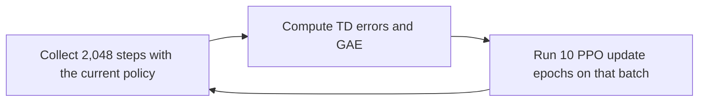

# 1.3 Hands-on: PPO Training Visualization

> **Section goal**: Run the pure PyTorch PPO implementation, save the raw metrics, generate curves from the CSV file, and evaluate the trained policy in CartPole.

> **Learning path**: [1.1 Run CartPole](./principles) → [1.2 CartPole Principles](./metrics) → **1.3 PPO Training Visualization**

> **Code and resources**: [training script](https://github.com/walkinglabs/hands-on-modern-rl/blob/main/code/chapter01_cartpole/2-pytorch_ppo.py) · [plotting script](https://github.com/walkinglabs/hands-on-modern-rl/blob/main/code/chapter01_cartpole/plot_curves.py) · [frame capture script](https://github.com/walkinglabs/hands-on-modern-rl/blob/main/code/chapter01_cartpole/capture_frames.py) · [raw CSV](https://github.com/walkinglabs/hands-on-modern-rl/blob/main/code/chapter01_cartpole/output/training_metrics_seed42.csv)

::: tip Use AI when you get stuck
This section runs scripts on your own machine, where environment issues are common. When an install fails, versions conflict, or a run breaks, paste the full error into an AI coding assistant — it is the fastest way to get a diagnosis, a fix, or a runnable command.
:::

The previous sections established the evidence we need: returns must be computed from complete episodes, and the final policy needs an independent evaluation. We now run that full chain.

## 1.3.1 Install and run

```bash
cd code/chapter01_cartpole
pip install -r requirements.txt

python 2-pytorch_ppo.py \
  --seed 42 \
  --iterations 40 \
  --steps-per-rollout 2048 \
  --swanlab-mode disabled \
  --log-csv output/training_metrics_seed42.csv
```

The run creates two local files:

- `output/pytorch_ppo_cartpole.pth`: trained model parameters;
- `output/training_metrics_seed42.csv`: unsmoothed metrics for every iteration.

To use the local SwanLab dashboard, change `--swanlab-mode disabled` to `--swanlab-mode local`, then run `swanlab watch swanlog`.

## 1.3.2 PPO data flow

Every training iteration has three stages:



### 1. Collect a rollout

Gymnasium returns both `terminated` and `truncated`:

```python
next_obs, reward, terminated, truncated, _ = env.step(action.item())

with torch.no_grad():
    if terminated:
        next_value = 0.0
    else:
        _, next_value_tensor = model(torch.FloatTensor(next_obs))
        next_value = next_value_tensor.item()
```

`terminated=True` means the pole fell or the cart left the allowed region, so future return is zero. `truncated=True` means the 500-step time limit was reached while the state still has value, so the target bootstraps from `V(s')`.

A rollout can end in the middle of an episode. The script carries both the observation and unfinished episode counters into the next rollout. GAE stops at environment resets, while logged episode returns are not cut at training-batch boundaries.

### 2. Compute GAE

Each step first has a temporal-difference error:

$$
\delta_t=r_t+\gamma V(s_{t+1})-V(s_t).
$$

GAE accumulates those errors backward:

```python
episode_end = t["terminated"] or t["truncated"]
delta = t["reward"] + gamma * t["next_value"] - t["value"]
gae = delta + gamma * lam * (1.0 - float(episode_end)) * gae
```

The multiplier `1 - episode_end` stops recursion at every reset. A time-truncated step still uses `next_value` for its own TD error, but the next episode's advantage cannot propagate backward.

The Critic learns an unnormalized target. Normalization applies only to policy advantages:

```python
returns = raw_advantages + values
advantages = (raw_advantages - raw_advantages.mean()) / (
    raw_advantages.std(unbiased=False) + 1e-8
)
```

### 3. Apply the PPO clipped update

The probability ratio for each sampled action is:

$$
r_t(\theta)=\frac{\pi_\theta(a_t\mid s_t)}
{\pi_{\theta_{\mathrm{old}}}(a_t\mid s_t)}.
$$

The script uses `clip_eps=0.2`:

```python
ratio = torch.exp(new_log_probs - batch_old_log_probs)
surr1 = ratio * batch_advantages
surr2 = torch.clamp(ratio, 0.8, 1.2) * batch_advantages
policy_loss = -torch.min(surr1, surr2).mean()
```

## 1.3.3 Plot from the raw CSV

The training script exports CSV directly. The plotting script reads only that file, so every point maps to one raw record.

```bash
python plot_curves.py \
  --input output/training_metrics_seed42.csv \
  --output-dir output
```

The course page shows the result generated on 2026-08-13 with seed 42:


The first rollout averaged `21.35`; the four complete episodes in iteration 10 averaged `500.0`. Iteration 11 dropped to `460.4`, so the single-run curve is not monotonic. The final deterministic 20-episode evaluation was `500.0 ± 0.0`.

This single-seed curve verifies that the implementation can solve the task. It is not a multi-seed algorithm comparison.

## 1.3.4 Capture frames from the real environment

`capture_frames.py` loads the saved model, runs deterministic evaluation in Gymnasium `CartPole-v1`, and records frames returned by `env.render()`. The image is not a hand-drawn illustration.

```bash
python capture_frames.py \
  --model output/pytorch_ppo_cartpole.pth \
  --output output/cartpole_frames_seed42.png \
  --seed 10042
```


<div style="text-align: center; font-size: 0.9em; color: var(--vp-c-text-2); margin-top: -10px; margin-bottom: 20px;">
  <em>Figure 1-4: steps 0, 125, 250, 375, and 500 from one deterministic evaluation episode. The episode scored 500. Angles in the panel titles come directly from the corresponding observations.</em>
</div>

A still frame proves only one moment. The complete episode score, frames at multiple times, and independent evaluation statistics jointly support the result.

## 1.3.5 Reporting parameter changes

Learning rate, clipping, and GAE settings change the curve, but one seed cannot establish a general result. A comparison should hold environment version, training budget, network, and evaluation protocol constant, then run multiple seeds.

Useful questions are testable:

- Does `lr=1e-4` require more environment steps than `3e-4` to reach the same evaluation score?
- Does `clip_eps=0.1` reduce KL while slowing return improvement?
- Across several seeds, how often does incorrectly propagating GAE across episodes make the final evaluation fail?

Report raw curves for every seed, the environment steps needed to reach the chosen target, and final evaluation scores. Do not present one attractive curve as an algorithmic guarantee.

## Section Summary

A complete experiment fixes the seed, saves raw metrics, plots from those metrics, evaluates independently, and captures rendered frames from the real environment. If one part cannot be traced, its numbers or images should not be described as measured results.
