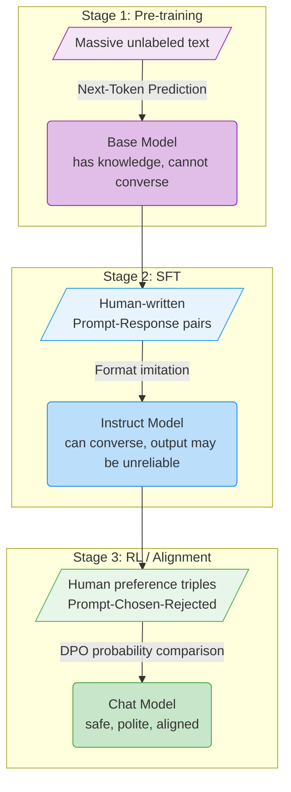
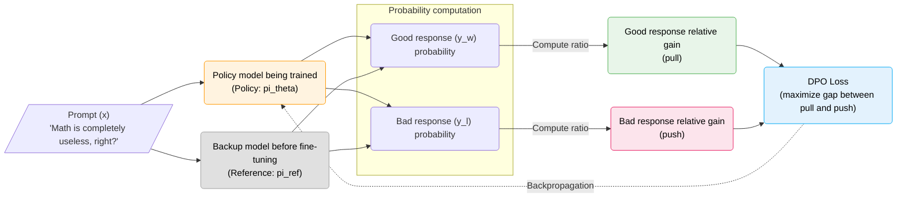

# 2.1 DPO Derivation

At the beginning of this chapter, we observed a practical effect: after DPO tuning, the model is less likely to blindly agree with a user's incorrect claim, and more likely to respond with a polite but principled correction.

Where does that change come from?

To make the mechanism feel inevitable, it helps to step back and place DPO inside the full post-training pipeline for modern LLMs. We'll walk through the stages first, and only then derive the DPO objective.

Modern LLM training is usually described as two big phases:

1. **Pre-training**
2. **Post-training**

Pre-training gives the model language ability and world knowledge, but the resulting base model is mostly a continuation engine. Post-training adapts that base model into a usable assistant. Post-training is often further split into:

- supervised fine-tuning (SFT)
- alignment via RL-style objectives (RL / Alignment)

As a pipeline:

$$\text{Pre-training} \;\xrightarrow{\text{Base Model}}\; \underbrace{\text{SFT} + \text{RL}}_{\text{Post-Training}} \;\xrightarrow{\text{Chat Model}}$$

We'll explain each stage and then identify where DPO fits.

## 2.1.1 Stage 1: Pre-training

Pre-training consumes massive amounts of raw text. The model learns by **next-token prediction**, which is typically optimized via cross-entropy.

- **Input**: unlabeled text (Wikipedia, books, web pages, code, ...)
- **Objective**: minimize cross-entropy on next-token prediction
- **Result**: a **base model** with general language ability and knowledge, but not yet a helpful dialog agent
- **Example data (plain text)**:

```json
{
  "text": "Paris is the capital of France, located in the center of the Paris Basin in northern France..."
}
```

The key capability of the base model is continuation: given a prefix, it extends it according to statistical regularities learned from the corpus. It does not inherently know how to "answer questions", and it certainly does not know what counts as "appropriate" behavior.

If you want a parallel from classic RL: in CartPole, a randomly initialized policy network samples actions almost uniformly. A base LM is similar: it samples tokens from a learned distribution, but does not yet represent the interaction contract of "user asks, assistant helps".

## 2.1.2 Stage 2: Supervised Fine-Tuning (SFT)

SFT trains on curated prompt-response pairs so the model learns a dialog format and instruction-following behavior.

- **Input**: (prompt, response) pairs written by humans
- **Objective**: continue doing next-token prediction, but on dialog data
- **Result**: an **instruct model** that can interact in a chat format
- **Example data (dialog messages)**:

```json
{
  "messages": [
    { "role": "user", "content": "What is the capital of France?" },
    { "role": "assistant", "content": "The capital of France is Paris." }
  ]
}
```

This is the standard Transformers chat format (used with `apply_chat_template`). TRL's `SFTTrainer` supports this style directly.

SFT is best understood as behavior cloning: it makes the model imitate high-quality answers. But it does not teach the model to judge answer quality. A purely SFT-trained model can learn to say "hello", yet still agree with "math is useless" because it was never trained with explicit contrast between good and bad responses.

The training signal in SFT flows in only one direction -- "imitate." The model lacks comparative information about "what constitutes a bad response," so it cannot develop a sense of response quality. This is the motivation for the third stage: we need preference comparisons so the model can learn not only what to do, but what not to do.

## 2.1.3 Stage 3: Alignment (RL / Preference Optimization)

This is where DPO sits. Instead of single responses, we train on preference triples:

- prompt $x$
- chosen response $y_w$
- rejected response $y_l$

The objective is to make the model assign higher probability to the chosen response than to the rejected one, under the same prompt.

- **Input**: preference triples $(x, y_w, y_l)$
- **Objective**: maximize the probability gap between chosen and rejected
- **Result**: a more aligned chat model (safer, more helpful, less sycophantic)
- **Example data (preference triple)**:

```json
{
  "prompt": "I'm in a terrible mood today and I don't want to go to work.",
  "chosen": "I'm sorry you're feeling that way. If the stress is too much, taking a day off can be reasonable. Your health comes first.",
  "rejected": "If you don't work, how will you eat? Stop being dramatic and go."
}
```

Returning to [3-train_dpo.py](../../code/chapter17_dpo/3-train_dpo.py) from the previous section, the `preference_data.json` loaded by the code is in exactly this format. The data loading part parses the JSON file into `prompt`, `chosen`, and `rejected` fields, corresponding to $x$, $y_w$, and $y_l$ in the notation:

```python
data_dict = {
    "prompt": [item["prompt"] for item in data_list],    # -> x
    "chosen": [item["chosen"] for item in data_list],     # -> y_w
    "rejected": [item["rejected"] for item in data_list]  # -> y_l
}
train_dataset = Dataset.from_dict(data_dict)
```

Note that the data format undergoes a fundamental change across the three stages: Stage 1 is plain text with no labels; Stage 2 is question-answer pairs, telling the model "what a good answer looks like"; Stage 3 is good-vs-bad comparisons, telling the model "where the good answer is better than the bad one." From "predict the next token" to "imitate human answers" to "distinguish good from bad" -- each step brings the model's behavior closer to human expectations.

The following diagram summarizes the evolution across these three stages:



Reviewing the entire Post-Training pipeline: SFT solves the problem of "can the model converse," while the alignment stage (RL / DPO) solves "are the responses good." The DPO we just ran sits at the final step of this pipeline. The next question is: what exactly is DPO optimizing? How is its loss function derived from preference data? The following section will develop this derivation step by step.

<details>
<summary><strong>Exercise 1: Why do we need RL (like DPO) in addition to SFT? Can't we just feed all the good answers to the model via SFT?</strong></summary>

This involves a fundamental difference between two learning paradigms.

SFT's training objective is to maximize the conditional probability of each token in the training data:

$$\mathcal{L}_{SFT} = -\mathbb{E}_{(x, y_w) \sim \mathcal{D}} \left[ \log \pi_\theta(y_w | x) \right]$$

This is a **one-directional** objective: make the probability of good responses as high as possible. But it provides no signal at all about "what is bad." The model does not know "you must not respond this way"; it only knows "you can respond that way." From an optimization perspective, SFT merely increases the probability density around good responses, but cannot guarantee it will move away from bad responses -- because bad responses never appear in SFT's loss function.

DPO's training objective introduces a **contrastive structure**:

$$\mathcal{L}_{DPO} = -\ln \sigma \left( \beta \ln \frac{\pi_\theta(y_w | x)}{\pi_{ref}(y_w | x)} - \beta \ln \frac{\pi_\theta(y_l | x)}{\pi_{ref}(y_l | x)} \right)$$

The formula contains both $y_w$ and $y_l$, and the minus sign in the middle means the model must make the probability of the good response rise **relative to** the bad one. This is a stronger requirement than simply raising the probability of good responses: even if $\pi_\theta(y_w | x)$ increases, if $\pi_\theta(y_l | x)$ also increases simultaneously (e.g., the model becomes more "talkative," raising the probability of both good and bad responses), the loss function will not decrease.

From a generalization perspective, this contrastive signal is also more effective. SFT only shows the model "what good looks like," and the model may reduce the loss by memorizing surface patterns in the training data (fixed openings, specific phrasing) without truly understanding "why it is good." DPO forces the model to focus on the **differential features** between the two through good-vs-bad comparison -- these differential features (tone, safety, factual accuracy) are often more generalizable than surface patterns in individual responses.

This also explains why DPO requires far less data than SFT: SFT typically needs tens of thousands to hundreds of thousands of question-answer pairs to cover various dialog scenarios, while DPO usually only needs thousands to tens of thousands of preference comparisons to significantly improve the model's behavior, because each comparison provides a **relative judgment signal** with higher information density.

</details>

<details>
<summary><strong>Exercise 2: If the pre-training data quality is very poor, can later SFT and DPO compensate?</strong></summary>

It is very difficult. Pre-training determines the upper bound of the model's knowledge and capabilities; SFT and RL merely adjust the model's behavior on top of that foundation. If the model never encountered a particular piece of knowledge during pre-training (e.g., a specialized term from an obscure field), a few thousand DPO data points later cannot make it master that knowledge out of thin air -- at most, it can make the model politely express "I don't know."

</details>

## 2.1.4 DPO's Optimization Objective

In the previous chapter, we disassembled SB3's `model.learn()`, revealing the three-step loop behind it: collect experience, compute advantages, update parameters. In this section, we look at what `DPOTrainer.train()` does -- that is, how DPO's loss function is computed from preference data.

To understand DPO's innovation, we first need to see what it simplifies.

### 2.1.4.1 From RLHF to DPO: Skipping the Reward Model

In the traditional RLHF pipeline, aligning a model requires two steps:

1. **Train a Reward Model**: show it lots of human preference data so it learns to score text -- high scores for good, low scores for bad.
2. **Use RL to update the Policy Model**: let the LLM continuously generate responses, have the reward model score them, then adjust the LLM's parameters based on the scores. The most commonly used algorithm is PPO.

This means that during training, two large models must be loaded into GPU memory simultaneously: one policy model generating responses, and one reward model scoring them. Memory usage doubles, and the two models depend on each other, making training stability worse [^3].

**DPO (Direct Preference Optimization)** [^4] asks a key question: can we skip training a reward model and directly optimize the language model with preference data?

To understand why this is possible, recall the implicit constraint during PPO training: the policy must not drift too far from the original model, measured by KL divergence. Without this constraint, the model might output gibberish to get high reward scores -- the reward would be high, but completely incomprehensible to humans. This is the same concern underlying the PPO clipping mechanism discussed in Section 1.1.6.4: limit the magnitude of each update to ensure training stability.

Rafailov et al. (2023) found that solving for the optimal policy under this KL constraint yields a concise relationship:

$$ r(x, y) \propto \log \frac{\pi*\theta(y | x)}{\pi*{ref}(y | x)} $$

That is, a response's reward score $r(x,y)$ is proportional to the log of the ratio between "the current model's probability of generating that response" and "the original model's probability of generating that response." This relationship is not approximate; it is mathematically exact. It means the reward score can be computed directly from the probability ratio of two models, and training a separate reward model is no longer necessary -- just keep the original model $\pi_{ref}$ as a reference and compare the probability changes of the training model $\pi_\theta$.

Based on this insight, DPO takes preference data (a good and a bad response to the same question) and directly adjusts model parameters to increase the probability of the good response and decrease the probability of the bad one. The entire process requires only one language model plus a static copy of the reference model, skipping the reward model training and PPO's reinforcement learning loop, reducing the problem to optimizing a contrastive loss function.

Returning to the code in [3-train_dpo.py](../../code/chapter17_dpo/3-train_dpo.py), `DPOTrainer` receives only a `model` parameter at initialization:

```python
trainer = DPOTrainer(
    model=model,              # pi_theta: the policy model being trained
    args=training_args,
    train_dataset=train_dataset,
    processing_class=tokenizer,  # TRL 0.24 uses processing_class for tokenizer/processor
)
```

Only one model is passed in; there is no reward model. `DPOTrainer` internally creates a frozen copy of `model` as the reference model $\pi_{ref}$, and at each training step compares the output probabilities of $\pi_\theta$ and $\pi_{ref}$. The $\beta$ coefficient was set to 0.1 in `DPOConfig` -- we will mention it repeatedly when deriving the loss function below.

### 2.1.4.2 Loss Function Derivation

DPO's final loss function is:

<!-- prettier-ignore -->
$$ \mathcal{L}_{DPO} = -\ln \sigma \left( \beta \ln \frac{\pi_\theta(y_w | x)}{\pi_{ref}(y_w | x)} - \beta \ln \frac{\pi_\theta(y_l | x)}{\pi_{ref}(y_l | x)} \right) $$

The formula looks complex, but its structure is clear: inside the parentheses is the difference of two ratios, wrapped in a sigmoid and $-\ln$. Let us first identify the symbols, then explain the origin of each term step by step.

The symbols in the formula mean:

| Symbol   | Meaning                            | Academic name     |
| -------- | ---------------------------------- | ----------------- |
| x        | User's question                    | Prompt / Context  |
| y_w      | Good response (Winner)             | Chosen Response   |
| y_l      | Bad response (Loser)               | Rejected Response |
| pi_theta | Policy model being trained         | Policy Model      |
| pi_ref   | Reference model before fine-tuning | Reference Model   |

**Step 1: Conditional probability.** A language model generates text token by token. Given prompt $x$, the model gives a probability for each token in response $y$ in sequence; multiplying these probabilities gives the conditional probability $\pi_\theta(y | x)$ of the full response. In DPO, we care about two probabilities: $\pi_\theta(y_w | x)$ is the current model's probability of generating the good response, and $\pi_\theta(y_l | x)$ is the probability of generating the bad response.

**Step 2: Introduce the reference model, use ratios instead of absolute probabilities.** Intuitively, we want $\pi_\theta(y_w | x)$ to increase and $\pi_\theta(y_l | x)$ to decrease. But directly optimizing absolute probabilities may cause the model to drift away from a reasonable output distribution. The solution is to introduce the pre-fine-tuning model $\pi_{ref}$ as a reference. $\pi_{ref}$ is a snapshot of the model at the start of training; its parameters remain unchanged throughout DPO. Instead of directly optimizing $\pi_\theta(y_w | x)$, we optimize its ratio with $\pi_{ref}(y_w | x)$:

<!-- prettier-ignore -->
$$ \frac{\pi_\theta(y_w | x)}{\pi_{ref}(y_w | x)} $$

This ratio design is inevitable: when two models compute probabilities for the same response, they are both affected by that response's inherent "generation difficulty" -- responses containing rare words receive low probabilities from both models; responses with common words receive high probabilities from both. After division, the generation-difficulty factor cancels out, leaving only the change due to training. That is, this ratio measures how many times more (or less) likely the model is to generate this response relative to before training.

**Step 3: Good-vs-bad comparison, take the logarithm.** There is a similar ratio for the bad response $y_l$:

<!-- prettier-ignore -->
$$ \frac{\pi_\theta(y_l | x)}{\pi_{ref}(y_l | x)} $$

DPO's goal is to make the good response ratio higher than the bad response ratio -- that is, the difference inside the parentheses should be positive and as large as possible. If the difference is negative, the model actually considers the bad response more likely to be generated than the good one, which contradicts our objective. Since language model probabilities are products of token probabilities, directly computing ratios can cause numerical underflow. Taking $\log$ solves this problem: after taking the logarithm, division becomes subtraction ($\log \frac{a}{b} = \log a - \log b$), products become sums, and numerics are more stable. In machine learning and information theory, $\log$ defaults to natural logarithm $\ln$ (base $e$) unless $\log_2$ or $\log_{10}$ is specified. Multiplying by a coefficient $\beta$ to control how much the model deviates from $\pi_{ref}$ (larger $\beta$ means the model is more constrained from deviating from original behavior), we get the core reward margin:

<!-- prettier-ignore -->
$$ \text{margin} = \beta \ln \frac{\pi_\theta(y_w | x)}{\pi_{ref}(y_w | x)} - \beta \ln \frac{\pi_\theta(y_l | x)}{\pi_{ref}(y_l | x)} $$

When $\ln \frac{\pi_\theta}{\pi_{ref}} > 0$, the model is more inclined than before training to generate that text; when it is less than 0, the opposite. DPO's goal is to make the value corresponding to the good response greater than that of the bad response.

**Step 4: Construct the loss function.** Finally, we need to convert this "larger is better" margin into a "smaller is better" loss function. The tool used here is the sigmoid function:

$$ \sigma(x) = \frac{1}{1 + e^{-x}} $$

Sigmoid maps any real number $x$ to $(0, 1)$: as $x$ increases, $\sigma(x)$ approaches 1; as $x$ decreases, $\sigma(x)$ approaches 0; at $x = 0$, $\sigma(0) = 0.5$. On this basis, taking $-\ln$ gives the loss function. The following figure shows both the sigmoid curve and the corresponding loss curve:


The figure has two curves: blue is the sigmoid $\sigma(x)$, red is the loss $-\ln\sigma(x)$. The horizontal axis is the reward margin; the two curves correspond to different vertical axis scales (left scale for the blue line, right scale for the red line). Note two key regions of the red line:

- **Right side (positive margin)**: the red line hugs the bottom, with loss near zero and almost no gradient -- the model has already distinguished good from bad well and does not need major adjustments.
- **Left side (negative or near-zero margin)**: the red line rises noticeably, with large loss and strong gradient signal -- the model has not yet learned to distinguish, pushing parameters toward "widening the margin."

Combining the above steps, we get DPO's loss function:

<!-- prettier-ignore -->
$$ \mathcal{L}_{DPO} = -\ln \sigma \left( \beta \ln \frac{\pi_\theta(y_w | x)}{\pi_{ref}(y_w | x)} - \beta \ln \frac{\pi_\theta(y_l | x)}{\pi_{ref}(y_l | x)} \right) $$

The following diagram shows the data flow inside the model during DPO training:



**Summary: DPO skips the external reward model and optimizes the model by directly widening the gap between "the probability increase of the good response relative to the reference model" and "the probability increase of the bad response relative to the reference model."**

Reviewing this section, DPO's loss function can be understood through a unified lens: it is essentially a parameterization of the Bradley-Terry preference model in the probability space of the language model. Traditional methods first use a separate reward model to learn preferences, then optimize the policy with PPO; DPO merges these two steps into one -- directly performing preference optimization on policy parameters, eliminating the intermediate reward model step.

In the next section, we will return to the training log mentioned earlier and use the theory from this section to interpret the specific meaning behind metrics like Loss, Reward Margin, and Accuracy.

<details>
<summary><strong>Exercise 3: During DPO training, if there is no Rejected data and only Chosen data, can the algorithm still run?</strong></summary>

No. DPO's loss function is built on the probability ratio difference between good and bad responses; the minus sign in the middle of the formula means both are indispensable. In fact, many studies show that **finding or generating high-quality Rejected data is often harder and more important than finding Chosen data.** Valuable Rejected responses should be those that appear reasonable on the surface but actually contain logical fallacies or value problems (often called Hard Negatives), not random noise.

</details>

<details>
<summary><strong>Exercise 4 (optional reading): Equivalence derivation between DPO and PPO -- why can the reward model be skipped?</strong></summary>

Earlier we mentioned "the reward score is proportional to the log of the probability ratio," but did not explain the derivation of this equivalence. Here is the complete derivation; the only mathematical tools needed are logarithms and derivatives.

---

**Starting point: PPO's optimization objective**

When PPO aligns a language model, the goal is to maximize reward while adding a constraint: the policy must not drift too far from the original model. This constraint is measured by KL divergence and can be written as the following optimization problem:

$$\max_{\pi_\theta} \; \mathbb{E}_{x, y \sim \pi_\theta}\left[r(x, y)\right] - \beta \, D_{\text{KL}}\left(\pi_\theta(\cdot|x) \;\|\; \pi_{\text{ref}}(\cdot|x)\right)$$

where $r(x,y)$ is the reward model's score for the response, $\beta$ controls constraint strength, and $D_{\text{KL}}$ measures the difference between two distributions.

---

**Step 1: Write out the KL divergence expansion**

The definition of KL divergence is:

$$D_{\text{KL}}(\pi_\theta \| \pi_{\text{ref}}) = \mathbb{E}_{y \sim \pi_\theta}\left[\log \frac{\pi_\theta(y|x)}{\pi_{\text{ref}}(y|x)}\right]$$

Substituting into the optimization objective and merging expectations:

$$\max_{\pi_\theta} \; \mathbb{E}_{y \sim \pi_\theta}\left[r(x, y) - \beta \log \frac{\pi_\theta(y|x)}{\pi_{\text{ref}}(y|x)}\right]$$

---

**Step 2: Optimize each response $y$ individually**

This is a constrained optimization problem about distribution $\pi_\theta$ (the sum of $\pi_\theta$ probabilities is 1). Using Lagrange multipliers, taking the derivative with respect to $\pi_\theta(y|x)$ for each term and setting it to zero, we obtain the closed-form solution:

$$\pi^*(y|x) \propto \pi_{\text{ref}}(y|x) \cdot \exp\!\left(\frac{1}{\beta} r(x, y)\right)$$

This result means: the optimal policy reweights the probability of each response on top of the reference policy, scaled by $\exp(r/\beta)$. Higher reward means more probability amplification.

---

**Step 3: Solve for the reward inversely**

Taking the logarithm of both sides of the above equation and rearranging:

$$r(x, y) = \beta \log \frac{\pi^*(y|x)}{\pi_{\text{ref}}(y|x)} + \beta \log Z(x)$$

where $Z(x) = \sum_y \pi_{\text{ref}}(y|x) \exp(r(x,y)/\beta)$ is the normalization constant (independent of the specific $y$, depending only on prompt $x$).

Key observation: the $\beta \log Z(x)$ term is the same for all responses under the same prompt $x$. In DPO, we compare the reward difference between a good and a bad response under the same $x$, so the constant term cancels out:

$$r(x, y_w) - r(x, y_l) = \beta \log \frac{\pi^*(y_w|x)}{\pi_{\text{ref}}(y_w|x)} - \beta \log \frac{\pi^*(y_l|x)}{\pi_{\text{ref}}(y_l|x)}$$

---

**Conclusion**

The reward difference is entirely determined by the probability ratios of two models, independent of an external reward model. This is the mathematical basis for DPO being able to skip the reward model. Substituting this reward difference into the Bradley-Terry preference model (the probability of a human choosing $y_w$ over $y_l$) and taking the negative logarithm gives the DPO loss function derived in the main text.

</details>

## References

[^1]: Ouyang, L., et al. (2022). Training language models to follow instructions with human feedback. _NeurIPS 2022_. [arXiv:2203.02155](https://arxiv.org/abs/2203.02155)

[^2]: Touvron, H., et al. (2023). LLaMA: Open and Efficient Foundation Language Models. _arXiv preprint_. [arXiv:2302.13971](https://arxiv.org/abs/2302.13971)

[^3]: Christiano, P. F., et al. (2017). Deep reinforcement learning from human preferences. _Advances in Neural Information Processing Systems_, 30. [arXiv:1706.03741](https://arxiv.org/abs/1706.03741)

[^4]: Rafailov, R., et al. (2023). Direct Preference Optimization: Your Language Model is Secretly a Reward Model. _arXiv preprint_. [arXiv:2305.18290](https://arxiv.org/abs/2305.18290)
