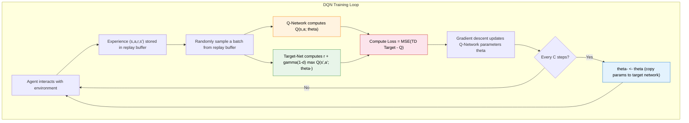

# 4.2 DQN Architecture

## Section Guide

**Core ideas**

- Understand the Q-network and its loss: approximate $Q(s,a)$ with a neural network and train it by minimizing squared TD error.
- Understand why experience replay breaks sample correlation and improves data efficiency.
- Understand why the target network stabilizes bootstrapped targets by delaying parameter updates.

**Key formula**

$$
\mathcal{L}(\theta)
=
\mathbb{E}\left[
\left(
r + \gamma (1 - d)\max_{a'} Q(s', a'; \theta^-)
- Q(s, a; \theta)
\right)^2
\right]
$$

> **DQN loss (MSE TD error)**
>
> - $\theta$: parameters of the Q-network (trainable "student")
> - $\theta^-$: parameters of the target network (slow-moving copy used for targets)
> - $Q(s,a;\theta)$: the student's current prediction
> - $d$: done flag; if episode ends, $d=1$ and there is no next-state value
> - $r + \gamma(1-d)\max_{a'}Q(s',a';\theta^-)$: TD target computed using the target network
> - the outer expectation is approximated in practice by sampling minibatches from the replay buffer

In the previous section, we answered "why DQN is needed": Q-tables do not scale, and naive neural network Q-Learning becomes unstable because of correlated samples and moving targets.

Now we answer the next question:

**How does DQN organize the idea into an algorithm that can actually train?**

If we use only one network for everything (select actions, predict $Q$, and compute TD targets), the TD target changes as soon as we update the network parameters. That creates a "chase the moving target" loop.

Let's make that concrete.

1. **Compute TD target.** Suppose the network predicts $Q(s,a)=5.0$ and for the next state $\max Q(s',a')=8.0$. With reward $r=1$ and $\gamma=0.99$:

$$
\text{TD Target} = 1 + 0.99 \times 8.0 = 8.92
$$

$$
\text{TD Error} = 8.92 - 5.0 = 3.92
$$

2. **Update parameters by gradient descent.** The network moves $Q(s,a)$ toward 8.92.

3. **The issue:** since $Q(s',a')$ is computed by the same parameters, after the update, $\max Q(s',a')$ may change drastically (say from 8.0 to 4.0). Then the same target becomes:

$$
\text{TD Target}' = 1 + 0.99 \times 4.0 = 4.96
$$

The "answer key" jumped. The network cannot converge if the label changes as fast as the model updates.

This is part of what Sutton and Barto describe as the **deadly triad**: function approximation + bootstrapping + off-policy learning can lead to instability.

DQN's answer is three components:

1. Q-network (learn $Q(s,a;\theta)$)
2. experience replay (randomize training data)
3. target network (stabilize TD targets)

Let's unpack them one by one.

## Q-Network and Loss

DQN maintains two networks with identical architecture but different update schedules:

- **Q-network** with parameters $\theta$: updated every gradient step
- **target network** with parameters $\theta^-$: a frozen copy used only to compute TD targets; updated periodically by copying from the Q-network

This decouples "prediction" from "target generation." For a while, the student trains against a stable teacher.

### Q-network architecture

The Q-network does one job: given a state $s$, output a Q-value for each discrete action.

For LunarLander, the input is an 8D vector; the output has 4 Q-values corresponding to four discrete actions.

```python
import torch
import torch.nn as nn


class QNetwork(nn.Module):
    """Q-network: input a state, output Q-values for all actions."""

    def __init__(self, state_dim, action_dim, hidden_dim=128):
        super().__init__()
        self.net = nn.Sequential(
            nn.Linear(state_dim, hidden_dim),
            nn.ReLU(),
            nn.Linear(hidden_dim, hidden_dim),
            nn.ReLU(),
            nn.Linear(hidden_dim, action_dim),
        )

    def forward(self, x):
        return self.net(x)
```

Why output all action Q-values at once instead of a single value? Because one forward pass gives scores for all actions, and selecting the best action requires only an `argmax` -- no need to run the network separately for each action. For CartPole (state_dim=4, action_dim=2), this network has about 17,000 parameters: lightweight enough, and sufficient to express nonlinear relationships in low-dimensional control tasks. For Atari games with 84x84x4 pixel inputs, a CNN is needed instead of an MLP, but for vector-state tasks like LunarLander, a simple MLP suffices.

The Q-network's training objective is to make its output Q-values as close as possible to the "true" Q-values. But we do not know the true Q-values -- if we could look them up in a table, we would not need a neural network. So we construct training targets the same way Q-Learning does:

$$\text{TD Target} = r + \gamma (1-d) \max_{a'} Q(s', a')$$

Then minimize the mean squared error between the network output and the TD target:

$$\mathcal{L}(\theta) = \mathbb{E}\left[\left( r + \gamma (1-d) \max_{a'} Q(s', a'; \theta^-) - Q(s, a; \theta) \right)^2\right]$$

This formula looks complex, but we can identify each symbol's "role":

| Symbol                                           | Meaning (intuitive)                                                       | Role                                        |
| ------------------------------------------------ | ------------------------------------------------------------------------- | ------------------------------------------- |
| $\theta$                                         | Q-Network parameters (the network being trained)                          | Student -- the examinee                     |
| $\theta^-$                                       | Target network parameters (frozen copy of Q-network)                      | Answer key -- held by the examiner          |
| $Q(s, a; \theta)$                                | Student's current answer: "I think this step is worth $X$"                | Network prediction                          |
| $r$                                              | Immediate reward actually received for this step                          | Points already in hand                      |
| $d$                                              | Whether the episode truly terminated                                      | Cuts off future value at termination        |
| $\gamma (1-d) \max_{a'} Q(s', a'; \theta^-)$     | From the new state, the target network's highest future score, discounted | "How much more can be earned in the future" |
| $r + \gamma (1-d) \max_{a'} Q(s', a'; \theta^-)$ | TD Target -- "what this step should be worth"                             | Answer key                                  |

Now let us assemble this loss function step by step:

**Building block 1: TD Target -- the answer key**

$$y = r + \gamma (1-d) \max_{a'} Q(s', a'; \theta^-)$$

TD Target is "immediate reward + discounted highest future score." If this step has reached a true terminal state, $d=1$, the future term is zeroed out, and the target is only the immediate reward $r$. Note that $Q$ here uses the target network's parameters $\theta^-$, not the currently-trained $\theta$ -- the answer key must not change along with the student.

**Building block 2: TD Error -- how far the prediction is from the answer key**

$$\delta = y - Q(s, a; \theta) = r + \gamma (1-d) \max_{a'} Q(s', a'; \theta^-) - Q(s, a; \theta)$$

TD Error is "answer key minus student's answer." In tabular methods, we directly move the Q-value toward the TD target by $\alpha \cdot \delta$. But in a neural network, we cannot directly change a single Q-value -- we can only indirectly affect all Q-values by modifying parameters $\theta$.

**Building block 3: Squaring -- penalize large errors, tolerate small ones**

$$\mathcal{L}(\theta) = \mathbb{E}\left[\delta^2\right] = \mathbb{E}\left[\left(y - Q(s, a; \theta)\right)^2\right]$$

Why square rather than use $\delta$ directly? Two reasons. First, $\delta$ can be positive or negative, and they can cancel each other when averaged -- the mean might be near 0, making it look like there is no error, when in fact the predictions may be wildly off. After squaring, values are always positive and cannot cancel. Second, squaring is lenient with small errors (off by 0.1 costs 0.01) but harsh with large errors (off by 1.0 costs 1.0; off by 3.0 costs 9.0) -- this forces the network to prioritize correcting its most egregious predictions.

**Building block 4: Expectation -- average over all samples**

$$\mathcal{L}(\theta) = \mathbb{E}\left[\left(y - Q(s, a; \theta)\right)^2\right]$$

The outer $\mathbb{E}$ means "average over all possible transitions $(s, a, r, s')$." In practice, we cannot enumerate all transitions, so we approximate this expectation by randomly sampling a batch from the experience replay buffer -- this is what the "stochastic" in SGD means.

Putting all four building blocks together: the DQN training process is continuously sampling from the replay buffer, computing the TD Target (answer key), comparing it with the network output (student's answer), computing the mean squared error loss, and updating parameters $\theta$ via backpropagation. The essence is exactly the same as the tabular Q-Learning method -- only now we update parameters via gradient descent instead of directly modifying table entries.

But there is a crucial detail we have mentioned repeatedly but not yet explained: how exactly does "taking the expectation" and "random sampling" work? Why can't we just use the most recent data the agent experienced? This leads to the second component.

## Experience Replay

The outer $\mathbb{E}$ in the loss function requires averaging over all transitions -- but what does "all transitions" mean? In supervised learning, training data is pre-collected and shuffled, with each mini-batch's samples approximately independent. Reinforcement learning is completely different: each step the agent takes produces one experience $(s, a, r, s', d)$, and consecutive steps' experiences describe tiny variations of the same situation.

This means if you train the network on data just experienced, adjacent samples are nearly identical -- in CartPole, consecutive frames' observation vectors may differ only in a few decimal places. Deep learning requires approximately independent and identically distributed (i.i.d.) data; training with such highly correlated data causes the gradient direction to be dominated by recent steps, and the network "forgets" what it previously learned.

This is not an abstract theoretical concern. DeepMind's 2015 DQN paper conducted comparison experiments: without experience replay, the Atari Breakout agent would repeatedly learn the strategy of "bounce the ball to the left," because for hundreds of consecutive frames the ball bounces on the left side; when the ball returns to the right, the network has forgotten how to play the right side and must relearn from scratch. With experience replay, a single batch might simultaneously contain scenes like "ball in upper left," "ball at right edge," and "ball about to hit ground," enabling the network to learn to handle all situations simultaneously. A similar phenomenon occurs in autonomous driving: if you train only on the most recent 10 seconds of continuous data, the model may only handle "sunny straight roads" and have no idea what to do on rainy curves.

Experience Replay's solution is simple but effective: store all experienced transitions $(s, a, r, s', d)$ in a buffer, and randomly sample a small batch each time you train. Random sampling breaks temporal correlation -- a single batch might contain early failures and later successes simultaneously, making the gradient direction more diverse.

What exactly gets stored? Each interaction step produces a 5-tuple:

| Component | Meaning          | CartPole example                                                           |
| --------- | ---------------- | -------------------------------------------------------------------------- |
| $s$       | Current state    | `[0.03, 0.12, -0.05, -0.32]` (position, velocity, angle, angular velocity) |
| $a$       | Action taken     | `0` (push left)                                                            |
| $r$       | Reward received  | `1.0` (pole still standing, +1 per step)                                   |
| $s'$      | Next state       | `[0.03, -0.05, -0.06, 0.18]` (new observation after action)                |
| $d$       | Whether terminal | `False` (pole still standing)                                              |

The replay buffer is a collection of such 5-tuples. As the agent continues interacting, the buffer gradually fills. Below is actual content a CartPole training replay buffer might store:

| #   | $s$ (state)                  | $a$ (action) | $r$ (reward) | $s'$ (next state)            | $d$ (terminal) | Source                  |
| --- | ---------------------------- | ------------ | ------------ | ---------------------------- | -------------- | ----------------------- |
| 1   | `[0.01, 0.12, 0.05, -0.32]`  | `1` (right)  | `1.0`        | `[0.01, 0.15, 0.04, -0.28]`  | `False`        | Episode 2, opening      |
| 2   | `[0.02, 0.31, -0.12, 0.89]`  | `0` (left)   | `1.0`        | `[0.01, 0.28, -0.10, 0.85]`  | `False`        | Episode 8, mid-game     |
| 3   | `[0.05, 0.44, 0.21, 1.02]`   | `1` (right)  | `1.0`        | `[0.06, 0.48, 0.24, 1.10]`   | `True`         | Episode 8, pole fell    |
| 4   | `[0.00, 0.02, 0.01, -0.05]`  | `0` (left)   | `1.0`        | `[0.00, -0.01, 0.01, -0.03]` | `False`        | Episode 45, pole stable |
| 5   | `[-0.03, -0.18, 0.08, 0.55]` | `1` (right)  | `1.0`        | `[-0.03, -0.14, 0.09, 0.50]` | `False`        | Episode 102, mid-game   |

Note several things:

- Entry 3 has $d=\text{True}$: the pole fell, ending the episode. In the TD Target, $(1-d)=0$, zeroing out future value, leaving only the immediate reward $r=1.0$. This experience teaches the network "pushing right in this state causes the pole to fall."
- Entry 4 is from episode 45: the pole is almost stationary, with state vector near zero. This teaches the network "keeping the pole near vertical by doing nothing is also good."
- Different entries come from different times and different episodes. During training, randomly drawing a batch means the network sees opening, mid-game, failure, and success states simultaneously, not dominated by any single phase.

During training, 64 such experiences are randomly drawn; each one tells the network: "In this state, I took this action, got this score, and the environment changed to this." The network adjusts its Q-value predictions accordingly, so next time it encounters a similar state, it can make better judgments.


```python
import random
from collections import deque


class ReplayBuffer:
    """Replay buffer: store and sample (s, a, r, s', done) transitions."""

    def __init__(self, capacity=10000):
        self.buffer = deque(maxlen=capacity)  # automatically evicts oldest data when full

    def push(self, state, action, reward, next_state, done):
        """Store one experience."""
        self.buffer.append((state, action, reward, next_state, done))

    def sample(self, batch_size):
        """Randomly sample a batch of experiences."""
        batch = random.sample(self.buffer, batch_size)
        states, actions, rewards, next_states, dones = zip(*batch)
        return (
            torch.FloatTensor(states),
            torch.LongTensor(actions),
            torch.FloatTensor(rewards),
            torch.FloatTensor(next_states),
            torch.FloatTensor(dones),
        )

    def __len__(self):
        return len(self.buffer)
```

Experience replay has three benefits:

1. **Breaks temporal correlation**: random sampling ensures each training batch comes from different time periods, with diverse gradient directions, preventing being trapped in recent experience.
2. **Improves data efficiency**: each experience can be sampled multiple times for training, rather than being used once and discarded. In a neural network, one experience can influence Q-value estimates for all states, making reuse valuable.
3. **Smooths training**: old and new experiences are mixed together, preventing the network from overfitting to recent experience.

The replay buffer size is a hyperparameter that needs tuning. Too small, and the buffer lacks diversity. Too large, and very stale experience (generated by much older, worse policies) persists and may slow convergence. In practice, common capacities are $10^4$ to $10^6$.

Experience replay solves "where data comes from" and "sample correlation." But one problem remains unsolved: the TD Target $r + \gamma \max_{a'} Q(s', a'; \theta^-)$ in the loss function can itself be unstable. If the TD Target changes along with the network parameters, the network faces a new target after every update, making optimization hard to converge. This leads to the third and final component.

## Target Network

Q-Learning's update target is $r + \gamma \max_{a'} Q(s', a')$. In tabular methods, this target is relatively stable -- because $Q(s', a')$ lives in an independent table cell, updating $Q(s, a)$ does not change $Q(s', a')$. But in a neural network, parameters are shared: updating $Q(s, a)$ may simultaneously change $Q(s', a')$'s value. That is, the network modifies its own predictions while also changing the target it will chase next step.

The Target Network's solution is equally straightforward: maintain two networks. One Q-Network $\theta$ for action selection and daily updates; another target network $\theta^-$ dedicated to computing TD targets. The target network's parameters do not participate in gradient descent, but are periodically copied from the Q-Network:

```python
# Every target_update steps, copy Q-network parameters to the target network
if step % target_update == 0:
    target_net.load_state_dict(q_net.state_dict())
```

When computing TD targets, use the target network:

```python
# Use target network to compute TD target (stable target)
with torch.no_grad():
    td_target = reward + gamma * target_net(next_state).max() * (1 - done)
```

This way, between two parameter copies, the TD target is fixed -- the target does not move around. The Q-Network can peacefully learn toward a stable target instead of chasing a constantly moving one. Updating the target network every fixed number of steps is like periodically moving the target to a new position, giving the Q-Network a more accurate target to pursue.

The target network's update frequency is another hyperparameter. Updating too frequently (e.g., every step) makes the target network nearly identical to the Q-Network, negating its stabilizing effect. Updating too rarely (e.g., every 10000 steps) makes the TD targets too stale, and the Q-Network may learn from outdated information. In practice, common update frequencies are every 100 to 1000 steps.

## Building DQN from Scratch

We have now broken down the Q-network, experience replay, and target network from conceptual and formula perspectives. Let us shift perspective: suppose you want to write a DQN from scratch -- what is the approach?

The approach is not complex -- first build the network, then prepare the data, then define the update logic, and finally assemble everything into a training loop. Using CartPole as an example (state_dim=4, action_dim=2), we will build it step by step. Each step will explain why parameters are set this way and what happens with different values.

### Define the Q-Network

First thing: write a network that takes a state as input and outputs Q-values for each action. CartPole's observation is a 4-dimensional vector (cart position, velocity, pole angle, angular velocity); actions are 2 discrete choices (push left, push right). So the network needs to map a 4-dimensional input to a 2-dimensional output.

```python
import torch
import torch.nn as nn


class QNetwork(nn.Module):
    def __init__(self, state_dim, action_dim, hidden_dim=128):
        super().__init__()
        self.net = nn.Sequential(
            nn.Linear(state_dim, hidden_dim),   # input -> hidden
            nn.ReLU(),                          # activation
            nn.Linear(hidden_dim, hidden_dim),  # hidden -> hidden
            nn.ReLU(),
            nn.Linear(hidden_dim, action_dim),  # hidden -> output
        )

    def forward(self, x):
        return self.net(x)  # output shape: (batch_size, action_dim)
```

Implementation choices explained:

- **Two hidden layers**: one hidden layer has limited expressiveness; three or more layers easily overfit on 4-dimensional input. Two layers is a common starting point for low-dimensional tasks.
- **hidden_dim=128**: total parameters approximately $4 \times 128 + 128 \times 128 + 128 \times 2 \approx 17000$. 64 is a bit small; 256 is a bit large; 128 strikes a balance between precision and efficiency, and transfers well to LunarLander. Atari pixel inputs require CNN instead of MLP.
- **ReLU activation**: fast to compute (just check positive/negative), gradient is constant 1 in the positive region (no vanishing gradient), output is unbounded (does not constrain Q-value range). Sigmoid/Tanh suffer from vanishing gradients and output range limitations.
- **No activation on output layer**: Q-values can be any real number. ReLU would truncate negative values; Sigmoid/Tanh would limit the output range.
- **Output all action Q-values at once**: selecting an action requires only one forward pass plus `argmax`, rather than running the network separately for each action. The limitation is that this only handles discrete actions; continuous actions require Actor-Critic (Chapter 6).

### Define the Replay Buffer

Second thing: prepare a container for historical experience, sampling randomly during training to break correlation. Each step the agent takes produces a transition $(s, a, r, s', d)$; the replay buffer accumulates these transitions.

```python
import random
from collections import deque


class ReplayBuffer:
    def __init__(self, capacity=10000):
        self.buffer = deque(maxlen=capacity)

    def push(self, state, action, reward, next_state, done):
        self.buffer.append((state, action, reward, next_state, done))

    def sample(self, batch_size):
        batch = random.sample(self.buffer, batch_size)
        states, actions, rewards, next_states, dones = zip(*batch)
        return (
            torch.FloatTensor(states),      # (B, state_dim)
            torch.LongTensor(actions),       # (B,)
            torch.FloatTensor(rewards),      # (B,)
            torch.FloatTensor(next_states),  # (B, state_dim)
            torch.FloatTensor(dones),        # (B,)
        )

    def __len__(self):
        return len(self.buffer)
```

Implementation choices explained:

- **capacity=10000**: CartPole training over 500 episodes produces thousands to tens of thousands of transitions; 10000 retains roughly the last few dozen to a hundred episodes. Too small means insufficient diversity; too large retains outdated experience that slows convergence. LunarLander commonly uses $10^4$ to $10^5$; Atari uses $10^5$ to $10^6$.
- **deque(maxlen=capacity)**: automatically evicts the oldest element when full, with $O(1)$ head deletion compared to `list`, and more flexible than numpy arrays.
- **FloatTensor and LongTensor**: states, rewards etc. use FloatTensor for mathematical operations; actions use LongTensor because `gather` requires integer indices. dones uses FloatTensor because we later compute `(1 - dones)` multiplication.

### Define the Loss Function and Parameter Update

Third thing: the core update logic. This is the most critical part of DQN -- combining the Q-network, target network, and experience replay into one complete gradient update. We first define the `DQNAgent` class initialization, then write the `update` method.

Why do we need two networks? The Q-network outputs Q-values and selects actions while being continuously updated by gradient descent. The target network is a frozen copy of the Q-network, dedicated to computing TD targets. If we used only one network, it would modify predictions and simultaneously use the just-modified version of itself to generate "answer keys" -- like a student changing the answer key while taking an exam -- forever unable to catch up. The two networks have clear division of labor: the Q-network is the "student," the target network is the "examiner." The examiner updates its answers only periodically (via hard copy), so between updates, the student has a stable target to pursue.

```python
import torch.optim as optim
from torch.nn.utils import clip_grad_norm_


class DQNAgent:
    def __init__(self, state_dim, action_dim, lr=1e-3, gamma=0.99):
        self.action_dim = action_dim
        self.gamma = gamma

        # Q-network (student) and target network (examiner)
        self.q_net = QNetwork(state_dim, action_dim)
        self.target_net = QNetwork(state_dim, action_dim)
        self.target_net.load_state_dict(self.q_net.state_dict())
        self.target_net.eval()

        self.optimizer = optim.Adam(self.q_net.parameters(), lr=lr)
        self.buffer = ReplayBuffer(capacity=10000)
```

Initialization parameters explained:

- **lr=1e-3**: Adam's default learning rate, also a common DQN starting point. Too large causes Q-value oscillation without convergence; too small shows no improvement in 500 episodes. When unstable, first try reducing to $5 \times 10^{-4}$.
- **gamma=0.99**: discount factor. 0.99 makes rewards 100 steps in the future decay to $0.99^{100} \approx 0.366$, balancing immediate and future. 0.9 is too myopic; 0.999 causes too much variance.
- **target_net synchronized initialization**: both networks have the same parameters, ensuring early TD targets and Q-values are in the same magnitude.
- **target_net.eval()**: evaluation mode disables Dropout and BatchNorm randomness. The current MLP has no such layers, but this is good practice.
- **Optimizer only contains q_net parameters**: the target network does not participate in gradient updates, only gets hard-copied via `update_target()`.

Now write the core `update` method:

```python
    def update(self, batch_size):
        """Core update: one batch of forward pass + backward pass."""
        if len(self.buffer) < batch_size:
            return 0.0

        # Sample a batch from the replay buffer
        states, actions, rewards, next_states, dones = self.buffer.sample(batch_size)

        # Q-network forward pass
        q_values = self.q_net(states).gather(1, actions.unsqueeze(1)).squeeze(1)

        # Target network forward pass
        with torch.no_grad():
            next_q_max = self.target_net(next_states).max(dim=1)[0]
            targets = rewards + self.gamma * next_q_max * (1 - dones)

        # Compute MSE Loss
        loss = nn.MSELoss()(q_values, targets)

        # Backward pass and parameter update
        self.optimizer.zero_grad()
        loss.backward()
        clip_grad_norm_(self.q_net.parameters(), max_norm=10)
        self.optimizer.step()

        return loss.item()
```

`update()` is DQN's computational core. Step by step:

- **Buffer check**: skip when `len(self.buffer) < batch_size`. Early in training, the buffer has fewer than 64 entries; `random.sample` would raise an error.
- **gather**: from `(B, action_dim)` output, pick the Q-value corresponding to the actual action taken.
- **torch.no_grad()**: target network is frozen, no computation graph built. Gradients flow only through `q_values`; `targets` is a constant.
- **.max(dim=1)[0]**: take the maximum value per row, i.e., $\max_{a'} Q(s', a'; \theta^-)$. `[0]` gets values, `[1]` gets indices.
- **TD Target**: `rewards + gamma * next_q_max * (1 - dones)`. When terminal, `dones=1`, zeroing out future value.
- **MSE Loss**: $\frac{1}{B}\sum (y_i - Q_i)^2$. Penalizes large errors more than L1 (error of 2: MSE penalizes 4 vs L1 penalizes 2).
- **zero_grad -> backward -> clip -> step**: PyTorch's standard four-step update pattern.

### Action Selection and Target Network Sync

Fourth thing: add action selection and target network updates.

```python
    def select_action(self, state, epsilon):
        """epsilon-greedy action selection."""
        if random.random() < epsilon:
            return random.randint(0, self.action_dim - 1)
        with torch.no_grad():
            q_values = self.q_net(torch.FloatTensor(state).unsqueeze(0))
        return q_values.argmax(dim=1).item()

    def update_target(self):
        """Hard update: copy Q-network parameters to target network."""
        self.target_net.load_state_dict(self.q_net.state_dict())
```

Implementation choices explained:

- **epsilon-greedy**: early in training, Q-network predictions are nearly random; always choosing `argmax` would forever repeat the actions that happened to score high initially. epsilon-greedy forces exploration with probability $\varepsilon$, guaranteeing the agent can visit all state-action pairs. Later, $\varepsilon$ decays so the agent mainly exploits learned knowledge.
- **unsqueeze(0)**: `state` shape is `(4,)`, network expects `(B, 4)`. `unsqueeze(0)` inserts a batch dimension to make it `(1, 4)`.
- **argmax(dim=1).item()**: `(1, 2)` -> argmax -> `(1,)` -> `.item()` -> Python int. `env.step()` requires a plain integer, not a tensor.
- **Hard update**: directly $\theta^- \leftarrow \theta$, as in the original DQN paper. Soft update $\theta^- \leftarrow \tau \theta + (1-\tau) \theta^-$ is smoother and is an improvement in later algorithms like DDPG.

### Training Loop

The last thing: assemble all components into a training loop.

```python
import gymnasium as gym

num_episodes = 500
batch_size = 64
epsilon_start, epsilon_end, epsilon_decay = 1.0, 0.01, 0.995
target_update_freq = 10

env = gym.make("CartPole-v1")
agent = DQNAgent(state_dim=4, action_dim=2)
epsilon = epsilon_start

for episode in range(num_episodes):
    state, _ = env.reset()
    while True:
        action = agent.select_action(state, epsilon)
        next_state, reward, done, truncated, _ = env.step(action)
        agent.buffer.push(state, action, reward, next_state, float(done))
        agent.update(batch_size)
        state = next_state
        if done or truncated:
            break

    epsilon = max(epsilon_end, epsilon * epsilon_decay)
    if (episode + 1) % target_update_freq == 0:
        agent.update_target()
```

Hyperparameter choices explained:

- **num_episodes=500**: CartPole-v1's "solve" threshold is 100 consecutive episodes averaging >= 475; DQN typically reaches this in 200-400 episodes. 500 is sufficient. Not converging is usually not an episode-count problem but rather other hyperparameters being wrong.
- **batch_size=64**: 32 has high gradient variance and is unstable; 256 buries key samples in ordinary experience. 64 or 128 is the common range from the original DQN paper.
- **epsilon_start=1.0**: initially completely random; Q-network output is meaningless, so 100% exploration ensures uniform coverage of the state space.
- **epsilon_end=0.01**: retain 1% randomness as a safety net. With zero exploration, Q-network errors can never be corrected.
- **epsilon_decay=0.995**: after 100 episodes $\approx 0.61$, after 200 $\approx 0.37$, after 400 $\approx 0.14$. The first half explores adequately; the second half gradually shifts to exploitation. 0.95 is too fast; 0.999 is too slow.
- **target_update_freq=10**: synchronize target network every 10 episodes. Too frequent means no effective target network; too sparse means targets are too stale. LunarLander typically updates every 1000 steps.
- **float(done)**: Gymnasium returns booleans; converting to float enables `(1 - dones)` multiplication.
- **update every step**: collect and train simultaneously, maximizing data utilization. When the buffer is too small for a batch, `update` internally skips.

This completes a full DQN built from scratch. The core of the entire implementation is the `update()` method -- forward pass to compute Q-values and TD Target, MSE for loss, backpropagation to update parameters. All other code (network definition, replay buffer, action selection, training loop) serves this logic.

## Learning vs. Inference: Two Modes of the Same Network

The training phase and inference phase use the same Q-network, but operate completely differently:

|                       | Training (learning)                                               | Inference (use)                                   |
| --------------------- | ----------------------------------------------------------------- | ------------------------------------------------- |
| Action selection      | epsilon-greedy: random exploration with probability $\varepsilon$ | Pure greedy: $a = \arg\max_{a'} Q(s, a'; \theta)$ |
| Experience collection | Each step stored in replay buffer                                 | Not needed                                        |
| Parameter update      | Sample from replay buffer, compute loss, backprop                 | Do not update parameters                          |
| Target network        | Used to compute TD Target, periodically copied                    | Not used                                          |
| Network mode          | `q_net.train()`                                                   | `q_net.eval()`                                    |

During training, exploration is needed because the agent must discover better strategies -- if it only chose the currently-best action from the start, it might never reach more valuable regions. During inference, exploration is disabled because we want to evaluate what the network **actually learned**, not observe its random-walk luck.

The code difference is one line:

```python
# Training: may explore randomly
action = agent.select_action(state, epsilon=0.1)

# Inference: purely greedy
action = agent.select_action(state, epsilon=0.0)
```

When `epsilon=0.0`, `random.random() < 0.0` is always false, always taking the `argmax` branch. This is why evaluation disables exploration -- otherwise evaluation results are contaminated with random actions, making it impossible to judge how well the network itself has learned.

## Complete Deep Q-Network Algorithm

The three components' collaboration in the training loop is shown below:



Putting the three components together, the complete DQN training procedure is:

$$
\begin{aligned}
& \textbf{Algorithm: Deep Q-Network (DQN)} \\[6pt]
& \textbf{1:}\ \text{Initialize Q-network parameters } \theta\text{, target network } \theta^- \leftarrow \theta\text{, replay buffer } \mathcal{D} \\
& \textbf{2:}\ \textbf{for}\ \mathrm{episode} = 1, 2, \ldots\ \textbf{do} \\
& \textbf{3:}\ \quad \text{Obtain initial state } s \\
& \textbf{4:}\ \quad \textbf{for}\ t = 1, 2, \ldots\ \textbf{do} \\
& \textbf{5:}\ \qquad a \leftarrow \varepsilon\text{-greedy}(Q(s, \cdot\,; \theta)) \\
& \textbf{6:}\ \qquad \text{Execute } a\text{, observe } r, s', d \\
& \textbf{7:}\ \qquad \mathcal{D}.\mathrm{push}(s, a, r, s', d) \\
& \textbf{8:}\ \qquad \text{Sample batch } \{(s_i, a_i, r_i, s'_i, d_i)\}_{i=1}^{B} \text{ from } \mathcal{D} \\
& \textbf{9:}\ \qquad y_i \leftarrow r_i + \gamma (1 - d_i) \max_{a'} Q(s'_i, a'; \theta^-) \\
& \textbf{10:}\ \qquad \mathcal{L}(\theta) \leftarrow \frac{1}{B} \sum_{i=1}^{B} \bigl(y_i - Q(s_i, a_i; \theta)\bigr)^2 \\
& \textbf{11:}\ \qquad \theta \leftarrow \theta - \alpha \nabla_\theta \mathcal{L} \\
& \textbf{12:}\ \qquad \text{Every } C\text{ steps: } \theta^- \leftarrow \theta \\
& \textbf{13:}\ \qquad s \leftarrow s' \\
& \textbf{14:}\ \quad \textbf{end for} \\
& \textbf{15:}\ \textbf{end for}
\end{aligned}
$$

where $\varepsilon\text{-greedy}$ means explore randomly with probability $\varepsilon$, and choose $a = \arg\max_{a'} Q(s, a'; \theta)$ with probability $1-\varepsilon$.

Compared to the tabular Q-Learning method from Chapter 3, DQN makes only three changes: replaces the table with a neural network (generalization), adds experience replay (breaks correlation), and adds a target network (stabilizes targets). The core TD Error logic -- "the gap between prediction and reality" -- remains completely unchanged.

<details>
<summary>Exercise: When the replay buffer is full, old experiences get evicted. What if a "critical experience" (like the first time reaching the goal) gets evicted?</summary>

In standard experience replay, old experiences are evicted on a first-in-first-out (FIFO) basis. It is indeed possible for a critical experience to be evicted. However, since the replay buffer is not yet full early in training, critical experiences usually get sampled many times. Additionally, a DQN improvement -- Prioritized Experience Replay (PER) -- gives higher sampling probability to experiences with larger TD errors, so "surprising" experiences are less likely to be ignored. We will discuss this improvement in the final section of this chapter.

</details>

Now we have disassembled DQN's three components. Next, let us put them into a complete training run on LunarLander -- [Hands-on: LunarLander](./lunar-lander).

## Section Summary

- The **Q-network** approximates $Q(s,a)$ with a neural network, outputting Q-values for all actions in one forward pass, using `gather` to select the actually-taken action's score.
- The **loss function** is assembled from four building blocks: TD Target (answer key), TD Error (prediction gap), squaring (penalize large errors), and expectation (batch average).
- **Experience replay** stores transitions from continuous interaction in a buffer, with random sampling breaking temporal correlation and improving data efficiency.
- The **target network** provides stable TD targets through delayed parameter copying and `torch.no_grad()`, avoiding "chasing yourself."
- **Training and inference** use the same Q-network: during training, epsilon-greedy exploration + parameter updates; during inference, pure greedy + frozen parameters.
- Data flow for one parameter update: sample batch -> Q-network forward -> target network forward -> TD Target -> MSE Loss -> backpropagation -> parameter update.
