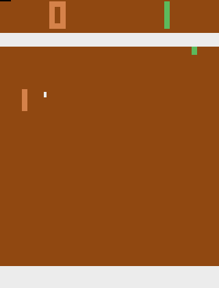
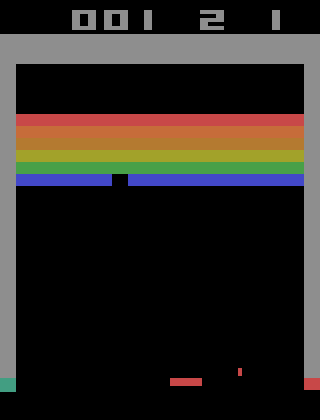
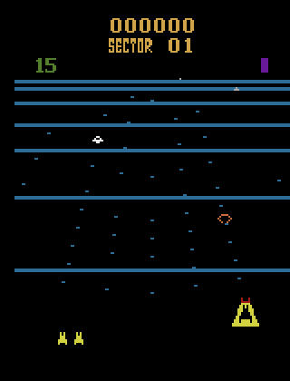
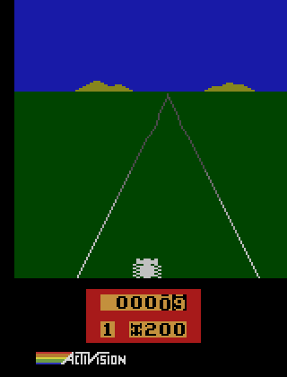
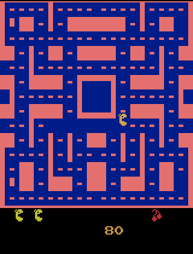
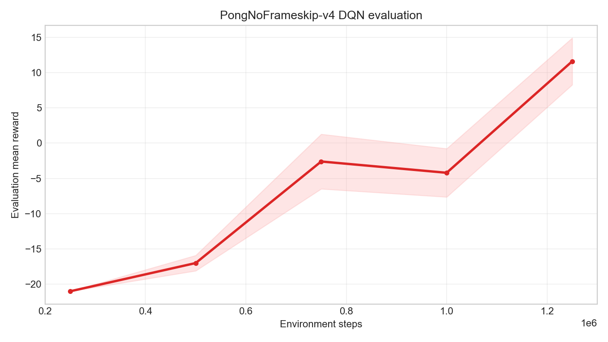
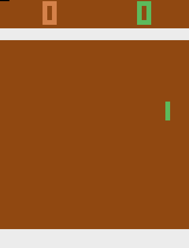
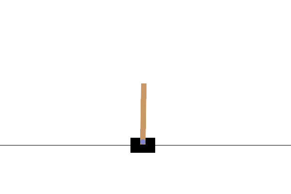
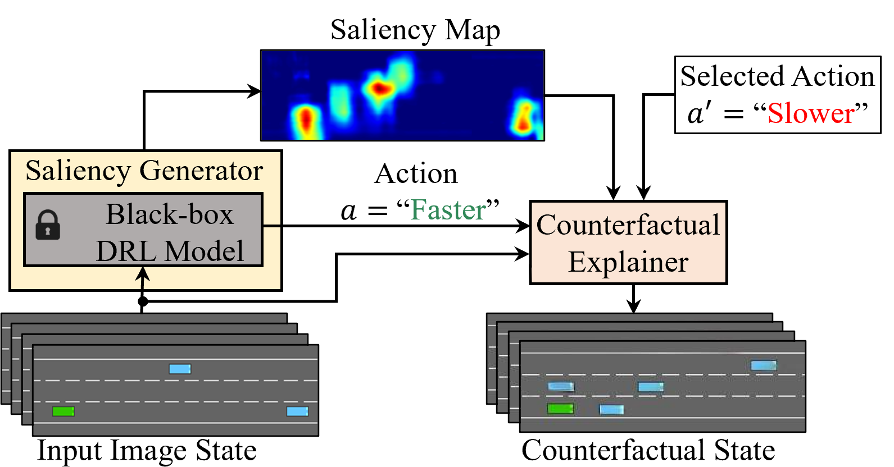
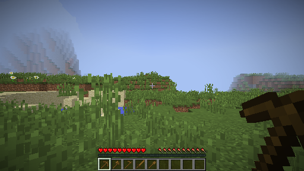

---
outline:
  level: [2, 3]
---

# 4.5 Hands-On: Visual Game Projects

The previous sections have discussed DQN's three core components separately: the Q-network estimates action values, experience replay breaks sample correlation, and the target network stabilizes TD targets. Section 4.3 placed these components into a LunarLander experiment: observing real training, evaluation returns, replay animations, training curves, Q-values, and ablation studies. By this point, low-dimensional state tasks have served their pedagogical purpose: they let us see clearly how DQN learns action values between 8 numbers and 4 discrete actions.

This section addresses the next question: when the state is no longer a clean set of numbers but raw game frames, what else does DQN need to change?

The answer is not to rewrite the TD target. From LunarLander to Atari, the core formula remains a one-step TD update. What actually changes are state representation and training conditions: MLP becomes CNN, single frames become frame stacks, and short experiments become long experiments with evaluation, checkpoints, and replay visualization. Finally, ViZDoom, Pokemon, and Minecraft serve as boundary cases to illustrate why discrete actions do not automatically make vanilla DQN a good fit.

## Section Guide

**Core ideas**

- Using LunarLander as a reference point, explain that migrating from low-dimensional states to pixel inputs introduces new challenges in representation learning and training conditions, not in the TD target itself.
- Clarify what CNNs, frame stacking, Atari wrappers, delayed learning, and evaluation callbacks each solve.
- Provide a real trainable Pong DQN experiment, with curves and multiple checkpoint GIFs showing how the policy evolves from failure to competence.
- Provide a practical rubric for choosing DQN tasks: Atari, Classic Control, LunarLander, GridWorld, small 2D games, and custom discrete-action tasks.
- In the appendices, use ViZDoom, Pokemon, and Minecraft as boundary cases to understand why partial observability, sparse rewards, and long-horizon planning make vanilla DQN struggle.

**Key formulas**

$$
y_i = r_i + \gamma(1-d_i)\max_{a'}Q(s'_i,a';\theta^-)
\quad \text{(build TD target using the target network)}
$$

$$
\mathcal{L}(\theta)
=
\frac{1}{B}\sum_{i=1}^{B}
\left(y_i-Q(s_i,a_i;\theta)\right)^2
\quad \text{(MSE TD error over a minibatch)}
$$

The first line constructs the target value: one transition provides a learning target for the current action. The second line computes the error: how far the current Q-network's prediction $Q(s_i,a_i;\theta)$ deviates from the target. Experience replay decides where the batch comes from, the target network decides which parameters compute $y_i$, and gradient descent pushes $\theta$ toward smaller error.

## 4.5.1 From Low-Dimensional States to Screen Pixels

In LunarLander, the environment already provides a structured state: `x`, `y`, velocities, angle, angular velocity, and whether each leg contacts the ground. The Q-network takes 8 numbers and outputs 4 action values. Section 4.3 used this task to examine training curves, evaluation returns, and replay animations; the question there was whether DQN could stably learn action preferences in a low-dimensional control task.

Visual games push the problem forward. In Pong, the agent initially does not know where the ball is, which direction it is moving, or how far the paddle is from the ball. It only sees screen pixels. This means the network must do two things simultaneously: learn a state representation from images, and learn an action-value function from that representation.

This change is significant. The TD target remains

$$
r+\gamma\max_{a'}Q(s',a';\theta^-)
$$

But the meaning of $s$ has changed: it is no longer a row of hand-designed physical quantities, but a preprocessed image frame. The central training question therefore shifts: not reinventing DQN, but keeping DQN stable under pixel inputs, frame stacking, convolutional networks, and longer training time.

Therefore, the experiments in this section do not repeat the LunarLander training loop, but use it as a reference: low-dimensional states use MLPs to estimate action values; pixel states must first learn representations via CNN, then output action values. Grasping this distinction clarifies why every engineering setting in Atari DQN is necessary.

## 4.5.2 From Vectors to Pixels

DQN attracted widespread attention because of its performance on pixel-input tasks. DeepMind's 2015 Nature paper[^mnih2015] demonstrated a single program that, using only screen pixels and game scores, reached human-level performance on 29 Atari games. The significance was not just a bigger network, but that Q-learning could be combined with representation learning — the agent no longer needed hand-provided ball position, velocity, and distance features; it could learn these decision cues directly from images.

The architecture diagram below shows how DQN processes raw pixels through a convolutional network to output Q-values per action:

, Figure 1)](../../chapter07_dqn/images/dqn-architecture.png)

LunarLander's state is 8 numbers, so the Q-network only needs an MLP. Atari Pong's state is a screen: the input is pixels, not explicit coordinates of the ball and paddle. The TD target does not change — DQN's learning objective is still

$$
r+\gamma\max_{a'}Q(s',a';\theta^-)
$$

What changes is the state representation within $Q(s,a;\theta)$.

The network must first learn useful features from images, then output action values. In LunarLander, the question is: how to estimate action values from 8 numbers. In Atari, the question becomes: how to first convert the screen into a representation suitable for decision-making.

This difference is most directly reflected in the combination of state and network. LunarLander uses an 8-dimensional vector with an MLP; the key difficulty is controlling noise and training variance, suitable for short classroom runs. Atari Pong uses 4 stacked 84×84 frames with a CNN and fully connected layers; the key difficulty is extracting position, velocity, and motion direction from pixels, and training typically requires millions to tens of millions of environment steps.

The most critical factor is state representation. A single image only shows "where the ball is," not "where the ball is going." Several consecutive frames placed together allow the network to infer velocity and direction from position changes. Frame stacking's purpose is to convert static images into states containing short-term motion information.

Gymnasium provides commonly used preprocessing. The code below helps understand the input shape, but is not yet a complete training experiment — it answers the basic question: how to organize game frames into tensors that a CNN can process.

```python
import gymnasium as gym

def make_atari_env(game_id="ALE/Pong-v5"):
    env = gym.make(game_id)
    env = gym.wrappers.AtariPreprocessing(
        env,
        grayscale_obs=True,
        scale_obs=True,
        frame_skip=4,
    )
    env = gym.wrappers.FrameStackObservation(env, stack_size=4)
    return env

env = make_atari_env()
state, _ = env.reset()
print(state.shape)  # (4, 84, 84)
```

This code performs three steps: grayscale conversion reduces color dimensions, downsampling to 84×84 reduces computation, and frame stacking preserves motion information. After processing, the input transforms from raw game frames into tensors suitable for a CNN. Learning has not started yet — this step only organizes observations into a learnable form.

### Pixel-State Representation

```python
class CNNQNetwork(nn.Module):
    def __init__(self, input_channels=4, num_actions=6):
        super().__init__()
        self.conv = nn.Sequential(
            nn.Conv2d(input_channels, 32, kernel_size=8, stride=4),
            nn.ReLU(),
            nn.Conv2d(32, 64, kernel_size=4, stride=2),
            nn.ReLU(),
            nn.Conv2d(64, 64, kernel_size=3, stride=1),
            nn.ReLU(),
        )
        self.fc = nn.Sequential(
            nn.Linear(64 * 7 * 7, 512),
            nn.ReLU(),
            nn.Linear(512, num_actions),
        )

    def forward(self, x):
        x = x / 255.0
        x = self.conv(x)
        x = x.view(x.size(0), -1)
        return self.fc(x)
```

This is not a new algorithm. The network still outputs Q-values per action, still uses experience replay and a target network for training. The change occurs in the first half: the network goes from reading 8 numbers to reading image local structure. Convolutional layers learn edges, shapes, and motion cues; fully connected layers then synthesize these cues into action values.

The distinction between MLP and CNN lies in their input assumptions. MLP assumes each input dimension is already a meaningful state feature; CNN assumes local structure exists among spatially adjacent pixels. For Pong, the ball, paddle, and boundaries are all composed of local pixel groups — convolution is well-suited for extracting these patterns.

Compared to LunarLander, Atari's training conditions also change significantly. Pixels have spatial structure that flattening via MLP would waste, hence CNN. Single frames cannot determine motion direction, hence frame stacking. Image states are more diverse, so replay buffer capacity, learning start point, and exploration annealing must be jointly configured using validated settings. Different Atari games have different reward scales, requiring reward clipping to unify training signals. CNN has more parameters, making unstable updates more likely during training, hence gradient clipping. Pixel tasks are harder, so the target network must maintain stability for longer, requiring slower sync frequency.

Therefore, migrating from LunarLander to Atari is not simply replacing `env_id`. The skeleton of TD learning has not changed; what has become more complex are the state representation and training conditions. Teaching snippets can illustrate principles, but to run an experiment using the full Atari pipeline, one must also add environment preprocessing, evaluation, and checkpointing.

## 4.5.3 Pong: A Complete Atari Experiment

Before continuing with Pong, we need to clarify what "Atari" means. If you have not encountered classic game benchmarks, it is easy to think Atari refers to a single game. But in the deep reinforcement learning context, Atari usually does not mean one game — it refers to a collection of classic game environments running on an Atari 2600 emulator.

### What Is Atari

The Atari 2600 was a home game console from the late 1970s to the 1980s. Simple graphics, actions that are finite button combinations, rewards directly from game scores — these three characteristics correspond exactly to reinforcement learning's observation, action, and reward.

What turned Atari into a standard deep RL benchmark is ALE (Arcade Learning Environment).[^ale-envs] ALE wraps dozens of Atari 2600 games into a unified interface: `reset()` starts an episode, `step(action)` executes an action and returns an image observation, reward, and termination info. The same DQN program can switch from Pong to Breakout or Space Invaders by changing only the environment ID.

In this chapter, Atari serves as a "pixel version of CartPole," but at a higher difficulty level: CartPole gives you the state as 4 numbers; Atari only gives you the screen — where the ball is, which direction it's flying, how far the paddle is from the ball, all must be learned from 84×84 grayscale frames.

ALE contains dozens of games with widely varying difficulty. This section chooses Pong as the main experiment: two paddles, one ball, first to 21 points wins. Few objects on screen, actions are only up and down, extremely short feedback — catching the ball or losing a point happens almost immediately. Simple visuals and a very short feedback chain make Pong the most natural starting point for pixel DQN.

### Where Are Other Atari Games

Beyond Pong, ALE provides Breakout, Space Invaders, Seaquest, and dozens of other games. After installing `gymnasium[atari,accept-rom-license]` and `ale-py`, they can be created via Gymnasium environment IDs.[^ale-complete-list] The training script remains `code/chapter07_dqn/dqn_atari_sb3.py`; changing games only requires changing `--env-id`:

```bash
python code/chapter07_dqn/dqn_atari_sb3.py \
  --env-id BreakoutNoFrameskip-v4 \
  --total-timesteps 5000000 \
  --learning-starts 100000 \
  --optimize-memory-usage
```

The table below lists several common Atari games. `NoFrameskip-v4` names are better aligned with traditional DQN configurations in SB3 / RL-Zoo; `ALE/...-v5` is the newer Gymnasium / ALE naming. The code in this section is compatible with both, but to avoid confusion from default frame skipping and sticky actions, the main experiment uses `PongNoFrameskip-v4`.

The animations in the table are rendered directly from ALE environments and are only for building task intuition — they do not represent successful DQN training.

| Preview                                                                                                        | Game           | Common Env ID                 | Newer Env ID           | What to Observe                                              |
| -------------------------------------------------------------------------------------------------------------- | -------------- | ----------------------------- | ---------------------- | ------------------------------------------------------------ |
|                      | Pong           | `PongNoFrameskip-v4`          | `ALE/Pong-v5`          | Ball, paddle, and short feedback chain — best starting point |
|              | Breakout       | `BreakoutNoFrameskip-v4`      | `ALE/Breakout-v5`      | Ball control, brick clearing, and clearer pixel structure    |
|  | Space Invaders | `SpaceInvadersNoFrameskip-v4` | `ALE/SpaceInvaders-v5` | Horizontal movement, shooting, and enemy pressure            |
|          | Beam Rider     | `BeamRiderNoFrameskip-v4`     | `ALE/BeamRider-v5`     | Horizontal dodging, shooting, and speed variation            |
|                  | Enduro         | `EnduroNoFrameskip-v4`        | `ALE/Enduro-v5`        | Racing, overtaking, and continuous visual judgment           |
|          | Ms. Pac-Man    | `MsPacmanNoFrameskip-v4`      | `ALE/MsPacman-v5`      | Maze, pursuit, and stronger partial observability            |
|                    | Qbert          | `QbertNoFrameskip-v4`         | `ALE/Qbert-v5`         | Platform jumping, spatial positioning, and staged rewards    |
|              | Seaquest       | `SeaquestNoFrameskip-v4`      | `ALE/Seaquest-v5`      | Oxygen, divers, enemies, and longer goal dependencies        |

You can list local Atari environments with:

```bash
python - <<'PY'
import gymnasium as gym
import ale_py

gym.register_envs(ale_py)
for env_id in sorted(gym.envs.registry):
    if env_id.startswith("ALE/") or env_id.endswith("NoFrameskip-v4"):
        print(env_id)
PY
```

Now back to the Pong experiment. CNN and frame stacking solve the state representation problem, but to make training stable, the key is not how deep the network is — it is whether environment preprocessing, exploration, replay buffer, learning start, and evaluation are properly organized together. CleanRL, Stable-Baselines3, and RL-Zoo differ in implementation style, but share the same experimental structure: first standardize the environment with wrappers, then let DQN accumulate experience over sufficiently long interaction.[^cleanrl-dqn] [^sb3-dqn] [^sb3-atari] [^rlzoo-dqn]


### Experiment Setup

Pong's rules are intuitive: pixel input, discrete actions, short feedback chain. The two numbers at the top of the screen show the opponent's and agent's current scores; the agent controls the green paddle on the right. Each ball won scores `+1`, each ball lost scores `-1`, and a game ends when one side reaches 21.

**Return vs. score.** The cumulative return at the end of a game equals "agent's score − opponent's score," not the momentary score. For example, a game lost 0:21 gives return `0 − 21 = −21`; a game won 21:19 gives return `21 − 19 = +2`. During evaluation, we average over multiple games to get the "mean evaluation return" — it reflects whether the policy overall wins more than it loses, not the real-time score of any single game.

To judge learning quality, look at where the mean evaluation return falls: `-21` means nearly every game is a blowout; near `0` means the agent can rally with the opponent; positive returns mean the policy is consistently winning.

A common misconception needs clarification: **the paddle moving does not mean the agent has learned Pong**. A random policy or an early network may also move the paddle, but this is often just repeating the same action or coincidentally tracking a few frames. The real criterion is whether the mean return in multi-game deterministic evaluation consistently moves away from `-21` and gradually approaches and exceeds `0`.

This section uses `PongNoFrameskip-v4` as the main experiment environment. This choice is not because `ALE/Pong-v5` cannot be trained, but to stay consistent with the validated Pong DQN pipeline in SB3 / RL-Zoo, reducing extra variance from environment version, default frame skipping, and sticky actions. The algorithm entry point is `code/chapter07_dqn/dqn_atari_sb3.py`, based on Stable-Baselines3's `DQN("CnnPolicy", ...)` implementation. This is no longer the hand-written CNN teaching snippet from earlier — it is a complete training script including Atari wrappers, experience replay, target network, evaluation callbacks, and model saving.

In this experiment, the orange paddle on the left is the opponent, and the green paddle on the right is the agent's side. This distinction is intuitive for human readers, but for DQN, the input is not a symbolic description like "left is opponent, right is self" — it is just pixels. After Atari wrappers, the image is first resized to 84×84 grayscale, then 4 consecutive frames are stacked and fed to the CNN in channel-first format. The action space is Pong's discrete joystick actions: `NOOP`, `FIRE`, `RIGHT`, `LEFT`, `RIGHTFIRE`, and `LEFTFIRE`. So what the network must learn is not memorizing "green means me," but recovering the ball's position, velocity, and direction from pixel positions, brightness, and motion changes on screen, and converting this information into stable defense and hitting actions.

### Training Results

Short Atari Pong experiments are only suitable for checking the pipeline: whether the ALE environment starts, whether wrappers are connected correctly, whether the CNN policy can output actions, and whether evaluation, saving, and GIF rendering work end-to-end. **To truly demonstrate what the policy has learned, you need long experiments.** That is, first fix the environment, replay buffer, exploration annealing, and evaluation frequency, then use multiple checkpoints to show how the policy evolves from failure to competence.

::: details Reproducing the Experiment and Exporting Assets

```bash
pip install -r code/chapter07_dqn/requirements.txt

# Long experiment aligned with the validated pipeline: observe whether eval return consistently rises above random level
python code/chapter07_dqn/dqn_atari_sb3.py \
  --env-id PongNoFrameskip-v4 \
  --total-timesteps 10000000 \
  --buffer-size 10000 \
  --learning-starts 100000 \
  --exploration-fraction 0.1 \
  --exploration-final-eps 0.01 \
  --eval-freq 250000 \
  --eval-episodes 5 \
  --checkpoint-freq 500000 \
  --optimize-memory-usage \
  --output-dir output/dqn_atari_long \
  --run-name PongNoFrameskip-v4_dqn_seed0_10m_zoo_aligned \
  --no-swanlab \
  --device auto
```

Training logs will be written to `output/dqn_atari_long/PongNoFrameskip-v4_dqn_seed0_10m_zoo_aligned/`. When monitoring training, prioritize whether evaluation returns gradually rise above random level, rather than only checking whether loss decreases:

```bash
tensorboard --logdir output/dqn_atari_long

# Re-export local eval CSV as textbook images
python code/chapter07_dqn/export_dqn_curves.py --run pong
```

To render GIFs, use the same script with different checkpoints and output paths:

```bash
python code/chapter07_dqn/render_atari.py \
  --env-id PongNoFrameskip-v4 \
  --model output/dqn_atari_long/PongNoFrameskip-v4_dqn_seed0_10m_zoo_aligned/checkpoints/dqn_atari_500000_steps.zip \
  --output docs/chapter07_dqn/images/dqn-atari-pong-500k.gif \
  --max-steps 1800 \
  --render-every 6 \
  --fps 20 \
  --scale 2
```

To render the 1M and current best model checkpoints, change `--model` to `checkpoints/dqn_atari_1000000_steps.zip` and `best_model/best_model.zip` respectively, and update `--output` accordingly.

:::

This section ran a long experiment configured along the validated pipeline. A full `10M` environment steps is typically an overnight experiment; on a local MPS machine, training to `1.25M` already takes several hours, and running the full `10M` requires another dozen or so hours. Therefore, the textbook first captures the evaluation curve and three checkpoints from the first `1.25M` steps, using them to show the policy's evolution from failure to clear competence.



| Training Steps | Mean Eval Return | Std Dev | Mean Episode Length | Interpretation                                                           |
| -------------- | ---------------- | ------- | ------------------- | ------------------------------------------------------------------------ |
| `250k`         | `-21.0`          | `0.0`   | `3056`              | Deterministic policy still loses nearly every game                       |
| `500k`         | `-17.0`          | `1.10`  | `10550`             | Starting to extend rallies, but still clearly weak                       |
| `750k`         | `-2.6`           | `3.88`  | `11297`             | Near break-even; policy is developing effective defense                  |
| `1M`           | `-4.2`           | `3.43`  | `15637`             | Evaluation still fluctuates, but no longer a total-loss policy           |
| `1.25M`        | `11.6`           | `3.32`  | `13830`             | Evaluation mean turns positive, clearly better than random and early DQN |

This curve is more important than any single GIF. A single-game replay is affected by starting randomness and may look particularly good or bad; the evaluation curve places the mean and variance of multiple episodes together, answering "is the policy overall getting better?" From `250k` to `1.25M`, the return does not rise monotonically — it crosses `0` amid fluctuations. This is what RL experiments typically look like: policy updates do not bring visible progress at every step, but a sufficiently long evaluation sequence reveals the trend.

The three GIFs below correspond to different training stages. They are not three algorithms — they are three checkpoints from the same DQN training run.

**500k checkpoint: starting to defend, but still weak.**

The evaluation mean at this stage is `-17.0`. The agent no longer just repeats one action like an untrained network; the paddle tries to track the ball, but timing and movement amplitude remain unstable. Training has started to take effect, but it is not yet fair to say the agent has learned Pong.


**1M checkpoint: policy enters a transition phase.**

The deterministic evaluation mean at this stage is still `-4.2`, but some individual game replays already show positive returns. This reminds us not to judge algorithm success from a single episode: a good-looking game does not mean stable learning — the evaluation mean and variance must be considered together.


**1.25M best model: evaluation mean turns positive.**

The 5-game evaluation mean at this stage reaches `11.6`, and the rendered game below has a return of `+17` (agent wins 21:4). At this point it is fair to say the agent has learned an effective Pong strategy: it is not just moving the paddle — it can judge the ball's position and direction from pixel frames and move the paddle to a defensible position.



### Key Settings

The key to Atari DQN is not any single hyperparameter, but a set of mutually coordinated training conditions. These conditions answer three questions: how to organize observations, how to accumulate samples, and how to stabilize training.

| Training Condition            | Implementation Location | Purpose                                                                                                                                   |
| ----------------------------- | ----------------------- | ----------------------------------------------------------------------------------------------------------------------------------------- |
| `AtariWrapper`                | `make_atari_env(...)`   | Automatically applies no-op reset, max-and-skip, life-loss episode, Fire reset, 84×84 preprocessing, and reward clipping                  |
| `VecFrameStack(..., 4)`       | `build_env`             | Combines 4 frames into one state, letting the network see motion direction                                                                |
| `CnnPolicy`                   | `DQN("CnnPolicy", ...)` | Uses a convolutional feature extractor suitable for pixel input                                                                           |
| `buffer_size=10000`           | DQN parameter           | Aligned with validated RL-Zoo Pong DQN pipeline, preventing early failure experiences from persisting too long in an oversized buffer     |
| `learning_starts=100000`      | DQN parameter           | Fills the replay buffer first, preventing the network from learning prematurely from very few consecutive samples                         |
| `exploration_fraction=0.1`    | DQN parameter           | Reduces epsilon from 1.0 to 0.01 over the first 10% of training steps, allowing thorough early exploration and gradual later exploitation |
| `train_freq=4`                | DQN parameter           | No need to update every frame, reducing jitter from correlated samples                                                                    |
| `target_update_interval=1000` | DQN parameter           | Prevents the TD target from changing with every online-network step                                                                       |
| `optimize_memory_usage=True`  | DQN parameter           | Reduces Atari replay buffer memory usage, making local long training feasible                                                             |
| `EvalCallback` and checkpoint | callbacks               | Continuously preserves evaluation results and model state during long training                                                            |

These processing steps fill in the training conditions omitted in the teaching snippets. `NoopReset` makes each game start differently, preventing the agent from adapting only to fixed starting positions. `EpisodicLife` treats losing a life as the end of a training episode, causing games like Pong and Breakout to expose the consequences of wrong actions more quickly. `MaxAndSkip` repeats each action for 4 frames and takes the max of adjacent frames, both reducing computation and mitigating the interference of Atari's flickering graphics on observations.[^sb3-atari]

If using Gymnasium's `ALE/Pong-v5` environments, note that they may have default frame skipping and sticky actions. In that case, the training entry point explicitly sets environment construction parameters to `frameskip=1` and `repeat_action_probability=0.0`, then hands off to `AtariWrapper` for unified processing. This section's main experiment directly uses `PongNoFrameskip-v4`, so that frame skip is controlled only by the wrapper and stays consistent with the validated Pong DQN training pipeline.

Resource expectations should also match the experimental question. If the goal is only to confirm that the environment, wrappers, evaluation, and saving pipeline work end-to-end, `100k` to `200k` environment steps suffice; such experiments can complete on CPU, though more slowly. If the goal is to observe Pong's learning trend, typically `1M` to `2M` environment steps are needed, and GPU is more appropriate. To approach common Atari DQN training settings, steps often expand to `5M` to `10M`, at which point saving checkpoints, evaluation means, variances, and necessary video replays becomes essential.

Atari DQN's ability to train stably depends not on some hidden new algorithm, but on whether these stability conditions are all in place: images compressed to appropriate size, states containing motion information, reward scales clipped, replay buffer sufficiently large, learning starting sufficiently late, target network updating sufficiently slowly, and the training process including evaluation and saving. CleanRL, RL-Zoo, and SB3 differ in implementation style but share the same core judgment about Atari DQN.

## 4.5.4 Other DQN Tasks Worth Trying

Beyond LunarLander and Atari, many more environments are suitable as DQN practice entry points. As long as actions are discrete, observations are sufficient for decision-making, and rewards arrive within a reasonable time, DQN can be tried as a baseline. But "suitable" does not mean "drop it in and it works" — before starting, four conditions are worth checking.

### What Tasks Suit DQN

The action space must be expressible as a discrete set `0, 1, ..., n_actions-1`. This way the Q-network's output layer can correspond one-to-one. If the task requires continuous steering angle, throttle magnitude, or robotic arm torque, vanilla DQN is no longer natural — consider DDPG, TD3, SAC, or other continuous-action algorithms.

Observations must also be sufficient for decision-making. The current frame or frame stack should contain key information. If the current screen cannot show enemy positions, or task progress is hidden in a long history, a DQN that only sees the current frame will lack information — it needs more frame stacking, RAM features, or a network with memory.

Rewards must arrive within a reasonable time. DQN propagates future returns step-by-step through the TD target. If the replay buffer contains only negative samples or meaningless transitions for a long time, the network cannot know which early action was useful. This is not a formula error — it is the learning signal being too far from the action.

Finally, ε-greedy exploration must be able to produce useful experience. When action combinations are too many, episodes too long, and failure feedback too late, random exploration may fail to collect meaningful samples for a long time. In such cases, reducing the action set, designing staged rewards, or switching to methods better suited for long-horizon exploration is needed.

Not meeting these conditions does not mean DQN completely fails — it means additional design is needed: continuous actions require different algorithms, missing observations require memory, sparse rewards require engineering or task decomposition.

Under these conditions, tasks can be roughly divided into three categories by state representation complexity.

### Low-Dimensional Starting Point: Classic Control

Gymnasium's CartPole, MountainCar, and Acrobot provide low-dimensional continuous states with discrete action spaces.

Taking CartPole as an example, the state has only four numbers: cart position, velocity, pole angle, and angular velocity. Actions are only left or right. Such tasks are ideal for first DQN experiments, because failure causes are easy to pinpoint: if CartPole fails to learn, the issue is usually at least one of learning rate, exploration decay, replay buffer, or target network.

MountainCar's state is even shorter — only position and velocity — but rewards are more sparse. The agent must swing left and right to accumulate potential energy to reach the mountaintop. As a low-dimensional control task, MountainCar typically demonstrates the importance of exploration strategy more than CartPole.




::: details Experiment Entry: Classic Control

```bash
cd code
pip install -r chapter07_dqn/requirements.txt

python chapter07_dqn/dqn_gym_sb3.py \
  --env-id CartPole-v1 \
  --total-timesteps 100000 \
  --learning-starts 1000

python chapter07_dqn/dqn_gym_sb3.py \
  --env-id MountainCar-v0 \
  --total-timesteps 300000 \
  --learning-starts 5000
```

:::

In CartPole, if evaluation returns approach the environment's upper limit, the policy can stably balance the pole. In MountainCar, a more meaningful observation is whether the frequency of reaching the goal increases, and whether mean returns gradually approach values corresponding to shorter paths. The two tasks emphasize different issues: CartPole tests update stability; MountainCar tests exploration sufficiency.

### Pixel Advancement: Atari

From low-dimensional vectors to pixel screens, Atari is the next natural step. Atari's core change is not the TD target, but the state representation going from vectors to images. Environments like Pong and Breakout have game screens as observations, finite control commands as actions, and game scores as rewards. LunarLander mainly tests how to stably learn action values; Atari additionally tests how to learn state representations from images, hence requiring CNN, frame stacking, and longer training.

Training settings affect results more than network architecture itself. 84×84 grayscale, frame skipping, 4-frame stacking, reward clipping, a sufficiently large replay buffer, and late-starting `learning_starts` — these jointly determine whether samples in the replay buffer have sufficient diversity and stability. Atari is better suited as a complete visual DQN experiment, rather than the first environment for testing whether the algorithm is correctly implemented.



::: details Experiment Entry: Atari Pong

```bash
python chapter07_dqn/dqn_atari_sb3.py \
  --env-id PongNoFrameskip-v4 \
  --total-timesteps 10000000 \
  --buffer-size 10000 \
  --learning-starts 100000 \
  --eval-freq 250000 \
  --checkpoint-freq 500000 \
  --optimize-memory-usage
```

:::

### Custom Environments: GridWorld and Small Tasks

GridWorld provides the most transparent task design. Starting point, obstacles, goal position, action set, and reward function are all defined in the environment — the structure is clear at a glance. States can be represented as coordinates, one-hot, or local images; actions are typically up, down, left, right. When the state space is small, tabular Q-learning can first verify the optimal path; when the state representation becomes higher-dimensional features, DQN replaces the Q-table.

If the agent fails to learn an effective policy, the reason can usually be traced back to the environment definition itself: are rewards too sparse, is the action design reasonable, are episodes too long? These problems are easy to observe in small tasks, so GridWorld is well-suited for understanding the basic relationships among state, action, and reward in DQN.


Stepping up, any task with action space `gym.spaces.Discrete(n_actions)` can try DQN. Low-dimensional vectors use `MlpPolicy`; images use `CnnPolicy`. But "discrete actions" is only a necessary condition — if rewards are extremely sparse, observations severely lack information, or random exploration almost never produces useful feedback, vanilla DQN still struggles to converge.

In summary, DQN is suited for tasks with discrete actions, observable rewards, finite episode lengths, and where exploration can produce effective transitions. When tasks exhibit strong partial observability, extremely sparse rewards, or long-horizon planning needs, improvements like Double DQN, Dueling DQN, prioritized replay, n-step returns, or memory networks are needed.

The appendices below explore this boundary: ViZDoom mainly exposes partial observability issues, Pokemon mainly exposes sparse reward and long-horizon planning issues, and Minecraft further pushes open-world, hierarchical goals, and long-range exploration to a more difficult position.

ViZDoom's original paper trained agents on simplified scenarios using convolutional networks + Q-learning + experience replay.[^vizdoom-paper] DQN can train, but depends on several constraints: scenarios designed for learning, controlled action sets, rewards close to target behavior, and moderate episode length.


The official example `examples/python/learning_pytorch.py`[^vizdoom-learning-pytorch] has a complete structure: environment initialization, image preprocessing (scaled to 30×45 grayscale), action enumeration (button 0/1 combinations), frame repeat (`frame_repeat=12`), online/target networks, experience replay, and Double DQN updates. These components directly correspond to the DQN introduced earlier in this chapter.

Minimum run:

```bash
git clone https://github.com/Farama-Foundation/ViZDoom.git
cd ViZDoom
python -m venv .venv
source .venv/bin/activate
pip install vizdoom torch numpy scikit-image tqdm
python examples/python/learning_pytorch.py
```

During training, distinguish two things: whether the code path is complete (each epoch produces training/testing returns), and whether the policy has truly learned behavior (evaluation returns should gradually rise above random level). If loss decreases but evaluation returns show no trend over a long period, the network may be fitting noise.


A reasonable experimental starting point is `simpler_basic.cfg` or `basic.cfg`: small scenario, close feedback, movement and shooting quickly affect rewards. Observations first use grayscale scaled to 84×84 or smaller; action sets stay restrained (turn left, turn right, move forward, shoot), avoiding enumerating all button combinations which would bloat output dimensions.


More complex scenarios (like HealthGathering, MyWayHome) require longer-term memory. Lample and Chaplot's research added recurrent memory and auxiliary game feature prediction on top of DQN.[^lample-chaplot] This shows that when tasks require remembering where you came from, enemy positions, or explored areas, short frame-stacked CNN-DQN is often insufficient.


ViZDoom does not disprove DQN — it illustrates another boundary: when observations themselves do not satisfy the Markov property, adding convolutional depth alone cannot automatically fill in the missing historical information. Memory mechanisms like DRQN, or stronger exploration and task decomposition, are needed.

| Issue                | Manifestation                                              | Impact on DQN                                                       |
| -------------------- | ---------------------------------------------------------- | ------------------------------------------------------------------- |
| First-person view    | Current frame only shows the area in front                 | Current observation cannot represent global state                   |
| 3D navigation        | Distance, angles, and occlusion change action consequences | Same button has different meanings at different orientations        |
| Delayed feedback     | Current movement may affect survival much later            | TD target struggles to propagate distant returns to early actions   |
| Action composition   | Move forward, turn, shoot can be combined                  | Action count bloats, random exploration rarely samples good actions |
| Scenario overfitting | Policy learned on one cfg may not transfer                 | Need evaluation on independent scenarios or fixed test sets         |

## Appendix: Can DQN Beat Pokemon?

Pokemon Red can be wrapped as a DQN environment: the screen is the observation, D-pad plus A/B/Start are discrete actions, and story progression becomes rewards.[^pyboy] But unlike Pong, Pokemon's goals and button presses are separated by a long chain of actions — random exploration almost never produces sufficient positive samples.

| Issue                  | Pong                                    | Pokemon Red                                               |
| ---------------------- | --------------------------------------- | --------------------------------------------------------- |
| Decision chain length  | Tens to hundreds of steps per game      | Key objectives may span thousands of steps                |
| Reward density         | Score changes frequently                | Story and badge rewards are very sparse                   |
| State meaning          | Ball and paddle position, velocity      | Map, coordinates, menus, story flags, bag, party state    |
| Exploration difficulty | Random actions quickly produce feedback | Random actions easily loop in place or get stuck in menus |


### Early Subtask Experiments

Alec Letsinger's experiment wraps Pokemon as a PyBoy environment and uses DQN to train the agent to leave the starting house and trigger early flags.[^pokemon-dqn-house] This result depends on a small state space (character position, current area, flag count), showing DQN can handle early subtasks. But once objectives advance further, long action sequences involving dialog, story, menus, and combat are needed, and the Q-network struggles to learn these directly.

PWhiddy's `PokemonRedExperiments`[^pokemon-red-experiments] provides a more complete experimental foundation: PyBoy environment, ROM verification, save states, map visualization, and anti-loop detection. The engineering focus of such tasks is not `model.learn(...)`, but environment wrapping: reading screen and RAM from the emulator, saving reproducible starting points, tracking exploration coverage via maps, and detecting whether the agent is stuck.

Therefore, DQN objectives in Pokemon should start from short-feedback tasks:

| Training Objective         | Available State                            | Reward Signal                                       | Pedagogical Value                                                          |
| -------------------------- | ------------------------------------------ | --------------------------------------------------- | -------------------------------------------------------------------------- |
| Leave starting room        | Coordinates, map ID, few flags             | New coordinates, new map                            | Observe whether DQN can learn action preferences from local navigation     |
| Explore Pallet Town        | Screen image plus coordinate records       | New positions, loop penalty                         | Observe whether exploration coverage expands                               |
| Trigger early story events | Coordinates, map, flags                    | Flag changes, key location rewards                  | Observe how sparse events enter the TD target                              |
| Complete the game          | Badges, story, combat, bag and party state | Final goal too distant, single reward hard to train | Demonstrates that vanilla DQN needs task decomposition and stronger memory |

### DQN Formulation in Pokemon

If using DQN, the network structure itself does not change: given screen state $s$, output the value of each button action. Input can be 84×84 grayscale with 4-frame stacking; map ID and coordinates from RAM are better used for constructing rewards and evaluation metrics.

| Component       | Atari Pong                                             | Pokemon Early Tasks                                    |
| --------------- | ------------------------------------------------------ | ------------------------------------------------------ |
| Observation     | 84×84 grayscale, 4-frame stack                         | Same; can record RAM coordinates                       |
| Actions         | Atari discrete actions                                 | Game Boy buttons, typically 7–8                        |
| Reward          | Game score                                             | New coordinates, new maps, event changes as shaping    |
| Replay buffer   | Contains defense, hitting, scoring with short feedback | Easily contains wall-hitting, looping, menu states     |
| Reasonable goal | Observe score trend after millions of steps            | Leave room, enter new map, expand exploration coverage |


**Minimum training entry.**

```bash
cd code
pip install -r chapter07_dqn/requirements.txt
```

Prepare a legally obtained `PokemonRed.gb`; recommend starting from an existing save `start.state` (to avoid spending steps on the title menu):

```bash
python chapter07_dqn/dqn_pokemon_red_pyboy.py \
  --rom /path/to/PokemonRed.gb \
  --state /path/to/start.state \
  --total-timesteps 500000 \
  --learning-starts 20000

tensorboard --logdir output/dqn_pokemon_red/tb
```

If mean returns and `unique_positions` remain flat for a long time, the issue is usually not that the network is too shallow, but that rewards are too sparse, the action-hold duration is wrong, or the agent is trapped by menus, walls, and repeated dialogs. When short training produces position changes, then expanding steps and evaluating with multiple random seeds makes it meaningful to discuss whether the policy is stable.

### Limits of Training Objectives

If the task is limited to early navigation and rewards provide clear feedback for new coordinates, new maps, and looping behavior, DQN can sample useful transitions from the replay buffer. Completing the full game requires the agent to maintain goals over a very long time range, handling hidden states like story, bag, party, and combat — this exceeds vanilla DQN's capability.

| Vanilla DQN Issue                    | Manifestation in Pokemon                                              | Possible Improvement                                       |
| ------------------------------------ | --------------------------------------------------------------------- | ---------------------------------------------------------- |
| Random experience collection         | Most samples are wall-hitting, looping, repeated menu-opening         | Curriculum learning, dense rewards, prioritized replay     |
| Current frame incomplete information | Same screen corresponds to different story flags or menu states       | Frame stacking, RAM features, DRQN                         |
| Q-value overestimation               | Incorrect overestimates under sparse rewards get repeatedly exploited | Double DQN, Dueling DQN, n-step                            |
| Ineffective operations               | Repeatedly opening menus, stuck in dialog                             | Action mask, anti-loop penalty                             |
| Episodes too long                    | Single failure consumes many samples                                  | Save-state starting points, staged objectives, checkpoints |

Therefore, the precise answer to "can DQN beat Pokemon?" is: DQN can train early subtasks in an emulator; if the goal is full completion, it requires task decomposition, reward engineering, and longer-term memory. This is consistent with this section's main theme: DQN's key limitation is not "cannot see pixels," but that when rewards are too distant, states too hidden, and planning chains too long, simply increasing the Q-network size does not automatically solve the problem.

## Appendix: Can DQN Beat Minecraft?

Minecraft is an open-world sandbox game where the objective is not a single action skill, but a chain of interdependent long-term tasks: chop trees → wooden pickaxe → stone → stone pickaxe → iron ore → iron ingot → iron pickaxe → diamonds.



Interface-wise, Minecraft can be wrapped as a reinforcement learning environment: the screen is the observation, keyboard and mouse actions can be discretized, and obtaining items can serve as rewards.[^malmo] [^minerl] But before "getting diamonds," a long sequence of intermediate steps is usually required; if only the final success is the reward, random exploration almost never produces positive samples.

MineDojo further organizes Minecraft into an open-ended task platform, including item collection, crafting, tech trees, and procedurally generated tasks.[^minedojo] A high-level objective is often not something a single Q-function can propagate through in the short term, but a dependency chain of many intermediate steps.

Therefore, the answer to "can DQN train Minecraft subtasks" is yes — the task can be constrained to collecting wood in a fixed small map, walking to a specified block, or obtaining a certain item within a short episode, using a small number of discrete actions. CNN-DQN can serve as a baseline.

But "can vanilla DQN complete the full game from scratch" deserves a much more cautious answer. Full completion involves long-term memory, hierarchical goals, inventory state, crafting recipes, sparse rewards, and complex action spaces — beyond Atari DQN's typical assumptions. More common approaches introduce imitation learning (like VPT[^vpt]), world models (like DreamerV3[^dreamerv3]), or language-driven hierarchical policies (like Voyager[^voyager]).

| Objective                        | Is DQN Suitable                | Key Reason                                                          |
| -------------------------------- | ------------------------------ | ------------------------------------------------------------------- |
| Collect items in a fixed area    | Can serve as baseline          | Few actions, close rewards, short episodes                          |
| Short navigation or pickup tasks | Worth trying                   | Relatively direct relationship between state and goal               |
| Obtain diamonds                  | Requires extensive task design | Many intermediate steps, extremely sparse rewards                   |
| Full game completion             | Not suitable for vanilla DQN   | Requires long-term planning, memory, crafting, and open exploration |

So DQN can train constrained discrete subtasks in Minecraft; if the goal is obtaining diamonds from scratch or completing the game, the task must be decomposed into hierarchical objectives, with demonstrations, world models, or stronger planning mechanisms. This conclusion is similar to the Pokemon appendix, but Minecraft goes further: not only are rewards distant, but actions and states are also more open.

## Section Summary

- From LunarLander to Atari, the core formula does not change; what changes is state representation: MLP processes vectors, CNN processes pixels, and frame stacking provides motion information.
- Pong's success criterion is not the paddle moving, but the multi-game deterministic evaluation mean return consistently departing from `-21`, approaching `0`, and eventually exceeding `0`.
- A truly trainable Atari DQN also requires a complete wrapper chain, delayed learning, a sufficiently large replay buffer, periodic evaluation, and checkpoints; otherwise, you can only prove the training pipeline runs, not that the policy has learned stable behavior.
- DQN is suited for tasks with discrete actions, observable rewards, finite episode lengths, and where exploration can produce effective transitions.
- ViZDoom reminds us: partial observability means the current observation cannot fully represent the state; DQN needs memory mechanisms or stronger representations to compensate for missing historical information.
- Pokemon reminds us: DQN can train neural-network Q-policies in real emulators, but full completion requires task decomposition, reward engineering, and longer-term memory.
- Minecraft reminds us: open-world tasks not only have sparse rewards, but also contain hierarchical goals, inventory states, crafting chains, and more complex action spaces.

With this, Chapter 4 completes the transition from tabular Q-learning to deep Q-networks to pixel game experiments. The next chapter turns to a different path: instead of first learning action-value tables, directly optimizing the policy itself. [Policy Gradient and REINFORCE](../chapter08_policy_gradient/intro)

## References

[^mnih2015]: Mnih, V., et al. (2015). Human-level control through deep reinforcement learning. _Nature_, 518(7540), 529-533. <https://www.nature.com/articles/nature14236>

[^ale-envs]: Farama Foundation. Arcade Learning Environment documentation. <https://ale.farama.org/>

[^ale-complete-list]: Farama Foundation. Arcade Learning Environment environment list. <https://ale.farama.org/environments/>

[^cleanrl-dqn]: CleanRL. DQN implementations and Atari DQN training scripts. <https://docs.cleanrl.dev/rl-algorithms/dqn/>

[^sb3-dqn]: Stable-Baselines3. DQN documentation. <https://stable-baselines3.readthedocs.io/en/master/modules/dqn.html>

[^sb3-atari]: Stable-Baselines3. Atari wrappers documentation. <https://stable-baselines3.readthedocs.io/en/master/common/atari_wrappers.html>

[^rlzoo-dqn]: RL-Baselines3-Zoo. DQN hyperparameter configuration for Atari. <https://github.com/DLR-RM/rl-baselines3-zoo/blob/master/hyperparams/dqn.yml>

[^gym-classic]: Gymnasium. Classic Control environments. <https://gymnasium.farama.org/environments/classic_control/>

[^gym-env-creation]: Gymnasium. Environment creation tutorial. <https://gymnasium.farama.org/tutorials/gymnasium_basics/environment_creation/>

[^vizdoom-official]: ViZDoom. A Doom-based AI research platform for visual reinforcement learning. <https://github.com/Farama-Foundation/ViZDoom>

[^vizdoom-paper]: Kempka, M., Wydmuch, M., Runc, G., Toczek, J., & Jaśkowski, W. (2016). ViZDoom: A Doom-based AI Research Platform for Visual Reinforcement Learning. <https://arxiv.org/abs/1605.02097>

[^vizdoom-learning-pytorch]: ViZDoom official examples. `examples/python/learning_pytorch.py`. <https://github.com/Farama-Foundation/ViZDoom/blob/master/examples/python/learning_pytorch.py>

[^lample-chaplot]: Lample, G., & Chaplot, D. S. (2016). Playing FPS Games with Deep Reinforcement Learning. <https://arxiv.org/abs/1609.05521>

[^pyboy]: PyBoy. Python API documentation for emulator control, memory and screen access. <https://docs.pyboy.dk/>

[^pyboy-screen]: PyBoy. Screen API documentation. <https://docs.pyboy.dk/api/screen.html>

[^pokemon-dqn-house]: Alec Letsinger. Reinforcement Learning: Pokemon Red. <https://aletsinger.com/projects/project-one/>

[^pokemon-red-experiments]: PWhiddy. PokemonRedExperiments. <https://github.com/PWhiddy/PokemonRedExperiments>

[^malmo]: Johnson, M., Hofmann, K., Hutton, T., & Bignell, D. (2016). The Malmo Platform for Artificial Intelligence Experimentation. <https://arxiv.org/abs/1607.05077>

[^minerl]: Guss, W. H., et al. (2019). MineRL: A Large-Scale Dataset of Minecraft Demonstrations. <https://arxiv.org/abs/1907.13440>

[^minedojo]: Fan, L., et al. (2022). MineDojo: Building Open-Ended Embodied Agents with Internet-Scale Knowledge. <https://arxiv.org/abs/2206.08853>

[^vpt]: Baker, B., et al. (2022). Video PreTraining (VPT): Learning to Act by Watching Unlabeled Online Videos. <https://arxiv.org/abs/2206.11795>

[^dreamerv3]: Hafner, D., et al. (2023). Mastering Diverse Domains through World Models. <https://arxiv.org/abs/2301.04104>

[^voyager]: Wang, G., et al. (2023). Voyager: An Open-Ended Embodied Agent with Large Language Models. <https://arxiv.org/abs/2305.16291>
