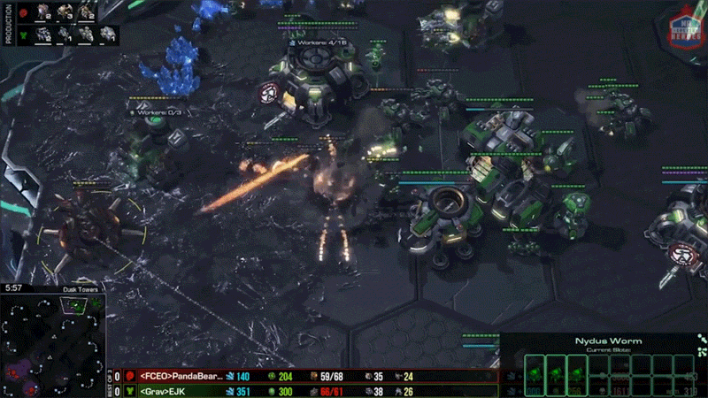
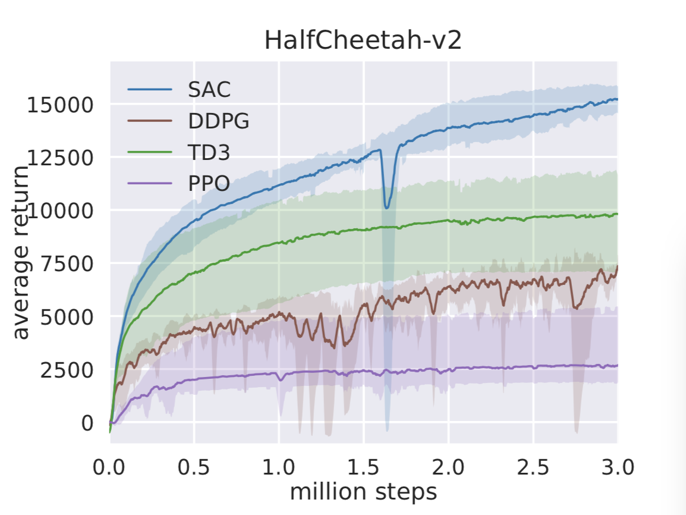

# 6.6 Actor-Critic at the Frontier: Large-Scale Applications

The experiments we ran earlier all lived in teaching environments such as CartPole and LunarLander: tens of state dimensions, a handful of action dimensions, and training finishes in minutes on a CPU. But the real value of the Actor-Critic (AC) architecture is this:

**it scales from these toy tasks to industrial-grade problems.**

In this section, we will look at three milestone large-scale applications of Actor-Critic, spanning three domains: game AI, real-world robotics, and industrial simulation platforms.

| Application        | Organization    | Domain                                 | Scale                                                |
| ------------------ | --------------- | -------------------------------------- | ---------------------------------------------------- |
| AlphaStar          | DeepMind        | StarCraft II                           | Grandmaster level, top 0.2% of human players         |
| SAC on real robots | DeepMind / BAIR | robotic grasping and dexterous control | deployed directly on physical robot arms             |
| NVIDIA Isaac Lab   | NVIDIA          | robot simulation training platform     | GPU-accelerated, supports thousands of parallel envs |

## AlphaStar: Beating StarCraft Grandmasters with Actor-Critic

**StarCraft II** is a **real-time strategy (RTS)** game released by Blizzard Entertainment in 2010. Two players each choose a race: **Terran**, **Protoss**, or **Zerg**. On a shared map, they simultaneously gather resources (minerals and gas), construct buildings, produce armies, and research technologies, with the ultimate goal of destroying the opponent.

Unlike turn-based board games, StarCraft is **real-time**: both sides act simultaneously, there is no "wait for the other player to move" turn structure, and multiple decisions must be made every second: selecting units, moving, attacking, retreating, building, scouting. For professional players, **effective APM** (actions per minute) can reach 300-500.

  <em>A StarCraft II match. The center is the main battlefield view; the lower-left is the minimap (global situation awareness); the lower-right is the resource and unit information panel.</em>

### Why StarCraft Is Harder Than Go

AlphaGo defeated Lee Sedol in 2016, but for AI, StarCraft II is significantly harder than Go. Go is a **perfect-information game**: all information on the board is visible to both players, the state can be represented as a 19x19 grid, and each move picks one of 361 intersections.

StarCraft II, in contrast, is an **imperfect-information game**: the fog of war hides the opponent's actions; the state contains positions, health, and resources for hundreds of units; and actions are compositional: select a unit, select an ability, then specify a target. The resulting action space is on the order of $10^{26}$. A single game lasts roughly 10,000 steps, far longer than Go's ~250 moves.

  <em>AlphaStar: Grandmaster level in StarCraft II using multi-agent reinforcement learning, published in <a href="https://doi.org/10.1038/s41586-019-1724-z" target="_blank" rel="noopener noreferrer">Nature 2019</a>.</em>

In 2019, DeepMind's AlphaStar became the first AI to reach Grandmaster level in StarCraft II, ranking in the top 0.2% of all human players on the official Battle.net ladder. [^vinyals2019]

### AlphaStar's Network Architecture

At its core, AlphaStar is a large-scale Actor-Critic system. The network consumes raw game features (unit lists, minimaps, build queues, resources, and so on), uses a Transformer torso to process a variable-length set of entities, then an LSTM core to accumulate temporal memory, and finally branches into two outputs.

  <em>Figure 1: AlphaStar system architecture. (a) Real-time decision layer: processes game state and outputs a structured action; (b) learning framework: combines supervised learning (imitation of human replays) and reinforcement learning (self-play); (c) population-based training (PBT): maintains a diverse pool of policies. Source: <a href="https://doi.org/10.1038/s41586-019-1724-z" target="_blank" rel="noopener noreferrer">Vinyals et al., 2019, Fig.1</a>.</em>

**Actor (policy network)** outputs a _structured_ action sequence. Because StarCraft actions are not simple "left/right" primitives, the Actor uses an **autoregressive policy head**: it first selects the action type (move, attack, build, ...), then selects the acting unit, then selects the target location. The conditional probabilities chain together to form a complete action.

**Critic (value network)** outputs a scalar $V(s)$ that estimates the probability of winning from the current situation. Conceptually, this is the same Critic we studied in this chapter; only the input grows from a 4D CartPole state to high-dimensional game features, and the parameter count grows from thousands to roughly 200 million.

### Training Algorithm: V-trace Actor-Critic

AlphaStar uses **V-trace**, an off-policy Actor-Critic method. [^espeholt2018]

Recall the basic Actor-Critic update in this chapter:

$$\nabla_\theta J \approx \nabla_\theta \log \pi_\theta(a|s) \cdot \hat{A}(s,a)$$

where the advantage $\hat{A}(s,a)$ can be estimated with the TD error:

$$\hat{A}(s,a) = r + \gamma V(s') - V(s)$$

V-trace's key improvement is handling **off-policy** data. In StarCraft, AlphaStar maintains many agents inside a league, each with different stylistic policies. During training, the current Actor can learn from experiences generated by other agents (i.e., other policies). But these policies induce different data distributions. V-trace corrects this mismatch via **truncated importance sampling**:

$$v_s = V(s) + \sum_{t=s}^{s+n-1} \gamma^{t-s} \left(\prod_{k=s}^{t-1} \gamma c_k\right) \rho_t (r_t + \gamma V(s_{t+1}) - V(s_t))$$

where

$$\rho_t = \min\left(\bar{\rho}, \frac{\pi(a_t|s_t)}{\mu(a_t|s_t)}\right)$$

is the clipped importance ratio and

$$c_k = \min\left(\bar{c}, \frac{\pi(a_k|s_k)}{\mu(a_k|s_k)}\right)$$

is the clipped bootstrapping weight. Intuitively, V-trace allows the Actor to learn from "someone else's" experience, while clipping ensures that data too far from the current policy does not skew learning.

### Multi-Agent League Training

AlphaStar's most distinctive innovation is **league training**. The league maintains three types of agents:

- **Main Agent**: the primary agent, whose objective is to beat all opponents in the league
- **Main Exploiter**: specializes in finding weaknesses in the Main Agent, forcing it to patch holes
- **League Exploiter**: searches for strategic blind spots across the league that no one can handle

  <em>Figure 2: Comparing policy evolution. Top: pure self-play, where the agent gradually collapses from a mixture into a narrow single-style specialization. Bottom: league training with exploiters, where exploiters actively expose weaknesses and force the agent to maintain a more robust and diverse policy distribution. Source: <a href="https://doi.org/10.1038/s41586-019-1724-z" target="_blank" rel="noopener noreferrer">Vinyals et al., 2019</a>.</em>

Each agent is an independent Actor-Critic network. The league maintains on the order of hundreds of distinct policies, and the overall system accumulates hundreds of millions of games. This training setup prevents AlphaStar from overfitting to a single playstyle: its policy must remain robust.

### Training Scale and Key Results

The full training process lasted about **44 days**. During this period, millions of matches were run in parallel, accumulating **hundreds of millions** of self-play games. Each agent network contained roughly **200 million parameters**, and the TPU compute corresponded to around **12,000 years** of gameplay.

  <em>Figure 3: AlphaStar benchmarks and TrueSkill ratings. (a) Win rate of AlphaStar Final against human players across percentiles; (b) TrueSkill ratings against the three races (Terran/Protoss/Zerg); (c) win/loss distributions by race. AlphaStar reaches Grandmaster level across all matchups. Source: <a href="https://doi.org/10.1038/s41586-019-1724-z" target="_blank" rel="noopener noreferrer">Vinyals et al., 2019, Fig.3</a>.</em>

::: tip Mapping AlphaStar to This Chapter's Concepts
Actor = the policy network (autoregressive policy head outputs structured actions), Critic = the value network (outputs win probability $V(s)$), advantage estimate = V-trace TD error, league training = many Actor-Critic instances competing against each other. In short, the whole system is an industrial-scale implementation of the Actor-Critic architecture we learned in this chapter, built for large-scale game AI.
:::

**Paper**: Vinyals, O., et al. (2019). Grandmaster level in StarCraft II using multi-agent reinforcement learning. _Nature_, 575, 350-354. [DOI](https://doi.org/10.1038/s41586-019-1724-z)

**Code**: [google-deepmind/alphastar](https://github.com/google-deepmind/alphastar) -- DeepMind's official AlphaStar training framework (PyTorch + JAX)

**Follow-up**: AlphaStar Unplugged (2023) extends AlphaStar to offline RL and builds an offline RL benchmark for StarCraft II. [^alphastar_unplugged]

## SAC: Bringing Actor-Critic from Simulation to Real Robots

### Why We Need SAC

The A2C method we studied in this chapter performs well on CartPole, but real robots run into two practical issues: insufficient exploration (a deterministic policy can get stuck in local optima) and poor sample efficiency (trial-and-error on real hardware is extremely expensive).

**SAC (Soft Actor-Critic)** was proposed by Tuomas Haarnoja at UC Berkeley's BAIR lab. [^haarnoja2018] Its core idea is to add an **entropy regularization term** to the Actor-Critic objective:

$$J(\pi) = \mathbb{E}_{\pi} \left[ \sum_t \gamma^t \left( r(s_t, a_t) + \alpha \, \mathcal{H}(\pi(\cdot|s_t)) \right) \right]$$

Here $r(s_t, a_t)$ is the environment reward, $\mathcal{H}(\pi(\cdot|s_t)) = -\mathbb{E}_{a \sim \pi}[\log \pi(a|s)]$ is the policy entropy (measuring how "random" the policy is), and $\alpha$ is a temperature parameter that controls the tradeoff between "score high" and "explore more."

SAC not only wants the robot to achieve high reward; it also wants the policy to retain some stochasticity. This stochasticity prevents brittle behavior when the robot encounters unfamiliar situations, which is crucial for sim-to-real transfer.

### SAC's Twin-Critic Architecture

Unlike the A2C we studied, SAC uses two independent Critic networks (twin Q-networks) to estimate the action-value $Q(s,a)$, while the Actor outputs the parameters of a Gaussian distribution.

Taking the minimum of two critics, $\min(Q_1, Q_2)$, helps prevent overestimation of Q-values. Overestimation can make the Actor overly confident and lead to risky actions.

**Actor update**: maximize the entropy-regularized expected return:

$$\nabla_\theta J(\pi_\theta) \approx \nabla_\theta \mathbb{E}_{s} \left[ \mathbb{E}_{a \sim \pi_\theta} \left[ \min_{i=1,2} Q_i(s,a) - \alpha \log \pi_\theta(a|s) \right] \right]$$

**Critic update**: minimize the Bellman error (the target includes an entropy term):

$$\mathcal{L}(Q_i) = \mathbb{E} \left[ \left( Q_i(s,a) - \left( r + \gamma \min_{j=1,2} Q_j(s',a') - \alpha \log \pi(a'|s') \right) \right)^2 \right]$$

### Success Stories on Real Robots

SAC has been deployed directly on physical robots across a range of tasks:

  <em>Figure 4: SAC deployed directly on physical robots for dexterous manipulation. Source: <a href="https://bair.berkeley.edu/blog/2018/12/14/sac/" target="_blank" rel="noopener noreferrer">BAIR Blog, 2018</a>.</em>

| Task                   | Robot        | Key challenge                            | Outcome                                             |
| ---------------------- | ------------ | ---------------------------------------- | --------------------------------------------------- |
| dexterous pen rotation | Shadow Hand  | 24 DoF, extremely precise control        | learns rotation without human demonstrations        |
| robotic grasping       | Sawyer       | 7 DoF, sparse rewards                    | from random policy to 90%+ grasp success rate       |
| quadruped locomotion   | ANYmal       | 12 joints, dynamic balance               | learns multiple gaits, adapts to different terrains |
| turning a door handle  | Franka Emika | contact-force control, fine manipulation | learns adaptive grasping and turning                |

What these tasks share is the workflow: train SAC in simulation, then transfer directly to a physical robot. Entropy regularization encourages the policy to cover enough action variations in simulation, making the resulting policy more robust to noise and uncertainty during sim-to-real transfer.

### SAC Benchmark Comparison

The BAIR blog provides training-curve comparisons between SAC and DDPG, TD3, and PPO on MuJoCo continuous-control tasks. On high-dimensional tasks such as HalfCheetah and Humanoid, SAC (blue) outperforms other methods in final performance, sample efficiency, and worst-case behavior:

  <em>Figure 5: Training curves on HalfCheetah-v2. SAC (blue) is noticeably more sample-efficient than PPO and DDPG, and it is more consistent across random seeds. Source: <a href="https://bair.berkeley.edu/blog/2018/12/14/sac/" target="_blank" rel="noopener noreferrer">BAIR Blog</a>.</em>

  <em>Figure 6: Training curves on Humanoid-v2 (a 17-DoF humanoid). Even in a high-dimensional action space, SAC still converges stably. Source: <a href="https://bair.berkeley.edu/blog/2018/12/14/sac/" target="_blank" rel="noopener noreferrer">BAIR Blog</a>.</em>

::: tip Mapping SAC to This Chapter's Concepts
Actor = a Gaussian policy network (outputs $\mu$ and $\sigma$), Critic = twin Q-networks ($Q_1, Q_2$), advantage estimation = in $Q(s,a) - V(s)$ the $Q$ term is provided by the Critic, entropy regularization = a built-in pressure to keep exploring. SAC is essentially the Actor-Critic we learned in this chapter, plus entropy regularization and a twin-Critic engineering improvement.
:::

**Papers**:

- Haarnoja, T., et al. (2018). Soft Actor-Critic: Off-Policy Maximum Entropy Deep RL with a Stochastic Actor. _ICML_. [arXiv](https://arxiv.org/abs/1801.01290)
- Haarnoja, T., et al. (2018). Soft Actor-Critic Algorithms and Applications. [arXiv](https://arxiv.org/abs/1812.05905)

**Code**: [rail-berkeley/softlearning](https://github.com/rail-berkeley/softlearning) -- the official SAC implementation

**Blog**: [Soft Actor-Critic: Deep RL with Real-World Robots](https://bair.berkeley.edu/blog/2018/12/14/sac/) -- BAIR's official blog post

## NVIDIA Isaac Lab: An Industrial-Grade Actor-Critic Training Platform

### From Single-Machine Demos to Industrial Pipelines

In the previous chapters, our experiments were single-environment, single-policy-network runs on a CPU. Industrial robot training has very different requirements:

| Requirement             | Teaching experiments           | Industrial scale                                            |
| ----------------------- | ------------------------------ | ----------------------------------------------------------- |
| # parallel environments | 1                              | thousands to tens of thousands                              |
| physics simulation      | Gymnasium (simplified physics) | GPU-accelerated rigid/soft-body simulation                  |
| scene diversity         | fixed parameters               | domain randomization (color, lighting, friction, mass, ...) |
| training speed          | minutes                        | hours to days                                               |
| deployment target       | plot learning curves           | real robots                                                 |

NVIDIA Isaac Lab (formerly Isaac Orbit) is designed for exactly these needs. It is an open-source robot learning framework built on Isaac Sim. Its relationship to Actor-Critic is direct: the built-in RL algorithms (PPO, SAC, TD3, and others) are all Actor-Critic variants. In each parallel environment, an **Actor** (policy network) outputs actions while a **Critic** (value network) estimates the value of the current state. A learner then uses rollouts collected in parallel across thousands of environments to batch-update the Actor and the Critic.

In other words, Isaac Lab takes the "one network makes decisions, one network evaluates" architecture from a single-machine CartPole demo to industrial-scale GPU-parallel training. [^mittal2023]

  <em>Figure 7: NVIDIA Isaac Lab simulation environments. A humanoid robot performs terrain navigation tasks in GPU-accelerated Isaac Sim physics, and the platform supports training across thousands of parallel environments. Source: <a href="https://isaac-sim.github.io/IsaacLab/" target="_blank" rel="noopener noreferrer">NVIDIA Isaac Lab</a>.</em>

### Supported Robots and Algorithms

Isaac Lab ships with many built-in robot models, spanning manipulators, quadrupeds, and bipeds:

  <em>Figure 8: Robot manipulation and navigation tasks supported by Isaac Lab. It showcases diverse simulation scenes: arm grasping, quadruped walking, dexterous hand manipulation, and more, across home, industrial, and lab environments. Source: <a href="https://isaac-sim.github.io/IsaacLab/" target="_blank" rel="noopener noreferrer">NVIDIA Isaac Lab</a>.</em>

| Robot              | Type              | Use case                                               |
| ------------------ | ----------------- | ------------------------------------------------------ |
| Franka Emika Panda | 7-DoF manipulator | grasping, assembly, fine manipulation                  |
| ANYmal             | quadruped         | terrain locomotion, search and rescue                  |
| Unitree Go1/H1     | quadruped / biped | dynamic motions, balance                               |
| Shadow Hand        | dexterous hand    | precision manipulation (pen spinning, object handling) |

On the algorithm side, Isaac Lab integrates multiple RL stacks (rl_games, skrl, rlrig, and others) and supports mainstream Actor-Critic algorithms such as PPO, SAC, DDPG, TD3, and A2C.

### Domain Randomization: The Key to Sim-to-Real

There is always a gap between simulation and the real world: imperfect physical parameters, sensor noise, changing lighting. Isaac Lab addresses this via **domain randomization**: in each training episode, it randomizes many parameters.

The core logic is simple: if the policy has already experienced a wide range of "variant" environments during training, it will be less likely to panic when it encounters the real-world discrepancies. OpenAI's 2019 dexterous Rubik's-cube project demonstrated this: policies trained with large-scale domain randomization can transfer from simulation to the real Shadow Hand.

### Training Scale and Speed

| Metric                  | Value                                    |
| ----------------------- | ---------------------------------------- |
| # parallel environments | 2,000-16,000 on a single GPU             |
| physics step rate       | ~100,000 steps/sec (single GPU)          |
| typical training time   | 1-8 hours (depending on task complexity) |
| GPU support             | NVIDIA RTX 3090 / A100 / H100            |

::: tip Mapping Isaac Lab to This Chapter's Concepts
It is an engineering platform that scales the Actor-Critic setup from "single-machine CartPole" to "industrial robot training." The algorithms themselves do not change (PPO and SAC are both AC variants); what changes are training scale, simulation fidelity, and the deployment pipeline. The division of labor in Actor-Critic, "one network makes decisions, one network evaluates," remains effective even when training thousands of environments in parallel on GPUs.
:::

**Code**: [isaac-sim/IsaacLab](https://github.com/isaac-sim/IsaacLab) -- NVIDIA's official open-source project (MIT License)

**Docs**: [Isaac Lab Documentation](https://isaac-sim.github.io/IsaacLab/)

**Paper**: Mittal, M., et al. (2023). Orbit: A Unified Simulation Framework for Interactive Robot Learning Environments. _IEEE RA-L_. [arXiv](https://arxiv.org/abs/2301.04195)

## Comparing the Three Applications

|                     | AlphaStar                                   | SAC on robots                        | Isaac Lab                              |
| ------------------- | ------------------------------------------- | ------------------------------------ | -------------------------------------- |
| **Domain**          | game AI                                     | physical robots                      | simulation training platform           |
| **AC variant**      | V-trace off-policy AC                       | maximum-entropy AC (twin Q-networks) | PPO / SAC / TD3 and others             |
| **Actor output**    | structured action sequence (autoregressive) | Gaussian distribution (mean + std)   | depends on algorithm and task          |
| **Critic output**   | $V(s)$ (win probability)                    | $Q_1(s,a), Q_2(s,a)$ (twin Q)        | $V(s)$ or $Q(s,a)$                     |
| **Training scale**  | hundreds of millions of games, 44 days      | millions of steps, hours             | tens of billions of steps, hours       |
| **Key innovations** | multi-agent league + V-trace                | entropy regularization + twin Critic | GPU parallelism + domain randomization |
| **Outcomes**        | Grandmaster level                           | deployed on real robots              | industrial-grade sim-to-real pipeline  |

What they share is the same core: **the Actor + Critic architecture**. What differs are the details of the training algorithm (V-trace vs entropy-regularized SAC vs standard PPO), the scale of training (single machine vs thousands of GPUs), and the deployment target (games vs real robots). Actor-Critic can scale from CartPole to these industrial applications precisely because the division of labor, "one network decides, one network evaluates," becomes even more valuable as scale grows.

In the next section, let's run an Actor-Critic experiment on Pendulum ourselves: [Hands-on: Pendulum swing-up control](./pendulum).

---

[^vinyals2019]: Vinyals, O., et al. (2019). Grandmaster level in StarCraft II using multi-agent reinforcement learning. _Nature_, 575, 350-354. [DOI](https://doi.org/10.1038/s41586-019-1724-z)

[^espeholt2018]: Espeholt, L., et al. (2018). IMPALA: Scalable Distributed Deep-RL with Importance Weighted Actor-Learner Architectures. _ICML_. [arXiv](https://arxiv.org/abs/1802.01561)

[^haarnoja2018]: Haarnoja, T., et al. (2018). Soft Actor-Critic: Off-Policy Maximum Entropy Deep Reinforcement Learning with a Stochastic Actor. _ICML_. [arXiv](https://arxiv.org/abs/1801.01290)

[^alphastar_unplugged]: AlphaStar Unplugged: Large-Scale Offline Reinforcement Learning. (2023). [arXiv](https://arxiv.org/abs/2308.03526)

[^mittal2023]: Mittal, M., et al. (2023). Orbit: A Unified Simulation Framework for Interactive Robot Learning Environments. _IEEE RA-L_. [arXiv](https://arxiv.org/abs/2301.04195)
