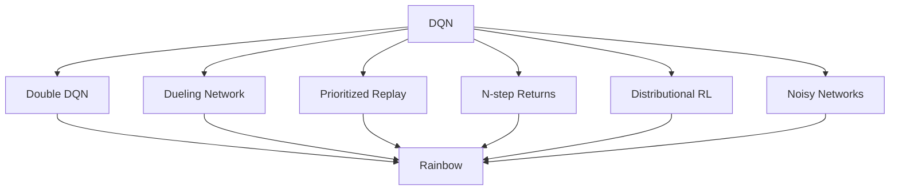

# 4.4 DQN Improvement Family

In the previous section, we trained DQN on `LunarLander-v3` and saw a complete learning curve.

That experiment makes two points clear:

1. replay buffers and target networks do make neural-network Q-Learning trainable
2. even on a low-dimensional control task, curves can be noisy and failures still happen

This is not an accident. Classic DQN combines Q-Learning, neural networks, replay, and target networks, but it still has structural issues:

- the max operator in the TD target tends to select overestimated actions
- outputting $Q(s,a)$ directly can make it harder to exploit state-only information
- uniform sampling wastes updates on uninformative transitions

This section introduces common improvements after DQN. These methods do not change the goal "learn an action-value function". Instead, they modify one of:

- the TD target
- the network structure
- replay sampling
- exploration mechanism

Understanding them helps you diagnose an unstable DQN run: is the issue value overestimation, function structure, data utilization, or exploration?

## Double DQN

Recall the vanilla DQN TD target for a transition $(s,a,r,s',d)$:

$$
y = r + \gamma (1-d)\max_{a'} Q(s',a';\theta^-).
$$

The $\max$ plays two roles at once:

1. select the best next action
2. evaluate that action using the same noisy estimates

If each action-value estimate has noise, the max operator is more likely to pick an action whose estimate has been pushed up by noise. Even if each estimate is unbiased on average, the max of noisy estimates becomes positively biased:

$$
\mathbb{E}\left[\max_a \hat{Q}(s,a)\right]
\ge
\max_a \mathbb{E}\left[\hat{Q}(s,a)\right].
$$

Double DQN separates "selection" from "evaluation".

First, pick the best action using the current (online) network:

$$
a^\ast = \arg\max_{a'} Q(s',a';\theta).
$$

Then evaluate that action using the target network:

$$
y_{\text{Double}}
=
r + \gamma(1-d) Q(s',a^\ast;\theta^-).
$$

In code, this change is small:

```python
with torch.no_grad():
    best_actions = q_net(next_states).argmax(dim=1)
    next_q = target_net(next_states)
    next_q_selected = next_q.gather(1, best_actions[:, None]).squeeze(1)
    target = rewards + gamma * (1 - dones) * next_q_selected
```

Double DQN matters because it reduces a common bias without changing the basic algorithm structure. In practice, many implementations treat Double DQN as the default DQN variant.

## Dueling DQN

Vanilla DQN predicts action values $Q(s,a)$ directly. This is natural when the action set is small, but it does not explicitly separate two questions:

1. is the state $s$ itself good or bad?
2. how do actions differ relative to that state?

Recall the relationship among state value, action value, and advantage:

$$
Q(s,a)=V(s)+A(s,a).
$$

This decomposition is not unique: adding a constant to $V$ and subtracting it from all $A(s,a)$ leaves $Q$ unchanged. Dueling DQN fixes this by forcing the mean advantage to be zero:

$$
Q(s,a)
=
V(s)
+
A(s,a)
-
\frac{1}{|\mathcal{A}|}\sum_{a'\in\mathcal{A}} A(s,a').
$$

Architecturally, the network shares a feature extractor, then splits into two heads:

- a value head producing scalar $V(s)$
- an advantage head producing vector $A(s,a)$

Then it recombines them:

```python
features = backbone(states)
values = value_head(features)          # [B, 1]
advantages = advantage_head(features)  # [B, A]
q_values = values + advantages - advantages.mean(dim=1, keepdim=True)
```

This structure is especially useful when many states have actions with similar outcomes in the short term. For instance, far from the ground in LunarLander, the state (height, speed, angle) already suggests whether the situation is safe or dangerous, even if multiple actions look similar. Dueling can learn that state value earlier.

## Prioritized Experience Replay (PER)

Standard replay samples uniformly from the buffer. If the buffer has $N$ transitions, each has probability $1/N$.

Uniform sampling is simple and breaks correlation, but it ignores the fact that some transitions teach more than others.

A natural signal is the TD error:

$$
\delta_i = y_i - Q(s_i,a_i;\theta).
$$

If $|\delta_i|$ is large, the model is currently wrong on that transition. PER assigns priority:

$$
p_i = |\delta_i| + \epsilon,
$$

where $\epsilon>0$ prevents zero probability. Sampling probability becomes:

$$
P(i)=\frac{p_i^\alpha}{\sum_k p_k^\alpha}.
$$

$\alpha$ controls how strongly we prioritize. $\alpha=0$ reduces back to uniform sampling. $\alpha=1$ makes sampling proportional to priority.

Non-uniform sampling changes the training distribution. PER therefore uses importance sampling weights:

$$
w_i = \left(\frac{1}{N P(i)}\right)^\beta,
$$

often normalized by the maximum weight in the batch for numerical stability. Training uses a weighted loss:

$$
L(\theta)=\mathbb{E}_{i\sim P}\left[w_i\delta_i^2\right].
$$

PER does not change the Bellman target; it changes which experiences receive more update budget.

## N-step returns, Distributional RL, and Noisy Networks

The improvements above focus on value estimation and data usage. Three more commonly combined ideas address reward propagation, value representation, and exploration.

### N-step returns

Vanilla DQN uses a one-step TD target:

$$
y_t = r_t + \gamma \max_a Q(s_{t+1},a;\theta^-).
$$

One-step targets have lower variance but slower reward propagation. With an $n$-step return:

$$
y_t^{(n)}
=
\sum_{k=0}^{n-1}\gamma^k r_{t+k}
+
\gamma^n \max_a Q(s_{t+n},a;\theta^-).
$$

This can speed up learning in sparse/delayed reward tasks, at the cost of higher target variance.

### Distributional RL

Standard DQN learns the expected return $Q(s,a) = \mathbb{E}[Z(s,a)]$. But returns can be stochastic: the same action can lead to different outcomes.

Distributional RL models the distribution of returns $Z(s,a)$ and applies a distributional Bellman equation:

$$
Z(s,a) \overset{D}{=} R + \gamma Z(S',A').
$$

In practice (e.g. C51), the distribution is represented on discrete support points and the network outputs probabilities.

### Noisy Networks

Epsilon-greedy exploration injects random actions, but the randomness is not state-structured. NoisyNet injects noise into network parameters, for example:

$$
W = \mu_W + \sigma_W \odot \epsilon_W.
$$

Because a sampled noise realization affects many states consistently, the exploration can be more coherent than per-step random actions.

## Rainbow

Rainbow combines multiple DQN improvements into a single algorithm, typically including:

- Double DQN
- Dueling network
- Prioritized replay
- N-step returns
- Distributional RL
- Noisy networks



The value of the combination is that different components address different error sources: overestimation, function structure, sample efficiency, reward propagation, uncertainty representation, and exploration. In visual Atari tasks, these issues often co-occur, so combinations can outperform isolated improvements.

But combinations also bring more hyperparameters and more implementation complexity. For learning and debugging, it is still better to understand each component first, then decide whether the full combination is justified.

## Exploration and Intrinsic Rewards

All improvements above assume the agent visits useful states. But if the agent never reaches critical states, no value-estimator can learn from missing data. That is the exploration problem.

Epsilon-greedy is the simplest approach:

- with probability $\epsilon$, take a random action
- otherwise, take the greedy action

It is simple, but blind: it does not know which states are novel or informative.

One idea is to add **intrinsic reward** in addition to extrinsic environment reward:

$$
r_t^{\text{total}}
=
r_t^{\text{extrinsic}}
+
\beta r_t^{\text{intrinsic}}.
$$

In Intrinsic Curiosity Module (ICM), intrinsic reward is based on prediction error. Let $\phi(s)$ be a learned feature representation. A forward model predicts next features $\hat{\phi}(s_{t+1})$ from $\phi(s_t)$ and action $a_t$, and intrinsic reward can be:

$$
r_t^{\text{intrinsic}}
=
\left\|
\phi(s_{t+1})-\hat{\phi}(s_{t+1})
\right\|^2.
$$

Hard-to-predict transitions yield higher intrinsic reward and attract exploration.

Random Network Distillation (RND) is simpler: keep a random fixed target network $f^\ast$ and train a predictor $f_\theta$ to match it. Intrinsic reward is:

$$
r_t^{\text{intrinsic}}
=
\left\|f_\theta(s_t)-f^\ast(s_t)\right\|^2.
$$

Frequently visited states become predictable (low error), while new states remain surprising (high error).

## Section Summary

- DQN's max operator tends to cause overestimation bias; Double DQN reduces this by separating selection and evaluation.
- Dueling DQN decomposes $Q(s,a)$ into $V(s)$ and $A(s,a)$, helping the network learn state quality and action differences more cleanly.
- PER focuses updates on high-TD-error transitions while using importance sampling to reduce bias.
- N-step returns speed up reward propagation; distributional RL models return distributions; NoisyNet provides structured exploration.
- Rainbow combines many of these, often improving Atari performance but increasing complexity.
- Intrinsic reward methods make exploration explicit and can help in sparse-reward settings.

Next, we move from vector states to pixel observations, where representation learning and training conditions become the dominant new challenges:
[Hands-on: Visual game projects](./visual-game-projects).

## References

[^1]: Mnih, V., et al. (2015). Human-level control through deep reinforcement learning. _Nature_, 518(7540), 529-533.

[^2]: van Hasselt, H., Guez, A., & Silver, D. (2016). Deep Reinforcement Learning with Double Q-learning. _AAAI_.

[^3]: Wang, Z., et al. (2016). Dueling Network Architectures for Deep Reinforcement Learning. _ICML_.

[^4]: Schaul, T., et al. (2016). Prioritized Experience Replay. _ICLR_.

[^5]: Hessel, M., et al. (2018). Rainbow: Combining Improvements in Deep Reinforcement Learning. _AAAI_.

[^6]: Pathak, D., et al. (2017). Curiosity-driven Exploration by Self-supervised Prediction. _ICML_.

[^7]: Burda, Y., et al. (2019). Exploration by Random Network Distillation. _ICLR_.
