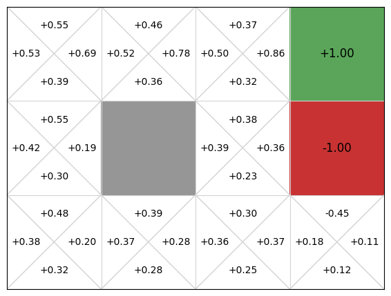
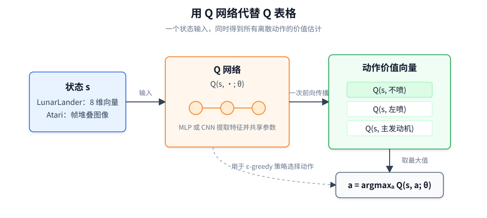
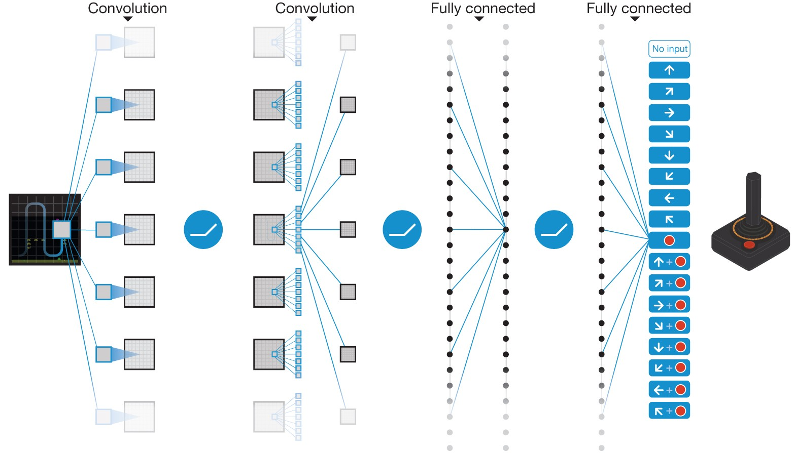
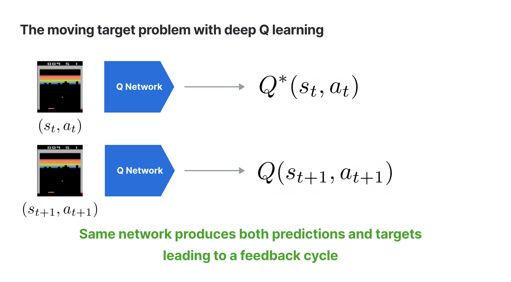

# 5.1 From Q-Learning to DQN

Part I built the full value-learning loop with tables and explicit states. Real tasks have much larger state spaces, so the value function must be approximated by a neural network. Part II starts from this change, moves from Q-Learning to DQN, and then develops policy gradients, Actor-Critic, TRPO, PPO, and continuous control.

**Core ideas**

- Understand why tabular Q-Learning only works for small, enumerable discrete state spaces, and why it breaks for continuous control and pixel-based games.
- Learn how Deep Q-Networks (DQN) approximate $Q(s,a)$ with a neural network, turning a Q-table into a generalizable function.
- See why **experience replay** and the **target network** are not optional engineering tricks, but the key reasons DQN is trainable.
- Through LunarLander and visual game tasks, develop intuition for the stability, exploration, and function-approximation issues that appear once we move beyond low-dimensional state vectors.

**Key formulas**

$$
Q(s,a;\theta)\approx Q^*(s,a)
\quad \text{(Function approximation: replace a Q-table with a neural network)}
$$

$$
y = r+\gamma\max_{a'}Q(s',a';\theta^-)
\quad \text{(DQN TD target: estimate next-step optimal value with a target network)}
$$

$$
\mathcal{L}(\theta)
=
\mathbb{E}_{(s,a,r,s')\sim\mathcal{D}}
\left[
\left(
r+\gamma\max_{a'}Q(s',a';\theta^-)
-Q(s,a;\theta)
\right)^2
\right]
\quad \text{(DQN loss: minimize the squared TD error)}
$$

**What these formulas are doing**

This chapter continues along the **$Q(s,a)$ line** established in the preceding chapters. The first formula states the central substitution: we no longer store one number per state-action pair. Instead, we output action values from a network with parameters $\theta$. The second formula keeps the TD idea from Q-Learning: the immediate reward $r$ plus the discounted return of the best action in the next state. The third formula turns that TD error into an optimization objective a neural network can actually train on, where $\mathcal{D}$ is the replay buffer and $\theta^-$ denotes the target network parameters.

So the chapter is not about changing the RL goal. It is about converting the Chapter 3 action-value estimation idea into a deep learning problem that can handle high-dimensional states.

From the earlier treatment of Q-Learning, we already have its basic intuition:

1. the agent takes action $a$ in state $s$
2. it observes reward $r$ and transitions to $s'$
3. it corrects $Q(s,a)$ using a TD target

In a small GridWorld, this is almost too natural. With a small number of states and actions, we can keep a tiny table, update one cell per step, and watch the values propagate backward from the goal.

The real issue is a hidden assumption: **the state space must be small enough to enumerate, name, and revisit**. LunarLander's state is an 8D continuous vector. Atari states are frames of pixels. Tiny differences in position, velocity, and pixels produce new states. At that point, the problem is no longer "how do I write the TD target", but "should we still keep a separate table entry for each possible state?"

Look at it from another angle: what is truly valuable in Q-Learning is not the table, but the idea of "use current experience to correct long-term value estimates." DQN keeps that idea and replaces the table with a neural network. Similar states can now share parameters and share learning through generalization.

But that substitution does not automatically work. Supervised learning typically has fixed labels. In DQN, the "label" (the TD target) depends on the model's own estimates of the future, and consecutive samples are highly correlated along a trajectory. DQN therefore solves two linked problems:

1. **the table does not scale**
2. **training the network is unstable**

The chapter's main line can be summarized as:

**How do we extend tabular Q-Learning into a deep RL algorithm that can handle continuous state spaces, pixel inputs, and unstable bootstrapped targets?**

We will first locate the boundary of Q-tables, then unpack DQN's three components, then run LunarLander end-to-end, and finally discuss DQN variants (Double, Dueling, PER, Rainbow) and a full project path toward visual games.

## Chapter Map

| Section                                                             | Main question                                                                                              |
| ------------------------------------------------------------------- | ---------------------------------------------------------------------------------------------------------- |
| [Why DQN is needed](./from-q-to-dqn)                                | Why can't the Q-table scale? What changes when we replace it with a network?                               |
| [DQN architecture](./dqn-components)                                | What problems do the Q-network, replay buffer, and target network each solve? How do formulas map to code? |
| [Hands-on: LunarLander](./lunar-lander)                             | How do we train, analyze, and evaluate DQN on a low-dimensional control task?                              |
| [The DQN family](./dqn-family)                                      | What do Double/Dueling/Rainbow-style improvements fix?                                                     |
| [Project: from LunarLander to visual games](./visual-game-projects) | How do we move from vector states to pixel inputs and more complex game settings?                          |

## Learning Objectives

After finishing this chapter, you should be able to:

- explain why tabular Q-Learning is not viable for continuous states and pixel observations
- explain how DQN approximates $Q(s,a)$ with a neural network
- write down the DQN TD target and the MSE TD-error loss
- explain why replay buffers and target networks stabilize training
- trace one full parameter update step: batch sampling → forward pass → target computation → loss → backprop → parameter update
- distinguish training vs evaluation modes (epsilon-greedy exploration vs greedy evaluation)
- recognize the main ideas behind common DQN variants and what failure modes they target

We now start from the limits of tabular methods and derive why DQN is needed.

## Starting from Q-Learning

**Core ideas**

- Review how tabular Q-Learning updates action values using a TD target.
- Understand the hidden assumption behind a Q-table: "states can be enumerated."
- See why DQN represents $Q(s,a)$ with a neural network, and why a naive replacement creates new stability problems.

**Key formulas**

$$
Q(s, a) \leftarrow Q(s, a) + \alpha \left[ r + \gamma \max_{a'} Q(s', a') - Q(s, a) \right]
\quad \text{(Q-Learning update: correct a Q value using one-step experience)}
$$

> **Q-Learning update rule**
>
> - $Q(s,a)$: the old estimate stored in the table for the state-action pair.
> - $r+\gamma\max_{a'}Q(s',a')$: the TD target built from immediate reward plus next-state optimal value.
> - $\alpha$: learning rate controlling how far we move toward the TD target.

$$
\text{TD Target} = r + \gamma \max_{a'} Q(s', a')
\quad \text{(TD target: the "score we should have" according to reward + discounted future value)}
$$

> **TD target**
>
> - $r$: the observed immediate reward.
> - $\gamma\max_{a'}Q(s',a')$: the estimated best discounted return from the next state.

$$
\delta = \text{TD Target} - Q(s, a)
\quad \text{(TD error: the gap between prediction and target, the learning signal)}
$$

> **TD error**
>
> - $\delta>0$: the old estimate is too small, push it up.
> - $\delta<0$: the old estimate is too large, push it down.
> - $\delta=0$: the old estimate matches this target.

## Q-Learning, Revisited (as a Table)

Chapter 3 introduced the action-value function $Q(s,a)$ and tabular Q-Learning. Here we focus on its implementation form: the algorithm stores one value per state-action pair, and updates one entry per step.

The update rule is:

$$
Q(s, a) \leftarrow Q(s, a) + \alpha \left[ r + \gamma \max_{a'} Q(s', a') - Q(s, a) \right].
$$

Read it as: "use one new experience to correct one old number."

First, construct the TD target:

$$
\text{TD Target}=r+\gamma\max_{a'}Q(s',a').
$$

Then subtract the old estimate:

$$
\delta=\text{TD Target}-Q(s,a).
$$

Finally, move $Q(s,a)$ a step of size $\alpha$ toward the target. This is important: we do not overwrite the old estimate completely, because a single transition can be noisy.

At the start, the whole table can be zeros. The agent walks, and each step updates exactly one cell. Over time, values near the goal become accurate earlier; via the $\max_{a'}Q(s',a')$ term, those values propagate backward. In the end, the policy is not hand-written. It emerges from the table: take the action with the largest $Q(s,a)$ at each state.

This works because of an assumption we rarely say out loud:

**the table must be able to hold all state-action pairs.**

In a tiny GridWorld, that's just dozens of numbers. Once the state space is large or continuous, the story changes.

## Where Q-Tables Break

A Q-table is both the memory of Q-Learning and its limit. As long as all states can be listed as a finite set of rows, "look up, update, and take a max" are straightforward. Once states cannot be enumerated, the implementation collapses.

Let's look at discrete states first. A coin flip has 2 states, so the table is tiny. Tic-tac-toe has about $3^9 \approx 20{,}000$ board configurations, still feasible. Chess has about $10^{47}$ legal positions; Go has about $3^{361} \approx 10^{170}$. These numbers are not just big. They are astronomically beyond any storage.

But these are still discrete spaces. In principle, you could "name" every state. The real boundary appears with continuous states.

In LunarLander, the state is an 8D vector: position, velocity, angle, angular velocity, and two leg-contact indicators. The first 6 dimensions are continuous real values. As soon as one dimension can take infinitely many values (say $x\in[-1,1]$), the full state set becomes infinite.

You can force discretization, but it explodes. If you split each of 6 continuous dimensions into 50 bins, you get $50^6 \approx 1.56\times 10^{10}$ states. Multiply by a small action set and you are already at tens of billions of table entries, for a low-dimensional control task.

If you move to Atari, it becomes even more obvious. A state is an image. A single pixel difference is a different state. A table is hopeless.

So we need a different representation.

## Replacing the Table With a Neural Network

The natural replacement is function approximation: use a neural network to represent the action-value function.

Instead of storing $Q(s,a)$ in a table, we train a network $Q(s,a;\theta)$. It takes a state $s$ as input and outputs a vector of Q-values, one per action.

This turns a table of unrelated numbers into a set of shared parameters $\theta$. Similar states no longer have to be learned from scratch: they can share structure through the network.

This idea is older than DQN. What made DQN a turning point is: it made this idea trainable and stable enough to work at scale (notably on Atari).

A DQN receives one state and outputs one $Q$ value for each discrete action. LunarLander maps its 8-dimensional state to 4 action values; an Atari DQN maps a stack of image frames to the actions available in that game.

## Why the Naive Replacement Still Fails

At this point we have solved only the "the table does not fit" problem. A tempting next step is:

Replace every table lookup in Q-Learning with network outputs, and train by gradient descent.

This is the starting point, but not the full answer. Two training issues appear immediately:

1. samples are highly correlated along trajectories
2. the TD target moves because it depends on the network itself

### Correlated samples

In Atari, adjacent frames are extremely similar. If you train on the last 32 steps as a batch, you do not have 32 independent situations. You have one situation with tiny consecutive changes. That makes the gradient direction dominated by the most recent experience segment.

This points to the first stabilization component: do not train only on the most recent steps. Train on random samples drawn from a larger set of past experience.

### Moving targets

Q-Learning uses the TD target:

$$
r+\gamma\max_{a'}Q(s',a').
$$

In a table, updating $Q(s,a)$ changes one entry; it does not directly change the values used for $Q(s',a')$ elsewhere. In a neural network, all Q-values come from the same parameters $\theta$. A gradient update that changes $Q(s,a;\theta)$ can also change $Q(s',a';\theta)$. The target depends on the network, so the network is chasing a target that moves as it learns.

Here is a minimal example. Suppose there are 2 states and 2 actions, $\gamma=0.99$, and the current network outputs:

$$
Q_\theta:\quad
Q(s_1, a_1)=2.0,\;
Q(s_1, a_2)=5.0,\;
Q(s_2, a_1)=3.0,\;
Q(s_2, a_2)=8.0
$$

Now we observe transition $(s_1,a_2,r=+1,s_2)$. The TD target is:

$$
\text{TD Target} = 1 + 0.99 \times 8.0 = 8.92
$$

So the update pushes $Q_\theta(s_1,a_2)$ toward 8.92. After a parameter update, other values may also change:

$$
Q_{\theta'}:\quad
Q(s_1, a_1)=2.3,\;
Q(s_1, a_2)=6.5,\;
Q(s_2, a_1)=2.7,\;
Q(s_2, a_2)={\color{red}6.3}
$$

Notice $Q(s_2,a_2)$: it dropped from 8.0 to 6.3. Next time we compute a target from $s_2$, the "label" has shifted. This feedback loop can cause oscillation or divergence.

So the naive neural-network Q-Learning inherits at least two instability sources:

- correlated training data along trajectories
- bootstrapped targets that move with the network

This is why DQN is not "just replace table with a network". DQN organizes the idea into three components:

1. **Q-network**: represents $Q(s,a;\theta)$
2. **experience replay**: breaks sample correlation and improves data reuse
3. **target network**: slows down target drift by using a delayed copy for the TD target

In other words: this section explains why we need DQN. Next section explains how DQN actually builds these components into a trainable algorithm.

Next: [DQN architecture: Q-network, replay buffer, target network](./dqn-components).
