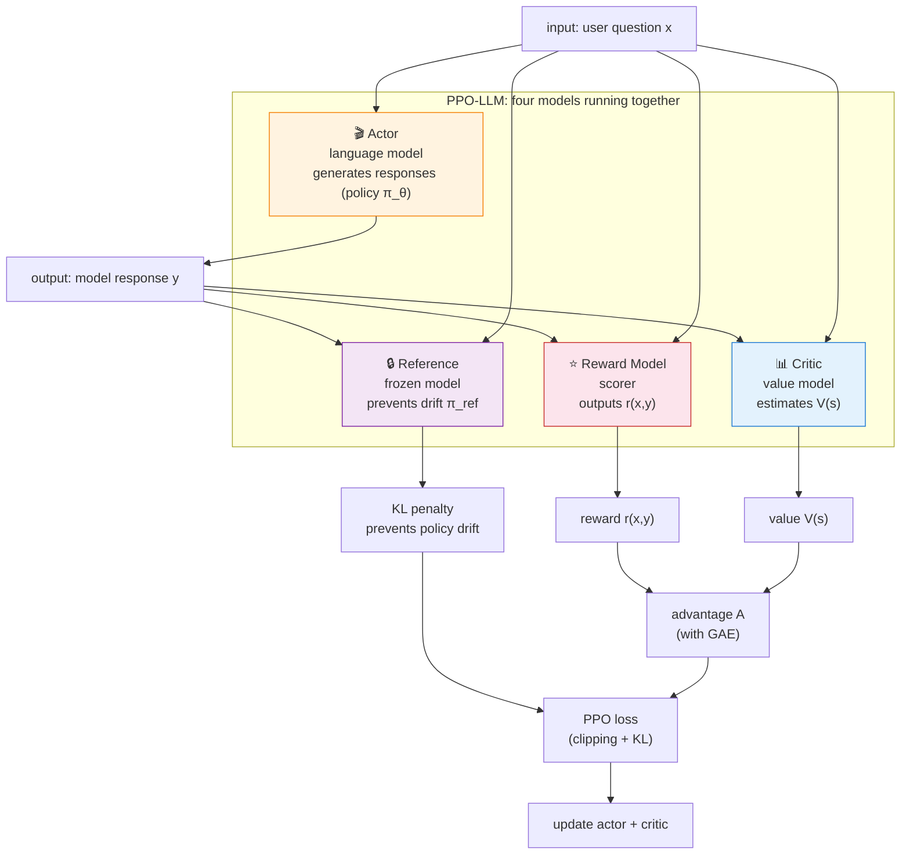

# 7.4 Advantage Estimation and Reward Modeling

## Section Overview

**Core content**

- Two ends of advantage estimation: TD uses one-step information (low variance, biased); MC uses the full trajectory (unbiased, high variance)
- GAE: a parameter $\lambda$ that interpolates between TD and MC via exponential weighting
- Reward Model: turns pairwise human preferences into a scalar reward via the Bradley-Terry model
- Two new challenges in LLM alignment: sparse reward (one score for 500 generated tokens) and four models running at once

In the previous section we dissected PPO's clipping trick — replacing an explicit KL constraint with a clipped surrogate objective (review: [Constraint Mechanisms for Policy Updates](./trust-region-clipping)). But there is still one input in $r_t(\theta) \cdot A_t$ we have not unpacked: **how is the advantage $A_t$ computed?** That is what GAE is for. And in LLM alignment, the environment no longer hands us a reward — **where does the reward come from?** That is the Reward Model's job.

To make both questions concrete, this section uses one running example: a 5-step episode where only the last step earns reward $1$, all others earn $0$. Think of it as a miniature of an LLM generating 5 tokens and being scored only at the final token:

| step $t$ | immediate reward $r_t$ | critic estimate $V(s_t)$ | terminal? |
| -------- | ---------------------- | ------------------------ | --------- |
| 0        | 0                      | 0.1                      | no        |
| 1        | 0                      | 0.2                      | no        |
| 2        | 0                      | 0.3                      | no        |
| 3        | 0                      | 0.5                      | no        |
| 4        | 1                      | 0.8                      | yes       |

The next three sections all consume this table: first TD and MC each compute advantages on it, then GAE interpolates between them, and finally we return to the LLM setting and see why sparse reward makes this harder.

::: tip Prerequisites

- [Advantage function $A(s,a) = Q - V$](../chapter09_actor_critic/advantage-function): what we are trying to estimate
- [TD error $\delta = r + \gamma V(s') - V(s)$](../chapter09_actor_critic/critic-training): the building block behind GAE
- [DP vs MC vs TD](../chapter03_mdp/dp-mc-td): GAE is an interpolation between TD and MC
- [Reward design](../chapter03_mdp/reward-design): RM thinking is close in spirit to reward shaping
  :::

## Advantage Estimation: TD vs MC

Recall the definition (review: [Section 6.1](../chapter09_actor_critic/advantage-function)):

$$A(s_t, a_t) = Q(s_t, a_t) - V(s_t)$$

It measures how much better action $a_t$ is at state $s_t$ compared to the policy's average behavior. The difficulty is that $Q(s_t, a_t)$ is unknown — we cannot read the future, only estimate it.

Chapter 3 already compared the two classical estimators (review: [DP/MC/TD](../chapter03_mdp/dp-mc-td)). Here we compute both on the 5-step episode and look at the gap.

### TD estimator: one-step signal

The TD estimator (review: [critic training](../chapter09_actor_critic/critic-training)) uses one-step reward plus the critic's estimate at the next state:

$$A_t^{\text{TD}} = r_t + \gamma V(s_{t+1}) - V(s_t) = \delta_t$$

Set $\gamma = 1$ and substitute the table row by row:

| $t$ | $r_t + V(s_{t+1}) - V(s_t)$ | $\delta_t$ |
| --- | --------------------------- | ---------- |
| 0   | $0 + 0.2 - 0.1$             | $0.1$      |
| 1   | $0 + 0.3 - 0.2$             | $0.1$      |
| 2   | $0 + 0.5 - 0.3$             | $0.2$      |
| 3   | $0 + 0.8 - 0.5$             | $0.3$      |
| 4   | $1 + 0 - 0.8$               | $0.2$      |

At the last step $V(s_5) = 0$ (episode ended). The TD advantage is exactly this $\delta_t$ column. Its variance is low — only one step of randomness is involved — but it is biased: if the critic's $V$ is inaccurate, the error flows directly into $\delta_t$ through $\gamma V(s_{t+1})$.

### MC estimator: full-trajectory return

The MC estimator (review: [MC methods](../chapter03_mdp/dp-mc-td)) waits until the episode ends, then subtracts $V(s_t)$ from the full return starting at $t$:

$$A_t^{\text{MC}} = G_t - V(s_t), \qquad G_t = \sum_{k=0}^{\infty} \gamma^k r_{t+k}$$

Accumulate $G_t$ from the end first ($\gamma = 1$):

| $t$ | subsequent rewards  | $G_t$ |
| --- | ------------------- | ----- |
| 4   | $r_4 = 1$           | $1.0$ |
| 3   | $r_3 + G_4 = 0 + 1$ | $1.0$ |
| 2   | $r_2 + G_3 = 0 + 1$ | $1.0$ |
| 1   | $r_1 + G_2 = 0 + 1$ | $1.0$ |
| 0   | $r_0 + G_1 = 0 + 1$ | $1.0$ |

Then subtract $V(s_t)$:

| $t$ | $G_t$ | $V(s_t)$ | $A_t^{\text{MC}} = G_t - V(s_t)$ |
| --- | ----- | -------- | -------------------------------- |
| 0   | $1.0$ | $0.1$    | $0.9$                            |
| 1   | $1.0$ | $0.2$    | $0.8$                            |
| 2   | $1.0$ | $0.3$    | $0.7$                            |
| 3   | $1.0$ | $0.5$    | $0.5$                            |
| 4   | $1.0$ | $0.8$    | $0.2$                            |

MC does not depend on the critic — with enough samples, the estimate is unbiased in expectation. But $G_t$ contains all randomness from $t$ to the end, so its variance is large; and we must wait until the episode ends, which in LLM settings can mean thousands of steps.

Side by side, the gap is clear:

| $t$ | $A_t^{\text{TD}}$ | $A_t^{\text{MC}}$ |
| --- | ----------------- | ----------------- |
| 0   | $0.1$             | $0.9$             |
| 1   | $0.1$             | $0.8$             |
| 2   | $0.2$             | $0.7$             |
| 3   | $0.3$             | $0.5$             |
| 4   | $0.2$             | $0.2$             |

Same 5-step episode, yet TD assigns only $0.1$ of advantage to early steps while MC assigns $0.9$ — **the credit for the final reward gets crushed in the TD view**, because the critic has not yet propagated that future reward backward. MC pushes the final reward all the way back to every step, at the cost of high variance and a long wait.

## GAE: A Controlled Bias-Variance Tradeoff

GAE (Schulman et al., 2016) introduces a parameter $\lambda \in [0,1]$ that interpolates between TD and MC via exponential weighting:

$$\hat{A}_t^{\text{GAE}(\gamma, \lambda)} = \sum_{k=0}^{\infty} (\gamma \lambda)^k \delta_{t+k}$$

where $\delta_t = r_t + \gamma V(s_{t+1}) - V(s_t)$ is the TD error. Three limiting cases:

- $\lambda = 0$: $\hat{A}_t = \delta_t$, reduces to one-step TD
- $\lambda = 1$: $\hat{A}_t = \sum_{k=0}^{\infty} \gamma^k \delta_{t+k} = G_t - V(s_t)$, reduces to MC
- $0 < \lambda < 1$: later $\delta_{t+k}$ are down-weighted by $(\gamma\lambda)^k$

### Computing it via the recursion

In practice we compute GAE backward (because $\hat{A}_t$ depends on $\hat{A}_{t+1}$):

$$\hat{A}_t = \delta_t + \gamma\lambda \cdot \hat{A}_{t+1}$$

Substitute the 5-step episode, $\gamma = 1$:

| $t$ | $\delta_t$ | $\gamma\lambda \cdot \hat{A}_{t+1}$ | $\hat{A}_t$ |
| --- | ---------- | ----------------------------------- | ----------- |
| 4   | $0.2$      | $0$ (terminal)                      |             |
| 3   | $0.3$      | $\lambda \cdot 0.2$                 |             |
| 2   | $0.2$      | $\lambda \cdot \hat{A}_3$           |             |
| 1   | $0.1$      | $\lambda \cdot \hat{A}_2$           |             |
| 0   | $0.1$      | $\lambda \cdot \hat{A}_1$           |             |

Concrete numbers depend on $\lambda$. Here are four representative values ($\gamma=1$):

| $t$ | $\delta_t$ | $\lambda=0$ | $\lambda=0.5$ | $\lambda=0.95$ | $\lambda=1$ |
| --- | ---------- | ----------- | ------------- | -------------- | ----------- |
| 4   | $0.2$      | $0.20$      | $0.20$        | $0.20$         | $0.20$      |
| 3   | $0.3$      | $0.30$      | $0.40$        | $0.49$         | $0.50$      |
| 2   | $0.2$      | $0.20$      | $0.40$        | $0.67$         | $0.70$      |
| 1   | $0.1$      | $0.10$      | $0.30$        | $0.73$         | $0.80$      |
| 0   | $0.1$      | $0.10$      | $0.25$        | $0.80$         | $0.90$      |

This table ties the whole section together:

- The $\lambda=0$ column is the TD estimator (left column of the earlier comparison)
- The $\lambda=1$ column is the MC estimator (right column of the earlier comparison)
- $\lambda=0.95$ sits between: near MC close to the end, increasingly suppressed toward the start by the exponential decay

As $\lambda$ grows, the advantage at early steps climbs from $0.1$ toward $0.9$ — **credit propagates from the final step back to every step**, at the cost of rising variance (more distant $\delta$ randomness is included). The PPO default is typically $\lambda = 0.95$, leaning toward MC: a small bias in exchange for a substantial variance reduction.

| $\lambda$ | Roughly equals | Bias   | Variance   | When it tends to work               |
| --------- | -------------- | ------ | ---------- | ----------------------------------- |
| 0.0       | pure TD        | high   | low        | critic is weak, reward is noisy     |
| 0.9       | TD-leaning     | medium | medium-low | general-purpose                     |
| 0.95      | balanced       | lower  | medium     | **common PPO default**              |
| 0.99      | MC-leaning     | low    | higher     | critic is accurate, fine evaluation |
| 1.0       | pure MC        | lowest | high       | short episodes, plenty of data      |

```python
# ==========================================
# A minimal GAE implementation (from scratch)
# ==========================================
import numpy as np

def compute_gae(rewards, values, dones, gamma=0.99, lam=0.95):
    """
    Compute GAE advantages.

    Args:
        rewards: list/array of r_t
        values: list/array of V(s_t)
        dones: list/array of episode termination flags (1 if done else 0)
        gamma: discount factor
        lam: GAE lambda

    Returns:
        advantages: A_hat_t
        returns: targets for critic training, i.e., advantages + values
    """
    advantages = []
    gae = 0.0

    for t in reversed(range(len(rewards))):
        next_value = 0.0 if (t == len(rewards) - 1) else values[t + 1]
        nonterminal = 1.0 - float(dones[t])

        delta = rewards[t] + gamma * next_value * nonterminal - values[t]
        gae = delta + gamma * lam * nonterminal * gae
        advantages.insert(0, gae)

    advantages = np.array(advantages, dtype=np.float32)
    returns = advantages + np.array(values[: len(rewards)], dtype=np.float32)
    return advantages, returns

# The 5-step episode from the running example
rewards = [0.0, 0.0, 0.0, 0.0, 1.0]
values  = [0.1, 0.2, 0.3, 0.5, 0.8]
dones   = [0,   0,   0,   0,   1  ]

advantages, returns = compute_gae(rewards, values, dones)
print("advantages:", advantages)
print("returns:", returns)
```

## Reward Models

Classic RL environments (CartPole, LunarLander) hand us the reward directly through environment rules — upright gives positive reward, crash gives negative. LLM alignment has no such source: there is no objective answer to "how many points is this poem worth." The Reward Model (RM) is what turns human judgment into a scalar reward.

### Subjective alignment vs objective reasoning

LLM alignment has two tracks:

- **Subjective alignment** (politeness, safety, helpfulness): no objective ground truth, requires a reward model trained from human preferences
- **Objective reasoning** (math, code): verifiable by rules, can use rule-based rewards directly (covered in [Chapter 9: RLVR](../chapter18_grpo/rlvr))

This chapter focuses on subjective alignment — the classic PPO-for-LLM use case.

### Bradley-Terry model

Humans struggle to assign absolute scores ("I'd give this 87 points") but easily make comparisons ("A is better than B"). The **Bradley-Terry model** turns pairwise comparisons into absolute scores:

$$P(y_w > y_l \mid x) = \sigma(r(x, y_w) - r(x, y_l))$$

where $r(x, y)$ is the RM's score for response $y$ to prompt $x$, and $\sigma$ is the sigmoid. The larger the score gap, the closer the probability that the higher-scored response wins.

### A minimal training sketch

```python
# ==========================================
# Reward model training sketch (simplified)
# ==========================================
def reward_model_loss(rm, prompt, chosen, rejected):
    """
    rm: reward model, maps (prompt, response) -> scalar score
    """
    r_chosen = rm(prompt, chosen)
    r_rejected = rm(prompt, rejected)
    loss = -torch.log(torch.sigmoid(r_chosen - r_rejected))
    return loss.mean()
```

### Three practical pain points

Training a good RM is one of the heaviest parts of RLHF:

1. **Labeling cost**: you need thousands of preference comparisons, each requiring trained annotators. OpenAI hired roughly 40 annotators and labeled tens of thousands of preferences for InstructGPT.

2. **Reward hacking**: the RM often learns "what looks like a good answer" rather than "what is a good answer." The policy may learn to pad responses (the RM favors length), stack jargon (sounds more authoritative), or use formatting to mask hollow content. Reward climbs steadily while human evaluators see quality drop.

3. **Distribution shift**: the RM is trained on responses from an earlier policy. After RL updates, the policy's response distribution drifts, and RM scores on these "new" responses become unreliable — the judge's training set no longer matches deployment.

## Sparse Reward and Credit Assignment

An LLM response can be 500 tokens long — from an RL viewpoint, a 500-step sequential decision process. The RM typically produces a single scalar reward at the very end. This is the extreme sparse-reward case:

500 actions, 1 reward signal.

The 5-step running example is exactly this structure in miniature: reward appears only at $t=4$, the first four steps all earn $0$. **Of those four early steps, which ones actually contributed to the final score of 1?** This is the **credit assignment** problem.

Look back at the GAE comparison table with four $\lambda$ values. At $\lambda=0$ (pure TD), early-step advantages are just $\delta_t$ — barely connected to the final reward. At $\lambda=0.95$, the advantage at $t=0$ climbs to $0.80$ — the final reward has been propagated all the way back to the start. **GAE is PPO's credit-assignment tool**: $\lambda$ controls how much of the final reward is distributed back to earlier tokens.

Formally, PPO's token-level policy gradient is

$$\nabla_\theta L \propto A_t \cdot \nabla_\theta \log \pi_\theta(a_t \mid s_t)$$

Each token's log probability is scaled by its advantage $A_t$ — tokens with high advantage are reinforced, tokens with low advantage are weakened. With a KL penalty against a reference model (to prevent drifting too far), PPO completes a relatively stable token-level credit assignment.

## The Full PPO-for-LLM Picture

When PPO is used for LLM alignment, you typically run four models together — an engineering headache and a major resource sink:



Each model's role:

| Model        | Role                                    | Size            | Memory  |
| ------------ | --------------------------------------- | --------------- | ------- |
| Actor        | language model being trained            | 7B-70B          | largest |
| Critic       | value network, estimates response value | same as Actor   | large   |
| Reference    | frozen baseline for KL penalty          | same as Actor   | large   |
| Reward Model | scorer trained from preferences         | usually smaller | medium  |

Four models in memory at once — that is the engineering weight of RLHF. A 7B model needs at least 4×A100 (80GB); a 70B model may need 16-32×A100. And that is before counting the earlier SFT and RM training stages.

PPO's core machinery is identical in games and in LLM alignment — clipping, GAE, importance sampling. But the LLM setting introduces three extra challenges:

1. **A trained RM is required** — games have a built-in reward function, LLMs do not
2. **Sparse reward** — 500 steps of generation, one reward signal
3. **Massive resource use** — four large models running at once

The RM is the biggest engineering bottleneck: heavy labeling, vulnerable to hacking, and stale after every policy update. A natural question follows: **can we skip the RM entirely?**

<details>
<summary>Thought experiment: what happens if the RM is trained "too well" — perfectly separating winners from losers on the training set?</summary>

A perfect training-set RM is likely **overfit**. An overfit RM memorizes surface features of the training data ("any response containing 'glad to help' is good") instead of learning the underlying preference pattern.

Two problems follow:

1. **Reward hacking**: the policy quickly discovers the RM's "preference patterns" (e.g., "longer responses score higher") and optimizes for those patterns instead of genuine quality. You see reward climb while human evaluators rate the responses as worse.

2. **Poor generalization**: once the policy updates and produces out-of-distribution responses, the overfit RM may score them essentially at random — it has never seen this kind of response before.

This is why RM training must carefully control capacity and regularization — better a slightly "dull" RM than one that is "too clever."

</details>

**The RM is the heaviest burden in PPO-for-LLM alignment — heavy to label, heavy to host, and risky to trust. Can we skip it?** The next chapter gives DPO's answer: [Chapter 9: DPO — Bypassing the Reward Model](../chapter17_dpo/intro).
