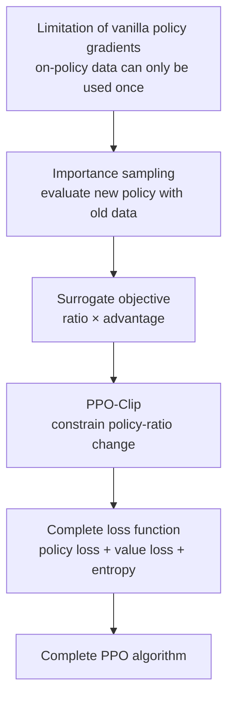
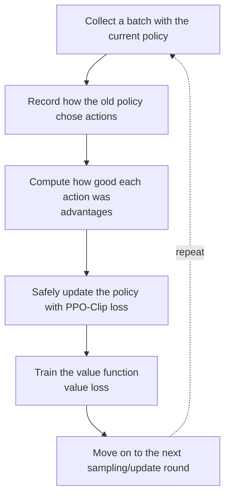
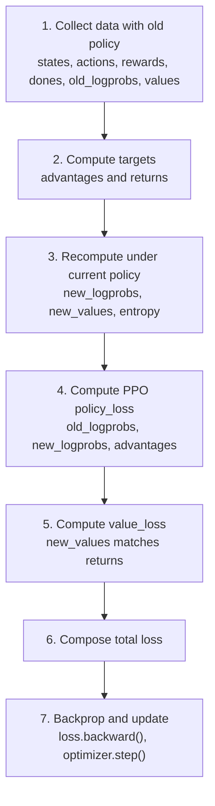
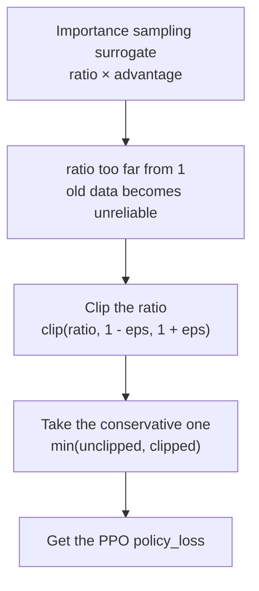
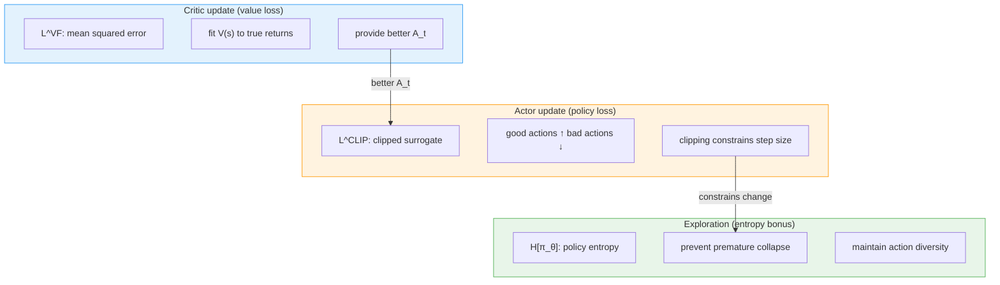
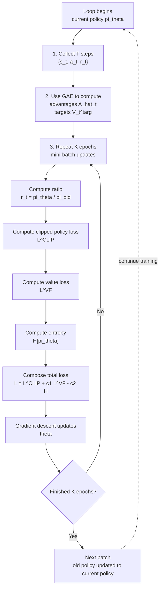
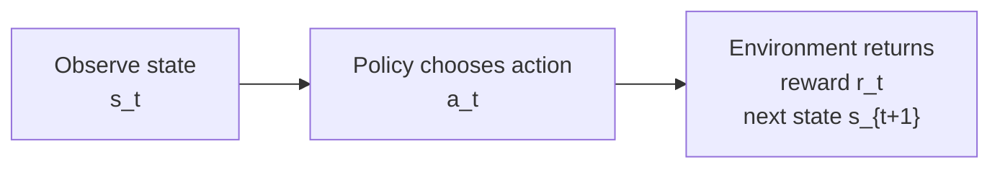

# 7.2 PPO Mathematical Derivation

In the previous section, we trained LunarLander with SB3's PPO and looked at curves such as reward, entropy, and clip fraction. Now we should answer a more basic question:

**What exactly is PPO, and why does it eventually become a single loss function?**

::: tip Prerequisites
This section starts directly from PPO's derivation starting point. The following concepts are assumed (for a review, see the [Appendix](#appendix-deriving-policy-gradients-and-advantage-from-scratch)):

- **Policy gradient theorem**: $\nabla_\theta J(\theta) = \mathbb{E}_t[\nabla_\theta \log \pi_\theta(a_t\mid s_t)\hat{A}_t]$
- **Advantage function $A_t$**: measures how much better an action is than average; baseline provided by the Critic
- **Actor-Critic framework**: Actor chooses actions, Critic estimates state values
- **On-policy constraint**: vanilla policy gradients require data from the current policy; each batch can only be used once
  :::

PPO stands for **Proximal Policy Optimization**. The name is worth unpacking:

- **Policy**: the model that chooses actions.
- **Optimization**: training, i.e., improving that policy.
- **Proximal**: "nearby" updates; the new policy should not move too far from the old one.

So here is the headline conclusion:

**PPO is not a policy, and it is not merely a loss. PPO is a method for training a policy network.**

In reinforcement learning, the **policy** is the object we truly train. It is usually written as:

$$
\pi_\theta(a \mid s)
$$

This means: "under state $s$, the policy network parameterized by $\theta$ assigns probability to action $a$." In code, this policy is typically the **Actor network**. For example, the Actor takes a game frame or a robot state as input, and outputs a probability distribution over actions.

**What PPO provides is a recipe for training this Actor.** It does not hard-code actions, and it does not replace the policy network. Instead, it specifies an update rule: use the current Actor to collect a batch of experience, then adjust the Actor using that batch, while preventing each update from being too aggressive.

It helps to separate three closely-related concepts:

| Name         | What It Is                                                                         | Roughly What It Corresponds To In Code     |
| ------------ | ---------------------------------------------------------------------------------- | ------------------------------------------ |
| **Policy**   | the object being trained; chooses actions given states                             | `actor` / `model` output `action_probs`    |
| **PPO**      | the training method: sampling, advantage estimation, constrained updates, backprop | the full training loop                     |
| **PPO loss** | a differentiable objective used to update network parameters in PPO                | `policy_loss + value_loss - entropy_bonus` |

Why will we keep talking about a **loss**? Because neural networks cannot directly interpret the instruction "make the policy more stable; do not change too fast." An optimizer understands a very specific interface: give it a scalar loss, it computes gradients via `loss.backward()`, then updates parameters via `optimizer.step()`.

So **PPO's ideas must eventually become a loss** in order to update the Actor and Critic.

Put differently: **PPO is a method, the policy is the model being trained, and the loss is the training signal that makes the method real in code.** We derive the PPO loss not because PPO is only a loss, but because the loss is the point at which PPO touches neural-network parameters.

## PPO Code Skeleton

To keep the formulas grounded, we first show what PPO "looks like in code." The code below is not an engineering-optimized implementation. It is a learning-oriented **minimal PyTorch PPO skeleton**: policy network, sampling, advantage estimation, PPO-Clip loss, value-function loss, entropy bonus, and multiple epochs of updates.

Every time we derive a new formula, we will come back to a corresponding part of this code. The highlighted lines are the ones we will repeatedly unpack. You do not need to fully understand every line now; just remember the big picture:

**PPO ultimately links "collect experience, estimate advantages, constrain policy changes, backpropagate updates" into a single training loop.**

<PpoCodeFocus focus="overview" />

You can roughly split the code into six parts:

| Tag     | Code Block         | What We Will Explain Later                                                 |
| ------- | ------------------ | -------------------------------------------------------------------------- |
| **[A]** | `forward`          | what the policy $\pi_\theta(a\mid s)$ and value function $V_\theta(s)$ are |
| **[B]** | `act` / `evaluate` | why we construct `dist`, and why we store `log_prob`                       |
| **[C]** | `collect_rollout`  | what on-policy data is, and why we record the old policy probabilities     |
| **[D]** | `compute_gae`      | how returns, value functions, and advantages relate                        |
| **[E]** | `ppo_update`       | PPO-Clip's `ratio`, `clamp`, `min`, and the total loss                     |
| **[F]** | training loop      | why we update multiple epochs on the same batch                            |

When key variables appear later, we will repeatedly refer back to this mapping table:

| Symbol                       | Meaning                                                                      | Typical Code Variable                    |
| ---------------------------- | ---------------------------------------------------------------------------- | ---------------------------------------- |
| $s_t$                        | state at time $t$                                                            | `states`                                 |
| $a_t$                        | action taken at time $t$                                                     | `actions`                                |
| $r_t$                        | reward at time $t$                                                           | `rewards`                                |
| $G_t$                        | discounted return starting from time $t$                                     | `returns`                                |
| $V_\theta(s)$                | Critic's estimate of future return from state $s$                            | `value` / `new_values`                   |
| $A_t$ or $\hat{A}_t$         | advantage estimate: how much better this action is than the state's baseline | `advantages`                             |
| $\pi_{\text{old}}(a \mid s)$ | the old policy that collected this batch                                     | stored `old_logprobs`                    |
| $r_t(\theta)$                | ratio $\pi_\theta / \pi_{\text{old}}$                                        | `ratio = exp(new_logprobs-old_logprobs)` |
| $\varepsilon$                | PPO clipping range, often `0.1` or `0.2`                                     | `clip_eps` / `clip_range`                |
| $H[\pi_\theta]$              | policy entropy (how random the action distribution is)                       | `entropy`                                |

This section's derivation path:



Once we walk through these steps, the final PPO formula will not seem to come out of thin air:

$$
L^{\text{CLIP}}(\theta)
= \mathbb{E}_t\left[
\min\left(
r_t(\theta)\hat{A}_t,\;
\text{clip}(r_t(\theta),1-\varepsilon,1+\varepsilon)\hat{A}_t
\right)
\right]
$$

## Starting Point: The Limits of Vanilla Policy Gradients

Actor-Critic policy gradients give us a seemingly complete training pipeline: sample with the current policy → compute advantages → update the policy using $\log \pi_\theta(a_t\mid s_t)\hat{A}_t$ (if any of these concepts are unfamiliar, see the [Appendix](#appendix-deriving-policy-gradients-and-advantage-from-scratch)).


The problem is that this pipeline has a hard requirement: **the data used to update the policy should ideally be collected by that same policy.** This property is called **on-policy**. In the formula, the expectation is $\mathbb{E}_{\tau\sim\pi_\theta}[\cdots]$, meaning the data should come from the **current policy** $\pi_\theta$. But after one gradient update, parameters change from $\theta_{\text{old}}$ to $\theta$. The trajectories we just collected no longer come from the new policy; they come from the **old policy** $\pi_{\text{old}}$.

If we use each batch only once, training becomes extremely wasteful. Collecting 2048 steps of environment interaction is expensive, especially in robotics, game simulators, and LLM answer generation. Naturally, we ask:

> Can we reuse data collected by the old policy to update the new policy for multiple epochs?

This is PPO's core tension:

**We want to reuse old data to improve sample efficiency, but we must not let the new policy drift too far from the old one, otherwise old data will mislead the update.**

In the learning-oriented PPO skeleton, `collect_rollout` deliberately stores the log probability at sampling time:

<PpoCodeFocus focus="oldLogprobs" />

This `old_logprobs` is $\log \pi_{\text{old}}(a_t\mid s_t)$. During updates, we recompute the same state-action pairs under the new policy to get `new_logprobs`. Comparing them tells us how far the policy has moved. Importance sampling is the tool that answers whether "old data can still be used."

## Step 1: Importance Sampling

The previous issue is that vanilla policy gradients want data collected by $\pi_\theta$. Can we use data collected by $\pi_{\text{old}}$ to evaluate and improve a new policy? Yes, via **importance sampling**.

### 1.1 The Importance Sampling Identity

The core identity is: for any function $f$,

$$\mathbb{E}_{a \sim \pi_\theta} [f(a)] = \mathbb{E}_{a \sim \pi_{\text{old}}} \left[ \frac{\pi_\theta(a|s)}{\pi_{\text{old}}(a|s)} \cdot f(a) \right]$$

Why is this true? Expand the left side:

$$\mathbb{E}_{a \sim \pi_\theta} [f(a)] = \sum_a \pi_\theta(a|s) \cdot f(a)$$

Rewrite $\pi_\theta(a|s)$ as $\pi_{\text{old}}(a|s)\cdot \frac{\pi_\theta(a|s)}{\pi_{\text{old}}(a|s)}$:

$$= \sum_a \pi_{\text{old}}(a|s) \cdot \frac{\pi_\theta(a|s)}{\pi_{\text{old}}(a|s)} \cdot f(a) = \mathbb{E}_{a \sim \pi_{\text{old}}} \left[ \frac{\pi_\theta(a|s)}{\pi_{\text{old}}(a|s)} \cdot f(a) \right]$$

The identity holds. The **intuition** is: we want the expectation of $f$ under the "new world" $\pi_\theta$, but we only have samples from the "old world" $\pi_{\text{old}}$. The fix is to **reweight each sample**. If the new world is more likely to produce this action than the old world, the weight is greater than 1; otherwise it is less than 1. The weight is exactly $\frac{\pi_\theta}{\pi_{\text{old}}}$.

### 1.2 Policy Ratio

Define the **policy ratio**:

$$r_t(\theta) = \frac{\pi_\theta(a_t | s_t)}{\pi_{\text{old}}(a_t | s_t)}$$

In code, we compute it using the exponential of the log-prob difference, which is numerically more stable than direct division:

<PpoCodeFocus focus="ratio" />

**$r_t=1$ means the new and old policies assign the same probability to this action**. $r_t>1$ means the new policy is more inclined to take this action; $r_t<1$ means the opposite.

### 1.3 Surrogate Objective

Apply importance sampling to the policy-gradient objective to get the **surrogate objective**:

$$L^{\text{IS}}(\theta) = \mathbb{E}_t \left[ r_t(\theta) \cdot A_t \right]$$

Expanded:

$$L^{\text{IS}}(\theta) = \mathbb{E}_t \left[ \frac{\pi_\theta(a_t | s_t)}{\pi_{\text{old}}(a_t | s_t)} \cdot A_t \right]$$

In code this is `surr1 = ratio * advantages`, right after `ratio` in the PPO update:

<PpoCodeFocus focus="surr1" />

This objective has an important property:

**at $\theta=\theta_{\text{old}}$, its first-order gradient matches the vanilla policy gradient.**

$$\nabla_\theta L^{\text{IS}}(\theta) \bigg|_{\theta = \theta_{\text{old}}} = \nabla_\theta J(\theta)$$

The check is straightforward: when $\theta=\theta_{\text{old}}$, we have $r_t=1$. Also $\nabla_\theta r_t = \nabla_\theta \frac{\pi_\theta}{\pi_{\text{old}}} = \frac{\nabla_\theta \pi_\theta}{\pi_{\text{old}}}$. Substituting restores the policy-gradient form.

But **once $\theta$ moves away from $\theta_{\text{old}}$, the two objectives diverge.** The farther away the new policy is, the less reliable the surrogate becomes. That is the next problem to solve.

## Step 2: From the Surrogate Objective to PPO-Clip

We now have a key expression:

$$
L^{\text{IS}}(\theta)
= \mathbb{E}_t[r_t(\theta)A_t]
$$

Do not rush to TRPO yet. If we only look at this expression, it already reveals **PPO's two core inputs**:

| Name         | Symbol               | Code Variable | What Question It Answers                                         |
| ------------ | -------------------- | ------------- | ---------------------------------------------------------------- |
| policy ratio | $r_t(\theta)$        | `ratio`       | does the new policy prefer this action more than the old policy? |
| advantage    | $A_t$ or $\hat{A}_t$ | `advantages`  | is this action better than average at this state?                |

If we impose no constraints, we would simply maximize:

$$
r_t(\theta)A_t
$$

In code, this is `surr1 = ratio * advantages`:

<PpoCodeFocus focus="surr1" />

You can interpret `surr1` as the **raw policy-improvement objective**. Its rule is:

- If $A_t>0$, this is a good action; we want to increase its probability, i.e. make $r_t$ larger.
- If $A_t<0$, this is a bad action; we want to decrease its probability, i.e. make $r_t$ smaller.

But this objective is **too greedy**. Suppose $A_t=+2$ and the current ratio is $r_t=5$, then $r_tA_t=10$. If we keep pushing this action up so that $r_t$ becomes 10, 50, 100, the objective keeps increasing. The optimizer would think "bigger is always better," but at that point **the new policy is far from the old one, and the old data is no longer reliable**.

**PPO does not introduce a complicated new algorithm. It adds a very direct conservative rule on top of this objective:**

> You may increase the probability of good actions and decrease the probability of bad actions, but do not let the new policy move too far relative to the old policy.

So we **restrict the policy ratio to a small interval**:

$$
\overline{r}_t(\theta)
= \text{clip}(r_t(\theta), 1-\varepsilon, 1+\varepsilon)
$$

If $\varepsilon=0.2$, the interval is $[0.8, 1.2]$. This means: for an action that appears in the old batch, the new policy's probability should ideally not be below $0.8$ times the old policy's probability, and not be above $1.2$ times it.

In code, the unclipped objective `surr1`, the clipped objective `surr2`, and the final `policy_loss` are computed together:

<PpoCodeFocus focus="clip" title="Clipped surrogate surr2 and PPO-Clip" />

Now we have two objectives:

| Code    | Math                                                      | Meaning                                                   |
| ------- | --------------------------------------------------------- | --------------------------------------------------------- |
| `surr1` | $r_t(\theta)A_t$                                          | what the policy would like to do without constraints      |
| `surr2` | $\text{clip}(r_t(\theta),1-\varepsilon,1+\varepsilon)A_t$ | how far we allow it to change under the update constraint |

**PPO takes the smaller of the two:**

$$
J^{\text{CLIP}}(\theta)
= \mathbb{E}_t
\left[
\min \left(
r_t(\theta)A_t,\;
\text{clip}(r_t(\theta),1-\varepsilon,1+\varepsilon)A_t
\right)
\right]
$$

**This is PPO-Clip.** It is not derived by mechanically transforming the TRPO constraint into algebra. Instead, it starts from the importance-sampling surrogate objective and adds a conservative rule: "do not let the ratio drift too far." TRPO is one historical source of this conservative mindset, but it is not required to understand the PPO code.

In code this is `torch.min(surr1, surr2).mean()`. Why the minus sign? Because we want to maximize `policy_objective`, while PyTorch minimizes losses. So we write `policy_loss = -policy_objective`.

### What Clipping Does

**Case 1: $A_t > 0$ (good action; probability should increase)**

When $A_t>0$, we want $r_t$ to increase (the new policy assigns higher probability to the action). The unclipped term $r_t\cdot A_t$ grows linearly with $r_t$ with no upper bound. The clipped term $\overline{r}_t\cdot A_t$ becomes a constant $(1+\varepsilon)\cdot A_t$ once $r_t>1+\varepsilon$.

| Range of $r_t$          | Unclipped $r_t \cdot A_t$ | Clipped $\overline{r}_t \cdot A_t$    | Which One $\min$ Picks      |
| ----------------------- | ------------------------- | ------------------------------------- | --------------------------- |
| $r_t \le 1+\varepsilon$ | $r_t\cdot A_t$            | $r_t\cdot A_t$                        | equal; normal optimization  |
| $r_t > 1+\varepsilon$   | $r_t\cdot A_t$ (larger)   | $(1+\varepsilon)\cdot A_t$ (constant) | clipped term; zero gradient |

So the probability of good actions can increase, but **only up to about $(1+\varepsilon)$ times** that of the old policy. Beyond that, the objective becomes "flat": it stops rewarding further increases, so the gradient becomes zero.

**Case 2: $A_t < 0$ (bad action; probability should decrease)**

When $A_t<0$, we want $r_t$ to decrease (the new policy assigns lower probability). But if $r_t$ has already dropped below $1-\varepsilon$, the new policy has already pushed that action probability down too much; PPO no longer rewards further suppression.

This is easy to misread because $A_t$ is negative. Consider a numeric example: $A_t=-2$, $\varepsilon=0.2$. If $r_t=0.7$, the unclipped term is $0.7\times(-2)=-1.4$, while the clipped term is $0.8\times(-2)=-1.6$. The `min` picks the smaller value, i.e. $-1.6$, which is the clipped term. Since the clipped term is constant, the gradient is zero.

| Range of $r_t$          | Unclipped $r_t \cdot A_t$ | Clipped $\overline{r}_t \cdot A_t$                     | Which One $\min$ Picks          |
| ----------------------- | ------------------------- | ------------------------------------------------------ | ------------------------------- |
| $r_t < 1-\varepsilon$   | larger (e.g. $-1.4$)      | $(1-\varepsilon)\cdot A_t$ (constant)                  | clipped term; zero gradient     |
| $r_t \ge 1-\varepsilon$ | unclipped term            | equal inside interval; clipped can become larger above | unclipped term; keep optimizing |

So the probability of bad actions can decrease, but **only down to about $(1-\varepsilon)$ times** the old probability. Beyond that the objective goes flat and stops providing further incentive. If the bad action probability increases instead, the unclipped term makes the objective worse, and the gradient pulls it back.

**Case 3: $A_t = 0$ (neutral action)**

Then $r_t\cdot A_t=0$. No matter how $r_t$ changes, the objective is always 0, so PPO does not adjust that action.

Putting these cases together, the meaning of PPO-Clip becomes clear:

**it does not forbid learning; it simply stops rewarding the part of the change that has already gone too far.**

```python
import numpy as np
import matplotlib.pyplot as plt

# ==========================================
# Geometric intuition for the PPO-Clip objective
# ==========================================
epsilon = 0.2
r = np.linspace(0.0, 2.0, 500)

def clip_objective(r, A, eps=0.2):
    r_clipped = np.clip(r, 1 - eps, 1 + eps)
    return np.minimum(r * A, r_clipped * A)

fig, axes = plt.subplots(1, 3, figsize=(15, 4))

for ax, (A_val, title) in zip(
    axes,
    [(1.0, "A > 0 (good action)"), (-1.0, "A < 0 (bad action)"), (0.0, "A = 0 (neutral)")],
):
    obj = clip_objective(r, A_val)
    ax.plot(r, r * A_val, "b--", alpha=0.4, label="unclipped r·A")
    ax.plot(r, obj, "r-", linewidth=2, label="PPO-Clip min(...)")
    ax.axvspan(1 - epsilon, 1 + epsilon, alpha=0.1, color="green", label="safe interval")
    ax.set_title(title)
    ax.set_xlabel("policy ratio r_t(θ)")
    ax.set_ylabel("objective value")
    ax.legend(fontsize=8)

plt.suptitle("Three cases of the PPO-Clip objective (ε=0.2)", fontsize=13)
plt.tight_layout()
plt.savefig("ppo_clip_three_cases.png", dpi=150)
print("Saved visualization")
```

### Clipping Intuition

If you look at the three cases together, PPO-Clip's design intention becomes very clear:

```mermaid
flowchart LR
    subgraph safe ["Safe interval: r_t ∈ [1-ε, 1+ε]"]
        direction TB
        S1["unclipped = clipped"]
        S2["normal gradient update"]
    end

    subgraph clip_high ["r_t > 1+ε"]
        direction TB
        H1["clipped term capped"]
        H2["gradient goes to 0"]
        H3["stop pushing probability up"]
    end

    subgraph clip_low ["r_t < 1-ε"]
        direction TB
        L1["clipped term floored"]
        L2["gradient goes to 0"]
        L3["stop pushing probability down"]
    end

    safe -->|"good action pushes up"| clip_high
    safe -->|"bad action pushes down"| clip_low
    clip_high -->|"returns, re-enters"| safe
    clip_low -->|"returns, re-enters"| safe

    style safe fill:#e8f5e9,stroke:#4caf50
    style clip_high fill:#fff3e0,stroke:#ff9800
    style clip_low fill:#fce4ec,stroke:#e91e63
```



**With $\varepsilon=0.2$, after each update, the probability assigned to an action is constrained to remain near the old policy.** This "safety rail" ensures that even if gradient estimates are noisy, the policy will not jump too far in a single step.

## Step 3: PPO Is Not Only a Loss Function

At this point it is easy to form a misconception: does understanding PPO mean understanding the PPO loss? The answer is: **no**.

**PPO is a policy-optimization algorithm.** More concretely, it is a training procedure that answers:

> Given a policy network that already acts, how do we use newly collected experience to make it reliably better?

So PPO is not a single formula, and it is not just one `loss.backward()` call. A complete PPO method includes at least these pieces:

| Component in PPO                 | What It Does                                                     | Where It Appears in Code          |
| -------------------------------- | ---------------------------------------------------------------- | --------------------------------- |
| sampling with the current policy | interact with the environment to collect a new batch             | `collect_trajectories(...)`       |
| old policy record                | store action probabilities at sampling time for later comparison | `old_logprobs`                    |
| advantage estimation             | judge whether each action is above/below average                 | `advantages` / `compute_gae(...)` |
| clipped policy update            | update the Actor while constraining drift from the old policy    | `ppo_clip_loss(...)`              |
| value-function training          | train the Critic to estimate state values accurately             | `value_loss`                      |
| entropy bonus                    | maintain exploration; avoid becoming too confident too early     | `entropy_bonus`                   |
| multi-epoch mini-batch updates   | reuse the same batch for multiple epochs to improve sample use   | `n_epochs` / mini-batch           |

Therefore, **the PPO loss is not the entirety of PPO, but it is the most important "policy update rule" within PPO.** It tells the Actor which action probabilities to increase, which to decrease, and the maximum allowed change.

You can think of PPO as a training protocol:



The reason "loss" matters is that neural networks update parameters through backpropagation. **To affect parameters, PPO's ideas must become a differentiable objective.** That is why we emphasize PPO loss, but you should not shrink PPO into the loss alone.

## Step 4: How PPO Appears in Code

If we keep only PPO's **core policy update**, the landing point is the following lines:

<PpoCodeFocus focus="clip" title="The Core Landing Point of PPO in Code" />

This piece of code needs three main inputs:

| Input          | Where It Comes From                   | What It Does                                                |
| -------------- | ------------------------------------- | ----------------------------------------------------------- |
| `old_logprobs` | stored during rollout collection      | records the old policy's probability for the action         |
| `new_logprobs` | recomputed during update              | the new policy's probability for the same action            |
| `advantages`   | computed from returns, Critic, or GAE | tells whether the action should be encouraged or suppressed |

It outputs a scalar `policy_loss`. **This scalar is exactly what backpropagation consumes:**

<PpoCodeFocus focus="loss" />

Of course, real PPO does not only train the Actor; it also trains the Critic, and usually includes an entropy bonus to encourage exploration. So we combine `policy_loss` into a full loss:

`loss = policy_loss + vf_coef * value_loss - ent_coef * entropy_bonus`.

If you have derived PPO on paper and want to implement it, **you only need to connect the data in this order**:



**This is the minimal closed loop that turns PPO formulas into a training program.**

<details>
<summary>Supplement: TRPO Is Historical Context, Not a Required Derivation</summary>

TRPO (Trust Region Policy Optimization) and PPO solve the same issue: policy updates must not be too large. TRPO is written as:

$$
\max_\theta L^{\text{IS}}(\theta)
\quad \text{s.t.} \quad
\bar{D}_{\text{KL}}(\theta_{\text{old}}, \theta) \leq \delta
$$

This means: optimize the surrogate objective, but constrain the average KL divergence between old and new policies by a small threshold $\delta$.

This path is theoretically elegant, but in practice it requires constrained optimization, conjugate gradients, approximate second-order information, and more. For a chapter whose goal is "derive PPO loss from formulas," **TRPO is not a necessary prerequisite.** Treat it as a historical note:

> TRPO limits policy change via a KL constraint; PPO approximates a similar effect by clipping the policy ratio.

So the main line should be:



TRPO simply reminds us: PPO's "Proximal" comes from trust-region thinking, but the concrete code you need is **`ratio`, `clamp`, `min`, and the total loss**.

</details>

## Step 5: The Full PPO Loss

In real training, PPO does not only optimize the clipped surrogate; it trains the Critic and preserves exploration. To avoid symbol confusion, **separate two things**:

- $J^{\text{PPO}}(\theta)$: the mathematical objective we want to maximize.
- `loss`: the training loss we minimize in code.

The maximization objective can be written as:

$$
J^{\text{PPO}}(\theta)
= J^{\text{CLIP}}(\theta)
- c_1 L^{\text{VF}}(\theta)
+ c_2 H[\pi_\theta]
$$

Here $J^{\text{CLIP}}$ is the **policy-improvement objective**, $L^{\text{VF}}$ is the **Critic's value error**, and $H[\pi_\theta]$ is the **policy entropy**. Since code minimizes `loss`, we negate the policy objective and the entropy term.

In code, the total loss is composed here:

<PpoCodeFocus focus="loss" title="Value Loss, Entropy Bonus, and Total Loss" />

### Policy Loss

The policy maximization objective is the clipped surrogate:

$$
J^{\text{CLIP}}(\theta)
= \mathbb{E}_t
\left[
\min \left(
r_t(\theta) \cdot A_t,\;
\overline{r}_t(\theta) \cdot A_t
\right)
\right]
$$

The `policy_loss` in code is its negative:

$$
L^{\text{policy}}(\theta)
= -J^{\text{CLIP}}(\theta)
$$

This term updates the Actor: **increase probabilities of good actions, decrease probabilities of bad actions**, while clipping constrains the magnitude of change within a safe range.

### Value-Function Loss

The Critic should estimate state values accurately. The value loss is the mean squared error between the Critic prediction $V_\theta(s_t)$ and a target return $V_t^{\text{targ}}$:

$$L^{\text{VF}}(\theta) = \mathbb{E}_t \left[ \left( V_\theta(s_t) - V_t^{\text{targ}} \right)^2 \right]$$

Here $V_t^{\text{targ}}$ is computed via GAE (derived in detail in the next section).

Why do we need a separate value loss? Because **the Critic's accuracy directly determines the quality of the advantage estimate $A_t$.** If the Critic is inaccurate, $A_t$ will have large bias and can mislead the Actor. The MSE loss continuously corrects the Critic so its predictions track true returns.

In code: `value_loss = F.mse_loss(new_values, returns[mb])`. It is backpropagated together with `policy_loss` in the same update function.

### Entropy Bonus

Policy entropy encourages exploration and prevents premature collapse to a deterministic policy:

$$H[\pi_\theta] = -\mathbb{E}_t \left[ \sum_a \pi_\theta(a|s_t) \log \pi_\theta(a|s_t) \right]$$

**Higher entropy means the policy is more "hesitant" (more uniform action distribution), which encourages exploration; lower entropy means the policy is more "certain" (always choosing one action), which reduces exploration.** The coefficient $c_2$ is often around 0.01.

Why include entropy? Clipping stabilizes training, but it can also cause a side effect: the policy may "lock onto" a suboptimal action too early. The entropy bonus rewards uncertainty inside the loss, ensuring the policy retains ongoing exploration pressure.

In code: `entropy_bonus = entropy.mean()`. Note the minus sign in the total loss: `- ent_coef * entropy_bonus`, because we want to **maximize entropy**, which is equivalent to subtracting it when minimizing `loss`.

### How the Three Terms Work Together



Each term does a different job:

**policy loss drives Actor improvement, value loss ensures the Critic provides accurate advantage signals, and entropy bonus preserves exploration.**

They collaborate through the shared Actor-Critic network. In [ppo_from_scratch.py](../../../code/chapter10_ppo/ppo_from_scratch.py), the Actor and Critic share the same backbone network (`shared_net`), so one backpropagation updates both.

### Hyperparameter Summary

| Symbol        | Name                   | Typical Value | Role                                           | Code Parameter |
| ------------- | ---------------------- | ------------- | ---------------------------------------------- | -------------- |
| $\varepsilon$ | clip range             | 0.1-0.2       | limits how far ratios may move                 | `clip_range`   |
| $c_1$         | value-loss coefficient | 0.5           | balances policy update vs value fitting        | `vf_coef`      |
| $c_2$         | entropy coefficient    | 0.01          | encourages exploration                         | `ent_coef`     |
| $\gamma$      | discount factor        | 0.99          | decay of future rewards                        | `gamma`        |
| $\lambda$     | GAE parameter          | 0.95          | bias-variance tradeoff in advantage estimation | `gae_lambda`   |
| $T$           | rollout length         | 2048          | how many steps to collect per rollout          | `n_steps`      |
| $K$           | number of epochs       | 10            | how many passes over the same data batch       | `n_epochs`     |

## Step 6: The Complete PPO Algorithm

Putting everything together, **the PPO training loop** is:



If you compare against the code, each step can be traced to a specific piece:

<PpoCodeFocus focus="overview" title="Review: Full PPO Training Program" />

Some key design decisions and their intuition:

- **Reuse the same data for $K$ epochs**: collecting data is expensive (requires running the environment), so we update multiple times on the same batch. Clipping prevents multi-epoch updates from drifting too far.
- **Mini-batch updates**: split $T$ steps into several mini-batches; compute gradients per mini-batch to improve training efficiency.
- **Recompute $r_t$ each epoch**: even though the data batch is the same, $\theta$ changes after each epoch, so $r_t$ changes too; clipping continues to take effect dynamically.

<details>
<summary>Derivation Note: PPO-Penalty Variant</summary>

The PPO paper actually proposes two variants. Besides PPO-Clip, it proposes **PPO-Penalty** (also called PPO-KL), which directly adds a KL penalty term:

$$L^{\text{KL}}(\theta) = \mathbb{E}_t \left[ r_t(\theta) \cdot A_t - \beta \cdot D_{\text{KL}}(\pi_{\text{old}}, \pi_\theta) \right]$$

$\beta$ is an adaptive coefficient: if current KL is too large, increase $\beta$ to penalize more; if KL is too small, decrease $\beta$ to loosen the constraint.

PPO-Penalty can be better in some settings (especially when you need precise control of policy change), but it is more complex to implement and introduces an additional adaptive mechanism to tune. In practice, PPO-Clip is more common.

</details>

<details>
<summary><strong>Thought Question 1: If we set ε to 0, what does PPO-Clip degenerate into?</strong></summary>

When $\varepsilon=0$, the clipping interval collapses to $[1,1]$, so $\overline{r}_t(\theta)=1$. The PPO-Clip objective becomes:

$$L^{\text{CLIP}}(\theta) = \mathbb{E}_t \left[ \min \left( r_t(\theta) \cdot A_t, \; 1 \cdot A_t \right) \right]$$

For $A_t>0$, $\min(r_t \cdot A_t, A_t)$: when $r_t>1$, the objective is the constant $A_t$, so further increasing a good action's probability no longer improves the objective; when $r_t<1$, the objective is $r_t\cdot A_t$ and the gradient only pushes it back toward 1. This means good actions cannot be meaningfully increased above the old policy.

For $A_t < 0$, $\min(r_t \cdot A_t, A_t)$: when $r_t < 1$, the objective is the constant $A_t$, so further decreasing a bad action's probability no longer improves the objective; when $r_t > 1$, the objective is $r_t\cdot A_t$ and the gradient only pushes it back toward 1. This means bad actions cannot be meaningfully decreased below the old policy either.

In short, $\varepsilon=0$ almost freezes the policy near the old one: whether advantages are positive or negative, the policy cannot make meaningful improvements. This shows $\varepsilon$ controls both "allowed change magnitude" and "learning capacity."

</details>

<details>
<summary><strong>Thought Question 2: Can clipping fully replace a KL constraint? Can clipping fail?</strong></summary>

Clipping effectively limits policy change in most situations, but it has a theoretical weakness: it constrains the ratio $r_t$ for each **individual** action, rather than directly constraining the overall distribution distance (KL divergence) between two policies.

Consider an extreme case: a policy has 100 actions, and clipping allows each action probability to change by $\pm 20\%$. If all actions are pushed to the boundary simultaneously, the overall distribution change can exceed a KL constraint such as $\delta=0.01$. In practice, this is rare because advantage estimates are noisy and usually do not push all actions in extreme directions simultaneously. But for settings where policy-change control must be strict (e.g., LLM alignment), practitioners often monitor KL as an additional safety metric. This is why in Chapter 8's RLHF training you will see both `clip_fraction` and `approx_kl` logged.

</details>

<details>
<summary><strong>Thought Question 3: Why does PPO update K epochs on the same batch, instead of collecting K batches and updating once each?</strong></summary>

The two strategies have the same total number of samples ($K \times T$ steps), but differ in data quality and compute cost.

"Collect K batches, update once each" uses fresh data from the current policy every time, so the gradient estimate is unbiased. But collecting data requires environment simulation, which is often far more expensive than parameter updates. In LLM settings, generating a batch of responses can take minutes, while a gradient update can take seconds.

"Collect one batch, update K epochs" reuses old data for multiple updates. From the importance-sampling viewpoint, only the first epoch is unbiased; later epochs introduce bias as $\theta$ drifts away from $\theta_{\text{old}}$. Clipping is designed to mitigate this: when the drift becomes too large, clipping drives gradients toward zero and effectively stops unsafe updates. This is an engineering tradeoff: accept "small bias" in exchange for "large compute savings."

In practice, $K$ is often 3-10, and clipping can keep the bias within an acceptable range.

</details>

---

At this point, you have the **complete mathematical picture of PPO**: from the importance-sampling surrogate objective, to the **PPO-Clip policy loss formed by `ratio`, `clamp`, and `min`**, and finally to the **total loss that can be backpropagated directly**.

The next two sections each go deeper into a key detail:

- **Intuition and experiments for clipping**: [Constraint Mechanisms for Policy Updates](./trust-region-clipping)
- **GAE derivation and its use in reward models and LLM alignment**: [Advantage Estimation and Reward Modeling](./gae-reward-model)

## Appendix: Deriving Policy Gradients and Advantage from Scratch

If the policy gradient, advantage function, or Actor-Critic framework in the main derivation felt unfamiliar, this appendix starts from the most fundamental RL notation and builds up to PPO's starting point step by step.

### A.1 A Probabilistic View of Reinforcement Learning

The most basic reinforcement-learning loop is:



Here $t$ is the time step. $s_t$ is the state observed at step $t$, $a_t$ is the action taken, and $r_t$ is the immediate feedback from the environment. **Reinforcement learning is not about a single reward; it is about the long-term result produced by a sequence of decisions.**

We typically formalize the environment as a [Markov Decision Process (MDP)](../chapter03_mdp/mdp):

$$
\mathcal{M} = (\mathcal{S}, \mathcal{A}, P, R, \gamma)
$$

Each symbol means:

- $\mathcal{S}$: state space. $\mathcal{A}$: action space.
- $P(s_{t+1}\mid s_t,a_t)$: transition probability.
- $R(s_t,a_t)$: reward function.
- $\gamma$: [discount factor](../chapter03_mdp/mdp).

**The policy is what we train.** In symbols:

$$
\pi_\theta(a_t \mid s_t)
$$

In code, the Actor outputs action probabilities, then wraps them into a distribution object `dist`:

<PpoCodeFocus focus="dist" />

`action_probs` is $\pi_\theta(\cdot \mid s_t)$, the probability distribution over all actions. `dist` provides several commonly-used methods:

| Code                    | Meaning                               | Math Counterpart                      |
| ----------------------- | ------------------------------------- | ------------------------------------- |
| `dist.sample()`         | sample an action from the distribution | $a_t \sim \pi_\theta(\cdot \mid s_t)$ |
| `dist.log_prob(action)` | log probability of the sampled action | $\log \pi_\theta(a_t \mid s_t)$       |
| `dist.entropy()`        | how random the distribution is        | $H[\pi_\theta]$                       |

If we run from the initial state until termination, we obtain a trajectory:

$$
\tau = (s_0,a_0,r_0,s_1,a_1,r_1,\ldots,s_T)
$$

Given a policy $\pi_\theta$, the probability of seeing trajectory $\tau$ is:

$$
p_\theta(\tau)
= \rho_0(s_0)
\prod_{t=0}^{T-1}
\pi_\theta(a_t\mid s_t)
P(s_{t+1}\mid s_t,a_t)
$$

The crucial observation: **in this product, only $\pi_\theta(a_t\mid s_t)$ contains the trainable parameters $\theta$.** This is why policy-gradient methods only need the action `log_prob`.

### A.2 Discounted Return

If we maximize the immediate reward only, the agent becomes myopic. Reinforcement learning is about maximizing a **sequence of future rewards**:

$$
G_t = r_t + \gamma r_{t+1} + \gamma^2 r_{t+2} + \cdots = \sum_{k=0}^{T-t-1}\gamma^k r_{t+k}
$$

Discounted return has an **implementation-friendly recursion**:

$$
G_t = r_t + \gamma G_{t+1}
$$

In code we compute it backward:

```python {4}
G = 0
returns = []
for reward in reversed(rewards):
    G = reward + gamma * G
    returns.insert(0, G)
```

The policy objective can be written as:

$$
J(\theta) = \mathbb{E}_{\tau \sim \pi_\theta}\left[\sum_{t=0}^{T-1}\gamma^t r_t\right]
$$

$J(\theta)$ reads as "how good is the policy" — we maximize not the reward from a single run, but the **long-run return in expectation**.

### A.3 The Policy Gradient Theorem

How do we adjust $\theta$ to increase $J(\theta)$? Write the objective as a sum over all trajectories:

$$
J(\theta) = \sum_{\tau} p_\theta(\tau)R(\tau)
$$

Differentiate with respect to $\theta$, using the identity $\nabla_\theta p_\theta(\tau) = p_\theta(\tau)\nabla_\theta \log p_\theta(\tau)$:

$$
\nabla_\theta J(\theta) = \mathbb{E}_{\tau\sim\pi_\theta}\left[\nabla_\theta \log p_\theta(\tau)R(\tau)\right]
$$

Expanding $\log p_\theta(\tau)$ and differentiating makes $P$ and $\rho_0$ vanish, yielding the REINFORCE gradient:

$$
\nabla_\theta J(\theta) = \mathbb{E}_{\tau\sim\pi_\theta}\left[\sum_{t=0}^{T-1}\nabla_\theta \log \pi_\theta(a_t\mid s_t)G_t\right]
$$

In code we write an equivalent loss and let autodiff compute gradients:

```python {1-2}
policy_loss = -(log_probs * returns).mean()
policy_loss.backward()
```

### A.4 Value Functions, Baselines, and Advantages

Vanilla REINFORCE works but has **high variance**. The reason is that $G_t$ only tells us "how much reward came after this step," but does not say "is that good for this particular state."

For example, suppose after some step in LunarLander we see $G_t=80$. That sounds good, but if in the same state a typical policy averages $120$, then this action is below average. We need a reference point, and that reference is the [state-value function](../chapter03_mdp/value-bellman):

$$
V^\pi(s_t) = \mathbb{E}_{\pi}[G_t \mid s_t]
$$

$V^\pi(s_t)$ means: if we are at state $s_t$ now and continue following policy $\pi$, what return do we get **on average**? It measures "how good is this state itself," regardless of which action we pick.

The [action-value function](../chapter03_mdp/value-q) additionally conditions on the action:

$$
Q^\pi(s_t,a_t) = \mathbb{E}_{\pi}[G_t \mid s_t,a_t]
$$

$Q^\pi(s_t,a_t)$ means: at state $s_t$, **first take action $a_t$**, then follow policy $\pi$ afterward; what return do we get on average? It has one more piece of information than $V^\pi$ — "what happens if I pick this specific action in this state."

Subtracting the two gives the [advantage function](../chapter09_actor_critic/advantage-function):

$$
A^\pi(s_t,a_t) = Q^\pi(s_t,a_t) - V^\pi(s_t)
$$

The meaning is simple:

**How much better is this action than an average action at this state?**

- $A_t > 0$: this action is better than average, so increase its probability
- $A_t < 0$: this action is worse than average, so decrease its probability
- $A_t = 0$: it is roughly average, no special adjustment needed

Why does $Q - V$ measure "better than average"? Because $V^\pi(s_t)$ is the average return across all actions at state $s_t$, while $Q^\pi(s_t,a_t)$ is the return from choosing a specific action $a_t$. Subtracting removes the "how good is this state" part, leaving only "how much better was it to pick this action versus picking randomly."

In practice we do not know the true $V^\pi$ and $Q^\pi$. We estimate $V_\theta(s_t)$ with a Critic network, then approximate the advantage using returns or GAE:

$$
\hat{A}_t \approx G_t - V_\theta(s_t)
$$

Here $G_t$ is the actual return we got, and $V_\theta(s_t)$ is what the Critic thinks this state "should" yield. If the actual return beats the prediction ($G_t > V_\theta(s_t)$), this action is better than average and $\hat{A}_t$ is positive; otherwise $\hat{A}_t$ is negative.

In code:

<PpoCodeFocus focus="advantages" />

Without GAE, the simplest approximation is `advantages = returns - values`. In this chapter's code we compute `advantages` using GAE; the next section derives GAE in detail. For now, interpret it as "the part that is better or worse than what the Critic expected."

Why can we replace $G_t$ with $A_t$? Because subtracting a baseline $b(s_t)$ that depends only on the state does not change the expected gradient (review: [baseline variance reduction](../chapter08_policy_gradient/pg-improvements)):

$$
\mathbb{E}_{a_t\sim\pi_\theta}\left[\nabla_\theta\log\pi_\theta(a_t\mid s_t)b(s_t)\right] = b(s_t)\nabla_\theta\sum_{a_t}\pi_\theta(a_t\mid s_t) = b(s_t)\nabla_\theta 1 = 0
$$

This derivation shows: **subtracting a baseline does not change the expected gradient direction; it only reduces variance.** Therefore the policy gradient is often written in the Actor-Critic form:

$$
\nabla_\theta J(\theta) = \mathbb{E}_t\left[\nabla_\theta \log \pi_\theta(a_t\mid s_t)\hat{A}_t\right]
$$

This is the **division of labor between Actor and Critic**: the Critic estimates $V_\theta(s_t)$ to provide the "average level" of the current state, and the Actor adjusts action probabilities according to the advantage $\hat{A}_t$.
