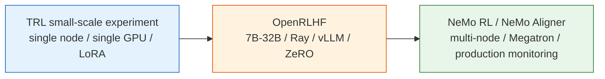
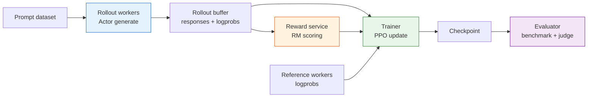

# Supplement: Scaling RLHF from Small to Large Models

## Reading Guide

**Core points**

- Understand the structural similarity between small TRL experiments and large-scale RLHF systems.
- Learn the new bottlenecks that appear at scale: rollout throughput, four-model VRAM, RM serving, checkpointing, and monitoring.
- Decide when to stay in TRL vs when to migrate to OpenRLHF, NeMo RL / NeMo Aligner, or other distributed stacks.

**Core question**

In small models, RLHF looks like a Python loop:

```text
generate -> reward -> PPO update
```

In large models, the same loop becomes a distributed system:

```text
rollout workers -> reward service -> replay / rollout buffer -> trainer workers -> evaluator
```

The algorithm is still SFT, RM, PPO. What gets heavier is systems engineering.

The small-scale experiments in this chapter use TRL so you can see the complete RLHF structure on a single consumer GPU or a small cloud instance. But industrial training cares about a different question: when the model scales from 360M or 0.5B to 7B, 32B, 70B, or even larger, can this pipeline still run?

The answer: **the algorithmic structure stays mostly the same; the systems engineering gets much heavier.**



## Small-Scale (TRL)

The most important value of small-scale experiments is understandability. You can see directly:

- How SFT transforms a base model into an assistant.
- How the Reward Model learns to rank chosen vs rejected.
- How PPO simultaneously uses Actor, Reference, Reward Model, and Critic.
- How KL, length, reward, and preference win-rate should be monitored together.

The recommended stack at this stage is `transformers`, `datasets`, `peft`, `trl`, `accelerate`. Good model choices include `HuggingFaceTB/SmolLM2-360M`, `Qwen/Qwen2.5-0.5B`, and `EleutherAI/pythia-410m`.

```text
base checkpoint
  -> SFTTrainer
  -> RewardTrainer
  -> PPOTrainer
  -> evaluation + human/LLM judge
```

This is not the path to production-grade performance, but it is excellent for learning the components of classical RLHF.

Before scaling up, make sure you can answer these questions:

| Question                                | Passing Criterion                                   |
| --------------------------------------- | --------------------------------------------------- |
| Does SFT actually change base behavior? | Fixed-prompt comparison clearly more assistant-like |
| Can RM distinguish chosen vs rejected?  | Held-out accuracy and margin are reasonable         |
| Is PPO stable?                          | Reward rises slowly; KL and length do not diverge   |
| Is evaluation reproducible?             | Same checkpoint re-run gives similar results        |
| Can badcases be replayed?               | Failed samples feed into next data round            |

If these questions are not resolved at 0.5B, jumping to 7B will only multiply debugging cost by ten.

## Mid-Scale (OpenRLHF)

When the model reaches 7B+, the bottleneck shifts from "can you write the code" to "can rollout and training throughput keep up." PPO-RLHF requires the model to continuously generate answers, score them with RM, and feed them back to training. This generate-train loop taxes ordinary training frameworks heavily.

Frameworks like OpenRLHF package several system solutions:

| Problem                | Small-scale TRL                 | OpenRLHF-style solution                             |
| ---------------------- | ------------------------------- | --------------------------------------------------- |
| Rollout speed          | Direct `generate`               | vLLM / Ray for high-throughput generation           |
| VRAM pressure          | LoRA or single GPU              | ZeRO, tensor parallelism, pipeline parallelism      |
| Multi-model scheduling | Same process, relatively simple | Actor, RM, Critic, Ref deployed as separate roles   |
| Data flow              | Python loop                     | Distributed queues and rollout buffers              |
| Monitoring             | Local logs                      | Experiment platforms, checkpoints, failure recovery |

Algorithmically you are still doing SFT, RM, PPO; each step has just been decomposed into a distributed system.

A mid-scale PPO-RLHF system typically includes:



Note that rollout and training have different resource profiles. Rollout is more like inference: it cares about throughput, KV cache, and continuous batching. PPO update is a training workload: it cares about VRAM, gradient synchronization, and optimizer state. Stuffing both into a simple loop works for small models; at large scale it wastes resources.

### Rollout Bottleneck

In ordinary supervised training, samples are already on disk. In PPO-RLHF, training samples must be generated on the fly. Each sample goes through:

```text
Actor generates answer
  -> Reference computes log-prob
  -> Reward Model scores
  -> Critic computes value
  -> PPO update
```

Actor generation is autoregressive, producing one token at a time. RM and Reference must also run forward passes on complete sequences. The larger the model, the more expensive this loop becomes.

This is why large-scale frameworks typically introduce:

| Technique                        | What It Solves                            |
| -------------------------------- | ----------------------------------------- |
| vLLM / high-throughput inference | Accelerate rollout generation             |
| Ray / distributed scheduling     | Allocate Actor, RM, Critic, Ref resources |
| ZeRO / FSDP / Megatron           | Reduce training VRAM pressure             |
| Rollout buffer                   | Decouple generation from training         |
| Async evaluation                 | Avoid blocking main training              |

## Large-Scale (NeMo RL / NeMo Aligner)

Beyond 70B, the training framework must not only run but also be recoverable, observable, and reproducible. Frameworks like NVIDIA NeMo RL / NeMo Aligner take a production-training perspective: multi-node multi-GPU, Megatron/FSDP, distributed checkpointing, mixed precision, model parallelism, data parallelism, and full monitoring must all be considered together.

The hardest part of large-scale RLHF is usually not the PPO formula, but problems like these:

- **Four-model resident cost**: Actor, Reference, Reward Model, and Critic all consume VRAM or inference resources.
- **Generation-training switching**: Rollout is an inference workload; PPO update is a training workload. They have different resource profiles.
- **Reward model throughput**: RM must score every answer, potentially becoming a bottleneck.
- **KL and length monitoring**: Once the policy drifts too fast, the loss may not look broken yet, but the outputs already are.
- **Checkpoint and recovery**: After a long training run is interrupted, Actor, Critic, optimizer, scheduler, and rollout state must all be restored consistently.
- **Evaluation loop**: Every checkpoint must be tested on fixed benchmarks, preference evaluations, and safety spot-checks.

### Four-Model Cost Estimation

Classical PPO-RLHF involves at least four model roles:

| Role         | Needs Gradients | Resource Characteristics                           |
| ------------ | --------------- | -------------------------------------------------- |
| Actor        | Yes             | Heaviest; used for both training and generation    |
| Critic       | Yes             | Can share backbone with Actor, or be independent   |
| Reference    | No              | Frozen inference, but must compute log-probs       |
| Reward Model | No              | Frozen inference; throughput may become bottleneck |

This means "training a 7B model" does not mean only one 7B in VRAM. Even though Reference and RM are frozen, they still consume inference resources. To save resources, industrial systems make many engineering trade-offs:

- Actor and Critic share a base, with only a value head added.
- Reference uses a frozen copy of the same base, offloaded when necessary.
- RM uses a smaller model or is deployed as a service.
- Rollout and PPO update phases reuse GPUs, but must handle switching overhead.

These tricks do not change the algorithm, but they determine whether training is economically feasible.

## Mapping Small Experiments to Large-Scale Engineering

| Small experiment in this chapter | Large-scale counterpart                                               |
| -------------------------------- | --------------------------------------------------------------------- |
| `SFTTrainer`                     | Distributed SFT, usually with LoRA, FSDP, ZeRO, or Megatron           |
| `RewardTrainer`                  | Distributed RM training, with separate RM accuracy / margin eval      |
| `PPOTrainer`                     | Actor-RM-Critic-Ref distributed PPO system                            |
| Local JSON preference data       | Annotation platform, data versioning, quality audit, dedup + decontam |
| Simple judge prompt              | Multi-judge, multi-dimensional rubric, human arbitration              |
| Local eval script                | Automated benchmarks, A/B tests, red-teaming, safety regression       |

This table illustrates one point: small-scale experiments are not toys; they are microcosms of large-scale training. As long as you understand the role of each artifact, you will not get lost when switching to a large-scale framework.

Let us look at the mapping from a "metrics" perspective:

| Small experiment metric | Large-scale counterpart                                       |
| ----------------------- | ------------------------------------------------------------- |
| `reward_mean`           | Reward distribution bucketed by task domain, language, length |
| `kl_mean`               | Per-layer / per-token / per-task KL monitoring                |
| `response_length`       | Length distribution, truncation rate, EOS rate                |
| `eval_win_rate`         | Multi-judge, human A/B, online experiments                    |
| Local logs              | SwanLab / W&B / internal monitoring platforms                 |
| Manual checkpoint       | Distributed checkpoint + automatic recovery                   |

## Framework Selection

| Scale   | Recommended Path                                                      |
| ------- | --------------------------------------------------------------------- |
| 135M-1B | TRL; prioritize understanding the pipeline                            |
| 1B-7B   | TRL + Accelerate / DeepSpeed; LoRA still viable                       |
| 7B-32B  | OpenRLHF; focus on solving rollout and distributed training           |
| 70B+    | NeMo RL / NeMo Aligner; focus on multi-node and production monitoring |

Do not adopt a heavy framework too early. If you have not yet run SFT, RM, PPO, and evaluation on a small model, jumping straight to 7B/70B will only mix algorithmic issues with systems issues, making debugging extremely painful.

Use this table for decisions:

| Problem You Encounter                     | Should You Switch Frameworks?                        |
| ----------------------------------------- | ---------------------------------------------------- |
| SFT loss does not decrease                | No; check data, masking, learning rate first         |
| RM prefers long answers                   | No; check preference data and RM evaluation          |
| PPO KL explodes                           | Maybe not; tune beta, LR, reward scaling first       |
| Cannot fit Actor + Critic on one GPU      | Maybe; consider LoRA, ZeRO, FSDP                     |
| Rollout generation too slow, low GPU util | Maybe; consider vLLM / OpenRLHF                      |
| Multi-node training cannot recover        | Yes; consider production-grade framework + ckpt mgmt |

Frameworks solve scale problems. They do not automatically solve reward design or data quality.

## Large-Scale Training Checklist

Before scaling up from small experiments, check at least these items:

| Check Item        | Question                                                        |
| ----------------- | --------------------------------------------------------------- |
| Data versioning   | Do SFT, RM, PPO prompts, and eval sets have version numbers?    |
| Model versioning  | Are Actor, Reference, RM, and Critic initializations recorded?  |
| RM calibration    | Is reward mean/std fixed? Is it decomposed by domain?           |
| KL target         | Are target KL and adaptive beta strategy clearly defined?       |
| Rollout params    | Are temperature, top_p, and max length fixed?                   |
| Failure recovery  | Do checkpoints include optimizer, scheduler, and global step?   |
| Evaluation gates  | Which metrics trigger a stop or rollback?                       |
| Manual spot-check | Do humans review high-reward, high-KL, and long-answer samples? |

This table looks very engineering-heavy, but that is exactly where the risks of scaled RLHF hide.

## Section Summary

The structure of classical RLHF is consistent across small and large models: base model -> SFT -> RM -> PPO -> evaluation gates. The difference is that large-scale training requires expanding this simple pipeline into a distributed system.

At this point, Chapter 8 has completed the main thread of classical RLHF. The next chapter asks a natural question: since this pipeline is so heavy, can we eliminate some components? That is the starting point for modern post-training methods like DPO, GRPO, and RLVR — [Post-Training Alignment](../chapter09_alignment/intro).

If you want an additional hands-on exercise before moving to Chapter 9, see the extended practice: deliberately write a bad reward function, observe how reward hacking happens, and then fix it with data and evaluation — [Extended Practice: Reward Hacking and Data Flywheels](./extended-practice).

## Exercises

1. Draw your own RLHF system diagram. Mark which GPUs or processes host Actor, Reference, RM, and Critic.
2. Explain why rollout is more like an inference workload, while PPO update is more like a training workload.
3. Write a migration checklist from a 0.5B TRL experiment to a 7B OpenRLHF setup.
