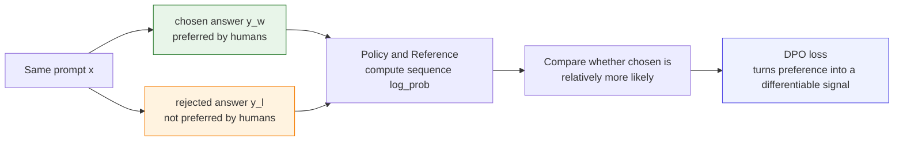
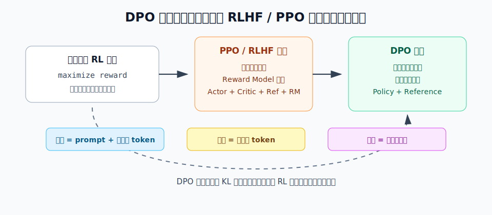
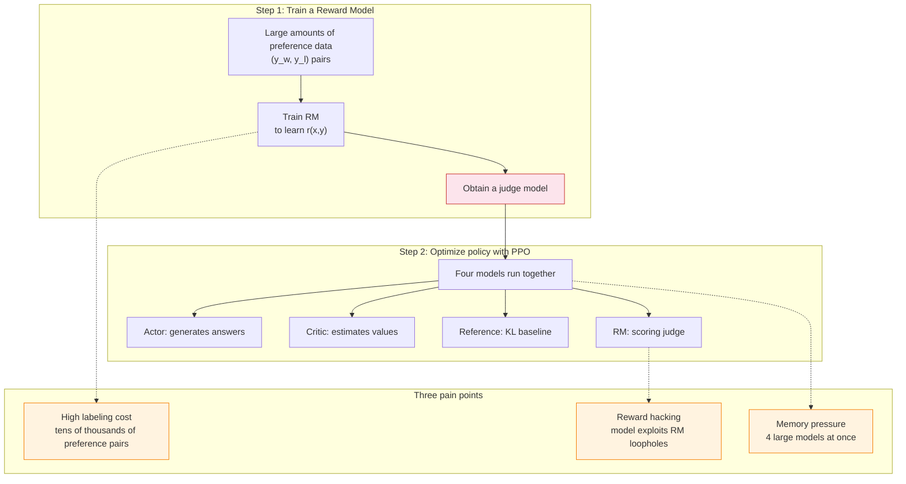
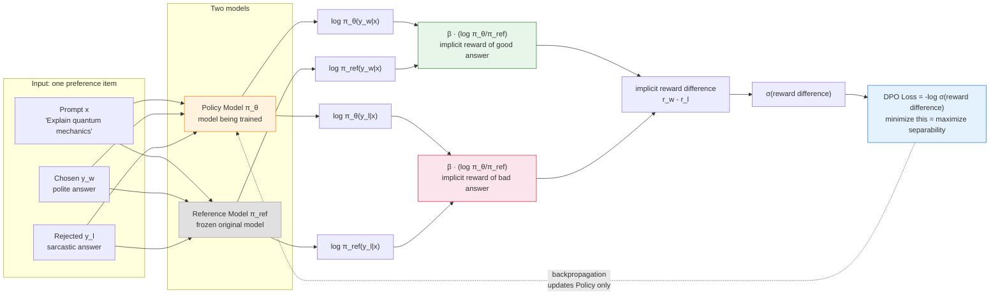
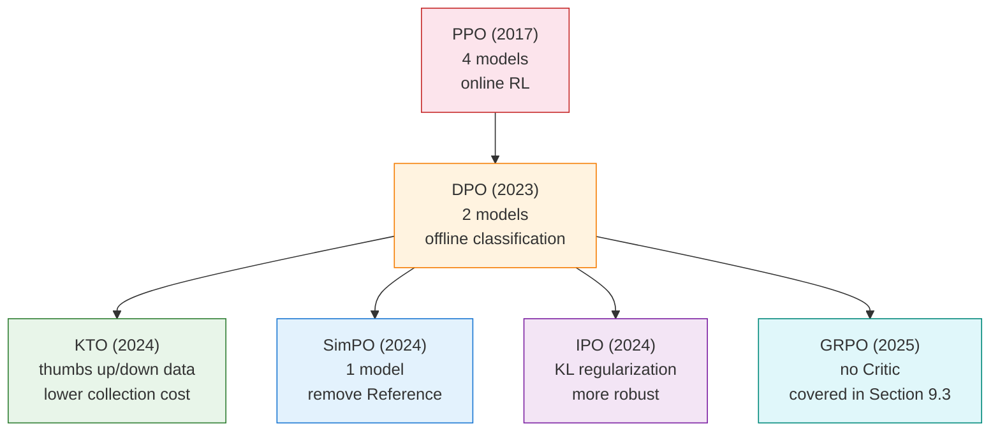

# 9.1 DPO Theory, Math, and Method Selection

You have already run DPO training code and watched metrics such as loss, accuracy, and reward margin move during training. Now let us slow down and return to the original problem DPO tries to solve: **if we already have human preference data, can we train the language model directly, without training a Reward Model and without running a full PPO pipeline?**

A DPO training sample is a "choose one of two answers to the same question" preference item. Given the same prompt, the data contains two answers: one answer humans prefer, called chosen, and one answer humans do not prefer, called rejected.

For example, suppose the prompt is:

> Explain in two sentences why the sky looks blue.

The preference data might look like this:

| Answer type | Content                                                                                                                                                                                       |
| ----------- | --------------------------------------------------------------------------------------------------------------------------------------------------------------------------------------------- |
| chosen      | "When sunlight enters the atmosphere, short-wavelength blue light is scattered more easily by air molecules. We see that scattered blue light from many directions, so the sky appears blue." |
| rejected    | "Because the sky is naturally blue, and clouds block the other colors."                                                                                                                       |

What DPO trains the model to do is this: when it later sees a similar prompt, **make answers like the chosen one relatively easier for the model to write, and make answers like the rejected one relatively less likely to appear**.

So the core DPO question can be written as:

> **Can we turn "which answer did humans prefer?" directly into a training signal that supports backpropagation?**

DPO's answer is yes. It rearranges the KL-regularized objective used in RLHF, rewrites reward differences as probability ratios between the Policy and the Reference, and finally obtains a loss function that looks like binary classification.

This section follows one preference sample from beginning to end: first we clarify what $(x,y_w,y_l)$ mean, then explain how a language model assigns a probability to a full answer, then derive the DPO loss from the KL-regularized RLHF objective, and finally return to handwritten code and TRL's `DPOTrainer`.



One point must be clear first: **DPO is not a new language model, and it is not merely a loss. DPO is an offline preference optimization method: it directly trains a language model policy using already-labeled preference pairs.**

In DPO, the object actually being trained is still the language model, that is, the policy:

$$
\pi_\theta(y \mid x)
$$

Here $x$ is the user's prompt, $y$ is the model's generated answer, and $\theta$ is the model parameter being updated. Notice that DPO does not invent an additional "DPO model". It trains this same language model, but the training signal no longer comes from "how many points did the reward model assign?" Instead, it comes from "which of the two answers did humans choose?"

The first difference between DPO and PPO can be understood this way: **PPO first lets the model generate online, then scores the answers with a reward model; DPO first takes answer pairs that humans have already compared, then turns "which one is better" into a contrastive loss that can be backpropagated directly**. Later we will often talk about the DPO loss, but keep this distinction in mind: **the loss is only the training signal through which DPO enters code; DPO itself is a complete offline preference optimization method.**

## Start from One Preference Sample

The key to DPO is not that it invents a new formula from nowhere. The key is this: **it starts from the RLHF objective, but instead of doing online sampling and updates like PPO, it rewrites "which answer did humans prefer?" as a classification-style training signal**.

To see this transformation clearly, first place the language model inside a reinforcement learning frame:

| Reinforcement learning concept | What it means for a language model                                           |
| ------------------------------ | ---------------------------------------------------------------------------- |
| State $s_t$                    | The prompt plus the prefix already generated, namely $(x,y_{<t})$            |
| Action $a_t$                   | The next token to generate, namely $y_t$                                     |
| Policy $\pi$                   | The language model's probability over the next token or the full answer      |
| Trajectory $\tau$              | The full generation path from prompt to complete answer                      |
| Reward $r$                     | Human preference, a reward model score, or a rule-based answer-quality score |

For a prompt $x$, generating a complete answer $y$ is equivalent to finishing one trajectory. What RLHF wants to optimize is: **make the answer receive a higher reward, while keeping the model from moving too far away from the original model**. This can be written as:

$$
\max_{\pi_\theta}
\mathbb{E}_{x\sim\mathcal{D},\,y\sim\pi_\theta}
\left[
r(x,y)
-
\beta
D_{\mathrm{KL}}
(\pi_\theta(\cdot\mid x)\|\pi_{\mathrm{ref}}(\cdot\mid x))
\right]
$$

PPO is an online method for solving this objective. It first lets the current model generate a batch of answers, uses the reward model to score them, uses a Critic to estimate a baseline, and finally updates the policy with ratios and clipping. The PPO paper emphasizes in its abstract that its objective design allows **"multiple epochs of minibatch updates"**, meaning the same batch of samples can be used for multiple rounds of minibatch updates.

DPO enters from a different angle. The DPO paper first points out that RLHF is often complex and unstable, then proposes a new reward parameterization that turns the standard RLHF problem into a **"simple classification loss"** and reduces the need to sample from the model during fine-tuning. In other words, DPO does not reject PPO. It says: **if we already have preference pairs $(x,y_w,y_l)$, some online RL steps can be replaced by mathematical derivation**.



Read the figure this way:

- The left side is the shared starting point of all these methods: the language model policy $\pi_\theta$ wants high reward while being constrained by $\pi_{\mathrm{ref}}$.
- The middle is the PPO / RLHF route: generate answers online, score them with a reward model, estimate advantages with a Critic, and update with PPO-Clip.
- The right side is the DPO route: use offline preference pairs and the closed-form solution of the KL-regularized objective to rewrite "reward difference" as a probability ratio between Policy and Reference.

So the derivation below first fixes a preference triple $(x,y_w,y_l)$, then returns to the KL-regularized RLHF objective, and finally explains why a seemingly complex RL problem can become DPO's classification loss.

> Paper context: PPO comes from Schulman et al., [Proximal Policy Optimization Algorithms](https://arxiv.org/abs/1707.06347). DPO comes from Rafailov et al., [Direct Preference Optimization](https://arxiv.org/abs/2305.18290). The former gives stable online policy updates; the latter turns the KL-constrained RLHF objective into offline preference optimization.

Below is a minimal handwritten DPO code map. Every formula later in this section will return to a few lines in this code:

<DpoCodeFocus focus="overview" />

This code can be divided into eight parts:

| Mark    | Code section                            | What the later text explains                                        |
| ------- | --------------------------------------- | ------------------------------------------------------------------- |
| **[A]** | Preference data                         | What $x$, $y_w$, and $y_l$ mean                                     |
| **[B]** | `sequence_logprob`                      | How a language model computes $\log \pi(y\mid x)$ for a full answer |
| **[C]** | First half of `dpo_forward`             | Why we look at both Policy and Reference                            |
| **[D]** | `chosen_logratio` / `rejected_logratio` | How probability ratios become implicit rewards                      |
| **[E]** | `dpo_logits`                            | The reward difference between good and bad answers                  |
| **[F]** | `-F.logsigmoid(...)`                    | Why the DPO loss has this shape                                     |
| **[G]** | `train_step`                            | Why only the Policy is updated, not the Reference                   |
| **[H]** | `train_dpo`                             | How a preference batch enters the training loop                     |

If you hover over the code lens or click the title bar, you can see the full code. The default view only shows the lines needed for the current paragraph.

## From PPO to DPO: Code Comparison

Before continuing the mathematical derivation, first look at the code-level difference between DPO and PPO/RLHF. This difference is not just "changing the name of a loss". **The training code's inputs, model components, and update pattern all change.**

If we still follow the PPO/RLHF idea, the training loop roughly looks like this:

```python
# PPO / RLHF intuition: generate online, score, then update with advantages
responses = policy_old.generate(prompts)
logps_old = policy_logprob(policy_old, prompts, responses).detach()

rewards = reward_model(prompts, responses)
values = critic(prompts, responses)
advantages = rewards - values

logps_new = policy_logprob(policy, prompts, responses)
ratio = torch.exp(logps_new - logps_old)
policy_loss = -torch.min(
    ratio * advantages,
    torch.clamp(ratio, 1 - clip_eps, 1 + clip_eps) * advantages,
).mean()
```

The central work in this code is: **the current model first generates answers**, then the **Reward Model scores the answers**, then the **Critic estimates a baseline**, and finally PPO's `ratio + clip` updates the policy.

If we switch to DPO, the shape of the training loop becomes:

```python
# DPO intuition: do not generate online; learn directly from preference pairs
batch = {
    "prompt": prompt,
    "chosen": chosen_answer,
    "rejected": rejected_answer,
}

chosen_logps = sequence_logprob(policy, prompt, chosen_answer)
rejected_logps = sequence_logprob(policy, prompt, rejected_answer)

ref_chosen_logps = sequence_logprob(reference, prompt, chosen_answer)
ref_rejected_logps = sequence_logprob(reference, prompt, rejected_answer)

chosen_logratio = chosen_logps - ref_chosen_logps
rejected_logratio = rejected_logps - ref_rejected_logps
dpo_loss = -F.logsigmoid(beta * (chosen_logratio - rejected_logratio)).mean()
```

Putting the two sides next to each other makes the difference clearer:

```diff
- responses = policy_old.generate(prompts)
- rewards = reward_model(prompts, responses)
- values = critic(prompts, responses)
- advantages = rewards - values
- loss = ppo_clip_loss(logps_new, logps_old, advantages)

+ chosen_logratio = chosen_logps - ref_chosen_logps
+ rejected_logratio = rejected_logps - ref_rejected_logps
+ loss = -log_sigmoid(beta * (chosen_logratio - rejected_logratio))
```

So the "Direct" in DPO does not mean there is no mathematics. It means DPO **no longer explicitly follows the engineering route of "online sampling -> RM scoring -> Critic value estimation -> PPO update"**. It directly turns a preference pair into a differentiable comparison objective.

The real TRL source code has this same structure. When checking the Hugging Face TRL main branch on 2026-05-01, three things can be seen in [`DPOTrainer`](https://github.com/huggingface/trl/blob/main/trl/trainer/dpo_trainer.py):

1. The data collator `DataCollatorForPreference` expects samples to contain `prompt_ids`, `chosen_ids`, and `rejected_ids`. It places chosen examples in the first half of the batch and rejected examples in the second half.
2. Reference probabilities can be precomputed and stored in `ref_chosen_logps` and `ref_rejected_logps`, or they can be computed by the reference model during training.
3. The loss section first computes `chosen_logratios` and `rejected_logratios`, then subtracts them. The default sigmoid version applies `-logsigmoid` to this difference.

Compared with [`PPOTrainer`](https://github.com/huggingface/trl/blob/main/trl/experimental/ppo/ppo_trainer.py), the distinction is even more direct: PPOTrainer is initialized with a `policy model`, `ref_model`, `reward_model`, and `value_model`; during training it calls `generate` online, computes rewards and values, and constructs advantages. DPOTrainer mainly needs **Policy, Reference, and preference data**.

## DPO Data and Probabilities

A DPO training sample is not a single answer. It is a **preference triple**:

$$
(x,\;y_w,\;y_l)
$$

Each symbol means:

- $x$: the prompt, namely the user's question or context.
- $y_w$: winner / chosen, the answer humans prefer.
- $y_l$: loser / rejected, the answer humans do not prefer.

In code, this corresponds to:

<DpoCodeFocus focus="data" />

DPO does not directly ask, "What absolute score should this answer receive?" Instead, it asks: **under the same prompt, can the model make chosen more likely than rejected?** This is why $y_w$ and $y_l$ always appear as a pair in the DPO formula.

When a language model computes the probability of an answer $y$, it does not generate the entire text in one step. It generates one token at a time. Suppose answer $y$ contains $T$ tokens:

$$
y=(y_1,y_2,\ldots,y_T)
$$

Then the conditional probability of the full answer can be written as:

$$
\pi_\theta(y\mid x)
=
\prod_{t=1}^{T}
\pi_\theta(y_t\mid x,y_{<t})
$$

Here:

- $\pi_\theta(y\mid x)$: the probability that the model with parameters $\theta$ generates the full answer $y$ after prompt $x$.
- $y_t$: the $t$-th token in the answer.
- $y_{<t}$: all tokens generated before the $t$-th token.
- $\prod$: the product symbol, meaning we multiply the probabilities of every token step.

In actual code, we almost never multiply probabilities directly, because many numbers smaller than 1 multiplied together become extremely close to 0 and can cause numerical underflow. So we take logarithms and turn the product into a sum:

$$
\log \pi_\theta(y\mid x)
=
\sum_{t=1}^{T}
\log \pi_\theta(y_t\mid x,y_{<t})
$$

This is exactly what `sequence_logprob` does: it takes the log probability of each token, then adds up only the token log probabilities belonging to the answer portion.

<DpoCodeFocus focus="logprob" />

## 9.1.1 Deriving DPO in Three Steps

### The Engineering Pain Points of RLHF

Before deriving DPO, first review the standard RLHF pipeline and see why it is so painful:



The original RLHF optimization objective is:

$$\max_{\pi_\theta} \; \mathbb{E}_{x \sim \mathcal{D}, y \sim \pi_\theta} \left[ r(x,y) - \beta \cdot D_{\text{KL}}(\pi_\theta \| \pi_{\text{ref}}) \right]$$

First unpack every symbol:

- $\max_{\pi_\theta}$: we adjust the policy model $\pi_\theta$ to make the objective as large as possible.
- $x \sim \mathcal{D}$: prompt $x$ comes from the training dataset $\mathcal{D}$.
- $y \sim \pi_\theta$: answer $y$ is sampled from the current policy model $\pi_\theta$.
- $r(x,y)$: the score assigned to the answer by the reward model. A higher score means the answer better matches human preference.
- $D_{\text{KL}}(\pi_\theta \| \pi_{\text{ref}})$: the distance between the new policy $\pi_\theta$ and the reference policy $\pi_{\text{ref}}$.
- $\beta$: the weight of the KL penalty. The larger $\beta$ is, the less the model dares to move away from the reference model.

Here the KL divergence can be written as:

$$
D_{\text{KL}}(\pi_\theta \| \pi_{\text{ref}})
=
\mathbb{E}_{y\sim \pi_\theta}
\left[
\log
\frac{\pi_\theta(y\mid x)}
{\pi_{\text{ref}}(y\mid x)}
\right]
$$

Read this formula this way: **if an answer generated by the current model has high probability under the current model but low probability under the reference model, then it has moved away from the reference model**. Why punish this movement? Because optimizing only for reward scores can make the model exploit reward-model loopholes and generate answers that look high-scoring but are actually strange. The KL term is like a leash that keeps the model near its original language ability.

So the RLHF objective contains two parts: maximize the reward $r(x,y)$ given by the RM, while using KL divergence to penalize the policy for drifting too far from the reference model. To optimize this objective, you need an RM to provide $r(x,y)$, a Critic to estimate advantages, and a Reference to compute the KL penalty. This is where the four-model setup comes from.

What remains in DPO code is the shorter path: **Policy + Reference + preference data**.

<DpoCodeFocus focus="models" />

### Step 1: The Closed-Form Solution of the Optimal Policy

Now consider one fixed prompt $x$. To keep the derivation clean, temporarily abbreviate $\pi(y\mid x)$ as $q(y)$. The optimization problem can then be written as:

$$
\max_q
\sum_y q(y) r(x,y)
-
\beta
\sum_y q(y)
\log
\frac{q(y)}
{\pi_{\text{ref}}(y\mid x)}
$$

At the same time, $q(y)$ must be a probability distribution, so it must satisfy:

$$
\sum_y q(y)=1
$$

Here $\sum_y$ means summing over all possible answers. The first term $\sum_y q(y)r(x,y)$ is the **average reward**; the second term is the KL penalty, which says the new policy should not move too far away from the reference policy.

To find the maximum under the constraint that "probabilities must sum to 1", introduce a Lagrange multiplier $\lambda$:

$$
\mathcal{L}(q,\lambda)
=
\sum_y q(y) r(x,y)
-
\beta
\sum_y q(y)
\log
\frac{q(y)}
{\pi_{\text{ref}}(y\mid x)}
+
\lambda
\left(
\sum_y q(y)-1
\right)
$$

Take the derivative with respect to the probability $q(y)$ of one particular answer $y$, and set the derivative to 0:

$$
\frac{\partial \mathcal{L}}{\partial q(y)}
=
r(x,y)
-
\beta
\left(
\log
\frac{q(y)}
{\pi_{\text{ref}}(y\mid x)}
+1
\right)
+
\lambda
=0
$$

Rearrange this expression:

$$
\log
\frac{q(y)}
{\pi_{\text{ref}}(y\mid x)}
=
\frac{r(x,y)}{\beta}
+
\frac{\lambda}{\beta}
-1
$$

Exponentiating both sides gives:

$$
q(y)
=
C
\cdot
\pi_{\text{ref}}(y\mid x)
\cdot
\exp
\left(
\frac{r(x,y)}{\beta}
\right)
$$

Here $C=\exp(\lambda/\beta-1)$. It does not depend on the specific answer $y$; it is only a normalization constant. To make the probabilities of all answers sum to 1, write it as $\frac{1}{Z(x)}$, which gives the closed-form solution:

$$\pi^*(y\mid x) = \frac{1}{Z(x)} \pi_{\text{ref}}(y\mid x) \cdot \exp\left(\frac{r(x,y)}{\beta}\right)$$

where:

$$
Z(x)
=
\sum_y
\pi_{\text{ref}}(y\mid x)
\cdot
\exp
\left(
\frac{r(x,y)}{\beta}
\right)
$$

$Z(x)$ has only one job: **rescale the probabilities of all answers so they sum to 1**. It is not a reward and not a model parameter; it is only a normalization factor.

This solution tells us a key fact: **the optimal policy $\pi^*$ can be expressed entirely by the reward function $r$ and the reference policy $\pi_{\text{ref}}$**. The reward function determines what the optimal policy looks like.

### Step 2: Solving Backward for the Reward Function

Since the optimal policy is determined by the reward function, can we go in the other direction and recover the reward function from the optimal policy? Take the logarithm of both sides of the formula above and rearrange:

$$\log \pi^*(y\mid x) = \log \pi_{\text{ref}}(y\mid x) + \frac{r(x,y)}{\beta} - \log Z(x)$$

$$r(x,y) = \beta \log \frac{\pi^*(y\mid x)}{\pi_{\text{ref}}(y\mid x)} + \beta \log Z(x)$$

This formula is very important. It says: if an answer $y$ appears more easily under the optimal policy $\pi^*$ than under the reference policy $\pi_{\text{ref}}$, then its implicit reward is higher.

Here $Z(x)$ is a constant that depends only on prompt $x$. For two answers $y_w$ and $y_l$ under the same prompt, $\beta \log Z(x)$ is exactly the same:

$$
\begin{aligned}
r(x,y_w)-r(x,y_l)
&=
\left[
\beta \log
\frac{\pi^*(y_w\mid x)}
{\pi_{\text{ref}}(y_w\mid x)}
+
\beta \log Z(x)
\right] \\
&\quad -
\left[
\beta \log
\frac{\pi^*(y_l\mid x)}
{\pi_{\text{ref}}(y_l\mid x)}
+
\beta \log Z(x)
\right] \\
&=
\beta \log
\frac{\pi^*(y_w\mid x)}
{\pi_{\text{ref}}(y_w\mid x)}
-
\beta \log
\frac{\pi^*(y_l\mid x)}
{\pi_{\text{ref}}(y_l\mid x)}
\end{aligned}
$$

The two $\beta \log Z(x)$ terms disappear after subtraction. DPO training only cares **how much better chosen is than rejected**, so this constant does not need to be computed explicitly.

During actual training, we do not know the true optimal policy $\pi^*$. We therefore use the policy being trained, $\pi_\theta$, to approach it. The implicit reward of a single answer is then written as:

$$r(x,y) = \beta \log \frac{\pi_\theta(y\mid x)}{\pi_{\text{ref}}(y\mid x)}$$

This is DPO's central insight: **the reward function can be represented by a ratio of policy probabilities**. No extra RM is needed. The policy model itself contains the reward signal.

In code, this is exactly the step where we compute the answer log probabilities under Policy and Reference separately, then subtract them:

<DpoCodeFocus focus="ratio" />

### Step 3: Substitute into the Bradley-Terry Model

Recall the Bradley-Terry preference model from [the previous RLHF chapter](../chapter15_rlhf/reward-function-design) and [Chapter 7 on GAE](../chapter10_ppo/gae-reward-model):

$$P(y_w > y_l \mid x) = \sigma\left( r(x, y_w) - r(x, y_l) \right)$$

Here $\sigma$ is the sigmoid function:

$$
\sigma(z)
=
\frac{1}{1+\exp(-z)}
$$

Its role is to squash any real number $z$ into the interval from $0$ to $1$, so it can be interpreted as a probability. Here $z=r(x,y_w)-r(x,y_l)$: if the chosen answer has a higher reward than the rejected answer, then $z>0$ and $P(y_w>y_l\mid x)>0.5$; if the gap is large, this probability approaches 1.

Now substitute the "implicit reward" from Step 2:

$$P(y_w > y_l \mid x) = \sigma\left( \beta \log \frac{\pi_\theta(y_w\mid x)}{\pi_{\text{ref}}(y_w\mid x)} - \beta \log \frac{\pi_\theta(y_l\mid x)}{\pi_{\text{ref}}(y_l\mid x)} \right)$$

The reward function $r$ has disappeared completely. We have obtained a preference model that **depends only on policy probabilities**.

The training data tells us that in sample $(x,y_w,y_l)$, $y_w$ really is better than $y_l$. So we want the model to assign this event as high a probability as possible. Maximum likelihood estimation means maximizing:

$$
\log P(y_w > y_l \mid x)
$$

Neural network training is usually written as "minimize a loss", so we add a negative sign:

$$
\mathcal{L}_{\text{DPO}}
=
-
\log P(y_w > y_l \mid x)
$$

Substituting the preference probability above gives the full DPO loss:

$$\mathcal{L}_{\text{DPO}} = -\mathbb{E}_{(x, y_w, y_l)} \left[ \log \sigma \left( \beta \log \frac{\pi_\theta(y_w\mid x)}{\pi_{\text{ref}}(y_w\mid x)} - \beta \log \frac{\pi_\theta(y_l\mid x)}{\pi_{\text{ref}}(y_l\mid x)} \right) \right]$$

This is the true form behind the `DPOTrainer` you used in [Chapter 2](../chapter17_dpo/intro):

<DpoCodeFocus focus="loss" />

| Formula part                                                           | Meaning                                 | Intuition                                                                        |
| ---------------------------------------------------------------------- | --------------------------------------- | -------------------------------------------------------------------------------- |
| $\beta \log \frac{\pi_\theta(y_w\mid x)}{\pi_{\text{ref}}(y_w\mid x)}$ | Implicit reward of the good answer      | "How much did Policy raise the good answer's probability relative to Reference?" |
| $\beta \log \frac{\pi_\theta(y_l\mid x)}{\pi_{\text{ref}}(y_l\mid x)}$ | Implicit reward of the bad answer       | "How much did Policy raise the bad answer's probability relative to Reference?"  |
| Difference between the two                                             | Reward gap between good and bad answers | "How much better is the good answer than the bad answer?"                        |
| $\sigma(\cdot)$                                                        | Squash to [0, 1]                        | "How confident are we that the good answer is indeed better?"                    |
| $-\log \sigma(\cdot)$                                                  | Cross-entropy loss                      | "Make this confidence as large as possible"                                      |

The code mapping is also direct:

- `chosen_logps` is $\log \pi_\theta(y_w\mid x)$.
- `rejected_logps` is $\log \pi_\theta(y_l\mid x)$.
- `ref_chosen_logps` is $\log \pi_{\text{ref}}(y_w\mid x)$.
- `ref_rejected_logps` is $\log \pi_{\text{ref}}(y_l\mid x)$.
- `chosen_logratio = chosen_logps - ref_chosen_logps` corresponds to $\log \frac{\pi_\theta(y_w\mid x)}{\pi_{\text{ref}}(y_w\mid x)}$.
- `rejected_logratio = rejected_logps - ref_rejected_logps` corresponds to $\log \frac{\pi_\theta(y_l\mid x)}{\pi_{\text{ref}}(y_l\mid x)}$.
- `dpo_logits = beta * (chosen_logratio - rejected_logratio)` corresponds to the full reward difference inside the sigmoid.
- `loss = -F.logsigmoid(dpo_logits).mean()` corresponds to $\mathcal{L}_{\text{DPO}}$.

At this point, the landing point of DPO is clear:

1. The input is preference data $(x,y_w,y_l)$.
2. Policy and Reference compute the sequence log probability of chosen / rejected separately.
3. Subtract the two log probabilities to get a log-ratio relative to Reference.
4. Subtract rejected's log-ratio from chosen's log-ratio to get the implicit reward difference.
5. Apply `logsigmoid` to the implicit reward difference, then take the negative sign to obtain a scalar loss that can be backpropagated.

In other words, **DPO is not "only a loss"**. It is a method for turning offline preference data into a policy update; the loss is the interface through which this method finally enters PyTorch.

### Full DPO Data Flow



Notice one important detail: **backpropagation updates only the Policy Model; the Reference Model is frozen**. So DPO only needs to maintain two models (Policy + Reference), and the Reference does not participate in gradient computation. In practice, its memory cost is much lower than PPO's.

This point is very direct in the training step: after `loss.backward()`, only the parameters of `policy_model` are updated by the optimizer.

<DpoCodeFocus focus="train" />

## 9.1.2 Implicit Reward

From the derivation in Step 2, we obtained a very important relationship:

$$r(x,y) = \beta \log \frac{\pi_\theta(y|x)}{\pi_{\text{ref}}(y|x)}$$

This means the model after DPO training **actually contains a reward model internally**. You can use it to score any answer:

```python
# ==========================================
# Score an answer with DPO's implicit reward
# ==========================================
import torch

def implicit_reward(policy_model, ref_model, tokenizer, prompt, response, beta=0.1):
    """
    Compute DPO's implicit reward:
    r(x,y) = beta * log(pi_theta(y|x) / pi_ref(y|x))
    """
    # Concatenate prompt and response
    text = prompt + response
    inputs = tokenizer(text, return_tensors="pt")

    # Compute log probabilities from the policy model and reference model
    with torch.no_grad():
        policy_outputs = policy_model(**inputs)
        ref_outputs = ref_model(**inputs)

        # Get each token's log probability
        policy_log_probs = policy_outputs.logits.log_softmax(dim=-1)
        ref_log_probs = ref_outputs.logits.log_softmax(dim=-1)

    # Simplification: use average log probability as a sequence-level score.
    # Real implementations sum token-level log probabilities.
    reward = beta * (policy_log_probs.mean() - ref_log_probs.mean())
    return reward.item()

# Example: compare two answers by implicit reward
prompt = "Explain quantum mechanics to me."
good_response = "Quantum mechanics is the branch of physics that studies microscopic particles..."
bad_response = "Oh, quantum mechanics. It is so simple you do not even need me to explain it..."

r_good = implicit_reward(model, ref_model, tokenizer, prompt, good_response)
r_bad = implicit_reward(model, ref_model, tokenizer, prompt, bad_response)

print(f"Implicit reward of good answer: {r_good:.4f}")
print(f"Implicit reward of bad answer: {r_bad:.4f}")
print(f"Reward gap: {r_good - r_bad:.4f}")
```

The meaning of implicit reward is this: **DPO does not lack a reward model; it hides the reward model inside the policy model**. You do not need to train and maintain a separate RM. The policy model itself can score its own answers. This is what "Direct" means in DPO: it learns the policy **directly** from preference data and **skips** the intermediate step of explicitly training an RM.

<details>
<summary>Question: What is the relationship between DPO's implicit reward $r(x,y) = \beta \log(\pi_\theta / \pi_{\text{ref}})$ and the KL penalty in [Chapter 7 PPO](../chapter10_ppo/trust-region-clipping)?</summary>

They are two sides of the same object. PPO's objective includes the term $-\beta \cdot D_{\text{KL}}(\pi_\theta \| \pi_{\text{ref}})$, which prevents the policy from moving too far away from the reference model. DPO's implicit reward $\beta \log(\pi_\theta / \pi_{\text{ref}})$ is exactly the logarithmic term inside the KL divergence. It is the "pointwise version" of the KL divergence.

PPO explicitly computes KL divergence during training and penalizes drift. DPO uses mathematical derivation to build this constraint into the loss function. When you optimize the DPO loss, the KL constraint is naturally respected. This is one of the mathematical appeals of the DPO derivation: no extra penalty term is needed, because the constraint is already implicit in the formula's structure.

</details>

## 9.1.3 DPO's Limitations and Family Evolution

DPO is elegant, but it is not universal:

1. **Dependence on data quality**: DPO is an offline method, so it can only learn from a fixed preference dataset. If the dataset does not cover enough scenarios, the model may perform poorly in new situations.
2. **No exploration**: PPO can keep trying new answers during training and receive feedback from the RM, while DPO can only see answers already present in the dataset. This means DPO's ceiling is limited by data quality.
3. **Preference conflicts**: if different annotators give contradictory judgments for the same answer pair, DPO may become confused.

The core tension behind these limitations can be summarized with an analogy: DPO is "learning to drive by watching recordings" because it can only learn from existing data, while PPO is "learning while driving" because it can explore online. The table below expands this analogy:

| Dimension                    | DPO                                     | PPO                                                        |
| ---------------------------- | --------------------------------------- | ---------------------------------------------------------- |
| **Core idea**                | Turn the RL problem into classification | Online RL + clipping for stable training                   |
| **Needs RM?**                | No (implicit reward)                    | Yes (explicitly trained)                                   |
| **Needs Critic?**            | No                                      | Yes (estimates advantages)                                 |
| **Needs online sampling?**   | No (uses a fixed dataset)               | Yes (generates data in real time)                          |
| **Number of models running** | 2 (Policy + Reference)                  | 4 (Actor + Critic + Ref + RM)                              |
| **Memory requirement**       | Low                                     | High (roughly 2-4x DPO)                                    |
| **Training complexity**      | Low (standard supervised learning)      | High (multi-model coordination, sensitive hyperparameters) |
| **Ceiling**                  | Limited by data quality                 | Theoretically higher (can explore online)                  |

DPO clearly wins over PPO in engineering complexity, but PPO has a higher theoretical ceiling. This trade-off gave rise to a class of DPO-style offline preference optimization methods. They all answer the same question: **which component can be safely removed?**

## 9.1.4 The DPO-Style Offline Preference Optimization Family

After deriving the DPO loss and seeing DPO's limitations, we can look at a group of methods that continue along the DPO path of simplification: KTO, SimPO, and IPO.

They can loosely be called the **DPO-style family**, or more precisely, the **offline preference optimization family**. They do not all strictly use the same loss as DPO, but their shared property is clear: they all try to bypass the complex route of "train a Reward Model + run online PPO updates" and train the policy model directly from preference or preference-like data.

You can first understand their differences by asking "what was removed?":

- **KTO**: removes the need for pairwise comparison data; a single answer's good/bad feedback is enough.
- **SimPO**: removes the Reference Model; it uses the policy model's own average log probability.
- **IPO**: keeps preference pairs and the Reference, but replaces DPO's log-sigmoid objective with a more robust squared-error objective.

### KTO

DPO needs pairwise preference data $(y_w, y_l)$, but collecting pairwise comparison data is expensive in practice. KTO (Kahneman-Tversky Optimization) proposes a more practical alternative: **each answer only needs a "thumbs up" or "thumbs down"; no pairwise comparison is required**.

KTO's name comes from prospect theory in behavioral economics, where humans are more sensitive to "losses" than to "gains". KTO incorporates this idea into its loss function: negative feedback receives a stronger penalty than positive feedback receives reward.

From the perspective of data collection, KTO's advantage is even clearer. Suppose you are on an AI product team. Collecting DPO data requires designing prompts, making the model generate two answers, and asking annotators to compare them. The process is heavy and costly. Collecting KTO data only requires extracting user "thumbs up" and "thumbs down" signals from production logs. It is almost free, because users are already producing these signals naturally.

### SimPO

DPO needs a frozen Reference Model $\pi_{\text{ref}}$ as a baseline. SimPO (Simple Preference Optimization) replaces comparison with the reference model by the answer's own average log probability:

$$r_{\text{SimPO}}(x,y) = \beta \cdot \frac{1}{|y|} \sum_{t=1}^{|y|} \log \pi_\theta(y_t | x, y_{<t})$$

There is no longer a $\pi_{\text{ref}}$. The implicit reward is measured directly by the policy model's own average log probability. This saves memory because one full model is no longer maintained, speeds up training because no Reference Model forward pass is needed, and simplifies implementation. But without $\pi_{\text{ref}}$ as a safety rope, the model may change its behavior too aggressively. SimPO's paper finds empirically that this risk can be acceptable when data quality is high, but when data quality is poor, the Reference Model's constraint remains valuable.

### IPO

DPO may overfit when data is scarce or the preference signal is weak. IPO (Identity Preference Optimization) replaces DPO's log-ratio form with a KL-regularized squared-error objective:

$$\mathcal{L}_{\text{IPO}} = \mathbb{E} \left[ \left( \log \frac{\pi_\theta(y_w|x)}{\pi_{\text{ref}}(y_w|x)} - \log \frac{\pi_\theta(y_l|x)}{\pi_{\text{ref}}(y_l|x)} - \frac{1}{2\beta} \right)^2 \right]$$

IPO replaces log-sigmoid with mean squared error and therefore has a natural "target value" ($1/2\beta$). The model only needs to reach this target; it does not need to widen the gap without limit. As an analogy, DPO asks that "the good essay's score must be much higher than the bad essay's score", where a larger gap is always better. IPO asks that "the good essay only needs to be higher than the bad essay by $1/2\beta$". This "enough is enough" property is especially important in small-data settings. When data is scarce, you are less certain whether the learned preference is accurate, so overly aggressive optimization is more likely to overfit. Empirically, when preference data has fewer than 1,000 examples, IPO is noticeably more stable than DPO; when the data exceeds 10,000 examples, the gap between them narrows.

### Family Differences in One Table

| Dimension           | DPO                                              | KTO                                         | SimPO                                 | IPO                                    |
| ------------------- | ------------------------------------------------ | ------------------------------------------- | ------------------------------------- | -------------------------------------- |
| **Data format**     | Preference pair $(y_w, y_l)$                     | Single label $(y, \text{thumbs up/down})$   | Preference pair $(y_w, y_l)$          | Preference pair $(y_w, y_l)$           |
| **Data collection** | High cost (needs comparison between two answers) | Low cost (only one answer needs evaluation) | High cost (same as DPO)               | High cost (same as DPO)                |
| **Needs Ref?**      | Yes                                              | Yes                                         | **No**                                | Yes                                    |
| **Math basis**      | Bradley-Terry + log-sigmoid                      | Prospect-theory value function              | Average log probability               | Mean squared error + KL regularization |
| **Core strength**   | Classic, stable, best ecosystem                  | Flexible data format, low collection cost   | Saves memory (one fewer full model)   | More stable with small data            |
| **Best fit**        | General first choice                             | User feedback, review annotations           | Single-card training for large models | Fewer than 1,000 data examples         |

## 9.1.5 Method Selection Guide

Putting all methods together, here is a practical decision table:

| Scenario                                              | Recommendation | Reason                                                                      |
| ----------------------------------------------------- | -------------- | --------------------------------------------------------------------------- |
| Large amount of preference-pair data                  | **DPO**        | Classic, stable, best ecosystem, broad community support                    |
| Only thumbs up/down feedback                          | **KTO**        | Data format is a natural match; no pairwise comparison needed               |
| Tight memory budget, such as single-card 70B training | **SimPO**      | No Reference Model, saving one full model                                   |
| Very small data, within a few hundred examples        | **IPO**        | Regularization helps prevent overfitting and is more stable with small data |
| Chasing the theoretical ceiling                       | **PPO / GRPO** | Online methods can explore new policies and have a higher ceiling           |
| Quickly validating an alignment pipeline              | **DPO**        | Simplest implementation and fastest path to results                         |



Every simplification answers the same question: **which component can be safely removed?**

- PPO -> DPO: remove the Reward Model and Critic; keep only Policy and Reference.
- DPO -> KTO: remove the pairwise-comparison data requirement; require only single labels.
- DPO -> SimPO: remove the Reference Model; keep only Policy.
- PPO -> GRPO: remove the Critic; use within-group comparison instead.

These simplifications are not linear. You cannot simply say "SimPO is better than DPO". They simplify along different dimensions. Which method you choose depends on your scarcest resource: memory, data, compute, or labeling cost.

There is another easily overlooked dimension when choosing a method: **iteration speed**. One implicit advantage of DPO is that experimental iteration is fast. Change a hyperparameter, swap a dataset, and retrain; one run may take only tens of minutes to a few hours. A full PPO run may take days, and its hyperparameters are more sensitive. In the early stage of a project, fast iteration is more important than chasing the best result from a single run: first use DPO to quickly validate data quality and the training pipeline, then decide whether to switch to PPO/GRPO for better results.

One final practical suggestion: **do not overthink method selection; first get the pipeline running**. Data quality matters much more than method choice. One high-quality preference example can be more valuable than 100 mediocre examples. Whether you choose DPO, KTO, or IPO, if the data quality is poor, no method can rescue it.

<details>
<summary>Question: If the Policy and Reference become exactly the same after DPO training ($\pi_\theta = \pi_{\text{ref}}$), what does the implicit reward become?</summary>

The implicit reward becomes $r(x,y) = \beta \log(1) = 0$, assigning a score of zero to every answer. This means the model has not learned anything from the preference data. It has completely preserved the original model's behavior. This can happen when $\beta$ is set too large, making the KL penalty too strong so the model does not dare move away from the reference model, or when the learning rate is too low or the number of training steps is insufficient. When monitoring DPO training, if Chosen Reward and Rejected Reward both stay near zero and never separate, the model is not learning.

</details>

<details>
<summary>Question: If you have both preference-pair data and thumbs up/down data, should you use DPO or KTO?</summary>

The recommendation is to **try both** and compare results. But there is a useful heuristic: if you have far more preference-pair data than thumbs up/down data, such as 10,000 pairs versus 2,000 labels, use DPO, because richer data usually gives better training. Conversely, if you have far more thumbs up/down data than preference pairs, such as 50,000 user-feedback labels but only 1,000 preference pairs, use KTO, because more data can compensate for the weaker signal.

There is also a more advanced approach: **mixed training**. First use DPO to learn fine-grained comparisons from preference pairs, then use KTO to make further use of large-scale user feedback. This two-stage strategy has been shown in some practices to work better than using either method alone.

</details>

The DPO family solves the question of "how to bypass the RM". But what if we look from another angle: **instead of bypassing the RM, what if we do not need an RM at all?** In domains with objective answers, such as mathematical reasoning and code generation, we can directly use rules to verify whether an answer is correct. Next, let us enter [GRPO training and core mechanisms](../chapter18_grpo/grpo-practice-and-mechanism).
