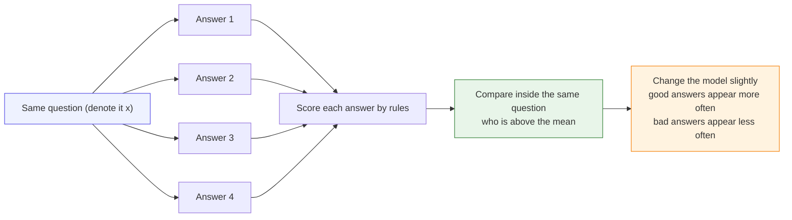
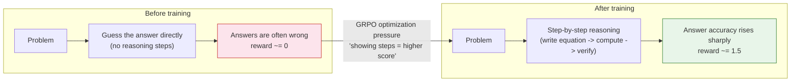
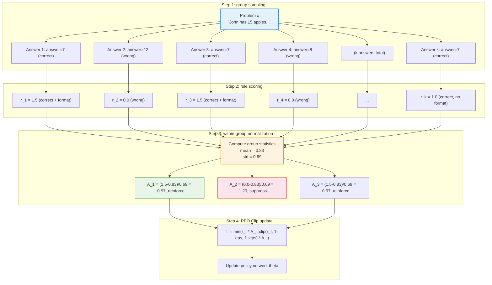

# 9.3 Hands-on: GRPO Training and Core Mechanisms

In the previous chapter, we studied DPO theory and practice and saw that it can learn directly from fixed preference data: under the same prompt, the chosen answer should become more likely than the rejected answer. Now we return to **online training**. The model no longer only reads preference pairs labeled by someone else. During training, it generates its own answers, receives feedback, and uses that feedback to update itself.

The entry point of GRPO is **multiple answers for the same question**. Given one problem, the model generates several answers at once; the reward function scores each answer; then the answers are compared only inside that group. On the surface, this looks like asking the model to try several times. The real problem it solves is:

> **Without a Critic, how can the model tell whether one answer is better or worse than expected?**

An intuitive answer is: compare it with the other answers to the same question. GRPO follows this idea and turns same-question multi-sampling into a trainable policy optimization method.

This section follows one complete GRPO training trajectory. We first look at how same-question multi-sampling creates within-group comparison, then explain the Critic and the baseline, then write down the advantage, probability ratio, and clipped objective, and finally return to handwritten code and TRL's `GRPOTrainer`.



The diagram expresses the most basic training signal: **answer the same question several times, give each answer a score, make answers above the group mean more likely in the future, and make answers below the group mean less likely**.

Let's walk through a small numerical example. Suppose the question is:

> John has 3 apples and buys 2 more. How many apples does he have now?

The model writes 4 answers to the same question, and the rule-based scorer gives the following scores:

| Answer | What the model wrote              | Score |
| ------ | --------------------------------- | ----- |
| 1      | "3 + 2 = 5, so the answer is 5."  | 1.5   |
| 2      | "The answer is 5."                | 1.0   |
| 3      | "It should be 6."                 | 0.0   |
| 4      | "I am not sure, perhaps it is 4." | 0.0   |

The mean of these 4 scores is:

$$
\frac{1.5+1.0+0.0+0.0}{4}=0.625
$$

So the model interprets this group as follows:

| Answer | Comparison with the mean | What to learn next                                  |
| ------ | ------------------------ | --------------------------------------------------- |
| 1      | $1.5-0.625=+0.875$       | Clearly better than average; **generate it more**   |
| 2      | $1.0-0.625=+0.375$       | Also better than average; generate it slightly more |
| 3      | $0.0-0.625=-0.625$       | Worse than average; **generate it less**            |
| 4      | $0.0-0.625=-0.625$       | Worse than average; generate it less                |

The quantity "how much higher or lower than the mean" will later be formally called the **advantage**. In this example, the advantage means whether this answer performs better or worse than the average among the four answers to the same question.

Next, we first define the Critic and then see why "compare with other answers to the same question" can replace the Critic.

In Actor-Critic methods such as PPO, the **Actor** is the policy model that generates answers, while the **Critic** is a value evaluator. It does not generate answers directly. Instead, it estimates "given what has been written so far, how much total reward can we expect later?" Written as a formula, this is the value function:

$$
V_\phi(s_t)
$$

Here $s_t$ is the current state. For a language model, we can roughly read it as "the prompt plus the first few generated tokens"; $\phi$ denotes the Critic's own parameters. The Critic provides a baseline for policy updates. If the true reward of an answer is higher than the Critic's estimate, the answer is better than expected and its probability should increase. If it is lower than the estimate, its probability should decrease.

The problem is that a Critic is often expensive and difficult to train in LLM settings. It is usually another large model and requires extra memory. It must also predict the final reward from an unfinished text prefix, while the supervision signal often appears only at the end of the answer, so the training noise is large. GRPO tries to do the following: **stop training a separate Critic and temporarily use the mean score of several answers under the same prompt as the baseline**. This is the core reason why within-group normalization can replace a Critic.

## Within-Group Normalization

GRPO training starts from **multiple answers for the same question**. Given one prompt, the model generates several answers; the reward function scores each answer; then the mean score of this group is used as a temporary baseline. Answers above the mean are encouraged, and answers below the mean are suppressed.

To write this process as a reinforcement learning problem, first map several basic terms:

| RL concept        | Meaning in a mathematical reasoning model                                        |
| ----------------- | -------------------------------------------------------------------------------- |
| State $s_t$       | The problem prompt plus the reasoning steps already written, namely $(x,y_{<t})$ |
| Action $a_t$      | The next generated token, namely $y_t$                                           |
| Trajectory $\tau$ | A full reasoning process and final answer                                        |
| Reward $R$        | Whether the answer is correct and whether the format follows the requirement     |
| Policy $\pi$      | The language model being trained                                                 |

If we follow the PPO route, the model generates an answer, the reward function scores the final answer, and the Critic estimates a baseline $V_\phi(s_t)$. The advantage is roughly:

$$
A_t
\approx
R
-
V_\phi(s_t)
$$

This says: **do not only ask whether the reward is high; ask whether it is better than the Critic expected**. This is natural in traditional reinforcement learning, but it is heavy in LLM mathematical reasoning. The Critic is also a large model, and it has to predict the final score from unfinished reasoning text.

GRPO keeps the most useful part of PPO, namely **ratio + clip**, but replaces the Critic baseline with the mean score of a group of answers to the same problem. When the DeepSeekMath paper introduced GRPO, it explicitly said that GRPO **"foregoes the critic model"** and uses within-group scores to estimate the baseline.


Therefore, the relationship between GRPO and PPO can be summarized as follows:

- PPO asks: is this answer better than the average level estimated by the Critic?
- GRPO asks: is this answer better than the other answers to the same question?
- Both PPO and GRPO still use probability ratios and clipping to avoid overly large updates.

> Paper context: GRPO comes from the DeepSeekMath paper [DeepSeekMath: Pushing the Limits of Mathematical Reasoning in Open Language Models](https://arxiv.org/abs/2402.03300). It does not discard PPO completely. Instead, it removes the Critic inside the PPO framework and constructs advantages from within-group relative rewards.

One common misunderstanding also needs to be clarified: **GRPO is not a new model, and it is not merely the formula for within-group normalization. GRPO is a method for online training of a policy model.**

In GRPO, the object being trained is still the language-model policy:

$$
\pi_\theta(y \mid x)
$$

Here $x$ is the question or prompt, and $y$ is the model-generated answer. GRPO trains by generating several answers for the same prompt, placing them in one group, scoring them, and comparing them: **is this answer above the average level inside its group?**

If an answer is better than the group average, its advantage $A_i$ is positive and training increases its probability. If it is worse than the group average, the advantage is negative and training decreases its probability. When updating the policy, GRPO still uses PPO-style `ratio + clip` to keep the new policy from moving too far away from the old policy.

So GRPO can first be understood as:

> **GRPO = online group sampling + rule/reward scoring + within-group relative advantage + PPO-style clipped update.**

Translate the apple example at the beginning into this sentence: generating 4 answers to the same question is **online group sampling**; assigning scores with answer correctness and format is **rule/reward scoring**; using differences such as $1.5-0.625$ and $1.0-0.625$ to judge quality is **within-group relative advantage**; finally, making good answers more likely and bad answers less likely, while adjusting only a small amount each time, is the **PPO-style clipped update**.

This is the intuition behind "within-group relative advantage": **inside the same question, learn more from whoever is better than average, and generate less of whoever is worse than average**.

Below is a minimal handwritten GRPO code map. It is not the engineering source code of `trl`; instead, it lays out the mathematical structure of GRPO so that every formula can be traced back to a few lines in the code.

<GrpoCodeFocus focus="overview" />

This code can be divided into eight blocks:

| Marker  | Code section                      | What the following text explains                                    |
| ------- | --------------------------------- | ------------------------------------------------------------------- |
| **[A]** | `sample_groups`                   | Why each prompt generates multiple answers                          |
| **[B]** | `rule_reward` / `score_responses` | Where rewards come from and why math problems do not require an RM  |
| **[C]** | `group_advantages`                | How the within-group mean replaces the Critic baseline              |
| **[D]** | `sequence_logprob`                | How to compute $\log \pi_\theta(y\mid x)$ for a full answer         |
| **[E]** | First half of `grpo_loss`         | `ratio`, `clip`, and PPO-style policy updates                       |
| **[F]** | `approx_kl`                       | Why we still constrain the Policy away from the Reference           |
| **[G]** | `train_step`                      | How sampling, scoring, advantages, loss, and backprop connect       |
| **[H]** | `train_grpo`                      | Why GRPO is online training and generates fresh answers every round |

## From PPO to GRPO: Which Lines Actually Change?

If we did not switch to GRPO and kept training in the PPO / RLHF style, the code intuition would usually look like this:

```python
# PPO / RLHF: generate online, then ask the Critic to estimate the baseline
responses = policy_old.generate(prompts)
logps_old = sequence_logprob(policy_old, prompts, responses).detach()

rewards = reward_model(prompts, responses)
values = critic(prompts, responses)
advantages = rewards - values

logps_new = sequence_logprob(policy, prompts, responses)
ratio = torch.exp(logps_new - logps_old)
ppo_loss = -torch.min(
    ratio * advantages,
    torch.clamp(ratio, 1 - clip_eps, 1 + clip_eps) * advantages,
).mean()
```

The `critic` here is the value model described earlier. Its job is not to generate answers, but to estimate a baseline: **roughly how much score should this prompt and current answer prefix receive?** PPO then uses `rewards - values` to get the advantage and decide whether an answer is "better than expected" or "worse than expected".

GRPO changes only a concentrated part: **keep online generation, probability ratios, and clipping, but stop training the Critic; compute the advantage from a group of answers to the same prompt instead**.

```python
# GRPO: generate G answers for each prompt, then compare inside the group
responses = generate_many(policy_old, prompts, num_generations=G)
logps_old = sequence_logprob(policy_old, prompts, responses).detach()

rewards = reward_fn(prompts, responses)
rewards_by_group = rewards.view(batch_size, G)

group_mean = rewards_by_group.mean(dim=1, keepdim=True)
group_std = rewards_by_group.std(dim=1, keepdim=True)
advantages = ((rewards_by_group - group_mean) / (group_std + 1e-4)).view(-1)

logps_new = sequence_logprob(policy, prompts, responses)
ratio = torch.exp(logps_new - logps_old)
grpo_loss = -torch.min(
    ratio * advantages,
    torch.clamp(ratio, 1 - clip_eps, 1 + clip_eps) * advantages,
).mean()
```

If we isolate the lines that truly change, we get:

```diff
  responses = policy_old.generate(prompts)
  rewards = reward_model_or_rule(prompts, responses)
- values = critic(prompts, responses)
- advantages = rewards - values

+ rewards_by_group = rewards.view(batch_size, G)
+ group_mean = rewards_by_group.mean(dim=1, keepdim=True)
+ group_std = rewards_by_group.std(dim=1, keepdim=True)
+ advantages = ((rewards_by_group - group_mean) / (group_std + 1e-4)).view(-1)

  loss = ppo_style_clipped_loss(logps_new, logps_old, advantages)
```

So GRPO is not "deleting all of PPO", and it is not "only keeping a within-group normalization formula". More accurately, **GRPO replaces PPO's Critic baseline with a within-group mean baseline**: previously we asked, "is this answer better than the Critic expected?" Now we ask, "is this answer better than the other answers to the same question?"

The real TRL source code follows this structure. When checking the Hugging Face TRL main branch on 2026-05-01, the following correspondences could be seen in [`GRPOTrainer`](https://github.com/huggingface/trl/blob/main/trl/trainer/grpo_trainer.py):

1. `GRPOTrainer` accepts `reward_funcs` in its initialization arguments. This can be a reward model or an ordinary Python function. In other words, math tasks can be scored directly with rule functions and do not necessarily require training an RM first.
2. `self.num_generations = args.num_generations` corresponds to $G$ in the formula, namely **how many answers to generate for each prompt**.
3. The source reshapes rewards into `(-1, num_generations)`, computes `mean_grouped_rewards` and within-group `std_rewards`, and then obtains `advantages = rewards - mean_grouped_rewards`, dividing by the standard deviation when needed.
4. The loss still computes `coef_1 = exp(log_ratio)`, uses `torch.clamp` to get `coef_2`, and finally takes the `min` of `coef_1 * advantages` and `coef_2 * advantages`. This is the PPO-style clipped objective.

Compared with [`PPOTrainer`](https://github.com/huggingface/trl/blob/main/trl/experimental/ppo/ppo_trainer.py), the difference is clearer: `PPOTrainer` needs a `reward_model` and a `value_model`, and uses the `value_model` to produce advantage estimates; `GRPOTrainer` does not need a separate `value_model`. It directly turns **within-group relative scores from same-question multi-sampling** into advantages.

## Before Reading the Formula: What Does One GRPO Sample Group Look Like?

A GRPO training sample is not "one prompt with one answer", but **one prompt with a group of answers**. Suppose a batch contains several problems. Let $j$ denote the problem index and $i$ denote the answer index under that problem:

$$
x_j
\quad\longrightarrow\quad
\{y_{j,1},y_{j,2},\ldots,y_{j,G}\}
$$

The symbols mean:

- $x_j$: the $j$-th prompt, namely a problem or question.
- $G$: the group size, meaning how many answers each prompt generates. `num_generations=8` in code means $G=8$.
- $y_{j,i}$: the $i$-th answer generated under the $j$-th prompt.
- $\pi_{\text{old}}$: the old policy used to generate this batch of answers. It is responsible for sampling data.
- $\pi_\theta$: the new policy being updated. It is responsible for learning so that good answers become more likely.

The sampling process can be written as:

$$
y_{j,i}
\sim
\pi_{\text{old}}(\cdot \mid x_j),
\qquad
i=1,\ldots,G
$$

The symbol $\sim$ means "sample from a distribution". The dot $\cdot$ in $\pi_{\text{old}}(\cdot \mid x_j)$ means "the position of all possible answers": given prompt $x_j$, the old policy assigns probabilities to all possible answers, and we draw $G$ answers from that distribution.

In the code, this corresponds to **[A] group sampling**:

<GrpoCodeFocus focus="sampling" />

After each answer is generated, it receives a reward:

$$
r_{j,i}
=
R(x_j,y_{j,i})
$$

Here $R$ is the reward function, and $r_{j,i}$ is a scalar. For math problems, $R$ can be simple: give points for a correct answer and for a proper format. The key to GRPO is not that "the reward function must be complex", but that **multiple answers under the same question are compared together**.

## 9.3.1 GRPO Training Experiment

### Experimental Setup: GSM8K + Rule Rewards

GSM8K is a dataset of 8,500 elementary-school math word problems, each with a clear numerical answer. This is exactly a setting with an "objectively correct answer": no RM is needed, and rules can directly judge whether the answer is correct.

- Correct answer: $+1.0$ point
- Proper format, with clear reasoning steps: $+0.5$ point
- Wrong answer: $0$ points

```python
# 1. Rule-based reward function (no RM needed!)
import re

def rule_based_reward(prompt: str, response: str, ground_truth: str) -> float:
    reward = 0.0
    # Format score: check \boxed{...}
    if re.search(r'\\boxed\{[^}]+\}', response):
        reward += 0.5
    # Answer score: extract final answer and compare
    answer_match = re.search(r'\\boxed\{([^}]+)\}', response)
    if answer_match:
        model_answer = answer_match.group(1).strip()
        try:
            if abs(float(model_answer) - float(ground_truth)) < 0.01:
                reward += 1.0
        except ValueError:
            if model_answer == ground_truth:
                reward += 1.0
    return reward

# Test
prompt = "Janet's egg box holds 16 eggs each day. She eats 3 every morning and uses 4 to bake muffins in the afternoon. How many eggs can she sell each week?"
good = "First compute the eggs left each day: 16 - 3 - 4 = 9.\nThere are 7 days in a week, so she can sell: 9 * 7 = 63.\n\\boxed{63}"
bad = "I think she can sell about 50 eggs. \\boxed{50}"
print(rule_based_reward(prompt, good, '63'))  # 1.5
print(rule_based_reward(prompt, bad, '63'))   # 0.5
```

Notice the key difference: **we do not need to train any RM; the rule is the judge**. Math problems have standard answers, so direct comparison is enough. This kind of "verifiable reward" is exactly the core idea of RLVR, which will be discussed in depth in Section 9.4.

In the handwritten code map, the reward function corresponds to **[B]**. It receives only the answer and the ground truth answer and returns a scalar reward:

<GrpoCodeFocus focus="reward" />

### Running GRPO Training

We use the GRPO implementation provided by the `trl` library. Compared with PPO, GRPO does not need a Critic model:

```python
# 2. GRPO training code (simplified sketch)
from trl import GRPOTrainer, GRPOConfig
from transformers import AutoModelForCausalLM, AutoTokenizer
from datasets import load_dataset

model = AutoModelForCausalLM.from_pretrained("Qwen/Qwen2.5-1.5B-Instruct")
tokenizer = AutoTokenizer.from_pretrained("Qwen/Qwen2.5-1.5B-Instruct")
if tokenizer.pad_token is None:
    tokenizer.pad_token = tokenizer.eos_token
tokenizer.padding_side = "left"

config = GRPOConfig(
    output_dir="./grpo_gsm8k",
    num_generations=8,        # generate k=8 answers per problem (group size)
    per_device_train_batch_size=4,
    learning_rate=5e-6,
    num_train_epochs=1,
    # No Critic needed! This is the core innovation of GRPO.
)

gsm8k = load_dataset("openai/gsm8k", "main")
trainer = GRPOTrainer(
    model=model,
    args=config,
    train_dataset=gsm8k["train"],
    reward_funcs=[rule_based_reward],  # pass the rule reward function directly
    processing_class=tokenizer,
)

trainer.train()  # start training: no Critic, no RM
trainer.save_model("./grpo_gsm8k/final_model")
```

If we unfold the most important internal training step of `GRPOTrainer`, it is "sample by group, score, compute advantages, and update the policy":

<GrpoCodeFocus focus="train" />

### Before and After Training: How Reasoning Steps Change

The most exciting observation in GRPO training is the change in the model's reasoning style.

**Before training** (directly guessing the answer):

```text
Problem: John has 15 apples, gives 3 to Mary, and then gives 5 to Kevin. How many are left?
Answer: I think there are 7 left. \boxed{7}
```

**After training** (showing the reasoning process):

```text
Problem: John has 15 apples, gives 3 to Mary, and then gives 5 to Kevin. How many are left?
Answer:
Let me calculate step by step:
- John starts with 15 apples.
- He gives 3 to Mary: 15 - 3 = 12.
- He gives 5 more to Kevin: 12 - 5 = 7.
- Therefore 7 apples are left.
\boxed{7}
```

The model changes from "guess the answer directly" to "write the equation first and then compute". We did not explicitly teach this. The model discovers it during GRPO training. Because showing reasoning steps improves answer accuracy and earns higher rule rewards, the optimization pressure of GRPO naturally selects this path.



## 9.3.2 Why Within-Group Normalization Is Necessary

We have seen the practical effect of "removing the Critic": memory decreases by 30-40%, and reasoning steps change from "guessing" to "writing equations". But one core question remains unanswered: **why can within-group normalization replace the work of a Critic?**

### Three Problems with the PPO Critic

Before answering "why it can replace it", first clarify "why we want to replace it". PPO's Critic faces three serious problems in LLM training:

**1. It consumes memory.** The Critic is the same scale as the Actor. PPO needs to hold four models at the same time: Actor + Critic + Reference + RM.

**2. It is unstable to train.** The value function $V(s)$ needs to predict the final score from "partially generated text", but LLM sequences are long (500+ tokens), and the supervision signal appears only at the end, producing very high variance.

**3. It complicates engineering.** Four models have separate optimizers, learning rates, and gradient clipping configurations, making hyperparameter tuning much harder.

Recall the [baseline analysis in Chapter 5](../chapter08_policy_gradient/pg-improvements) and the [advantage function in Chapter 6](../chapter09_actor_critic/advantage-function): the core role of the Critic is **to provide a baseline that reduces variance**. If we can obtain a baseline without training a separate network, the Critic can retire.

### The Core Idea of GRPO

GRPO's idea is surprisingly simple. For the same problem $x_j$, first sample $G$ answers and obtain $G$ rewards:

$$
\{r_{j,1},r_{j,2},\ldots,r_{j,G}\}
$$

Then compute the mean reward of this group:

$$
\bar r_j
=
\frac{1}{G}
\sum_{i=1}^{G}
r_{j,i}
$$

Here:

- $\bar r_j$: the mean reward of the answer group for the $j$-th prompt.
- $\frac{1}{G}\sum_{i=1}^G$: add the rewards of the $G$ answers and divide by $G$.
- $r_{j,i}$: the reward of the $i$-th answer under the $j$-th prompt.

Next compute the standard deviation of this group:

$$
s_j
=
\sqrt{
\frac{1}{G}
\sum_{i=1}^{G}
(r_{j,i}-\bar r_j)^2
}
$$

Here:

- $s_j$: the standard deviation of the $j$-th reward group, representing how different the answer scores are.
- $(r_{j,i}-\bar r_j)^2$: how far the $i$-th answer is from the average; the square prevents positive and negative deviations from canceling.
- $\sqrt{\cdot}$: the square root, bringing the scale back near the original reward scale.

Finally, the within-group advantage of the $i$-th answer is:

$$
\hat A_{j,i}
=
\frac{
r_{j,i}-\bar r_j
}{
s_j+\epsilon
}
$$

This is the core formula of GRPO. It reads plainly:

- $r_{j,i}-\bar r_j$: how much better this answer is than the same-question average.
- Dividing by $s_j+\epsilon$: brings reward scales from different questions into a similar range.
- $\epsilon$: a very small number that prevents division by zero when the standard deviation is 0.
- $\hat A_{j,i}>0$: this answer is better than its group average, so its probability should increase.
- $\hat A_{j,i}<0$: this answer is worse than its group average, so its probability should decrease.
- $\hat A_{j,i}\approx 0$: this answer is close to average, so it does not need a strong update.

If every answer in the same group receives the same reward, $s_j$ approaches 0, and the code sets the advantage to 0. This means the problem currently offers no learnable difference: everyone is correct, or everyone is wrong, and the model does not know which answer to prefer.

This formula does something very similar to the Critic: **subtracting the mean asks "how much better than average is this?"** The difference is that the Critic uses a separate neural network to predict the baseline $V(s)$, while GRPO directly uses the actual mean score $\bar r_j$ of the answer group as the baseline.

In the code, this corresponds to **[C] within-group advantage**:

<GrpoCodeFocus focus="advantages" />

The code correspondence is:

- `grouped_rewards = rewards.view(-1, group_size)`: reshape a one-dimensional reward list into "one prompt per row, $G$ answers per row".
- `group_mean = grouped_rewards.mean(dim=1, keepdim=True)`: compute $\bar r_j$ for each prompt.
- `group_std = grouped_rewards.std(dim=1, keepdim=True)`: compute $s_j$ for each prompt.
- `advantages = (grouped_rewards - group_mean) / (group_std + eps)`: implement $\hat A_{j,i}$.
- `torch.where(group_std < eps, 0, advantages)`: if one group has no differences, give that group no training signal.



Within-group normalization works for three reasons:

**Difficulty normalization.** Different problems have different difficulty levels. For easy problems, all answers may be correct and the reward mean is high. For hard problems, most answers may be wrong and the reward mean is low. If absolute reward is used, easy-problem answers receive stronger gradients, and the model spends most of its effort on easy problems. Within-group normalization removes this bias by asking only "who is better inside this problem", independent of the problem's absolute difficulty.

**Relative comparison is more stable.** Human preferences are also naturally comparative ("A is better than B"), not absolute ("A gets 87 points"). GRPO's within-group comparison matches this style of judgment.

**Variance is lower.** Answers in the same group share the same prompt. The only difference is the randomness of model generation. This controlled-variable comparison is more stable than absolute scoring across unrelated samples.

In one sentence: **GRPO = PPO's clipping mechanism + replacing the Critic with within-group ranking**.

"PPO's clipping mechanism" is still `ratio`, `clamp`, and `min` in the code; the difference is that `advantages` now comes from within-group comparison.

First define the probability ratio between the new and old policies:

$$
\rho_{j,i}(\theta)
=
\frac{
\pi_\theta(y_{j,i}\mid x_j)
}{
\pi_{\text{old}}(y_{j,i}\mid x_j)
}
$$

Here:

- $\pi_{\text{old}}(y_{j,i}\mid x_j)$: the probability assigned to this answer by the old policy when it was sampled.
- $\pi_\theta(y_{j,i}\mid x_j)$: the probability assigned to this answer by the new policy currently being updated.
- $\rho_{j,i}(\theta)$: how many times the new policy has increased or decreased this answer's probability relative to the old policy.

In actual code, we do not directly divide two tiny probabilities. We first compute log probabilities, subtract them, and exponentiate:

$$
\rho_{j,i}(\theta)
=
\exp
\left(
\log \pi_\theta(y_{j,i}\mid x_j)
-
\log \pi_{\text{old}}(y_{j,i}\mid x_j)
\right)
$$

If $\rho=1$, the new and old policies assign the same probability to this answer. If $\rho=1.2$, the new policy increases its probability by 20%. If $\rho=0.8$, the new policy decreases its probability by 20%.

With the ratio and within-group advantage, the clipped GRPO objective is:

$$
\mathcal{J}_{\text{GRPO}}^{\text{clip}}(\theta)
=
\mathbb{E}_{j,i}
\left[
\min
\left(
\rho_{j,i}(\theta)\hat A_{j,i},
\operatorname{clip}
(\rho_{j,i}(\theta),1-\epsilon_{\text{clip}},1+\epsilon_{\text{clip}})
\hat A_{j,i}
\right)
\right]
$$

Each symbol means:

- $\mathbb{E}_{j,i}$: average over all prompts and all within-group answers in the batch.
- $\hat A_{j,i}$: the within-group advantage computed above.
- $\epsilon_{\text{clip}}$: the clipping range; a common value is 0.2.
- $\operatorname{clip}(\rho,1-\epsilon_{\text{clip}},1+\epsilon_{\text{clip}})$: restricts the probability ratio to an interval. For example, when $\epsilon_{\text{clip}}=0.2$, $\rho$ is restricted to $[0.8,1.2]$.
- $\min(\cdot,\cdot)$: chooses the more conservative objective and avoids an update that is too large.

Why clip? Because this batch of answers was generated by $\pi_{\text{old}}$. If, after several training steps, $\pi_\theta$ has moved far away from $\pi_{\text{old}}$, this batch no longer reliably represents the behavior of the new policy. Clipping means: **allow the model to learn, but do not let it change too aggressively from one batch of data**.

<GrpoCodeFocus focus="clip" />

In the code, `new_logprobs` is $\log \pi_\theta(y_{j,i}\mid x_j)$, and `old_logprobs` is $\log \pi_{\text{old}}(y_{j,i}\mid x_j)$. Therefore:

- `ratio = torch.exp(new_logprobs - old_logprobs)`: implements $\rho_{j,i}(\theta)$.
- `surr1 = ratio * advantages`: the unclipped policy objective.
- `clipped_ratio = torch.clamp(ratio, 1.0 - clip_eps, 1.0 + clip_eps)`: restricts $\rho$ to $[1-\epsilon_{\text{clip}},1+\epsilon_{\text{clip}}]$.
- `surr2 = clipped_ratio * advantages`: the clipped policy objective.
- `policy_loss = -torch.min(surr1, surr2).mean()`: takes the conservative objective and adds a negative sign to turn it into a loss to minimize.

The $\mathcal{J}_{\text{GRPO}}^{\text{clip}}$ above is the objective we want to maximize. The optimizer in code minimizes a loss by default, so it is written as:

$$
\text{policy\_loss}
=
-
\mathcal{J}_{\text{GRPO}}^{\text{clip}}(\theta)
$$

This is why the code contains a negative sign.

At the same time, GRPO usually keeps a KL penalty so that the Policy does not move too far from the Reference. The handwritten code uses a common approximate KL:

$$
\widehat D_{\text{KL}}
=
\exp(\Delta)
-
\Delta
-
1,
\qquad
\Delta
=
\log \pi_{\text{ref}}(y\mid x)
-
\log \pi_\theta(y\mid x)
$$

This approximation has a useful property: when the Policy and Reference assign the same log probability, $\Delta=0$, so:

$$
\exp(0)-0-1=0
$$

That is, the closer the two models are, the smaller the KL penalty; the farther apart they are, the larger the penalty.

The final total loss can be written as:

$$
\mathcal{L}_{\text{GRPO}}
=
-
\mathcal{J}_{\text{GRPO}}^{\text{clip}}(\theta)
+
\beta_{\text{KL}}
\widehat D_{\text{KL}}
$$

Here $\beta_{\text{KL}}$ is the KL penalty weight, corresponding to `kl_coef` in the code. The larger it is, the more conservative the model is. The smaller it is, the more willing the model is to leave the Reference and explore high-reward answers.

<GrpoCodeFocus focus="kl" />

The code correspondence is:

- `log_ratio_ref = ref_logprobs - new_logprobs`: implements $\Delta$.
- `approx_kl = (torch.exp(log_ratio_ref) - log_ratio_ref - 1.0).mean()`: implements $\widehat D_{\text{KL}}$.
- `loss = policy_loss + kl_coef * approx_kl`: implements the total loss $\mathcal{L}_{\text{GRPO}}$.

Putting all steps together, one GRPO training iteration is:

1. Sample $G$ answers for each prompt.
2. Score every answer with rules or a reward function.
3. Compute $\bar r_j$, $s_j$, and $\hat A_{j,i}$ inside each prompt group.
4. Use the new and old policy log probabilities to compute $\rho_{j,i}(\theta)$.
5. Use PPO-style clipping to control update size.
6. Add the Reference KL penalty.
7. Backpropagate and update only the Policy.

## 9.3.3 Experimental Comparison and Parameter Tuning

### Memory Usage Comparison

| Model size | PPO memory (4 models) | GRPO memory (2 models) | Savings |
| ---------- | --------------------- | ---------------------- | ------- |
| 1.5B       | ~24 GB                | ~14 GB                 | ~42%    |
| 7B         | ~80 GB                | ~48 GB                 | ~40%    |
| 14B        | ~160 GB               | ~96 GB                 | ~40%    |
| 70B        | ~640 GB               | ~384 GB                | ~40%    |

GRPO removes the Critic, which is the same scale as the Actor, and also removes the RM, often reducing memory usage by 30-40%. In real engineering, this means a training job that used to require 8 A100 GPUs may now fit on 5.

### Evolution of Within-Group Variance

The core innovation of GRPO is replacing the Critic with within-group normalization. Early in training, the 8 answers to the same problem differ greatly in quality, so variance is high. As training progresses, answer quality within the group becomes more consistent, variance decreases, and most answers become correct.

```text
Early training (Episode 10):
  8 answers to the problem "15 - 3 - 5 = ?": [3, 7, 12, 7, 15, 7, 8, 10]
  Within-group variance: high (answers vary widely)
  Normalized advantages: [-1.2, +0.1, +0.8, +0.1, +1.5, +0.1, -0.3, +0.6]

Middle training (Episode 100):
  8 answers to the same problem: [7, 7, 7, 8, 7, 7, 7, 7]
  Within-group variance: low (most answers are correct)
  Normalized advantages: [0, 0, 0, -0.5, 0, 0, 0, 0]

Late training (Episode 300):
  8 answers to the same problem: [7, 7, 7, 7, 7, 7, 7, 7]
  Within-group variance: near zero (all answers are correct)
  Normalized advantages: all near zero -> no gradient signal
```

When within-group variance falls to zero, all advantages become zero, and there is no gradient signal. The model has "graduated" on this problem. This is exactly what we want: the training signal naturally shifts toward problems that the model has not yet mastered.

### Choosing k

The group size $k$ is the most important hyperparameter in GRPO. It directly affects the quality of within-group normalization:

| k value | Sampling cost                   | Normalization quality                          | Suitable setting           |
| ------- | ------------------------------- | ---------------------------------------------- | -------------------------- |
| 2       | Low; only 2 samples per problem | Poor; mean and standard deviation are unstable | Quick validation           |
| 4       | Medium                          | Acceptable                                     | Limited resources          |
| 8       | Fairly high                     | Good                                           | **Default recommendation** |
| 16      | High                            | Very good; statistics are more stable          | Pushing the ceiling        |
| 64      | Very high                       | Excellent                                      | Large-scale training       |

```python
# Simple implementation of GRPO within-group normalization
import numpy as np

def grpo_group_normalize(rewards: list[float]) -> list[float]:
    rewards = np.array(rewards, dtype=float)
    mean, std = rewards.mean(), rewards.std()
    if std < 1e-8:
        return np.zeros_like(rewards)
    return (rewards - mean) / std

# Example: rewards from 8 answers
rewards = [1.5, 0.0, 1.5, 0.0, 1.0, 1.5, 0.5, 1.5]
advantages = grpo_group_normalize(rewards)
# Normalized advantages: [ 0.89 -1.48  0.89 -1.48  0.10  0.89 -0.69  0.89]
# Mean: 0.9375, standard deviation: 0.634
```

<details>
<summary>Reflection question: when does GRPO within-group normalization fail?</summary>

1. **k is too small**: with $k=2$, the mean and standard deviation are extremely unstable, so the statistics are unreliable.
2. **The reward distribution is skewed**: when most answers receive zero reward, a few high-reward answers dominate the gradient signal.
3. **All answers have the same quality**: variance is zero, all advantages are zero, and there is no gradient signal. This is the late-training "graduation" phenomenon.
4. **The reward signal is discontinuous**: with only 0/1 values, normalized advantages are discrete and the gradient signal is not fine-grained enough.

GRPO mitigates these problems through DAPO's "dynamic sampling" improvement: filter out problems the model has already solved and keep only samples with gradient signal.

</details>

### Full Comparison Between GRPO and PPO

| Component             | PPO                                | GRPO                                        |
| --------------------- | ---------------------------------- | ------------------------------------------- |
| Baseline (Critic)     | Independent $V(s)$ network         | Within-group mean $\bar{r}$                 |
| Advantage computation | $A = R - V(s)$ or GAE              | $A_i = (r_i - \bar{r}) / \sigma_r$          |
| Number of models      | 4 (Actor + Critic + Ref + RM)      | 2 (Actor + Ref)                             |
| Clipping mechanism    | PPO Clip                           | Same PPO Clip                               |
| Sampling method       | Online interaction                 | Group sampling; sample k answers per prompt |
| Memory                | High                               | 30-40% lower                                |
| Baseline quality      | Depends on Critic training quality | Depends on group size $k$                   |
| Baseline update speed | Requires retraining the Critic     | Updates automatically with each batch       |

It is worth noting that GRPO inherits PPO's clipping mechanism but does not inherit GAE. The reason is that GRPO usually receives only one reward signal at the end of the sequence, such as correct or wrong, rather than a reward at every token. In this situation, multi-step TD in GAE degenerates into a single-step estimate and is not fundamentally different from subtracting the mean from the final reward.

GRPO solves the Critic problem elegantly through within-group normalization. But this is only the first step. On the policy side, DeepSeek-R1-Zero showed that pure RL training can work without SFT, and DAPO further improved GRPO's engineering efficiency. Next, let's look at these frontier developments: [DeepSeek-R1 and DAPO](./deepseek-dapo).
