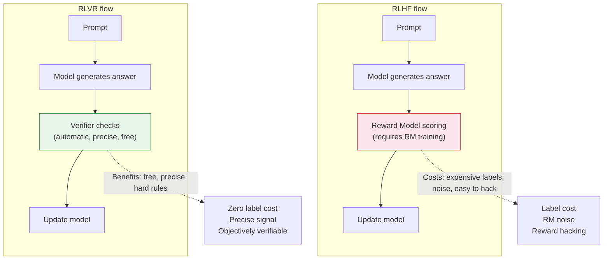
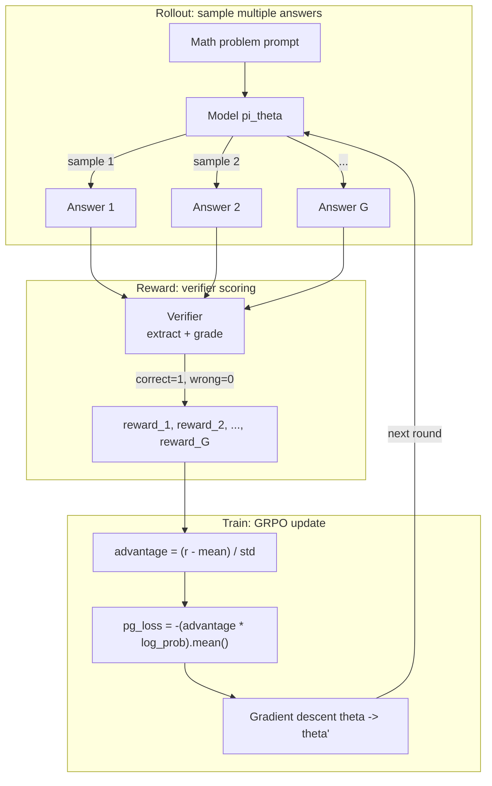

# 9.5 RLVR: Reinforcement Learning with Verifiable Rewards

In Sections 9.2 and 9.3, we saw how GRPO removes the Critic from the policy side and how DAPO allows pure RL to avoid dependence on SFT. Both ideas have an implicit premise: **the reward signal is reliable**. In mathematics and code, this premise is natural: a correct answer is correct. RLVR, or Reinforcement Learning with Verifiable Rewards, formalizes this premise into a training paradigm: **in domains with objective answers, there is no need to train an RM; direct rule-based verification is enough**.

This section starts from the core idea of RLVR, examines how it replaces the RM, discusses verifier design principles, implements a minimal RLVR training loop in code, and finally looks honestly at its limitations.

## The Core Idea of RLVR

Traditional RLHF depends on a Reward Model to provide the training signal. The RM needs human-labeled preference pairs, has noise, is vulnerable to reward hacking, and is expensive to label. RLVR starts from a simple question: **if the task itself has objective criteria for correctness, why train a noisy RM?**



### Compared with Traditional RLHF

| Aspect                 | RLHF                                                    | RLVR                                           |
| ---------------------- | ------------------------------------------------------- | ---------------------------------------------- |
| **Data cost**          | Extremely high; requires human-labeled preference pairs | Very low; automatic verification               |
| **Reward quality**     | Noisy because human judgment is subjective              | Precise because correctness is objective       |
| **Scalability**        | Limited by labeling speed                               | Almost unlimited                               |
| **Scope**              | Subjective preferences, such as politeness and safety   | Objective tasks, such as math, code, and logic |
| **Training stability** | Affected by RM quality                                  | Very stable because the reward signal is clear |
| **Risk of hacking**    | High; the model may exploit RM loopholes                | Low; rules are hard constraints                |

## Verifiers: The Key Design in RLVR

Different domains use different verification methods:

| Domain                   | Verification method | Example                            |
| ------------------------ | ------------------- | ---------------------------------- |
| Mathematics              | Answer matching     | `\boxed{42}` == ground truth       |
| Code                     | Unit tests          | Execute code + test case pass rate |
| Logical reasoning        | Formal verification | Lean/Coq theorem provers           |
| Multilingual translation | Automatic scoring   | BLEU/COMET score                   |

Verifier design is the key to RLVR. A good verifier needs three properties: **determinism** (the same input always receives the same result), **correctness** (the verifier's judgment truly reflects answer quality), and **efficiency** (verification must be fast enough not to become the training bottleneck).

Among these, "correctness" is the subtlest requirement. Consider math answer matching. If the ground truth is $\frac{22}{7}$ and the model answers $3.1428...$, is it correct? If the ground truth is $(x+1)(x-2)$ and the model answers $x^2 - x - 2$, is it correct? These boundary cases require careful verifier design. In practice, math verifiers usually perform numerical comparison with tolerance and symbolic simplification so that equivalent representations can be handled.

## 1-Shot RLVR: RL with Minimal Data

More surprisingly, ICLR 2025 research showed that RLVR can work with **only 1 training sample**. Researchers found that even when the training set contains only one math problem, RL training can still improve the model on many unseen problems.

This suggests that RLVR effectiveness does not mainly depend on data volume. The model has already learned reasoning ability during pretraining; RLVR's role is to "unlock" those latent abilities rather than teach them from scratch. It is like a student who already understands the math concepts but has never been forced to solve problems. RL training acts like an exam: it pressures the student to organize existing knowledge into usable problem-solving strategies.

This finding has important practical implications. It means the cost-performance ratio of RLVR training can be very high. You do not need massive data to obtain a significant gain. The key is not simply the amount of data, but the training setup: reward function design, group size, number of training steps, and so on. It also explains why DeepSeek-R1-Zero could succeed: even without any SFT data, if the RL training setup is correct, the model can "evolve" reasoning behavior by itself.

<details>
<summary>Reflection question: if RLVR can work with only 1 sample, why does practical training still need large datasets?</summary>

One sample can "start" the training process, but making the model perform well across diverse scenarios still requires training data with different types and difficulty levels. The reasons include:

- **Generalization**: with only 1 sample, the model may improve only in the "neighborhood" of that problem. Covering broad problem types requires diverse data.
- **Avoiding overfitting**: with too little data, the model may memorize a specific solution path rather than learn a general reasoning strategy.
- **Statistical stability**: success on 1 sample can be accidental. Averaging over a large dataset helps ensure the training direction is correct.

The real meaning of 1-Shot RLVR is theoretical: it shows that the value of RL is not "injecting new knowledge", but "activating existing ability". This changes how we understand the role of RL in LLM training.

</details>

## Hands-on: A Minimal RLVR Training Implementation

The discussion above clarifies the concept of RLVR. Now we turn it into a concrete implementation with runnable code.

Specifically, we will train a 0.6B Qwen3 model on the MATH dataset. Given a math problem, the model generates a reasoning process and final answer, the verifier checks whether the answer is correct, and GRPO updates the model. The full implementation stays under 200 lines and can run on a single GPU.

This implementation follows the RLVR GRPO script from Chapter 6 of Sebastian Raschka's [reasoning-from-scratch](https://github.com/rasbt/reasoning-from-scratch) project. It reconstructs the core structure of RLVR training with minimal code. Our goal is not merely to produce a runnable script, but to **understand how the structure of an RLVR training system naturally follows from "verifiable rewards + GRPO"**.

### What the RLVR Training Loop Looks Like

The RLVR training loop is the same as traditional GRPO, except that rewards come from a verifier rather than an RM:



Concretely:

- **Rollout phase**: for each math problem, the model samples $G$ answers under the current policy $π_θ$, for example $G=4$. Each answer contains a reasoning process and a final answer in `\boxed{}` format.
- **Reward phase**: the verifier extracts the answer inside `\boxed{}` and compares it with the ground truth. A correct answer gets reward 1; a wrong answer, or an answer that cannot be extracted, gets reward 0.
- **Train phase**: use GRPO within-group normalization to compute the advantage, then perform a policy gradient update.

### Verifier: Extract and Grade the Answer

The "verifiable" part of RLVR lives in the verifier. A math verifier does two things: extract the final answer from the model output and compare it with the ground truth.

```python
import re

def extract_boxed_answer(text: str) -> str | None:
    """Extract the answer inside \\boxed{...} from model output.

    The model is trained to mark the final answer with \\boxed{} at the end
    of its reasoning process. If extraction fails, return None (reward = 0).
    """
    match = re.search(r"\\boxed\{([^}]*)\}", text)
    if match:
        return match.group(1).strip()
    return None

def grade_answer(predicted: str, ground_truth: str) -> bool:
    """Judge whether the predicted answer is correct.

    Simplified version: direct string comparison + numerical comparison.
    Production verifiers handle equivalent forms such as fraction reduction
    and polynomial expansion.
    """
    predicted = predicted.strip().replace(" ", "")
    ground_truth = ground_truth.strip().replace(" ", "")
    if predicted == ground_truth:
        return True
    # Try numerical comparison, such as "22/7" vs "3.1428...".
    try:
        return abs(float(predicted) - float(ground_truth)) < 1e-6
    except ValueError:
        return False

def reward_rlvr(response: str, ground_truth: str) -> float:
    """RLVR reward function: extract answer + judge correctness.

    This is the core of RLVR: no RM, no human labels, only one rule that
    provides an exact 0/1 reward.
    """
    predicted = extract_boxed_answer(response)
    if predicted is None:
        return 0.0  # If no answer can be extracted, reward is 0.
    return float(grade_answer(predicted, ground_truth))
```

Design points:

- `extract_boxed_answer()` only accepts the `\boxed{}` format. If the model does not follow the format, reward is directly 0. This itself is a training signal that forces the model to learn the required output format.
- `grade_answer()` first performs string matching and then numerical comparison. A production verifier, such as the one used in [reasoning-from-scratch](https://github.com/rasbt/reasoning-from-scratch), uses more complex `sympy` equivalence checking, but the core logic is the same.
- The whole verification process is deterministic, reproducible, and zero-cost in labels. This is the essential advantage of RLVR over RM-based training.

### GRPO Training Loop

With the verifier in place, the next step is to connect "sample multiple answers -> compute rewards -> GRPO update" into a training loop.

```python
import torch
import torch.nn.functional as F


def compute_grpo_loss(model, tokenizer, prompt, ground_truth,
                      device, num_rollouts=4, max_new_tokens=512,
                      temperature=0.8):
    """One GRPO training step: rollout -> reward -> compute loss.

    Args:
        model: policy model
        tokenizer: tokenizer
        prompt: math problem prompt
        ground_truth: ground truth answer
        num_rollouts: number of sampled answers per problem (GRPO group size)
        max_new_tokens: maximum generation length
        temperature: sampling temperature

    Returns:
        dict: training statistics including loss, rewards, and advantages
    """
    roll_rewards, rollout_data = [], []

    # ==================== Phase 1: Rollout ====================
    # Sample num_rollouts independent answers for the same problem.
    with torch.no_grad():
        for _ in range(num_rollouts):
            input_ids = torch.tensor(
                tokenizer.encode(prompt), device=device
            ).unsqueeze(0)
            output_ids = model.generate(
                input_ids,
                max_new_tokens=max_new_tokens,
                temperature=temperature,
                do_sample=True,
            )
            # Extract generated part only, excluding the prompt.
            response = tokenizer.decode(
                output_ids[0, input_ids.shape[1]:],
                skip_special_tokens=True,
            )
            # Compute reward with the verifier: correct=1, wrong=0.
            reward = reward_rlvr(response, ground_truth)
            roll_rewards.append(reward)
            rollout_data.append((output_ids[0], input_ids.shape[1]))

    # ==================== Phase 2: GRPO Advantage ====================
    # Core idea: normalize multiple answers to the same problem inside the group.
    # advantage = (reward - mean) / std
    rewards = torch.tensor(roll_rewards, device=device)
    advantages = (rewards - rewards.mean()) / (rewards.std() + 1e-8)

    # If all advantages are 0, meaning all answers are correct or all are wrong,
    # skip the update.
    if torch.allclose(advantages, torch.zeros_like(advantages), atol=1e-8):
        return {"loss": 0.0, "loss_tensor": None, "rewards": roll_rewards}

    # ==================== Phase 3: Compute log prob ====================
    roll_logps = []
    for token_ids, prompt_len in rollout_data:
        logits = model(token_ids.unsqueeze(0)).logits.squeeze(0).float()
        logprobs = torch.log_softmax(logits, dim=-1)
        # Keep only the log probabilities of the response tokens.
        targets = token_ids[1:]
        selected = logprobs[:-1].gather(1, targets.unsqueeze(-1)).squeeze(-1)
        roll_logps.append(selected[prompt_len - 1:].sum())

    logps = torch.stack(roll_logps)

    # ==================== Phase 4: Policy gradient loss ====================
    # pg_loss = -(advantage * log_prob).mean()
    # Answers with positive advantage become more likely; negative ones become less likely.
    pg_loss = -(advantages.detach() * logps).mean()

    return {
        "loss": pg_loss.item(),
        "loss_tensor": pg_loss,
        "rewards": roll_rewards,
        "advantages": advantages.tolist(),
    }


def train_rlvr(model, tokenizer, train_data, device,
               steps=100, num_rollouts=4, lr=1e-5, **kwargs):
    """Main RLVR training loop.

    Args:
        train_data: list of examples, each containing "problem" and "answer"
        steps: number of training steps
        num_rollouts: GRPO group size
        lr: learning rate
    """
    optimizer = torch.optim.AdamW(model.parameters(), lr=lr)
    model.train()

    for step in range(steps):
        example = train_data[step % len(train_data)]
        prompt = (
            f"Solve the following problem. Put your final answer within "
            f"\\boxed{{}}.\n\nProblem: {example['problem']}"
        )

        stats = compute_grpo_loss(
            model, tokenizer, prompt, example["answer"],
            device, num_rollouts=num_rollouts, **kwargs,
        )

        if stats["loss_tensor"] is not None:
            optimizer.zero_grad()
            stats["loss_tensor"].backward()
            torch.nn.utils.clip_grad_norm_(model.parameters(), 1.0)
            optimizer.step()

        reward_avg = sum(stats["rewards"]) / len(stats["rewards"])
        if (step + 1) % 5 == 0:
            print(f"Step {step+1:3d} | loss={stats['loss']:.4f} | "
                  f"reward_avg={reward_avg:.3f}")

    return model
```

Design points:

- `compute_grpo_loss()` wraps the four GRPO phases in one function: rollout -> advantage -> log prob -> loss. This is the core design of [reasoning-from-scratch](https://github.com/rasbt/reasoning-from-scratch): each training step is a complete GRPO iteration.
- **The reward comes from the verifier, not an RM.** `reward_rlvr()` only extracts and compares answers. It has no trainable parameters and does not introduce RM reward hacking.
- **All-zero advantage is skipped.** If every rollout for a problem is correct or every rollout is wrong, all advantages are 0 and the gradient is also 0. Skipping the update saves compute, especially early in training when the model is weak and most problems receive all-zero rewards.
- This implements the simplest GRPO, without a KL penalty, which matches the recommendations from DAPO and Dr. GRPO: in mathematical reasoning tasks, the KL term can be harmful.

### Running It

```python
from transformers import AutoModelForCausalLM, AutoTokenizer

# Use a small model (0.6B parameters); one GPU is enough.
model_name = "Qwen/Qwen3-0.6B"
model = AutoModelForCausalLM.from_pretrained(
    model_name, torch_dtype=torch.bfloat16, device_map="auto"
)
tokenizer = AutoTokenizer.from_pretrained(model_name)

# MATH training data (example format)
train_data = [
    {"problem": "What is the value of $x$ if $2x + 3 = 11$?",
     "answer": "4"},
    {"problem": "Compute $\\sum_{k=1}^{10} k$.", "answer": "55"},
    # ... more problems
]

model = train_rlvr(
    model=model,
    tokenizer=tokenizer,
    train_data=train_data,
    device=model.device,
    steps=100,
    num_rollouts=4,
    lr=1e-5,
    max_new_tokens=512,
)
```

### Gap from Production Implementations

The implementation above runs the minimal RLVR + GRPO loop. Compared with the production script in [reasoning-from-scratch](https://github.com/rasbt/reasoning-from-scratch) and frameworks such as veRL and OpenRLHF, the main gaps are:

| Aspect               | Minimal implementation in this section      | Production RLVR training                                             |
| -------------------- | ------------------------------------------- | -------------------------------------------------------------------- |
| Verifier             | String matching + numerical comparison      | `sympy` equivalence checking, LaTeX parsing, multiple format support |
| Sampling engine      | Generate one by one with `model.generate()` | Continuous batching, KV cache, vLLM/SGLang                           |
| GRPO variant         | No KL penalty; simplest version             | Clip, KL penalty, length reward, Dr. GRPO, and other improvements    |
| Distributed training | Single GPU                                  | FSDP / Megatron, multi-GPU, gradient accumulation                    |
| Evaluation           | Mean reward during training                 | Standard benchmarks such as MATH-500, periodic checkpoint + eval     |
| Memory optimization  | None                                        | Gradient checkpointing, sequence truncation, zero-advantage skipping |

Each gap is an independent optimization direction. Chapter 7 of [reasoning-from-scratch](https://github.com/rasbt/reasoning-from-scratch) discusses several GRPO improvements, including Olmo3 fixes, DeepSeek-V3.2 fixes, and GDPO, and provides systematic comparisons on MATH-500.

## Limitations and Debates Around RLVR

RLVR is not a universal solution. It has several important limitations:

1. **It only applies to domains with objective answers.** Mathematics, code, and logical reasoning have clear correctness criteria. Subjective preferences such as "more polite", "more creative", and "safer" cannot receive precise reward signals from RLVR. These domains still require RMs or preference data.

2. **The verifier may be hacked.** Even when rewards are generated by rules, the model may still find shortcuts that satisfy the rule without genuine understanding. In math, for example, the model may learn a special trick that passes a particular verifier for certain problem types but fails under a rephrased question.

3. **Does RLVR really improve reasoning ability?** This is the sharp question raised by a NeurIPS 2025 oral paper. The authors questioned whether RLVR improves true reasoning ability or merely improves search efficiency, meaning the model becomes better at finding correct answers during inference. This remains an open frontier debate.

---

GRPO removes the Critic from the policy side, and RLVR removes the RM from the reward side. Together, they compress the complexity of RL training to an extreme degree. But the RL story does not end here. The next exciting directions are RL Scaling and test-time scaling. In [Chapter 12](../chapter32_selfplay/rl-scaling-outlook), we will look at these frontier directions: RL Scaling and the future outlook.
