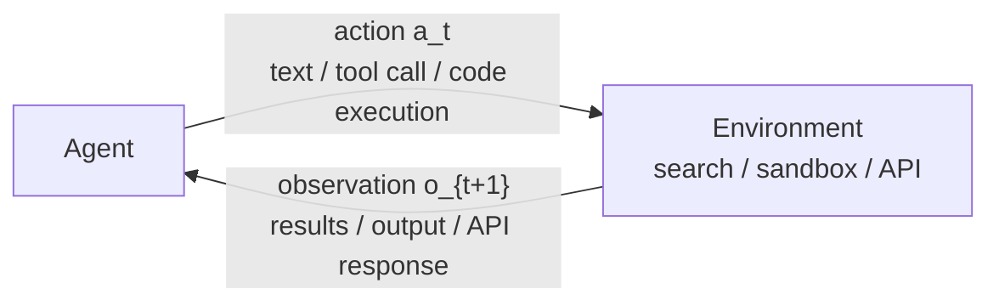
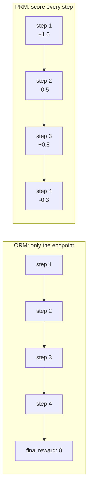

# Chapter 10: Agentic RL: Tool Use, Multi-Turn Interaction, and Agent Training

From DQN in Chapter 4 to GRPO in Chapter 9, the RL problems we have studied so far have mostly been "single-turn" problems: the model receives one prompt, produces one complete answer, a reward model assigns a score, and the policy is updated. This paradigm has proved extremely effective in the last two years. ChatGPT, Claude, and DeepSeek all rely on this family of methods for alignment and post-training.

Real agents, however, do not operate this way. When a user asks an agent, "Check tomorrow's weather in Beijing, then plan an itinerary based on the weather," the agent must first call a search or weather tool, read the returned information, decide whether more queries are needed, and finally integrate all information into a plan. This is a **multi-step, multi-tool, multi-turn interaction**. The previous single-turn RL paradigm no longer fits directly, because we usually cannot assign a clear reward at every intermediate step. The intermediate steps are not simply "right" or "wrong"; only the final result tells us whether the whole decision path worked.

## Traditional LLM RL and Agentic RL

Zhang et al. formalize this paradigm shift in [The Landscape of Agentic Reinforcement Learning for LLMs: A Survey](https://arxiv.org/abs/2509.02547). They point out that most preference-based reinforcement fine-tuning for LLMs can be viewed as a **degenerate MDP**:

$$
\langle S_{\text{trad}},\ A_{\text{trad}},\ P_{\text{trad}},\ R_{\text{trad}},\ T=1 \rangle
$$

The state space contains only the prompt, $S=\{s_0\}$; the action space is plain text, $A=A_{\text{text}}$; and the episode ends after one decision. The objective is $\mathbb{E}_{a \sim \pi_\theta}[r(a)]$: make the single response as good as possible.

**Agentic RL**, by contrast, is modeled as a **partially observable Markov decision process (POMDP)**:

$$
\langle S_{\text{agent}},\ A_{\text{agent}},\ P_{\text{agent}},\ R_{\text{agent}},\ \gamma,\ O \rangle
$$

The important changes are summarized below:

|                | Traditional LLM RL (PBRFT)                                                    | Agentic RL                                                                                                        |
| -------------- | ----------------------------------------------------------------------------- | ----------------------------------------------------------------------------------------------------------------- |
| **State**      | A single prompt; the episode ends immediately                                 | Environment state $s_t$ evolves dynamically; the agent observes only $o_t = O(s_t)$                               |
| **Action**     | Pure text sequence $A_{\text{text}}$                                          | Text plus structured actions, $A = A_{\text{text}} \cup A_{\text{action}}$, such as tools and environment actions |
| **Transition** | Deterministic termination, $P(s_1 \mid s_0, a)=1$                             | Dynamic transition $s_{t+1} \sim P(s_{t+1} \mid s_t, a_t)$ in an uncertain environment                            |
| **Reward**     | One scalar score $r(a)$, with no intermediate feedback                        | Step-level or terminal reward; often sparse, sometimes shaped by subtasks                                         |
| **Objective**  | $\mathbb{E}_{a \sim \pi_\theta}[r(a)]$, optimizing single-turn answer quality | $\mathbb{E}_{\tau \sim \pi_\theta}[\sum_t \gamma^t R(s_t,a_t)]$, optimizing a multi-step interaction policy       |

The core insight is that **many Agentic RL innovations are not changes to the RL formula itself, but system designs that make RL applicable to real agent loops**: how to define states and actions, design rewards, build environments, and handle long-horizon credit assignment.

## Key Concepts and Terms

The table gives us the formal frame. To reason fluently about Agentic RL, we also need several terms that recur throughout the field. These are not isolated definitions. They form a chain: how the agent interacts with the environment, how rewards are assigned, and how training uses those signals.

### Rollout

In traditional LLM RL, "sampling" means generating a text completion with one forward pass. In Agentic RL, the agent must **act inside a real environment**. Each step may trigger an external tool, such as a search engine, code interpreter, or API, and the tool result becomes the next input. The full process of letting the agent start from a task, interact according to the current policy, and continue until termination is called a **rollout**.

A typical agentic rollout looks like this:

```text
User question:
  "Who won the 2024 Nobel Prize in Physics, and what were their main contributions?"

Turn 1:
  Reasoning: "I need to search for this information."
  Action: call search with "2024 Nobel Prize Physics"
  Observation: search summary

Turn 2:
  Reasoning: "I need more detail about the contributions."
  Action: call search with a refined query
  Observation: detailed sources

Turn 3:
  Reasoning: "The information is sufficient; now integrate the answer."
  Action: final response
  Observation: episode ends; reward is 1 if correct, 0 if wrong
```

A rollout is therefore more than "model output." It contains the full loop of **reasoning, action, and environment feedback**. The resulting interaction record is a **trajectory**, written as $\tau = (s_0, a_0, o_1, a_1, o_2, \ldots, a_T)$. In single-turn LLM RL, one training example is often a $(prompt, completion, reward)$ triple. In Agentic RL, a trajectory is closer to a conversation tree: model tokens, tool calls, tool returns, and environment state changes all matter.

### Agent Loop

A rollout is one complete interaction. The engine that drives it is the **agent loop**. It is the same core RL loop introduced in Chapter 1, but the action space has expanded from "left/right" to "text/tool call/code execution":

<div align="center" style="margin: 2.5rem 0;">



</div>

1. **Perception**: the agent receives the current observation $o_t$, such as a search result, runtime error, or web page.
2. **Reasoning**: the model uses the observation to generate the next thought.
3. **Action**: the model chooses an action, which may be more reasoning or a tool call.
4. **Observation**: the environment executes the action and returns a result.
5. The loop repeats until the task is finished or a termination condition is reached.

The key difference from ordinary LLM RL is that the "action" is not limited to generating the next token. It can be "call a search engine," "execute this code," or "click this button." This richer action space creates new capabilities and new training problems.

### Tool Calling

**Tool calling** is the signature capability of Agentic RL. A language model without tools can only rely on parametric memory. It cannot retrieve live weather, verify a calculation, or inspect a database. A tool-equipped agent can actually search, compute, and check.

The important point is that, in Agentic RL, tool use is not just a hard-coded rule such as "call the weather API for weather questions." It is a **policy decision learned by RL**. The model must learn:

- **When** to call a tool. Some questions are answerable directly; others require external information.
- **How** to call a tool. The right query may find the answer immediately; a poor query may waste many turns.
- **How to use** the returned result. Search output may be redundant, noisy, or contradictory, so the agent must filter and integrate it.

Work such as SearchR1 trains models to learn these policies through RL. Unlike traditional RAG, search-guided reasoning allows **iterative retrieval**: search once, refine based on clues, search again, and then answer.

One technical detail is **retrieved token masking**. During RL gradient computation, parameters should be updated only on tokens generated by the model itself. Tokens returned by tools are masked out, because the model did not control their content and should not be punished for a low-quality search result.

### ORM and PRM

In traditional LLM RL, a reward model can score the whole answer. In multi-step interaction, the question becomes: where should reward be assigned? This design choice determines the quality of the training signal.

**ORM (Outcome Reward Model)** looks only at the final result, not the intermediate process. It is like grading an exam by the final answer: a math answer is correct or wrong; code tests pass or fail. ORM is attractive because the signal is clear and cheap. RLVR is an extreme form of ORM: no learned reward model is needed, only an automatic verifier such as exact answer matching or test execution.

The weakness is **credit assignment**. If an agent fails after seven turns, ORM can only say "reward 0." It cannot tell whether the failure came from the second search query or the fifth synthesis step.

**PRM (Process Reward Model)** scores each step. OpenAI's "Let's Verify Step by Step" made this idea prominent: each reasoning step receives feedback, so the model can localize which decisions need improvement.

<div align="center" style="margin: 2.5rem 0;">



</div>

PRM gives richer gradients, faster convergence, and more precise credit assignment. Its cost is annotation: humans must judge individual steps. Current work therefore studies automated PRMs such as Math-Shepherd. In Agentic RL, PRM is further extended into **AgentPRM**, which judges not only reasoning steps but also tool selection, query quality, and use of evidence.

In practice, ORM and PRM are often combined: ORM supplies reliable final-outcome signal, while PRM supplies denser guidance.

### Credit Assignment: Reward Attribution in Multi-Step Interaction

**Credit assignment** asks how a final reward or penalty should be attributed to the intermediate decisions in a long trajectory. The problem exists in traditional RL, but it is sharper in Agentic RL for three reasons:

1. **Longer trajectories**: a code agent may go through many cycles of writing code, testing, reading errors, and modifying code.
2. **More action types**: actions include tokens, tool calls, code execution, and abandoning a plan.
3. **More environmental uncertainty**: the same query or code may produce different outcomes across time or environments.

Common approaches include:

- **PRM**, which directly scores each step.
- **Policy gradient methods** such as PPO and GRPO, which solve credit assignment implicitly through repeated rollout sampling.
- **Reward shaping**, which adds auxiliary milestone rewards without changing the intended optimum, such as rewarding successful retrieval of relevant evidence.

### Reward Hacking: Exploiting the Reward Function

When a reward function does not perfectly reflect the true objective, the model may find shortcuts that satisfy the reward without solving the task. This is **reward hacking**.

Agentic RL has higher risk than ordinary LLM RL because the action space is broader:

- A code agent rewarded only by "tests pass" may learn to mock everything as `True`.
- A search agent rewarded for citations may append irrelevant links.
- A web agent rewarded for reaching a page may exploit URL redirects rather than understand the page.

Practical defenses include multiple complementary reward signals, adversarial tests, periodic human evaluation, and red-team testing of the reward function itself.

### Grounding: Keeping the Agent Tied to Reality

**Grounding** is the ability to anchor outputs in the real world or in external knowledge. A non-grounded LLM can only infer from parametric memory. A grounded agent verifies its output through tools: search for facts, execute code, query databases, or inspect files.

This is one of the main advantages of Agentic RL over pure text RL. Through RL, the model does not merely learn the format of tool calls; it learns to treat tools as an extension of cognition: search when uncertain, verify risky reasoning, and retrieve when information is missing.

### Rejection Sampling: The Simplest RL-Like Method

Before complex policy optimization, it is useful to understand **rejection sampling**, also called **best-of-N**:

1. sample $N$ answers for the same prompt,
2. score them with a verifier or reward model,
3. keep the highest-scoring answer,
4. do SFT on the selected examples.

The intuition is straightforward: generate several candidates, keep the best, and learn from it. The limitation is equally clear: it can only filter existing samples, not improve the sampling policy itself. If the model never generates a correct answer, no amount of filtering helps. GRPO can be seen as a policy-gradient extension of this idea: it not only selects good responses, but updates the policy so good responses become more likely.

### Self-Play: Agents Training Against Agents

The classic example of **self-play** is AlphaGo: an agent improves by playing against previous versions of itself. In Agentic RL, self-play appears in several forms:

- **Adversarial**: one agent creates tasks, another solves them.
- **Collaborative**: multiple agents solve a complex task together and receive a team reward.
- **Debate**: agents argue different sides of a question, and a judge selects the stronger case.

The appeal is that training signal can be generated without human labels. The risk is strategy drift: agents may converge to a self-consistent behavior that does not match human expectations.

## First Run: A Minimal Agent Loop

Concepts are easier to understand after seeing a running loop. Before adding RL, let us build a tiny agent that can call tools and feed observations back into the model.

```python
import json, subprocess, os
from openai import OpenAI

client = OpenAI(
    api_key=os.environ.get("OPENAI_API_KEY"),
    base_url=os.environ.get("OPENAI_BASE_URL"),
)

# 1. Define tools: tell the model what it can do.
tools = [
    {
        "type": "function",
        "function": {
            "name": "execute_bash",
            "description": "Execute a bash command and return output",
            "parameters": {
                "type": "object",
                "properties": {"command": {"type": "string"}},
                "required": ["command"],
            },
        },
    },
    {
        "type": "function",
        "function": {
            "name": "read_file",
            "description": "Read content of a file",
            "parameters": {
                "type": "object",
                "properties": {"path": {"type": "string"}},
                "required": ["path"],
            },
        },
    },
]


# 2. Implement tool execution: the environment.
def execute_tool(name, args):
    if name == "execute_bash":
        r = subprocess.run(args["command"], shell=True, capture_output=True, text=True)
        return r.stdout + r.stderr
    elif name == "read_file":
        with open(args["path"]) as f:
            return f.read()
    return f"Unknown tool: {name}"


# 3. Agent loop: perceive, reason, act, observe.
def run_agent(task, max_turns=5):
    messages = [
        {"role": "system", "content": "You are a helpful assistant. Be concise."},
        {"role": "user", "content": task},
    ]
    for turn in range(max_turns):
        response = client.chat.completions.create(
            model=os.environ.get("OPENAI_MODEL", "gpt-4o-mini"),
            messages=messages,
            tools=tools,
        )
        msg = response.choices[0].message
        messages.append(msg)

        if not msg.tool_calls:
            return msg.content

        for tc in msg.tool_calls:
            args = json.loads(tc.function.arguments)
            print(f"  [Turn {turn + 1}] call tool: {tc.function.name}({args})")
            result = execute_tool(tc.function.name, args)
            messages.append(
                {
                    "role": "tool",
                    "tool_call_id": tc.id,
                    "content": result,
                }
            )

    return "(maximum turns reached; stopped)"


# 4. Try it.
print(run_agent("List the .md files in the current directory and tell me how many there are."))
```

The output may look like this:

```text
  [Turn 1] call tool: execute_bash({'command': 'ls *.md'})
  [Turn 2] call tool: execute_bash({'command': 'ls *.md | wc -l'})
There are 12 .md files in the current directory.
```

This short program is a complete agent. It maps directly to the earlier concepts:

- `tools = [...]` defines the action space $A_{\text{action}}$.
- `execute_tool()` is the environment.
- `for turn in range(max_turns)` is the agent loop and rollout.
- `client.chat.completions.create()` is the policy $\pi_\theta$.
- `messages.append(...)` is the evolving state visible to the model.

The key observation is that the agent's competence depends on the policy. A pretrained model may already know basic tool-use patterns, but it has not necessarily learned the best strategy for a specific task distribution. How should it construct search queries? When should it stop searching? Should it retry or switch plans after failure? These are policy-learning questions, and they are what RL is meant to optimize.

The rest of this chapter shows how to add rewards, handle credit assignment, manage trajectory data, and turn this loop into a trainable system. We will extend this simple loop in [Multi-Turn RL and Credit Assignment](./multi-turn-rl).

## Why SFT and Prompting Alone Are Not Enough

A natural question is: ReAct and Toolformer already let LLMs call tools, so why do we need RL?

The difference is that SFT and prompting teach **imitation**. They copy patterns from demonstrations: when to call a tool and how to format the call. Real agent tasks depend heavily on context:

- How should a search query be written? When should the agent open a page? When should it stop searching?
- After code still fails tests, should the agent continue debugging or change direction?
- When sources conflict, which one should be trusted?

These are **policy-learning** problems, not just language-modeling problems. Demonstrations cannot cover all decision paths. RL can shape tool use, planning, and recovery behavior from task outcomes. In the agent era, RL is not only about alignment; it helps turn a language model into an actor.

More concretely:

- **SFT teaches format**: tool-call syntax and interaction protocol.
- **RL teaches strategy**: when to call tools, how to combine actions, and how to recover from failure.

DeepSeek-R1-Zero shows that reasoning abilities can emerge from RL without SFT when the base model and reward are strong enough. In practice, however, SFT warmup plus RL fine-tuning remains the mainstream path.

## Industrial Framework Landscape: What Runs Agentic RL?

The concepts above are necessary, but implementation raises a practical question: what framework should you use to train an agent?

For PPO and GRPO in Chapters 5-8, the training loop was mostly GPU computation. TRL or OpenRLHF can handle many such workloads. Agentic RL adds waiting: the model calls a search engine and the GPU waits; the model runs code and the GPU waits for the sandbox. GPU utilization can fall to 20-30%. Preventing GPU idling is the core systems problem.

Several open-source frameworks emerged around 2025-2026:

| Framework    | Developer             | One-line description                                                                  | Native multi-turn support | GitHub                                                    |
| ------------ | --------------------- | ------------------------------------------------------------------------------------- | ------------------------- | --------------------------------------------------------- |
| **OpenRLHF** | Open-source community | Minimal codebase, decouples algorithm and agent execution, easy single/multi-turn use | Yes                       | [OpenRLHF/OpenRLHF](https://github.com/OpenRLHF/OpenRLHF) |
| **verl**     | ByteDance / community | High throughput, dynamic switching between training and inference, broad ecosystem    | Basic support             | [verl-project/verl](https://github.com/verl-project/verl) |
| **slime**    | Tsinghua / Zhipu      | Separates training and inference services; strong MoE efficiency                      | Basic support             | [THUDM/slime](https://github.com/THUDM/slime)             |
| **AReaL**    | Ant / Tsinghua        | Fully asynchronous training; large speedups by avoiding GPU waits                     | Yes                       | [inclusionAI/AReaL](https://github.com/inclusionAI/AReaL) |
| **ROLL**     | Alibaba Taotian       | RLVR plus agent mode, native Qwen support                                             | Yes                       | [alibaba/ROLL](https://github.com/alibaba/ROLL)           |
| **SkyRL**    | UC Berkeley           | Modular full stack: training, agent orchestration, and task environment separated     | Yes                       | [NovaSky-AI/SkyRL](https://github.com/NovaSky-AI/SkyRL)   |
| **Seer**     | Moonshot AI (Kimi)    | Synchronous design that reduces rollout tail latency with online context learning     | No                        | arXiv:2511.14617                                          |
| **Relax**    | Xiaohongshu           | Multimodal asynchronous training                                                      | Yes                       | arXiv:2604.11554                                          |
| **TRL**      | Hugging Face          | Lightweight and easy in the HF ecosystem; not designed for large async agent training | Mostly single-turn        | [huggingface/trl](https://github.com/huggingface/trl)     |

The central tradeoff is **synchronous vs asynchronous**. Synchronous training is simple and easier to debug, but the trainer waits for slow rollouts. Asynchronous training improves throughput, but trajectories may be generated by slightly stale weights and require algorithmic compensation. AReaL shows that async training can nearly triple speed when the pipeline is already stable. Seer takes the opposite route: it keeps a synchronous GRPO setup and reduces long-tail rollout latency through scheduling and speculative decoding, preserving on-policy guarantees while improving throughput.

Another key distinction is whether a framework was designed for single-turn RL first or for multi-turn agent interaction from the start. In the latter, agent execution is a first-class part of the architecture: state management, heterogeneous trajectory lengths, and asynchronous tool returns are native concerns. OpenRLHF, AReaL, ROLL, and SkyRL are in this category.

Choose by scenario. For a first demo, OpenRLHF is concise and well documented. For large enterprise training, verl has strong throughput and ecosystem support. For MoE models such as GLM-4.5, Qwen3-30B-A3B, or DeepSeek-R1, slime's Megatron plus SGLang architecture is specialized for fp8 rollout and expert communication. For maximum throughput, AReaL's asynchronous design is attractive. We will discuss sandboxing, environment construction, and distributed deployment in [Tool Use and Agentic Engineering](./tool-use-and-trajectory).

## Chapter Structure

Zhang et al. organize Agentic RL along two axes: **core capabilities** such as planning, tool use, memory, reasoning, self-improvement, and perception; and **task domains** such as search, code, math, GUI, embodied agents, and multi-agent systems. This chapter follows a practical route that interleaves capabilities and tasks.

::: tip Prerequisites
This chapter repeatedly uses the following concepts:

- [GRPO and RLVR](../chapter18_grpo/rlvr): verifiable reward is a natural fit for Agentic RL.
- [PPO and reward models](../chapter10_ppo/intro): the basic policy-optimization frame.
  :::

| Section                                                                              | Core question                                                                       |
| ------------------------------------------------------------------------------------ | ----------------------------------------------------------------------------------- |
| [Multi-Turn RL and Credit Assignment](./multi-turn-rl)                               | A seven-turn interaction failed. Which step deserves blame? ORM vs PRM.             |
| [Tool Use, Trajectory Synthesis, and Agentic Engineering](./tool-use-and-trajectory) | Where does training data come from? How are tools, sandboxes, and rewards designed? |
| [Industrial Practice, Evaluation, and Badcases](./industrial-evaluation)             | How does real training become unstable, and how do eval pipelines locate problems?  |
| [Agent Data Synthesis: SWE-smith](./agent-data-swe-smith)                            | How to manufacture 50k+ code-agent tasks by injecting bugs and running tests.       |
| [Hands-On: rLLM DeepCoder Agent](./rllm-deepcoder-lab)                               | AgentFlow plus sandbox verification plus GRPO in rLLM.                              |
| [Project 2: Deep Research Agent](./deep-research-agent)                              | Long-horizon search, citation verification, report generation, and RL design.       |
| [Hands-On: Build an Agentic Training System](./build-agentic-training-system)        | Build Environment, Policy, RolloutWorker, and Trainer from scratch.                 |
| [Further Reading](./extended-readings)                                               | An open index of 13 themes and 120+ papers for deeper study.                        |

---

This is the conceptual map and vocabulary of Agentic RL. The density may feel high at first, just as Chapter 1 did. You do not need to stop here until every term is memorized. The following sections revisit each term through code, training curves, and concrete failure cases.

Next, we enter the central problem of multi-step interaction: if the final result fails, which step should receive the blame? See [Multi-Turn RL and Credit Assignment](./multi-turn-rl).
