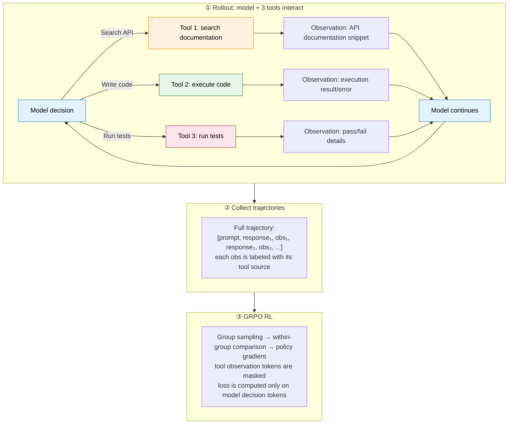
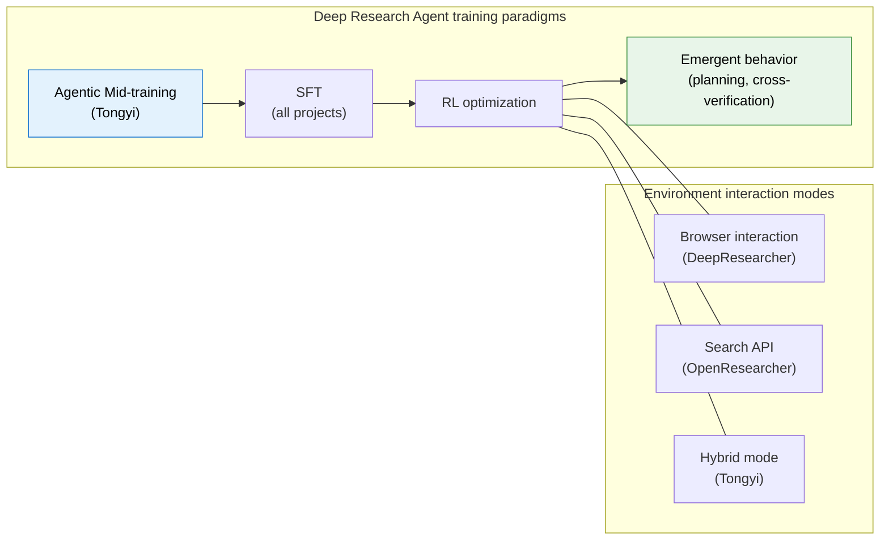
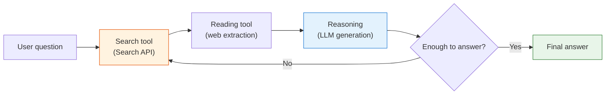

# Legacy Page: Project Practice (Split into Two Project Pages)

> This page is kept as an entry point for legacy links. The core content has been moved to [10.4 rLLM DeepCoder Lab](./rllm-deepcoder-lab) and [10.5 Deep Research Agent](./deep-research-agent). The original material is preserved below so readers arriving through old links can compare it with the newer pages.

# Project 1: Multi-Tool Agentic RL: Search Documentation, Write Code, Run Tests

The previous experiments compared ORM and PRM with simulated data. But those trajectories were synthetic. In this section, we do something more concrete: **give the model three tools, documentation search, code execution, and test execution, and let it learn when to search, when to write code, and when to run tests. After GRPO training, the model obtains a real improvement on a code-generation benchmark.**

This is not a single-tool loop of "write code -> see the error -> fix it." This is **agentic RL in the real sense**: the model must make decisions among multiple tools and learn a tool-selection policy.

The full experiment can be run on a single 24 GB GPU, such as an RTX 4090 or A5000. We use **Qwen2.5-Coder-3B-Instruct** as the base model.

> The experiment design follows MURPHY (multi-turn GRPO for self-correcting code generation), CodeGym (ICLR 2026, a multi-tool RL environment), and VerlTool (a unified multi-tool RL framework). The training data uses KodCode, a synthetic code-problem dataset, and the evaluation uses BigCodeBench-Hard.



## Why Is This Real Agentic RL?

With one tool, as in MURPHY or in the earlier experiment, the model only learns to call a code executor. In essence, this is "multi-turn RLVR."

With multiple tools, as in this experiment, the model must choose among **documentation search, code execution, and test execution**. That is why it is agentic: the central capability is the **tool-selection policy**.

| Capability                           | Single tool | Multi-tool (this experiment) |
| ------------------------------------ | ----------- | ---------------------------- |
| Write code                           | Yes         | Yes                          |
| Inspect errors and fix code          | Yes         | Yes                          |
| Search unfamiliar API documentation  | **No**      | **Yes**                      |
| Run a test suite and inspect failure | **No**      | **Yes**                      |
| Learn **which tool to use when**     | Not needed  | **Core learning objective**  |

## Step Zero: Environment Setup

```bash
pip install torch transformers accelerate datasets
pip install matplotlib numpy peft
```

```python
# ==========================================
# 0. Global configuration
# ==========================================
import torch, numpy as np, random, re, os, subprocess, tempfile, warnings
warnings.filterwarnings("ignore")

SEED = 42
MODEL_NAME = "Qwen/Qwen2.5-Coder-3B-Instruct"
MAX_NEW_TOKENS = 1024
GROUP_SIZE = 4
MAX_EPOCHS = 3
LR = 5e-6
KL_COEFF = 0.05
MAX_TURNS = 5

device = "cuda" if torch.cuda.is_available() else "cpu"
random.seed(SEED); np.random.seed(SEED); torch.manual_seed(SEED)
print(f"Device: {device}")
```

## Step 1: Load the Model, Build the Tool Environment, and Load Data

### 1.1 Load the model

```python
from transformers import AutoModelForCausalLM, AutoTokenizer

tokenizer = AutoTokenizer.from_pretrained(MODEL_NAME)
if tokenizer.pad_token is None:
    tokenizer.pad_token = tokenizer.eos_token

model = AutoModelForCausalLM.from_pretrained(
    MODEL_NAME,
    torch_dtype=torch.bfloat16 if torch.cuda.is_bf16_supported() else torch.float16,
    device_map="auto",
)
model.eval()
for p in model.parameters():
    p.requires_grad = False
print(f"Model: {MODEL_NAME} ({sum(p.numel() for p in model.parameters())/1e9:.2f}B)")
```

### 1.2 Tool 1: API documentation search engine

When the model does not know how to use a library, it can search documentation. We first build a small documentation index covering the Python standard library and commonly used third-party libraries.

```python
# ==========================================
# 1.2 Tool 1: documentation search engine
#     The model calls <search>query</search> to obtain relevant API documentation.
# ==========================================

# Prebuilt documentation store: selected core APIs from common modules.
DOC_STORE = {
    "collections": {
        "Counter": "Counter(iterable) -> dict subclass. Count hashable objects. Methods: most_common(n), elements(), update(iterable), subtract(iterable). Example: c = Counter('abcabc'); c.most_common(2) -> [('a', 2), ('b', 2)]",
        "defaultdict": "defaultdict(default_factory) -> dict subclass. Missing keys get default_factory(). Example: d = defaultdict(list); d['k'].append(1)",
        "OrderedDict": "OrderedDict() -> dict subclass that remembers insertion order. Methods: move_to_end(key), popitem(last=True)",
        "deque": "deque(iterable, maxlen=None) -> double-ended queue. Methods: append(x), appendleft(x), pop(), popleft(), rotate(n)",
        "namedtuple": "namedtuple(typename, field_names) -> tuple subclass with named fields. Example: Point = namedtuple('Point', ['x', 'y']); p = Point(1, 2)",
        "ChainMap": "ChainMap(*maps) -> group multiple dicts. Lookups search each dict in order",
    },
    "itertools": {
        "combinations": "combinations(iterable, r) -> iterator of r-length subsequences. Example: list(combinations('ABC', 2)) -> [('A','B'), ('A','C'), ('B','C')]",
        "permutations": "permutations(iterable, r=None) -> iterator of r-length permutations",
        "product": "product(*iterables, repeat=1) -> cartesian product. Example: list(product('AB', '12')) -> [('A','1'),('A','2'),('B','1'),('B','2')]",
        "groupby": "groupby(iterable, key=None) -> consecutive groups. MUST sort first! Example: for k, g in groupby(sorted(data, key=fn), key=fn)",
        "chain": "chain(*iterables) -> chain multiple iterables. chain.from_iterable(iterable) flattens one level",
        "accumulate": "accumulate(iterable, func=operator.add) -> running totals. Example: list(accumulate([1,2,3])) -> [1, 3, 6]",
        "islice": "islice(iterable, start, stop[, step]) -> iterator slicing without creating list",
    },
    "functools": {
        "lru_cache": "@lru_cache(maxsize=128) -> memoization decorator. Example: @lru_cache(maxsize=None)\\ndef fib(n): return n if n < 2 else fib(n-1) + fib(n-2)",
        "reduce": "reduce(function, iterable[, initializer]) -> reduce iterable to single value. Example: reduce(lambda x,y: x+y, [1,2,3]) -> 6",
        "partial": "partial(func, *args, **kwargs) -> fix some arguments. Example: double = partial(operator.mul, 2); double(3) -> 6",
        "cmp_to_key": "cmp_to_key(mycmp) -> convert cmp function to key function for sorted()",
    },
    "re": {
        "findall": "re.findall(pattern, string, flags=0) -> list of all matches. Example: re.findall(r'\\d+', 'a1b22c') -> ['1', '22']",
        "search": "re.search(pattern, string) -> Match object or None. .group() for match, .start()/.end() for position",
        "match": "re.match(pattern, string) -> Match only at beginning of string",
        "sub": "re.sub(pattern, repl, string, count=0) -> substitute. Example: re.sub(r'\\d+', 'N', 'a1b22') -> 'aNbN'",
        "split": "re.split(pattern, string, maxsplit=0) -> split by pattern. Example: re.split(r'[,;]', 'a,b;c') -> ['a', 'b', 'c']",
    },
    "json": {
        "loads": "json.loads(s) -> parse JSON string to Python object. Example: json.loads('{\"a\": 1}') -> {'a': 1}",
        "dumps": "json.dumps(obj, indent=None) -> serialize to JSON string. Example: json.dumps({'a': 1}) -> '{\"a\": 1}'",
        "load": "json.load(fp) -> parse JSON from file object",
        "dump": "json.dump(obj, fp) -> write JSON to file",
    },
    "math": {
        "gcd": "math.gcd(*integers) -> greatest common divisor. Example: math.gcd(12, 8) -> 4",
        "lcm": "math.lcm(*integers) -> least common multiple. Example: math.lcm(4, 6) -> 12",
        "comb": "math.comb(n, k) -> binomial coefficient C(n,k). Example: math.comb(10, 3) -> 120",
        "perm": "math.perm(n, k=None) -> permutations P(n,k)",
        "isqrt": "math.isqrt(n) -> integer square root. Example: math.isqrt(10) -> 3",
        "log": "math.log(x, base=e) -> logarithm. math.log2(x), math.log10(x) also available",
        "ceil": "math.ceil(x) -> smallest integer >= x. math.floor(x) -> largest integer <= x",
    },
    "string": {
        "ascii_lowercase": "string.ascii_lowercase -> 'abcdefghijklmnopqrstuvwxyz'",
        "ascii_uppercase": "string.ascii_uppercase -> 'ABCDEFGHIJKLMNOPQRSTUVWXYZ'",
        "digits": "string.digits -> '0123456789'",
        "ascii_letters": "string.ascii_letters -> ascii_lowercase + ascii_uppercase",
        "Template": "string.Template('$name is $age') -> safe string substitution. .substitute(dict) or .safe_substitute(dict)",
    },
    "heapq": {
        "heappush": "heapq.heappush(heap, item) -> push item onto heap. heap is a plain list",
        "heappop": "heapq.heappop(heap) -> pop smallest item. heapq.heappushpop(heap, item) more efficient",
        "nlargest": "heapq.nlargest(n, iterable, key=None) -> n largest elements. heapq.nsmallest(n, ...) also available",
        "heapify": "heapq.heapify(list) -> transform list into heap in-place in O(n)",
    },
    "bisect": {
        "bisect_left": "bisect.bisect_left(a, x) -> insertion point for x in sorted list a (leftmost). bisect_right for rightmost",
        "insort": "bisect.insort(a, x) -> insert x into sorted list a maintaining order",
    },
    "datetime": {
        "datetime": "datetime.datetime(year, month, day, hour=0, minute=0, second=0). Methods: .strftime(format), .date(), .weekday()",
        "timedelta": "datetime.timedelta(days=0, seconds=0, microseconds=0). Supports +, -, * with datetime",
        "strptime": "datetime.datetime.strptime(date_string, format) -> parse string. Format: %Y, %m, %d, %H, %M, %S",
    },
    "typing": {
        "List": "List[int] -> list of integers. List[str] -> list of strings",
        "Dict": "Dict[str, int] -> dict with string keys and int values",
        "Optional": "Optional[int] -> int or None. Equivalent to Union[int, None]",
        "Tuple": "Tuple[int, str] -> tuple of (int, str). Tuple[int, ...] -> variable length",
    },
    "pathlib": {
        "Path": "Path('dir/file.txt') -> path object. Methods: .read_text(), .write_text(), .exists(), .is_file(), .mkdir(), .glob(pattern)",
    },
    "numpy": {
        "array": "np.array([1,2,3]) -> ndarray. np.zeros(shape), np.ones(shape), np.arange(start,stop,step), np.linspace(start,stop,num)",
        "reshape": "arr.reshape(shape) -> reshape array. -1 infers dimension. arr.flatten() -> 1D copy",
        "argsort": "np.argsort(arr) -> indices that would sort. arr[np.argsort(arr)] == sorted arr",
        "unique": "np.unique(arr, return_counts=False) -> sorted unique values. return_counts=True adds counts",
        "where": "np.where(condition, x, y) -> element-wise conditional. np.where(condition) -> indices where True",
        "dot": "np.dot(a, b) -> matrix multiplication. a @ b is equivalent",
        "sum": "np.sum(arr, axis=None) -> sum. axis=0 sum columns, axis=1 sum rows",
    },
    "pandas": {
        "DataFrame": "pd.DataFrame(data) -> create DataFrame from dict/list. pd.read_csv(path) -> read CSV",
        "groupby": "df.groupby('col') -> GroupBy object. .agg(func), .mean(), .sum(), .count()",
        "merge": "pd.merge(df1, df2, on='key', how='inner') -> join. how: 'left', 'right', 'outer'",
        "value_counts": "series.value_counts() -> frequency of unique values, sorted descending",
        "apply": "df['col'].apply(func) -> apply function to each element. df.apply(func, axis=1) per row",
    },
}


def tool_search(query: str, top_k: int = 3) -> str:
    """
    Tool 1: documentation search. Triggered when the model calls <search>query</search>.
    Returns API documentation snippets most relevant to the query.
    """
    query_lower = query.lower()
    results = []
    for module, apis in DOC_STORE.items():
        for api_name, doc in apis.items():
            # Simple keyword matching.
            score = 0
            for word in query_lower.split():
                if word in api_name.lower():
                    score += 3
                if word in doc.lower():
                    score += 1
                if word in module.lower():
                    score += 2
            if score > 0:
                results.append((score, f"[{module}.{api_name}]\n{doc}"))

    results.sort(key=lambda x: -x[0])
    if not results:
        return "No documentation found. Try different keywords."

    return "\n\n".join(doc for _, doc in results[:top_k])
```

### 1.3 Tool 2: Code executor, and Tool 3: Test runner

```python
# ==========================================
# 1.3 Tools 2 and 3: code executor and test runner
# ==========================================

def tool_execute(code: str, timeout: float = 10.0) -> dict:
    """Tool 2: execute Python code and return stdout/stderr."""
    with tempfile.TemporaryDirectory() as tmpdir:
        path = os.path.join(tmpdir, "exec.py")
        with open(path, "w") as f:
            f.write(code)
        try:
            r = subprocess.run(["python", path], capture_output=True, text=True,
                               timeout=timeout, cwd=tmpdir)
            return {
                "success": r.returncode == 0,
                "output": r.stdout.strip()[:500],
                "error": r.stderr.strip()[:300] if r.returncode != 0 else None,
            }
        except subprocess.TimeoutExpired:
            return {"success": False, "output": "", "error": "TIMEOUT"}


def tool_test(code: str, test_code: str, timeout: float = 10.0) -> dict:
    """Tool 3: run code plus tests and return detailed pass/fail information."""
    full_code = code + "\n\n" + test_code
    with tempfile.TemporaryDirectory() as tmpdir:
        path = os.path.join(tmpdir, "test.py")
        with open(path, "w") as f:
            f.write(full_code)
        try:
            r = subprocess.run(["python", path], capture_output=True, text=True,
                               timeout=timeout, cwd=tmpdir)
            if r.returncode == 0:
                return {"passed": True, "detail": "All tests passed", "output": r.stdout.strip()[:200]}
            else:
                # Parse the failure information.
                err = r.stderr.strip()
                return {"passed": False, "detail": err[-300:] if err else "unknown error",
                        "output": r.stdout.strip()[:200]}
        except subprocess.TimeoutExpired:
            return {"passed": False, "detail": "TIMEOUT", "output": ""}
```

### 1.4 Load training and evaluation data

```python
from datasets import load_dataset

# Training data: KodCode, a synthetic code-problem dataset that does not overlap with the evaluation set.
# Following MURPHY, 1,000 KodCode examples are enough to produce a measurable effect.
kodcode = load_dataset("KodCode/KodCode-V1", split="train")
# Filter for easy/medium difficulty and take 1,000 examples.
kodcode_easy = kodcode.filter(lambda x: x["gpt_difficulty"] in ["easy", "medium"])
train_data = list(kodcode_easy.shuffle(seed=SEED).select(range(1000)))
print(f"Training data: {len(train_data)} KodCode problems (easy/medium)")

# Evaluation data: BigCodeBench-Hard, 148 problems requiring diverse library use.
# BigCodeBench is much harder than HumanEval, and API documentation lookup is often necessary.
eval_data = load_dataset("bigcode/bigcodebench-hard", split="v0.1.4")
print(f"Evaluation data: {len(eval_data)} BigCodeBench-Hard problems")
```

## Step 2: Agent Prompt and Tool-Call Parsing

````python
# ==========================================
# 2. Agent system prompt: tell the model that 3 tools are available.
# ==========================================

AGENT_PROMPT = """You are a Python expert. You have 3 tools available:

1. **Search documentation**: Use when you need to look up an unfamiliar API.
   Format: <search>your query</search>
   Example: <search>Counter most_common</search>

2. **Execute code**: Run Python code to test ideas or compute results.
   Format:
   ```python
   # your code
   print(result)
   ```

3. **Run tests**: Submit your final solution to be tested.
   Format:
   ```submit
   def your_solution(...):
       ...
   ```

Strategy: Search docs BEFORE writing code if you're unsure about an API.
Test your code with tool 2 before submitting with tool 3.
You can use tools in any order and multiple times."""

SEARCH_PATTERN = re.compile(r'<search>(.*?)</search>', re.DOTALL)
CODE_PATTERN = re.compile(r'```(?:python|py)?\n(.*?)\n```', re.DOTALL)
SUBMIT_PATTERN = re.compile(r'```submit\n(.*?)\n```', re.DOTALL)
PAD_ID = tokenizer.pad_token_id
````

```python
def parse_tool_calls(text: str) -> list:
    """Parse tool calls from the model output."""
    calls = []
    # Sort by position: handle earlier calls first.
    for m in SEARCH_PATTERN.finditer(text):
        calls.append(("search", m.group(1).strip(), m.start()))
    for m in CODE_PATTERN.finditer(text):
        calls.append(("execute", m.group(1).strip(), m.start()))
    for m in SUBMIT_PATTERN.finditer(text):
        calls.append(("submit", m.group(1).strip(), m.start()))
    calls.sort(key=lambda x: x[2])
    return calls
```

## Step 3: Multi-Tool Agent Rollout

```python
# ==========================================
# 3. Multi-tool Agent rollout (core logic)
#    The model autonomously decides among the 3 tools.
# ==========================================

def run_multi_tool_rollout(task_prompt: str, task_test: str, entry_point: str,
                           temperature=0.7, max_turns=MAX_TURNS, verbose=False):
    """
    Multi-tool Agent rollout.

    Key design choices, aligned with Search-R1, VerlTool, and CodeGym:
    1. The model chooses which tool to call: search, execute, or test.
    2. Tokens are appended incrementally at token level.
    3. Tool observation tokens are fully masked and do not contribute to loss.
    4. Only model decision tokens participate in the loss.
    """
    init_messages = [
        {"role": "system", "content": AGENT_PROMPT},
        {"role": "user", "content": task_prompt},
    ]
    prompt_text = tokenizer.apply_chat_template(init_messages, tokenize=False, add_generation_prompt=True)
    prompt_ids = tokenizer.encode(prompt_text, add_special_tokens=False)

    real_ids = list(prompt_ids)
    masked_ids = list(prompt_ids)  # The prompt part is identical in both streams.

    submitted_code = None
    test_passed = False
    is_valid = True
    tool_usage = {"search": 0, "execute": 0, "submit": 0, "none": 0}

    for turn_idx in range(max_turns):
        input_t = torch.tensor([real_ids], dtype=torch.long).to(device)
        attn_t = torch.ones_like(input_t)

        with torch.no_grad():
            out = model.generate(
                input_ids=input_t, attention_mask=attn_t,
                max_new_tokens=MAX_NEW_TOKENS,
                temperature=temperature, do_sample=temperature > 0,
                top_p=0.95, pad_token_id=PAD_ID
            )

        gen_ids = out[0][input_t.shape[1]:].tolist()
        response_text = tokenizer.decode(gen_ids, skip_special_tokens=True)

        # Append model-generated tokens to both real_ids and masked_ids.
        real_ids.extend(gen_ids)
        masked_ids.extend(gen_ids)

        # --- Parse tool calls. ---
        calls = parse_tool_calls(response_text)

        if not calls:
            tool_usage["none"] += 1
            continue

        # Process only the last tool call, which is the most common pattern.
        tool_type, tool_input, _ = calls[-1]
        tool_usage[tool_type] += 1

        # --- Execute the tool and construct the observation. ---
        if tool_type == "search":
            doc_result = tool_search(tool_input)
            obs_text = f"\n<doc_result>\n{doc_result[:500]}\n</doc_result>\n"
            if verbose:
                print(f"  Turn {turn_idx+1} [SEARCH]: {tool_input[:40]}")

        elif tool_type == "execute":
            exec_result = tool_execute(tool_input)
            if exec_result["success"]:
                obs_text = f"\n<exec_result>\n{exec_result['output'][:300]}\n</exec_result>\n"
            else:
                err = exec_result.get("error", "unknown") or "unknown"
                obs_text = f"\n<exec_result>\nERROR: {err[:200]}\n</exec_result>\n"
            if verbose:
                status = "OK" if exec_result["success"] else "ERR"
                print(f"  Turn {turn_idx+1} [EXEC]: {status}")

        elif tool_type == "submit":
            submitted_code = tool_input
            # Run tests.
            test_result = tool_test(tool_input, task_test, entry_point)
            test_passed = test_result["passed"]
            detail = test_result["detail"][:300]
            obs_text = f"\n<test_result>\n{'PASS' if test_passed else 'FAIL'}: {detail}\n</test_result>\n"
            if not test_passed:
                obs_text += "Fix your code and submit again.\n"
            if verbose:
                print(f"  Turn {turn_idx+1} [SUBMIT]: {'PASS' if test_passed else 'FAIL'}")

        obs_ids = tokenizer.encode(obs_text, add_special_tokens=False)
        # Observation tokens are preserved in real_ids but replaced by PAD in masked_ids.
        real_ids.extend(obs_ids)
        masked_ids.extend([PAD_ID] * len(obs_ids))

        # End if the submission passes.
        if tool_type == "submit" and test_passed:
            break

    # Final verification.
    if submitted_code:
        final_test = tool_test(submitted_code, task_test, entry_point)
        test_passed = final_test["passed"]
    else:
        test_passed = False

    # Build info_mask.
    ids_tensor = torch.tensor([real_ids], dtype=torch.long)
    masked_tensor = torch.tensor([masked_ids], dtype=torch.long)
    info_mask = (masked_tensor != PAD_ID).long()
    labels = ids_tensor.clone()
    labels[info_mask == 0] = -100

    return {
        "input_ids": ids_tensor,
        "attention_mask": torch.ones_like(ids_tensor),
        "labels": labels,
        "info_mask": info_mask,
        "submitted_code": submitted_code,
        "passed": test_passed,
        "is_valid": is_valid,
        "turns": turn_idx + 1,
        "tool_usage": tool_usage,
    }
```

### 3.1 Verify the rollout

```python
# Quick sanity check for multi-tool rollout.
print("Sanity check — Multi-Tool Agent Rollout:")
print("-" * 60)
for i in [0, 5, 10]:
    item = eval_data[i]
    result = run_multi_tool_rollout(
        item["instruct_prompt"], item["test"], item["entry_point"],
        temperature=0.3, verbose=True
    )
    n_assist = result["info_mask"].sum().item()
    n_tool = (result["info_mask"] == 0).sum().item()
    print(f"  {item['task_id']}: {'PASS' if result['passed'] else 'FAIL'} "
          f"(turns: {result['turns']}, LLM: {n_assist}, tool: {n_tool}, "
          f"tools used: {result['tool_usage']})")
print("-" * 60)
```

## Step 4: Baseline Evaluation: Single-Turn No-Tool vs Single-Tool vs Multi-Tool

First inspect the baseline under different tool configurations, so the value of multiple tools can be measured.

```python
# ==========================================
# 4. Baseline evaluation: three-way comparison
# ==========================================
EVAL_N = 50  # Evaluate 50 problems first.

def eval_no_tools(model_to_eval, data, n):
    """Single-turn generation without any tools."""
    model_to_eval.eval()
    results = []
    for i, item in enumerate(list(data)[:n]):
        messages = [{"role": "user", "content": item["instruct_prompt"]}]
        text = tokenizer.apply_chat_template(messages, tokenize=False, add_generation_prompt=True)
        inputs = tokenizer(text, return_tensors="pt").to(device)
        with torch.no_grad():
            out = model_to_eval.generate(**inputs, max_new_tokens=MAX_NEW_TOKENS,
                                         temperature=0.0, pad_token_id=PAD_ID)
        code = tokenizer.decode(out[0][inputs["input_ids"].shape[1]:], skip_special_tokens=True)
        test_result = tool_test(code, item["test"], item["entry_point"])
        results.append(test_result["passed"])
        if (i+1) % 25 == 0:
            print(f"  [No-Tools] {i+1}/{n}: {sum(results)/len(results):.1%}")
    return sum(results) / len(results)

def eval_code_only(model_to_eval, data, n):
    """Only the code executor is available, similar to MURPHY."""
    model_to_eval.eval()
    results = []
    for i, item in enumerate(list(data)[:n]):
        result = run_multi_tool_rollout(
            item["instruct_prompt"], item["test"], item["entry_point"],
            temperature=0.0, max_turns=3
        )
        results.append(result["passed"])
        if (i+1) % 25 == 0:
            print(f"  [Code-Only] {i+1}/{n}: {sum(results)/len(results):.1%}")
    return sum(results) / len(results)

def eval_multi_tool(model_to_eval, data, n, label="Multi-Tool"):
    """All 3 tools are enabled."""
    model_to_eval.eval()
    results = []
    for i, item in enumerate(list(data)[:n]):
        result = run_multi_tool_rollout(
            item["instruct_prompt"], item["test"], item["entry_point"],
            temperature=0.0, max_turns=5
        )
        results.append(result["passed"])
        if (i+1) % 25 == 0:
            print(f"  [{label}] {i+1}/{n}: {sum(results)/len(results):.1%}")
    return sum(results) / len(results)

print("BASELINE EVALUATION (before training)")
print("=" * 60)
baseline_notools = eval_no_tools(model, eval_data, EVAL_N)
baseline_codeonly = eval_code_only(model, eval_data, EVAL_N)
baseline_multitool = eval_multi_tool(model, eval_data, EVAL_N, "Baseline-MultiTool")
print(f"\n  No tools:     {baseline_notools:.1%}")
print(f"  Code only:    {baseline_codeonly:.1%}")
print(f"  Multi-tool:   {baseline_multitool:.1%}")
print("=" * 60)
```

## Step 5: Batch Rollout and GRPO RL Training

```python
# ==========================================
# 5. GRPO RL training: the model learns a multi-tool strategy.
# ==========================================
from peft import LoraConfig, get_peft_model, TaskType
from torch.optim import AdamW

# Prepare the training model and the reference model.
model_rl = AutoModelForCausalLM.from_pretrained(
    MODEL_NAME,
    torch_dtype=torch.bfloat16 if torch.cuda.is_bf16_supported() else torch.float16,
    device_map="auto",
)
model_rl.enable_input_require_grads()
model_rl = get_peft_model(model_rl, LoraConfig(
    task_type=TaskType.CAUSAL_LM, r=16, lora_alpha=32,
    lora_dropout=0.05, target_modules=["q_proj", "v_proj"],
))

ref_model = AutoModelForCausalLM.from_pretrained(
    MODEL_NAME,
    torch_dtype=torch.bfloat16 if torch.cuda.is_bf16_supported() else torch.float16,
    device_map="auto",
)
ref_model.eval()
for p in ref_model.parameters():
    p.requires_grad = False

optimizer_rl = AdamW(filter(lambda p: p.requires_grad, model_rl.parameters()), lr=LR)

training_log = {"epoch": [], "pass_rate": [], "mean_reward": [], "loss": [],
                "search_rate": [], "submit_rate": []}

# Use a subset of the training set for the demo.
TRAIN_SUBSET = list(range(0, 500, 5))  # 100 problems
train_subset = [train_data[i] for i in TRAIN_SUBSET]

print("=" * 60)
print("GRPO RL Training — Multi-Tool Agent")
print("=" * 60)

for epoch in range(MAX_EPOCHS):
    model_rl.train()
    epoch_rewards, epoch_losses = [], []
    epoch_passed = 0
    epoch_tool_stats = {"search": 0, "execute": 0, "submit": 0, "none": 0}
    random.shuffle(train_subset)

    for task_idx, item in enumerate(train_subset):
        # KodCode's test field contains the test code.
        task_test = item.get("test", "")
        task_prompt = item["question"]
        # Construct a simple entry_point adapted to the KodCode format.
        entry_point = "solution"

        # ---- Phase 1: On-policy rollout ----
        trajectories = []
        for g in range(GROUP_SIZE):
            result = run_multi_tool_rollout(
                task_prompt, task_test, entry_point,
                temperature=0.7, max_turns=MAX_TURNS
            )
            # Reward design:
            # 1. Outcome reward: whether tests pass.
            reward = 1.0 if result["passed"] else 0.0
            # 2. Tool-use shaping: if the model searched but still failed, give a small positive reward to encourage exploration.
            if not result["passed"] and result["tool_usage"]["search"] > 0:
                reward = 0.05 * min(result["tool_usage"]["search"], 3)
            # 3. Small negative reward if the model never submitted code.
            if not result["submitted_code"]:
                reward = -0.1
            result["reward"] = reward
            trajectories.append(result)

        # ---- Phase 2: GRPO advantage ----
        rewards = np.array([t["reward"] for t in trajectories])
        mean_r, std_r = rewards.mean(), rewards.std() + 1e-8
        advantages = (rewards - mean_r) / std_r

        # ---- Phase 3: Policy-gradient update ----
        for traj, advantage in zip(trajectories, advantages):
            input_ids = traj["input_ids"].to(device)
            attention_mask = traj["attention_mask"].to(device)
            labels = traj["labels"].to(device)
            info_mask = traj["info_mask"].to(device)

            if (info_mask == 1).sum() == 0:
                continue

            outputs = model_rl(input_ids=input_ids, attention_mask=attention_mask, labels=labels)
            policy_lp = -outputs.loss

            with torch.no_grad():
                ref_out = ref_model(input_ids=input_ids, attention_mask=attention_mask, labels=labels)
                ref_lp = -ref_out.loss

            kl = policy_lp - ref_lp
            loss = -advantage * policy_lp + KL_COEFF * kl

            optimizer_rl.zero_grad()
            loss.backward()
            torch.nn.utils.clip_grad_norm_(model_rl.parameters(), 1.0)
            optimizer_rl.step()
            epoch_losses.append(loss.item())

        epoch_rewards.extend(rewards.tolist())
        epoch_passed += sum(1 for t in trajectories if t["passed"])
        for t in trajectories:
            for k in epoch_tool_stats:
                epoch_tool_stats[k] += t["tool_usage"].get(k, 0)

        if (task_idx + 1) % 25 == 0:
            pr = epoch_passed / ((task_idx+1) * GROUP_SIZE)
            total_tools = sum(epoch_tool_stats.values())
            sr = epoch_tool_stats["search"] / max(total_tools, 1)
            print(f"  Epoch {epoch+1} | Task {task_idx+1}/{len(train_subset)} | "
                  f"Pass: {pr:.1%} | Search rate: {sr:.1%}")

    # Epoch summary.
    pr = epoch_passed / (len(train_subset) * GROUP_SIZE)
    total_tools = sum(epoch_tool_stats.values())
    training_log["epoch"].append(epoch+1)
    training_log["pass_rate"].append(pr)
    training_log["mean_reward"].append(np.mean(epoch_rewards))
    training_log["loss"].append(np.mean(epoch_losses) if epoch_losses else 0)
    training_log["search_rate"].append(epoch_tool_stats["search"] / max(total_tools, 1))
    training_log["submit_rate"].append(epoch_tool_stats["submit"] / max(total_tools, 1))
    print(f"  Epoch {epoch+1} Summary: Pass={pr:.1%}, Reward={np.mean(epoch_rewards):.3f}, "
          f"Loss={training_log['loss'][-1]:.4f}, SearchRate={training_log['search_rate'][-1]:.1%}")

model_rl.eval()
```

## Step 6: Post-Training Evaluation: Did the Model Really Learn a Multi-Tool Strategy?

```python
# ==========================================
# 6. Post-training evaluation
# ==========================================

print("=" * 60)
print("POST-TRAINING Evaluation on BigCodeBench-Hard")
print("=" * 60)

rl_notools = eval_no_tools(model_rl, eval_data, EVAL_N)
rl_multitool = eval_multi_tool(model_rl, eval_data, EVAL_N, "RL-MultiTool")

print("\n" + "=" * 60)
print("FINAL COMPARISON")
print("=" * 60)
print(f"  {'Method':<25} {'Pass@1':>8}")
print(f"  {'-'*33}")
print(f"  {'Baseline (no tools)':<25} {baseline_notools:>7.1%}")
print(f"  {'Baseline (code only)':<25} {baseline_codeonly:>7.1%}")
print(f"  {'Baseline (multi-tool)':<25} {baseline_multitool:>7.1%}")
print(f"  {'RL (no tools)':<25} {rl_notools:>7.1%}")
print(f"  {'RL (multi-tool)':<25} {rl_multitool:>7.1%}")
print(f"  {'-'*33}")
print(f"  {'Multi-tool gain':<25} {rl_multitool - baseline_notools:>+7.1%}")
print(f"  {'RL tool-learning gain':<25} {rl_multitool - baseline_multitool:>+7.1%}")
print("=" * 60)
```

### Visualization

```python
import matplotlib.pyplot as plt
import matplotlib
matplotlib.rcParams['font.sans-serif'] = ['Arial Unicode MS', 'SimHei', 'sans-serif']
matplotlib.rcParams['axes.unicode_minus'] = False

fig, axes = plt.subplots(1, 3, figsize=(18, 5))

# --- Left: Pass@1 comparison ---
ax = axes[0]
methods = ['No Tools\n(Baseline)', 'Code Only\n(Baseline)', 'Multi-Tool\n(Baseline)', 'Multi-Tool\n(After RL)']
pass_rates = [baseline_notools, baseline_codeonly, baseline_multitool, rl_multitool]
colors = ['#bdbdbd', '#90a4ae', '#42a5f5', '#66bb6a']

bars = ax.bar(methods, pass_rates, color=colors, edgecolor='#333', linewidth=1.5)
ax.set_ylabel('pass@1')
ax.set_title(f'BigCodeBench-Hard (n={EVAL_N})', fontweight='bold')
ax.set_ylim(0, max(max(pass_rates) * 1.5, 0.2))

for bar, v in zip(bars, pass_rates):
    ax.text(bar.get_x() + bar.get_width()/2., v + 0.01,
            f'{v:.1%}', ha='center', fontsize=12, fontweight='bold')

best = np.argmax(pass_rates)
if pass_rates[best] > pass_rates[0]:
    ax.annotate(f'+{(pass_rates[best]-pass_rates[0])*100:.1f}pp',
                xy=(best, pass_rates[best]), xytext=(best, pass_rates[best]+0.06),
                fontsize=13, fontweight='bold', color='#2e7d32',
                arrowprops=dict(arrowstyle='->', color='#2e7d32', lw=2))

# --- Middle: training process ---
ax = axes[1]
epochs = training_log["epoch"]
ax.plot(epochs, [p*100 for p in training_log["pass_rate"]], 'o-', color='#388e3c', lw=2, label='Pass Rate (%)')
ax.plot(epochs, training_log["mean_reward"], 's--', color='#1976d2', lw=2, label='Mean Reward')
ax.set_xlabel('Epoch')
ax.set_title('GRPO RL Training', fontweight='bold')
ax.legend()
ax.grid(True, alpha=0.3)

# --- Right: tool-use-rate change ---
ax = axes[2]
ax.plot(epochs, [s*100 for s in training_log["search_rate"]], 'o-', color='#f57c00', lw=2, label='Search Rate (%)')
ax.plot(epochs, [s*100 for s in training_log["submit_rate"]], 's-', color='#c62828', lw=2, label='Submit Rate (%)')
ax.set_xlabel('Epoch')
ax.set_title('Tool Selection Strategy', fontweight='bold')
ax.legend()
ax.grid(True, alpha=0.3)

plt.suptitle('Multi-Tool Agentic RL: Qwen2.5-Coder-3B on BigCodeBench-Hard', fontsize=14, fontweight='bold')
plt.tight_layout()
plt.savefig("multi_tool_agentic_rl.png", dpi=150)
print("Saved: multi_tool_agentic_rl.png")
```

## Reference: Open-Source Projects for Multi-Tool Agentic RL

| Project                 | Tools                            | Evaluation benchmark               | Key property                                  |
| ----------------------- | -------------------------------- | ---------------------------------- | --------------------------------------------- |
| **MURPHY**              | Code execution + tests           | HumanEval, MBPP, BigCodeBench-Hard | Multi-turn GRPO, +8% with a 1.7B model        |
| **CodeGym** (ICLR'26)   | Synthetic multi-tool environment | OOD generalization evaluation      | Automatically generated RL environments       |
| **VerlTool**            | Code/search/SQL/vision/SWE       | AIME, NQ, Spider, SWE-Verified     | Unified multi-domain framework                |
| **Search-R1**           | Search engine                    | NQ, HotpotQA, TriviaQA             | Search-token masking                          |
| **SimpleTIR** (ICLR'26) | Code sandbox                     | AIME 2024                          | Void-turn filtering                           |
| **RLEF** (Meta)         | Code execution + tests           | CodeContests                       | SOTA competitive programming with an 8B model |

## Experiment Summary

**What we did**:

1. Gave the model **3 tools**: documentation search, code execution, and test execution.
2. Required the model to **decide autonomously** when to search, when to write code, and when to submit tests.
3. Used GRPO RL to train the model to learn a **tool-selection policy**.
4. Evaluated the real improvement on BigCodeBench-Hard.

**Key design decisions**:

- **3 tools** rather than one: the model learns a tool-selection policy, not just code repair.
- **Documentation search tool**: BigCodeBench-Hard involves diverse Python libraries, so the model often needs to inspect documentation before coding.
- **Token masking**: all tool-returned observation tokens are excluded from loss with `labels = -100`.
- **Reward shaping**: passing tests gives 1.0, using search but failing gives `0.05*n` to encourage exploration, and not submitting gives -0.1.
- **Training data**: synthetic KodCode problems, separated from BigCodeBench; 1,000 examples are enough according to MURPHY.
- **Evaluation separation**: KodCode for training, BigCodeBench-Hard for evaluation.

**Expected results**:

- After RL training, the model should use the search tool more often, learning to "look up before writing."
- Multi-tool pass@1 should be meaningfully higher than both the single-tool and no-tool baselines.
- The right plot, "Tool Selection Strategy," should show that the model has learned when to search.

The next section focuses on the engineering challenges of Agentic RL: [how to turn these ideas into a real training system](./tool-use-agents).

---

# Project 2: Deep Research Agent

In the previous sections, we discussed credit assignment in multi-turn RL, trajectory synthesis, and tool-use training for Web Agents and Code Agents. Now we turn to a frontier application that **integrates all of these techniques**: the Deep Research Agent. Its goal is to let AI act more like a human researcher: autonomously performing long-horizon, multi-step information search, analysis, and synthesis, and eventually producing a trustworthy research report.

During 2025-2026, the Deep Research Agent became one of the hottest application directions for Agentic RL. This section examines it from six angles: global framing, reasoning paradigms, core systems, reward design, data synthesis, and evaluation.

## What Is a Deep Research Agent?

A Deep Research Agent is not simply "search + summarize." It must solve a more fundamental problem: **how can AI perform robust and trustworthy deep research in a real, complex web environment?** This means it must plan search strategies, cross-check sources, handle dynamic web content, and preserve logical coherence across multi-step reasoning.

Compared with the Web Agent from the previous section, the core difference is:

| Dimension            | Web Agent                                                                   | Deep Research Agent                                                                                |
| -------------------- | --------------------------------------------------------------------------- | -------------------------------------------------------------------------------------------------- |
| Task objective       | Complete one operation, such as booking a ticket or searching for a product | Comprehensive research, including multi-source analysis, cross-verification, and report generation |
| Interaction rounds   | Usually 3-10                                                                | Usually 20-100+                                                                                    |
| Evaluation criterion | Task success or failure                                                     | Answer accuracy + citation quality + logical rigor                                                 |
| Core challenge       | Element localization and dynamic pages                                      | Long-horizon planning, information synthesis, hallucination control                                |

### Browser Interaction vs Search API: Two Technical Routes

Deep Research Agents interact with the web through two major schools of engineering.

**The browser-interaction route** asks AI to operate a browser like a person: loading dynamic pages, clicking buttons, and filling forms. Representative projects include DeepResearcher, which performs end-to-end RL training in a real web-search environment [^deepresearcher], and WebAgent-R1, which interacts online with web environments. This route can access dynamic and unstructured content, but the engineering complexity and latency are high.

**The search-API route** obtains search results as structured JSON through API calls. Representative projects include OpenResearcher, which works over a large downloaded local corpus with zero network dependency [^openresearcher], and PokeeResearch-7B, which depends on third-party search APIs. This route is efficient, stable, and reproducible, but may miss dynamic content.

The two routes are not mutually exclusive. Frontier systems increasingly combine them. Tongyi DeepResearch, for example, provides high-level tools such as Search, Visit, and a Python Interpreter [^tongyi_dr].

## Reasoning Paradigm: From ReAct to Long-Horizon Research Collaboration

The reasoning style of a Deep Research Agent did not appear all at once. Over the past two years, this line of work has roughly evolved through three levels:

1. **ReAct: a basic closed loop of thinking and acting**
   - The core pattern is Thought -> Action -> Observation.
   - It is suitable for short-chain tasks: search first, open a page, then continue based on the observation.
   - It solves the question of whether the model can begin using tools at all.

2. **Iterative Research: iterative research for long-horizon tasks**
   - When the task changes from "find one answer" to "write a trustworthy research report," plain ReAct is no longer enough.
   - The model must repeatedly execute the cycle of "retrieve -> read -> compare sources -> revise hypotheses -> retrieve again."
   - At this level, the key is no longer just tool invocation, but long-horizon planning, cross-verification, and context compression.

3. **Multi-agent Synthesis: collaborative information synthesis**
   - When the task scale grows further, the system can split one researcher into multiple roles, such as search, reading, evidence organization, and final writing.
   - The value of multiple agents is not only parallel speedup, but also the separation of "finding information" from "synthesizing information," which reduces the cognitive load of a single trajectory.
   - Work such as DeepResearcher and Fathom-DeepResearch reflects this trend.

These three levels can be understood as different stages along the same capability chain: **ReAct opens the tool loop, iterative research lengthens the loop, and multi-agent synthesis structures long-horizon research through division of labor.** The role of Agentic RL is to make the model learn from real feedback when to search, when to stop, and when cross-verification is needed, rather than merely following a tool-use template.

## Core Models and Frameworks

The following are representative open-source Deep Research models and training frameworks. Their shared goal is to evolve an LLM from a "chat model" into a "research model."

### DeepResearcher: End-to-End RL Training

DeepResearcher is the first framework to perform end-to-end RL training in a **real, dynamic, open web environment** [^deepresearcher]. Earlier work mostly trained in controlled RAG environments or relied on carefully designed prompt engineering. DeepResearcher lets the model interact directly with real search engines and web pages, learning from real feedback.

Its architecture uses multi-agent collaboration: specialized Browsing Agents extract information from complex web structures, while the main agent plans the research strategy and synthesizes information. The training objective is pure answer correctness, following RLVR, without process rewards.

**Core finding: emergent behavior.** The most surprising result of DeepResearcher is that RL training caused several advanced behaviors to emerge spontaneously, even though they were **never explicitly trained**:

1. **Planning**: the model learns to decompose the question and form a multi-step search plan before searching.
2. **Cross-verification**: the model actively verifies the same fact from multiple sources instead of trusting the first result.
3. **Self-reflection and redirection**: when search results are poor, the model can adjust its research direction by itself.
4. **Honest expression**: when it cannot find a clear answer, the model learns to say so instead of fabricating.

This shows that the value of RL in agent training is not only "optimizing known strategies." It can also **discover strategies that humans did not design in advance**. This finding has broad implications for Agentic RL: instead of trying to teach every behavior through SFT, it may be better to let the model explore better strategies through RL.

### Tongyi DeepResearch: Agentic Mid-Training + Post-Training

Tongyi DeepResearch from Alibaba's Tongyi Lab is one of the strongest open-source Deep Research systems at present [^tongyi_dr]. It outperforms much larger models such as OpenAI o3 and DeepSeek-V3.1 (671B) on multiple benchmarks, while using only 30.5B total parameters. The key is its MoE architecture: only 3.3B parameters are activated at inference time, giving very high parameter efficiency.

**Two-stage training paradigm.** The central innovation of Tongyi DeepResearch is the two-stage pipeline of **Agentic Mid-training + Post-training**:

1. **Agentic Mid-training (Agentic CPT)**: continuous pretraining on large-scale synthetic tool-use trajectories. It proceeds in two steps: first training basic agentic ability with a 32K context, then expanding to 128K context with long-sequence (64K-128K) agentic behavior data. The goal is not to teach the model "how to do research well," but to give it an **inductive bias for agentic behavior**, so that before seeing specific research tasks, it is already familiar with basic tool-use patterns. A small amount of general pretraining data is mixed in to avoid losing general language ability.

2. **Agentic Post-training**: three steps: SFT cold start on high-quality synthetic trajectories, on-policy RL with customized GRPO in real and simulated environments, and model merging through parameter averaging across variants with different ability preferences.

**Two key techniques.** Beyond the training paradigm, Tongyi DeepResearch has two important engineering innovations:

- **Context Management reasoning paradigm**: the central bottleneck in long-horizon research is the finite context window. Tongyi proposes Context Management based on Markovian state reconstruction. Instead of preserving the full history at every step, it maintains an updated "research report summary" as compressed memory. This lets the model preserve reasoning ability during arbitrarily deep exploration.
- **Staged environment strategy**: different training stages use environments with different fidelity. Mid-training uses a "prior-world environment" with zero cost and zero interaction, plus a low-cost controllable simulated environment. The RL stage of post-training first validates algorithms in simulation, then deploys to a real environment for final training. This strategy addresses the instability, latency, and cost of real environment APIs.

Tongyi DeepResearch reaches SOTA on multiple deep-research benchmarks, including BrowseComp, WebWalkerQA, FRAMES, and HLE [^tongyi_dr].

### PokeeResearch-7B: The Potential of Small Models

PokeeResearch-7B is one of the smallest usable open-source Deep Research models, with only 7B parameters [^pokeeresearch]. Its significance is that it proves a simple point: **deep research ability is not exclusive to very large models**.

The practical lesson is this: if your scenario does not require "expert-level research across all disciplines" and instead focuses on information integration in a specific domain, such as e-commerce, law, or medicine, a 7B-class model plus a well-designed toolchain and data strategy can be fully capable. This greatly lowers the deployment threshold for Deep Research Agents: no A100 cluster is required; a single consumer GPU can be enough.

### SFR-DeepResearch: Autonomous Single Agent

Salesforce's SFR-DeepResearch follows a different route from multi-agent systems: an **autonomous single agent** [^sfr_dr]. It does not split the research process into separate roles such as search, reading, and writing. Instead, one model performs the whole research workflow end to end.

The advantage is **architectural simplicity**: there is no communication overhead or coordination cost among multiple agents. The challenge is also clear: a single model must master search strategy, information synthesis, and long-form generation at the same time, which can create conflicts among capabilities. SFR's solution is to continue agent RL training on top of a reasoning-enhanced model that has already been RL-trained in domains such as math and code, using the model's existing reasoning strength to support research tasks.

### rStar2-Agent: Extreme Training Efficiency

rStar2-Agent demonstrates the potential of efficient RL algorithms [^rstar2]. It trains a 14B reasoning model with a GRPO-based agent RL algorithm. The core idea is: **bigger models are not always better; more precise training methods can matter more**.

Its practical value is that if you are limited by compute and cannot train a 100B+ model, rStar2-Agent provides a feasible alternative: through carefully designed RL algorithms, such as better sampling strategies and more stable gradient estimation, a 14B-class model can still show very strong competitiveness on reasoning tasks.



## Reward and Algorithmic Innovation: Beyond "Only the Final Result"

In Deep Research, a reward that only checks whether the final answer is correct often performs poorly. A research process can span dozens of steps, and a terminal reward alone cannot teach the model effective intermediate strategies. The following work designs more detailed and more intelligent reward functions.

### Citation-Aware Reward: CaRR

**Problem**: The most common and dangerous hallucination in Deep Research Agents is not merely "fabricating facts," but **fabricating citations**: the model makes a plausible claim and attaches a plausible but nonexistent URL, or cites a real paper while distorting its conclusion. Traditional outcome rewards, which only check whether the answer is correct, cannot detect this problem.

**Solution**: Citation-aware Rubric Rewards (CaRR), proposed by Tsinghua University and Zhipu AI [^carr_dr], explicitly encode citation quality into the RL reward. The idea is not to impose a simple penalty, but to compute a positive ratio reward:

1. **Rubric decomposition**: decompose a multi-hop question into atomic factual statements, or rubrics, each containing hidden entities to be verified.
2. **Entity recognition**: a judge model checks whether the final answer identifies the key entities in each rubric.
3. **Citation verification**: extract URLs from the answer, up to 20, fetch their contents, and let a judge model decide whether each rubric is supported by the cited content.
4. **Evidence connectivity**: construct a bipartite graph and use breadth-first search to verify whether each rubric is logically connected to the final answer.

The final reward is the ratio of satisfied and logically connected rubrics to all rubrics. This ratio reward is mixed with the outcome reward, whether the answer is correct, using a tunable weight $\alpha$, and becomes the combined reward signal for GRPO training.

**Lesson**: CaRR's design can be generalized to other scenarios that require verifiability. Not only citations, but also executable code and mathematical derivations can use a similar framework of "decompose -> verify -> compute a ratio" to design rewards.

### Atomic Thought Reward: Atom-Searcher

**Problem**: A Deep Research trajectory may last dozens of steps. If the only reward is terminal, answer correct equals 1 and answer wrong equals 0, credit assignment becomes nearly impossible: the model has no idea which of the dozens of steps were important good decisions and which were bad decisions that happened not to matter.

**Solution**: Atom-Searcher proposes **Atomic Thought Reward (ATR)** [^atom_searcher], decomposing complex reasoning into atomic units and giving process rewards at intermediate steps. The core idea is that instead of waiting for the final answer to score the trajectory, the system gives feedback for each "atomic reasoning step."

**Why "atomic" rather than "step"?** ATR is not just "score every step." It first decomposes the reasoning chain into irreducible atomic units, such as "infer B from A," and then evaluates each unit independently for logical correctness and information value. This is more fine-grained than step-level scoring and more semantically meaningful than token-level scoring.

**Practical value**: ATR is most useful early in training. When the model has not yet formed a stable research strategy, dense process signals can greatly accelerate convergence. Once the model learns a basic research pattern, the ATR weight can be annealed and terminal rewards can dominate again. This mirrors human learning: first learn how to perform each step, then learn how to evaluate the whole result.

### Evolving Rubrics: DR Tulu

**Problem**: RL training has a classic trap: **reward hacking**. The model finds loopholes in the scoring criteria to get a high score rather than genuinely improving research quality. If it discovers that more citations yield more points, it may pile up citations. If it discovers that longer answers score higher, it may pad the answer. Once the model learns these shortcuts, training becomes a loop of higher scores without real progress.

**Solution**: Allen AI's DR Tulu proposes **RLER (Reinforcement Learning with Evolving Rubrics)** [^dr_tulu], where the rubric itself evolves during training. The core strategy is to "hit a moving target":

1. **Early training**: use loose rubrics to encourage exploration. For example, reward the presence of citations without requiring citation quality.
2. **Middle training**: once the model can score well under the current rubric, automatically tighten the standard. For example, citations must be accessible to receive credit.
3. **Late training**: use strict standards to improve final quality. For example, cited content must support the claim.

Whenever the rubric tightens, shortcuts learned under the previous standard no longer work, forcing the model to find strategies that actually improve quality.

**Lesson**: RLER is analogous to "upgraded exams" in education: students cannot keep practicing the same exam forever; the standard must rise as ability improves. This strategy naturally complements citation verification in CaRR and process scoring in Web-Shepherd.

### RL Without Fine-Tuning: Memento

**Problem**: RL training requires substantial compute, complex infrastructure, and stable environment interaction. For many teams, the barrier is too high. Is there a lighter way to make agents stronger?

**Solution**: Memento takes a completely different route [^memento]: **do not modify model parameters**. Instead, use external episodic memory so that at inference time the agent can retrieve similar cases and use them to guide behavior:

1. **Case accumulation**: store successful and failed past research trajectories as cases.
2. **Case retrieval**: for a new question, retrieve the most similar successful cases from memory.
3. **Policy guidance**: provide the retrieved cases as context to the model, encouraging a similar successful strategy.

**Why this matters**: Memento ranks first on the GAIA validation set, with 87.88% Pass@3, outperforming many heavily RL-trained models. It strongly shows that **better retrieval can sometimes be more effective than better training**. It also reminds us that RL is not the only path to stronger agents; external memory and inference-time strategy are also important. For resource-constrained teams, the Memento route may be much more cost-effective than full RL training.

### Step-Level Process Reward: Web-Shepherd

**Problem**: In web interaction, outcome reward, which only checks whether the final answer is correct, contains very little information. An agent may search 30 times, waste 28 of those searches, and happen to find the correct answer on the last attempt. Outcome reward gives the whole trajectory a high score, reinforcing many ineffective actions.

**Solution**: Web-Shepherd trains a **step-level Process Reward Model (PRM)** to evaluate the quality of each step in web interaction [^web_shepherd]. Unlike an ORM, which scores only the final outcome, a PRM scores each step independently and provides dense training signals.

**Key design**: Web-Shepherd's PRM evaluates every step in a web-navigation trajectory, providing denser and more accurate training signals than traditional outcome rewards.

**Experimental result**: PRM brings a 10.9 percentage-point performance gain. This may look modest, but because it comes purely from a better reward signal rather than architecture or data changes, its practical significance is large: it directly proves the value of process-level signals.

**Relation to other work**: Web-Shepherd's PRM and Atom-Searcher's ATR share the goal of providing process-level signals, but their granularity differs. PRM scores steps; ATR scores atomic reasoning units. They can be used together.

## Data and Trajectory Synthesis: The "Fuel" of RL

Long-horizon, high-quality research trajectories are the key input for training Deep Research Agents, and also the largest bottleneck. The following work focuses on this problem.

### OpenResearcher: Fully Open Trajectory Synthesis

**Problem**: Training a Deep Research Agent requires many long-horizon research trajectories, but real web environments are unstable, API calls are expensive, and reproducibility is difficult. Most research teams cannot collect real trajectories at scale.

**Solution**: OpenResearcher provides a **fully offline, zero-network-dependency** trajectory synthesis pipeline [^openresearcher]. It works over a large locally downloaded corpus and uses three simulated browser primitives: `search`, `open`, and `find`. These operations cover most research scenarios while remaining fully controllable and reproducible.

**Scale and quality**: OpenResearcher generates more than 97K trajectories, some with over 100 tool calls. The trajectories cover difficulty levels from simple fact lookup to complex multi-step reasoning.

**Practical value**: For researchers with limited resources, OpenResearcher is the friendliest starting point. It requires no API key and no GPU cluster; an ordinary machine can run the full synthesis pipeline. It is also an excellent tool for algorithm validation, because you can iterate quickly in a fully controlled and reproducible environment.

### Tongyi DeepResearch's Data Synthesis Pipeline: Fully Automated and Superhuman

Tongyi DeepResearch's data synthesis pipeline [^tongyi_dr] is one of its core innovations. It is fully automated and requires no human annotation. It uses a staged, increasing-complexity strategy and customizes data types for different training stages:

- **Mid-training stage**: synthesize large-scale agent behavior data covering the full research lifecycle. It includes four types of action data:
  - **Question synthesis**: generate multi-style questions, such as multi-hop reasoning and numerical computation, from entity-anchored open-world memory.
  - **Planning actions**: question decomposition and first-step action prediction; planning accuracy directly determines whether a task can succeed.
  - **Reasoning actions**: given a question and relevant knowledge, generate a complete logical reasoning chain, then filter by reasoning length and answer consistency to ensure quality.
  - **Decision actions**: explore the action space at every decision point in a trajectory and reconstruct the trajectory as a multi-step decision sequence.

- **Post-training stage**: build highly interconnected information structures through random walks over a knowledge graph, model information-retrieval problems formally with set theory, gradually increase uncertainty to make questions harder, and finally generate superhuman QA pairs and PhD-level research problems.

**Data flywheel mechanism**: The most distinctive feature of this pipeline is self-evolution. After one round of training, the stronger model can generate higher-quality synthetic data, creating a positive feedback loop. This means the quality of training data improves with model capability instead of remaining fixed.

### Fathom-DeepResearch: Multi-Agent Self-Play

**Problem**: Synthetic data often suffers from insufficient difficulty. Research trajectories generated by GPT-4-class models may be too easy for training models at a similar level.

**Solution**: Fathom-DeepResearch uses **multi-agent self-play** to generate the DUETQA dataset [^fathom_dr]. It assigns two 4B-parameter models to different roles:

- **Searcher (Fathom-Search-4B)**: searches the web and locates information.
- **Reasoner (Fathom-Synthesizer-4B)**: synthesizes the retrieved information into a coherent answer.

The two models work together through self-play: the searcher locates information, the reasoner synthesizes the answer, and their interaction produces high-quality and diverse training data.

**Lesson**: Fathom's idea is analogous to GANs: use interaction between models to improve data quality. Even if the total parameter count is unchanged, splitting capabilities into specialized submodels can unlock stronger data generation. This also suggests the value of specialization in agent training.

## Evaluation: What Counts as a "Good" Deep Research Agent?

> This section focuses on evaluation dimensions specific to Deep Research. For the broader Agentic evaluation system, including tool invocation, end-to-end tasks, benchmark landscape, and evaluation-system construction, see [Section 10.3: Industrial Practice, Evaluation, and Badcases](./industrial-evaluation).

A "good" Deep Research Agent is not defined only by final-answer correctness. A strong Deep Research result must satisfy four layers at the same time:

| Layer                | Meaning                                           | Evaluation method                                  |
| -------------------- | ------------------------------------------------- | -------------------------------------------------- |
| Answer correctness   | Whether the final conclusion is correct           | Compare with the gold answer, using Exact Match/F1 |
| Citation reliability | Whether every claim is traceable                  | URL accessibility + content relevance              |
| Process rigor        | Whether the reasoning chain is logically coherent | Step-level PRM score                               |
| Execution efficiency | Whether the task is completed in few steps        | Number of interaction rounds needed                |

Mainstream evaluation benchmarks include:

- **GAIA**: complex real-world QA emphasizing multi-step reasoning, tool use, and synthesis.
- **Humanity's Last Exam (HLE)**: expert-level multidisciplinary problems, testing the upper bound on difficult knowledge tasks.
- **BrowseComp / BrowseComp-ZH**: complex information-seeking benchmarks, emphasizing stepwise search, localization, verification, and integration on the open web.
- **WebWalkerQA**: emphasizes path selection and information extraction while browsing, suitable for evaluating "reasoning while browsing."
- **FRAMES**: focuses on long-horizon information integration and organization of evidence from multiple sources, closer to turning materials into research conclusions.
- **xbench-DeepSearch**: user-centered deep-research evaluation, testing whether a system can complete end-to-end tasks around real research needs.
- **WebArena / Mind2Web**: operation success rate in web environments, more focused on interactive execution than research conclusions.
- **BFCL**: precision of tool/API calls, suitable for evaluating basic tool-use ability.

These benchmarks can be grouped into three categories:

- **Research-outcome oriented**: GAIA, HLE, FRAMES, xbench-DeepSearch.
- **Information-seeking oriented**: BrowseComp, BrowseComp-ZH, WebWalkerQA.
- **Interactive-execution oriented**: WebArena, Mind2Web, BFCL.

This is why Deep Research Agent evaluation cannot rely on a single leaderboard. Some benchmarks are closer to exams, some to finding information, and some to operating a browser. Only by viewing all three signal types together can we judge whether a system really knows how to research, merely knows how to search, or only knows how to click web pages.

### What Behaviors Are Penalized?

To understand the standard for "good," we must also know which behaviors RL training should penalize:

- **Hallucinated citations**: fabricating nonexistent paper titles, URLs, or data sources.
- **Shortcuts**: guessing the answer directly without search and relying on stale internal knowledge.
- **Information cherry-picking**: searching only for information that supports a preset conclusion while ignoring contrary evidence.
- **Inefficient loops**: repeatedly searching the same keywords, consuming many tokens without progress.
- **Attribution errors**: assigning information to the wrong source.

## How to Design Reward Functions: From Simple to Frontier

Reward functions can be designed in stages according to task complexity.

**Stage 1: outcome-oriented reward**

```python
# The simplest reward: only check the final answer.
reward = 1.0 if answer == ground_truth else 0.0
```

**Stage 2: add process signals**

```python
# Add tool-call quality and efficiency.
reward = (
    accuracy_score(answer, ground_truth)      # answer accuracy
    + 0.2 * valid_tool_call_ratio             # valid tool-call ratio
    - 0.1 * (num_turns / max_turns)           # efficiency penalty
)
```

**Stage 3: frontier practice**

```python
# Citation quality + cross-verification + efficiency.
reward = (
    0.4 * accuracy_score(answer, ground_truth)
    + 0.3 * citation_quality_score(answer)    # citation accessibility + content relevance
    + 0.2 * cross_validation_score(answer)    # whether key information is confirmed from multiple sources
    + 0.1 * efficiency_bonus(num_turns)       # fewer steps receive a higher reward
)
```

## Selected Open-Source Resources

| Resource     | Type                | Core value                                                                                          |
| ------------ | ------------------- | --------------------------------------------------------------------------------------------------- |
| Awesome-GRPO | Resource repository | Tracks frontier RL algorithm variants such as GRPO                                                  |
| LLM-Explorer | Plugin/tool         | From Tsinghua; improves RL algorithm exploration, with 37.27% average performance gain              |
| WebSailor-V2 | Open-source project | Bridges the gap between open-source and closed-source agents through synthetic data and scalable RL |
| ReLook       | Research work       | Multimodal LLM web-encoding RL, using visual feedback as the reward signal                          |

## Practical Recommendations

If you want hands-on practice with Deep Research Agents, start with these three projects:

1. **DeepResearcher**: provides a complete framework for end-to-end RL training in a real environment, letting you directly experience training a "researcher."
2. **OpenResearcher**: fully opens the data-synthesis pipeline and is a foundation for Deep Research research and practice.
3. **rStar2-Agent**: useful if you want to explore RL algorithm improvements; it shows how to reach top performance with very low training cost.

## Report Generation: The Final Output of Deep Research

The previous discussion focused on "search strategy" and "information synthesis," the input and processing stages of Deep Research. But a complete Deep Research system also needs a high-quality **output** stage: writing the research result as a structured report. In domains such as e-commerce, finance, and consulting, report quality directly determines the practical value of the agent.

### Unique Challenges of Report-Generation RL

Unlike code generation and mathematical reasoning, where the answer is often verifiable, RL training for report generation has unique challenges.

**Rewards are subjective and multidimensional.** A good report must satisfy accuracy, clear structure, readability, completeness, and citation reliability at the same time. These dimensions can trade off against each other: the most accurate report may be hard to read because it overuses technical terminology.

**Outputs are very long.** A complete research report can be 3,000-10,000 words, far longer than standard single-turn RLHF outputs of 500-1,000 words. Ultra-long outputs create difficulty for gradient propagation and consistency maintenance.

**There are structural constraints.** A report is not free text. It needs headings, paragraphs, citations, and other structural elements. The model must satisfy format requirements while maintaining content quality.

### Long-Text RL: LongWriter-Zero

LongWriter-Zero [^longwriter] addresses the central problem: how to make a model generate 10,000-word-level long text **without any long-text annotation data**. Its solution is a three-part composite reward model:

```python
def longwriter_reward(text, prompt):
    """Three-part composite reward."""
    # 1. Length control: closer to the target length is better.
    target = extract_target_length(prompt)
    length_reward = compute_length_reward(len(text), target)

    # 2. Writing quality, evaluated by a specialized RM.
    quality_reward = writing_quality_model.score(text)

    # 3. Structure score: headings, paragraphs, and logical coherence.
    structure_reward = evaluate_structure(text)

    return 0.3 * length_reward + 0.4 * quality_reward + 0.3 * structure_reward
```

Its striking finding is that **RL can make long-text ability emerge naturally from short-text ability**. No dedicated long-text SFT data is required; a composite reward can guide the model to plan the structure of very long text.

Writer-R1 [^writerr1] further introduces **memory augmentation**. Through Memory-augmented Replay Policy Optimization, it stores "successful patterns" from high-quality writing and "error patterns" from low-quality writing, then retrieves relevant patterns for new tasks to improve generated writing.

### Hierarchical Constraints for Structured Output

RL-Struct [^rlstruct] proposes a **hierarchical reward function** that decomposes structured output into constraint levels:

| Level   | Constraint type                                                           | Scoring method                |
| ------- | ------------------------------------------------------------------------- | ----------------------------- |
| Level 0 | Output format validity, such as valid JSON/Markdown                       | Violation = 0                 |
| Level 1 | Completeness of required fields                                           | Deduct for each missing field |
| Level 2 | Field content format, such as dates being dates and numbers being numbers | Deduct for format errors      |
| Level 3 | Content quality, such as accuracy and coherence                           | Continuous RM score           |
| Level 4 | Expression quality, such as fluency and precision                         | Continuous RM score           |

Low-level constraints are hard constraints, where violation directly gives 0. High-level constraints are soft constraints, where an RM gives a continuous score. The model first learns to satisfy hard constraints, then gradually optimizes soft quality.

### A Multidimensional Reward Framework for Reports

Report quality can be decomposed into computable dimensions:

```python
def report_reward(report, task, verified_facts=None):
    """Multidimensional reward for report generation."""
    accuracy = accuracy_reward(report, verified_facts or {})
    structure = structure_reward(report)
    citation = citation_reward(report)
    length = length_reward(len(report), task.target_length)
    relevance = compute_relevance(report, task.question)

    return (
        0.30 * accuracy +
        0.20 * structure +
        0.15 * citation +
        0.10 * length +
        0.25 * relevance
    )
```

For training, use **curriculum learning from short to long**: first train on 500-word short reports, then gradually increase to full 5,000-word reports. This matches the difficulty-adaptive idea of HardGen [^hardgen] in Section 10.2.

### Two-Stage RL for Deep Research

Report generation and the search-reasoning process discussed above can form a complete Deep Research training pipeline:

```text
Stage 1: Search-reasoning RL
  -> train search strategy, information synthesis, citation verification
  -> reward: answer accuracy + citation quality

Stage 2: Report-generation RL
  -> train structured output, long-text planning, multidimensional quality
  -> reward: structural completeness + content quality + readability
```

Staged training is usually more stable: the model first learns to "find the right information," then learns to "write a good report." When engineering conditions allow, end-to-end RL can produce better overall results.

## End-to-End Case: From Rubrics to Search-Agent RL Training

We have discussed search strategy, reward design, and report generation separately. Now we connect them in a complete end-to-end flow: **how to train an AI search agent with RL from scratch**. This case covers the full chain from rubric design, to reward-model training, to RL optimization.

### Step 1: Define Multidimensional Rubrics for AI Search

Rubrics are the first step in turning "what makes a good search result" into measurable indicators. A good rubric for an AI Search Agent usually includes:

| Dimension                | Meaning                                                   | Scoring method                       |
| ------------------------ | --------------------------------------------------------- | ------------------------------------ |
| Answer relevance         | Whether the answer is precise and on-topic                | Semantic similarity + LLM judgment   |
| Factual accuracy         | Whether the information is correct and hallucination-free | Cross-check against trusted sources  |
| Citation quality         | Whether credible sources are attached                     | URL reachability + content relevance |
| Information completeness | Whether all aspects of the question are covered           | Key-information coverage             |
| Freshness                | Whether the information is up to date                     | Publication-time detection           |

Each dimension defines a 1-5 scoring standard. For example, for answer relevance, 1 means completely irrelevant, 3 means partially relevant but incomplete, and 5 means precise and comprehensive.

### Step 2: From Rubrics to Reward Model

Once rubrics exist, the next step is to collect preference data and train a Reward Model.

**Data collection.** For the same search query, ask the model, or multiple models, to generate several search results. Then ask annotators, or use LLM-as-Judge, to score each result according to the rubrics and build preference pairs: "result A is better than result B."

**RM training.** Train a Reward Model with the Bradley-Terry model from Chapter 8. The input is a `(query, search_result)` pair, and the output is a scalar score. This RM becomes the reward source for later RL training.

But there is an important choice: **should we train one single RM with an aggregate score, or train independent RMs for each rubric dimension?**

A single RM is simple, but it cannot provide fine-grained credit assignment. A multidimensional RM can optimize each dimension separately, but training cost is higher. In practice, it is recommended to validate quickly with a single RM first, then split into multiple dimensions when necessary.

```python
def train_search_reward_model(preference_data, base_model):
    """Train a Reward Model for search."""
    # preference_data: [(query, result_better, result_worse), ...]
    # Train with the Bradley-Terry model.
    # loss = -log(sigmoid(rm(query, better) - rm(query, worse)))

    rm = RewardModel(base_model)
    for query, better, worse in preference_data:
        score_better = rm.score(query, better)
        score_worse = rm.score(query, worse)
        loss = -torch.log(torch.sigmoid(score_better - score_worse))
        loss.backward()
        rm.update()
    return rm
```

### Step 3: Train the Search Agent with RL

Once an RM is available, RL training can begin. Using GRPO as an example, no separate critic is required:

```python
async def search_agent_grpo_step(model, rm, queries, group_size=4, max_turns=10):
    """One GRPO training step for a Search Agent."""
    all_groups = []

    for query in queries:
        trajectories = []
        for _ in range(group_size):
            # Rollout: the agent executes the search task.
            result = await rollout_search_agent(model, query, max_turns)
            # Score the search result with the RM.
            reward = rm.score(query, result.final_answer)
            # Add auxiliary rewards from rubric dimensions.
            reward += 0.2 * citation_bonus(result)       # citation bonus
            reward += 0.1 * efficiency_bonus(result)     # efficiency bonus
            reward -= 0.3 * hallucination_penalty(result) # hallucination penalty
            trajectories.append((result, reward))

        # Sort within the group.
        trajectories.sort(key=lambda x: x[1], reverse=True)
        all_groups.append(trajectories)

    # GRPO update.
    for group in all_groups:
        best, worst = group[0], group[-1]
        if best[1] > worst[1]:
            await model.grpo_update(
                prompt=best[0].prompt,
                chosen=best[0].trajectory,
                rejected=worst[0].trajectory,
                advantage=best[1] - worst[1]
            )

    return all_groups
```

### Step 4: Detect and Mitigate Reward Hacking

The most common trap in RL training is **reward hacking**: the model learns to exploit loopholes in the reward function instead of improving search quality. Common symptoms include:

- **Citation stuffing**: the model discovers that more citations yield higher reward and adds 3-4 citations to every claim, many repeated or irrelevant.
- **Keyword matching**: the model discovers that including ground-truth keywords is enough to score, so it stuffs keywords without real understanding.
- **Length inflation**: the model discovers that longer answers are more likely to contain correct information, so answers keep growing.

**Detection.** Regularly evaluate the model on an independent validation set that is not used for training. If RM scores rise while true search quality on the independent set stays flat or declines, that is a signal of reward hacking.

**Mitigation.** RLER from DR Tulu [^rler_dr] is an effective mitigation strategy. When the model has "scored well" under the current rubrics, automatically tighten the scoring standard so that earlier shortcuts no longer work. CaRR's citation-aware ratio reward [^carr_dr] also mitigates citation stuffing by checking not only whether citations exist, but also whether cited content logically supports the final answer through evidence connectivity.

### Step 5: Evaluate and Iterate on Search Quality

After training, and throughout training, a systematic evaluation plan is needed to monitor search quality.

**Automated evaluation.** Use a fixed test set to periodically evaluate answer accuracy, citation accessibility, and average number of interaction rounds. These metrics can be collected automatically as a training-health dashboard.

**Manual spot checks.** Regularly sample model outputs for human inspection. Automated metrics cannot fully capture whether the search strategy is reasonable or whether information synthesis is adequate.

**Adversarial tests.** Use deliberately designed trap questions, such as questions with outdated information or conflicting evidence requiring cross-verification, to test whether the model takes shortcuts or hallucinate.

The loop "Rubrics -> RM -> RL -> hacking detection -> evaluation" is a continuous iteration process. Each round may require adjusting rubrics, retraining the RM, or changing the reward combination used in RL.

## Hands-On Implementation: Build a Simple Deep Research Agent

The systems above are large, but you can build a minimum viable Deep Research Agent with very little code and train it with RL. The following is an end-to-end practice plan based on open-source tools.

### Architecture: Search -> Read -> Think -> Search Again

A minimal Deep Research Agent needs only four components:



### Step 1: Build the Agent Environment

```python
# ==========================================
# Simple Deep Research Agent environment
# ==========================================

import json
import requests

class ResearchEnvironment:
    """Interaction environment for a Deep Research Agent."""

    def __init__(self, search_api_key=None):
        self.search_api_key = search_api_key
        self.max_turns = 10  # At most 10 interaction rounds.

    def step(self, state, action):
        """Execute one agent action and return the new state and observation."""
        if action["type"] == "search":
            # Call a search API, such as Serper API or Tavily API.
            results = self._search(action["query"])
            return state + f"\nSearch results: {results}"

        elif action["type"] == "read":
            # Extract web content, for example with the Jina Reader API.
            content = self._read_url(action["url"])
            return state + f"\nWeb content: {content[:2000]}"

        elif action["type"] == "answer":
            # The agent outputs the final answer.
            return state, action["content"], True  # done=True

        return state, "", False

    def _search(self, query):
        """Call the search API."""
        # Replace this with a real API call in production.
        # Example: Tavily, https://tavily.com
        # Example: Serper, https://serper.dev
        return f"[simulated results for search '{query}']"

    def _read_url(self, url):
        """Extract web text."""
        return f"[simulated content for {url}]"

    def evaluate(self, question, answer, ground_truth):
        """Evaluate the quality of the final answer."""
        # Simplest reward: whether the answer is exactly correct.
        if answer.strip() == ground_truth.strip():
            return 1.0
        # Fuzzy match: whether the answer covers key facts.
        key_facts = ground_truth.split(",")
        covered = sum(1 for f in key_facts if f in answer)
        return covered / len(key_facts) if key_facts else 0.0
```

### Step 2: Define the Tool-Call Format

At each step, the agent must produce structured output: whether it wants to search, read, or answer.

```python
def format_agent_prompt(question, history, turn):
    """Construct the agent input prompt."""
    return f"""You are a research assistant. Please answer the following question.

You may use these tools:
- search(query): search web information
- read(url): read web-page content
- answer(content): output the final answer

This is interaction round {turn}/{10}.

User question: {question}

Collected information:
{history}

Please output the next action in JSON format:
{{"type": "search", "query": "..."}}
or
{{"type": "read", "url": "..."}}
or
{{"type": "answer", "content": "..."}}
"""
```

### Step 3: GRPO Training Framework

Use GRPO's group sampling and relative comparison to train the agent's search strategy:

```python
import asyncio

async def rollout_one(model, env, question, max_turns=10):
    """Roll out one agent trajectory."""
    state = ""
    for turn in range(max_turns):
        prompt = format_agent_prompt(question, state, turn)
        action_text = await model.generate_async(prompt)

        # Parse the agent action.
        try:
            action = json.loads(action_text)
        except:
            action = {"type": "answer", "content": action_text}

        # Execute the action.
        state, answer, done = env.step(state, action)
        if done:
            break

    # Compute final reward.
    reward = env.evaluate(question, answer, ground_truth)
    return {"state": state, "answer": answer, "reward": reward}

async def grpo_train_step(model, env, questions, ground_truths, group_size=4):
    """One GRPO training step: group sampling + relative comparison."""
    all_trajectories = []

    # Sample group_size trajectories for each question.
    for q, gt in zip(questions, ground_truths):
        trajectories = []
        for _ in range(group_size):
            traj = await rollout_one(model, env, q)
            trajectories.append(traj)

        # Sort within the group by reward, high to low.
        trajectories.sort(key=lambda t: t["reward"], reverse=True)
        all_trajectories.append(trajectories)

    # GRPO update: reinforce high-reward trajectories and suppress low-reward trajectories.
    for group in all_trajectories:
        best = group[0]   # highest reward
        worst = group[-1] # lowest reward

        if best["reward"] > worst["reward"]:
            # Construct a preference pair and update the policy.
            # In actual training, use GRPO Loss or DPO Loss.
            await model.update(
                prompt=best["state"],
                chosen=best["answer"],
                rejected=worst["answer"]
            )

    return all_trajectories
```

### Step 4: Run Training

```python
# Training data: questions and gold answers.
train_data = [
    {"question": "Who received the 2024 Nobel Prize in Physics, and why?",
     "answer": "John Hopfield and Geoffrey Hinton, for foundational discoveries in artificial neural networks and machine learning"},
    {"question": "What is the main difference between GRPO and PPO in LLM training?",
     "answer": "GRPO does not need a critic network; it uses within-group sampling comparisons instead of absolute value estimation"},
    # ... more questions
]

# Training loop.
for epoch in range(3):
    batch = train_data[epoch::3]  # Simple batching.
    trajectories = await grpo_train_step(
        model, env,
        [d["question"] for d in batch],
        [d["answer"] for d in batch],
        group_size=4
    )
    avg_reward = sum(t[0]["reward"] for t in trajectories) / len(trajectories)
    print(f"Epoch {epoch}: average reward = {avg_reward:.2f}")
```

### Advanced Directions

The minimal implementation above can verify that the whole training flow works. Once it works, upgrade it gradually:

1. **Real search API**: connect Tavily or Serper API and replace simulated search results.
2. **More refined reward**: add citation-quality scoring and step-efficiency penalties, following [the reward-function design in this section](#how-to-design-reward-functions-from-simple-to-frontier).
3. **Async concurrency**: use the async concurrent architecture from [Agentic engineering practice](./tool-use-agents) to accelerate rollout.
4. **Trajectory synthesis**: pre-synthesize training data using the method from [Section 10.2](./tool-use-and-trajectory).
5. **Full framework**: migrate to the DeepResearcher or rStar2-Agent framework for large-scale training.

<details>
<summary>Reflection question: How is reward design for Deep Research Agents connected to RLVR, PPO, and GRPO from earlier chapters?</summary>

Reward design for Deep Research Agents is a synthesis of the RL methods discussed throughout the book:

- **RLVR (Chapter 9)**: many Deep Research rewards are verifiable. Whether a citation URL is accessible, whether code passes tests, and whether the answer matches the gold answer are all objectively verifiable and do not require a Reward Model.
- **GRPO (Chapter 9)**: projects such as DeepResearcher use group sampling and relative comparison for training, exactly the idea of GRPO.
- **PPO (Chapter 7)**: some projects still use PPO as the base RL algorithm, especially when a value function is needed for step-level credit assignment.
- **PRM vs ORM (Section 10.1)**: CaRR, Atom-Searcher, and Web-Shepherd are all, in essence, exploring the trade-off between ORM, which scores only the final result, and PRM, which evaluates each step, in the Deep Research setting. The research finding is that for long-horizon research tasks, dense signals from PRMs are crucial.

Deep Research Agent is an excellent setting that ties together all the RL knowledge in this book: from basic reward design to advanced credit assignment, from data synthesis to engineering implementation.

</details>

## References

### End-to-End Deep Research Systems

These works build complete "search -> reason -> output" loops. They share a common trait: the LLM is the core decision-maker, and RL training makes it autonomously complete multi-step research tasks in real or simulated web environments. Their differences lie mainly in the **training paradigm** (mid-training vs pure post-training), **environment interaction mode** (real web vs simulated environment vs hybrid), and **model-scale strategy** (large model vs small model vs MoE).

[^deepresearcher]: Zheng Y, et al. "DeepResearcher: Scaling Deep Research via Reinforcement Learning in Real-world Environments." [arXiv:2504.03160](https://arxiv.org/abs/2504.03160), EMNLP 2025. **Key feature**: the first framework to train end to end with RL directly in a real open-web environment. During RL training, planning, cross-verification, self-reflection, and honest expression emerge spontaneously without explicit teaching, providing direct evidence that RL can discover strategies humans did not design.

[^tongyi_dr]: Tongyi DeepResearch Team. "Tongyi DeepResearch Technical Report." [arXiv:2510.24701](https://arxiv.org/abs/2510.24701), 2025. **Key feature**: proposes a two-stage Agentic Mid-training + Post-training paradigm. The mid-training stage injects agentic inductive bias through continuous pretraining, solving the problem that general base models lack prior knowledge of agent behavior. A 30.5B MoE model with 3.3B active parameters reaches SOTA on multiple benchmarks, proving the parameter efficiency of MoE architectures in agent settings.

[^sfr_dr]: Nguyen X-P, et al. "SFR-DeepResearch: Towards Effective Reinforcement Learning for Autonomously Reasoning Single Agents." [arXiv:2509.06283](https://arxiv.org/abs/2509.06283), 2025. **Key feature**: from Salesforce, focusing on the autonomous single-agent route. It does not split the process into multiple roles; instead, one model completes the full research workflow end to end. It explores how to continue agent RL training on top of reasoning-enhanced models.

[^pokeeresearch]: PokeeResearch-7B. [HuggingFace Model Card](https://huggingface.co/PokeeAI/pokee_research_7b), 2025. **Key feature**: reaches usable deep-research ability with only 7B parameters and is one of the smallest usable open-source Deep Research models. It is highly relevant for resource-constrained teams.

### Reward Design and Training-Algorithm Innovation

These works do not necessarily build complete systems. Instead, they address a core bottleneck in Deep Research RL: **how to design more effective reward signals**. Their shared insight is that "whether the final answer is correct" is far from enough for long-horizon research tasks; more refined process-level signals are needed. They differ in **granularity** (step-level vs atomic-level) and **strategy** (fixed rubrics vs evolving rubrics vs no fine-tuning).

[^carr_dr]: Zhang J, Lv X, Feng L, Hou L, Li J. "Chaining the Evidence: Robust Reinforcement Learning for Deep Search Agents with Citation-Aware Rubric Rewards." [arXiv:2601.06021](https://arxiv.org/abs/2601.06021), 2026. **Key feature**: from Tsinghua University and Zhipu AI. It decomposes multi-hop questions into atomic rubrics, then computes a ratio reward through citation verification and evidence-connectivity checks, effectively suppressing fabricated citations, the most common hallucination type in Deep Research.

[^atom_searcher]: Deng Y, et al. "Atom-Searcher: Enhancing Agentic Deep Research via Fine-Grained Atomic Thought Reward." [arXiv:2508.12800](https://arxiv.org/abs/2508.12800), 2025. **Key feature**: proposes Atomic Thought Reward (ATR), decomposing long-chain reasoning into atomic units and giving process rewards at intermediate steps. Its core value is faster RL convergence, because terminal rewards make credit assignment extremely difficult for trajectories that may span dozens of steps.

[^dr_tulu]: Shao R, Asai A, et al. "DR Tulu: Reinforcement Learning with Evolving Rubrics for Deep Research." [arXiv:2511.19399](https://arxiv.org/abs/2511.19399), 2025. **Key feature**: from Allen AI. RLER makes the rubric evolve during training: loose at the beginning to encourage exploration, strict later to improve quality. This moving-target strategy naturally resists reward hacking, because once the model learns to exploit the current standard, the standard tightens.

[^rler_dr]: Shao R, Asai A, et al. "DR Tulu: Reinforcement Learning with Evolving Rubrics for Deep Research." [arXiv:2511.19399](https://arxiv.org/abs/2511.19399), 2025. Same work as above, focusing on RL training with evolving rubrics to mitigate reward hacking.

[^web_shepherd]: Chae H, et al. "Web-Shepherd: Advancing PRMs for Reinforcing Web Agents." [arXiv:2505.15277](https://arxiv.org/abs/2505.15277), NeurIPS 2025 Spotlight. **Key feature**: the first step-level PRM trained specifically for web navigation, bringing a 10.9 percentage-point improvement on WebAgent benchmarks and directly proving the practical value of process-level signals in agent training.

[^rstar2]: Shang N, et al. "rStar2-Agent: Agentic Reasoning Technical Report." [arXiv:2508.20722](https://arxiv.org/abs/2508.20722), 2025. **Key feature**: an efficient GRPO-based Agent RL algorithm that makes a 14B model highly competitive, showing that training method can matter more than model scale.

### Data and Trajectory Synthesis

These works solve the "fuel" problem of Deep Research RL: how to obtain many high-quality, diverse, long-horizon research trajectories. The shared challenge is that research-level problems are rare in natural corpora and expensive to annotate manually. Their shared solution is **synthetic data**, with different synthesis strategies: self-play, open pipelines, and curriculum-style difficulty increase.

[^openresearcher]: Li Z, Jiang D, et al. "OpenResearcher: A Fully Open Pipeline for Long-Horizon Deep Research Trajectory Synthesis." [arXiv:2603.20278](https://arxiv.org/abs/2603.20278), 2026. **Key feature**: currently the most complete open trajectory synthesis solution, with 97K+ trajectories, zero dependence on the real web, and reproducibility using only three simulated primitives: search, open, and find. It is the friendliest starting point for resource-limited researchers.

[^fathom_dr]: Singh S, Singh K, Moturi P. "Fathom-DeepResearch: Unlocking Long Horizon Information Retrieval and Synthesis for SLMs." [arXiv:2509.24107](https://arxiv.org/abs/2509.24107), 2025. **Key feature**: uses two 4B models as a searcher and reasoner in self-play to generate the DUETQA dataset. The lesson is that even when total parameter count is fixed, splitting capabilities into specialized submodels can unlock stronger data generation.

[^hardgen]: Hao B, et al. "From Failure to Mastery: Generating Hard Samples for Tool-use Agents." [arXiv:2601.01498](https://arxiv.org/abs/2601.01498), 2026. **Key feature**: generates difficult training samples targeted at model failures. The idea is to practice exactly where the model fails: automatically analyze weaknesses, synthesize hard samples, and implement difficulty-adaptive curriculum learning.

### Report Generation and Long-Text RL

These works address the final mile of Deep Research: transforming retrieved research material into a structured, high-quality report. The shared challenges are ultra-long outputs of 3,000-10,000 words, multidimensional and subjective quality, and simultaneous constraints on format and content. Their common approach is to guide RL with **composite reward functions**, while differing in how the reward dimensions are decomposed.

[^longwriter]: Wu Y, et al. "LongWriter-Zero: Mastering Ultra-Long Text Generation via Reinforcement Learning." [arXiv:2506.18841](https://arxiv.org/abs/2506.18841), 2025. **Key feature**: shows that RL can make long-text generation emerge naturally from short-text ability. No long-text annotation data is required; a three-part composite reward, length + quality + structure, can guide the model to plan 10,000-word text.

[^writerr1]: Zhao J, et al. "Writer-R1: Enhancing Generative Writing in LLMs via Memory-augmented Replay Policy Optimization." [arXiv:2603.15061](https://arxiv.org/abs/2603.15061), 2026. **Key feature**: proposes Memory-augmented Replay Policy Optimization, storing successful and failed writing patterns as retrievable memory to guide higher-quality text generation on new tasks.

[^rlstruct]: Hu R, Wu S. "RL-Struct: A Lightweight Reinforcement Learning Framework for Reliable Structured Output in LLMs." [arXiv:2512.00319](https://arxiv.org/abs/2512.00319), 2025. **Key feature**: proposes a hierarchical reward function that decomposes structured-output constraints into levels. Lower levels are hard constraints, where violation directly gives 0, and higher levels are soft quality scores from an RM. The model first learns to satisfy format requirements, then gradually optimizes content quality.

### Special Note

[^memento]: Zhou H, et al. "Memento: Fine-tuning LLM Agents without Fine-tuning LLMs." [arXiv:2508.16153](https://arxiv.org/abs/2508.16153), 2025. **Why it is not grouped above**: Memento follows a completely different route. It **does not modify model parameters**, but uses external episodic memory so that the agent can retrieve similar cases at inference time to guide behavior. It ranks first on the GAIA validation set, with 87.88% Pass@3, strongly showing that sometimes "better retrieval" is more effective than "better training." This work reminds us that RL is not the only path to stronger agents; external memory and inference-time strategy are equally worth attention.

This completes all of Chapter 9. In the next chapter, we look further ahead to the frontier: [future trends](../chapter32_selfplay/intro), and what is changing in the field of RL.
