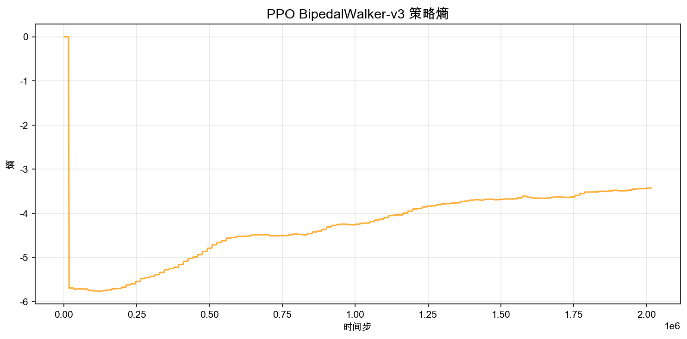
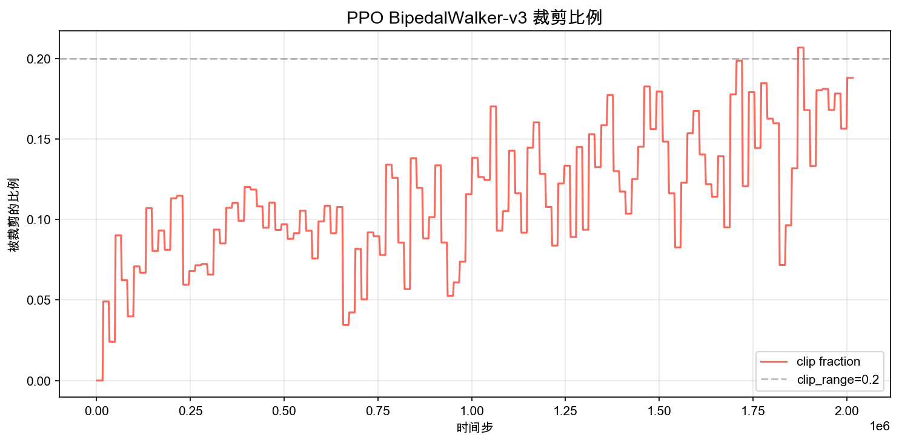
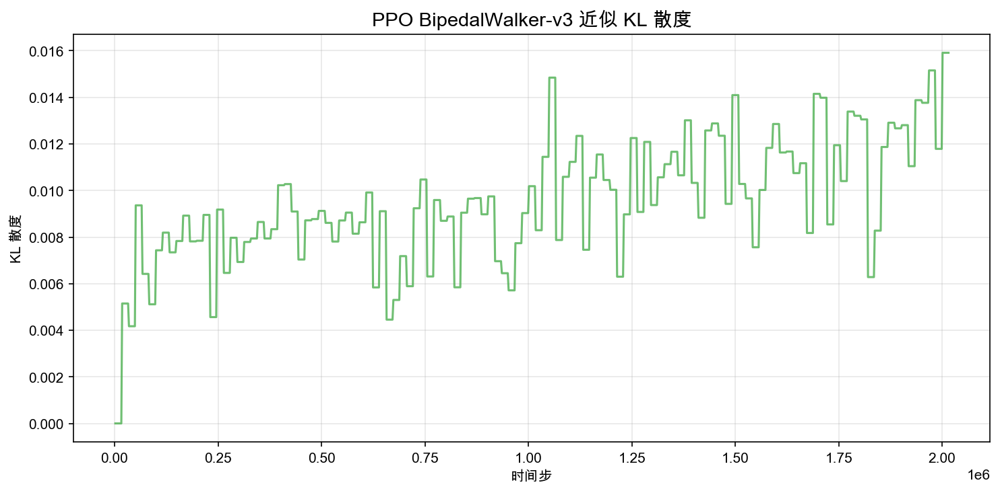
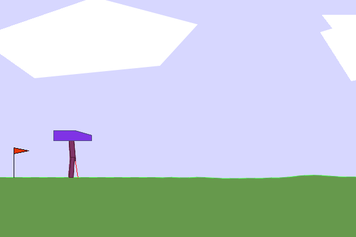

# 5.1 Hands-On: BipedalWalker Continuous Control

> **Goal of this section**: Train PPO to control a bipedal robot to walk over randomized terrain, and understand what really changes when we move from discrete actions to continuous actions.

> **Code for this section**: [ppo_bipedal_walker.py](https://github.com/walkinglabs/hands-on-modern-rl/blob/main/code/chapter10_ppo/ppo_bipedal_walker.py) · [render_bipedal_walker.py](https://github.com/walkinglabs/hands-on-modern-rl/blob/main/code/chapter10_ppo/render_bipedal_walker.py) · [requirements.txt](https://github.com/walkinglabs/hands-on-modern-rl/blob/main/code/chapter10_ppo/requirements.txt)

In earlier chapters, we used CartPole and LunarLander to get comfortable with **discrete-action** tasks: the policy only needs to choose one action from a small set. But many real control problems, such as robot joint torques, a car's throttle and brake, or a drone's rotor speeds, live in a **continuous action space**.

One of PPO's core advantages is that it handles continuous actions natively. A common parameterization is a Gaussian policy: the network outputs the mean and standard deviation of a Gaussian distribution, and we sample continuous actions from it. There is no need to discretize the action space. `BipedalWalker-v3` is a canonical benchmark of this kind.

## 7.1.1 Running BipedalWalker Training

The task in BipedalWalker is to control a bipedal robot to walk across randomly generated terrain. The state is 24-dimensional (including lidar distance readings, joint angles, and joint velocities). The action is a 4-dimensional continuous vector (torques for the hips and knees of both legs). Compared with LunarLander, this environment is a better main experiment for this chapter: you are no longer selecting among a few discrete actions; instead you must learn continuous control signals directly.


<div style="text-align: center; font-size: 0.9em; color: var(--vp-c-text-2); margin-top: -10px; margin-bottom: 20px;">
  <em>Figure 7.1-1: The goal of BipedalWalker is to learn a walking gait over uneven terrain, rather than falling down.</em>
</div>

Install dependencies:

```bash
pip install -r code/chapter10_ppo/requirements.txt
```

Run training:

```bash
python code/chapter10_ppo/ppo_bipedal_walker.py \
  --total-timesteps 2000000
```

Training BipedalWalker is much slower than the discrete environments we have used so far. For tasks like LunarLander, you can often see a clear learning trend within 200k steps. For BipedalWalker, it typically takes more than 2 million steps before the robot walks stably. On a typical CPU, 2 million steps may take about 60 to 90 minutes. If you only want to verify that the pipeline runs end-to-end, start with `--total-timesteps 100000` for a quick smoke test.

PPO hyperparameters for BipedalWalker in this experiment:

```python
model = PPO(
    policy="MlpPolicy",       # MLP policy
    env=vec_env,              # 8 parallel environments
    learning_rate=3e-4,       # learning rate
    n_steps=2048,             # rollout length per update
    batch_size=256,           # larger minibatch stabilizes gradients in continuous control
    n_epochs=10,              # optimization epochs per rollout
    clip_range=0.2,           # PPO clipping range
    ent_coef=0.005,           # entropy coefficient (Gaussian policies already explore; slightly smaller is enough)
    gamma=0.99,               # discount factor
    gae_lambda=0.95,          # GAE lambda
)
```

We set `batch_size=256` because policy updates in continuous action spaces tend to have higher variance; larger batches help stabilize the gradient estimate. We set `ent_coef=0.005` because a Gaussian policy already has persistent exploration (each sampled action contains randomness), so we do not need a large additional entropy bonus. We run 8 parallel environments because BipedalWalker episodes are longer (up to 1600 steps), and more parallelism helps maintain sampling throughput.

## 7.1.2 Reading the Training Curves

This experiment uses the PPO implementation from **Stable-Baselines3 (SB3)**, one of the most widely used RL libraries today. Our training configuration is: 8 parallel `DummyVecEnv` environments, `MlpPolicy` (an MLP), learning rate `3e-4`, `batch_size=256`, `clip_range=0.2`, and 2 million total training steps. The training script will generate four separate plots under `output/`.

During PPO training, there are four key metrics. Each one reflects the learning dynamics from a different angle. Let's walk through them one by one.

### Episode Reward

Episode reward is the most direct metric: the cumulative return at the end of each episode. In BipedalWalker, returns typically range from about -110 (fall quickly) to +340 (efficient walking).


<div style="text-align: center; font-size: 0.9em; color: var(--vp-c-text-2); margin-top: -10px; margin-bottom: 20px;">
  <em>Figure 7.1-2: Episode reward curve. Light blue shows raw per-episode returns; dark blue is a 50-episode moving average. The green dashed line marks the solved threshold (300).</em>
</div>

The overall trend can be divided into three stages:

- **First ~300 episodes (~500k steps)**: rewards rise slowly from -110 to around 0. The policy is learning "not to fall" -- the robot transitions from falling every episode to surviving the full 1600 steps. During this stage, PPO is accumulating experience and gradually finding action patterns that maintain balance.
- **Episodes 300-800 (~500k-1.3M steps)**: rewards rise rapidly from 0 to above 230. The policy transitions from "not falling" to "able to walk." This stage has large variance: some episodes score well (100+), while others still end in a fall (-100).
- **After ~800 episodes (after ~1.3M steps)**: rewards fluctuate between 200 and 260. The policy has formed a stable gait and enters a refinement phase where most episodes result in stable walking.

One point that matters in continuous control: the reward curve often looks noisier than in discrete tasks. The reason is not that PPO is inherently unstable, but that **small changes in continuous torques can lead to large changes in trajectory**, especially when balance and contact dynamics are involved.

### Policy Entropy

Policy entropy measures how "random" the policy is. Higher entropy means the policy samples more diverse actions; lower entropy means it becomes more deterministic.

In discrete-action tasks, entropy refers to the entropy of a categorical distribution over a small action set. In continuous control, SB3's Gaussian policy has entropy related to the scale of the standard deviation (roughly speaking, larger standard deviation means higher entropy).



<div style="text-align: center; font-size: 0.9em; color: var(--vp-c-text-2); margin-top: -10px; margin-bottom: 20px;">
  <em>Figure 7.1-3: Policy entropy over training steps. Entropy decreases as the policy becomes more confident and more consistent.</em>
</div>

The curve typically shows a slow downward trend: early on, exploration is broad; later, the policy finds a stable gait and no longer needs to try large variations. But note the key distinction: **even a "trained" Gaussian policy still samples**, so the entropy rarely collapses all the way to zero unless you force the standard deviation to become extremely small.

If entropy drops too quickly early in training, it often means the policy prematurely converges to a suboptimal behavior (for example, standing still to avoid falling). In that case, increasing `ent_coef` can help.

### Clip Fraction

PPO's "proximal" behavior comes from clipping the policy ratio:

$$r_t(\theta) = \frac{\pi_\theta(a_t|s_t)}{\pi_{\theta_{\mathrm{old}}}(a_t|s_t)}$$

and using a clipped objective so that the update cannot push the new policy too far away from the old one in a single step. SB3 reports a metric called **clip fraction**: the fraction of samples where the ratio is clipped (i.e., where the update would have been too large without clipping).



<div style="text-align: center; font-size: 0.9em; color: var(--vp-c-text-2); margin-top: -10px; margin-bottom: 20px;">
  <em>Figure 7.1-4: Clip fraction over training. A higher clip fraction means more samples are being constrained by PPO's clipping rule.</em>
</div>

Intuitively, clip fraction answers the question: "How often does PPO need to say: stop, do not update this sample too aggressively?" In well-behaved training, it stays in a moderate range (often 0.05 to 0.15). If it spikes above 0.2 for sustained periods, it suggests updates are too large, and you may need a smaller learning rate or more data per update.

### Approximate KL Divergence

SB3 also reports an approximate KL divergence between the old and new policy. The exact formula varies by implementation details, but the high-level meaning is stable: **smaller KL means the new policy is closer to the old one**, and thus the update is "safer." PPO is designed to limit this distance indirectly, and the KL metric gives you a window into whether that constraint is being respected.



<div style="text-align: center; font-size: 0.9em; color: var(--vp-c-text-2); margin-top: -10px; margin-bottom: 20px;">
  <em>Figure 7.1-5: Approximate KL divergence over training. Smaller KL means the new policy stays closer to the old policy, which generally implies safer updates.</em>
</div>

In the plot above, the KL divergence stays below 0.016 and does not show large spikes. This suggests that PPO's clipping mechanism is working well for BipedalWalker: each update keeps the policy change within a conservative range.

If you compare KL divergence with clip fraction, you will often see them move together. That is natural: when more samples are clipped, it means the update pressure is stronger, and the policy would have moved further without clipping, which tends to increase KL.

If KL suddenly jumps above 0.05, it usually indicates that a particular update pushed the policy too far. That is exactly the failure mode PPO tries to avoid.

### How the Four Metrics Relate

These four metrics are not independent; they reflect a causal chain:

| Phenomenon            | Reward          | Policy Entropy  | Clip Fraction  | KL Divergence  |
| --------------------- | --------------- | --------------- | -------------- | -------------- |
| Normal training       | Gradually rises | Slowly declines | 0.05-0.15      | 0.01-0.03      |
| Update too hard       | Sudden drop     | Sharp change    | Spikes > 0.2   | Spikes > 0.05  |
| Premature convergence | Stagnates       | Near 0          | Near 0         | Near 0         |
| Late training         | High and stable | Low and stable  | Low and stable | Low and stable |

A sharp drop in reward is often accompanied by a spike in clip fraction and an abrupt increase in KL divergence. When these three metrics all look abnormal, it is a strong signal that the update step is too aggressive. Two standard fixes are: lower the learning rate, or increase `n_steps` (so each rollout collects more data, yielding a lower-variance gradient estimate).

## 7.1.3 What Counts as "Solved"

The BipedalWalker-v3 reward is composed of several parts:

- **Forward progress reward**: each step gives a positive reward proportional to how far you move to the right; faster progress yields higher reward.
- **Joint efficiency penalty**: large torques are penalized, encouraging efficient movement.
- **Falling penalty**: if the robot falls (its head touches the ground), the episode ends and a 100-point penalty is applied.

The environment's "solved" criterion is an average reward of $\geq 300$ over 100 consecutive episodes. In practice, a single episode score can be read roughly as:

- **$\geq 300$**: high-quality walking: fast, stable, and efficient.
- **200-300**: can walk, but not reliably; speed or efficiency still has issues.
- **100-200**: can sometimes move forward, but falls often.
- **$<$ 100**: essentially not learned; most episodes end in a fall.

Before looking at PPO, it helps to establish a random-policy baseline:

```python
import gymnasium as gym
import numpy as np

env = gym.make("BipedalWalker-v3")
rng = np.random.default_rng(0)

returns = []
for ep in range(50):
    obs, _ = env.reset(seed=ep)
    total_reward = 0.0
    for step in range(1600):
        action = rng.uniform(-1, 1, size=4)
        obs, reward, terminated, truncated, _ = env.step(action)
        total_reward += reward
        if terminated or truncated:
            break
    returns.append(total_reward)

print(f"Random policy mean return: {np.mean(returns):.1f}")
print(f"Best episode: {np.max(returns):.1f}")
print(f"Worst episode: {np.min(returns):.1f}")
```

The random policy's mean return is typically around -100 to -50: almost every episode ends in a fall (and pays the 100-point penalty). If, after PPO training, evaluation returns are still in this range, it means the policy has not learned any effective behavior.

One run produced:

```text
Random policy mean return: -103.7
Standard deviation: 12.6
Best episode: -77.8
Worst episode: -124.7
```

## 7.1.4 Replays at Three Training Stages

To make PPO's learning progression more concrete, let's compare policies from three different stages under the same hyperparameter settings. The three models share identical hyperparameters; the only difference is the number of training steps.

After training, you can generate replay GIFs with the rendering script:

```bash
python code/chapter10_ppo/render_bipedal_walker.py \
  --model output/ppo_bipedal_walker.zip \
  --output-dir output/bipedalwalker_episodes \
  --episodes 10 --seeds 0 1 2 3 4 5 6 7 8 9
```

### Early (100k steps, return -35.8)

At 100k steps, the policy has already learned "not to fall." The robot can survive the full 1600 steps without falling, but it barely moves forward -- its limb movements look like balance-maintaining wiggles in place. The -35.8 return comes from torque penalties and lack of forward progress.


### Mid (500k steps, return 109.3)

At 500k steps, the policy is in the transition phase of learning to walk. The same model can produce wildly different results across episodes: lucky episodes score above 100, unlucky ones still end in a fall at -100. The episode shown here is a successful one -- the robot can move forward, but the gait is poorly coordinated and the speed is low.


### Late (2M steps, return 295.1)

At 2M steps, the policy has formed a stable and efficient gait. Joint coordination is smooth, and the robot finishes the walk in 1118 steps (compared to the full 1600 steps needed by the 100k and 500k policies).



Evaluation summary across the three stages (20-episode mean):

| Training Steps | Mean Reward | Std. Dev. | Behavior                                                 |
| -------------- | ----------- | --------- | -------------------------------------------------------- |
| 100k           | -34.1       | 3.3       | Can stand but cannot walk; every episode runs 1600 steps |
| 500k           | -65.2       | 73.1      | Transition: ~15% of episodes walk, the rest still fall   |
| 2M             | 282.5       | 59.7      | Stable, efficient walking; most episodes score 290+      |

This trajectory is typical for PPO in continuous control: first learn "do not fall" (100k), then learn "walk a little" (500k), and finally form an efficient gait (2M). The process is slower than in discrete control tasks, but the stage boundaries are often clearer because the policy space is much larger in continuous actions, and each phase requires more data to break through.

## 7.1.5 States, Actions, and Continuous Policies

The 24-dimensional state of BipedalWalker can be grouped as follows:

| State Component              | Dim | Meaning                                         |
| ---------------------------- | --- | ----------------------------------------------- |
| `hull_angle`                 | 1   | torso pitch angle                               |
| `hull_angular_velocity`      | 1   | torso angular velocity                          |
| `vx, vy`                     | 2   | torso horizontal/vertical velocity              |
| `hip1, hip2`                 | 2   | hip joint angles for the two legs               |
| `knee1, knee2`               | 2   | knee joint angles for the two legs              |
| `leg1_contact, leg2_contact` | 2   | whether each foot is in contact with the ground |
| `lidar[0..9]`                | 10  | lidar distance readings (terrain ahead)         |
| `hip_speed1, hip_speed2`     | 2   | hip joint angular velocities                    |
| `knee_speed1, knee_speed2`   | 2   | knee joint angular velocities                   |

The action is a 4-dimensional continuous vector, with each component in $[-1, 1]$:

| Action Component | Meaning           |
| ---------------- | ----------------- |
| `action[0]`      | leg 1 hip torque  |
| `action[1]`      | leg 1 knee torque |
| `action[2]`      | leg 2 hip torque  |
| `action[3]`      | leg 2 knee torque |

PPO handles continuous actions differently from discrete actions. In a discrete action space, the policy network outputs probabilities for each action and samples from a categorical distribution. In a continuous action space, the policy network outputs a Gaussian distribution, parameterized by a mean $\mu(s)$ and a standard deviation $\sigma(s)$, and samples actions from it:

$$a \sim \mathcal{N}(\mu_\theta(s), \sigma_\theta(s)^2)$$

The key point is that PPO does not need to discretize continuous actions into a finite set of choices. For quantities like joint torques that require fine-grained control, discretization loses resolution. If you only allow three torque levels like -1, 0, and +1, the robot will be extremely clumsy. A continuous policy can output precise values like 0.37 or -0.82, enabling much finer control.

Training in BipedalWalker often goes through three qualitative stages:

1. **Standing (0-500k steps)**: the policy first learns not to fall. Reward rises slowly from -110 to around 0, as the robot transitions from "falls immediately" to "can survive the full 1600 steps without falling." But it cannot move forward yet -- only balance in place.
2. **Shuffling (500k-1M steps)**: the policy starts taking tentative steps, but the gait is very unstable. Some episodes score above 100, while others still end in a fall at -100. The standard deviation reaches 73, reflecting the policy oscillating between "can walk" and "cannot walk."
3. **Walking (after ~1M steps)**: the gait gradually forms and stabilizes. After 2M steps, most episodes score 290-299, with an occasional fall (about 1-2 out of 20 episodes).

These boundaries are not strict; different random seeds may shift them. But the high-level trend is consistent: learn "do not fall" first, then "take steps," and finally "walk efficiently."

## 7.1.6 Common Failures and Tuning

BipedalWalker is more prone to training failure than typical discrete-action environments. If your results are not satisfactory, diagnose in the following order.

First, confirm you trained long enough. One million steps is a starting point, not an endpoint. If the curve is still rising but too slowly, continue training:

```python
from stable_baselines3 import PPO

model = PPO.load("output/ppo_bipedal_walker.zip")
model.learn(total_timesteps=2_000_000, reset_num_timesteps=False)
```

Second, confirm `batch_size` is large enough. Continuous action gradients typically have higher variance; `batch_size=64` may be too unstable. This section uses 256. If your curve is still extremely noisy, try 512.

Third, check policy entropy. If entropy collapses close to zero early in training, the policy may be prematurely converging to a suboptimal behavior (for example, standing still). In that case, increase `ent_coef` to around 0.01.

Fourth, consider network capacity. SB3's default `MlpPolicy` uses a two-layer network with 64 units per layer. For a 24-dimensional state, this capacity may be insufficient. You can increase the network size via `policy_kwargs`:

```python
model = PPO(
    policy="MlpPolicy",
    policy_kwargs=dict(net_arch=[128, 128]),
    ...
)
```

Common hyperparameter reference:

| Parameter       | This Section | If Mis-set, What Happens                                                        |
| --------------- | ------------ | ------------------------------------------------------------------------------- |
| `learning_rate` | `3e-4`       | Too large causes torque outputs to oscillate; too small makes learning too slow |
| `batch_size`    | `256`        | Too small yields unstable gradient estimates; too large makes each update slow  |
| `n_steps`       | `2048`       | Too small gives insufficient rollout data; too large delays policy updates      |
| `ent_coef`      | `0.005`      | Too small converges early to "stand still"; too large prevents stable gait      |
| `clip_range`    | `0.2`        | Too large causes abrupt gait shifts and falls; too small can stall training     |
| `gamma`         | `0.99`       | Too low focuses only on short-term survival and ignores long-term efficiency    |

## 7.1.7 Why BipedalWalker

From a teaching perspective, BipedalWalker has several important advantages:

- **A continuous action space**. The robot is controlled by a 4D continuous torque vector. This highlights PPO's key advantage over DQN: DQN cannot natively handle continuous actions and must discretize them, whereas PPO supports continuous actions via Gaussian policies.
- **A richer state space**. The 24-dimensional state includes 10 lidar distance readings, a simplified analogue of real robot sensors (lidar, tactile sensors). The agent must infer terrain changes from sensor signals rather than reading a direct "position" coordinate.
- **More complex learning dynamics**. The task requires discovering a full gait cycle involving multi-joint coordination, center-of-mass transfer, and terrain adaptation. The policy is not simply switching among a few actions; it is shaping stable motion patterns in a continuous space.

From CartPole (Chapter 5) to BipedalWalker, the experimental difficulty and realism increase substantially. But PPO's core mechanism does not change: clipping constrains update size, multiple epochs reuse the same rollout data, and Actor-Critic jointly optimizes policy and value. The increase in complexity comes from the environment and task, not from the algorithm itself.

In the next section, we will unpack the mathematical derivation behind PPO: [PPO Math Derivation](./ppo-math).

## Summary of This Section

- `BipedalWalker-v3` is a direct demonstration of PPO in continuous action spaces: 4D continuous torques, 24D states, and randomized terrain.
- PPO supports continuous actions natively via a Gaussian policy (output mean and standard deviation, then sample actions), without discretization.
- BipedalWalker learning often goes through three stages: "standing → shuffling → walking," and typically requires far more training steps than common discrete-action tasks.
- This section uses SB3's PPO implementation. The entry script is `code/chapter10_ppo/ppo_bipedal_walker.py`, and the replay GIFs are generated by `render_bipedal_walker.py`.
- The environment's solved threshold is a 100-episode mean reward $\geq 300$. In this section, 2M-step training reaches 282.5 ± 59.7, with most episodes stable in the 290-299 range.

## References

[^1]: Raffin, A., et al. (2021). Stable-Baselines3: Reliable reinforcement learning implementations. _Journal of Machine Learning Research_, 22(268), 1-8.

[^2]: Schulman, J., et al. (2017). Proximal policy optimization algorithms. _arXiv preprint arXiv:1707.06347_.
