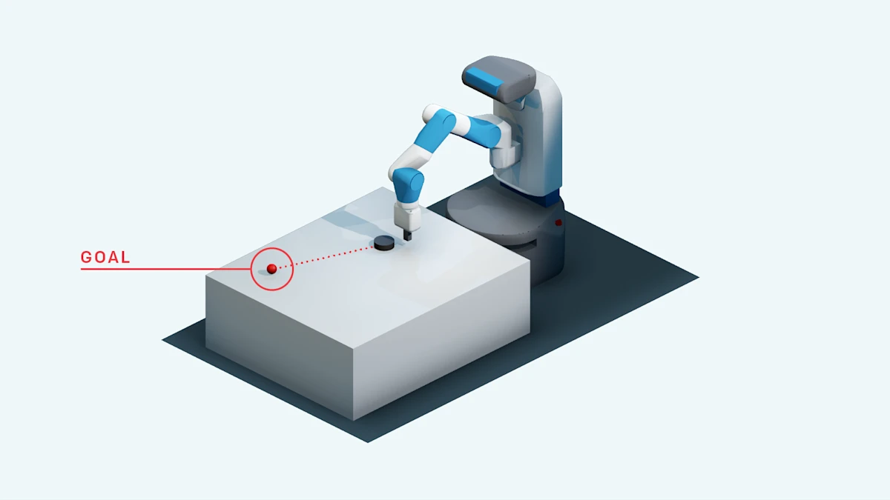
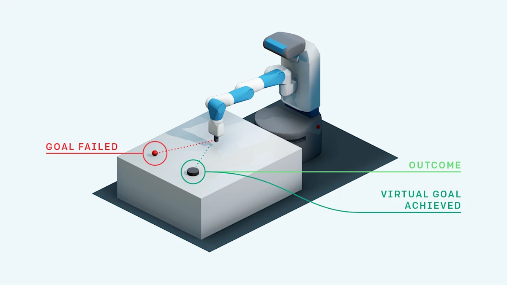
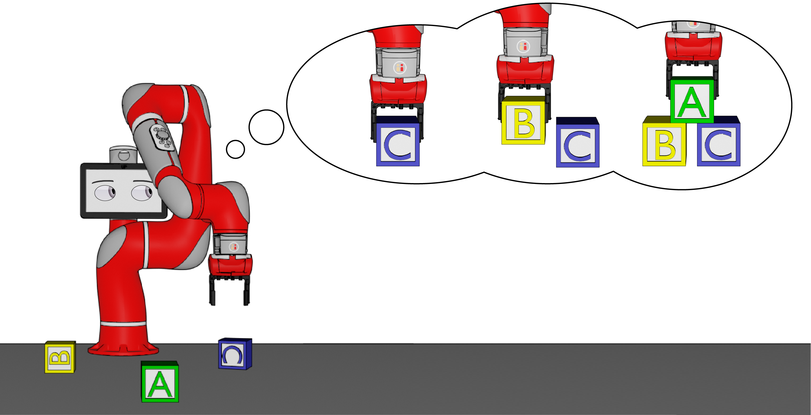
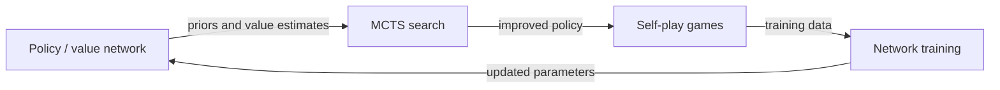
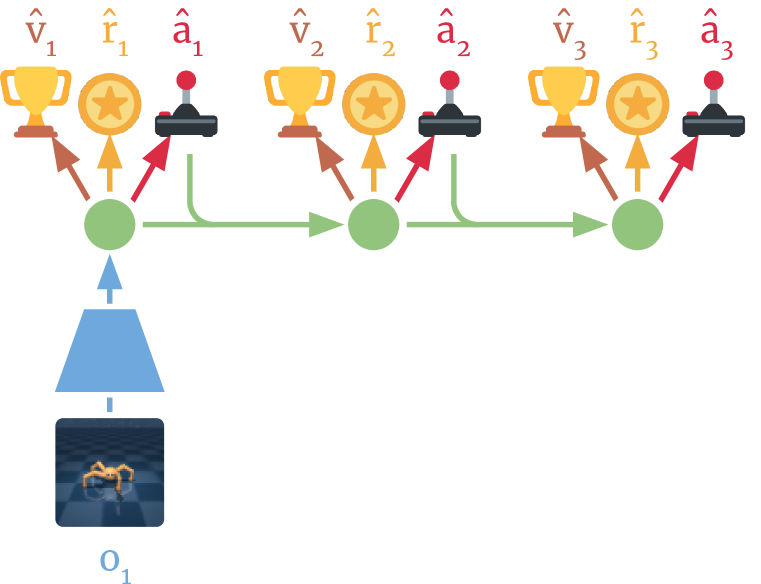
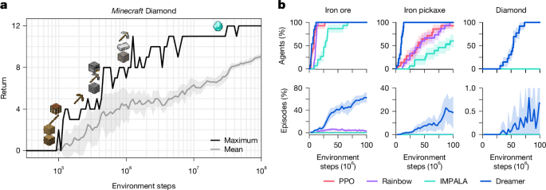
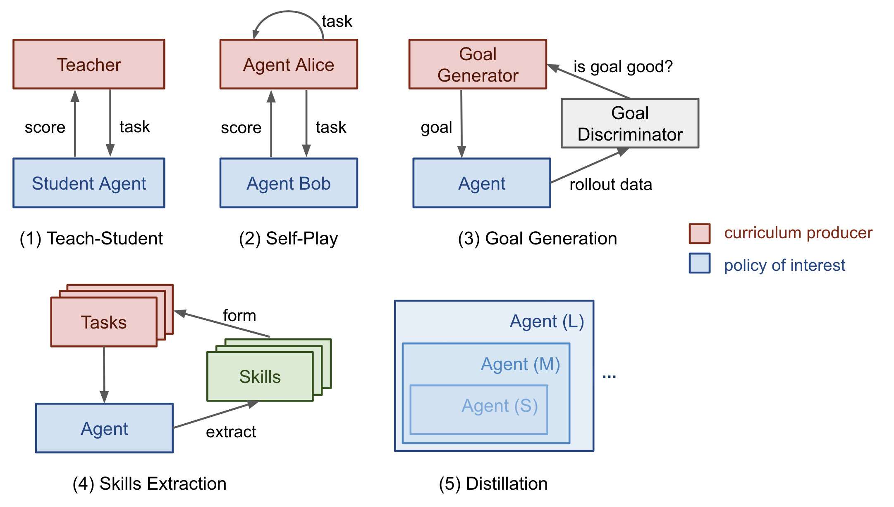

# 5.6 Classical Reinforcement Learning in Long-Horizon Tasks

In the previous sections, we used PPO on BipedalWalker and collected a set of game-project entry points. Those tasks usually have horizons from tens to a few thousand steps, and their reward signals can often be shaped without too much difficulty. Many real tasks are different. A robot in a kitchen may need to open a fridge, take out ingredients, wash, cut, cook, and plate food. An agent in Minecraft may need to collect resources, craft tools, and build shelter from scratch. These are **long-horizon tasks**: the decision sequence may span thousands or tens of thousands of steps, and reward may be almost absent until the end.

This section reviews classical RL ideas for long-horizon planning, without involving LLMs: hierarchical RL, hindsight experience replay, model-based planning, explicit exploration, reward shaping, curriculum learning, and imitation learning. Understanding these methods will make it easier to compare them with LLM-based agent planning later.

## Why Long-Horizon Tasks Are Hard

The difficulty comes from three problems that reinforce one another.

### Sparse Rewards

In many long-horizon tasks, the agent receives reward only after completing the full task: winning a board game, finishing assembly, or solving a long navigation problem. For most intermediate steps, $r_t = 0$. A policy-gradient method cannot infer a useful direction from all-zero feedback. This is the **sparse reward problem**.

Compare this with CartPole. Every step that keeps the pole balanced gives $r_t = 1$, so the signal is dense. In a long assembly task, a random policy may run for a million steps without seeing a single nonzero reward. If an episode has $T$ steps and each step has $A$ possible actions, a rough probability of randomly hitting one rewarding trajectory is $A^{-T}$. When $T=100$ and $A=4$, this is around $10^{-60}$.

Sparse reward does not always mean literally no reward. Sometimes reward exists but is extremely rare, as in Montezuma's Revenge, where entering a new room may require hundreds or thousands of correct actions.

### Credit Assignment

Even when the final reward arrives, the agent must decide **which earlier action deserves credit**. In a 1,000-step episode with final reward +1, did step 37 matter more than step 892? This is the **credit assignment problem**, and it worsens as the horizon grows.

The mathematical source is visible in REINFORCE:

$$
\nabla_\theta J(\theta) \approx \frac{1}{N} \sum_{i=1}^{N} \sum_{t=0}^{T}
\nabla_\theta \log \pi_\theta(a_t^{(i)} | s_t^{(i)})
\left(\sum_{t'=t}^{T} \gamma^{t'-t} r_{t'}^{(i)}\right).
$$

When $T$ is large, the return-to-go $G_t=\sum_{t'=t}^{T}\gamma^{t'-t}r_{t'}$ has high variance. Actor-Critic and GAE reduce this variance by using a value function to estimate each step's contribution rather than relying only on raw sampled returns.

### Exploration-Space Explosion

The number of possible trajectories grows exponentially with horizon. With four actions per step, a 100-step task already has $4^{100}$ possible action sequences. Random exploration almost never finds a meaningful solution. This is the **exploration bottleneck**.

Sparse rewards and exploration explosion form a loop: because the space is huge, random exploration rarely finds reward; because reward is absent, the policy cannot learn which direction is worth exploring. Simple strategies such as epsilon-greedy or Gaussian noise explore local neighborhoods, but long-horizon success may require a large jump to a distant behavior.

## Hierarchical Reinforcement Learning

Hierarchical Reinforcement Learning (HRL) is the classic answer: decompose a complex task into subtasks. A high-level policy selects goals or skills; a low-level policy executes primitive actions.

This is the same intuition as an organization. A CEO sets quarterly goals; department managers plan work; individual employees execute details. HRL reduces the burden on the high-level policy in three ways:

- **Lower decision frequency**: the high-level policy acts every $c$ steps, so the effective horizon changes from $T$ to $T/c$.
- **More abstract state space**: the high-level policy reasons about subgoals rather than every pixel or joint angle.
- **Skill reuse**: a learned low-level skill can serve many high-level tasks.

  <em>Figure 1: The two-level HIRO architecture. The high-level manager outputs subgoals, and the low-level worker executes primitive actions. Source: <a href="https://arxiv.org/abs/1805.08296" target="_blank" rel="noopener noreferrer">Nachum et al., 2018</a></em>

### Options Framework

The **Options framework** proposed by Sutton et al. is the theoretical basis of HRL. An option $o$ has three parts:

- **initiation set** $\mathcal{I}_o \subseteq \mathcal{S}$: states where the option can start;
- **intra-option policy** $\pi_o$: the policy executed while the option is active;
- **termination condition** $\beta_o$: the probability of ending the option in a state.

An option is a macro-action. "Walk to the fridge" may contain many motor actions, but the high-level controller only needs to choose that option. A 1,000-step primitive task may become only 10 high-level option choices.

### Goal-Conditioned Policies

Another hierarchical route is **goal-conditioned RL**. The policy receives both state $s$ and goal $g$:

$$
\pi(a | s, g).
$$

Instead of learning only "how to reach the final target," the policy learns "how to reach a specified goal." A single trajectory can train many subproblems: from $s_0$ to $s_5$, from $s_5$ to $s_{10}$, and so on.

UVFA learns a universal value function $Q(s,a,g)$ for arbitrary state-goal pairs. HIRO builds a two-level architecture on top of this idea:

- the high-level policy $\pi^{hi}$ outputs a subgoal $g_t$ every $c$ steps;
- the low-level policy $\pi^{lo}$ acts according to the current state and subgoal;
- goal relabeling trains the high level using the state that was actually reached, which is related to HER.

### Automatic Subgoal Discovery

The central HRL question is: **where do subgoals come from?** Hand-designed subgoals require domain knowledge. Researchers have explored several automatic strategies:

- **state-visit structure**: build a transition graph and find bottleneck states, such as a corridor connecting two rooms;
- **mutual information**: learn diverse skills through objectives such as DIAYN so that each skill occupies a distinguishable behavior mode;
- **option discovery**: learn initiation sets, intra-option policies, and termination conditions jointly, as in Option-Critic.

::: info Hierarchical methods in practice
Empirical comparisons show that HRL helps most on tasks that truly require long-range planning. On medium-difficulty tasks, a well-tuned flat PPO or SAC can be stronger because hierarchy itself introduces extra training complexity.
:::

## Hindsight Experience Replay

HRL changes the policy structure. **Hindsight Experience Replay (HER)** changes how data is used. It was introduced by Andrychowicz et al. in 2017 for sparse-reward goal-conditioned tasks.

### Core Idea

The core trick is simple. The agent tried to reach goal $g$ and failed, but it ended at state $s_T$. If we pretend the goal had been $s_T$, the failed episode becomes a successful training example.

  <em>Figure 2: Goal-conditioned sparse-reward tasks. The agent must push the object to the target position. Source: <a href="https://openai.com/index/ingredients-for-robotics-research/" target="_blank" rel="noopener noreferrer">OpenAI Blog</a></em>

The training procedure is:

1. interact with the environment using the original goal $g$;
2. collect a trajectory $(s_0,a_0,r_0,s_1,\ldots,s_T)$;
3. choose a virtual goal $g'=\phi(s_T)$ or a state from the same trajectory;
4. recompute rewards as $r'_t=r(s_t,a_t,g')$;
5. store $(s_t,a_t,r'_t,s_{t+1},g')$ in the replay buffer.

  <em>Figure 3: HER relabels the state the agent actually reached as a virtual goal. Source: <a href="https://openai.com/index/ingredients-for-robotics-research/" target="_blank" rel="noopener noreferrer">OpenAI Blog</a></em>

### Combining HER with Goal-Conditioned RL

HER usually works with a goal-conditioned policy $\pi(a|s,g)$. The original paper introduced four virtual-goal sampling strategies:

- **final**: use only the final state of the episode;
- **episode**: sample a state from the same trajectory;
- **future**: sample a state after the current time step; this is usually the most common choice;
- **random**: sample a state from previous episodes.

The **future** strategy is often strongest because the relabeled goal is reachable from the current point in the original trajectory. HER also naturally connects with curriculum learning: if virtual goals are sampled near the boundary of the current policy's ability, they form an automatic curriculum.

  <em>Figure 4: DDPG + HER on an OpenAI robotics task. Sparse-reward HER can approach full success. Source: <a href="https://openai.com/index/ingredients-for-robotics-research/" target="_blank" rel="noopener noreferrer">OpenAI Blog</a></em>

### Limitations

HER is elegant, but it has limits:

- **It requires goal conditioning.** The task must express goals as states or state-derived features.
- **Virtual-goal quality matters.** Relabeling random meaningless states may not help.
- **It does not solve exploration by itself.** If the agent never reaches useful states, there is little to relabel.
- **Multi-goal tasks can conflict.** Simple relabeling can produce contradictory training signals.

## Model-Based Planning

The third route is: instead of only trying actions in the real environment, **learn a world model and plan inside it**.

  <em>Figure 5: Dreamer learns a world model from experience and trains Actor-Critic in latent imagination. Source: <a href="https://arxiv.org/abs/1912.01603" target="_blank" rel="noopener noreferrer">Hafner et al., 2020</a></em>

### MBPO: Short Model Rollouts

MBPO learns a dynamics model $\hat{T}(s'|s,a)$ and uses it to generate **short synthetic trajectories**:

1. collect real data $(s,a,r,s')$;
2. train an ensemble dynamics model;
3. branch from real states and simulate $k$ steps, often around 5;
4. add model-generated data to the replay buffer and train the policy.

The key insight is that short predictions can be accurate, while long predictions accumulate error. MBPO can improve sample efficiency by several times on continuous-control tasks, but because the model is used only for short rollouts, it is not a complete solution for very long planning.

  <em>Figure 6: MBPO uses a learned dynamics model to generate short branched rollouts. Source: <a href="http://bair.berkeley.edu/blog/2019/12/12/mbpo/" target="_blank" rel="noopener noreferrer">BAIR Blog</a></em>

### MCTS: Search as Planning

Another route does not learn a world model. If the rules are known, the agent can search directly. Monte Carlo Tree Search (MCTS) maintains a search tree and repeats four steps:

1. **Selection**: follow a rule such as UCB to choose promising children:

$$
\text{UCB}(a)=Q(s,a)+c\sqrt{\frac{\ln N(s)}{N(s,a)}}.
$$

2. **Expansion**: add a new child state to the tree.
3. **Rollout**: simulate from the new node to estimate return.
4. **Backpropagation**: update values and visit counts along the path.

MCTS allocates computation adaptively: more simulations go to more promising branches.

AlphaZero upgraded MCTS by replacing random rollouts with a value network $v_\theta(s)$ and using a policy network $\pi_\theta(a|s)$ as a prior over actions. Search produces an improved policy target; the network is trained on that target; the improved network then makes future search stronger.

The lesson is not that search replaces learning. It is that **search and learning are complementary**: learning supplies intuition, search supplies precise lookahead.

### Dreamer: Training in Imagination

Dreamer represents a more modern model-based direction. It learns a latent world model, then rolls out imagined trajectories in latent space and trains Actor-Critic through them. The real environment is used to improve the world model; most policy learning happens in imagination.

DreamerV3 extends this idea to continuous control, Atari, and Minecraft with fixed hyperparameters. Important improvements include:

- **symlog prediction**, which handles values at very different scales;
- **normalization-free training**, using robust scaling choices instead of hand-tuned normalization;
- **robust critics**, which use distributional/value-robust objectives for long-tailed returns.

  <em>Figure 8: DreamerV3 collecting diamonds in Minecraft from scratch, without human data or curriculum. Source: <a href="https://arxiv.org/abs/2301.04104" target="_blank" rel="noopener noreferrer">Hafner et al., 2023</a></em>

::: tip Why world models help long-horizon tasks
World models decouple environment exploration from policy learning. Once a useful dynamics model exists, the policy can train on many imagined futures without paying for every real interaction.
:::

## Exploration Methods

HRL, HER, and world models all assume the agent can collect enough diverse data. In extremely sparse tasks, that assumption breaks. The agent needs explicit exploration methods.

### Go-Explore: Return to the Past and Continue

Go-Explore starts from the observation that many algorithms do find interesting states, but then fail to return to them. Its solution is to save promising states in an **archive**, restore one of them, and continue exploring from there.

Stage one explores:

1. maintain an archive of interesting visited states;
2. select a state from the archive and restore the simulator to it;
3. explore from that state;
4. add newly discovered cells to the archive.

Stage two robustifies the brittle high-return trajectories with imitation learning, so the final policy can reproduce them without exact state restoration.

Go-Explore achieved major breakthroughs on Montezuma's Revenge and Pitfall, but it depends heavily on being able to restore simulator states. That is easy in Atari and hard on real robots.

### Intrinsic Rewards and Curiosity

Intrinsic-reward methods add an exploration bonus:

$$
r_t^{\text{total}} = r_t^{\text{extrinsic}} + \beta r_t^{\text{intrinsic}}.
$$

Common designs include:

- **count-based exploration**: reward rarely visited states with $1/\sqrt{N(s)}$;
- **RND**: use prediction error against a fixed random network as novelty reward;
- **ICM**: use forward-dynamics prediction error as curiosity, with an inverse model to filter uncontrollable noise.

The advantage is generality. The weakness is the **noisy-TV problem**: if a part of the environment produces endless unpredictable variation, the agent may stare at it forever because it remains "novel."

## Reward Shaping and Curriculum Learning

Another family of methods changes the reward or the order of tasks.

### Reward Shaping

**Reward shaping** adds dense intermediate rewards to sparse tasks. A classic safe form is potential-based shaping:

$$
F(s,s')=\gamma\Phi(s')-\Phi(s),
$$

where $\Phi$ is any state potential function. Ng et al. showed that this form does not change the optimal policy. In a navigation task, if $\Phi(s)$ is negative distance to the goal, then moving closer produces a small positive shaping reward while preserving the original optimum.

Good shaping still requires knowledge of useful intermediate states. To reduce manual design, researchers use inverse RL, preference-based RL, and self-supervised reward discovery.

### Curriculum Learning

**Curriculum learning** trains from easy tasks to hard tasks. A robot opening a door might start with a half-open door, then a barely open door, then a closed door.

Lilian Weng groups RL curricula into several types:

1. **Task-specific curricula**: manually designed sequences of harder tasks.
2. **Teacher-guided curricula**: a teacher policy chooses tasks near the student's current ability.
3. **Self-play curricula**: the agent trains against earlier versions of itself, as in AlphaZero.
4. **Automatic goal generation**: algorithms such as ALP-GMM or GoalGAN generate goals of suitable difficulty.
5. **Skill-based curricula**: independent skills are trained and then distilled into a single policy.

#### Three Curriculum Dimensions in RL

Curricula often adjust one of three dimensions:

- **initial-state curriculum**: start near the goal, then move farther away;
- **goal curriculum**: move from simple goals to compound goals;
- **environment curriculum**: move from simple environments to randomized or complex ones.

#### Combining Curriculum Learning with HER

Curriculum-guided HER uses HER to reuse failures and curriculum learning to control goal difficulty. Instead of relabeling with arbitrary virtual goals, the algorithm can prioritize goals near the current policy's capability boundary.

## Learning from Expert Demonstrations

So far, every method assumes the agent starts mostly from scratch. If expert demonstrations are available, the problem changes. Demonstrations already contain long-horizon solutions. Methods that learn from them are called **imitation learning**.

### Behavioral Cloning

Behavioral Cloning (BC) treats expert trajectories as supervised data:

$$
\min_\theta \sum_{(s_i,a_i)\in \mathcal{D}_{expert}}
\mathcal{L}(\pi_\theta(\cdot|s_i), a_i).
$$

BC is simple and often effective for short-horizon tasks. Its weakness is **distribution shift**. At training time the policy sees expert states. At execution time, one small mistake can move it into a state the expert data never covered, causing larger mistakes:

$$
s_0 \sim p_{expert}
\to a_0 \text{ slightly wrong}
\to s_1 \notin p_{expert}
\to a_1 \text{ worse}
\to s_2 \text{ failure}.
$$

The problem scales with horizon: if each step has error probability $\epsilon$, the chance of at least one error over $T$ steps is roughly $1-(1-\epsilon)^T \approx T\epsilon$.

### DAgger: Iterative Correction

DAgger solves distribution shift by asking the expert to label the states the learned policy actually visits:

1. train an initial policy on expert data;
2. run the policy and collect visited states;
3. ask the expert for correct actions in those states;
4. aggregate the new data and retrain;
5. repeat.

DAgger has strong theoretical guarantees, but it requires online expert access, which can be expensive for robotics or human demonstrations.

### Adversarial Imitation Learning: GAIL

GAIL uses a GAN-like setup:

- the policy $\pi_\theta$ generates trajectories;
- the discriminator $D_\phi$ distinguishes expert trajectories from policy trajectories.

The objective is:

$$
\min_\theta \max_\phi
\mathbb{E}_{\pi_\theta}[\log(1-D_\phi(s,a))]
+ \mathbb{E}_{\pi_E}[\log D_\phi(s,a)].
$$

The discriminator implicitly defines a reward, so the method does not require a hand-written reward function. GAIL performs well in control and driving tasks, but it can be unstable and compute-intensive, like other adversarial methods.

::: info Imitation learning and RL
In practice, imitation learning and RL are often combined: use BC to initialize a reasonable policy, then use RL to fine-tune it. This pattern appears in AlphaStar, OpenAI Five, and later in LLM alignment: SFT behaves like BC, while PPO or DPO performs preference-driven fine-tuning.
:::

## Method Comparison and Summary

| Route                | Core idea                                | Representative work          | Strength                                          | Limitation                                               |
| -------------------- | ---------------------------------------- | ---------------------------- | ------------------------------------------------- | -------------------------------------------------------- |
| Hierarchical RL      | decompose long tasks into subtasks       | Options, HIRO, DIAYN         | lower decision frequency, interpretable structure | subgoal discovery and training complexity                |
| HER                  | relabel failures as successes            | DDPG + HER                   | simple, sample-efficient                          | needs goal conditioning; still hard for extreme horizons |
| Model-based planning | learn a world model or search over rules | MBPO, Dreamer, AlphaZero     | high sample efficiency or strong lookahead        | model error or need for known rules                      |
| Exploration methods  | return to states or add curiosity        | Go-Explore, RND, ICM         | targets sparse-reward exploration                 | simulator dependence or noisy-TV failures                |
| Reward shaping       | add intermediate rewards                 | potential-based shaping, IRL | can preserve optimal policy                       | needs domain knowledge                                   |
| Curriculum learning  | train from easy to hard                  | ALP-GMM, GoalGAN, PLR        | stabilizes long tasks                             | curriculum design is itself hard                         |
| Imitation learning   | learn from expert demonstrations         | BC, DAgger, GAIL             | bypasses exploration, fast start                  | needs expert data; distribution shift                    |

These classical methods made real progress in robotics, game AI, and autonomous driving. Their common trait is that they often require task-specific design: subgoals, shaping, curricula, or demonstrations. Later chapters will show how LLMs introduce a different paradigm: using language-model knowledge and reasoning to propose subgoals, design rewards, and sometimes plan directly.

## Chapter Summary

This chapter centered on PPO as a stable policy-optimization algorithm, from practice to theory, from constraints to advantage estimation. We also reviewed classical long-horizon RL: HRL, HER, model-based planning, exploration methods, reward shaping, curriculum learning, and imitation learning. These ideas form the background for understanding the next part of the course.

From here, we move into **large-model RL**: RLHF, DPO, GRPO, and the ways PPO's ideas reappear in model alignment.
