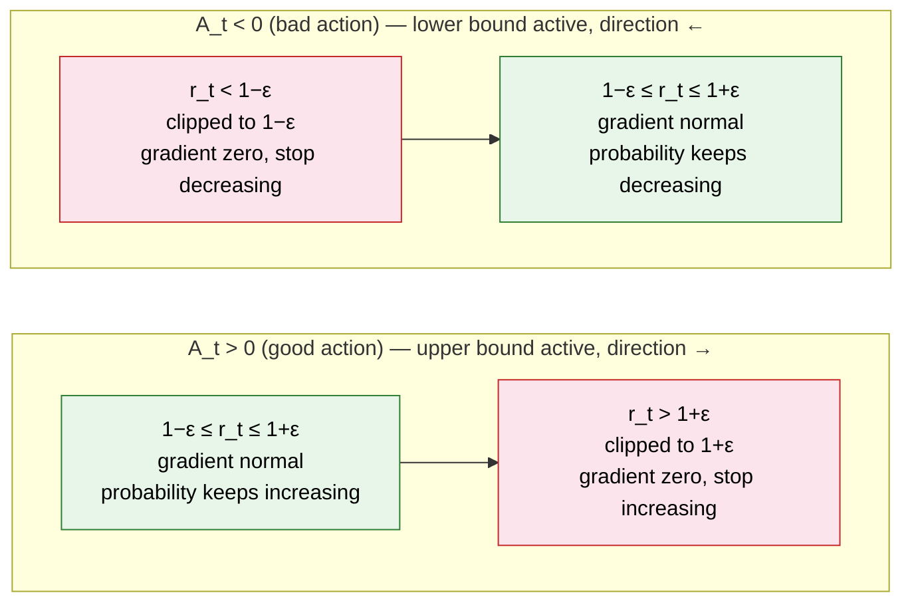

# 5.3 Constraint Mechanisms for Policy Updates

## Section Overview

Section 7.2 derived PPO's clipped surrogate objective:

$$L^{\text{CLIP}}(\theta) = \mathbb{E}_t \left[ \min \left( r_t(\theta) \cdot A_t, \; \text{clip}(r_t(\theta), 1-\varepsilon, 1+\varepsilon) \cdot A_t \right) \right]$$

This objective contains a policy ratio $r_t$, a clipping operation, and an outer min. This section answers two questions: **what does this formula protect, and why can we not simply use the vanilla policy gradient?**

The line of reasoning is: the update risk of vanilla policy gradient → importance sampling for data reuse → TRPO's KL-divergence constraint → PPO's clipped approximation. The entire formula is driven by a single motive: **constrain the magnitude of each update so that a single step cannot ruin the policy**.

To keep the derivation concrete, this section uses a single running example throughout: a state $s$ with two actions $a_1, a_2$, where the initial policy assigns $\pi(a_1 \mid s) = 0.6$ and $\pi(a_2 \mid s) = 0.4$. The central question is: what happens if one update pushes $\pi(a_1 \mid s)$ to $0.99$?

::: tip Prerequisites for This Section

- [The policy-gradient update rule](../chapter08_policy_gradient/reinforce): clipping is designed to protect this update
- [The advantage function $A(s,a)$](../chapter09_actor_critic/advantage-function): the directional signal for policy updates
  :::

## The Update Risk of Vanilla Policy Gradient

Recall the policy-gradient update from Chapter 5 ([REINFORCE](../chapter08_policy_gradient/reinforce)):

$$\theta \leftarrow \theta + \alpha \cdot \nabla_\theta \log \pi_\theta(a \mid s) \cdot A(s,a)$$

When the advantage $A(s,a) > 0$ (better than average), the parameters are updated in the direction that increases $\pi(a \mid s)$. **The problem: there is no upper bound on the magnitude of this update.**

Apply this to the running example. Suppose we sample $(s, a_1)$ with advantage $A(s, a_1) = 2$ and learning rate $\alpha = 0.5$. A single update yields:

|                   | Before | After |
| ----------------- | ------ | ----- |
| $\pi(a_1 \mid s)$ | 0.6    | 0.99  |
| $\pi(a_2 \mid s)$ | 0.4    | 0.01  |

In one step, the probability of $a_1$ rises from 0.6 to 0.99. Yet this is the result of **a single sample** — if the high advantage was partly due to sampling variance, the policy has already compressed the alternative action's probability to 0.01. **Policy updates are irreversible; there is no undo mechanism.**

The next round is worse. Training data was collected under the old policy $\pi_{\text{old}}$, but when we attempt to reuse the same batch, $\pi(a_1 \mid s)$ is already 0.99, far from the 0.6 at which it was sampled. **The old data is stale.**

The core dilemma of vanilla policy gradient is: **single-step updates have high variance, yet policy updates are irreversible**. One bad step renders the entire batch unusable.

> If a single update can damage the policy, then before asking "how much to update," should we not first ensure that the operation of "training a new policy on old data" is itself safe?

## Importance Sampling and Data Reuse

The first problem is data reuse. The sample $(s, a_1)$ was collected under $\pi_{\text{old}}(a_1 \mid s) = 0.6$. Can it be used to update a new policy where $\pi_\theta(a_1 \mid s) = 0.99$?

Mathematically yes, via **importance sampling**. An expectation under one distribution can be rewritten in terms of another using a likelihood ratio:

$$\mathbb{E}_{a \sim \pi_{\text{old}}} \left[ \frac{\pi_\theta(a \mid s)}{\pi_{\text{old}}(a \mid s)} \cdot f(a) \right] = \mathbb{E}_{a \sim \pi_\theta} [f(a)]$$

This ratio $r_t(\theta) = \frac{\pi_\theta(a_t \mid s_t)}{\pi_{\text{old}}(a_t \mid s_t)}$ is called the **policy ratio** — it measures the change in probability that the new policy assigns to the same $(s,a)$ relative to the old.

In the running example:

| Policy                        | $\pi(a_1 \mid s)$ |
| ----------------------------- | ----------------- |
| Old policy $\pi_{\text{old}}$ | 0.6               |
| New policy $\pi_\theta$       | 0.99              |
| $r_t(\theta) = 0.99 / 0.6$    | **1.65**          |

The new policy makes $a_1$ 1.65× more likely. Incorporating this ratio into the policy gradient yields the importance-sampled objective:

$$L^{\text{IS}}(\theta) = \mathbb{E}_t \left[ r_t(\theta) \cdot A_t \right]$$

In form, old data can now evaluate the new policy. But the value 1.65 also exposes a problem: **the gradient is amplified 1.65×**. If the policy pushes $\pi(a_1 \mid s)$ more aggressively to 0.999, then $r_t = 1.665$; at 0.9999, $r_t = 1.6665$. The larger $r_t$ becomes, the larger the next update, which in turn drives $r_t$ even higher — a **positive feedback loop**.

Importance sampling solves the data-reuse problem but provides no guarantee of safe usage.

> Vanilla policy gradient exhibits update risk in a single step, and importance sampling allows $r_t$ to grow without bound. Can the requirement that "each update be bounded in magnitude" be formulated mathematically?

## TRPO and a KL-Divergence Constraint

In 2015, Schulman et al. proposed TRPO (Trust Region Policy Optimization). Its core idea: **constrain the distance between the old and new policies directly**. The standard tool for measuring the difference between two probability distributions is KL divergence (Kullback-Leibler divergence), written here as a hard constraint:

$$\max_\theta \; \mathbb{E}_t \left[ r_t(\theta) \cdot A_t \right] \quad \text{s.t.} \quad \mathbb{E}_t \left[ D_{\text{KL}}(\pi_{\text{old}} \| \pi_\theta) \right] \leq \delta$$

This optimization problem has two parts: the left side $\max_\theta \; \mathbb{E}_t[r_t(\theta) \cdot A_t]$ is the objective to be maximized — the importance-sampled objective, pursuing higher cumulative advantage; the right side $\mathbb{E}_t[D_{\text{KL}}(\pi_{\text{old}} \| \pi_\theta)] \leq \delta$ is the constraint that must be satisfied. "s.t." reads "subject to."

KL divergence measures the difference between two probability distributions, defined as:

$$D_{\text{KL}}(P \| Q) = \sum_i P(i) \log \frac{P(i)}{Q(i)}$$

When the two distributions are identical, $D_{\text{KL}} = 0$; the greater the difference, the larger $D_{\text{KL}}$ (always non-negative). Here $\pi_{\text{old}}$ is the policy before the update and $\pi_\theta$ is the policy after, so $D_{\text{KL}}(\pi_{\text{old}} \| \pi_\theta)$ measures how much a single update changes the policy distribution. The constraint requires this change to not exceed $\delta$.

Returning to the running example. With $\pi_{\text{old}}(a_1) = 0.6$ and $\pi_\theta(a_1) = 0.99$:

$$D_{\text{KL}}(\pi_{\text{old}} \| \pi_\theta) = 0.6 \ln\frac{0.6}{0.99} + 0.4 \ln\frac{0.4}{0.01} \approx 0.6 \times (-0.50) + 0.4 \times 3.69 \approx 1.18$$

The result is approximately 1.18, far exceeding $\delta = 0.01$. TRPO would reject this update outright and pull the policy back inside the trust region.

$\delta$ is typically 0.01, meaning the policy's behavior distribution may change by at most 1% per update. This defines a **trust region**: the policy may move freely within it, but any update that crosses the boundary is rejected.

Elegant in theory, but difficult in practice. Solving this constrained optimization requires the Hessian matrix (second derivatives of the parameters). For a network with millions of parameters, the Hessian's dimension is the square of the parameter count and cannot fit in memory. In the LLM setting, the policy itself is a 70B-parameter language model; computing its Hessian is entirely infeasible. TRPO approximates the solution via conjugate gradient, but it remains slow and complex to implement. **The cost of strict constraints is computational expense.**

> TRPO's constraint is so precise that the computational cost becomes prohibitive. Is there a method that is less strict than TRPO yet still effectively bounds the magnitude of each update?

## PPO's Clipping Mechanism

In 2017, Schulman proposed PPO (Proximal Policy Optimization). The previous section noted that TRPO's difficulty is the cost of precisely computing KL divergence, which requires the Hessian matrix. PPO's key insight: **since the goal is simply to keep the old and new policies "not too far apart," there is no need to measure the distance precisely — just bound the policy ratio $r_t$ directly.**

Recall the definition of $r_t$: $r_t = \pi_\theta(a_t \mid s_t) / \pi_{\text{old}}(a_t \mid s_t)$. When $r_t = 1$, the new and old policies agree exactly on that action; the more $r_t$ deviates from 1, the larger the policy change. Therefore, constraining $r_t$ within $[1-\varepsilon, 1+\varepsilon]$ is equivalent to limiting the probability change of each action — a local, inexpensive approximation of the goal "policy distance must not be too large," requiring neither KL computation nor the Hessian.

PPO's objective:

$$L^{\text{CLIP}}(\theta) = \mathbb{E}_t \left[ \min \left( r_t(\theta) \cdot A_t, \; \text{clip}(r_t(\theta), 1-\varepsilon, 1+\varepsilon) \cdot A_t \right) \right]$$

Using the 1.65 example from above ($\varepsilon = 0.2$, $A_t = 2$). With $r_t = 1.65$, compute each term:

**Unclipped term**: $r_t \cdot A_t = 1.65 \times 2 = 3.30$.

**Clipped term**: since $r_t = 1.65 > 1 + \varepsilon = 1.2$, it exceeds the upper bound, so the clipping operation truncates $r_t$ to $1.2$. The clipped term is then $1.2 \times 2 = 2.40$.

**Take the minimum**: $\min(3.30,\; 2.40) = 2.40$.

| Term         | Computation                                          | Value      |
| ------------ | ---------------------------------------------------- | ---------- |
| Unclipped    | $r_t \cdot A_t = 1.65 \times 2$                      | $3.30$     |
| Clipped      | $\text{clip}(1.65, 0.8, 1.2) \cdot 2 = 1.2 \times 2$ | $2.40$     |
| $\min$ picks | $\min(3.30,\; 2.40)$                                 | **$2.40$** |

Clipping compresses the larger objective value (3.30) down to 2.40. The objective becomes constant in this interval — **its dependence on $\theta$ vanishes, and the policy is no longer encouraged to increase $\pi(a_1 \mid s)$ further.**

The formula consists of three terms, each with a distinct role:

- **Unclipped term** $r_t(\theta) \cdot A_t$: the standard policy-gradient objective after importance sampling — the product of the policy ratio and the advantage.
- **Clipped term** $\text{clip}(r_t(\theta), 1-\varepsilon, 1+\varepsilon) \cdot A_t$: constrains $r_t$ within $[1-\varepsilon, 1+\varepsilon]$. $\varepsilon$ is typically 0.1 or 0.2, corresponding to a maximum change of 10% or 20% in policy probability.
- **Minimum** $\min(\cdot, \cdot)$: selects the more conservative of the two values.

### Directionality of the Clipping Mechanism

The effect of clipping depends on the sign of the advantage $A_t$, with the upper and lower bounds activating under different conditions:

**When $A_t > 0$ (a good action)**: the update direction should increase $r_t(\theta)$. Clipping imposes an upper bound of $1+\varepsilon$ on $r_t$ — any value exceeding it is truncated. Even if a good action carries a high advantage, the policy probability cannot grow without bound in that direction.

**When $A_t < 0$ (a bad action)**: the update direction should decrease $r_t(\theta)$. Clipping imposes a lower bound of $1-\varepsilon$ on $r_t$, preventing the policy probability from being reduced excessively.



As shown, $r_t$ is constrained by clipping only in the "advantage-consistent direction": the upper bound $1+\varepsilon$ activates when $A_t > 0$, and the lower bound $1-\varepsilon$ activates when $A_t < 0$. Once $r_t$ crosses the corresponding boundary, the gradient becomes zero and the update stops.

A question remains, however: what if $r_t$ crosses the boundary in the **opposite** direction — for instance, $A_t > 0$ calls for increasing $r_t$, yet $r_t$ has fallen below $1-\varepsilon$? Can the clipping term handle this case on its own? This is precisely the reason the outer $\min$ exists.

### The Role of the Minimum

The clipping term has zero gradient at both ends. How can the outer $\min$ guarantee that the overall objective has a non-zero gradient? More pointedly: $\min$ picks one of two candidates — **could it ever pick the zero-gradient clipped term and stall the policy?**

No. $\min$ always picks the **numerically smaller** of the two candidates, and the arithmetic structure of clip happens to make "smaller" equivalent to "gradient direction is correct". Verify case by case.

Fix $A_t > 0$ (so $r_t$ should increase) and examine the two out-of-bounds cases.

**Same-direction overshoot** ($r_t > 1+\varepsilon$). Clip truncates to $1+\varepsilon$:

| Term      | Expression            | Value ($r_t=1.65$, $\varepsilon=0.2$, $A_t=2$) |
| --------- | --------------------- | ---------------------------------------------- |
| Unclipped | $r_t \cdot A_t$       | $1.65 \times 2 = 3.30$ (larger)                |
| Clipped   | $(1+\varepsilon) A_t$ | $1.2 \times 2 = 2.40$ (smaller)                |

Since $r_t > 1+\varepsilon$ implies $r_t A_t > (1+\varepsilon) A_t$, $\min$ picks the clipped term — gradient zero. **As intended**: a good action has already overshot the tolerance; the update stops.

**Opposite-direction overshoot** ($r_t < 1-\varepsilon$). Clip truncates to $1-\varepsilon$:

| Term      | Expression            | Value ($r_t=0.5$, $\varepsilon=0.2$, $A_t=2$) |
| --------- | --------------------- | --------------------------------------------- |
| Unclipped | $r_t \cdot A_t$       | $0.5 \times 2 = 1.0$ (smaller)                |
| Clipped   | $(1-\varepsilon) A_t$ | $0.8 \times 2 = 1.6$ (larger)                 |

Since $r_t < 1-\varepsilon$ implies $r_t A_t < (1-\varepsilon) A_t$, $\min$ picks the unclipped term. This term contains the true $r_t(\theta)$, so the chain rule gives a non-zero gradient pointing toward larger $r_t$:

$$\nabla_\theta[r_t \cdot A_t] = A_t \cdot \nabla_\theta r_t = 2 \cdot \frac{\nabla_\theta \pi_\theta(a_t\mid s_t)}{0.6} = \tfrac{10}{3}\,\nabla_\theta \pi_\theta(a_t\mid s_t) \neq 0$$

This is precisely the corrective signal that pulls the policy back into $[1-\varepsilon, 1+\varepsilon]$.

The two cases for $A_t < 0$ (a bad action, so $r_t$ should decrease) are symmetric to the above — both values are negative, and "smaller" means larger in magnitude (heavier penalty).

**Same-direction overshoot** ($r_t < 1-\varepsilon$). Clip truncates to $1-\varepsilon$:

| Term      | Expression            | Value ($r_t=0.5$, $\varepsilon=0.2$, $A_t=-2$) |
| --------- | --------------------- | ---------------------------------------------- |
| Unclipped | $r_t \cdot A_t$       | $0.5 \times (-2) = -1.0$ (smaller magnitude)   |
| Clipped   | $(1-\varepsilon) A_t$ | $0.8 \times (-2) = -1.6$ (larger magnitude)    |

Multiplying both sides by the negative $A_t = -2$ flips the inequality: $r_t < 1-\varepsilon$ implies $r_t A_t > (1-\varepsilon) A_t$, i.e. $-1.0 > -1.6$, so $\min$ picks the clipped term $-1.6$ — gradient zero. **As intended**: the bad action's probability has been reduced enough; the update stops.

**Opposite-direction overshoot** ($r_t > 1+\varepsilon$). Clip truncates to $1+\varepsilon$:

| Term      | Expression            | Value ($r_t=1.65$, $\varepsilon=0.2$, $A_t=-2$) |
| --------- | --------------------- | ----------------------------------------------- |
| Unclipped | $r_t \cdot A_t$       | $1.65 \times (-2) = -3.30$ (larger magnitude)   |
| Clipped   | $(1+\varepsilon) A_t$ | $1.2 \times (-2) = -2.40$ (smaller magnitude)   |

$r_t > 1+\varepsilon$ implies $r_t A_t < (1+\varepsilon) A_t$, i.e. $-3.30 < -2.40$, so $\min$ picks the unclipped term $-3.30$ — gradient non-zero, pointing toward smaller $r_t$, pulling the policy back into the safe interval.

The four out-of-bounds cases:

| $A_t$ | $r_t$ position    | Magnitude relation    | $\min$ picks    | Gradient                | Design intent                 |
| ----- | ----------------- | --------------------- | --------------- | ----------------------- | ----------------------------- |
| $>0$  | $> 1+\varepsilon$ | unclipped $>$ clipped | clipped value   | zero (flat region)      | same-direction stop           |
| $>0$  | $< 1-\varepsilon$ | unclipped $<$ clipped | unclipped value | nonzero, increase $r_t$ | opposite-direction correction |
| $<0$  | $< 1-\varepsilon$ | unclipped $>$ clipped | clipped value   | zero (flat region)      | same-direction stop           |
| $<0$  | $> 1+\varepsilon$ | unclipped $<$ clipped | unclipped value | nonzero, decrease $r_t$ | opposite-direction correction |

<details>
<summary>Formal proof that the gradient never reverses (optional)</summary>

The table above verifies the min's choice across four cases. Can we give a unified mathematical guarantee that does not depend on case analysis? Yes — and the proof is remarkably short.

**Proposition**: For any $r_t > 0$ and $A_t \neq 0$, the PPO objective $L(r_t, A_t) = \min(r_t A_t,\; c \cdot A_t)$ (where $c = \text{clip}(r_t, 1-\varepsilon, 1+\varepsilon)$) satisfies the following with respect to the partial derivative in $r_t$:

$$\frac{\partial L}{\partial r_t} \in \{0,\; A_t\}$$

**Corollary**: $A_t \cdot \frac{\partial L}{\partial r_t} \in \{0,\; A_t^2\} \geq 0$. That is, the gradient component is either zero or has the same sign as $A_t$ — **it never reverses**.

**Proof**: By the derivative rule of min — pick the smaller of two terms, and its derivative equals that term's derivative. As a function of $r_t$, $c$ has only three forms:

| $r_t$ position                              | $c$             | $\frac{dc}{dr_t}$ |
| ------------------------------------------- | --------------- | ----------------- |
| $r_t < 1-\varepsilon$                       | $1-\varepsilon$ | $0$               |
| $1-\varepsilon \leq r_t \leq 1+\varepsilon$ | $r_t$           | $1$               |
| $r_t > 1+\varepsilon$                       | $1+\varepsilon$ | $0$               |

Determine which term $L$ equals, case by case:

- **$r_t \in [1-\varepsilon, 1+\varepsilon]$**: $c = r_t$, the two terms are equal, $L = r_t A_t$, so $\frac{\partial L}{\partial r_t} = A_t$.
- **$r_t > 1+\varepsilon$**: $c = 1+\varepsilon$ is constant.
  - $A_t > 0$: $r_t A_t > (1+\varepsilon) A_t$, min picks the clipped term (constant), so $\frac{\partial L}{\partial r_t} = 0$.
  - $A_t < 0$: multiplying by a negative flips the inequality, $r_t A_t < (1+\varepsilon) A_t$, min picks the unclipped term, so $\frac{\partial L}{\partial r_t} = A_t$.
- **$r_t < 1-\varepsilon$**: $c = 1-\varepsilon$ is constant.
  - $A_t > 0$: $r_t A_t < (1-\varepsilon) A_t$, min picks the unclipped term, so $\frac{\partial L}{\partial r_t} = A_t$.
  - $A_t < 0$: after the flip $r_t A_t > (1-\varepsilon) A_t$, min picks the clipped term (constant), so $\frac{\partial L}{\partial r_t} = 0$.

The five reachable cases (one inside the interval, two on each side) give $\frac{\partial L}{\partial r_t} \in \{0, A_t\}$. QED. $\square$

**Geometric interpretation**: As a function of $r_t$, $L$ is a piecewise polyline whose slope takes only two values — $0$ or $A_t$. Segments with slope $A_t$ (containing the true $r_t$) supply the corrective gradient; segments with slope $0$ (clip's flat regions) halt the update. The slope of the entire curve never takes the value $-A_t$ — **this is precisely the geometric portrait of "the gradient never reverses"**.

By the chain rule $\nabla_\theta L = \frac{\partial L}{\partial r_t} \cdot \nabla_\theta r_t$, combined with $r_t(\theta) = \pi_\theta(a_t\mid s_t) / \pi_{\text{old}}(a_t\mid s_t)$ ($\pi_{\text{old}}$ is a positive constant):

- When $\frac{\partial L}{\partial r_t} = A_t > 0$, $\nabla_\theta L$ points in the direction that increases $\pi_\theta(a_t\mid s_t)$ — good actions are reinforced.
- When $\frac{\partial L}{\partial r_t} = A_t < 0$, $\nabla_\theta L$ points in the direction that decreases $\pi_\theta(a_t\mid s_t)$ — bad actions are suppressed.
- When $\frac{\partial L}{\partial r_t} = 0$, the gradient is zero and the update stops — and this only occurs when the policy has overshot in the correct direction, where stopping is the design intent.

**Every PPO update either stops, or moves in the direction indicated by the advantage — it never reverses, and it never stalls when correction is needed.**

</details>

Across all four cases, $\min$ consistently picks the **more pessimistic** (numerically smaller) candidate: same-direction overshoot makes clip cut the inflated reward, so the clipped value is more pessimistic; opposite-direction overshoot makes the unclipped value honestly expose that the reward really is low, so the unclipped value is more pessimistic. **"More pessimistic" coincides exactly with "gradient direction is correct"** — this is the intuition behind the formal proof above.

> Replacing $\min$ with $\max$ flips the rule to "pick the more optimistic": same-direction overshoot would no longer be cut (encouraging further excursions), and opposite-direction overshoot would have its reward inflated (rewarding the wrong direction). Both cases fail. $\min$ cannot be replaced by $\max$.

## Visualizing the Clipping Mechanism

The following code illustrates the behavior of the clipped objective:

```python
import numpy as np
import matplotlib.pyplot as plt

# ==========================================
# Visualize the PPO Clip objective
# ==========================================
epsilon = 0.2
r = np.linspace(0.0, 2.0, 500)  # policy ratio r_t(θ)

def ppo_clip_objective(r, A, eps=0.2):
    """PPO clipped objective: L = min(r * A, clip(r, 1-eps, 1+eps) * A)"""
    r_clipped = np.clip(r, 1 - eps, 1 + eps)
    return np.minimum(r * A, r_clipped * A)

fig, (ax1, ax2) = plt.subplots(1, 2, figsize=(12, 5))

# Case: A > 0
A_pos = 1.0
obj_pos = ppo_clip_objective(r, A_pos)
ax1.plot(r, r * A_pos, 'b--', alpha=0.5, label='Unclipped: r × A')
ax1.plot(r, obj_pos, 'r-', linewidth=2, label='PPO: min(r×A, clip(r)×A)')
ax1.axvline(x=1+epsilon, color='gray', linestyle=':', label=f'1+ε={1+epsilon}')
ax1.axvline(x=1-epsilon, color='gray', linestyle=':', label=f'1-ε={1-epsilon}')
ax1.set_title('A > 0 (good action)')
ax1.set_xlabel('Policy ratio r_t(θ)')
ax1.set_ylabel('Objective value')
ax1.legend()

# Case: A < 0
A_neg = -1.0
obj_neg = ppo_clip_objective(r, A_neg)
ax2.plot(r, r * A_neg, 'b--', alpha=0.5, label='Unclipped: r × A')
ax2.plot(r, obj_neg, 'r-', linewidth=2, label='PPO: min(r×A, clip(r)×A)')
ax2.axvline(x=1+epsilon, color='gray', linestyle=':', label=f'1+ε={1+epsilon}')
ax2.axvline(x=1-epsilon, color='gray', linestyle=':', label=f'1-ε={1-epsilon}')
ax2.set_title('A < 0 (bad action)')
ax2.set_xlabel('Policy ratio r_t(θ)')
ax2.legend()

plt.suptitle('Behavior of the PPO Clip objective (ε=0.2)', fontsize=14)
plt.tight_layout()
plt.savefig("ppo_clip_visualization.png", dpi=150)
print("Saved visualization of the clipped objective")
```

Running this code shows: when $A > 0$, the objective becomes flat once $r_t > 1.2$ (the gradient goes to zero and the update stops); when $A < 0$, the objective becomes flat once $r_t < 0.8$. This is the core effect of PPO clipping — once the policy ratio leaves the safe interval, the gradient automatically vanishes.

## Sensitivity to $\varepsilon$

The choice of $\varepsilon$ directly affects training dynamics. The table below summarizes practical experience:

| ε value | Update size | Training speed           | Stability        | Typical use case                         |
| ------: | ----------- | ------------------------ | ---------------- | ---------------------------------------- |
|    0.05 | very small  | very slow                | extremely stable | fine-tuning an already trained policy    |
|     0.1 | small       | slower                   | stable           | LLM alignment (large models are fragile) |
|     0.2 | medium      | moderate                 | moderate         | games/control tasks (a common default)   |
|     0.3 | larger      | faster                   | unstable         | quick experiments/simple tasks           |
|     0.5 | very large  | fast but often collapses | very unstable    | not recommended                          |

In LLM alignment, a smaller $\varepsilon$ (around 0.1 or less) is commonly used, because the policy space of a language model is larger and more brittle: a single poorly controlled update can degrade the model's general language ability (for instance, losing an already acquired language).

<details>
<summary>Question: If PPO clipping makes training "too conservative," can we speed it up without sacrificing stability?</summary>

Several common strategies are used in practice:

1. **Adaptive ε**: PPO-PPG (Phasic Policy Gradient) suggests using a larger ε early in training and gradually shrinking it later, like “take big steps to explore first, then take small steps to refine.”
2. **More update epochs per batch**: PPO commonly performs multiple epochs (often 10) over the same batch of data. If clipping makes each step small, increasing the number of epochs can accumulate a meaningful overall update.
3. **Early stopping based on KL divergence**: monitor the KL divergence during optimization, and stop early if KL exceeds a threshold within an epoch. This effectively combines the TRPO idea (a KL constraint) with PPO’s clipping.

In practice, the second approach is the most common. PPO’s default `n_epochs=10` is already motivated by the idea that clipping limits per-step movement, so multiple passes are used to accumulate sufficient progress.

</details>

<details>
<summary>Question: TRPO is more theoretically principled. Why does industry almost always choose PPO?</summary>

Because in engineering practice, “simple and reliable” usually beats “theoretically perfect.”

TRPO requires second-order machinery (Hessian-vector products). On large models this is slow, complex to implement, and easy to get wrong. PPO, in contrast, can be implemented with a simple `torch.clamp` and a `min`, often in under ten lines of code.

The PPO paper (2017) also shows empirically that PPO matches TRPO and often performs as well or better across many tasks. One reason is that TRPO’s own second-order approximations introduce error; solving the constrained problem precisely does not necessarily outperform PPO’s simple heuristic clipping.

This tradeoff becomes even clearer in the LLM era. For a 70B-parameter policy, second-order optimization is simply not practical. OpenAI’s alignment training in InstructGPT and GPT-4 uses PPO rather than TRPO for exactly these reasons.

</details>

This completes the derivation of PPO's clipping mechanism: from the update risk of vanilla policy gradient, to data reuse via importance sampling, to TRPO's KL constraint, and finally to PPO's clipped approximation. But PPO has another key component not covered here: GAE (Generalized Advantage Estimation), and the major burden it introduces in LLM alignment — the reward model. See [Advantage Estimation and Reward Modeling](./gae-reward-model).
