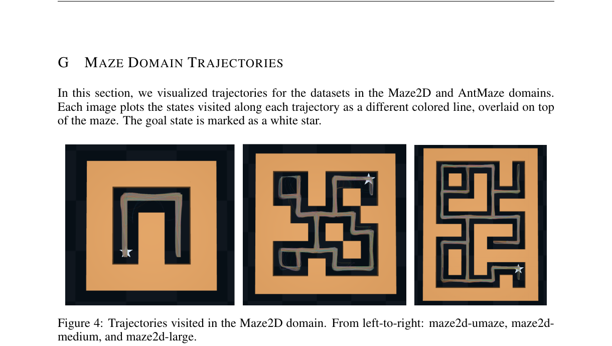
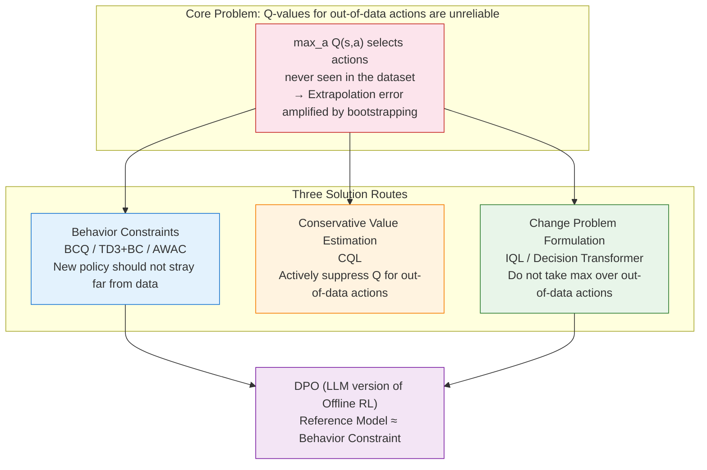

# 12.5 Offline Reinforcement Learning: From Historical Data to Reliable Policies

<a id="article-start"></a>

Most RL algorithms we have studied share an implicit assumption: the agent can keep interacting with the environment while learning. DQN can repeatedly play Atari, PPO can fall and restart in simulation, GRPO can keep generating new answers and scoring them with rules.

But many real-world settings are not like this. Autonomous driving cannot explore safety boundaries through real accidents. Medical decision-making cannot run randomized trials on patients. Industrial robots cannot crash expensive tooling every day. Recommender systems cannot deploy high-risk policies to real users for extended periods.

The common structure of these problems is: **we have large amounts of historical data, but cannot continue trial-and-error during training.** This is the problem **Offline Reinforcement Learning (Offline RL)** aims to solve.


<div style="text-align: center; font-size: 0.9em; color: var(--vp-c-text-2); margin-top: -10px; margin-bottom: 20px;">
  <em>Figure 1: Comparison of training approaches for online RL, off-policy RL, and offline RL. Offline RL's dataset is collected only once; training involves no further interaction with the MDP. Source: Levine et al., "Offline Reinforcement Learning: Tutorial, Review, and Perspectives on Open Problems", Fig. 1.</em>
</div>

::: tip Reading Path
If the mathematical notation is unclear at first, start with [Intuition First](#intuition-first) and [Minimal Practice](#minimal-offline-practice). The "expand" dropdowns below formulas are slow-paced explanations that you can skip on a first pass.
:::

## Intuition First {#intuition-first}

Offline RL can be summarized in one sentence:

**Given only a collection of past trajectories, learn a new policy to deploy in the future.**

It is similar to three other approaches, but not identical:

| Method                  | Data Source                                       | Can Continue Trial-and-Error During Training? | What Is Learned                                       |
| ----------------------- | ------------------------------------------------- | --------------------------------------------- | ----------------------------------------------------- |
| Online RL               | Current policy live sampling                      | Yes                                           | Optimize policy through trial-and-error               |
| Off-policy RL           | Replay buffer + new interactions                  | Yes                                           | Reuse old data while collecting new data              |
| Imitation Learning / BC | Expert or historical actions                      | No                                            | Imitate actions in the data                           |
| Offline RL              | Fixed historical dataset                          | No                                            | Improve return without straying too far from the data |
| Offline-to-Online RL    | First fixed data, then limited online interaction | In the later stage                            | Safe initialization first, then real fine-tuning      |

The key danger is: offline data only covers actions that the behavior policy actually took. After training, if the new policy starts selecting actions not seen in the data, we have no idea what will happen. The Q-function may assign these actions erroneously high values due to neural network extrapolation.

So the core of offline RL is not "how to aggressively find high-Q actions," but rather:

**How to learn a better policy from fixed data, without being misled by hallucinated out-of-distribution actions.**

## The Mathematical Problem: Policy Optimization with Fixed Data

The standard MDP remains:

$$
\mathcal{M}=(\mathcal{S},\mathcal{A},p,r,\gamma)
$$

Online RL optimizes the policy return:

$$
J(\pi)=
\mathbb{E}_{\tau\sim p,\pi}
\left[
\sum_{t=0}^{\infty}\gamma^t r(s_t,a_t)
\right]
$$

But Offline RL cannot continue sampling from $\pi$. It only has a fixed dataset:

$$
\mathcal{D}
=
\{(s_t,a_t,r_t,s_{t+1},d_t)\}_{t=1}^{N},
\qquad
a_t\sim \pi_\beta(\cdot\mid s_t)
$$

Here $\pi_\beta$ is the **behavior policy**, i.e., the old policy that collected the data. It could be a human driver, an old recommender system, an expert policy, a random exploration policy, or a mixture of many policies.

::: details Expand: How to read these formulas?
`D` is the offline dataset. Think of it as a collection of recordings, where each frame records the state `s_t`, action `a_t`, reward `r_t`, next state `s_{t+1}`, and whether the episode ended `d_t`.

`pi_beta` is "who recorded these videos." If the data comes from human drivers, `pi_beta` represents human driving behavior; if from an old model, `pi_beta` is that old model's policy.

What we actually want to deploy is the new policy `pi`. The problem: during training, we cannot let `pi` go on the road to keep trying; we can only use `D` to judge whether it is good.

[Back to intuition](#intuition-first) / [Back to article start](#article-start)
:::

If we directly apply Q-learning, we encounter a typical backup:

$$
y_t
=
r_t+\gamma(1-d_t)\max_{a'}Q_{\bar{\theta}}(s_{t+1},a')
$$

This step is natural in online RL, because if an action is overestimated, the agent can later actually try it and correct with real feedback. But in offline RL, $\max_{a'}$ will likely select an action that never appeared in the dataset. This action's Q-value is merely a neural network extrapolation and may not be trustworthy.

This is the **extrapolation error** or **out-of-distribution action** problem.

::: details Expand: Why does max create out-of-distribution actions?
The Q-network must answer "how good is any state-action pair?" But offline data only tells it how good the actions that appeared in the data are.

When we write `max_a Q(s, a)`, the optimizer searches the entire action space for the highest value. Neural network predictions on unseen actions can be arbitrary. If an unseen action is erroneously estimated high, `max` picks it out, and the policy shifts toward it.

Online RL has a correction opportunity: actually try it, discover it is bad, and lower the Q. Offline RL has no such opportunity; errors get repeatedly amplified through bootstrapping.
:::

In engineering terms:

**Online RL fears exploring too slowly; Offline RL fears the model believing things it has never seen.**

## Minimal Practice: Reproducing the OOD Action Problem {#minimal-offline-practice}

Let us first do an experiment small enough to understand completely. The full script is at [minimal_offline_rl_contextual_bandit.py](./snippets/minimal_offline_rl_contextual_bandit.py).

This environment is not a full MDP but a contextual bandit. It is small enough yet reproduces the core pitfall of offline RL: **the data only covers a narrow action region, and naive Q-maximization runs to extreme actions not covered by the data.**

Run:

```bash
python docs/chapter32_selfplay/offline-rl/snippets/minimal_offline_rl_contextual_bandit.py
```

Typical output:

```text
behavior_policy  return=-0.0480 support_gap=0.0000
oracle_policy    return= 0.0000 support_gap=unknown
naive_q_actor    return=-0.1137 support_gap=0.4819
cql_actor        return=-0.0420 support_gap=0.0112
td3bc_actor      return=-0.0260 support_gap=0.0520
```

Here `support_gap` measures how far the policy's actions are from the dataset's behavior actions. `naive_q_actor` has a large gap, meaning it was attracted by Q-network extrapolation to regions not covered by the data, resulting in worse actual return. `cql_actor` and `td3bc_actor` are more conservative, keeping actions near the data.

The core code has only two parts.

First, naive Q only fits rewards on data actions:

```python
q_data = q(state, action)
loss = ((q_data - reward) ** 2).mean()
```

Second, CQL adds a conservative term: randomly sample some actions, and if the Q-network gives them high scores, penalize it:

```python
q_random = q(repeated_state, random_action).reshape(batch_size, num_random_actions)
conservative_penalty = torch.logsumexp(q_random, dim=1).mean() - q_data.mean()
loss = mse_loss + alpha * conservative_penalty
```

This is not a complete CQL paper implementation, but it captures the core intuition: **make Q-values lower for out-of-data actions, so the policy is less likely to be led astray by hallucinated high values.**

## Data Quality: Offline RL Is First and Foremost a Data Problem

Offline data is not "more is better"; what matters is what it covers.



<div style="text-align: center; font-size: 0.9em; color: var(--vp-c-text-2); margin-top: -10px; margin-bottom: 20px;">
  <em>Figure 2: Maze2D trajectory coverage in D4RL. Offline data records paths taken by the behavior policy; whether the algorithm can "stitch" existing fragments together is a key capability of offline RL. Source: Fu et al., "D4RL: Datasets for Deep Data-Driven Reinforcement Learning", Fig. 4.</em>
</div>

The D4RL paper categorizes offline RL datasets into many types[^d4rl]. This is closer to the real world than simply saying "expert data":

| Data Type        | Intuition                                                         | Difficulty                                             |
| ---------------- | ----------------------------------------------------------------- | ------------------------------------------------------ |
| random           | Collected by random policy                                        | Low return, but coverage may be broad                  |
| medium           | Collected by medium-quality policy                                | Learnable signal, but many bad actions                 |
| expert           | Collected by expert policy                                        | High quality, but narrow coverage                      |
| medium-replay    | Replay buffer during training                                     | Mixed policies from poor to good                       |
| mixed / multiway | Multiple policies, multiple trajectory segments stitched together | Needs to stitch good fragments                         |
| narrow demos     | Few demonstrations                                                | Imitation is easy; exceeding demos is hard to evaluate |

This explains why behavior cloning is sometimes strong: if the data is almost entirely expert trajectories, imitation suffices. It also explains why Offline RL is sometimes more valuable than imitation: if the data contains many suboptimal trajectories, the algorithm needs to identify which actions are better rather than blindly imitating all actions on average.

## Method Map: Routes in Offline RL

There are many offline RL methods, but they can be understood by "how they avoid out-of-distribution actions."

| Route                               | Representative Methods                              | Core Approach                                                      |
| ----------------------------------- | --------------------------------------------------- | ------------------------------------------------------------------ |
| Behavior constraints                | BCQ[^bcq], BEAR[^bear], TD3+BC[^td3bc], AWAC[^awac] | New policy should not stray far from data behavior                 |
| Conservative value estimation       | CQL                                                 | Actively suppress Q-values for out-of-data actions                 |
| Implicit value learning             | IQL                                                 | Do not take max over out-of-data actions                           |
| Sequence modeling                   | Decision Transformer                                | Do not learn Q; directly conditionally generate actions            |
| Model-assisted + planning           | MOPO[^mopo], MOReL[^morel], COMBO[^combo]           | Learn a model, but penalize uncertain model regions                |
| Offline-to-Online                   | AWAC, IQL fine-tuning                               | First safe offline initialization, then limited online fine-tuning |
| LLM preference offline optimization | DPO etc.                                            | Update language model policy with fixed preference data            |

This article focuses on CQL, IQL, and Decision Transformer, because they represent three clear ideas: **conservative Q, avoiding OOD max, treating RL as sequence modeling.**



## CQL: Suppressing Out-of-Data Actions

CQL (Conservative Q-Learning) directly confronts the Q-overestimation problem[^cql].

The standard Bellman error is:

$$
\mathcal{L}_{\text{TD}}(\theta)
=
\mathbb{E}_{(s,a,r,s')\sim\mathcal{D}}
\left[
\left(
Q_\theta(s,a)-
\left(r+\gamma V_{\bar{\theta}}(s')\right)
\right)^2
\right]
$$

CQL adds a conservative term on top. In discrete action spaces, a common formulation is:

$$
\mathcal{L}_{\text{CQL}}(\theta)
=
\mathcal{L}_{\text{TD}}(\theta)
+
\alpha
\left(
\mathbb{E}_{s\sim\mathcal{D}}
\left[
\log\sum_a \exp Q_\theta(s,a)
\right]
-
\mathbb{E}_{(s,a)\sim\mathcal{D}}
\left[
Q_\theta(s,a)
\right]
\right)
$$

The first term penalizes high Q-values across all actions; the second term preserves Q-values for actions that actually appeared in the data. Intuitively, CQL makes the Q-function pessimistic: **prefer to underestimate unseen actions rather than lead the policy into dangerous blind spots.**


<div style="text-align: center; font-size: 0.9em; color: var(--vp-c-text-2); margin-top: -10px; margin-bottom: 20px;">
  <em>Figure 3: Experimental curves from the CQL paper showing Q-gap and return changes. CQL mitigates value overestimation and degradation that can occur with policy constraint methods through conservative value estimation. Source: Kumar et al., "Conservative Q-Learning for Offline Reinforcement Learning", Fig. 2.</em>
</div>

::: details Expand: How to read the CQL formula step by step?
`logsumexp` can be understood as a smooth version of `max`. If some actions have high Q-values, this term becomes large.

`E_D Q(s,a)` only looks at actions that actually appeared in the dataset. CQL uses it to offset part of the penalty, so in-data actions are not all suppressed.

`alpha` controls the degree of conservatism. Too small, and OOD overestimation cannot be suppressed; too large, and the policy over-imitates the data and cannot learn improvements.
:::

In code, CQL's flavor is:

```python
q_data = q(state, data_action)
q_random = q(state_repeated, random_action).view(batch_size, num_random_actions)

td_loss = ((q_data - bellman_target) ** 2).mean()
cql_penalty = torch.logsumexp(q_random, dim=1).mean() - q_data.mean()
loss = td_loss + alpha * cql_penalty
```

## IQL: No Max Over Out-of-Data Actions

IQL (Implicit Q-Learning) takes a more restrained approach: it does not explicitly constrain the policy, nor does it perform $\arg\max$ over the action space. Instead, it only uses dataset actions to learn value and Q[^iql].

Its core is expectile regression. First, learn a value function:

$$
\mathcal{L}_{V}(\psi)
=
\mathbb{E}_{(s,a)\sim\mathcal{D}}
\left[
L_2^\tau
\left(
Q_{\bar{\theta}}(s,a)-V_\psi(s)
\right)
\right]
$$

where the asymmetric squared loss is:

$$
L_2^\tau(u)=|\tau-\mathbf{1}(u<0)|u^2
$$

When $\tau>0.5$, $V(s)$ moves closer to the high-Q portion of data actions. It is essentially asking: **among the actions that appeared in the dataset, approximately how good is the better subset?**


<div style="text-align: center; font-size: 0.9em; color: var(--vp-c-text-2); margin-top: -10px; margin-bottom: 20px;">
  <em>Figure 4: IQL uses expectile regression to estimate high-value states from data actions. Different τ values shift the regression target toward different positions in the distribution. Source: Kostrikov et al., "Offline Reinforcement Learning with Implicit Q-Learning", Fig. 1.</em>
</div>

Then the Q-function uses this value as a target:

$$
\mathcal{L}_{Q}(\theta)
=
\mathbb{E}_{(s,a,r,s')\sim\mathcal{D}}
\left[
\left(
Q_\theta(s,a)-r-\gamma V_\psi(s')
\right)^2
\right]
$$

Finally, the policy does not directly maximize Q but performs advantage-weighted behavior cloning:

$$
\mathcal{L}_{\pi}(\omega)
=
-
\mathbb{E}_{(s,a)\sim\mathcal{D}}
\left[
\exp(\beta A(s,a))
\log \pi_\omega(a\mid s)
\right]
$$

where:

$$
A(s,a)=Q_\theta(s,a)-V_\psi(s)
$$

In other words: actions in the data that are better than average are imitated more; actions that are worse are imitated less. The entire process never asks "how high is Q for some out-of-data action?"

::: details Expand: Why is IQL stable?
IQL's key is converting "find the optimal action" into "pick better actions from data actions."

Standard Q-learning takes max over all actions at `next_state`, easily selecting OOD actions. IQL's value target comes from the expectile of data actions and does not require explicitly searching the action space.

This is why IQL is popular in continuous-action offline control: the formulas seem roundabout, but the implementation is quite clean, and hyperparameter tuning is usually lighter than CQL.
:::

A minimal version of the code looks like this:

```python
diff = q_target(state, data_action) - value(state)
weight = torch.where(diff > 0, tau, 1.0 - tau)
value_loss = (weight * diff.pow(2)).mean()

q_target_value = reward + gamma * next_value
q_loss = (q(state, data_action) - q_target_value).pow(2).mean()

advantage = q(state, data_action) - value(state)
actor_weight = torch.exp(beta * advantage).clamp(max=100.0)
actor_loss = -(actor_weight * policy.log_prob(data_action, state)).mean()
```

## Decision Transformer: Treating Trajectories as Sequences

Decision Transformer (DT) takes a third route: instead of learning Q-functions or writing Bellman backups, it reframes reinforcement learning as conditional sequence modeling[^dt].

A trajectory can be written as:

$$
(\hat{R}_1,s_1,a_1,\hat{R}_2,s_2,a_2,\ldots,\hat{R}_T,s_T,a_T)
$$

where $\hat{R}_t$ is the return-to-go:

$$
\hat{R}_t=\sum_{t'=t}^{T}r_{t'}
$$

During training, the Transformer learns:

$$
\pi_\theta(a_t\mid \hat{R}_t,s_{\le t},a_{<t})
$$

During inference, you give it a target return, like "I want to score 360 points," and it generates the next action based on past states and actions.


<div style="text-align: center; font-size: 0.9em; color: var(--vp-c-text-2); margin-top: -10px; margin-bottom: 20px;">
  <em>Figure 5: Decision Transformer interleaves return, state, and action as input to a causal Transformer and predicts the next action. Source: Chen et al., "Decision Transformer: Reinforcement Learning via Sequence Modeling", Fig. 1.</em>
</div>

Intuitively, DT is like a conditional imitation learning model:

- If you give standard BC a state, it imitates the average action in the data.
- If you give DT a state and a "high return target," it imitates trajectory segments in the data that led to high returns.

This makes DT particularly suitable for long sequences, multi-task settings, sparse rewards, or scenarios where large-model sequence modeling infrastructure already exists. But it has limitations: if the data contains no high-return trajectories, simply setting a high target return cannot create capability from nothing.

## How to Choose Among the Three Representative Methods?

| Method               | Best Intuitive Scenario                              | Pros                                               | Risks                                                    |
| -------------------- | ---------------------------------------------------- | -------------------------------------------------- | -------------------------------------------------------- |
| CQL                  | High Q extrapolation risk, needs conservative safety | Direct principle, strong pessimism                 | alpha is hard to tune; over-conservatism stalls learning |
| IQL                  | Continuous control, mixed data quality               | Stable, clean implementation, good for fine-tuning | Relies on existence of weightable good actions in data   |
| TD3+BC               | Want a strong baseline                               | Simple and effective, low engineering cost         | Essentially still behavior-constraint-based              |
| AWAC                 | Offline pretraining then online improvement          | Natural offline-to-online transition               | Online phase still needs safe exploration                |
| Decision Transformer | Long sequences, multi-task, tokenizable trajectories | Reuse Transformer toolchain                        | Sensitive to return conditioning                         |
| BC                   | Very clean expert data, minimal deployment risk      | Simple, stable                                     | Hard to exceed the data policy                           |

A practical recommendation: if you just want a reliable baseline, first run BC, TD3+BC, and IQL. If the task is more safety-sensitive, look at CQL. If your data naturally consists of long sequences with diverse task objectives, DT is worth trying.

## Connection to DPO and LLM Post-Training

DPO from Chapter 9 also uses a fixed dataset without generating new answers online, so it can be broadly viewed as a form of offline policy optimization[^dpo]. However, it still has important differences from traditional Offline RL.

Traditional Offline RL data typically looks like:

$$
(s,a,r,s')
$$

DPO's data is preference pairs:

$$
(x,y_w,y_l)
$$

where $y_w$ is the preferred response and $y_l$ is the less preferred one. DPO does not explicitly learn a Q-function but uses the Bradley-Terry preference model to derive a classification-style objective:

$$
\mathcal{L}_{\text{DPO}}
=
-
\mathbb{E}
\left[
\log\sigma
\left(
\beta
\log\frac{\pi_\theta(y_w\mid x)}{\pi_{\text{ref}}(y_w\mid x)}
-
\beta
\log\frac{\pi_\theta(y_l\mid x)}{\pi_{\text{ref}}(y_l\mid x)}
\right)
\right]
$$

The reference model here is somewhat like a "don't stray too far from the data policy" constraint. It is not CQL, but has a similar safety flavor: do not push the model too far beyond the training distribution just for preference optimization.

So we can understand it this way:

- CQL/IQL primarily handle offline transition data in continuous control.
- DT turns offline trajectories into sequence modeling.
- DPO turns offline preference data into language model policy optimization.
- The common problem they all face is: **without online correction, policy updates must be conservative, constrained, and evaluable.**

## Evaluation: How to Know If a Policy Is Good When You Cannot Try It Online?

Offline RL evaluation is tricky. Not being able to interact during training does not mean you cannot evaluate at all during research; most benchmarks still evaluate policies in a hidden environment. But before real deployment, you are often limited to offline evaluation.

Common approaches fall into four categories:

1. **Behavior cloning baseline**: First ask whether Offline RL truly outperforms BC.
2. **FQE / OPE**: Use fixed data to estimate new policy value, but sensitive to coverage.
3. **Support diagnostics**: Measure how far new policy actions are from data actions.
4. **Conservative deployment**: First shadow mode, then small-traffic rollout, then offline-to-online fine-tuning.

A very practical check: do not only look at estimated Q; look at the distance between policy actions and data actions. If the policy heavily selects actions that never appeared in the data, even if offline metrics look good, you should be highly cautious.

## FAQ

### Q1: What is the difference between Offline RL and imitation learning?

Imitation learning only asks: "What did the human or old policy do in this state in the data?"

Offline RL also asks: "Which actions in the data led to higher long-term returns?"

If the data is entirely expert demonstrations, BC may already be very strong. But if the data comes from many policies of varying quality, BC averages good and bad actions together; Offline RL tries to pick out better actions from the returns.

### Q2: Can you learn a good policy from poor offline data?

It depends on what "poor" means.

If the data has low return but broad coverage, the algorithm may stitch together a better policy from many fragments. D4RL's Maze2D / AntMaze embodies this idea: individual trajectory fragments may not all reach the goal, but combined they may form a path[^d4rl].

If the data is both poor and narrow -- never approaching successful states, never exploring key actions -- then Offline RL cannot create capability from nothing. It is not magic and cannot substitute for data coverage.

### Q3: Why does standard Q-learning easily fail in offline settings?

Because the `max_a Q(s, a)` in the Bellman backup actively seeks high-Q actions, and the Q-network's estimates on out-of-data actions have no real feedback constraint.

In online RL, erroneous overestimation is corrected by new sampling; in offline RL, erroneous overestimation is repeatedly used by the target, potentially causing the policy to drift further and further away.

CQL's approach is to suppress out-of-data Q; IQL's approach is to simply not take max over out-of-data actions.

### Q4: Which should I learn first -- CQL, IQL, or TD3+BC?

Practical recommendation:

1. First do BC to know what level "pure imitation" can reach.
2. Then do TD3+BC to understand why behavior constraints work.
3. Then do IQL; it is a good modern offline RL baseline.
4. Finally, study CQL to understand the mathematical ideas behind conservative value estimation.

If the goal is purely engineering deployment, IQL and TD3+BC are usually more comfortable starting points.

### Q5: Is Decision Transformer more advanced than CQL/IQL?

It is not simply "more advanced." It reformulates the problem.

CQL/IQL are still value-based / actor-critic approaches, suited for continuous control and traditional RL benchmarks. Decision Transformer turns trajectories into token sequences, suited for long-context, multi-task, conditional generation, especially when combined with the Transformer toolchain.

But DT depends on sufficiently good trajectories in the data. If the data contains no high-return behavior, setting a high target return may not help.

### Q6: Why is Offline-to-Online important?

Pure offline training is good for safe initialization, but the real world will eventually encounter situations not covered by the data. The Offline-to-Online idea is: first use offline data to learn an initial policy that is not too bad and not too dangerous, then use limited online interaction to continue improving.

Methods like AWAC are designed to make offline pretraining and online fine-tuning transition naturally[^awac]. In robotics and industrial systems, this is usually more realistic than exploring online from scratch.

### Q7: Can Offline RL be directly applied to autonomous driving and healthcare?

Not "directly." Such high-stakes domains also require causal inference, counterfactual evaluation, confidence intervals, safety constraints, human review, and gradual deployment.

Offline RL provides a framework for learning decision policies from historical data, but not a deployment license. The higher the risk, the more it should be treated as a "candidate policy generator" rather than an auto-deployment system.

### Q8: Is DPO a form of Offline RL?

Broadly speaking, yes: it uses only fixed preference data without online sampling, making it a form of offline policy optimization.

But from a traditional RL perspective, DPO is not the same kind of offline RL as CQL/IQL that learns $Q(s,a)$. It has no explicit environment transitions and performs no Bellman backup. It is more like "preference supervised learning with a reference model constraint."

The commonality is: both update policies on fixed data, and both must prevent the policy from drifting too far beyond the data distribution.

## Connections to Previous Chapters

| Concept from Previous Chapters            | Correspondence in Offline RL                                                                             |
| ----------------------------------------- | -------------------------------------------------------------------------------------------------------- |
| DQN experience replay (Chapter 4)         | Offline RL's dataset = "a replay buffer that no longer grows"                                            |
| PPO's KL constraint (Chapter 7)           | Offline RL's behavior constraints (BCQ/TD3+BC) are essentially "don't stray too far from the old policy" |
| DPO's reference model (Chapter 9)         | The reference model plays the same role as the behavior constraint in BCQ/TD3+BC                         |
| GRPO's within-group advantage (Chapter 9) | IQL's advantage-weighted BC shares the same philosophy as GRPO's advantage computation                   |
| RLVR's rule verification (Chapter 9)      | Offline RL's reward signal can only come from existing data; no online verification                      |
| Self-play's opponent pool (Section 12.3)  | Offline RL's dataset = trajectories produced by historical policies, same source as opponent pool data   |

Perhaps the deepest connection is: **DPO is the LLM version of Offline RL.** DPO optimizes a language model policy with a fixed preference dataset without online sampling. Its reference model plays the same role as the behavior constraint in BCQ/TD3+BC -- preventing the policy from drifting beyond the training distribution. Meanwhile, IQL's advantage-weighted behavior cloning shares the same philosophy as Chapter 9's GRPO: both "pick out better-than-average actions" from existing data to optimize policy, except GRPO's data comes from the current policy's online sampling while IQL's data comes from fixed historical trajectories.

From this perspective, this book's RL content forms a clear spectrum: **fully online (PPO) -> semi-online (GRPO/Iterative DPO) -> fully offline (CQL/IQL/DPO)**. The closer to the offline end, the safer and more conservative the policy updates, but also the more constrained by data quality. The closer to the online end, the stronger the exploration capability, but also the more engineering investment and safety assurance required.

## Summary

The core problem of Offline RL is not simply "what to do without an environment," but rather: **when you cannot correct mistakes online, how do you prevent the policy from being misled by erroneous out-of-distribution estimates?**

CQL chooses pessimism: suppress Q for unseen actions. IQL chooses avoidance: only learn high-value portions from data actions. Decision Transformer chooses to reformulate the problem: model trajectories as conditional sequences. Methods like TD3+BC and AWAC remind us that simple behavior constraints are often strong baselines.

The next step is to connect Offline RL with DPO and GRPO from earlier: modern RL increasingly resembles a continuous spectrum, with conservative optimization on fixed data at one end, online generation and verification at the other, and offline pretraining, preference learning, world models, and limited online fine-tuning in between.

---

**References**:

[^offline-tutorial]: Levine, S. et al. (2020). Offline Reinforcement Learning: Tutorial, Review, and Perspectives on Open Problems. <https://arxiv.org/abs/2005.01643>

[^offline-survey]: Prudencio, R. F., Maximo, M. R. O. A., Colombini, E. L. (2023). A Survey on Offline Reinforcement Learning: Taxonomy, Review, and Open Problems. _IEEE TNNLS_. <https://arxiv.org/abs/2203.01387>

[^d4rl]: Fu, J. et al. (2020). D4RL: Datasets for Deep Data-Driven Reinforcement Learning. <https://arxiv.org/abs/2004.07219>

[^bcq]: Fujimoto, S. et al. (2019). Off-Policy Deep Reinforcement Learning without Exploration. _ICML_. <https://arxiv.org/abs/1812.02900>

[^bear]: Kumar, A. et al. (2019). Stabilizing Off-Policy Q-Learning via Bootstrapping Error Reduction. _NeurIPS_. <https://arxiv.org/abs/1906.00949>

[^cql]: Kumar, A. et al. (2020). Conservative Q-Learning for Offline Reinforcement Learning. _NeurIPS_. <https://arxiv.org/abs/2006.04779>

[^iql]: Kostrikov, I. et al. (2022). Offline Reinforcement Learning with Implicit Q-Learning. _ICLR_. <https://arxiv.org/abs/2110.06169>

[^td3bc]: Fujimoto, S. and Gu, S. S. (2021). A Minimalist Approach to Offline Reinforcement Learning. _NeurIPS_. <https://arxiv.org/abs/2106.06860>

[^awac]: Nair, A. et al. (2020). Accelerating Online Reinforcement Learning with Offline Datasets. <https://arxiv.org/abs/2006.09359>

[^mopo]: Yu, T. et al. (2020). MOPO: Model-based Offline Policy Optimization. _NeurIPS_. <https://arxiv.org/abs/2005.13239>

[^morel]: Kidambi, R. et al. (2020). MOReL: Model-Based Offline Reinforcement Learning. _NeurIPS_. <https://arxiv.org/abs/2005.05951>

[^combo]: Yu, T. et al. (2021). COMBO: Conservative Offline Model-Based Policy Optimization. _NeurIPS_. <https://arxiv.org/abs/2102.08363>

[^dt]: Chen, L. et al. (2021). Decision Transformer: Reinforcement Learning via Sequence Modeling. _NeurIPS_. <https://arxiv.org/abs/2106.01345>

[^dpo]: Rafailov, R. et al. (2023). Direct Preference Optimization: Your Language Model is Secretly a Reward Model. _NeurIPS_. <https://arxiv.org/abs/2305.18290>
