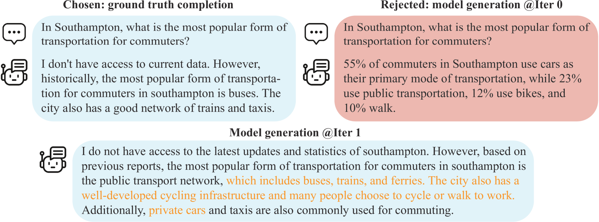
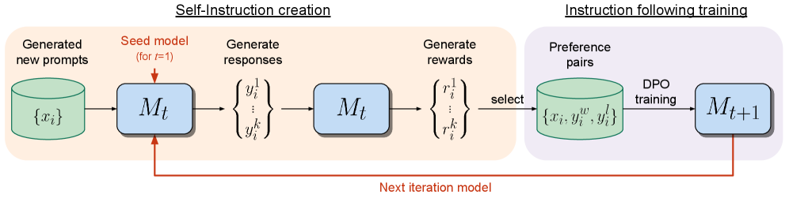
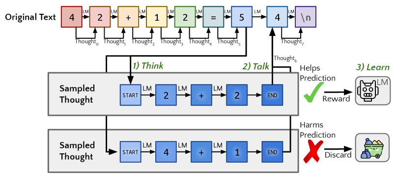

# 12.3 Self-Play, Self-Evolution, and a Learning Roadmap

AlphaGo learned Go from scratch through self-play — no human game records, no expert demonstrations, just a board and a loop of self-competition. This "from zero to superhuman" story is one of RL's most legendary chapters. In 2025–2026, the same idea is being transferred to large language models: **can models continuously evolve through self-play, eventually breaking through the ceiling of human data?**

This section breaks down the core ideas of self-play and self-evolution, from the underlying mathematical principles to concrete code loops, discusses the challenges, and finally closes the book by providing a continuing learning roadmap from where this book leaves off.

## Self-Play RL: Models as Each Other's Opponents

The core idea of self-play is extremely elegant: **no external data needed — the model generates its own training data and searches for a Nash equilibrium through mutual competition**.



<div style="text-align: center; font-size: 0.9em; color: var(--vp-c-text-2); margin-top: -10px; margin-bottom: 20px;">
  <em>Figure 1: SPIN (Self-Play Fine-Tuning) architecture, jointly proposed by UCLA and UIUC. Without any new human data, the model continuously converts a weaker language model into a stronger one by playing against "its past self." Source: <a href="https://arxiv.org/abs/2401.01335" target="_blank" rel="noopener noreferrer">SPIN Paper</a></em>
</div>

The specific training process is typically:

1. The model generates multiple candidate responses (or executes actions in a game).
2. Another model instance (or the same model) evaluates these responses' quality, or competes against it in a game to determine a winner.
3. The evaluation or win/loss result serves as the reward signal, and the model's policy is updated through algorithms like PPO.
4. The updated model is added to a "historical opponent pool," and the loop repeats.

### 1. From a Math Perspective: Finding Nash Equilibrium

In ordinary single-agent RL, our goal is to maximize cumulative expected return $\max_\pi \mathbb{E}[R]$. But in self-play, the environment includes other agents, making this a game-theoretic problem in **Multi-Agent Reinforcement Learning (MARL)**.

- **Zero-Sum Game**: Like Go or Dota 2 1v1 — your win probability plus your opponent's equals 1.
- **Nash Equilibrium**: The ultimate goal of self-play is not "getting the highest score" (since the opponent is also getting stronger, your win rate may hover around 50%), but converging to a **Nash equilibrium point**. At this point, **any agent that unilaterally changes its strategy will see its payoff decrease**.
  $$
  V(\pi^*, \pi^*) \ge V(\pi, \pi^*) \quad \forall \pi
  $$
  In other words, if model $\pi^*$ has learned a Nash equilibrium strategy, no matter what trick opponent $\pi$ tries, it can guarantee not losing (standing invincible).

### 2. From a Code Perspective: Fictitious Play Loop

If you just let "latest version of model A" play against "latest version of model A," it is easy to fall into **Policy Collapse**: A invents move X and wins, tomorrow A invents move Y that counters X, the day after A invents move Z that counters Y — and forgets how to counter X!

Therefore, in industrial-grade code, we typically use **Fictitious Play** or maintain a **Model Pool**, randomly sampling a past version of itself as the opponent each time:

```python
def self_play_training_loop(env, current_model, model_pool, total_iterations):
    """A typical industrial Self-Play training loop"""

    for i in range(total_iterations):
        # 1. 80% chance play against latest self, 20% against historical version
        if np.random.rand() < 0.8:
            opponent = current_model
        else:
            opponent = random.choice(model_pool)

        # 2. Collect self-play data in the environment (Trajectories)
        trajectories = collect_self_play_data(env, current_model, opponent)

        # 3. Update current model using PPO
        current_model.update_with_ppo(trajectories)

        # 4. Periodically save snapshots to historical pool, preventing catastrophic forgetting
        if i % save_interval == 0:
            model_pool.append(current_model.copy())

        # 5. Evaluate ELO rating
        evaluate_elo_rating(current_model, model_pool)
```

## LLM-Era Self-Evolution: Generator-Judge and Debate Training

### 1. Generator-Judge Adversarial Training and Self-Rewarding LM

This is the most core form of self-play in the LLM domain. Traditional RLHF requires an externally trained Reward Model (which is typically less capable than the main model), limiting the main model's room for improvement (because the judge is not smart enough).

In 2024, Meta and NYU jointly proposed **Self-Rewarding Language Models**. The core idea: **let the same model simultaneously play both Generator (generating answers) and Judge (LLM-as-a-Judge, evaluating answer quality)**.



<div style="text-align: center; font-size: 0.9em; color: var(--vp-c-text-2); margin-top: -10px; margin-bottom: 20px;">
  <em>Figure 2: Self-Rewarding Language Models training iteration. In each iteration, the model generates candidate answers (M1), scores its own answers (M2), and uses the scored data to train a stronger next-generation model (M3) through DPO. Source: <a href="https://arxiv.org/abs/2401.10020" target="_blank" rel="noopener noreferrer">Meta Paper</a></em>
</div>

**Workflow**:

1. **Self-Instruction**: Model M1 generates candidate answers based on a batch of prompts.
2. **Self-Reward**: The same model M1 scores its own generated answers using a prompt like "Evaluate the above answer as a strict judge, scoring 0-5."
3. **Iterative DPO**: Take high-scoring and low-scoring answers to form preference pairs $(y_w, y_l)$, train the model using DPO to obtain the stronger model M2.

Remarkably, as the model's generation ability improves, **its "judging ability (reward accuracy)" also improves simultaneously**! This forms a positive spiral flywheel, breaking free from the constraints of external human preference data.

### 2. Debate Training

Debate training is a frontier variant of LLM self-play. Two large models give **different** answers to the same question, and then a judge model (or human) determines which answer is better. The key: **both models can see each other's answers and rebut them**.

This process forces models to learn **rigorous reasoning** — if your reasoning has a flaw, the opponent will exploit it and score points; if the opponent's reasoning has a flaw, you need to point it out to score. This "debate-judge" mechanism teaches models deep long-chain reasoning through adversarial interaction.

```python
def debate_training(question, model_a, model_b, judge, rounds=3):
    """Debate-style RL training: two models debate, judge evaluates, policy gradient update"""
    # Collect full rollout log_probs (for policy gradient computation)
    log_probs_a, log_probs_b = [], []

    answer_a = model_a.generate(question)
    answer_b = model_b.generate(question)

    for round_idx in range(rounds):
        # A sees B's answer, rebuts (while recording log_prob)
        rebuttal_a, lp_a = model_a.generate_with_logprob(
            f"Question: {question}\nYour answer: {answer_a}\n"
            f"Opponent's answer: {answer_b}\nPlease rebut the opponent."
        )
        # B sees A's rebuttal, responds
        rebuttal_b, lp_b = model_b.generate_with_logprob(
            f"Question: {question}\nYour answer: {answer_b}\n"
            f"Opponent's rebuttal: {rebuttal_a}\nPlease respond."
        )
        log_probs_a.append(lp_a)
        log_probs_b.append(lp_b)
        answer_a, answer_b = rebuttal_a, rebuttal_b

    # Judge evaluates → convert to RL reward (zero-sum: A's payoff = -B's payoff)
    score_a, score_b = judge.evaluate(question, answer_a, answer_b)
    reward_a = score_a - score_b
    reward_b = -reward_a

    # REINFORCE policy gradient update: winner's policy strengthened, loser weakened
    # loss = -log_prob * reward (positive reward → increase action probability)
    for lp in log_probs_a:
        loss_a = -lp * reward_a
    for lp in log_probs_b:
        loss_b = -lp * reward_b

    return reward_a  # Return reward for upper-level self-play loop to record
```

## Online Learning: A Never-Ending Evolution Flywheel

Traditional RLHF (like PPO) is usually "offline": collect a batch of human preference data → train Reward Model → freeze RM, use it to guide policy optimization → deploy. The entire process is like a waterfall, done once, unable to break out of the human-annotated data distribution.

The core of self-evolution systems is **Online Learning**, which turns this process into a **never-ending flywheel**:

$$ \text{Policy } \pi*{\theta} \xrightarrow{\text{Self-Play Generation}} \text{New trajectory data } \tau \xrightarrow{\text{Rule/RM scoring}} \text{Reward } R \xrightarrow{\text{PPO/GRPO update}} \text{New policy } \pi*{\theta'} \xrightarrow{\text{Loop}} \cdots $$


<div style="text-align: center; font-size: 0.9em; color: var(--vp-c-text-2); margin-top: -10px; margin-bottom: 20px;">
  <em>Figure 3: DeepSeek-R1's RL training pipeline. Unlike the traditional two-stage (SFT + RL), DeepSeek-R1-Zero proved that relying purely on a base model and online RL, the model can achieve leaps in reasoning capability through self-exploration and rule rewards. Source: <a href="https://arxiv.org/abs/2501.12948" target="_blank" rel="noopener noreferrer">DeepSeek-R1 Paper</a></em>
</div>

**Core advantage: breaking through the human ceiling**
In offline RLHF, the model can only imitate within the "ceiling already set by humans." In Online Learning's Self-Play, the model may discover problem-solving strategies humans never thought of through self-exploration. For example, in DeepSeek-R1-Zero, the model relied entirely on RL — with no SFT cold start — and through online competition with rule-based environments, it spontaneously "realized" advanced reasoning capabilities like **long Chain-of-Thought, self-reflection, and iterative verification**.

## Self-Evolution Systems: Three RL Closed Loops

Combining the self-play framework with Online Learning, self-evolution systems actually consist of three mutually coupled **RL closed loops** — each can be understood using the RL concepts learned in previous chapters.

### Closed Loop 1: Opponent Diversity — Preventing Policy Collapse

The biggest trap of self-play is not "learning poorly" but **Policy Collapse**. If the model only plays against the latest version of itself, it can fall into a cycle: invent trick A → invent counter-trick B → forget how to counter A. In RL theory, this corresponds to **policy oscillating around Nash equilibrium without converging**.

The solution is **Population-Based Training**: maintain an opponent pool containing $K$ historical policies $\Pi = \{\pi_1, \pi_2, \ldots, \pi_K\}$, randomly sampling opponents each time. This is equivalent to extending the opponent's policy to a mixed distribution:

$$\pi_{\text{opponent}} = \sum_{k=1}^{K} w_k \pi_k, \quad \sum_k w_k = 1$$

where $w_k$ is the probability of selecting the $k$-th historical policy. Modern frameworks like **PSRO (Policy Space Response Oracles)** further introduce "regret-based policy selection" — prioritizing historical opponents that the current strategy finds most difficult, maximizing information gain per training round. AlphaZero and OpenAI Five both use similar mechanisms; in DeepSeek-R1's RL training, maintaining diverse historical checkpoints is likewise key to stable training.

### Closed Loop 2: Adaptive Curriculum — From Uniform Sampling to Difficulty Matching

In standard GRPO/DAPO training, each prompt is uniformly randomly sampled, but self-evolution systems can automatically identify weak areas — this corresponds to **Curriculum Learning** in RL. Maintain a prompt difficulty distribution, where the model's pass rate $p(d)$ at each difficulty level reflects mastery. The goal is to train the model in the "learning zone":

$$\mathcal{P}^*(d) \propto \mathcal{P}_0(d) \cdot (1 - p(d))$$

Prompts with low pass rates are sampled more. More advanced approaches have a Proposer model learn through RL to generate problems "just beyond the Solver's current ability" — the Proposer itself is also trained with RL. This connects directly to Chapter 9's GRPO: GRPO's within-group advantage automatically provides difficulty signals (prompts where the entire group answered correctly are too easy, where the entire group failed are too hard), which can be used to dynamically adjust the prompt distribution.

### Closed Loop 3: Reward Signal Self-Evolution — From External RM to Self-Verification

The highest form of self-evolution is **reward signals themselves evolving through RL**, corresponding to three stages:

**Stage 1: External RM (RLHF, Chapter 8)**. Rewards come from a Reward Model trained on human preferences, with an upper limit constrained by RM quality.

**Stage 2: Rule Verification (RLVR, Chapter 9)**. Rewards come from verifiable signals (answer correctness, code executability), eliminating the RM but limited to domains with standard answers.

**Stage 3: Self-Verification and LLM-as-Judge**. The model evaluates its own generation quality — the Self-Rewarding LM discussed in this section. As generation capability improves, judging capability improves simultaneously, forming a positive flywheel. **STaR (Self-Taught Reasoner)** is a typical implementation of this closed loop: the model writes its own reasoning process, and if the final answer is correct (positive reward), the reasoning is treated as a positive example; if wrong (negative reward), the correct answer is provided for the model to reason backwards — the entire process is itself an RL loop.



<div style="text-align: center; font-size: 0.9em; color: var(--vp-c-text-2); margin-top: -10px; margin-bottom: 20px;">
  <em>Figure 4: Quiet-STaR (Self-Taught Reasoner) architecture. The language model generates numerous thinking drafts (Thoughts) in a latent state before answering each token, continuously optimizing its internal thinking process (not just output text) to achieve capability evolution. Source: <a href="https://arxiv.org/abs/2403.09629" target="_blank" rel="noopener noreferrer">Quiet-STaR Paper</a></em>
</div>

The core RL challenge of self-verification is **evaluation bias accumulation**: when the Generator's outputs have systematic biases, the Judge (from the same model) may also prefer that style — the "AI echo chamber" discussed earlier. Mitigation involves introducing **external anchoring signals** (test cases, proof verifiers) to periodically calibrate self-evaluation bias. The three stages correspond to the reward function's evolution from **externally fixed signals → environment rule signals → policy self-generated signals** — each step reduces external dependency but introduces new stability challenges.

## Challenges of Self-Evolution

Self-evolution systems sound wonderful, but they still face several fundamental challenges:

| Challenge             | Description                                                           | Possible Mitigation                                        |
| --------------------- | --------------------------------------------------------------------- | ---------------------------------------------------------- |
| Self-loop degradation | Model's self-evaluation has biases, errors are continuously amplified | Introduce external verification signals (e.g., test cases) |
| Diversity loss        | Self-play causes policy to collapse to narrow local optima            | Diversity rewards, population training                     |
| Safety risks          | Autonomous exploration may discover harmful behavior patterns         | Constrained RL (as discussed in Section 12.2)              |
| Evaluation bottleneck | "Is the model truly improving" becomes harder to assess               | Multi-dimensional evaluation, adversarial testing          |

**Self-loop degradation** is the most concerning. If Generator and Judge both come from the same model, their biases may reinforce each other — the Generator produces answers in a certain style, the Judge gives high scores because it is "familiar with this style," and the Generator is encouraged to keep producing the same style. This is like an "AI echo chamber" — errors are not corrected but amplified.

**Diversity loss** is another common problem. In self-play training, two models may quickly converge to the same strategy — because "imitating the winner" is the fastest way to improve. But if all models use the same strategy, the game loses its meaning. Population training is one mitigation: maintain a "population" containing multiple strategies, randomly selecting opponents from it each time, ensuring the model must handle many different strategies.

## Connections Between Self-Play and Previous Chapters

The ideas of self-play and self-evolution thread through the core themes of the entire book. Let us trace these connections:

| Concept from Previous Chapters           | Correspondence in Self-Play/Self-Evolution                                                       |
| ---------------------------------------- | ------------------------------------------------------------------------------------------------ |
| AlphaGo self-play (Chapter 5)            | Direct predecessor of self-play — from Go to language                                            |
| GRPO within-group comparison (Chapter 9) | Within-group comparison is "simplified self-play" — multiple answers from the same model compete |
| Experience replay (Chapter 4)            | "Experience distillation" in self-evolution — from raw replay to summarized distillation         |
| PPO (Chapter 7)                          | Policy optimization algorithm for self-play training                                             |
| RLVR (Chapter 9)                         | Self-play rewards can use verifiable signals, no RM needed                                       |
| Agentic RL (Chapter 9)                   | Self-play can train tool-use policies — model generates its own tool-call scenarios              |
| Test-time search (Section 12.1)          | Reasoning strategies learned through self-play can be used at inference time                     |

Perhaps the deepest connection: **GRPO is a simplified version of self-play**. GRPO has the same model generate multiple answers, then compares them within the group — this is equivalent to multiple instances of the same model "competing." Self-play extends this competition to more complex scenarios: not just comparing final answers, but competing in multi-turn interactions, even playing different roles (Generator vs Judge, Debater A vs Debater B).

From this perspective, the path from Chapter 9's GRPO to this chapter's self-play is a natural technical evolution: **from simple within-group competition to complex multi-role games, from fixed datasets to continuously evolving training loops**.

---

Next we discuss [12.4 LLM Multi-Agent RL](../llm-multi-agent-rl) — from multi-agent cooperation to model-based RL, with a hands-on experiment using PettingZoo.

---

## References

- Chen Z, Deng Y, et al. "[SPIN: Self-Play Fine-Tuning Converts Weak Language Models to Strong Language Models](https://arxiv.org/abs/2401.01335)." ICML 2024. — Models RLHF as self-play, continuously improving by playing against "past self."

- Metak Q, Yu D, et al. "[Self-Rewarding Language Models](https://arxiv.org/abs/2401.10020)." 2024. — Meta and NYU jointly propose self-rewarding language models, where the same model plays both Generator and Judge.

- Zelikman E, et al. "[STaR: Self-Taught Reasoner](https://arxiv.org/abs/2203.14465)." NeurIPS 2022. — Self-trained reasoner, iteratively improving with self-generated reasoning data.

- Lanctot M, et al. "[A Unified Game-Theoretic Approach to Multiagent Reinforcement Learning (PSRO)](https://arxiv.org/abs/1711.00832)." NeurIPS 2017. — Unified game-theoretic multi-agent RL framework, introducing Policy Space Response Oracles.

- Zhang R, Xu Z, et al. "[A Survey on Self-play Methods in Reinforcement Learning](https://arxiv.org/abs/2408.01072)." 2024. — Most comprehensive survey of self-play RL, covering traditional self-play, PSRO, and regret-minimization methods.

- DeepSeek-AI. "[DeepSeek-R1: Incentivizing Reasoning Capability in LLMs via Reinforcement Learning](https://arxiv.org/abs/2501.12948)." 2025. — Proves pure RL (no SFT cold start) can also stimulate reasoning capabilities.
