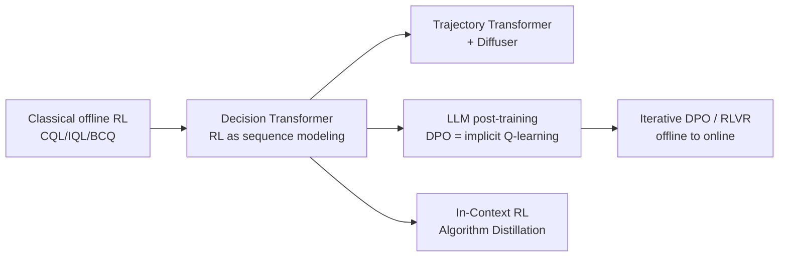

# 10.3 Offline Reinforcement Learning and Preference Data

[Section 10.2](./sequence-modeling) formulated fixed trajectories as a sequence-modeling problem. LLM preference optimization also begins with fixed data: the training set already contains a prompt, a preferred response, and a rejected response, and the annotator cannot be queried again during training to verify the two responses.

This section first explains the connection between DPO and offline optimization with a KL constraint, then maps preference data to classical offline trajectories component by component, describes how sequence modeling enters reasoning and search, and finally identifies both the explanatory value and the limits of this analogy.

## 1. Placing DPO Back in Offline RL

LLM preference data and offline-RL data share one key constraint: training can use only previously collected samples and cannot rely on fresh environment interactions to correct out-of-distribution behavior immediately. The two data types preserve feedback at different granularities, however, so they cannot use the same objective directly.

### 1.1 DPO as Implicit Q-Learning

The DPO objective derived in [Chapter 14: DPO](../chapter17_dpo/dpo-objective-derivation) is

$$\mathcal{L}_{\text{DPO}} = -\mathbb{E}_{(x, y_w, y_l)}\left[\log \sigma\left(\beta \log \frac{\pi_\theta(y_w \mid x)}{\pi_{\text{ref}}(y_w \mid x)} - \beta \log \frac{\pi_\theta(y_l \mid x)}{\pi_{\text{ref}}(y_l \mid x)}\right)\right]$$

First consider only the difference inside the parentheses. Here, $x$ is the prompt, $y_w$ is the preferred response in the preference data, and $y_l$ is the rejected response. The quantity $\log(\pi_\theta/\pi_{\text{ref}})$ measures how much the current model has increased the probability of a response relative to the reference model. Subtracting the two terms trains the model to increase the relative probability of the preferred response and decrease that of the rejected response. $\beta$ controls the scale of this difference, and $\sigma$ converts it to a preference probability between 0 and 1.

This objective is written as a classification loss. Rafailov et al. 2024 further showed in the subsequent paper “From $r$ to $Q^*$” that DPO's implicit reward can be represented as a Q-function with a KL constraint.

Define the implicit advantage

$$\hat{A}(x, y) = \beta \log \frac{\pi_\theta(y \mid x)}{\pi_{\text{ref}}(y \mid x)}$$

No separate reward model is trained here. A KL-constrained optimal policy determines an implicit reward whose response-dependent component is exactly the log-probability ratio above. If token generation is treated as a sequence of decisions, one can also define token-level values:

$$Q^*(s_t, a_t) = \hat{r}(s_t, a_t) + \gamma \mathbb{E}_{s_{t+1}}\left[\max_{a'} Q^*(s_{t+1}, a')\right]$$

The DPO loss becomes

$$\mathcal{L} = -\mathbb{E}\left[\log \sigma\left(\hat{A}(x, y_w) - \hat{A}(x, y_l)\right)\right]$$

DPO trains this implicit advantage from the relative ordering of response pairs. A complete Q-function interpretation requires additional sequential-decision assumptions; see Rafailov et al. 2024 for the derivation. For now, retain three direct conclusions:

- **DPO is offline RL**: during training it interacts with neither a reward model nor an environment and uses only a fixed dataset of $(x, y_w, y_l)$ triples.
- **DPO's constraint**: KL divergence to the reference model $\pi_{\text{ref}}$, corresponding to the offline-RL requirement that the learned policy not depart too far from the behavior policy.
- **DPO avoids the max-extrapolation path of Q-learning**: it learns relative relationships directly from preference data and uses the reference policy to control update magnitude. Insufficient preference-data coverage can still cause out-of-distribution generalization problems, so independent evaluation remains necessary.

This correspondence also explains the role of $\beta$: it changes the scale of policy updates relative to the reference policy. If the update is too large, the model can enter regions poorly covered by the preference data. If it is too small, the probability gap between preferred and rejected responses remains narrow. Preference accuracy, KL divergence, response length, and independent evaluations must therefore be monitored together rather than relying on training loss alone.

## 2. Viewing Preference Data as a Fixed Dataset

Compare an LLM preference dataset with the D4RL offline dataset from [Chapter 9](../chapter11_continuous_control/deterministic-policy-gradient-ddpg):

| Dimension             | D4RL (MuJoCo)                             | LLM Preference Data                                        |
| --------------------- | ----------------------------------------- | ---------------------------------------------------------- |
| State $s$             | Robot joint angles                        | Prompt $x$                                                 |
| Action $a$            | Joint torques                             | Response $y$                                               |
| Reward $r$            | Scalar reward                             | Preference $y_w \succ y_l$ (implicit reward)               |
| Data source           | A behavior policy $\pi_\beta$             | Human labels / RM model                                    |
| Training objective    | $\max Q^\pi$ s.t. $\pi \approx \pi_\beta$ | $\max$ implicit reward s.t. $\pi \approx \pi_{\text{ref}}$ |
| Offline-RL algorithms | CQL / IQL / DT                            | DPO / IPO / KTO                                            |

These correspondences show how DPO can be understood from an offline-RL perspective. They also clarify why LLM post-training borrows methods for offline policy constraints and iterative data collection:

- **IPO (Identity Preference Optimization)** replaces DPO's softmax with a squared loss, analogous to changing the form of conservative regularization in offline RL.
- **KTO (Kahneman-Tversky Optimization)** trains on individual examples rather than preference pairs, analogous to advantage-weighted regression.
- **Iterative DPO** repeatedly collects responses from the current model and retrains, gradually turning fixed-data optimization into offline-to-online updating.
- **RLHF with PPO** treats scores from a reward model as training feedback and constrains policy shift with KL divergence. Because it resamples responses from the current policy, it is no longer purely offline training.

## 3. How Sequence Models Connect Reasoning and Search

An LLM is itself a sequence model, so DT's trajectory representation can also be applied to reasoning and search tasks:

- **Process Reward Model + Search** ([Chapter 17](../chapter20_prm_search/inference-time-search)): treat a reasoning trajectory as a decision sequence, use a PRM as step-level reward, and perform beam search analogous to Trajectory Transformer.
- **Expert Iteration / STaR**: generate trajectories with the current model, filter for high-reward trajectories, and then apply SFT. Like DT, this method depends on trajectory data, but repeated generation updates the data distribution.
- **In-Context RL (Algorithm Distillation, Laskin et al. 2022)**: place an entire RL learning history in the prompt so that a Transformer learns to perform RL “in context,” directly inheriting DT's “RL as sequence modeling” perspective.

## 4. What Post-Training Phenomena the Offline Perspective Explains

Offline RL provides a set of tools for understanding LLM post-training. CQL and IQL explain why policy improvement on fixed data must control distribution shift; DPO constrains updates using a reference policy and preference relations; and Decision Transformer shows how trajectories enter a sequence model. Together, these connections provide a common data perspective for [Chapter 11: Imitation Learning and Inverse RL](../chapter13_imitation_meta_rl/bc-dagger), [Chapter 17: PRM Search](../chapter20_prm_search/inference-time-search), and [Chapter 20: Code World Models](../chapter23_rl_based_swe/world-model-and-deep-swe).

These methods do not use the same training signals. Classical offline RL usually stores stepwise states, actions, and rewards; preference optimization records only the relative order of responses; sequence models depend on behavior already present in trajectories. Placing them in one diagram helps compare how fixed data constrain policy updates, but it does not make their three objectives the same algorithm.

## Chapter Summary

1. **Fixed data create distribution shift**: the max operator in Q-learning can select actions outside the dataset, causing estimation errors to accumulate across Bellman updates.
2. **Three conservative approaches**: BCQ constrains the action space, CQL penalizes Q-values for OOD actions, and IQL avoids maximizing over actions outside the data. Engineering-oriented approaches add BC regularization through TD3+BC or AWAC.
3. **Decision Transformer uses conditional sequence modeling**: it does not use Bellman updates. Instead, it treats RTG as a control variable and lets a Transformer process trajectories directly.
4. **Trajectory Transformer + Diffuser** extend sequence modeling to joint trajectory distributions and diffusion-based generation.
5. **DPO can be understood as offline optimization**: preference data are fixed, the reference policy constrains update magnitude, and implicit Q-learning provides one interpretation of the objective.

The next chapter, [Chapter 11: Imitation Learning, Inverse Reinforcement Learning, and Meta-Reinforcement Learning](../chapter13_imitation_meta_rl/bc-dagger), studies another setting with missing reward signals: how to learn a policy or infer a reward when only expert behavior is observed.

## Further Reading

- [Fujimoto et al. 2019 "Off-Policy Deep Reinforcement Learning without Exploration" (BCQ)](https://arxiv.org/abs/1812.02900)
- [Kumar et al. 2020 "Conservative Q-Learning for Offline Reinforcement Learning" (CQL)](https://arxiv.org/abs/2006.04779)
- [Kostrikov et al. 2022 "Offline Reinforcement Learning with Implicit Q-Learning" (IQL)](https://arxiv.org/abs/2110.06169)
- [Fujimoto & Gu 2021 "A Minimalist Approach to Offline Reinforcement Learning" (TD3+BC)](https://arxiv.org/abs/2106.06860)
- [Nair et al. 2020 "AWAC: Accelerating Online Reinforcement Learning with Offline Data"](https://arxiv.org/abs/2006.09359)
- [Chen et al. 2021 "Decision Transformer: Reinforcement Learning via Sequence Modeling"](https://arxiv.org/abs/2106.01345)
- [Janner et al. 2021 "Offline Reinforcement Learning as One Big Sequence Modeling Problem" (Trajectory Transformer)](https://arxiv.org/abs/2106.02039)
- [Janner et al. 2022 "Planning with Diffusion for Flexible Behavior Synthesis" (Diffuser)](https://arxiv.org/abs/2205.09991)
- [Rafailov et al. 2023 "Direct Preference Optimization: Your Language Model is Secretly a Reward Model"](https://arxiv.org/abs/2305.18290)
- [Rafailov et al. 2024 "From r to Q\*: Your Language Model is Secretly a Q-Function" (the formal equivalence between DPO and Q-learning)](https://arxiv.org/abs/2404.12358)
- [Levine et al. 2020 "Offline Reinforcement Learning: Tutorial, Review, and Perspectives on Open Problems"](https://arxiv.org/abs/2005.01643)
- [Laskin et al. 2022 "In-Context Reinforcement Learning with Algorithm Distillation"](https://arxiv.org/abs/2210.14215)
