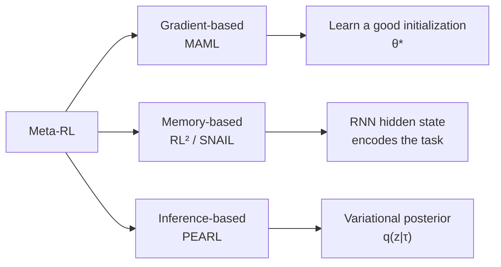
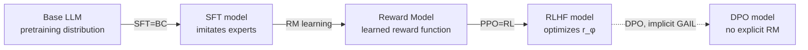

# 11.3 Meta-Reinforcement Learning and Contextual Adaptation

[Section 11.2](./irl-gail) assumes that training and deployment face the same task, although its reward must be inferred from expert behavior. Meta-RL changes this premise: training covers a set of related tasks, and deployment uses a small amount of new experience to adapt to a new task from the same family.

This section first compares three adaptation mechanisms—MAML, RL², and PEARL—then explains how Algorithm Distillation places the learning process in context, connects Decision Transformer to LLMs, and finally relates these concepts to SFT, reward modeling, and preference optimization.

## 1. Adapting to New Tasks through Three Mechanisms

A policy for a fixed task needs to learn only one behavior. When a robot receives a new workpiece, a vehicle enters a new city, or a language model moves to a new domain, the policy must infer from limited experience which task it currently faces. **Meta-RL** trains across a set of related tasks so that the model learns this adaptation process.

### 1.1 Three Adaptation Mechanisms



### 1.2 MAML: Learning an Initialization That Is Easy to Adapt

Model-Agnostic Meta-Learning (Finn et al. 2017) learns an initialization $\theta$ suitable for further updating. For each training task $T_i$, first perform one inner-loop update on data from that task:

$$\theta_i'=\theta-\alpha\nabla_\theta\mathcal L_{T_i}(\theta)$$

Here, $\alpha$ is the inner-loop learning rate, and $\theta_i'$ is the parameter vector after adaptation to task $T_i$. The outer loop then evaluates whether $\theta_i'$ performs well on new data from the same task:

$$\min_{\theta} \; \mathbb{E}_{T_i \sim p(T)}\left[\mathcal{L}_{T_i}\left(\theta - \alpha \nabla_\theta \mathcal{L}_{T_i}(\theta)\right)\right]$$

Because $\theta_i'$ is itself computed from $\theta$, the outer gradient with respect to $\theta$ passes through the inner update:

$$\nabla_\theta \mathcal{L}_{T_i}(\theta_i') = \nabla_{\theta_i'} \mathcal{L}_{T_i}(\theta_i') \cdot (I - \alpha \nabla^2_\theta \mathcal{L}_{T_i}(\theta))$$

The Hessian $\nabla_\theta^2\mathcal L$ in parentheses increases computation and memory use. FOMAML reduces this cost by ignoring the Hessian and treating the gradient at the adapted parameters as an approximation of the meta-gradient.

```python
def maml_meta_update(meta_policy, tasks, inner_lr=0.1, outer_lr=0.001):
    meta_grad = 0
    for task in tasks:
        # === Inner loop: copy parameters and adapt with a few SGD steps. ===
        theta_prime = meta_policy.params.clone()
        for _ in range(n_inner_steps):
            inner_loss = task.compute_loss(theta_prime)
            theta_prime -= inner_lr * grad(inner_loss, theta_prime)

        # === Outer loop: evaluate adapted parameters and backpropagate
        #     to the meta-parameters. ===
        outer_loss = task.compute_loss(theta_prime)
        # Autograd handles the second-order gradient here.
        g = grad(outer_loss, meta_policy.params)
        meta_grad += g

    meta_policy.params -= outer_lr * meta_grad / len(tasks)
```

### 1.3 RL²: Encoding the Task in an RNN Hidden State

RL², proposed by Duan et al. 2016, does not update parameters at test time. Instead, it lets an RNN record interaction history in its hidden state.

The setting trains an RNN policy $\pi_\theta(a_t \mid h_t)$ across multiple episodes, where $h_t = f_\theta(h_{t-1}, s_{t-1}, a_{t-1}, r_{t-1}, \text{done})$. The interaction history within an episode—rewards and transitions—accumulates in the hidden state, allowing the policy to make better decisions **later in the same task**. The policy is effectively learning the current task.

The hidden state is not reset across multiple episodes of the same task, so the RNN can use the states, actions, and rewards from earlier episodes to adjust later behavior. Parameters remain unchanged; adaptation occurs in the hidden state. The training objective only requires later episodes to achieve greater return and does not prescribe which update algorithm the network must implement.

### 1.4 PEARL: Inferring a Task Variable Explicitly

Probabilistic Embeddings for Actor-Critic RL (Rakelly et al. 2019) explicitly models a task posterior. Suppose a task is determined by latent variable $z \sim p(z)$, such as a target position or friction coefficient, and policy $\pi_\theta(a \mid s,z)$ is conditioned on $z$.

Adaptation consists of inferring posterior $q_\phi(z\mid\tau)$ from a small amount of experience $\tau$, producing an embedding $z$ for the current task. Training requires both high policy return and a posterior that does not depart from the prior without constraint:

$$\mathcal{L} = -\mathbb{E}_{z \sim q_\phi}\left[\sum_t r(s_t, a_t, z)\right] + \beta \cdot D_{\text{KL}}\left(q_\phi(z \mid \tau) \,\|\, p(z)\right)$$

The first term is negative return, so minimizing it improves policy performance. The second is KL regularization, and $\beta$ controls the degree of compression applied to task information. Actual adaptation speed depends on the task distribution, context length, and implementation; it cannot be inferred from the method name alone.

| Method | Where adaptation occurs                | Requires second-order gradients                    | Use of new experience at test time     |
| ------ | -------------------------------------- | -------------------------------------------------- | -------------------------------------- |
| MAML   | Model parameters                       | Optional; a first-order approximation is available | Perform a few gradient updates         |
| RL²    | RNN hidden state                       | No                                                 | Continue supplying interaction history |
| PEARL  | Task-variable posterior $q(z\mid\tau)$ | No                                                 | Update the task-variable posterior     |

### 1.5 Meta-RL and Few-Shot Learning

Meta-RL and supervised few-shot learning share the same idea: **train a prior on many related tasks, then adapt to a new task using few examples**. This idea directly inspired in-context learning in LLMs, discussed next.

## 2. Placing the Learning Process in Context

RL² carries the adaptation process in a hidden state. Algorithm Distillation (Laskin et al. 2022) instead gives a Transformer a complete segment of RL learning history and asks it to predict the next action in that learning process.

### 2.1 Algorithm Distillation Training Data

Consider an RL training run spanning multiple tasks, where each trajectory is $\tau=(s_0,a_0,r_0,s_1,a_1,r_1,\ldots)$. Algorithm Distillation rests on the following observation:

> Within one RL training run, early episodes usually have low return, while the policy gradually improves in later episodes. To predict the next action from the preceding $k$ episodes, a Transformer must use the historical states, actions, and rewards to infer how behavior changes with experience.

The data are organized as follows:

```
[episode_1 (poor policy): s0 a0 r0 s1 a1 r1 ... |
 episode_2 (slightly better): s0 a0 r0 ... |
 ...
 episode_N (expert): s0 a0 r0 ...]
            ↑
     Transformer input: concatenate the entire history
     Target: predict the next action within each episode
```

### 2.2 Differences Between Algorithm Distillation and RL²

| Dimension                        | RL²                  | Algorithm Distillation                |
| -------------------------------- | -------------------- | ------------------------------------- |
| Model                            | Small RNN (LSTM/GRU) | Large Transformer                     |
| Data                             | Online meta-training | **Offline** learning histories        |
| What is learned in context       | Task ID (implicitly) | **The RL algorithm itself**           |
| Generalization across algorithms | One algorithm        | Can distill DQN, PPO, A2C, and others |

AD experiments ask whether a Transformer can recover from training histories the pattern by which actions change after rewards are obtained. It imitates the learning process expressed in those trajectories. Its generalization depends on whether the training tasks and learning histories cover the changes required at test time.

```python
def algorithm_distillation_data_generate(env, rl_algorithm, n_runs=1000, n_episodes_per_run=200):
    """Collect AD training data: each run is an RL learning process."""
    dataset = []
    for run in range(n_runs):
        policy = init_random_policy()
        run_history = []
        for ep in range(n_episodes_per_run):
            trajectory = rollout(env, policy)
            run_history.append(trajectory)
            # Update the policy with any online RL algorithm (DQN/PPO/A2C).
            policy = rl_algorithm.update(policy, trajectory)
        # Each run is one training example: a complete learning curve.
        dataset.append(run_history)
    return dataset


def ad_inference(transformer, env, n_adapt_episodes=10):
    """At test time, the Transformer learns in context in a new environment."""
    context = []  # Accumulated history.
    for ep in range(n_adapt_episodes):
        s = env.reset()
        done = False
        while not done:
            # Crucially, the Transformer predicts the action from the context.
            a = transformer.predict_next_action(context, s)
            s_next, r, done = env.step(a)
            context.append((s, a, r))
            s = s_next
        # The Transformer parameters are not updated; learning occurs in context.
```

## 3. Connecting Decision Transformer to LLMs

### 3.1 Decision Transformer's Conditional-Policy Approach

Decision Transformer (Chen et al. 2021) showed earlier that RL can be transformed into sequence modeling: feed $(R,s,a)$ triplets to a Transformer, where $R$ is return-to-go. Conditioned on target return $R^*$, the model generates actions that attain that return.

$$a_t = \text{Transformer}\left(R_t, s_t, a_{t-1}, R_{t-1}, s_{t-1}, \ldots\right)$$

DT is not in-context RL; it is a **conditional policy**. It nevertheless inspired subsequent work such as Online DT and Elastic DT, which gradually converged with in-context RL.

### 3.2 The Connection Between In-Context RL and LLMs

The development of LLM in-context learning closely parallels in-context RL:

- **GPT-3 in-context learning (2020)**: provide several examples in a prompt, and the model learns the task without updating parameters. This is the in-context form of **supervised learning**.
- **Algorithm Distillation in-context RL (2022)**: provide several rewarded trajectories in context, and the model learns RL without updating parameters. This is the in-context form of **reinforcement learning**.

Both place examples or interaction histories in context and then predict the next output. Whether a model truly implements an RL update must be tested through its adaptation curve on new tasks; a change in responses within context is not sufficient evidence.

## 4. Returning Imitation and Adaptation to LLM Post-Training

The preceding concepts allow SFT, reward learning, policy optimization, and contextual adaptation in LLM training to be compared respectively with imitation learning, inverse RL, forward RL, and meta-learning.

### 4.1 SFT and Behavior Cloning

Recall the SFT loss from [Chapter 13: RLHF](../chapter15_rlhf/base-model-to-assistant):

$$\mathcal{L}_{\text{SFT}}(\theta) = -\sum_{t=1}^T \log \pi_\theta(y_t \mid x, y_{<t})$$

This objective has the same form as behavior cloning in Section 11.1: $(x,y)$ is the demonstration, and $\pi_\theta$ is the policy being trained. Several behavior-cloning problems also arise in autoregressive generation:

- **Distribution shift**: during training, expert states are high-quality instruction-response sequences; during deployment, the next token generated by the model may deviate from them.
- **Error accumulation**: after one token deviates, subsequent tokens are generated in an unseen state and are more likely to be wrong.
- **Insufficient coverage**: an SFT dataset cannot cover every state the deployed model may visit.

The PPO stage of RLHF and DAgger share one property: training signals come from states actually visited by the current policy. DAgger asks an expert for the correct action, whereas PPO uses rewards and advantages to update the probability of the current action.

### 4.2 Understanding Three-Stage Training through Imitation Learning

The three stages of InstructGPT (Ouyang et al. 2022) can be interpreted as follows:



1. **SFT stage = behavior cloning**: learn behavioral form from human demonstrations.
2. **RM stage = an approximation to inverse RL**: infer a reward function from preference data. This follows the idea behind MaxEnt IRL in an LLM setting, although it uses a Bradley-Terry model rather than maximum entropy.
3. **PPO stage = forward RL**: optimize on-policy under the learned reward function, addressing the distribution shift of SFT.

[Chapter 14: DPO](../chapter17_dpo/dpo-theory-and-family) can be viewed as a simplified version of GAIL. DPO's implicit reward, $\log \pi_\theta(y_w \mid x) - \log \pi_\theta(y_l \mid x) - \log \pi_{\text{ref}}(y_w \mid x) + \log \pi_{\text{ref}}(y_l \mid x)$, internalizes the “expert versus nonexpert” discrimination objective within the policy itself.

### 4.3 LLM Adaptation from a Meta-RL Perspective

Few-shot in-context learning in LLMs can be viewed as a “**zero-shot version of RL²**”:

- RL²: meta-train across tasks, with the RNN hidden state encoding the task implicitly.
- LLM in-context learning: pretrain across a corpus, with the context window encoding the task implicitly.

Both **adapt without updating parameters, using only the context**. Algorithm Distillation shows that a Transformer's in-context capability can encode a complete RL algorithm. This suggests that **an RLHF-trained LLM may internalize aspects of the RL process** and continue improving at inference time through context.

### 4.4 Offline Imitation Learning and the DPO Family

[Chapter 10: Offline RL](../chapter12_offline_rl/offline-data-distribution-shift) now joins this chapter's perspective. Given only **expert demonstrations and suboptimal data**, offline imitation-learning methods such as DemoDICE, SMILe, and DWBC use conservative estimation to avoid overvaluing suboptimal actions. This shares a motivation with DPO's explicit regularization toward a reference policy.

### 4.5 Limits of These Correspondences

Imitation learning provides a set of structures for comparing methods in LLM post-training:

- SFT and behavior cloning use the same conditional-likelihood objective.
- Reward models and inverse RL both recover training signals from human behavior or preferences, but their objectives and data assumptions differ.
- DPO and GAIL both avoid training a separate reward model first, but their optimization forms are not equivalent.
- In-context RL shows how a sequence model uses rewarded histories without parameter updates; ordinary few-shot prompting does not necessarily execute a complete RL algorithm.

## Chapter Summary

Imitation learning, inverse RL, and meta-RL answer three questions: how to reproduce expert behavior, how to infer rewards from demonstrations, and how to adapt quickly to new tasks.

1. **Behavior cloning (BC)** treats imitation learning as supervised learning but suffers from **distribution shift**. **DAgger** repairs it by collecting failure states iteratively.
2. **MaxEnt IRL** infers a reward function from expert demonstrations, but computing partition function $Z$ is expensive.
3. **GAIL** represents the reward implicitly through GAN-style adversarial training and is a theoretical predecessor of DPO in the LLM era.
4. **Meta-RL** learns how to learn quickly: MAML learns a useful initialization, RL² compresses an algorithm into an RNN, and PEARL explicitly infers a task posterior.
5. **In-Context RL / Algorithm Distillation** distills an entire RL algorithm into a Transformer's in-context capability, connecting it to few-shot learning in LLMs.
6. **LLM post-training** can use the concepts of BC, inverse RL, and forward RL to interpret SFT, reward models, and PPO. DPO and GAIL both apply preference-discrimination signals directly to policy learning, but use different training objectives.

The next chapter, [Chapter 12: Exploration, MARL, and Hierarchical RL](../chapter14_exploration_marl_hierarchical/intrinsic-motivation-exploration), turns to three advanced topics: exploration under sparse rewards, training multiple interacting agents, and hierarchical planning over very long horizons.

## Further Reading

- [Pomerleau 1989 "ALVINN: An Autonomous Land Vehicle in a Neural Network" (the earliest BC)](https://www.ri.cmu.edu/publications/alvinn-an-autonomous-land-vehicle-in-a-neural-network/)
- [Ross, Gordon & Bagnell 2011 "A Reduction of Imitation Learning and Structured Prediction to No-Regret Online Learning" (DAgger)](https://arxiv.org/abs/1011.0686)
- [Ziebart et al. 2008 "Maximum Entropy Inverse Reinforcement Learning"](https://www.aaai.org/Papers/AAAI/2008/AAAI08-227.pdf)
- [Ho & Ermon 2016 "Generative Adversarial Imitation Learning" (GAIL)](https://arxiv.org/abs/1606.03476)
- [Finn, Abbeel & Levine 2017 "Model-Agnostic Meta-Learning for Fast Adaptation of Deep Networks" (MAML)](https://arxiv.org/abs/1703.03400)
- [Duan et al. 2016 "RL²: Fast Reinforcement Learning via Slow Reinforcement Learning"](https://arxiv.org/abs/1611.02779)
- [Rakelly et al. 2019 "Efficient Off-Policy Meta-Reinforcement Learning via Probabilistic Context Variables" (PEARL)](https://arxiv.org/abs/1903.08254)
- [Laskin et al. 2022 "In-Context Reinforcement Learning with Algorithm Distillation"](https://arxiv.org/abs/2210.14215)
- [Chen et al. 2021 "Decision Transformer: Reinforcement Learning via Sequence Modeling"](https://arxiv.org/abs/2106.01345)
