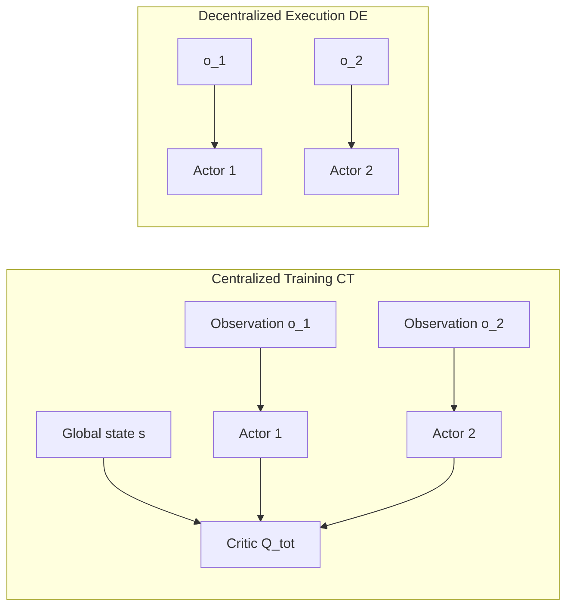

# 12.2 Multi-Agent Reinforcement Learning

[Section 12.1](./intrinsic-motivation-exploration) assumes a single agent whose challenge is to discover sparse rewards. When several agents learn simultaneously, another difficulty appears: from the perspective of any one agent, the policies of the other agents keep changing, so the consequences of the same action also change.

This section first formalizes this nonstationarity, then introduces how CTDE separates training information from execution information, derives MADDPG's centralized critic, and finally examines how MAPPO stabilizes multiple policies with PPO's clipped update.

<OnlineTraining studios="multiagent" compact />

## 1. Why Multiple Agents Make the Environment Nonstationary

When several agents learn simultaneously in one environment, the next state from agent $i$'s perspective depends not only on its own action $a_i$, but also on the joint actions of the other agents, $a_{-i}$. After the other policies update, the next-state distribution may change even when $s$ and $a_i$ remain the same. Old data therefore become stale more quickly, and the learning target of independent Q-learning keeps moving.

### 1.1 From Normal-Form Games to Multi-Agent RL

The simplest multi-agent formalization is a **normal-form game**: the joint action is $a = (a_1, \ldots, a_n)$, and each agent has its own reward $r_i(a)$. A Nash equilibrium is a joint policy under which no agent can improve its expected payoff by changing its policy unilaterally. Game-theoretic solutions, however, assume rational opponents and a known model. Deep MARL must handle high-dimensional observations, unknown rewards, and opponents that are also learning.

## 2. Separating Training and Execution with CTDE

**Centralized Training with Decentralized Execution** is a practical compromise widely used in real systems. During training, the observations and actions of all agents are visible, so the critic can use global information. During execution, each agent sees only its own observation, so each actor must make decisions independently.

Formally, decentralized policy $\pi_i(a_i \mid o_i)$ depends only on local observation $o_i$, while centralized critic $Q_i^{\text{tot}}(s, a_1, \ldots, a_n)$ depends on the global state and joint action. This satisfies two constraints:

- **Rich training signals**: the critic observes the global state, reducing the nonstationarity caused by treating opponents as part of the environment.
- **Feasible execution**: each actor observes only local information, so deployment in a physical multi-agent system does not require communication.



Three common classes of CTDE methods are value-decomposition methods such as VDN and QMIX, actor-critic methods such as MADDPG and MAPPO, and explicit-communication methods such as CommNet and TarMAC. We next examine two representative actor-critic methods.

## 3. Learning a Centralized Critic with MADDPG

### 3.1 How Each Agent Updates Its Actor

Multi-Agent DDPG (Lowe et al. 2017) extends DDPG directly to the multi-agent setting. Each agent $i$ has its own actor $\mu_{\theta_i}(o_i)$ and a centralized critic $Q_i(o_1,a_1,\ldots,o_n,a_n)$. To update actor $i$, we need to know how the critic's predicted return changes when that agent slightly changes its action. The chain rule gives

$$\nabla_{\theta_i} J(\mu_{\theta_i}) = \mathbb{E}\left[\nabla_{\theta_i} \mu_{\theta_i}(o_i) \cdot \nabla_{a_i} Q_i(o_1, a_1, \ldots, o_n, a_n)\big|_{a_i = \mu_{\theta_i}(o_i)}\right]$$

The first term on the right describes how a parameter change alters the actor's output; the second describes how an action change alters the critic's estimate. Their product propagates the critic's evaluation back to the actor. When updating actor $i$, differentiation is performed only with respect to $a_i$; the other actions are known conditions in the batch. The critic's input grows with the number of agents, making this formulation expensive when many agents are present.

```python
class MADDPG:
    def __init__(self, n_agents, obs_dim, action_dim):
        # Each agent has one actor and one centralized critic.
        self.actors = [Actor(obs_dim, action_dim) for _ in range(n_agents)]
        self.critics = [Critic(n_agents * (obs_dim + action_dim), 1)
                        for _ in range(n_agents)]

    def update(self, batch):
        obs, actions, rewards, next_obs = batch  # Trajectories of all agents.
        for i in range(self.n_agents):
            # Centralized critic target: next actions from all agents.
            next_actions = [self.actors_target[j](next_obs[j])
                            for j in range(self.n_agents)]
            target_q = self.critics_target[i](
                torch.cat([*next_obs, *next_actions], -1))
            y = rewards[i] + self.gamma * target_q
            # Fit the critic to y.
            current_q = self.critics[i](
                torch.cat([*obs, *actions], -1))
            critic_loss = F.mse_loss(current_q, y.detach())

            # Differentiate the actor only through its own action.
            pred_action_i = self.actors[i](obs[i])
            all_actions = list(actions)
            all_actions[i] = pred_action_i
            actor_loss = -self.critics[i](
                torch.cat([*obs, *all_actions], -1)).mean()
            ...
```

MADDPG has two weaknesses: (1) the input dimension of the centralized critic grows rapidly with the number of agents and becomes impractical for dozens of agents; and (2) it inherits all stability problems of the DDPG family (see [Chapter 9](../chapter11_continuous_control/td3-sac#stability-improvements-for-ddpg)).

## 4. Stabilizing Multiple Policies with MAPPO

Multi-Agent PPO (Yu et al. 2022) extends PPO's on-policy actor-critic method to CTDE: each agent has a decentralized actor $\pi_{\theta_i}(a_i \mid o_i)$, while all agents share a centralized critic $V_\phi(s)$, or a $Q_\phi$ that also takes the joint action as input. PPO's clipped objective is well suited to the multi-agent setting because each agent computes its own policy ratio $\pi_{\theta_i}/\pi_{\theta_i}^{\text{old}}$, and clipping prevents one agent's policy from changing so far that the joint distribution collapses.

```python
def mappo_update(actors, critic, buffer, n_agents, clip_eps=0.2):
    for epoch in range(E):
        for batch in buffer.iter():
            s, obs_list, a_list, old_logp_list, adv, ret = batch
            # Centralized critic: estimate V(s).
            values = critic(s)
            new_logp_list = [log_prob(actors[i](obs_list[i]), a_list[i])
                             for i in range(n_agents)]
            for i in range(n_agents):
                ratio = (new_logp_list[i] - old_logp_list[i]).exp()
                s1 = (ratio * adv[i]).mean()
                s2 = torch.clamp(ratio, 1 - clip_eps, 1 + clip_eps) * adv[i]
                policy_loss = -torch.min(s1, s2).mean()
                entropy_bonus = -new_logp_list[i].mean()
                update(actors[i], policy_loss + 0.01 * entropy_bonus)
            value_loss = F.mse_loss(values, ret)
            update(critic, value_loss)
```

Because MAPPO is stable and straightforward to implement, it is often used as a strong baseline for cooperative multi-agent tasks:

- **Stability**: PPO clipping is more robust than DDPG's off-policy updates.
- **Hyperparameter reuse**: similar configurations work for tasks such as _StarCraft Multi-Agent Challenge_, _Hanabi_, and _Multi-Agent MuJoCo_.
- **Scalability**: the critic is shared and actors can be trained in a distributed manner, which suits large clusters.

### 4.1 Comparing Common CTDE Algorithms

| Algorithm                  | Critic input                         | Actor input | On/off-policy | Representative tasks                |
| -------------------------- | ------------------------------------ | ----------- | ------------- | ----------------------------------- |
| IQL (independent learning) | $o_i$                                | $o_i$       | off           | Weak baseline                       |
| VDN / QMIX                 | $s$ (linear/monotonic decomposition) | $o_i$       | off           | Cooperative tasks                   |
| MADDPG                     | $(o_1,a_1,\ldots,o_n,a_n)$           | $o_i$       | off           | Mixed cooperative-competitive tasks |
| MAPPO                      | $s$                                  | $o_i$       | on            | SMAC, Hanabi                        |

### 4.2 What Problem Does Value Decomposition Solve?

VDN assumes $Q_{\text{tot}} = \sum_i Q_i(o_i, a_i)$. QMIX generalizes this by making $Q_{\text{tot}}$ a monotonic function of the individual $Q_i$ values, ensuring that $\arg\max$ can be decomposed. These are also CTDE methods, but they belong to the value-decomposition branch and are outside this chapter's main line. MAPPO has surpassed QMIX on most cooperative tasks.

## Section Summary

The central difficulty in multi-agent RL is nonstationarity: changes in the policies of other agents alter the transitions observed by an individual agent. CTDE allows the critic to use global information during training while each actor still makes independent decisions during execution. MADDPG uses off-policy deterministic updates, whereas MAPPO uses on-policy clipped updates. MAPPO is commonly used as a strong baseline for cooperative tasks such as multi-agent micromanagement in StarCraft.

The next section, [12.3 Hierarchical Reinforcement Learning and World Models](./hierarchical), addresses long-horizon tasks and explains how high-level subgoals and low-level actions shorten the distance over which rewards must propagate.
