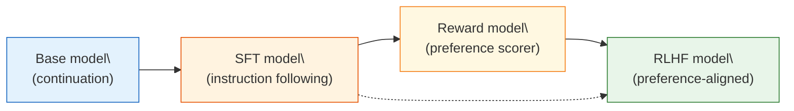

# 8.1 From Base Model to Aligned Assistant

## Reading Guide

**Core points**

- Understand why the pretraining objective produces a strong continuation model, but not a reliable assistant.
- Rewrite LLM generation as a sequential decision problem: what are the states, actions, policy, and reward?
- Separate what SFT solves from what RLHF solves: one teaches the behavioral format; the other adjusts preference boundaries.

**Core formulas**

$$
\mathcal{L}_{LM}(\theta) = -\sum_{t=1}^{T}\log \pi_\theta(x_t \mid x_{<t})
\quad \text{(pretraining objective: next-token prediction)}
$$

$$
\pi_\theta(a_t \mid s_t) = P_\theta(y_t \mid x, y_{<t})
\quad \text{(LLM policy: choose the next token in context)}
$$

$$
R(x,y) \approx \text{human preference}(x,y)
\quad \text{(RLHF reward: how humans judge the whole answer)}
$$

> Keep one sentence in mind:
>
> A base model learns "how text usually continues on the internet"; an assistant must learn "how to respond responsibly to a user request."

In Chapter 7, we clarified PPO as a stability-oriented policy optimization algorithm: do not update too far in one step, so you use clipping, advantage estimation, and KL regularization. Now we want to apply the same toolkit to large language models.

But before we write any PPO code, we need to answer a more basic question:

Why is a pretrained model that writes fluent text still not a stable assistant?

This looks like a product question, but it is really a training-objective question.

## The Pretraining Objective Is "Continuation," Not "Assistance"

During pretraining, a language model sees massive corpora of natural text. The learning task is simple: given the previous tokens, predict the next token.

That objective is powerful enough to induce grammar, knowledge, code patterns, and even some reasoning behaviors. But it does not explicitly teach:

- "This input is an instruction, so I should answer it."
- "If I do not know, I should say I do not know."
- "I should follow a requested output format reliably."
- "I should refuse harmful requests."

To make this concrete, consider a prompt:

```text
Please explain what reinforcement learning is in three sentences.
```

From an assistant perspective, the right behavior is obvious: produce exactly three sentences.

From a base model perspective, this prompt is just a prefix of text. In the wild, it might be followed by a textbook paragraph, a forum reply, an exam question, another user's continuation, or a chat transcript.

All of these are plausible continuations under the pretraining objective, but not all are good assistant behavior.

## RLHF as a Three-Step Transformation

You can view RLHF as a pipeline that gradually turns a continuation model into a preference-aligned assistant:



This diagram is not just for show. Each arrow corresponds to a specific artifact: data, model checkpoints, and evaluation reports.

## The Base Model Objective in One Equation

If a text sequence is $x_1, x_2, \ldots, x_T$, the standard language-model objective is:

$$
\mathcal{L}_{LM}(\theta)
= -\sum_{t=1}^{T}\log \pi_\theta(x_t \mid x_1,\ldots,x_{t-1}).
$$

Read in plain words:

Given the prefix, assign high probability to the next token that appears in the dataset.

This objective does not distinguish user vs assistant roles, and it does not encode helpfulness, honesty, safety, or formatting constraints. It learns a distribution over text.

## Rewriting Generation as an MDP

In Chapter 3 we described RL problems with an MDP. LLM generation fits the same template, but the objects are token-based.

| MDP element         | Classic RL example            | LLM generation counterpart                    |
| ------------------- | ----------------------------- | --------------------------------------------- |
| state $s_t$         | CartPole positions/velocities | prompt plus generated prefix: $(x, y_{<t})$   |
| action $a_t$        | push left/right               | pick the next token $y_t$ from the vocabulary |
| policy $\pi_\theta$ | network over actions          | next-token distribution from the LM           |
| transition $P$      | physics updates state         | append the chosen token to the context        |
| reward $R$          | survival, score               | human preference or a reward model score      |
| episode             | one game                      | one response, until EOS or length limit       |

There is a crucial difference from CartPole: the "environment transition" is almost deterministic. If you output token `reinforcement`, the next state is just the old context plus `reinforcement`.

The real difficulty is that the reward usually arrives late: humans judge the full answer, not each token. This creates an extreme credit assignment problem.

## A Minimal Probe: Does the Base Model Behave Like an Assistant?

A practical way to see the gap is to probe a base model with a fixed prompt set and check for stability across samples.

```python
# ==========================================
# Probe whether a base model behaves like an assistant
# ==========================================
from transformers import AutoModelForCausalLM, AutoTokenizer

model_name = "HuggingFaceTB/SmolLM2-360M"
tokenizer = AutoTokenizer.from_pretrained(model_name)
model = AutoModelForCausalLM.from_pretrained(model_name, device_map="auto")

prompts = [
    "Explain reinforcement learning in three sentences.",
    "Output JSON with fields name and reason.",
    "If you do not know the answer, say you do not know: who will win the 2029 Nobel Prize in Physics?",
]

for prompt in prompts:
    inputs = tokenizer(prompt, return_tensors="pt").to(model.device)
    outputs = model.generate(
        **inputs,
        max_new_tokens=120,
        do_sample=True,
        temperature=0.7,
        top_p=0.9,
    )
    print("=" * 80)
    print(tokenizer.decode(outputs[0], skip_special_tokens=True))
```

Do not judge the model by "did it mention some relevant terms." Judge it by assistant-oriented behaviors:

| Dimension             | Typical base-model failure                | What post-training aims to fix          |
| --------------------- | ----------------------------------------- | --------------------------------------- |
| instruction following | continues the prompt instead of answering | consistently responds to user intent    |
| formatting            | asked for JSON but outputs prose          | stable structured outputs when required |
| honesty               | guesses when it does not know             | can admit uncertainty or refuse         |
| safety                | weak boundaries on harmful requests       | refusal behavior and safe redirection   |
| helpfulness           | vague, scattered, generic                 | concrete, structured, actionable        |
| tone                  | sounds like scraped text                  | stable assistant voice                  |

The key word is **stability**. A model that answers correctly once is not yet an assistant. Users need reliability across prompt varieties and sampling noise.

## What the Three Model Versions Each Learn

This chapter will always compare three versions: Base, SFT, and RLHF. They are not simply "progressively larger." They differ in their optimization objectives.

| Version    | Training Signal          | What It Learns                                 | Main Risk                                          |
| ---------- | ------------------------ | ---------------------------------------------- | -------------------------------------------------- |
| Base model | next-token prediction    | language, knowledge, style, code patterns      | unstably continues text, may not answer at all     |
| SFT model  | instruction-answer pairs | answering in format, imitating good exemplars  | only imitates; cannot judge which answer is better |
| RLHF model | preference reward + PPO  | closer to human preferences, fewer bad answers | reward hacking, capability regression, sycophancy  |

The SFT training objective is:

$$
\mathcal{L}_{SFT}(\theta) = -\sum_{t=1}^{T}\log \pi_\theta(y_t \mid x, y_{<t})
$$

This looks similar to pretraining, but the data distribution has changed: the input is a user instruction $x$, and the target output is a human-written (or high-quality model-written) assistant answer $y$. SFT teaches the model "how it should answer."

RLHF goes one step further: instead of giving the model one correct answer, it tells the model "which of two answers is better." This corresponds to preference learning and reward modeling. Finally, PPO uses the reward model's scores to continue optimizing the policy.

## Why RLHF After SFT?

SFT can already make a base model look very much like an assistant. Why add RLHF? There are four reasons.

**First, SFT only imitates single demonstrations; it does not directly learn preference boundaries.**
One prompt may have many acceptable answers. SFT tells the model "this demonstration is worth learning," but not "what makes this answer better than that one." Preference data is better at expressing nuances: accurate but cold vs. friendly but vague, concise but missing key points vs. detailed but verbose.

**Second, SFT data cannot cover all mistakes the model itself will make.**
During SFT training, the model only sees human demonstrations; at deployment, it generates its own answers. Once it wanders outside the region covered by demonstration data, distribution shift can occur. RLHF lets the model receive reward feedback on its own generated answers, correcting the regions it actually visits.

**Third, many objectives are hard to express as a single correct answer.**
"More helpful," "more honest," "safer," "better tone" — these objectives are difficult to capture with exact labels, but humans can more easily compare which of two answers is better. RLHF exploits precisely this comparative ability.

**Fourth, SFT can learn surface formatting.**
The model may learn "answer in bullet points" or "be polite," without truly learning "high information density," "don't hallucinate," or "refuse risky requests." Preference training can pull these quality dimensions back into the objective function.

## Completion, Answering, and Alignment

Suppose the prompt is:

```text
Explain the KL penalty in PPO for beginners, in under 100 words.
```

The three models might behave as follows:

| Model | Typical Output                                                                                                                                                                    | Issue or Strength                                      |
| ----- | --------------------------------------------------------------------------------------------------------------------------------------------------------------------------------- | ------------------------------------------------------ |
| Base  | "Explain the KL penalty in PPO for beginners, in under 100 words. PPO is a reinforcement learning algorithm..."                                                                   | May repeat the prompt; may not respect length          |
| SFT   | "The KL penalty is like a safety rope that stops the new policy from straying too far from the old one. The farther it goes, the bigger the penalty, so training is more stable." | Basically acts like an assistant; follows requirements |
| RLHF  | "The KL penalty deducts 'how much you deviated from the old policy' from the reward. It is a safety rope: PPO can improve without suddenly becoming a different model."           | Closer to preference; clearer analogy                  |

This example shows that RLHF does not necessarily make the model "know more." It mainly shifts the model's selection preferences. The model could already generate good answers, but their probability was not high enough; RLHF makes it more likely to choose the kind of answer humans prefer.

## Choosing the Base Model for Experiments

For teaching experiments, start with small models. The goal is not to train a strong assistant, but to understand every component of RLHF.

| Model                        | Why It Fits                                                       |
| ---------------------------- | ----------------------------------------------------------------- |
| `HuggingFaceTB/SmolLM2-360M` | Small, suitable for running the full pipeline                     |
| `Qwen/Qwen2.5-0.5B`          | Better Chinese performance; easy to observe instruction following |
| `EleutherAI/pythia-410m`     | Classic small base; helps understand base-to-SFT changes          |

Do not jump straight to 7B or 70B. RLHF has four model roles: Actor, Reference, Reward Model, and Critic. The larger the model, the easier it becomes to confuse "I don't understand the algorithm" with "the system won't run."

This chapter treats the pretrained model as an input artifact:

```text
Public base checkpoint
  -> Observe raw behavior
  -> SFT: train into an assistant starting point
  -> RM: train a preference judge
  -> PPO: continue optimizing with the judge's reward
  -> Eval: confirm real improvement
```

## Common Misconceptions

### Misconception 1: Base models are strong, so adding a chat prompt is enough

A chat prompt can improve formatting, but it cannot change the behavioral preferences stored in the model's parameters. It is like a temporary instruction manual, not training. It may suffice for simple tasks, but not for a stable product.

### Misconception 2: SFT is RLHF

SFT is supervised learning, not reinforcement learning. It trains the model with correct answers; RLHF trains the policy with preference rewards. Both are post-training, but the training signals differ.

### Misconception 3: RLHF gives the model new knowledge out of thin air

RLHF primarily shifts the model's selection tendencies within its existing capability space. It may make the model more willing to admit ignorance, less likely to produce bad formatting, and more often give helpful answers, but it is not the primary driver of knowledge injection. When new knowledge is needed, you still rely on pretraining, continued pretraining, retrieval augmentation, or high-quality SFT data.

### Misconception 4: Higher reward means a better model

The Reward Model is only an approximation of human preferences. The model may learn to please the RM rather than learn to truly answer better. The evaluation chapter later will address this problem specifically.

## Section Summary

The difference between a base model and an assistant is not "can it speak," but "is its optimization objective aligned." The base model optimizes next-token prediction, so it excels at continuation; an assistant needs to stably understand instructions, follow formatting, admit uncertainty, respect safety boundaries, and make humans prefer its output.

Next, we break this transformation into a standard RLHF pipeline: what inputs SFT, the Reward Model, PPO, and evaluation each receive, and what artifacts they produce — [Standard RLHF Pipeline](./standard-rlhf-pipeline).

## Exercises

1. Pick 5 prompts and test the same base model on each. Record which dimensions it fails to behave like an assistant.
2. Rewrite one of those prompt's outputs into a high-quality assistant answer. Mark which dimensions you changed: accuracy, formatting, tone, length, or safety.
3. Think: if you only used SFT on these 5 rewritten examples, what might the model learn? What would it fail to learn?
